# JupyterLab:程序员的笔记本


>  JupyterLab 使用户能够创建具有叙述性的文字，数学公式，可视化，交互控制等丰富的输出相结合生动的代码共享文档。它还为使用数据的交互式计算提供构建：文件浏览器，终端和文本编辑器。

# 安装（Mac）

官方提供了`conda`, `pip`, 和 `pipen` 的安装方式。其中 `conda` 被官方推荐为最佳的安装方式。

为了节省空间我们选择 Miniconda 进行JupyterLab的安装。

打开[官网](https://docs.conda.io/projects/conda/en/latest/user-guide/install/macos.html)后下载Miniconda installer for macOS，之后打开 terminal 运行以下命令

```
cd /你的下载目录
bash Miniconda3-latest-MacOSX-x86_64.sh
```

一行行代码跑完后需要设置一下环境变量，官方并不推荐把环境变量永久的加入 `.bashrc file` 文件里面，永久加入可能会造成一些错误。

每次需要使用conda的时候只需要在 terminal 里面输入

```
source $HOME/miniconda/bin/activate
```

即可载入conda的运行环境，输入conda后出现如下界面便说明安装成功

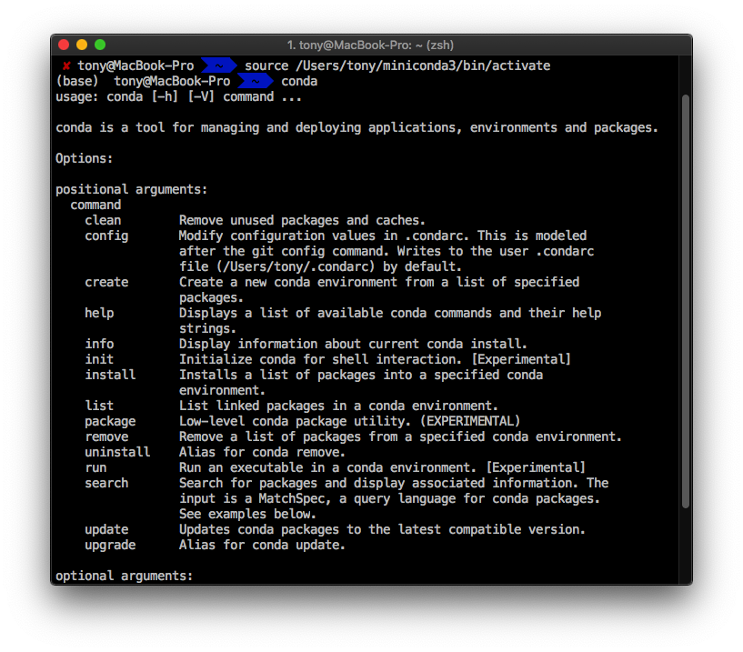


成功安装 conda 后输入以下命令便能够自动安装好 JupyterLab 了

```
conda install -c conda-forge jupyterlab
```

命令跑完后再次在终端输入

```
jupyterlab
```

出现以下界面，同时浏览器弹出对应窗口说明jupyterlab安装成功

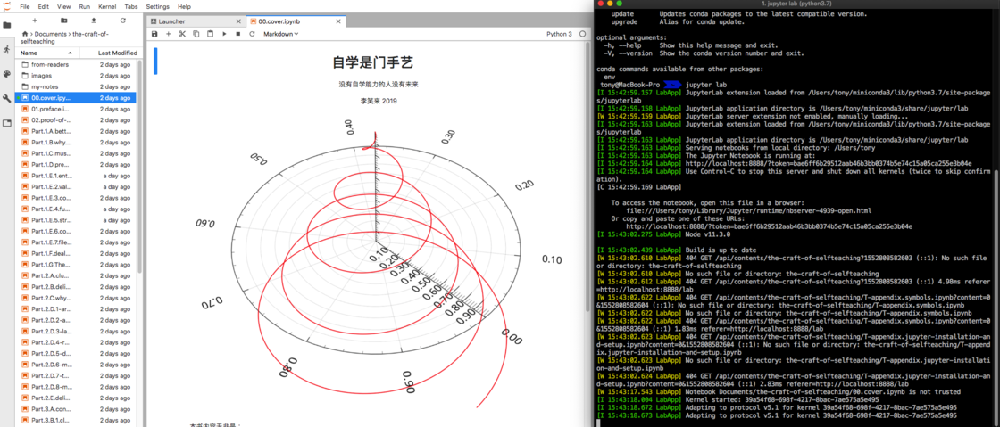


# 使用

### Launcher

打开左上角的  File > New Launcher  能够进入Launcher界面，根据每个人电脑的开发环境不同，显示的东西可能会有少许出入，这个界面把JupyterLab分成了三个部分，分别是Notebook（笔记本）  Console（控制台） 和 Other（其它）


### Notebook

点击Python3后出现如下界面，既然都叫 Notebook 了当然支持备受欢迎的Markdown。

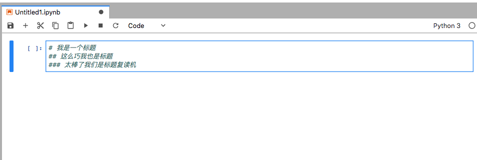


点击工具栏上的运行按钮▶️，同时把最右的code改为markdown，即可显示markdown处理后的富文本形式。


当然JuypterLab本身还是一个python的编译器，同样也能够正常显示和输入python，作为学习python 的动态笔记本，能够实时反馈你的python语句的结果

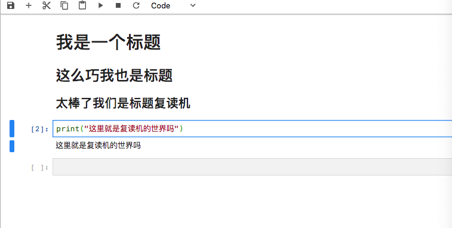


这里还有一个小技巧，JuypterLab支持自动补全，输入函数的时候按下 `Tab` 按钮能够自动补全函数

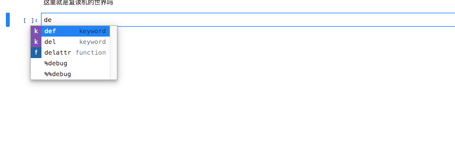


如果想重新运行某个语句的结果，可以按下 `shift+enter` 或是 `ctrl+enter    `


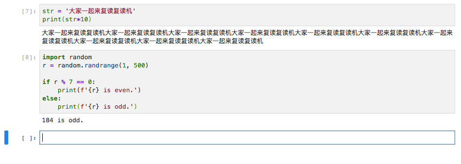


由图可见两次生成的结果并不相同。

如果想要在原有的两行之间插入一行，可以使用快捷键 `esc + a` ，效果如下

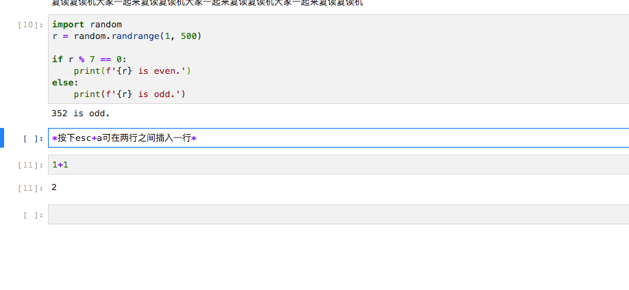


如果忘记了某个函数的用法，按下 `shift+tab` 可以出现当前函数的用法，类似于pycharm

~~使用shift+tab时无法使用mac的截图快捷键，所以拿相机拍了一张，请大家谅解渣画质~~

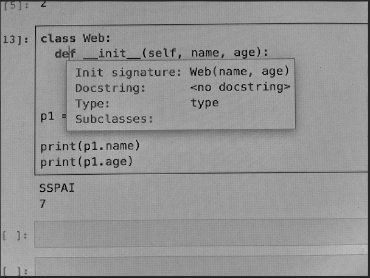


### Console

Console的本质为python终端，输入一条语句就会给出相应的输出，类似于 Python 原生的IDE，不做过多介绍

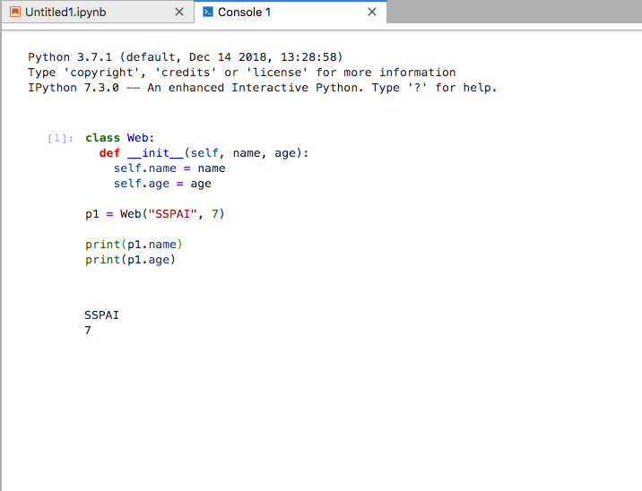


### 其他

善用Jupyter还能达到以下图片效果（图片均源自网络）辅助数据分析及机器学习


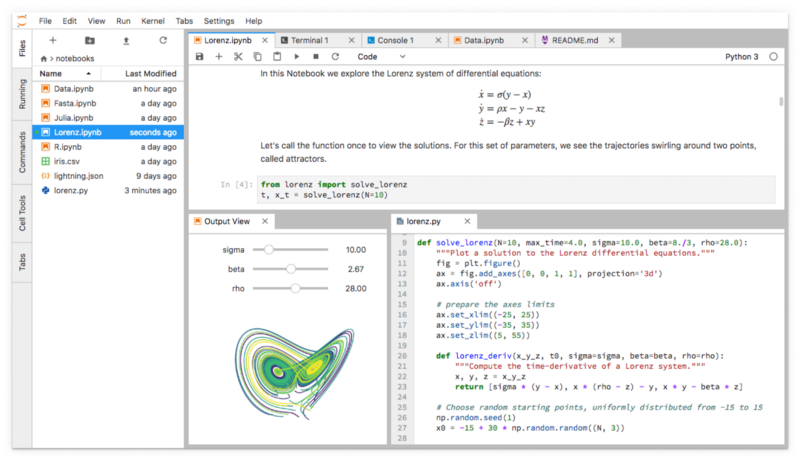


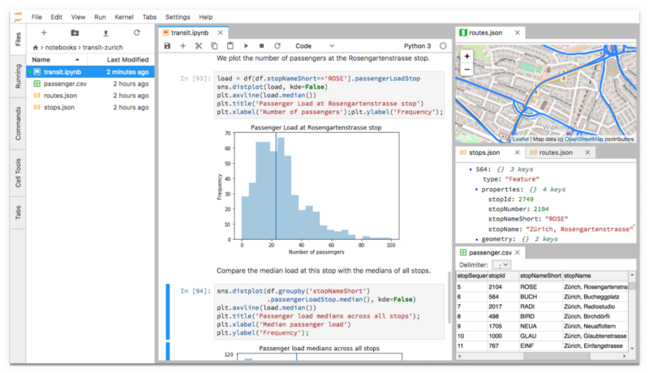

# 总结

Jupyter现在支持包括Python在内100多种编程语言（部分需要安装插件才能正常显示），GitHub上有超过170万个使用Jupyter的笔记。

随着数据科学和机器学习的快速发展以及开源软件在工业界和学术界的日益普及，Jupyter Lab 已经不仅仅是专业人士能够使用的工具，作为初学Python的未来程序员，使用时能够得到许多的正向反馈，一本生动有趣的笔记能够给枯燥的学习增添足够的乐趣。

扩展阅读：


- [the-craft-of-selfteaching](https://github.com/selfteaching/the-craft-of-selfteaching) （李笑来使用Jupyter撰写的一本如何自学的书）
- [Machine Learning Notebooks](https://github.com/ageron/handson-ml) （机器学习笔记）
- [PythonDataScienceHandbook](https://github.com/jakevdp/PythonDataScienceHandbook) （Python数据科学分析）