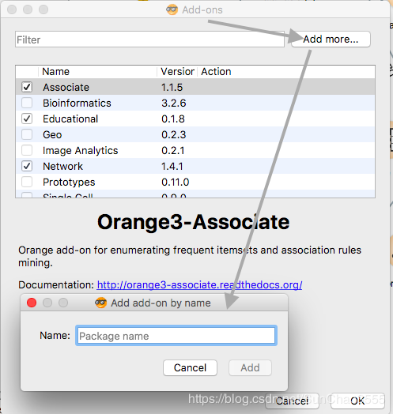
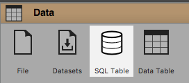
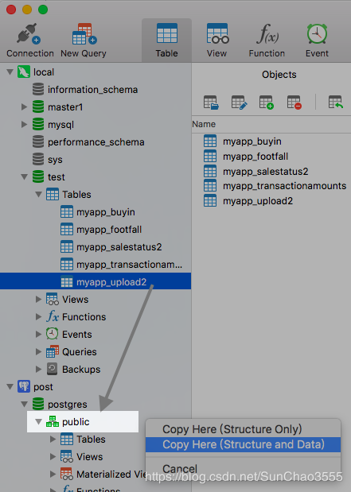
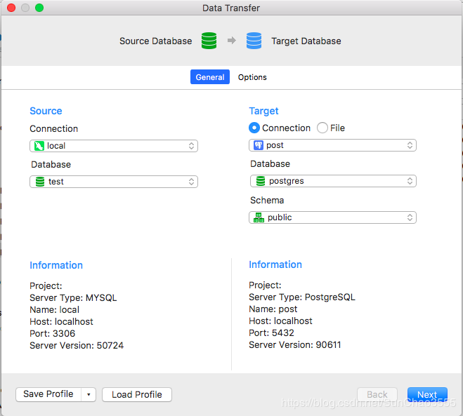

# Orange数据挖掘工具介绍

​                                                   2018年12月12日 16:56:50           [SunChao3555](https://me.csdn.net/SunChao3555)           阅读数：1194                                                                  

​                   

​                                                                         版权声明：本文为博主原创文章，未经博主允许不得转载。          https://blog.csdn.net/SunChao3555/article/details/84975783        

Orange3 使用
 一、Orange3数据挖掘工具的介绍
        官方网址：<https://orange.biolab.si/>
         正如首页介绍的那样：它是一个面向新手和专家的开源的机器学习和数据可视化工具，带有很多用于数据挖掘或机器学习模型的交互式数据分析工作流程；另外，它绑定了Python语言进行脚本开发。包含一系列数据挖掘流程的组件，比如数据预处理，建模，模型评估以及可视化。
        数据预处理主要包括：数据合并（将两个不同数据集的指定特征合并为同一数据集）；数据采样，数据异常点去除以及相关性检验（协方差），rank以及置乱等
        模型主要包括：CN2规则归纳，k近邻，决策树，随机森林，支持向量机，线性回归，逻辑回归，朴素贝叶斯，adaboost，神经网络，随机梯度下降等
         无监督模型有：距离矩阵，t-SNE，层次聚类，K-means，louvain聚类，PCA，MDS等
         另外，还支持文本分析，词云可视化等
         模型评估主要有：交叉检验，混淆矩阵，ROC曲线，lift曲线等
 二、Orange get started
     1.官网下载最新版本Orange并安装（没有其他复杂操作，直接下一步即可，若想修改安装位置可自定义修改）
         说明：Orange自带最新或最近版本的Python环境，对于复杂的数据集，若Orange自带组件处理不便时，通常先将文件数据连接至<Python   Script>，通过Python处理后再转换成Orange.Tabel()形式进行后续操作，具体的使用Python进行处理的方法及代码可参考官方文档：
<http://docs.orange.biolab.si/3/data-mining-library/tutorial/data.html>
        另外，该文档还包括一系列使用Python（Orange）进行数据挖掘的一系列编程教程。想要深入了解并掌握Orange  Python进行数据挖掘需要花时间仔细阅读并联系，这里不再赘述。【当然，如果你已经安装了Python3以上版本，你也可以直接pip  install Orange3使用Python shell进行编程（前提是你已经对Orange的数据结构及相关函数比较熟悉），官方文档：<http://docs.orange.biolab.si/3/data-mining-library/#tutorial>】
     2.Orange软件的使用
     准备工作：
     （1）添加附加组件：你需要在Options中找到Add-ons

     
   

点击后会弹出下图所示窗口，

其中Filter栏是Orange自带的部分组件（打对勾的为已下载，可根据需要自行下载）；如果想安装其他组件，可如下图所示点击Add more，输入要下载的包名【类似Python pycharm添加Python包的步骤】

​    （2）对于Orange的简单操作，官方文档：<https://orange.biolab.si/getting-started/>，给出了许多数据挖掘分析的一些例子，具体的可以在打开Orange3软件后，弹出如下图所示面板，点击Examples，

​    3.细节描述

    
     如上图所示，SQL  Table为连接数据库的组件，但对于首次安装Orange的用户，点击后，右侧栏中该图标会出现红色三角符号，点击会提示错误，please  install a backend to use this widget，即缺少SQL的编译器【Orange只支持PostgreSQL和SQL  Server两种数据库】
     这里重点说明一下Orange连接PostgreSQL数据库的操作：
     （1）首先，需要下载PostgreSQL的配置文件psycopg2
         这里给出解决办法，<https://blog.biolab.si/2018/02/16/how-to-enable-sql-widget-in-orange/>
         这里为Python3.6版本，也可去<https://pypi.org/>搜索psycopg2找到对应版本下载
         MacOS下载
         <https://pypi.python.org/packages/8c/a5/0e61d6f4a140a6e06a9ba40266c4b49123d834f1f97fe9a5ae0b6e45112b/psycopg2-2.7.4-cp36-cp36m-macosx_10_6_intel.macosx_10_9_intel.macosx_10_9_x86_64.macosx_10_10_intel.macosx_10_10_x86_64.whl#md5=1f2b2137c65dc50c16b341774cd822eb>
         Windows下载：<https://pypi.python.org/packages/f9/77/e29b792740ddec37a2d49431efa6c707cf3869c0cc7f28c7411bb6e96d91/psycopg2-2.7.4-cp36-cp36m-win_amd64.whl#md5=119eb3ab86ea8486ab10ef4ea3f67f15>
         Linux下载：<https://pypi.python.org/packages/92/15/92b5c363243376ce9cb879bbec561bba196694eb663a6937b4cb967e230e/psycopg2-2.7.4-cp36-cp36m-manylinux1_x86_64.whl#md5=8288ce1eedf0b70e5f1d8c982fad5a41>
     （2）下载完成后，打开上述Add-ons，将该.whl文件拖拉至组件栏中，会看到Psycopg已经安装，此时SQL widget依然不能使用，因为还未安装PostGreSQL数据库，
      下载地址为：https://www.postgresql.org/，下载对应系统的版本并安装，安装的过程与MySQL类似，需要编辑用户名和密码（务必记住），另外，对于PostgreSQL的界面化管理工具可选用最近版本的Navicate  Premium，另外，PostgreSQL是一款强大的开源数据库，想要详细了解可查阅：<http://www.postgresqltutorial.com/>，或搜索相关博客。
     反之，你只想简单的用作连接Orange的插件，则在Navicate Premium中可直接将MySQL数据库中的表直接拖拽复制到PostgreSQL数据库中，
 【注：直接将不属于PostgreSQL的数据库文件导入PostgreSQL会报错（比如：ERROR: unrecognized  configuration parameter "foreign_key_checks" , Time:  0.0，因为不同数据库存储数据的格式，结构不同）】
 如下图所示，

 然后，选择Copy Here（Structure and Data）,弹出下图（右）所示界面，点击next。。。

 当然，也可使用同样的方法将PostgreSQL中的表复制到MySQL中。
 到此，准备工作基本完成。
 对于每个组件的使用，可参考官方文档<http://docs.biolab.si/3/visual-programming/index.html>。也
 可点击工具后，点击‘？’号，如下图所示

 下面是Python Script在整个项目中的大致位置。

<iframe scrolling="no" src="https://pos.baidu.com/s?hei=104&amp;wid=900&amp;di=u3501897&amp;ltu=https%3A%2F%2Fblog.csdn.net%2Fsunchao3555%2Farticle%2Fdetails%2F84975783&amp;psi=2f524dc5df3baa61578bc73163474f58&amp;col=zh-CN&amp;ant=0&amp;cja=false&amp;cdo=-1&amp;dtm=HTML_POST&amp;ccd=24&amp;par=2560x999&amp;pcs=1354x901&amp;drs=1&amp;chi=1&amp;prot=2&amp;ps=5541x381&amp;dai=4&amp;tlm=1559966464&amp;cec=UTF-8&amp;cfv=0&amp;dc=3&amp;pis=-1x-1&amp;dis=0&amp;cpl=1&amp;pss=1354x12741&amp;ari=2&amp;cce=true&amp;cmi=2&amp;exps=111000,119008,110011&amp;ltr=https%3A%2F%2Fwww.baidu.com%2Flink%3Furl%3D8ON0GGD6zFSA1ncKtsA2MlUh8xKr8n8e3Oms6-cfab17MbpVkrOLnYSsEnxvmaYJp1e4QIFDrr2uud5ub4afYNYN4rMn3k5GeYnxnksilVK%26wd%3D%26eqid%3Dce6465080017195d000000045cfa49f3&amp;tcn=1559966465&amp;ti=Orange%E6%95%B0%E6%8D%AE%E6%8C%96%E6%8E%98%E5%B7%A5%E5%85%B7%E4%BB%8B%E7%BB%8D%20-%20SunChao3555%E7%9A%84%E5%8D%9A%E5%AE%A2%20-%20CSDN%E5%8D%9A%E5%AE%A2&amp;dri=0&amp;psr=2560x1080&amp;tpr=1559966464644" width="900" height="104" frameborder="0"></iframe>

 			[ 				 			](https://me.csdn.net/u011535356) 		

 			 			 			 		

 		

####  				使用*Orange*进行*数据挖掘*之分类(3)------决策树		

 				 				 					阅读数  					8104 				

 			[ 				决策树决策树基本决策树类似流程图，内部节点表示在一个属性的上的测试，比如age属性是否大于30等，每个分支代表一个属性测试的输出，最下层的叶子节点代表具体的类。下面是《数据挖掘：概念与技术》上的例子，... 			](https://blog.csdn.net/yiweis/article/details/8464344) 			 									博文 											[来自：	 Aaron的自留地](https://blog.csdn.net/yiweis) 												 		

####  				完成 *Orange*3 *数据挖掘* 汉化版		

 				 				 					阅读数  					173 				

 			[ 				几经折腾，终于完成Orange3数据挖掘新版的汉化工作！需要合作的加Q：726008，Orange3群：681586766... 			](https://blog.csdn.net/err2008/article/details/89000962) 			 									博文 											[来自：	 err2008的专栏](https://blog.csdn.net/err2008) 												 		

 		[ 		 				*orange*3 代码模式		](https://blog.csdn.net/weixin_34138056/article/details/88138051)