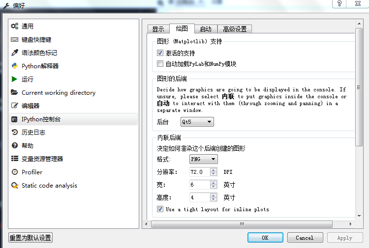

# Spyder官方文档地址

------

[http://pythonhosted.org/spyder/](https://link.jianshu.com?t=http%3A%2F%2Fpythonhosted.org%2Fspyder%2F)

---

---

---

# Spyder使用IPython弹出绘图窗口的设置方法

​              

​             [威列治卡农](https://www.jianshu.com/u/4901ef35e5b4)                          

​                                               2018.12.17 16:55*               字数 86             阅读 572评论 0喜欢 1

在IPython窗口绘制的图不能实时刷新，且显示图形较小，可以将其设置为弹窗显示的方式。

将其设置为弹出窗口显示的方法：

设置——IPython控制台——绘图——后台选择为Qt5——点击ok——重启Spyder 即可。

设置界面

---

##	 180705 利用QDarkStyleSheet修改Spyder暗系主题护眼配色

【MAC】权声明：本文为博主原创文章，转载请注明出处。        

  https://blog.csdn.net/qq_33039859/article/details/80923587        

[Github-Add a Spyder dark theme](https://github.com/spyder-ide/spyder/issues/2350)

---

##  [[程序分享\]](https://bbs.pinggu.org/forum.php?mod=forumdisplay&fid=436&filter=typeid&typeid=2605) [python-Spyder主题更改](https://bbs.pinggu.org/thread-6126957-1-1.html)  [[推广有奖\]](https://bbs.pinggu.org/thread-6126957-1-1.html)

