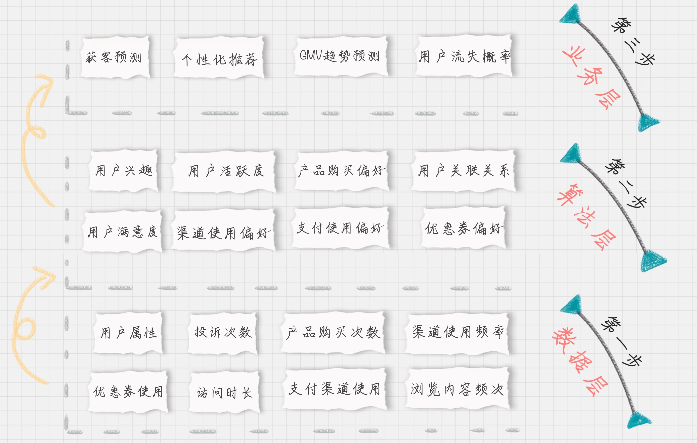
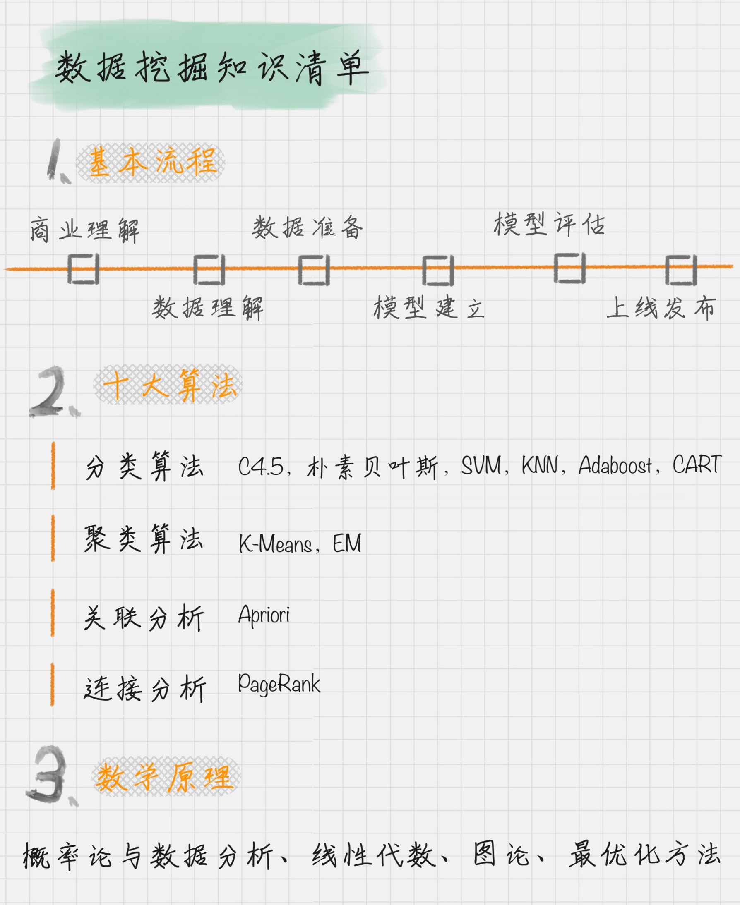
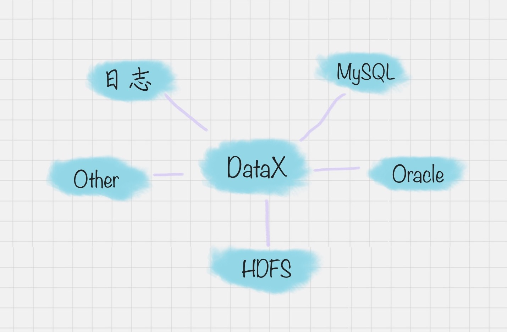
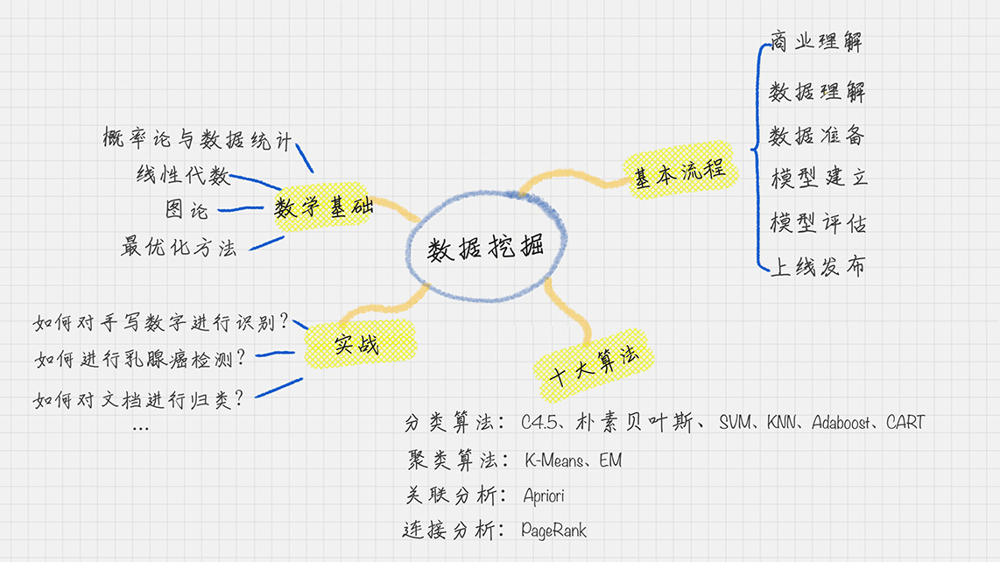
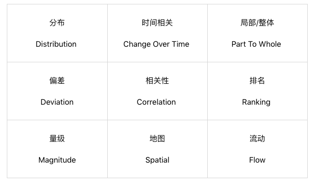

# 01丨数据分析全景图及修炼指南

陈旸 2018-12-18





09:19

讲述：陈旸 大小：8.55M

<audio title="01丨数据分析全景图及修炼指南" src="https://res001.geekbang.org/media/audio/af/41/af26f7ef28052417304d5cde188cef41/hd/hd.m3u8"></audio>

今天我们的学习正式开始，我想先给你一张数据分析的全景图，让你对后面的学习做到心中有数。

现在，你已经知道了数据分析在现代社会中的重要地位。掌握数据，就是掌握规律。当你了解了市场数据，对它进行分析，就可以得到市场规律。当你掌握了产品自身的数据，对它进行分析，就可以了解产品的用户来源、用户画像等等。所以说数据是个全新的视角。数据分析如此重要，它不仅是新时代的“数据结构  + 算法”，也更是企业争夺人才的高地。

## 当我们谈论数据分析的时候，都在讲些什么呢？

这里我可以把数据分析分成三个重要的组成部分。

1. **数据采集**。它是我们的原材料，也是最“**接地气**”的部分，因为任何分析都要有数据源。
2. **数据挖掘**。它可以说是最“**高大上**”的部分，也是整个商业价值所在。之所以要进行数据分析，就是要找到其中的规律，来指导我们的业务。因此**数据挖掘的核心是挖掘数据的商业价值，也就是我们所谈的商业智能 BI**。
3. **数据可视化**。它可以说是数据领域中**万金油**的技能，可以让我们直观地了解到数据分析的结果。


下面我来一一为你讲解一下这三个重要的部分。

## 数据采集


那么，从数据采集角度来说，都有哪些数据源呢？我将数据源分成了以下的四类。

### 如何使用开放数据源


###	如何使用爬虫做抓取

1. 使用**Requests 访问页面**爬取内容。我们可以使用 Requests 库来抓取网页信息。Requests 库可以说是 Python 爬虫的利器，也就是 Python 的 HTTP 库，通过这个库爬取网页中的数据，非常方便，可以帮我们节约大量的时间。
2. 使用 **XPath 定位** 解析内容。XPath 是 XML Path 的缩写，也就是 XML 路径语言。它是一种用来确定 XML 文档中某部分位置的语言，在开发中经常用来当作小型查询语言。XPath 可以通过元素和属性进行位置索引。
3. 使用 Pandas 保存数据。Pandas 是让数据分析工作变得更加简单的高级数据结构，我们可以用 Pandas 保存爬取的数据。最后通过 Pandas 再写入到 XLS 或者 MySQL 等数据库中。

Requests、XPath、Pandas 是 Python 的三个利器。当然做 Python 爬虫还有很多利器，比如 **Selenium，PhantomJS**，或者用 Puppteteer 这种无头模式。


**Scrapy**  是一个 Python 的爬虫框架，它依赖的工具比较多，所以在 pip install 的时候，会安装多个工具包。scrapy  本身包括了爬取、处理、存储等工具。在 scrapy 中，有一些组件是提供给你的，需要你针对具体任务进行编写。比如在 item.py  对抓取的内容进行定义，在 spider.py 中编写爬虫，在 pipeline.py 中对抓取的内容进行存储，可以保存为 csv  等格式。这里不具体讲解 scrapy 的使用。

***Puppeteer*** 是个很好的选择，可以控制 Headless  Chrome，这样就不用 Selenium 和 PhantomJS。与 Selenium 相比，Puppeteer 直接调用 Chrome 的  API 接口，不需要打开浏览器，直接在 V8 引擎中处理，同时这个组件是由 Google 的 Chrome 团队维护的，所以兼容性会很好。

 **Selenium** 是个自动化测试的框架，账户的**自动登录**，因为使用 Selenium 的  webdriver 就可以模拟浏览器的行为。找到输入用户名密码的地方，输入相应的值，然后模拟点击即可完成登录（没有验证码的情况下）。

另外你也可以使用 cookie 来登录网站，方法是你登录网站时，先保存网站的 cookie，然后在下次访问的时候，加载之前保存的 cookie，放到 request headers 中，这样就不需要再登录网站了。

**JSON 对象**

 JSON 是一种轻量级的交互方式，在 Python 中有 JSON 库，可以让我们将 Python 对象和 JSON 对象进行转换。为什么要转换呢？原因也很简单。将 JSON 对象转换成为 Python 对象，我们对数据进行解析就更方便了。
> import json
> jsonData = '{"a":1,"b":2,"c":3,"d":4,"e":5}'; 
> input = json.loads(jsonData)

### 	爬虫的流程

1. Python 爬虫的流程；
2. 了解 XPath 定位，JSON 对象解析；
3. 如何使用 lxml 库，进行 XPath 的提取；
4. 如何在 Python 中使用 Selenium 库来帮助你模拟浏览器，获取完整的 HTML。

其中，Python + Selenium + 第三方浏览器可以让我们处理多种复杂场景，包括网页动态加载、JS 响应、Post 表单等。因为 Selenium 模拟的就是一个真实的用户的操作行为，就不用担心 cookie 追踪和隐藏字段的干扰了。

当然，Python 还给我们提供了数据处理工具，比如 lxml 库和 JSON 库，这样就可以提取想要的内容了。


在数据采集部分中，你通常会和数据源打交道，然后使用工具进行采集。

###	工具采集

#####	八爪鱼

##### 火车采集器

##### 搜集客

### 	如何使用日志采集工具

日志文件，比如访问日志、错误日志等。

日志采集可以分两种形式。

1. 通过 Web 服务器采集，例如 httpd、Nginx、Tomcat  都自带日志记录功能。同时很多互联网企业都有自己的海量数据采集工具，多用于系统日志采集，如 Hadoop 的 Chukwa、Cloudera 的  Flume、Facebook 的 Scribe 等，这些工具均采用分布式架构，能够满足每秒数百 MB 的日志数据采集和传输需求。
2. 自定义采集用户行为，例如用 JavaScript 代码监听用户的行为、AJAX 异步请求后台记录日志等。

**埋点是什么**

埋点是日志采集的关键步骤，那什么是埋点呢？

**埋点就是在有需要的位置采集相应的信息，进行上报 
采集用户行为数据，将数据进行**多维度的交叉分析**，可真实还原出用户使用场景，和用户使用需求。比如
**友盟、Google  Analysis、Talkingdata**  等。他们都是采用前端埋点的方式。 
但如果我们想要看到更深层的用户操作行为，就需要进行自定义埋点。 

总结一下，日志采集有助于我们了解用户的操作数据，适用于运维监控、安全审计、业务数据分析等场景。一般  Web 服务器会自带日志功能，也可以使用 Flume  从不同的服务器集群中采集、汇总和传输大容量的日志数据。当然我们也可以使用第三方的统计工具或自定义埋点得到自己想要的统计内容。


## 用户画像的准则

首先就是将自己企业的**用户画像做个白描**，告诉他这些用户“都是谁”“从哪来”“要去哪”。

**首先，为什么要设计唯一标识？**

**用户唯一标识是整个用户画像的核心**。我们以一个 App 为例，它把“从用户开始使用 APP 到下单到售后整个所有的用户行为”进行串联，这样就可以更好地去跟踪和分析一个用户的特征。

设计唯一标识可以从这些项中选择：用户名、注册手机号、联系人手机号、邮箱、**设备号**、**CookieID** 等。

**其次，给用户打标签。**

你可能会想，标签有很多，且不同的产品，标签的选择范围也不同，这么多的标签，怎样划分才能既方便记忆，又能保证用户画像的全面性呢？

### 【**用户消费行为分析**】标签

这里我总结了八个字，叫“**用户消费行为分析**”。我们可以从这 4 个维度来进行标签划分。

1. 用户标签：它包括了性别、年龄、地域、收入、学历、职业等。这些包括了用户的基础属性。
2. 消费标签：消费习惯、购买意向、是否对促销敏感。这些统计分析用户的消费习惯。
3. 行为标签：时间段、频次、时长、访问路径。这些是通过分析用户行为，来得到他们使用 App 的习惯。
4. 内容分析：对用户平时浏览的内容，尤其是停留时间长、浏览次数多的内容进行分析，分析出用户对哪些内容感兴趣，比如，金融、娱乐、教育、体育、时尚、科技等。

可以说，用户画像是现实世界中的**用户的数学建模**，我们正是将海量数据进行**标签化**，来得到精准的用户画像，从而为企业更精准地解决问题。

###	业务价值

最后，当你有了用户画像，可以为企业带来什么业务价值呢？

我们可以从用户生命周期的三个阶段来划分业务价值，包括：**获客、粘客和留客**。

###   用户画像建模的过程

如果按照数据流处理的阶段来划分用户画像建模的过程，可以分为数据层、算法层和业务层。你会发现在不同的层，都需要打上不同的标签。

**数据层**指的是用户消费行为里的标签。我们可以打上***“事实标签”***，作为数据客观的记录。

**算法层**指的是透过这些行为算出的用户建模。我们可以打上***“模型标签”***，作为用户画像的分类标识。

**业务层**指的是获客、粘客、留客的手段。我们可以打上***“预测标签”***，作为业务关联的结果。

所以这个标签化的流程，就是通过数据层的“事实标签”，在算法层进行计算，打上“模型标签”的分类结果，最后指导业务层，得出“预测标签”。

###	用户画像该如何设计？

刚才讲的是用户画像的三个阶段，以及每个阶段的准则。下面，我们来使用这些准则做个练习。

两个 APP 共同的登录方式都是手机号、微信和微博。

那么究竟哪个可以作为用户的唯一标识呢？当然主要是以用户的注册手机号为标准。这样美团和大众点评的账号体系就可以相通。

当然，大家知道在集团内部，各部门之间的协作，尤其是用户数据打通是非常困难的，所以这里建议，如果希望大数据对各个部门都能赋能，一定要在集团的战略高度上，尽早就在最开始的顶层架构上，将用户标识进行统一，这样在后续过程中才能实现用户数据的打通。

然后我们思考下，有了用户，用户画像都可以统计到哪些标签。我们按照“**用户消费行为分析**”的准则来进行设计。

1. 用户标签：性别、年龄、家乡、居住地、收货地址、婚姻、宝宝信息、通过何种渠道进行的注册。

2. 消费标签：餐饮口味、消费均价、团购等级、预定使用等级、排队使用等级、外卖等级。

3. 行为标签：点外卖时间段、使用频次、平均点餐用时、访问路径。

4. 内容分析：基于用户平时浏览的内容进行统计，包括餐饮口味、优惠敏感度等。

   **当你有了“用户消费行为分析”的标签之后，你就可以更好地理解业务了。**

   

### 用户消费行为分析


1. 用户标签：性别、年龄、家乡、居住地、收货地址、婚姻、宝宝信息、通过何种渠道进行的注册。
2. 消费标签：餐饮口味、消费均价、团购等级、预定使用等级、排队使用等级、外卖等级。
3. 行为标签：点外卖时间段、使用频次、平均点餐用时、访问路径。
4. 内容分析：基于用户平时浏览的内容进行统计，包括餐饮口味、优惠敏感度等。

**当你有了“用户消费行为分析”的标签之后，你就可以更好地理解业务了。**

### 业务价值-业务层

最后，当你有了用户画像，可以为企业带来什么业务价值呢？

我们可以从用户生命周期的三个阶段来划分业务价值，包括：**获客、粘客和留客**。

1. 获客：如何进行拉新，通过更精准的营销获取客户。
2. 粘客：个性化推荐，搜索排序，场景运营等。
3. 留客：流失率预测，分析关键节点降低流失率。

- **在获客上**，我们可以找到优势的宣传渠道，如何通过个性化的宣传手段，吸引有潜在需求的用户，并刺激其转化。
- **在粘客上**，如何提升用户的单价和消费频次，方法可以包括购买后的个性化推荐、针对优质用户进行优质高价商品的推荐、以及重复购买，比如通过红包、优惠等方式激励对优惠敏感的人群，提升购买频次。
- **在留客上**，预测用户是否可能会从平台上流失。在营销领域，关于用户留存有一个观点——如果将顾客流失率降低  5%，公司利润将提升  25%~85%。可以看出留存率是多么的重要。用户流失可能会包括多种情况，比如用户体验、竞争对手、需求变化等，通过预测用户的流失率可以大幅降低用户留存的运营成本。

但**我们的最终目的不是处理这些数据，而是理解、使用这些数据挖掘的结果**。对数据的标签化能让我们快速理解一个用户，一个商品，乃至一个视频内容的特征，从而方便我们去理解和使用数据。

对数据的标签化其实考验的是我们的抽象能力，在日常工作中，我们也要锻炼自己的抽象能力，它可以让我们很快地将一个繁杂的事物简单化，不仅方便理解，还有益后续的使用。





##	数据挖掘

### 		**【数据集成】**	包括了***数据清洗、数据抽取、数据集成、和数据变换***等操作

###	数据挖掘知识清单




## 数据挖掘-清洗Cleaning

### 数据清洗

在数据挖掘中，数据清洗就是这样的前期准备工作。对于数据科学家来说，我们会遇到各种各样的数据，在分析前，要投入大量的时间和精力把数据“**整理裁剪**”成自己想要或需要的样子。

为什么呢？因为我们采集到的数据往往有很多问题。一定要对数据做**标注**，**数据表头**很重要。每列数据所代表的**含义**，无法从业务中理解这些数值的作用

有经验的数据分析师都知道，**好的数据分析师必定是一名数据清洗高手，要知道在整个数据分析过程中，不论是在时间还是功夫上，数据清洗大概都占到了 80%**。

> 原始数据链接：https://github.com/onlyAngelia/Read-Mark/blob/master/数据分析/geekTime/data/accountMessage.xlsx    （课程中讲解原始数据-点击view Raw即可下载）
> 课后练习原始数据: https://github.com/onlyAngelia/Read-Mark/blob/master/数据分析/geekTime/data/foodInformation.xlsx （点击View Raw下载）

### 数据质量的准则

既可以很**方便地记住**，又能保证我们的数据得到**很好的清洗**，提升**数据质量**呢？ 
> 想从事数据挖掘、数据分析相关的工作，那么花一些时间和精力来学习一下 Python 是很有必要的。Python  拥有丰富的库，堪称**数据挖掘利器**。当然了，数据清洗的工具也还有很多，这里我们只是以 **Pandas** 
在这里，我将数据清洗规则总结为以下 4 个关键点，统一起来叫“**完全合一**”，下面我来解释下。

1. **完**整性：单条数据是否存在**空值**，统计的**字段是否完善**。 
   
   > 缺失值
   >
   > - 删除：删除数据缺失的记录；
   > - **均值：使用当前列的均值；**
   > - 高频：使用当前列出现频率最高的数据。
   >
> 空行

2. **全**面性：观察某一列的全部数值，比如在 Excel 表中，我们选中一列，可以看到该列的**平均值、最大值、最小值**。我们可以通过常识来判断该列是否有问题，比如：数据定义、单位标识、数值本身。  
   
   > 列数据的单位不统一【值大小写不统一】【计量单位】
   
3. **合**法性：数据的**类型、内容、大小的合法性**。比如数据中存在非 ASCII 字符，性别存在了未知，年龄超过了 150 岁等。  
> 非 ASCII 字符 	采用删除或者替换的方式来解决非 ASCII 问题【富树脂】

4. 唯**一**性：数据是否存在**重复记录**，因为数据通常来自不同渠道的汇总，重复的情况是常见的。行数据、列数据都需要是唯一的，比如一个人不能重复记录多次，且一个人的体重也不能在列指标中重复记录多次。 
   > 一列有多个参数	str.split(expand=True)，将列表拆成新的列，再将原来的 Name  列删除。 
   > 重复数据			 Pandas 提供的 drop_duplicates() 来删除重复数据。

在很多数据挖掘的教学中，数据准则通常会列出来 7~8 项，在这里我们归类成了“完全合一”4 项准则，按照以上的原则，我们能解决数据清理中遇到的大部分问题，使得**数据标准、干净、连续**，为后续数据统计、数据挖掘做好准备。如果想要进一步优化数据质量，还需要在实际案例中灵活使用。


###	养成数据审核的习惯

第三方的数据要清洗，自有产品的数据，也需要数据清洗。	可以说**没有高质量的数据，就没有高质量的数据挖掘，而数据清洗是高质量数据的一道保障。**


## 数据挖掘-集成Integration

数据集成就是将多个数据源合并存放在一个数据存储中（如数据仓库），从而方便后续的数据挖掘工作。
据统计，大数据项目中 80% 的工作都和数据集成有关，这里的数据集成有更广泛的意义，包括了***数据清洗、数据抽取、数据集成、和数据变换***等操作。这是因为数据挖掘前，我们需要的数据往往分布在**不同的数据源**中，需要考虑字段表达是否一样，以及属性是否冗余。


###	数据集成的两种架构：ELT 和 ETL

什么是 ETL 呢？ETL 是英文 Extract、Transform 和 Load 的缩写，顾名思义它包括了数据抽取、转换、加载三个过程。ETL 可以说是进行数据挖掘这项工作前的“备菜”过程。

我来解释一下数据抽取、转换、加载这三个过程。

**抽取**是将数据从已有的数据源中提取出来。

**转换**是对原始数据进行处理，例如将表输入 1 和 表输入 2 进行连接形成一张新的表。

根据转换发生的顺序和位置，数据集成可以分为 ETL 和 ELT 两种架构。

目前数据集成的主流架构是 ETL，但未来使用 ELT 作为数据集成架构的将越来越多。这样做会带来多种好处：

- ETL 的过程为提取 (Extract)——转换 (Transform)——加载 (Load)，

  在数据源抽取后首先进行转换，然后将转换的结果写入目的地。**ELT 和 ETL 相比**，最大的区别是“重抽取和加载，轻转换”，从而可以用更轻量的方案搭建起一个数据集成平台。使用 ELT  方法，在提取完成之后，数据加载会立即开始。一方面更省时，另一方面 ELT 允许 BI  分析人员无限制地访问整个原始数据，为分析师提供了更大的灵活性，使之能更好地支持业务。

  > 典型的 ETL 工具有:
  >
  > - 商业软件：Informatica PowerCenter、IBM InfoSphere DataStage、Oracle Data Integrator、Microsoft SQL Server Integration Services 等
  > - 开源软件：Kettle、Talend、Apatar、Scriptella、DataX、Sqoop 等

  

- ELT 的过程则是提取 (Extract)——加载 (Load)——变换 (Transform)，

  在抽取后将结果先写入目的地，然后利用**数据库的聚合分析能力**或者**外部计算框架**，如 ***Spark*** 来完成转换的步骤。**在 ELT 架构中**，数据变换这个过程根据后续使用的情况，需要在 SQL 中进行，而不是在加载阶段进行。这样做的好处是你可以从数据源中提取数据，经过少量预处理后进行加载。这样的架构更简单，使分析人员更好地了解原始数据的变换过程。


### Kettle/PDI	[ELT]

**Kettle** 采用可视化的方式进行操作，正式命名为 Pentaho Data Integeration，简称“**PDI**”。因此 Kettle 现在是 Pentaho 的一个组件，下载地址：<https://community.hitachivantara.com/docs/DOC-1009855	

来对数据库间的数据进行迁移。它包括了两种脚本：Transformation 转换和 Job 作业。

> - Transformation（转换）：相当于一个容器，对数据操作进行了定义。数据操作就是数据从输入到输出的一个过程。你可以把转换理解成为是比作业粒度更小的容器。在通常的工作中，我们会把任务分解成为不同的作业，然后再把作业分解成多个转换。
> - Job（作业）：相比于转换是个更大的容器，它负责将转换组织起来完成某项作业。

### **阿里开源软件：DataX**

在以往的数据库中，数据库都是两两之间进行的转换，没有统一的标准，转换形式是这样的：


但 DataX 可以实现跨平台、跨数据库、不同系统之间的数据同步及交互，它将自己作为标准，连接了不同的数据源，以完成它们之间的转换。



DataX 的模式是基于框架 + 插件完成的，DataX 的框架如下图：


###	**Apache 开源软件:Sqoop**

Sqoop  是一款开源的工具，是由 Apache 基金会所开发的分布式系统基础架构。Sqoop 在 Hadoop 生态系统中是占据一席之地的，它主要用来在  Hadoop 和关系型数据库中传递数据。通过 Sqoop，我们可以方便地将数据从关系型数据库导入到 HDFS 中，或者将数据从 HDFS  导出到关系型数据库中。

Hadoop 实现了一个分布式文件系统，即 HDFS。Hadoop 的框架最核心的设计就是 HDFS 和 MapReduce。HDFS 为海量的数据提供了存储，而 MapReduce 则为海量的数据提供了计算。


### 总结

今天我介绍了数据集成的两种架构方式，以及 Kettle 工具的基本操作。不要小看了 ETL，虽然它不直接交付数据挖掘的结果，但是却是数据挖掘前重要的工作，它包括了抽取各种数据、完成转化和加载这三个步骤。

因此除了数据科学家外，还有个工作职位叫  ETL 工程师，这份工作正是我们今天介绍的从事 ETL  这种架构工作的人。如果你以后有机会从事这份工作，你不仅要对今天介绍的数据集成概念有所了解，还要掌握至少一种 ETL 开发工具，如  Kettle、DataX、 Sqoop 等；此外还需要熟悉主流数据库技术，比如 SQL Server、PostgeSQL、Oracle 等。


## 数据挖掘-变化Transform

###	正态分布

属于正态分布的情况


### 数据变换在数据分析中的角色

从这两个渠道收集上来的数据进行集成、挖掘，就算使用效率再高的算法，结果也不是正确的。因为这两个渠道的分数代表的含义完全不同。有时候数据变换比算法选择更重要，数据错了，算法再正确也是错的。
> 数据挖掘前的最后步骤。还包括**字段过滤，相关性分析，数据探索，算法筛选，数据变换**。

让不同渠道的数据统一到一个目标数据库里呢----**数据变换**。我们需要**先对字段进行筛选**，然后对数据进行**探索和相关性分析**，接着是**选择算法模型**，然后针对算法模型对数据的需求进行**数据变换**，从而完成数据挖掘前的准备工作。


 所以你从整个流程中可以看出，数据变换是数据准备的重要环节，

它**通过数据平滑、数据聚集、数据概化和规范化等方式**将数据转换成适用于数据挖掘的形式。----常见的变换方法：
1. **数据平滑**：去除数据中的噪声，将连续数据离散化。这里可以采用分箱、聚类和回归的方式进行数据平滑，我会在后面给你讲解聚类和回归这两个算法；
2. **数据聚集**：对数据进行汇总，在 SQL 中有一些聚集函数可以供我们操作，比如 Max() 反馈某个字段的数值最大值，Sum() 返回某个字段的数值总和；
3. **数据概化**：将数据由较低的概念抽象成为较高的概念，减少数据复杂度，即用更高的概念替代更低的概念。比如说上海、杭州、深圳、北京可以概化为中国。
4. **数据规范化**：使属性数据按比例缩放，这样就将原来的数值映射到一个新的特定区域中。常用的方法有最小—最大规范化、Z—score 规范化、按小数定标规范化等，我会在后面给你讲到这些方法的使用；
5. **属性构造**：构造出新的属性并添加到属性集中。这里会用到特征工程的知识，因为通过属性与属性的连接构造新的属性，其实就是特征工程。比如说，数据表中统计每个人的英语、语文和数学成绩，你可以构造一个“总和”这个属性，来作为新属性。这样“总和”这个属性就可以用到后续的数据挖掘计算中。

在这些变换方法中，最简单易用的就是对数据进行规范化处理。下面我来给你讲下如何对数据进行规范化处理。

### 数据规范化的方法【Py-SciKit-Learn

SciKit-Learn 是 Python 的重要机器学习库，它帮我们封装了大量的机器学习算法，
> 分类、聚类、回归、降维等。此外，它还包括了数据变换模块。
>
> **from sklearn import preprocessing**
>
> import numpy as np


**1. Min-max 规范化**[最大最小值]

#####	Min-max

Min-max 规范化方法是将原始数据变换到 [0,1] 的空间中。用公式表示就是：

新数值 =（原数值 - 极小值）/（极大值 - 极小值）。

应该是最大值和最小值吧，极小值和极大值是局部描述，极小值不一定是最小值，极大值不一定是最大值。

min_max_scaler = **preprocessing**.MinMaxScaler()

**2. Z-Score 规范化**[标准差]

##### Z-Score

假设 A 与 B 的考试成绩都为 80 分，A 的考卷满分是 100 分（及格 60 分），B 的考卷满分是 500 分（及格 300 分）。虽然两个人都考了 80 分，但是 A 的 80 分与 B 的 80 分代表完全不同的含义。

那么如何用相同的标准来比较 A 与 B 的成绩呢？Z-Score 就是用来可以解决这一问题的。

> 不一定能完全呈现标准的正态分布，在某些情况下做比较可信度是不高

我们定义：新数值 =（原数值 - 均值）/ 标准差。

假设 A 所在的班级平均分为 80，标准差为 10。B 所在的班级平均分为 400，标准差为 100。那么 A 的新数值 =(80-80)/10=0，B 的新数值 =(80-400)/100=-3.2。

那么在 Z-Score 标准下，A 的成绩会比 B 的成绩好。

我们能看到 Z-Score 的优点是算法简单，不受数据量级影响，结果易于比较。不足在于，它需要数据整体的平均值和方差，而且结果没有实际意义，只是用于比较。

> 另一种计算非线性Z分的方式：
>         1、先按该公式计算出百级等级分：百分等级分数（年级）=100﹣（100×年级名次-50）÷年级有效参考总人数；该百级等级分便是每个学生在该批学生的相对位置，其百分等级分数对应便是标准正态分布图的所占面积比例
>         2、再按该百分等级数去标准正态分布表里去查出Z-Score ，这样最终得出的Z分便是标准的正态分布，能将偏态转化成标准正态，这样就能比较同一学生的各次考试

因为在很多情况下，数值如果不是正态分布，而是偏态分布，直接使用 Z-Score  的线性计算方式无法将分数转化成正态分布。采用以上的方法可以解决这一个问题，大家可以了解下。这里偏态分布指的是非对称分布的偏斜状态，包括了负偏态，也就是左偏态分布，以及正偏态，也就是右偏态分布。


scaled_x = **preprocessing**.scale(x)

**3. 小数定标规范化**

#####	小数定标规范化

就是通过移动小数点的位置来进行规范化。小数点移动多少位取决于属性 A 的取值中的最大绝对值。

举个例子，比如属性 A 的取值范围是 -999 到 88，那么最大绝对值为 999，小数点就会移动 3 位，即新数值 = 原数值 /1000。那么 A 的取值范围就被规范化为 -0.999 到 0.088。

上面这三种是数值规范化中常用的几种方式。

scaled_x = preprocessing.scale(x)	#  NumPy 库小数定标规范化

##### 【数据规范化】有两个作用

一是让数据之间具有**可比较性**，二是加快后续算法的**迭代收敛速度**。

实际上你能看到  Min-max、Z-Score  和小数定标规范化都是一种**线性映射**的关系，将**原来的数值投射到新的空间**中。这样变换的好处就是可以看到在特定空间内的数值分布情况，比如通过  Min-max 可以看到数据在 [0,1] 之间的分布情况，Z-Score 可以看到数值的正态分布情况等。

不论是采用哪种数据规范化方法，规范化后的**数值都会在*同一个数量的级别上*，这样方便后续进行运算**。

那么回过头来看，在数据挖掘算法中，是否都需要进行数据规范化呢？一般情况下是需要的，尤其是针对距离相关的运算，比如在 K-Means、KNN 以及聚类算法中，我们需要有对距离的定义，所以在做这些算法前，需要对数据进行规范化。

另外还有一些算法用到了**梯度下降作为优化器**，这是为了提高迭代收敛的效率，也就是提升找到**目标函数最优解**的效率。我们也需要进行数据规范化，比如**逻辑回归、SVM 和神经网络算法。**

在这些算法中都有目标函数，需要对目标函数进行求解。梯度下降的目标是寻找到目标函数的最优解，而**梯度的方法则指明了最优解的方向**，如下图所示。


当然不是所有的算法都需要进行数据规范化。在**构造决策树的时候，可以不用提前做数据规范化**，因为我们不需要关心特征值的大小维度，也没有使用到梯度下降来做优化，所以数据规范化对决策树的构造结果和构造效率影响不大。除此之外，还是建议你在做数据挖掘算法前进行数据规范化。

###	数据规范化、归一化、标准化是同一个概念么

数据规范化是更大的概念，它指的是将不同渠道的数据，都按照同一种尺度来进行度量，这样做有两个好处，一是让数据之间具有可比较性；另一个好处就是方便后续运算，因为数据在同一个数量级上规整了，在机器学习迭代的时候，也会加快收敛效率。

数据归一化和数据标准化都是数据规范化的方式。不同点在于数据归一化会让数据在一个  [0,1] 或者 [-1,1] 的区间范围内。而数据标准化会让规范化的数据呈现正态分布的情况，所以你可以这么记：归一化的“一”，是让数据在  [0,1] 的范围内。而标准化，目标是让数据呈现标准的正态分布。

###	 数据挖掘中数据变换比算法选择更重要

在考试成绩中，我们都需要让数据满足一定的规律，达到规范性的要求，便于进行挖掘。这就是数据变换的作用。

如果不进行变换的话，要不就是维数过多，增加了计算的成本，要不就是数据过于集中，很难找到数据之间的特征。

在数据变换中，重点是如何将数值进行规范化，有三种常用的规范方法，分别是  Min-Max 规范化、Z-Score 规范化、小数定标规范化。其中 Z-Score  规范化可以直接将数据转化为正态分布的情况，当然不是所有自然界的数据都需要正态分布，我们也可以根据实际的情况进行设计，比如取对数  log，或者神经网络里采用的激励函数等。


在最后我给大家推荐了  Python 的 sklearn 库，它和 NumPy, Pandas 都是非常有名的 Python  库，在数据统计工作中起了很大的作用。SciKit-Learn 不仅可以用于数据变换，它还提供了分类、聚类、预测等数据挖掘算法的 API  封装。后面我会详细给你讲解这些算法，也会教你如何使用 SciKit-Learn 工具来完成数据挖掘算法的工作。


## 数据挖掘--算数流

第二个部分是数据挖掘，它可以说是知识型的工程，相当于整个专栏中的“算法”部分。首先你要知道它的基本流程、十大算法、以及背后的数学基础。

### 数据挖掘的十大算法

为了进行数据挖掘任务，数据科学家们提出了各种模型，在众多的数据挖掘模型中，国际权威的学术组织 ICDM （the IEEE International Conference on Data Mining）评选出了十大经典的算法。

按照不同的目的，我可以将这些算法分成四类，以便你更好的理解。

l **分类算法**：C4.5，朴素贝叶斯（Naive Bayes），SVM，KNN，Adaboost，CART

l **聚类算法**：K-Means，EM

l **关联分析**：Apriori

l **连接分析**：PageRank


这一部分我们会接触到一些概念，比如关联分析，Adaboost 算法等等，你可能对这些概念还是一知半解，没有关系，我会详细为你介绍这些“朋友”。

### 数据挖掘的数学原理

我说了这么多数据挖掘中的经典算法，但是如果你不了解概率论和数理统计，还是很难掌握算法的本质；如果你不懂线性代数，就很难理解矩阵和向量运作在数据挖掘中的价值；如果你没有最优化方法的概念，就对迭代收敛理解不深。所以说，想要更深刻地理解数据挖掘的方法，就非常有必要了解它后背的数学原理。

**1. 概率论与数理统计**

概率论在我们上大学的时候，基本上都学过，不过大学里老师教的内容，偏概率的多一些，统计部分讲得比较少。在数据挖掘里使用到概率论的地方就比较多了。比如条件概率、独立性的概念，以及随机变量、多维随机变量的概念。

很多算法的本质都与概率论相关，所以说概率论与数理统计是数据挖掘的重要数学基础。

**2. 线性代数**

向量和矩阵是线性代数中的重要知识点，它被广泛应用到数据挖掘中，比如我们经常会把对象抽象为矩阵的表示，一幅图像就可以抽象出来是一个矩阵，我们也经常计算特征值和特征向量，用特征向量来近似代表物体的特征。这个是大数据降维的基本思路。

基于矩阵的各种运算，以及基于矩阵的理论成熟，可以帮我们解决很多实际问题，比如 PCA 方法、SVD 方法，以及 MF、NMF 方法等在数据挖掘中都有广泛的应用。

**3. 图论**

社交网络的兴起，让图论的应用也越来越广。人与人的关系，可以用图论上的两个节点来进行连接，节点的度可以理解为一个人的朋友数。我们都听说过人脉的六度理论，在  Facebook 上被证明平均一个人与另一个人的连接，只需要 3.57  个人。当然图论对于网络结构的分析非常有效，同时图论也在关系挖掘和图像分割中有重要的作用。

**4. 最优化方法**

最优化方法相当于机器学习中自我学习的过程，当机器知道了目标，训练后与结果存在偏差就需要迭代调整，那么最优化就是这个调整的过程。一般来说，这个学习和迭代的过程是漫长、随机的。最优化方法的提出就是用更短的时间得到收敛，取得更好的效果。

每讲完一个算法原理，我都会带你做一个项目的实战，我精选了一些典型的、有趣的项目，比如对泰坦尼克号乘客进行生存预测、对文档进行自动分类、以及导演是如何选择演员的等等。


### 数据挖掘的基本流程

在正式讲数据挖掘知识清单之前，我先和你聊聊数据挖掘的基本流程。

数据挖掘的过程可以分成以下 6 个步骤。

1. **商业理解**：数据挖掘不是我们的目的，我们的目的是更好地帮助业务，所以第一步我们要从商业的角度理解项目需求，在这个基础上，再对数据挖掘的目标进行定义。
2. **数据理解**：尝试收集部分数据，然后对数据进行探索，包括数据描述、数据质量验证等。这有助于你对收集的数据有个初步的认知。
3. **数据准备**：开始收集数据，并对数据进行清洗、数据集成等操作，完成数据挖掘前的准备工作。
4. **模型建立**：选择和应用各种数据挖掘模型，并进行优化，以便得到更好的分类结果。
5. **模型评估**：对模型进行评价，并检查构建模型的每个步骤，确认模型是否实现了预定的商业目标。
6. **上线发布**：模型的作用是从数据中找到金矿，也就是我们所说的“知识”，获得的知识需要转化成用户可以使用的方式，呈现的形式可以是一份报告，也可以是实现一个比较复杂的、可重复的数据挖掘过程。数据挖掘结果如果是日常运营的一部分，那么后续的监控和维护就会变得重要。

掌握了数据挖掘，就好比手握水晶球一样，它会通过历史数据，告诉你未来会发生什么。当然它也会告诉你这件事发生的置信度是怎样的，置信度这个词你先记住就可以了，后面我们来学习它具体代表什么。



## 数据可视化

第三个就是数据可视化，这是一个非常重要的步骤，也是我们特别感兴趣的一个步骤。数据往往是隐性的，尤其是当数据量大的时候很难感知，可视化可以帮我们很好地理解这些数据的结构，以及分析结果的呈现。

如何进行数据可视化呢？有两种方法。

### Python

**第一种就是使用 Python**。在 Python 对数据进行清洗、挖掘的过程中，我们可以使用 Matplotlib、Seaborn 等第三方库进行呈现。 
> 两者之间的关系就相当于 NumPy 和 Pandas 的关系。Seaborn 是基于 Matplotlib 更加高级的可视化库。 
> 【还有Bokeh、Plotly、Pyecharts、Mapbox 和 Geoplotlib等】

#####  NumPy 
###### axis=0 和 axis=1 的顺序。
你可以记住：axis=0 代表跨行（实际上就是按列），axis=1 代表跨列（实际上就是按行）。
如果排序的时候，没有指定 axis，默认 axis=-1，代表就是按照数组最后一个轴来排序。如果 axis=None，代表以扁平化的方式作为一个向量进行排序。

###### 结构数组中的 S32

 numpy 中的字符编码来表示数据类型的定义，比如 i 代表整数，f 代表单精度浮点数，S 代表字符串，S32 代表的是 32 个字符的字符串。


如果数据中使用了中文，可以把类型设置为 U32

###### name 会带一个 b

ython3 默认 str 是 Unicode 类型，所以要转成 bytestring，会在原来的 str 前加上 b。如果你用 py2.7 就不会有这个问题，py3 的 b 只是告诉你这里它转化成了 bytestring 进行输出。

######	np.ceil 代表

ceil 是 numpy 中的一个函数，代表向上取整。比如 np.ceil(2.4)=3。

##### Pandas

##### Matplotlib

##### seaborm

> 周飞 ==折线图的demo  中 如果运行出现如下的错误 ： AttributeError: module 'seaborn' has no attribute  'lineplot'. 请看这里  https://stackoverflow.com/questions/51846948/seaborn-lineplot-module-object-has-no-attribute-lineplot  。 解决方案是 ： conda install -c anaconda seaborn=0.9.0
>
> macOS的用户如果不能显示，请看这里：https://matplotlib.org/faq/osx_framework.html#conda 
> conda  install python.app  然后 用pythonw 来运行脚步，此时可能会报错： Intel MKL FATAL ERROR:  Cannot load libmkl_intel_thread.dylib. ， 然后看这里  https://blog.csdn.net/u010900574/article/details/53413937    运行  conda  install -f numpy  和 conda install mkl  。然后在用pythonw 来运行脚本就可以了。 

在 Matplotlib 和 Seaborn 的函数中，我只列了最基础的使用，也方便你快速上手。当然如果你也可以设置修改颜色、宽度等视图属性。你可以自己查看相关的函数帮助文档。这些留给你来进行探索。

---
R 自带的绘图包 Graphics 以及工具包 ggplot2、ggmap、timevis 和 plotly 等。其中  ggplot2 是 R 语言中重要的绘图包

> 吴舒成 python在慢慢追赶R，我的R语言分析水平停止了，python水平在往上涨，现在的状态是，有老师的课就学课，没有就看《精益数据分析》。

###	可视化第三方工具

---
**第二种就是使用第三方工具**。如果你已经生成了 csv 格式文件，想要采用所见即所得的方式进行呈现，可以采用微图、DataV、Data GIF Maker 等第三方工具，它们可以很方便地对数据进行处理，还可以帮你制作呈现的效果。

**1. 重点推荐 Tableau**

**2.  使用微图、DataV**

**3. Python 可视化**


###	商业智能分析

Tableau 是国外的商业软件，收费不低。它适合 BI 工程师、数据分析分析师。如果可以熟练掌握 Tableau，那么找到一份数据分析的工作是不难的。

PowerBI 是微软出品的，可以和 Excel 搭配使用，你可以通过 PowerBI 来呈现 Excel 的可视化内容。

在 BI 行业中，Tableau 和 PowerBI 远超其他 BI 产品，处于行业的领导者的位置。

另外 FineBI 是中国的帆软出品，针对国内使用更加友好，同时也倾向于企业级应用的 BI。

###	**可视化大屏类**

大屏作为一种视觉效果强、科技感强的技术，被企业老板所青睐，可以很好地展示公司的数据化能力。这里给你介绍两款可视化大屏的软件 DataV 和 FineReport。

- **DataV**

DataV 是一款可视化的工具，天猫双十一大屏就是用它呈现的。你要做的就是选择相应的控件，配置控件的样式、数据传输和交互效果等。当然 DataV 本身有一些免费的模板，你可以直接通过模板来创建。不过一些特殊的控件和交互效果还是需要购买企业版才行。

- **FineReport**

FineReport 是帆软出品的工具，你可以看出他家的产品基本上都是 Fine 开头的，包括刚才给你介绍的  FineBI。FineReport  可以做数据大屏，也可以做可视化报表，在很多行业都有解决方案，操作起来也很方便。可以实时连接业务数据，对数据进行展示。

**前端可视化组件**

如果你想要成为一名前端数据可视化工程师的话，至少熟练掌握一种前端可视化组件是必不可少的，不少公司招聘“高级前端工程师”的时候，都要求熟悉几个开源数据可视化组件。

可视化组件都是基于 Web 渲染的技术的。所以你需要了解一下几个典型的 Web 渲染技术：Canvas、SVG 和 WebGL。简单来说，**Canvas 和 SVG 是 HTML5 中主要的 2D 图形技术，WebGL 是 3D 框架。**

**Canvas 适用于位图**，也就是给了你一张白板，需要你自己来画点。Canvas 技术可以绘制比较复杂的动画。不过它是 HTML5 自带的，所以低版本浏览器不支持 Canvas。ECharts 这个可视化组件就是基于 Canvas 实现的。

**SVG**  的中文是可缩放矢量图形，它是使用 XML  格式来定义图形的。相当于用点和线来描绘了图形，相比于位图来说文件比较小，而且任意缩放都不会失真。SVG  经常用于图标和图表上。它最大的特点就是支持大部分浏览器，动态交互性实现起来也很方便，比如在 SVG 中插入动画元素等。

**WebGL 是一种 3D 绘图协议**，能在网页浏览器中呈现 3D 画面技术，并且可以和用户进行交互。你在网页上看到的很多酷炫的 3D 效果，基本上都是用 WebGL 来渲染的。下面介绍的 Three.js 就是基于 WebGL 框架的。

在了解这些 Web 渲染协议之后，我再来带你看下这些常用的可视化组件： Echarts、D3、Three.js 和 AntV。

***ECharts*** 是基于 H5 canvas 的 Javascript 图表库，是百度的开源项目，一直都有更新，使用的人也比较多。它作为一个组件，可以和 DataV、Python 进行组合使用。

你可以在  DataV 企业版中接入 ECharts 图表组件。也可以使用 Python 的 Web 框架（比如  Django、Flask）+ECharts 的解决方案。这样可以让你的项目更加灵活地使用到 ECharts 的图表库，不论你是用 Python  语言，还是用 DataV 的工具，都可以享受到 ECharts 丰富的图表库样式。

**D3 的全称是 Data-Driven Documents**，简单来说，是一个 JavaScript 的函数库，因为文件的后缀名通常为“.js”，所以 D3 也常使用 D3.js 来称呼。

它提供了各种简单易用的函数，大大简化了 JavaScript 操作数据的难度。你只需要输入几个简单的数据，就能够转换为各种绚丽的图形。由于它本质上是 JavaScript，所以用 JavaScript 也是可以实现所有功能的。

**Three.js**，顾名思义，就是  Three+JS 的意思。“Three”表示 3D 的意思，“Three.js”就是使用 JavaScript 来实现 3D  效果。Three.js 是一款 WebGL 框架，封装了大量 WebGL 接口，因为直接用 WebGL API 写 3D 程序太麻烦了。

**AntV**  是蚂蚁金服出品的一套数据可视化组件，包括了 G2、G6、F2 和 L7 一共 4 个组件。其中 G2 应该是最知名的，它的意思是 The  grammar Of Graphics，也就是一套图形语法。它集成了大量的统计工具，而且可以让用户通过简单的语法搭建出多种图表。G6  是一套流程图和关系分析的图表库。F2 适用于移动端的可视化方案。L7 提供了地理空间的数据可视化框架。


数据采集和数据可视化的原理简单，容易理解。这两个部分注重的是工具的掌握，所以我会把重点放在讲解工具以及应用实战上。


虽然这些理论我会给你一一讲解，但纸上得来终觉浅，绝知此事要躬行。手拿地图，我们知道要去哪里，但是怎么去呢？我认为学习数据分析最好的方法是：**在工具中灵活运用，在项目中加深理解**。

###	视图

超过 20 种，分别包括：文本表、热力图、地图、符号地图、饼图、水平条、堆叠条、并排条、树状图、圆视图、并排圆、线、双线、面积图、双组合、散点图、直方图、盒须图、甘特图、靶心图、气泡图等。




视化视图划分为 4 类，它们分别是比较、联系、构成和分布。我来简单介绍下这四种关系的特点：

1. 比较：比较数据间**各类别的关系**，或者是它们随着时间的**变化趋势**，比如折线图；

2. 联系：查看两个或两个以上变量之间的关系，比如散点图；

3. 构成：每个部分占整体的百分比，或者是随着时间的百分比变化，比如饼图；

4. 分布：关注单个变量，或者多个变量（分区间）的分布情况，比如直方图。

   

常用的 10 种视图，这些视图包括了散点图、折线图、直方图、条形图、箱线图、饼图、热力图、蜘蛛图、二元变量分布和成对关系。


#####	箱线图

箱线图，又称盒式图，它是在 1977 年提出的，由五个数值点组成：最大值 (max)、最小值 (min)、中位数 (median) 和上下四分位数 (Q3, Q1)。它可以帮我们分析出数据的差异性、离散程度和异常值等。

在 Matplotlib 中，我们使用 plt.boxplot(x, labels=None) 函数，其中参数 x 代表要绘制箱线图的数据，labels 是缺省值，可以为箱线图添加标签。

在 Seaborn 中，我们使用 sns.boxplot(*x=None, y=None, data=None*) 函数。其中参数 data 为 DataFrame 类型，x、y 是 data 中的变量。

##### 热力图

热力图，英文叫 heat map，是一种矩阵表示方法，其中矩阵中的元素值用颜色来代表，不同的颜色代表不同大小的值。通过颜色就能直观地知道某个位置上数值的大小。另外你也可以将这个位置上的颜色，与数据集中的其他位置颜色进行比较。

热力图是一种非常直观的多元变量分析方法。

我们一般使用 Seaborn 中的 sns.heatmap(data) 函数，其中 data 代表需要绘制的热力图数据。

这里我们使用 Seaborn 中自带的数据集 flights，该数据集记录了 1949 年到 1960 年期间，每个月的航班乘客的数量

##### 蜘蛛图

蜘蛛图是一种显示一对多关系的方法。在蜘蛛图中，一个变量相对于另一个变量的显著性是清晰可见的。

计算每个坐标的角度，然后对这些数值进行设置。当画完最后一个点后，需要与第一个点进行连线。

#####	二元变量分布

如果我们想要看两个变量之间的关系，就需要用到二元变量分布。当然二元变量分布有多种呈现方式，开头给你介绍的散点图就是一种二元变量分布。

在  Seaborn 里，使用二元变量分布是非常方便的，直接使用 sns.jointplot(x, y, data=None, kind)  函数即可。其中用 kind  表示不同的视图类型：“kind=‘scatter’”代表散点图，“kind=‘kde’”代表核密度图，“kind=‘hex’ ”代表  Hexbin 图，它代表的是直方图的二维模拟。他们的散点图、核密度图和 Hexbin 图，如下图所示。

散点图：


核密度图：


Hexbin 图：


##### 成对关系

在数据探索中，成对关系  pairplot() 的使用，相好比 Pandas 中的 describe() 使用一样方便，常用于项目初期的数据可视化探索。

如果想要探索数据集中的多个成对双变量的分布，可以直接采用  sns.pairplot() 函数。它会同时展示出 DataFrame  中每对变量的关系，另外在对角线上，你能看到每个变量自身作为单变量的分布情况。它可以说是探索性分析中的常用函数，可以很快帮我们理解变量对之间的关系。

pairplot 函数的使用，就像在 DataFrame 中使用 describe() 函数一样方便，是数据探索中的常用函数。


这里我们使用  Seaborn 中自带的 iris 数据集，这个数据集也叫鸢尾花数据集。鸢尾花可以分成 Setosa、Versicolour 和  Virginica 三个品种，在这个数据集中，针对每一个品种，都有 50 个数据，每个数据中包括了 4  个属性，分别是花萼长度、花萼宽度、花瓣长度和花瓣宽度。通过这些数据，需要你来预测鸢尾花卉属于三个品种中的哪一种。

```
import matplotlib.pyplot as plt

import seaborn as sns

# 数据准备

iris = sns.load_dataset('iris')

# 用 Seaborn 画成对关系

sns.pairplot(iris)

plt.show()


```

这里我们用  Seaborn 中的 pairplot 函数来对数据集中的多个双变量的关系进行探索，如下图所示。从图上你能看出，一共有  sepal_length、sepal_width、petal_length 和 petal_width**4  个变量**，它们分别是花萼长度、花萼宽度、花瓣长度和花瓣宽度。

下面这张图相当于这 4 个变量两两之间的关系。比如矩阵中的第一张图代表的就是花萼长度自身的分布图，它右侧的这张图代表的是花萼长度与花萼宽度这两个变量之间的关系。


### 	

## 总结

我今天给你讲了 Python 可视化工具包 Matplotlib 和 Seaborn 工具包的使用。他们两者之间的关系就相当于 NumPy 和 Pandas 的关系。Seaborn 是基于 Matplotlib 更加高级的可视化库。

另外针对我讲到的这  10  种可视化视图，可以按照变量之间的关系对它们进行分类，这些关系分别是比较、联系、构成和分布。当然我们也可以按照随机变量的个数来进行划分，比如单变量分析和多变量分析。在数据探索中，成对关系  pairplot() 的使用，相好比 Pandas 中的 describe() 使用一样方便，常用于项目初期的数据可视化探索。

在 Matplotlib 和 Seaborn 的函数中，我只列了最基础的使用，也方便你快速上手。当然如果你也可以设置修改颜色、宽度等视图属性。你可以自己查看相关的函数帮助文档。这些留给你来进行探索。

关于本次 Python 可视化的学习，我希望你能掌握：

1. 视图的分类，以及可以从哪些维度对它们进行分类；
2. 十种常见视图的概念，以及如何在 Python 中进行使用，都需要用到哪些函数；
3. 需要自己动手跑一遍案例中的代码，体验下 Python 数据可视化的过程。


## 修炼指南

刚才我们讲了数据分析全景图，包括数据采集、数据挖掘、数据可视化这三个部分。你可能觉得东西很多，无从下手，或者感觉数据挖掘涉及好多算法，有点“高深莫测”，掌握起来是不是会吃力。其实这些都是不必要的烦恼。

开篇词里我给你介绍了 MAS 学习法，有了这个方法，学习数据分析就是从“思维”到“工具”再到“实践”的一个过程。今天我会从更多的角度来和你分享我的学习经验，我们可以把今天的内容叫作“修炼指南”。

借用傅盛的话来说，人与人最大的差别在于“认知”，所谓成长就是认知的升级。

很多人存在对“认知“的误解，认为认知不就是概念么？那么你有没有想过，针对同一个概念，为什么不同的人掌握的程度是不一样的呢？

**我们只有把知识转化为自己的语言，它才真正变成了我们自己的东西**。这个转换的过程，就是认知的过程。


那么如何提升自己的学习吸收能力呢？简单地说，就是要“知行合一”。

**如果说认知是大脑，那么工具就好比我们的双手**，数据工程师和算法科学家每天打交道最多的就是工具。

如果你开始做数据分析的项目，你脑海中已经思考好了数据挖掘的算法模型，请牢记下面这两点原则。

###	**1. 不重复造轮子**

举个数据采集的例子，我见过很多公司，都有数据采集的需求，他们认为某些工具不能满足他们个性化的需求，因此决定招人专门做这项工作。而结果怎样呢？做了 1 年多的实践，工资投入几十万，结果发现 Bug 一大堆，最后还是选择了第三方工具。耗时耗力，还没什么成效。

一个模型是否有相关的类库可以使用——这几乎是每个程序员入行被告知的第一条准则。我也会对新人反复灌输这个概念。大部分情况下你都能找到类库来完成你的想法。

**2. 工具决定效率**

“不要重复造轮子”意味着首先需要找到一个可以用的轮子，也就是工具。我们该如何选择呢？

这取决于你要做的工作，工具没有好坏之分，只有适合与否。除去研究型的工作，大部分情况下，**工程师会选择使用者最多的工具。因为：Bug 少、文档全、案例多。**

比如 Python 在处理数据挖掘上就有很多第三方库，这些库都有大量的用户和帮助文档可以帮助你来上手。

在后面的课程里，我会给你介绍最常用的工具，这些工具会让你的数据挖掘事半功倍。

选择好工具之后，你要做的就是积累 “资产”了。我们很难记住大段的知识点，也背不下来工具的指令，但是我们通常能记住故事、做过的项目、做过的题目。这些题目和项目是你最先行的“资产”。

如何快速积累这些“资产”呢？这里我送你三个字：**熟练度**。

把题目完成只是第一步，关键在于训练我们工具使用的“熟练度”。

高中的时候，有一次我做“八皇后”的问题，第一次解答花了一个小时的时间。当时老师明确告诉我必须在 20 分钟内完成，我不敢相信，从解题、思考、动手，最后完成，1 个小时不算慢。但是后来我调整了思考的结构。最后我 6 分钟就可以完成那道题。

当熟练度增加的时候，你的思考认知模型也在逐渐提升。所以专栏中，我给你做了一个 “**专属题库**”，在专属题库中你可以进行自我评测，当然我也会对这些练习题进行讲解。在工作篇中，我也会和你一起分享面试技巧、探讨职场上的晋升之路。

## 总结

认知三步曲，从认知到工具，再到实战，是我最想给你分享的学习建议。我看到过很多同学上课的模式，以及很多人工作中的思考模式，我特别认同“人与人最大的区别是在认知”这个观点。

他们很听老师的理论，但是这些理论最后又都还给了老师。所以我希望你在后面的 15 周学习里可以做到以下几点。

- **记录下你每天的认知**。尤其是每次课程后，对知识点的自我理解。
- **这些认知对应工具的哪些操作**。用工具来表达你对知识点的掌握，并用自己的语言记录下这些操作笔记。
- **做更多练习来巩固你的认知**。我们学习的内容对于大部分外人来说，就像“开车”一样，很酷。我们学习的内容，对于要掌握的人来说，也像“开车”一样，其实并不难，而且很多人已经上路了。你需要的就是更多的练习。

不知道这一讲中你有没有不清楚的地方，如果有，一定要提问，而且问题越具体越好，我会在留言区和你讨论。如果你理解了我们讲的内容，也一定要分享给我，让我和你一起体验这种认知升级的喜悦。

最后我想问你个问题，就当做个小调查吧，你平时是怎么学习的呢？会做学习笔记吗？期待在留言区看到你的答案。也欢迎你把今天的内容分享给身边的朋友，和他一起学习。


© 版权归极客邦科技所有，未经许可不得传播售卖。 页面已增加防盗追踪，如有侵权极客邦将依法追究其法律责任。         