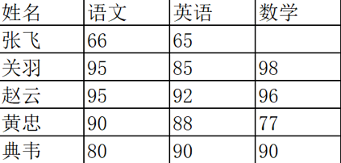
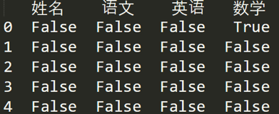
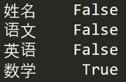
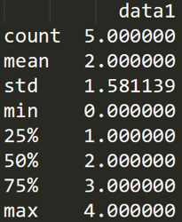
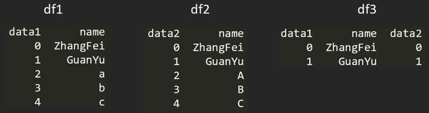
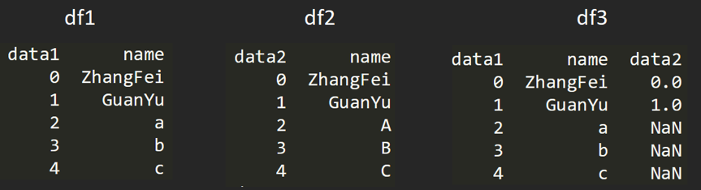
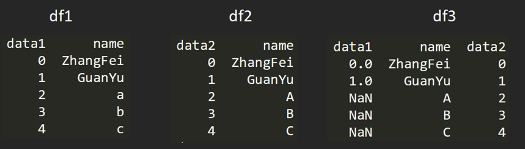
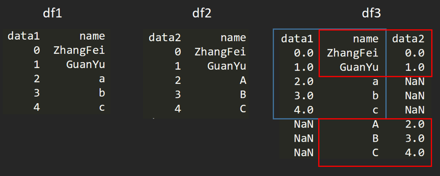
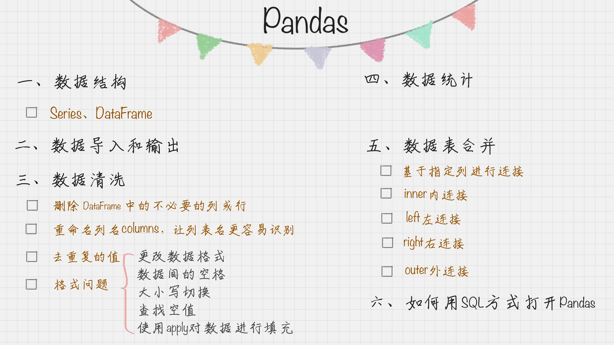
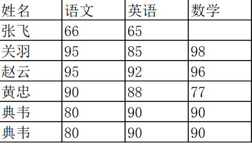

# 05丨Python科学计算：Pandas

陈旸 2018-12-24





09:16

讲述：陈旸 大小：8.50M

<audio title="05丨Python科学计算：Pandas" src="https://res001.geekbang.org/media/audio/a5/7b/a57cce18f0bf45f73b440a355ea9a37b/hd/hd.m3u8"></audio>

上一章中，我们讲了 Python 的一个重要的第三方库 NumPy，今天我来给你介绍 Python 的另一个工具 Pandas。

在数据分析工作中，Pandas  的使用频率是很高的，一方面是因为 Pandas 提供的基础数据结构 DataFrame 与 json  的契合度很高，转换起来就很方便。另一方面，如果我们日常的数据清理工作不是很复杂的话，你通常用几句 Pandas 代码就可以对数据进行规整。

Pandas 可以说是基于 NumPy 构建的含有更高级数据结构和分析能力的工具包。在 NumPy 中数据结构是围绕 ndarray 展开的，那么在 Pandas 中的核心数据结构是什么呢？

下面主要给你讲下**Series 和 DataFrame 这两个核心数据结构**，他们分别代表着一维的序列和二维的表结构。基于这两种数据结构，Pandas 可以对数据进行导入、清洗、处理、统计和输出。

## 数据结构：Series 和 DataFrame

**Series 是个定长的字典序列**。说是定长是因为在存储的时候，相当于两个 ndarray，这也是和字典结构最大的不同。因为在字典的结构里，元素的个数是不固定的。

**Series**有两个基本属性：index 和 values。在 Series 结构中，***index 默认是 0,1,2,……递增的整数序列***，当然我们也可以***自己来指定索引，比如 index=[‘a’, ‘b’, ‘c’, ‘d’]***。

```

import pandas as pd

from pandas import Series, DataFrame

x1 = Series([1,2,3,4])

x2 = Series(data=[1,2,3,4], index=['a', 'b', 'c', 'd'])

print x1

print x2


```

运行结果：

```

0    1

1    2

2    3

3    4

dtype: int64

a    1

b    2

c    3

d    4

dtype: int64


```

这个例子中，x1 中的 index 采用的是默认值，x2 中 index 进行了指定。我们也可以**采用字典的方式来创建 Series**，比如：

```

d = {'a':1, 'b':2, 'c':3, 'd':4}

x3 = Series(d)

print x3 


```

运行结果：

```

a    1

b    2

c    3

d    4

dtype: int64


```

**DataFrame 类型数据结构类似数据库表。**

它包括了行索引和列索引，我们可以将 DataFrame 看成是由相同索引的 Series 组成的字典类型。

我们虚构一个王者荣耀考试的场景，想要输出几位英雄的考试成绩：

```

import pandas as pd

from pandas import Series, DataFrame

data = {'Chinese': [66, 95, 93, 90,80],'English': [65, 85, 92, 88, 90],'Math': [30, 98, 96, 77, 90]}

df1= DataFrame(data)

df2 = DataFrame(data, index=['ZhangFei', 'GuanYu', 'ZhaoYun', 'HuangZhong', 'DianWei'], columns=['English', 'Math', 'Chinese'])

print df1

print df2


```

在后面的案例中，我一般会用  df, df1, df2 这些作为 DataFrame 数据类型的变量名，我们以例子中的 df2 为例，列索引是 [‘English’,  ‘Math’, ‘Chinese’]，行索引是 [‘ZhangFei’, ‘GuanYu’, ‘ZhaoYun’, ‘HuangZhong’,  ‘DianWei’]，所以 df2 的输出是：

```

            English  Math  Chinese

ZhangFei         65    30       66

GuanYu           85    98       95

ZhaoYun          92    96       93

HuangZhong       88    77       90

DianWei          90    90       80


```

在了解了 Series 和 DataFrame 这两个数据结构后，我们就从数据处理的流程角度，来看下他们的使用方法。

## 数据导入和输出

Pandas 允许直接从 xlsx，csv 等文件中导入数据，也可以输出到 xlsx, csv 等文件，非常方便。

```

import pandas as pd

from pandas import Series, DataFrame

score = DataFrame(pd.read_excel('data.xlsx'))

score.to_excel('data1.xlsx')

print score


```

需要说明的是，在运行的过程可能会存在缺少 xlrd 和 openpyxl 包的情况，到时候如果缺少了，可以在命令行模式下使用“pip install”命令来进行安装。

## 数据清洗

数据清洗是数据准备过程中必不可少的环节，Pandas 也为我们提供了数据清洗的工具，在后面数据清洗的章节中会给你做详细的介绍，这里简单介绍下 Pandas 在数据清洗中的使用方法。

我还是以上面这个王者荣耀的数据为例。

```

data = {'Chinese': [66, 95, 93, 90,80],'English': [65, 85, 92, 88, 90],'Math': [30, 98, 96, 77, 90]}

df2 = DataFrame(data, index=['ZhangFei', 'GuanYu', 'ZhaoYun', 'HuangZhong', 'DianWei'], columns=['English', 'Math', 'Chinese'])


```

**在数据清洗过程中，一般都会遇到以下这几种情况，下面我来简单介绍一下。**

### 	1. 删除 DataFrame 中的不必要的列或行**

Pandas 提供了一个便捷的方法 drop() 函数来删除我们不想要的列或行。比如我们想把“语文”这列删掉。

```

df2 = df2.drop(columns=['Chinese'])


```

想把“张飞”这行删掉。

```

df2 = df2.drop(index=['ZhangFei'])


```

### 	**2. 重命名列名 columns，让列表名更容易识别**

如果你想对 DataFrame 中的 columns 进行重命名，可以直接使用 rename(columns=new_names, inplace=True) 函数，比如我把列名 Chinese 改成 YuWen，English 改成 YingYu。

```

df2.rename(columns={'Chinese': 'YuWen', 'English': 'Yingyu'}, inplace = True)


```

### 	**3. 去重复的值**

数据采集可能存在重复的行，这时只要使用 drop_duplicates() 就会自动把重复的行去掉。

```

df = df.drop_duplicates() # 去除重复行


```

### 	**4. 格式问题**

**更改数据格式**

这是个比较常用的操作，因为很多时候数据格式不规范，我们可以使用 astype 函数来规范数据格式，比如我们把 Chinese 字段的值改成 str 类型，或者 int64 可以这么写：

```

df2['Chinese'].astype('str') 

df2['Chinese'].astype(np.int64) 


```

**数据间的空格**

有时候我们先把格式转成了 str 类型，是为了方便对数据进行操作，这时想要删除数据间的空格，我们就可以使用 strip 函数：

```

# 删除左右两边空格

df2['Chinese']=df2['Chinese'].map(str.strip)

# 删除左边空格

df2['Chinese']=df2['Chinese'].map(str.lstrip)

# 删除右边空格

df2['Chinese']=df2['Chinese'].map(str.rstrip)


```

如果数据里有某个特殊的符号，我们想要删除怎么办？同样可以使用 strip 函数，比如 Chinese 字段里有美元符号，我们想把这个删掉，可以这么写：

```

df2['Chinese']=df2['Chinese'].str.strip('$')


```

**大小写转换**

大小写是个比较常见的操作，比如人名、城市名等的统一都可能用到大小写的转换，在 Python 里直接使用 upper(), lower(), title() 函数，方法如下：

```

# 全部大写

df2.columns = df2.columns.str.upper()

# 全部小写

df2.columns = df2.columns.str.lower()

# 首字母大写

df2.columns = df2.columns.str.title()


```

**查找空值**

数据量大的情况下，有些字段存在空值 NaN 的可能，这时就需要使用 Pandas 中的 isnull 函数进行查找。比如，我们输入一个数据表如下：


 如果我们想看下哪个地方存在空值 NaN，可以针对数据表 df 进行 df.isnull()，结果如下：



如果我想知道哪列存在空值，可以使用 df.isnull().any()，结果如下：



## 使用【 apply 】函数对数据进行清洗

apply 函数是 Pandas 中**自由度非常高的函数**，使用频率也非常高。

比如我们想对 name 列的**数值str.upper都进行大写转化**可以用：

```

df['name'] = df['name'].apply(str.upper)


```

我们也可以定义个函数，在 apply 中进行使用。比如定义 double_df 函数是将原来的数值 *2 进行返回。然后对 df1 中的**“语文”列的数值进行 *2** 处理，可以写成：

```

def double_df(x):

           return 2*x

df1[u'语文'] = df1[u'语文'].apply(double_df)


```

我们也可以定义更复杂的函数，比如对于 DataFrame，我们新增两列，其中’new1’列是“语文”和“英语”成绩之和的 m 倍，'new2’列是“语文”和“英语”成绩之和的 n 倍，我们可以这样写：

```

def plus(df,n,m):

    df['new1'] = (df[u'语文']+df[u'英语']) * m

    df['new2'] = (df[u'语文']+df[u'英语']) * n

    return df

df1 = df1.apply(plus,axis=1,args=(2,3,))


```

其中 axis=1 代表按照列为轴进行操作，axis=0 代表按照行为轴进行操作，

***args 是传递的两个参数，即 n=2, m=3***，在 plus 函数中使用到了 n 和 m，从而生成新的 df。


## 【数据统计】

在数据清洗后，我们就要对数据进行统计了。

Pandas 和 NumPy 一样，都有常用的统计函数，如果遇到空值 NaN，会自动排除。

常用的统计函数包括：


表格中有一个 describe() 函数，统计函数千千万，describe() 函数最简便。它是个统计大礼包，可以快速让我们对数据有个全面的了解。下面我直接使用 df1.descirbe() 输出结果为：

```

df1 = DataFrame({'name':['ZhangFei', 'GuanYu', 'a', 'b', 'c']
			, 'data1':range(5)})
print df1.describe()
```



## 数据表合并

有时候我们需要将多个渠道源的多个数据表进行合并，一个 DataFrame 相当于一个数据库的数据表，那么多个 DataFrame 数据表的合并就相当于多个数据库的表合并。

比如我要创建两个 DataFrame：

```

df1 = DataFrame({'name':['ZhangFei', 'GuanYu', 'a', 'b', 'c'], 'data1':range(5)})

df2 = DataFrame({'name':['ZhangFei', 'GuanYu', 'A', 'B', 'C'], 'data2':range(5)})


```

两个 DataFrame 数据表的合并使用的是 merge() 函数，有下面 5 种形式：

###		**1. 基于指定列进行连接**

比如我们可以基于 name 这列进行连接。

```
df3 = pd.merge(df1, df2, on='name')
```



###		**2. inner 内连接**

inner 内链接是 merge 合并的默认情况，inner 内连接其实也就是键的交集，在这里 df1, df2 相同的键是 name，所以是基于 name 字段做的连接：

```

df3 = pd.merge(df1, df2, how='inner')


```


###		**3. left 左连接**

左连接是以第一个 DataFrame 为主进行的连接，第二个 DataFrame 作为补充。

```

df3 = pd.merge(df1, df2, how='left')


```



###		**4. right 右连接**

右连接是以第二个 DataFrame 为主进行的连接，第一个 DataFrame 作为补充。

```

df3 = pd.merge(df1, df2, how='right')


```



###		**5. outer 外连接**

外连接相当于求两个 DataFrame 的并集。

```

df3 = pd.merge(df1, df2, how='outer')


```



## 如何用 SQL 方式打开 Pandas

Pandas  的 DataFrame 数据类型可以让我们像处理数据表一样进行操作，比如数据表的增删改查，都可以用 Pandas  工具来完成。不过也会有很多人记不住这些 Pandas 的命令，相比之下还是用 SQL 语句更熟练，用 SQL  对数据表进行操作是最方便的，它的语句描述形式更接近我们的自然语言。

事实上，在 Python 里可以直接使用 SQL 语句来操作 Pandas。

###		这里给你介绍个工具：pandasql。

pandasql 中的主要函数是 sqldf，它接收两个参数：一个 SQL 查询语句，还有一组环境变量 globals() 或 locals()。这样我们就可以在 Python 里，直接用 SQL 语句中对 DataFrame 进行操作，举个例子：

```

import pandas as pd

from pandas import DataFrame

from pandasql import sqldf, load_meat, load_births

df1 = DataFrame({'name':['ZhangFei', 'GuanYu', 'a', 'b', 'c'], 'data1':range(5)})

pysqldf = lambda sql: sqldf(sql, globals())

sql = "select * from df1 where name ='ZhangFei'"

print pysqldf(sql)


```

运行结果：

```

   data1      name

0      0  ZhangFei


```

上面这个例子中，我们是对“name='ZhangFei”“的行进行了输出。当然你会看到我们用到了 lambda，lambda 在 python 中算是使用频率很高的，那 lambda 是用来做什么的呢？它实际上是用来定义一个匿名函数的，具体的使用形式为：

```

 lambda argument_list: expression


```

这里 argument_list 是参数列表，expression 是关于参数的表达式，会根据 expression 表达式计算结果进行输出返回。

在上面的代码中，我们定义了：

```

pysqldf = lambda sql: sqldf(sql, globals())


```

在这个例子里，输入的参数是 sql，返回的结果是 sqldf 对 sql 的运行结果，当然 sqldf 中也输入了 globals 全局参数，因为在 sql 中有对全局参数 df1 的使用。

## 总结

和 NumPy 一样，Pandas 有两个非常重要的数据结构：Series 和 DataFrame。使用 Pandas 可以直接从 csv 或 xlsx 等文件中导入数据，以及最终输出到 excel 表中。

我重点介绍了数据清洗中的操作，当然 Pandas 中同样提供了多种数据统计的函数。

最后我们介绍了如何将数据表进行合并，以及在 Pandas 中使用 SQL 对数据表更方便地进行操作。

Pandas 包与 NumPy 工具库配合使用可以发挥巨大的威力，正是有了 Pandas 工具，Python 做数据挖掘才具有优势。



我们来回顾一下今天的内容，在 Pandas 中，最主要的数据结构是什么？它都提供了哪些函数，可以帮我们做数据清洗？你可以自己描述一下吗？

## 练习题

对于下表的数据，请使用 Pandas 中的 DataFrame 进行创建，并对数据进行清洗。同时新增一列“总和”计算每个人的三科成绩之和。


 欢迎在评论区与我分享你的答案。

如果你觉着这篇文章有价值，欢迎点击“请朋友读”，把这篇文章分享给你的朋友或者同事。


© 版权归极客邦科技所有，未经许可不得传播售卖。 页面已增加防盗追踪，如有侵权极客邦将依法追究其法律责任。         


夜瓜居士


Ctrl + Enter 发表

0/2000字

提交留言

## 精选留言(103)

- 

  自导自演 

  老师能换3.x版本的吗？一堆2.x问题一直卡着好难受。

  ** 51

  2018-12-28

- 

  何楚 

  ** 29

  2018-12-24

  作者回复: 整理的不错，终于看到张飞的数学成绩 按照平均值来补全的了

- 

  大萌 

  另外推荐一个链接：https://www.cnblogs.com/nxld/p/6756492.html
  很实用，里面记载了许多python常使用的方法

  ** 10

  2018-12-24

- 

  daydreamer 

  ** 4

  2018-12-24

  作者回复: df['Total'] = df.sum(axis=1) 这个求和写的还是挺简洁的

- 

  吴舒成 

  大家以后放代码时能不能写明自己的软件环境啊，方便交流啊

  ** 4

  2018-12-24

- 

  大萌 

  ** 3

  2018-12-24

- 

  Grandia_Z 

  照着老师写 df2 = df2.drop(columns=['Chinese']) 这行代码后,返回结果是:
  TypeError                                 Traceback (most recent call last)
  <ipython-input-25-8116650c61ac> in <module>()
  ----> 1 df2 = df2.drop(columns=['Chinese'])

  TypeError: drop() got an unexpected keyword argument 'columns'

  这个什么意思

  ** 2

  2018-12-24

  作者回复: 我运行没有问题，是正确的。我使用的是py2.7版本，另外你在开头引用了 DataFrame和pandas工具包了么
  你可以联系编辑，加微信群，我帮你看下

- 

  姜戈 

  \# -*- coding: utf-8 -*-
  import pandas as pd
  from pandas import Series, DataFrame

  data={'语文':[66, 95, 95, 90, 80, 80],'英语':[65, 85, 92, 88, 90,90], '数学':['', 98, 96, 77, 90, 90]}
  df1 = DataFrame(data, index=['张飞', '关羽', '赵云','刘备','典韦','典韦'], columns=['语文','英语','数学'])
  print df1
  df1 = df1.drop_duplicates()
  print df1

  df = df1.replace(to_replace='', value=0)

  print df

  df['总计']=df['语文']+df['英语']+df['数学']
  df.replace(to_replace=0, value='', inplace=True)
  print df

  ** 2

  2018-12-24

  作者回复: 整理的OK，基本上清洗的过程都会把重复的行去掉。针对张飞的数学成绩，既可以按照0统计，也可以按照其他人的平均值来统计（考虑可能是统计缺失，而非真正为0）

- 

  mickey 

  ** 2

  2018-12-24

  作者回复: 简洁，整理的不错
  其实还有一种清洗方法，即针对张飞的情况，数学成绩可以进行补全，比如用其他人的数学成绩平均值

- 

  初 

  None竟然是浮点型数据....没想到

  ** 1

  2019-03-05

- 

  龟仙人 

  老师你好，你好像没有在哪里明确说明自己的环境是python2.7的，结果大家的使用环境大多数是3.0的，多多少少会引发一些问题。还有请问，微信群怎么加？

  ** 1

  2019-01-27

- 

  七彩星云 

  df2['Chinese'].astype('str') ＃这种写法貌似不行，如果是原始类型是int，再次map调用str.strip 方法的时候会出错，
  改成赋值形式就行了df2['Chinese'] ＝df2['Chinese'].astype('str') 

  ** 1

  2019-01-04

- 

  tjcslx 

  ** 1

  2018-12-31