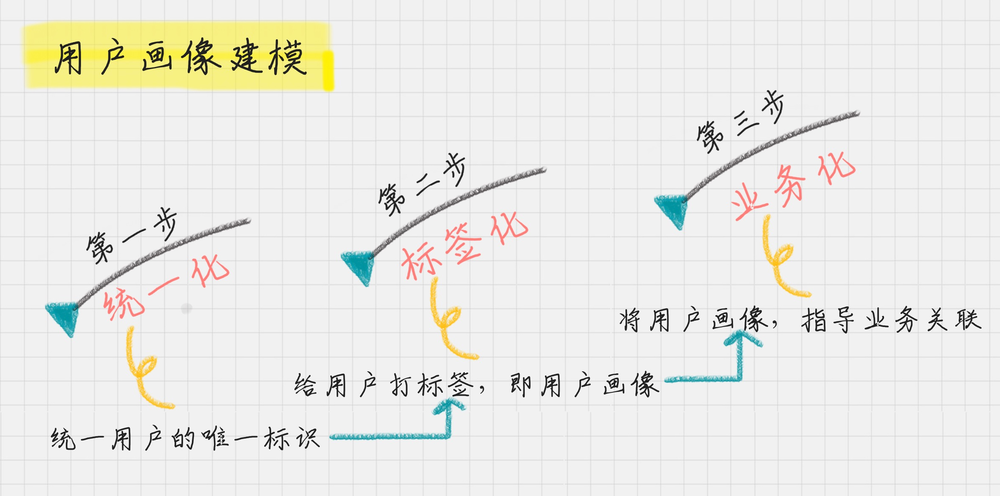

# 07 | 用户画像：标签化就是数据的抽象能力

陈旸 2018-12-28



11:54

讲述：陈旸 大小：10.91M

<audio title="07 | 用户画像：标签化就是数据的抽象能力" src="https://res001.geekbang.org/media/audio/ae/91/aee6e3c6f3c97f4e2506594c58713591/hd/hd.m3u8"></audio>
王兴说过，我们已经进入到互联网的下半场。在上半场，也就是早期的互联网时代，你永远不知道在对面坐的是什么样的人。那个年代大部分人还是  QQ 的早期用户。在下半场，互联网公司已经不新鲜了，大部分公司已经互联网化。他们已经在用网络进行产品宣传，使用电商销售自己的商品。

这两年引领下半场发展的是那些在讲 “大数据”“**赋能**”的企业，他们有数据，有用户。

通过大数据告诉政府该如何智慧地管理交通，做城市规划。

通过消费数据分析，告诉企业该在什么时间生产什么产品，以最大化地满足用户的需求。

通过生活大数据告诉我们餐饮企业，甚至房地产企业该如何选址。

如果说互联网的上半场是粗狂运营，因为有流量红利不需要考虑细节。那么在下半场，**精细化运营将是长久的主题**。<u>有数据，有**数据分析能力**才能让用户得到**更好的体验**。</u>

<u>所以，用户是根本，也是数据分析的出发点。</u>

假如你进入到一家卖羊肉串的餐饮公司，老板说现在竞争越来越激烈，要想做得好就要明白顾客喜欢什么。于是上班第一天，老板问你：“你能不能分析下用户数据，给咱们公司的业务做个赋能啊？”

听到这，你会怎么想？

你说：“老板啊，咱们是卖羊肉串的，做数据挖掘没用啊。”估计老板听后，晚上就把你给开了。

那该怎么办呢？如果你感觉一头懵，没关系，我们今天就来讲讲怎么一步步分析用户数据。

## 用户画像的准则

首先就是将自己企业的**用户画像做个白描**，告诉他这些用户“都是谁”“从哪来”“要去哪”。

你可以这么和老板说：“老板啊，用户画像建模是个系统的工程，我们要解决三个问题。

### 第一呢，就是用户从哪里来，

这里我们需要**统一标识用户   ID**，方便我们对用户**后续行为进行跟踪**。我们要了解这些羊肉串的用户从哪里来，他们是为了聚餐，还是自己吃宵夜，这些场景我们都要做统计分析。

### 第二呢，这些用户是谁？

我们需要对这些用户进行**标签化**，方便我们对用户行为进行理解。

### 第三呢，就是用户要到哪里去？

我们要<u>将这些用户画像与我们的**业务相关联**，</u>提升我们的**转化率**，或者降低我们的流失率。”

听到这，老板给你竖起了大拇指，说：“不错，都需要什么资源，随时找我就行。”

 刚才说的这三个步骤，下面我一一给你做个梳理。

## **1【统一化】	首先，为什么要设计唯一标识？**

**用户唯一标识是整个用户画像的核心**。我们以一个 App 为例，它把“从用户开始使用 APP 到下单到售后整个所有的用户行为”进行串联，这样就可以更好地去跟踪和分析一个用户的特征。

设计唯一标识可以从这些项中选择：用户名、注册手机号、联系人手机号、邮箱、**设备号**、**CookieID** 等。

## **2【标签化】	其次，给用户打标签。**

你可能会想，标签有很多，且不同的产品，标签的选择范围也不同，这么多的标签，怎样划分才能既方便记忆，又能保证用户画像的全面性呢？

### 【**用户	消费	行为	分析**】标签

这里我总结了八个字，叫“**用户消费行为分析**”。我们可以从这 4 个维度来进行标签划分。

1. ### 用户标签：

   它包括了性别、年龄、地域、收入、学历、职业等。这些包括了用户的基础属性。

2. ### 消费标签：

   消费习惯、购买意向、是否对促销敏感。这些统计分析用户的**消费习惯**。

3. ### 行为标签：

   时间段、频次、时长、访问路径。这些是通过分析用户行为，来得到他们<u>**使用** App 的习惯</u>。

4. ### 内容分析：

   对用户平时浏览的内容，尤其是停留时间长、浏览次数多的内容进行分析，分析出用户对哪些**内容感兴趣**，比如，金融、娱乐、教育、体育、时尚、科技等。

可以说，用户画像是现实世界中的**用户的数学建模**，我们正是将海量数据进行**标签化**，来得到精准的用户画像，从而为企业更精准地解决问题。

## 3【业务化】	最后，当你有了用户画像，可以为企业带来什么业务价值呢？

### 三个阶段

我们可以从用户生命周期的三个阶段来划分业务价值，包括：**获客、粘客和留客**。

1. ### 获客：

   如何进行**拉新**，通过更精准的营销获取客户。

2. ### 粘客：

   <u>个性化推荐，搜索排序，场景运营等。</u>

3. ### 留客：

   流失率预测，分析关键节点降低流失率。

如果按照数据流处理的阶段来划分用户画像建模的过程，可以分为数据层、算法层和业务层。你会发现在不同的层，都需要打上不同的标签。

**数据层**指的是用户消费行为里的标签。我们可以打上***“事实标签”***，作为数据客观的记录。

**算法层**指的是透过这些行为算出的用户建模。我们可以打上***“模型标签”***，作为用户画像的分类标识。

**业务层**指的是获客、粘客、留客的手段。我们可以打上***“预测标签”***，作为业务关联的结果。

所以这个标签化的流程，就是通过数据层的“事实标签”，在算法层进行计算，打上“模型标签”的分类结果，最后指导业务层，得出“预测标签”。

## 【案例】美团外卖的用户画像该如何设计？

刚才讲的是用户画像的三个阶段，以及每个阶段的准则。下面，我们来使用这些准则做个练习。

如果你是美团外卖的数据分析师，你该如何制定用户标识 ID，制定用户画像，以及基于用户画像可以做哪些业务关联？

首先，我们先回顾下美团外卖的产品背景。美团已经和大众点评进行了合并，因此在大众点评和美团外卖上都可以进行外卖下单。另外美团外卖针对的是高频 O2O 的场景，美团外卖是美团的核心产品，基本上有一半的市值都是由外卖撑起来的。

基于用户画像实施的三个阶段，我们首先需要统一用户的唯一标识，那么究竟哪个字段可以作为用户标识呢？

我们先看下美团和大众点评都是通过哪些**方式登录**的。

我们看到，美团采用的<u>是手机号、微信、微博、美团账号的</u>登录方式。大众点评采用的<u>是手机号、微信、QQ、微博的</u>登录方式。这里面两个 APP 共同的登录方式都是**手机号、微信和微博**。

那么究竟哪个可以作为用户的唯一标识呢？当然主要是以用户的注册手机号为标准。这样美团和大众点评的账号体系就可以相通。

当然，大家知道在集团内部，各部门之间的协作，尤其是用户数据打通是非常困难的，所以这里建议，如果希望大数据对各个部门都能赋能，一定要在集团的战略高度上，尽早就在最开始的顶层架构上，将用户标识进行统一，这样在后续过程中才能实现用户数据的打通。

然后我们思考下，有了用户，用户画像都可以统计到哪些标签。我们按照“**用户消费行为分析**”的准则来进行设计。

1. 用户标签：性别、年龄、家乡、居住地、收货地址、婚姻、宝宝信息、通过何种渠道进行的注册。
2. 消费标签：餐饮口味、消费均价、团购等级、预定使用等级、排队使用等级、外卖等级。
3. 行为标签：点外卖时间段、使用频次、平均点餐用时、访问路径。
4. 内容分析：基于用户平时浏览的内容进行统计，包括餐饮口味、优惠敏感度等。

**当你有了“用户消费行为分析”的标签之后，你就可以更好地理解业务了。**

比如一个经常买沙拉的人，一般很少吃夜宵。同样，一个经常吃夜宵的人，吃小龙虾的概率可能远高于其他人。这些结果都是通过数据挖掘中的关联分析得出的。

有了这些数据，我们就可以**预测用户的行为。**

比如一个用户购买了“月子餐”后，更有可能购买婴儿水，同样婴儿相关的产品比如婴儿湿巾等的购买概率也会增大。

具体在业务层上，我们都可以基于标签产生哪些业务价值呢？

- **在获客上**，我们可以找到优势的宣传渠道，如何通过个性化的宣传手段，<u>吸引有**潜在需求的用户**，并**刺激**其转化。</u>
- **在粘客上**，如何提升用户的**单价**和**消费频次**，方法可以包括购买后的个性化推荐、针对优质用户进行**优质高价**商品的推荐、以及重复购买，比如通过红包、优惠等方式激励对优惠敏感的人群，提升购买频次。
- **在留客上**，预测用户是否可能会从平台上流失。在营销领域，关于用户留存有一个观点——如果将顾客流失率降低  5%，公司利润将提升  25%~85%。可以看出留存率是多么的重要。用户流失可能会包括多种情况，比如用户体验、竞争对手、需求变化等，通过预测用户的流失率可以**大幅降低用户留存的运营成本。**

## 锻炼自己的抽象能力，将繁杂的事务简单化

上面我们讲到的“用户消费行为标签”都是基于一般情况考虑的，除此之外，用户的行为也会随着营销的节奏产生异常值，比如双十一的时候，如果商家都在促销就会产生突发的大量订单。因此在做用户画像的时候，还要考虑到异常值的处理。

总之，数据量是庞大的，会存在各种各样的使用情况。光是分析 EB 级别的大数据，我们就要花很长的时间。

但**我们的最终目的不是处理这些数据，而是<u>理解、使用</u>这些数据挖掘的结果**。对数据的标签化能让我们快速理解一个用户，一个商品，乃至一个视频内容的特征，从而方便我们去理解和使用数据。

对数据的标签化其实考验的是我们的抽象能力，在日常工作中，我们也要锻炼自己的抽象能力，它可以让我们很快地将一个繁杂的事物简单化，不仅方便理解，还有益后续的使用。

我们今天讲了用户画像的流程，其中很重要的一个步骤就是给用户打标签，那么你不妨想想，如果给羊肉串连锁店进行用户画像分析，都可以从哪些角度进行标签化？

最后，我们从现实生活中出发，打开你的手机，翻翻看你的微信通讯录，分析下你的朋友圈，都有哪些用户画像？如果你来给它设计标签，都有哪些种类需要统计呢。为了方便后续使用，你是如何将他们归类分组的？

欢迎在评论区与我分享你的答案，我会和你一起探讨。也欢迎点击“请朋友读”，把这篇文章分享给你的朋友或者同事，我们一起交流，一起进步。

© 版权归极客邦科技所有，未经许可不得传播售卖。 页面已增加防盗追踪，如有侵权极客邦将依法追究其法律责任。         

夜瓜居士

Ctrl + Enter 发表

0/2000字

提交留言

## 精选留言(63)

- 

  跳跳 

  羊肉串店的用户画像：
  唯一ID确认：可以根据付款人、付款账号等信息确认
  用户标签：性别、年龄、家乡
  消费标签：餐饮口味、消费均价、预定使用等级、排队使用等级
  行为标签：光顾时间、光顾频率、光顾的地理位置（连锁店）、平均点餐时间、对优惠券的敏感程度
  内容标签：菜品种类、菜品数量、餐饮口味
  朋友圈画像
  标签有：家人、朋友、同学、同事、陌生人
  需要统计的种类有：
  用户标签：性别、年龄、地区、通过何种方式添加
  消费标签：点赞内容、参与的活动等
  行为标签：点赞频率，点赞时间、聊天时间、聊天频率、聊天时长
  内容标签：点赞内容，聊天内容、发布朋友圈内容、点赞的文章，关注的公众号

  ** 38

  2018-12-28

- 

  修行者 

  ** 18

  2019-01-04

  作者回复: 很好的总结

- 

  Cathy 

  对于评论区中那位“喜欢部门一个女生，通过······各种途径找到各种信息······”，当真是细思极恐。在这类事情上这样真的不会触及人家隐私吗？对于一个还不熟悉的，要追自己的男生，这样的方式，女孩子怕是要吓坏了~

  ** 10

  2018-12-29

- 

  蜘蛛的梦呓 

  ** 9

  2018-12-28

- 

  chuckles 

  1、用户标签：性别，微信号，地区等
  2、行为标签：微信头像喜好（动漫、风景、动物、自拍等等）、朋友圈内容分类（养生类、自拍类、炫娃类、秀恩爱类、鸡汤类、技术爱好类、居家类balabala。。）
  3、关系标签：亲戚、同事、小学/初中/高中/本科/硕士/博士、游戏好友、相亲对象等等
  4、内容分析：可依据聊天的频次、时间段、聊天主题打标签

  相信大多数人都是以关系标签进行归类分组，也可以以聊天频次或者聊天主题进行分组。我是不分组。。。简单粗暴。

  ** 8

  2018-12-28

- 

  ida 

  【给羊肉串连锁店画像】
  （前提：连锁店以微信小程序平台点单）
  统一用户标识：微信账号；用户支付方式包括 支付宝账号、银行卡账号、微信账号。因为以微信小程序点单，大多数用户会选择微信，故利用微信账号作为唯一标识；
  用户标签：性别，年龄，家乡，职业，支付渠道等
  消费标签：餐饮口味，消费均价，优惠券使用记录等
  行为标签：就餐时段，来店频次，来店的地理位置，平均点餐用时，时常就餐人数
  内容分析：基于用户点餐选择，包括餐饮口味，优惠敏感度等
  在获客上：选择微信小程序的平台优势，方法通过嵌入分销、拼团、直播、红包、优惠券等促销功能，让用户主动传播、分享，更加引流获客；
  在粘客上：提升用户就餐次数和消费数额，方法通过就餐后的优惠券分发策略，针对优质用户进行更优力度的优惠策略；针对用户就餐人数，结合数据分析得到就餐人数对利润的影响，从而修正餐厅的最低消费金额，或餐厅超过多少金额即可得优惠（但限制人数）
  在留客上：预测用户是否可能不再来本店消费，方法可以通过餐后对就餐意见填写的用户发送红包，优惠券等奖励，得到反馈。但此处要注意因为有优惠，用户可能只填写有益意见，存在幸存者偏差的问题，故而要得到真是有效的建议要更花费心思。

  【朋友圈画像】
  统一用户标志：微信账号包括（家人，同学，朋友，网友，客服）
  用户标签：姓名，性别，年龄，家乡，添加渠道，微信签名，微信上地址选择
  消费标签：点赞内容，评论内容，聊天内容
  行为标签：点赞次数，评论次数，点赞的文章次数，关注公众号个数，微信朋友圈内容公布设置天数，点赞评论时间，聊天频次，聊天时间段，聊天时长，同属几个聊天群，
  内容标签：点赞内容，评论内容，聊天内容，发布内容，点赞的文章内容，关注的公众号
  获客：微信添加若非必加不可一般是看下对方的朋友圈内容，明显代购或太多没有营养的文章转发等不加
  粘客：根据点赞文章内容和关注的公众号我方选择。若要留住对方，也是通过对方发布的朋友圈内容和点赞文章内容以及关注的公众号上找共同点
  留客：要走的留不住，被拉黑了就洒脱点。

  ** 5

  2018-12-29

- 

  桃园悠然在 

  这篇关于用户画像的解析和三层应用相当精彩，很多时候大家纠结于标签类型怎么分口径怎么定，缺了顶层框架，这样挖掘的效率就慢了。另外，忍不住再点个赞，本专栏大概是最高产&最科班的数据分析专栏了，期待后续内容！

  ** 5

  2018-12-28

- 

  吴舒成 

  巧了，刚整理一份《增长黑客--如何低成本实现爆发式成长》，我放在幕布上了https://mubu.com/edit/kKKyflQ43q
  全书再讲aarrr模型:获得用户，激活用户，提高留存，增加收入，分享推荐。
  文中提供各个模块的计算指标，欢迎大家交流

  ** 3

  2018-12-28

- 

  JingZ 

  感觉内容标签和消费标签容易重复啊？

  ** 3

  2018-12-28

- 

  闫东汉 

  分析一下自己的朋友圈，看看自己有哪些用户画像。
  1、信息标签：性别，年龄，地域、学历、职业。
  2、关系标签：亲人、同事（不同公司）、同学（小中高大）、朋友、一面之交。
  3、行为标签：是否进行互动、聊天点赞、发朋友圈的时间、频率
  4、内容分析：是否原创、文字、视频、图片

  ** 2

  2019-01-01

- 

  Alex王伟健 

  羊肉串连锁店用户画像标签
  用户 ID 标志 ： 会员（手机号），非会员用付款账号（支付宝/微信/银行卡等）

  用户标签
  性别
  居住地
  家乡
  年龄
  付款方式

  消费标签
  口味
  单价
  行为标签
  用餐时间
  消费频率
  用餐时长
  用餐方式

  内容分析
  优惠关注度
  口味关注度
  环境关注度

  朋友圈分类
  家人朋友同学归一类
  工作同事
  通过某个渠道遇到的每个渠道都归一类
  乱七八糟的群加的归一类
  同行归一类
  写公号的归一类
  其实，就是有些想转发的内容，想屏蔽掉哪类，就给哪类分个组。

  笔记：https://mubu.com/doc/oNLdDDklQ0

  ** 2

  2018-12-28

- 

  Bella 

  老师，我觉得您讲得很好！思路特别清晰。看完每一篇文章，都有一种意犹未尽的感觉。
  可是，老师，能再多举一些案例不？然后提出来让我们思考的问题，会给我们讲，如果要是您来做，您会怎么做吗？谢谢老师！

  ** 2

  2018-12-28

- 

  Destroy、 

  1、羊肉串连锁店进行用户画像分析可以参考老师美团那个例子；
  2、朋友圈可以从关系（家人、同事、朋友等）、亲密度（陌生、低、中、高）、互动指数（点赞频率、留言频率等）几个方面去建立用户画像。

  ** 2

  2018-12-28

- 

  Sunny Snow 

  由于微信产品本身的价值导向是面向熟人的社交型app，所以我觉得可以根据人与人之间的不同亲密度来给微信中的不同用户进行标签化。
  我大致分了6个等级从L1到L6逐渐递减：
  L1：父母、伴侣、闺蜜、挚友等
  L2：亲戚长辈等
  L3：同学、同学的朋友等
  L4：工作同事等
  L5：一面之缘的人
  L6：骚扰账号
  分类是我临时根据亲密度来划分的，可能会不那么准确，恳请老师和同学们多多指正

  ** 2

  2018-12-28

- 

  Clany 

  老师，用户画像最重要的是打标签，各种等级，层次划分完了，细分了很多标签，但是以那种方式去把这些标签打到用户身上呢？企业是如何去做的？老师能给说说嘛？谢谢

  ** 1

  2019-03-13

- 

  胖陶 

  羊肉串
  唯一id确认：手机号或微信号
  用户标签：性别、年龄、地域、收入、学历、职业
  消费标签：喜欢买什么、喜欢什么口味、是否对促销敏感、一般人均在多少
  行为标签：一般都什么时候来，一星期来几次，每次用餐时间多长，一般都怎么来
  内容分析：看什么菜比较多
  微信朋友圈
  唯一id确认：微信号
  用户标签：性别、年龄、地域、收入、学历、职业、关系
  消费标签：喜欢发什么类型的朋友圈
  行为标签：一般都什么时候发朋友圈，一个星期发几次
  内容分析：会给谁，或者什么内容点赞或者评论

  ** 1

  2019-01-16

- 

  caidy 

  \1. 羊肉串连锁店用户画像分析
  唯一标识：手机号
  用户消费行为分析：
  用户标签：性别，年龄，收入，学历，地域
  消费标签：消费均价，爱好的口味，是否对优惠券敏感
  行为标签：关顾时间，关顾频率，通过什么方式预约，还是直接到店消费
  内容标签：爱好口味，菜品类型，菜品数目
  业务价值
  获客：通过传单宣传，微信宣传，吸引潜在客户
  粘客：个性化推荐，微信分享满多少赞可以优惠，打折，送优惠券等
  留客：分析留存率，正对留存率问题进行分析，是口味问题，还是菜品问题等等

  微信通信录画像分析
  唯一标识：微信号
  用户消费行为分析：
  用户标签：姓名，性别，年龄，位置
  消费标签：聊天内容，点赞次数，分享次数，关注公众号类型
  行为分析：什么时间点赞，点赞频率，聊天频率，同属哪些微信群，共同好友有哪些
  内容分析：喜欢分享什么文章，发表的朋友圈主要是什么类型的说说

  ** 1

  2018-12-31

- 

  fancy 

  --羊肉串连锁店用户画像分析--
  第一步：用户从哪来，统一用户的唯一标识
  通过用户的付款方式：微信、支付宝、现金
  为了后续过程各部门或各平台数据的互通性，以使数据发挥其最大的使用价值，要尽早统一用户标识。
  第二步：用户是谁，通过对用户消费行为分析贴标签
  用户标签：
  1.性别：喜欢吃羊肉串的客人中男女比例
  2.年龄：喜欢吃羊肉串的客人年龄占比
  3.收入：进店客人收入及该店商品售价
  4.地域： 偏好羊肉串的客人地域比例
  消费标签：
  1.每次除了买羊肉串是否也会经常买些别的产品
  2.是否对羊肉串点的促销活动敏感
  3.口味
  行为标签：
  1.一周或一月光顾时间
  2.当天光顾时间
  3.一周及一月光顾频次
  4.点外卖或者直接到店消费
  第三步：用户到哪去--找到业务价值
  1.获客：通过第二步完成的用户画像中的用户标签可定位主要顾客群体，从而指定相应的营销策略吸引同类新顾客。
  2.粘客：通过消费标签和行为标签，调整羊肉串口味及店内服务人数或者外卖员人数，提升服务质量。
  3.留客：通过行为标签，分析预测留客率，从而调整店内产品的储存量，减少库存积压，或保证羊肉串充足供应。

  

  ** 1

  2018-12-31

- 

  Python 

  以羊肉串店为例子弄用户画像：

  人是不能简简单单的能用标签来概括的，但打标签的方式能帮助我们更方面的理解客户和分析客户。
  一家能用到数据挖掘的羊肉串店，那肯定是做的比较大的，很可能开了很多家连锁店。

  用户标签：性别，年龄，职业，学历等等。
  消费标签：喜欢的口味，对肉质的敏感程度，以及消费的均价。
  行为标签：来店的频率，消费的时间，等待的耐心程度，以及对价格的敏感度。
  内容分析：统计客户最喜欢浏览的在平台上发布的内容，通过内容最后能提炼出，客户的喜好，对某些问题的关心程度等。

  有了这些标签后我们就可以进行业务层面上的实现：
  在获客上，利用客户对价格的敏感度和对大部分客户的喜好下手宣传。
  在黏客上，对消费频次高的客户提高推荐频率，在消费频次低的客户提高打折力度
  在留存上，分析竞争对手的获客方式，以及客户的需求喜好变化等等。

  

  ** 1

  2018-12-28

- 

  Kyle 

  如果给一家羊肉串连锁店进行用户画像分析，可以从哪些角度进行标签化？
  首先需要确立用户的唯一标识：手机号
  用户标签：年龄，性别，居住地，收货地址等
  消费标签：消费频次，消费价格，促销而来，是否预约，排队次数，排队时长等等
  行为标签：光顾时间，光顾连锁店地址，频次，人数，消费口味
  内容分析：消费口味，吃饭时长，菜品数量，菜品种类

  打开你的手机，翻翻看你的微信通讯录，分析下你的朋友圈，都有哪些用户画像？如果你来给它设计标签，都有哪些种类需要统计呢。为了方便后续使用，你是如何将他们归类分组的？
  唯一的标识：微信号（平时我们主要看微信头像和昵称）
  用户画像：朋友，同学，同事，陌生网友，家人，亲戚
  标签：
  用户：年龄，性别，学历，家乡，职业，婚姻
  消费：发布在朋友圈的产品种类，频次，时间段，发布朋友圈，点赞频率，点赞次数，评论内容，互动频次
  行为：朋友圈发布次数，发布时间，互动频率，点赞频率，“好看”分享内容种类

  为了方便后续使用，我一般就加了微信好友之后，根据用户画像种类立马给好友进行标签的添加，从而进行分组。