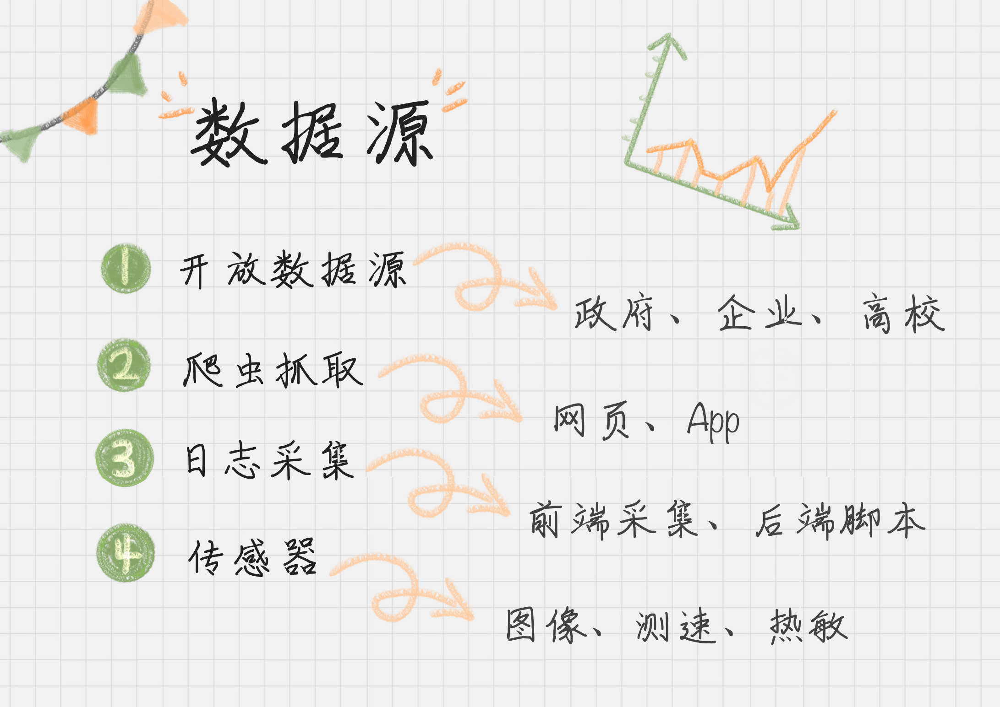

# 08 | 数据采集：如何自动化采集数据？

陈旸 2018-12-31



11:33

讲述：陈旸 大小：10.59M

<audio title="08 | 数据采集：如何自动化采集数据？" src="https://res001.geekbang.org/media/audio/b3/15/b3cc6a80fed3a57570fce015688d9715/hd/hd.m3u8"></audio>

上一节中我们讲了如何对用户画像建模，而建模之前我们都要进行数据采集。数据采集是数据挖掘的基础，没有数据，挖掘也没有意义。很多时候，我们拥有多少数据源，多少数据量，以及数据质量如何，将决定我们挖掘产出的成果会怎样。

举个例子，你做量化投资，基于大数据预测未来股票的波动，根据这个预测结果进行买卖。你当前能够拿到以往股票的所有历史数据，是否可以根据这些数据做出一个预测率高的数据分析系统呢？

实际上，如果你只有股票历史数据，你仍然无法理解股票为什么会产生大幅的波动。比如，当时可能是爆发了 SARS 疫情，或者某地区发生了战争等。这些重大的社会事件对股票的影响也是巨大的。

因此我们需要考虑到，一个数据的走势，是由多个维度影响的。我们需要通过**多源的数据采集**，收集到尽可能多的**数据维度**，同时保证数据的质量，这样才能得到高质量的数据挖掘结果。

那么，从数据采集角度来说，都有哪些数据源呢？我将数据源分成了以下的四类。

这四类数据源包括了：开放数据源、爬虫抓取、传感器和日志采集。它们各有特点。

开放数据源一般是针对行业的数据库。比如美国人口调查局开放了美国的人口信息、地区分布和教育情况数据。除了政府外，企业和高校也会开放相应的大数据，这方面北美相对来说做得好一些。国内，贵州做了不少大胆尝试，搭建了云平台，逐年开放了旅游、交通、商务等领域的数据量。

要知道很多研究都是基于开放数据源进行的，否则每年不会有那么多论文发表，大家需要相同的数据集才能对比出算法的好坏。

爬虫抓取，一般是针对特定的网站或 App。如果我们想要抓取指定的网站数据，比如购物网站上的购物评价等，就需要我们做特定的爬虫抓取。

第三类数据源是传感器，它基本上采集的是物理信息。比如图像、视频、或者某个物体的速度、热度、压强等。

最后是日志采集，这个是统计用户的操作。我们可以在前端进行埋点，在后端进行脚本收集、统计，来分析网站的访问情况，以及使用瓶颈等。

知道了有四类数据源，那如何采集到这些数据呢？

## 如何使用开放数据源

我们先来看下开放数据源，教你个方法，开放数据源可以从两个维度来考虑，一个是单位的维度，比如政府、企业、高校；一个就是行业维度，比如交通、金融、能源等领域。这方面，国外的开放数据源比国内做得好一些，当然近些年国内的政府和高校做开放数据源的也越来越多。一方面服务社会，另一方面自己的影响力也会越来越大。

比如，下面这张表格列举的就是单位维度的数据源。

所以如果你想找某个领域的数据源，比如金融领域，你基本上可以看下政府、高校、企业是否有开放的数据源。当然你也可以直接搜索金融开放数据源。

## 如何使用爬虫做抓取

爬虫抓取应该属于最常见的需求，比如你想要餐厅的评价数据。当然这里要注重版权问题，而且很多网站也是有反爬机制的。

最直接的方法就是使用 Python 编写爬虫代码，当然前提是你需要会 Python 的基本语法。除此之外，PHP 也可以做爬虫，只是功能不如 Python 完善，尤其是涉及到多线程的操作。

在 Python 爬虫中，基本上会经历三个过程。

1. 使用 Requests 爬取内容。我们可以使用 Requests 库来抓取网页信息。Requests 库可以说是 Python 爬虫的利器，也就是 Python 的 HTTP 库，通过这个库爬取网页中的数据，非常方便，可以帮我们节约大量的时间。
2. 使用 XPath 解析内容。XPath 是 XML Path 的缩写，也就是 XML 路径语言。它是一种用来确定 XML 文档中某部分位置的语言，在开发中经常用来当作小型查询语言。XPath 可以通过元素和属性进行位置索引。
3. 使用 Pandas 保存数据。Pandas 是让数据分析工作变得更加简单的高级数据结构，我们可以用 Pandas 保存爬取的数据。最后通过 Pandas 再写入到 XLS 或者 MySQL 等数据库中。

Requests、XPath、Pandas 是 Python 的三个利器。当然做 Python 爬虫还有很多利器，比如 Selenium，PhantomJS，或者用 Puppteteer 这种无头模式。

另外我们也可以不编程就抓取到网页信息，这里介绍三款常用的抓取工具。

**火车采集器**

火车采集器已经有 13 年历史了，是老牌的采集工具。它不仅可以做抓取工具，也可以做数据清洗、数据分析、数据挖掘和可视化等工作。数据源适用于绝大部分的网页，网页中能看到的内容都可以通过采集规则进行抓取。

**八爪鱼**

八爪鱼也是知名的采集工具，它有两个版本，一个就是免费的采集模板，还有一个就是云采集（付费）。

免费的采集模板实际上就是内容采集规则，包括了电商类、生活服务类、社交媒体类和论坛类的网站都可以采集，用起来非常方便。当然你也可以自己来自定义任务。

那什么是云采集呢？就是当你配置好采集任务，就可以交给八爪鱼的云端进行采集。八爪鱼一共有 5000 台服务器，通过云端多节点并发采集，采集速度远远超过本地采集。此外还可以自动切换多个 IP，避免 IP 被封，影响采集。

做过工程项目的同学应该能体会到，云采集这个功能太方便了，**很多时候自动切换 IP 以及云采集才是自动化采集的关键**。

下一篇文章我会给你详细介绍八爪鱼的使用。

**集搜客**

这个工具的特点是完全可视化操作，无需编程。整个采集过程也是所见即所得，抓取结果信息、错误信息等都反应在软件中。相比于八爪鱼来说，集搜客没有流程的概念，用户只需要关注抓取什么数据，而流程细节完全交给集搜客来处理。

但是集搜客的缺点是没有云采集功能，所有爬虫都是在用户自己电脑上跑的。

## 如何使用日志采集工具

传感器采集基本上是基于特定的设备，将设备采集的信息进行收集即可，这里我们就不重点讲解了。

下面我们来看日志采集。

为什么要做日志采集呢？日志采集最大的作用，就是通过分析用户访问情况，提升系统的性能，从而提高系统承载量。及时发现系统承载瓶颈，也可以方便技术人员基于用户实际的访问情况进行优化。

日志采集也是运维人员的重要工作之一，那么日志都包括哪些呢，又该如何对日志进行采集呢？

日志就是日记的意思，它记录了用户访问网站的全过程：哪些人在什么时间，通过什么渠道（比如搜索引擎、网址输入）来过，都执行了哪些操作；系统是否产生了错误；甚至包括用户的  IP、HTTP 请求的时间，用户代理等。这些日志数据可以被写在一个日志文件中，也可以分成不同的日志文件，比如访问日志、错误日志等。

日志采集可以分两种形式。

1. 通过 Web 服务器采集，例如 httpd、Nginx、Tomcat  都自带日志记录功能。同时很多互联网企业都有自己的海量数据采集工具，多用于系统日志采集，如 Hadoop 的 Chukwa、Cloudera 的  Flume、Facebook 的 Scribe 等，这些工具均采用分布式架构，能够满足每秒数百 MB 的日志数据采集和传输需求。
2. 自定义采集用户行为，例如用 JavaScript 代码监听用户的行为、AJAX 异步请求后台记录日志等。

**埋点是什么**

埋点是日志采集的关键步骤，那什么是埋点呢？

**埋点就是在有需要的位置采集相应的信息，进行上报**。比如某页面的访问情况，包括用户信息、设备信息；或者用户在页面上的操作行为，包括时间长短等。这就是埋点，每一个埋点就像一台摄像头，采集用户行为数据，将数据进行多维度的交叉分析，可真实还原出用户使用场景，和用户使用需求。

那我们要如何进行埋点呢？

埋点就是在你需要统计数据的地方植入统计代码，当然植入代码可以自己写，也可以使用第三方统计工具。我之前讲到“不重复造轮子”的原则，一般来说需要自己写的代码，一般是主营核心业务，对于埋点这类监测性的工具，市场上已经比较成熟，这里推荐你使用第三方的工具，比如友盟、Google  Analysis、Talkingdata  等。他们都是采用前端埋点的方式，然后在第三方工具里就可以看到用户的行为数据。但如果我们想要看到更深层的用户操作行为，就需要进行自定义埋点。

总结一下，日志采集有助于我们了解用户的操作数据，适用于运维监控、安全审计、业务数据分析等场景。一般  Web 服务器会自带日志功能，也可以使用 Flume  从不同的服务器集群中采集、汇总和传输大容量的日志数据。当然我们也可以使用第三方的统计工具或自定义埋点得到自己想要的统计内容。

## 总结

数据采集是数据分析的关键，很多时候我们会想到 Python 网络爬虫，实际上数据采集的方法、渠道很广，有些可以直接使用开放的数据源，比如想获取比特币历史的价格及交易数据，可以直接从 Kaggle 上下载，不需要自己爬取。

另一方面根据我们的需求，需要采集的数据也不同，比如交通行业，数据采集会和摄像头或者测速仪有关。对于运维人员，日志采集和分析则是关键。所以我们需要针对特定的业务场景，选择适合的采集工具。

今天我讲了数据采集的不同渠道以及相关的工具。给你留一个思考题，假如你想预测比特币的未来走势，都需要哪些维度的数据源呢？怎样收集到它们呢？欢迎在留言区与我分享你的想法，我也会和你一起探讨。

也欢迎点击“请朋友读”，把这篇文章分享给你的朋友或者同事。

© 版权归极客邦科技所有，未经许可不得传播售卖。 页面已增加防盗追踪，如有侵权极客邦将依法追究其法律责任。         

夜瓜居士

Ctrl + Enter 发表

0/2000字

提交留言

## 精选留言(55)

- 

  Tommy 

  能讲讲怎么做埋点嘛，去面试很多人问到

  ** 50

  2018-12-31

- 

  HxScript 

  关于比特币未来走势预测，可以从两个角度考虑：
  1、比特币的生产：价值尺度，生产力和生产成本会影响价格。作为区块链货币，应该具有区块链的属性：会受供给增加机制影响，即产量四年减半。进而会影响产量和挖币成本。但如果区块链协议改变，会直接改变比特币总量。
  2、比特币的交易：作为流通手段和支付手段，主要影响因素可能是税率。但区块如果扩容，会改变交易速度，继而影响交易手续费。

  而以上信息，再按能否用二位表结构来进行逻辑表达，分类为结构化数据和非结构化数据。
  结构化数据：比特币产量（计算得出）、挖币成本（计算得出）、日/周/月交易数（爬取相关交易网站得到，用以预测热度）、交易手续费走势（爬取相关交易网站得到，用以了解交易成本）。
  非结构化数据：比特币相关新闻（都可爬取比特币垂直资讯网站获得）、比特币相关政策（努力固然重要，还要考虑时代的进程）、比特币自身协议变更情况（可爬取比特币垂直资讯网站获得）。

  完全区块链门外汉，如有错误，还望老师同学指出！

  ** 13

  2019-01-01

- 

  蜘蛛的梦呓 

  据我所知，今年区块链、比特币是在年初时突然间出现了大众的视野，随之比特币高涨，吸引了不少人进场，但是也出现了不少劣币，这些劣币收割了不少韭菜，人们炒币的热度下降了不少，比特币价格大跌，而且政府也有意控制比特币。
  所以，我觉得需要以下的数据来判断比特币的价格走势。

  【所需维度】:
    \1. 比特币的价格走势(历史价格和交易数据) 
    \2. 区块链、比特币的热度指数(分析下降原因，人       们对比特币的使用程度)
    \3. 相关的政策(政府的对比特币的态度)
  【如何搜集】:Kaggle、百度指数、各大新闻网站。

  ** 6

  2018-12-31

  作者回复: 同意，这道题没有标准答案，不过政策确实是个很大的因素，还有人们对于比特币的信心

- 

  Destroy、 

  scrapy也是爬虫的利器。。。

  ** 6

  2018-12-31

  作者回复: 对 爬虫框架 

- 

  ida 

  【所需的维度】：历史价格、交易人数、交易时间、比特币历史挖掘地点和挖掘大小以及成交量大小
  【收集数据】：用于分析预测的数据可以从Kaggle或者Poloniex上收集到

  ** 5

  2018-12-31

- 

  Mingjie 

  老师，做数据分析掌握爬虫是必须的嘛？

  ** 3

  2018-12-31

  作者回复: 爬虫是工具之一，多一种收集数据的方法。如果你定位是算法工程师，可以着重看数据挖掘的部分。

- 

  滢 

  预测比特币的未来走势，可以从以下维度抓取数据
  1.认知度：社会对比特币的认可，抓取百度指数、谷歌搜索量、微博数据等
  2.比特币依赖的技术：作为数字货币，核心技术的完善和认可度占比重较大，可以从区块链相关技术网站爬取数据，也可以从微博爬取（微博也是技术人活跃的交流平台）
  3.供给平衡：比特币虽说是一种数字货币，但仍逃脱不掉是一种商品的本质，商品必然受市场平衡调节影响，所以爬取买入量、抛售量还有历史价格也是一种预测维度
  4.政府政策：政府政策的影响占很大比重，若国家出台政策强制打压或者支持，那么对价格的影响起了根本性作用，所以需要爬取相关的新闻
  5.竞争数字货币：作为一种商品，必然要考虑竞争品的相关情况，需要抓取其它数字货币相关信息如其它货币的价格、交易量。资本在流入其它市场的时候，与之对应的竞品必然会受影响。抓取数据途径：其它货币交易平台

  ** 2

  2019-04-09

- 

  helloling 

  爬虫不止php，很多编程语言都是可以写的，java、node.js、.net、go等等编程都可以写，R语言也可以写爬虫。只是python上手比较简单，网上几乎都是python的教程，导致有些人认为只有python能写。

  ** 2

  2018-12-31

  作者回复: 同意，同样数据分析也不止是Python语言，只是用的人多，资料文档还有第三方工具相比于其他语言更完善

- 

  third 

  1.历史价格

  比特币价格

  （矿机价格）

  

  2，历史时点

  1，区块链协议

  2，政策

  3，当时的国际政治环境

  4，经济形势

  

  3，搜索热度

  ** 1

  2019-02-01

- 

  张国胜 

  ** 1

  2019-01-07

- 

  Frank 

  希望后面的课程能结合实战具体讲讲本节课提到的各种理论方法，包括爬虫编写，埋点，日志分析等等～

  ** 1

  2019-01-04

  作者回复: 爬虫编写后面会有，这块很多人都感兴趣

- 

  Kyle 

  比特币未来预测走势，首先需要知道比特币的历史价格走势（每日周月年的数据），成交交易量，交易人数，以及比特币走势发生重大变化时候的外部环境，比如政府政策，股市交易走势（美股，港股，大陆等的大盘指数）；
  比特币的交易数据可以通过一些公开数据源获取，如比特币交易平台，kaggle等，外部环境可以通过Python爬取比特币资讯，查看比特币价格发生重大变化所发生的新闻，以及同期的股票数据通过公开的数据源抓取。

  ** 1

  2018-12-31

- 

  Andre 

  埋点是怎么一种操作？

  ** 

  2019-06-03

- 

  春风沐古 

  比特币的未来走势预测需采集数据：
  1、历史行情数据
  2、历史行业事件：如比特币减产、分叉、SEC进展、各国政府对于加密币的表态等
  3、对比1和2，得出一般规律

  ** 

  2019-06-03

- 

  滢 

  看到埋点感觉很亲切，之前是执行埋点埋在哪的任务，现在是思考要在哪里埋点，因为身份的转换，完全颠倒过来了。不过想问下，现在工作中最常用的采集工具是哪几种？

  ** 

  2019-04-06

- 

  叶えなくちゃ 

  ** 

  2019-02-19

- 

  三硝基甲苯 

  首先把，先得有btc的历史数据，
  然后先初步分析btc的一些比如飙高or飙低的时间点，
  然后结合几个大国家的金融指数，
  然后就是再找相关时间点附近的新闻信息
  最后再来根据当前的金融指数和特别新闻来预测走势

  ** 

  2019-02-14

- 

  王彬成 

  问题：假如你想预测比特币的未来走势，都需要哪些维度的数据源呢？怎样收集到它们呢？
  回答：类似于股票，我认为比特币的走势是与比特币的价值有关，即利用比特币技术能产生收益。所以需要收集与比特币应用相关的新闻。利用百度指数即可得知。
  其次，还需获得比特币的价格走势和挖矿机的价格

  ** 

  2019-02-11

- 

  杰之7 

  通过这一节的学习，对数据源的采集的角度更有更好的理解。需要我们更多的选择合适的工具。可以通过开源数据，爬虫，日志，和传感器等方式获取数据。

  对于爬虫数据的获取，熟练使用Python的库，通过request库获取数据，通过Xpath指定获取的内容，通过Pandas对得到的数据进行结构化的处理，最后储存在mysql中。

  对于日志数据的采集，在前端设置埋点，在后端进行脚本统计收集。对于日志，有两种方式,Web服务器采集(Tomcat,,Ngnix等)，也可以自定义采集用户行为。对于埋点的设置，对于企业的核心业务，需要我们自己编写统计函数，  对于其他的数据，可以使用第三方工具获取。

  

  ** 

  2019-02-09

- 

  杰之7 

  通过这一节的阅读学习，熟悉了获取数据的来源，主要包括公开数据，爬虫获取数据，日志采集数据，及传感器采集的数据。

  在python中通过爬虫获取的有三步，requests导入页面数据，Xpath对页面进行解析，pandas保存对处理的数据。

  在日志采集中，通过在前端设置埋点，在后端的日志文件中能保持我们需要的数据。我们也可以通过第三方的工具，获取我们想要的数据。

  数据的获取是数据挖掘的前提，只有获取更全的数据和有质量的数据，对之后的数据挖掘输入才会有质量上的保证。

  ** 

  2019-01-29