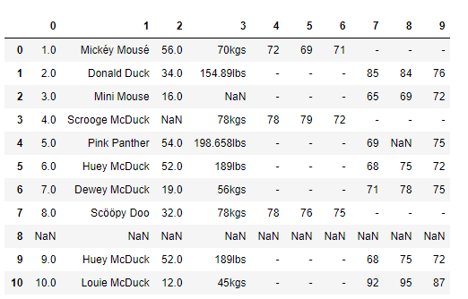
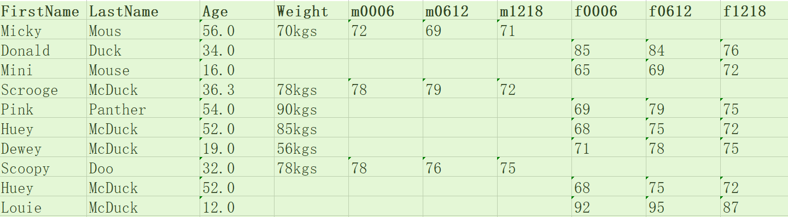
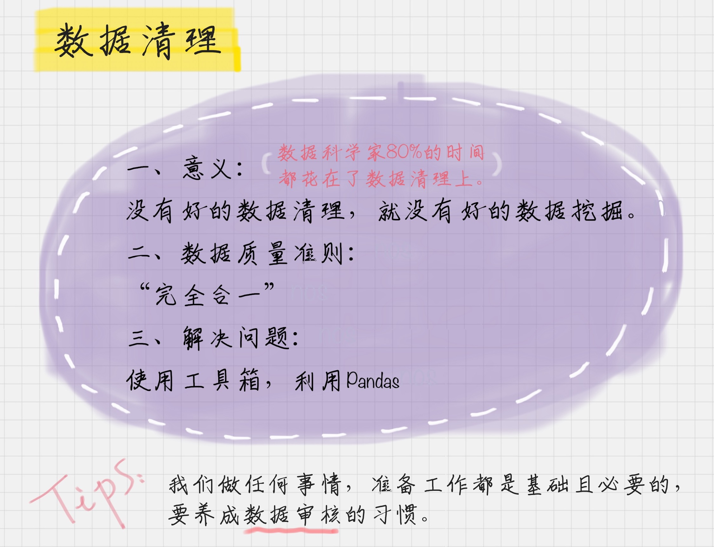
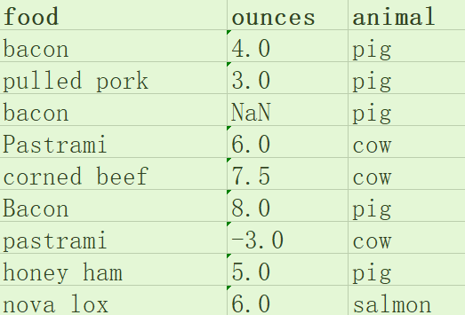

# 11 | 数据科学家80%时间都花费在了这些清洗任务上？

陈旸 2019-01-07





09:45

讲述：陈旸 大小：8.94M

<audio title="11 | 数据科学家80%时间都花费在了这些清洗任务上？" src="https://res001.geekbang.org/media/audio/d7/32/d70e8b468eb331693b6e4e904472cf32/hd/hd.m3u8"></audio>
我们在上一节中讲了数据采集，以及相关的工具使用，但做完数据采集就可以直接进行挖掘了吗？肯定不是的。

就拿做饭打个比方吧，对于很多人来说，热油下锅、掌勺翻炒一定是做饭中最过瘾的环节，但实际上炒菜这个过程只占做饭时间的 20%，剩下 80% 的时间都是在做准备，比如买菜、择菜、洗菜等等。

在数据挖掘中，数据清洗就是这样的前期准备工作。对于数据科学家来说，我们会遇到各种各样的数据，在分析前，要投入大量的时间和精力把数据“**整理裁剪**”成自己想要或需要的样子。

为什么呢？因为我们采集到的数据往往有很多问题。

我们先看一个例子，假设老板给你以下的数据，让你做数据分析，你看到这个数据后有什么感觉呢？



你刚看到这些数据可能会比较懵，因为这些**数据缺少标注**。

我们在收集整理数据的时候，一定要对数据做标注，数据**表头**很重要。比如这份数据表，就缺少列名的标注，这样一来我们就不知道每列数据所代表的含义，无法从业务中理解这些数值的作用，以及这些数值是否正确。但在实际工作中，也可能像这个案例一样，数据是缺少标注的。

我简单解释下这些数据代表的含义。

这是一家服装店统计的会员数据。最上面的一行是列坐标，最左侧一列是行坐标。

列坐标中，第 0 列代表的是序号，第 1 列代表的会员的姓名，第 2 列代表年龄，第 3 列代表体重，第 4~6 列代表男性会员的三围尺寸，第 7~9 列代表女性会员的三围尺寸。

了解含义以后，我们再看下中间部分具体的数据，你可能会想，这些数据怎么这么“脏乱差”啊，有很多值是空的（NaN），还有空行的情况。

是的，这还仅仅是一家商店的部分会员数据，我们一眼看过去就能发现一些问题。日常工作中的数据业务会复杂很多，通常我们**要统计更多的数据维度**，比如  100 个指标，数据量通常都是超过 TB、EB  级别的，所以整个数据分析的处理难度是呈指数级增加的。这个时候，仅仅通过肉眼就很难找到问题所在了。

我举了这样一个简单的例子，带你理解在数据分析之前为什么要有数据清洗这个重要的准备工作。有经验的数据分析师都知道，**好的数据分析师必定是一名数据清洗高手，要知道在整个数据分析过程中，不论是在时间还是功夫上，数据清洗大概都占到了 80%**。

## 数据质量的准则

在上面这个服装店会员数据的案例中，一看到这些数据，你肯定能发现几个问题。你是不是想知道，有没有一些准则来规范这些数据的质量呢？

准则肯定是有的。不过如果数据存在七八种甚至更多的问题，我们很难将这些规则都记住。有研究说一个人的短期记忆，最多可以记住  7 条内容或信息，超过 7 条就记不住了。而数据清洗要解决的问题，远不止 7  条，我们万一漏掉一项该怎么办呢？有没有一种方法，我们既可以很方便地记住，又能保证我们的数据得到很好的清洗，提升数据质量呢？

在这里，我将数据清洗规则总结为以下 4 个关键点，统一起来叫“**完全合一**”，下面我来解释下。

1. **完**整性：单条数据是否存在**空值**，统计的**字段是否完善**。
2. **全**面性：观察某一列的全部数值，比如在 Excel 表中，我们选中一列，可以看到该列的**平均值、最大值、最小值**。我们可以通过常识来判断该列是否有问题，比如：数据定义、单位标识、数值本身。
3. **合**法性：数据的**类型、内容、大小的合法性**。比如数据中存在非 ASCII 字符，性别存在了未知，年龄超过了 150 岁等。
4. 唯**一**性：数据是否存在**重复记录**，因为数据通常来自不同渠道的汇总，重复的情况是常见的。行数据、列数据都需要是唯一的，比如一个人不能重复记录多次，且一个人的体重也不能在列指标中重复记录多次。

在很多数据挖掘的教学中，数据准则通常会列出来 7~8 项，在这里我们归类成了“完全合一”4 项准则，按照以上的原则，我们能解决数据清理中遇到的大部分问题，使得**数据标准、干净、连续**，为后续数据统计、数据挖掘做好准备。如果想要进一步优化数据质量，还需要在实际案例中灵活使用。

## 清洗数据，一一击破

了解了数据质量准则之后，我们针对上面服装店会员数据案例中的问题进行一一击破。

这里你就需要 Python 的 Pandas 工具了。这个工具我们之前介绍过。它是基于 NumPy 的工具，专门为解决数据分析任务而创建。Pandas 纳入了大量库，我们可以利用这些库高效地进行数据清理工作。

这里我补充说明一下，如果你对  Python 还不是很熟悉，但是很想从事数据挖掘、数据分析相关的工作，那么花一些时间和精力来学习一下 Python 是很有必要的。Python  拥有丰富的库，堪称数据挖掘利器。当然了，数据清洗的工具也还有很多，这里我们只是以 Pandas  为例，帮你应用数据清洗准则，带你更加直观地了解数据清洗到底是怎么回事儿。

下面，我们就依照“完全合一”的准则，使用 Pandas 来进行清洗。

**1.  完整性**

**问题 1：缺失值**

在数据中有些年龄、体重数值是缺失的，这往往是因为数据量较大，在过程中，有些数值没有采集到。通常我们可以采用以下三种方法：

- 删除：删除数据缺失的记录；
- 均值：使用当前列的均值；
- 高频：使用当前列出现频率最高的数据。

比如我们想对 df[‘Age’] 中缺失的数值用平均年龄进行填充，可以这样写：

```

df['Age'].fillna(df['Age'].mean(), inplace=True)


```

如果我们用最高频的数据进行填充，可以先通过 value_counts 获取 Age 字段最高频次 **age_maxf**，然后再对 Age 字段中缺失的数据用 age_maxf 进行填充：

```

age_maxf = train_features['Age'].value_counts().index[0]

train_features['Age'].fillna(age_maxf, inplace=True)


```

**问题 2：空行**

我们发现数据中有一个空行，除了 index 之外，全部的值都是 NaN。Pandas 的 read_csv() 并没有可选参数来忽略空行，这样，我们就需要在数据被读入之后再使用 dropna() 进行处理，删除空行。

```

# 删除全空的行

df.dropna(how='all',inplace=True) 


```

**2.  全面性**

**问题：列数据的单位不统一**

观察 weight 列的数值，我们能发现 weight 列的单位不统一。有的单位是千克（kgs），有的单位是磅（lbs）。

这里我使用千克作为统一的度量单位，将磅（lbs）转化为千克（kgs）：

```

# 获取 weight 数据列中单位为 lbs 的数据

rows_with_lbs = df['weight'].str.contains('lbs').fillna(False)

print df[rows_with_lbs]

# 将 lbs 转换为 kgs, 2.2lbs=1kgs

for i,lbs_row in df[rows_with_lbs].iterrows():

	# 截取从头开始到倒数第三个字符之前，即去掉 lbs。

	weight = int(float(lbs_row['weight'][:-3])/2.2)

	df.at[i,'weight'] = '{}kgs'.format(weight) 


```

**3.  合理性**

**问题：非 ASCII 字符**

我们可以看到在数据集中 Fristname 和 Lastname 有一些非 ASCII 的字符。我们可以采用删除或者替换的方式来解决非 ASCII 问题，这里我们使用删除方法：

```

# 删除非 ASCII 字符

df['first_name'].replace({r'[^\x00-\x7F]+':''}, regex=True, inplace=True)

df['last_name'].replace({r'[^\x00-\x7F]+':''}, regex=True, inplace=True)


```

**4.  唯一性**

**问题 1：一列有多个参数**

在数据中不难发现，姓名列（Name）包含了两个参数  Firtname 和 Lastname。为了达到数据整洁目的，我们将 Name 列拆分成 Firstname 和 Lastname  两个字段。我们使用 Python 的 split 方法，str.split(expand=True)，将列表拆成新的列，再将原来的 Name  列删除。

```

# 切分名字，删除源数据列

df[['first_name','last_name']] = df['name'].str.split(expand=True)

df.drop('name', axis=1, inplace=True)


```

**问题 2：重复数据**

我们校验一下数据中是否存在重复记录。如果存在重复记录，就使用 Pandas 提供的 drop_duplicates() 来删除重复数据。

```

# 删除重复数据行

df.drop_duplicates(['first_name','last_name'],inplace=True)


```

这样，我们就将上面案例中的会员数据进行了清理，来看看清理之后的数据结果。怎么样？是不是又干净又标准？



## 养成数据审核的习惯

现在，你是不是能感受到数据问题不是小事，上面这个简单的例子里都有 6 处错误。所以我们常说，现实世界的数据是“肮脏的”，需要清洗。

第三方的数据要清洗，自有产品的数据，也需要数据清洗。比如美团自身做数据挖掘的时候，也需要去除爬虫抓取，作弊数据等。可以说**没有高质量的数据，就没有高质量的数据挖掘，而数据清洗是高质量数据的一道保障。**

当你从事这方面工作的时候，你会发现养成数据审核的习惯非常重要。而且越是优秀的数据挖掘人员，越会有“数据审核”的“职业病”。这就好比编辑非常在意文章中的错别字、语法一样。

数据的规范性，就像是你的作品一样，通过清洗之后，会变得非常干净、标准。当然了，这也是一门需要不断修炼的功夫。终有一天，你会进入这样一种境界：看一眼数据，差不多 7 秒钟的时间，就能知道这个数据是否存在问题。为了这一眼的功力，我们要做很多练习。

刚开始接触数据科学工作的时候，一定会觉得数据挖掘是件很酷、很有价值的事。确实如此，不过今天我还要告诉你，再酷炫的事也离不开基础性的工作，就像我们今天讲的数据清洗工作。对于这些基础性的工作，我们需要耐下性子，一个坑一个坑地去解决。

好了，最后我们来总结下今天的内容，你都收获了什么？



学习完今天的内容后，给你留个小作业吧。下面是一个美食数据，如果你拿到下面的数据，按照我们今天讲的准则，你能找到几点问题？如果你来清洗这些数据，你打算怎样清洗呢？



欢迎在留言区写下你的思考，如果你对今天“数据清洗”的内容还有疑问，也欢迎留言和我讨论。也欢迎点击“请朋友读”，把这篇文章分享给你的朋友或者同事。


© 版权归极客邦科技所有，未经许可不得传播售卖。 页面已增加防盗追踪，如有侵权极客邦将依法追究其法律责任。         


夜瓜居士


Ctrl + Enter 发表

0/2000字

提交留言

## 精选留言(62)

- 

  Hot   Heat 

  可以给个样例数据的链接吗？自己动手操作一下

  ** 18

  2019-01-07

- 

  wonderland 

  一、首先按照所讲的数据质量准则，数据存在的问题有：
  1."完整性"问题：数据有缺失，在ounces列的第三行存在缺失值
  处理办法：可以用该列的平均值来填充此缺失值
  2.“全面性”问题：food列的值大小写不统一
  处理办法：统一改为小写
  3.“合理性”问题：某一行的ounces值出现负值
  处理办法：将该条数据记录删除
  4.“唯一性”问题：food列大小写统一后会出现同名现象，
  处理办法：需要将food列和animal列值均相同的数据记录进行合并到同一天记录中国

  ** 11

  2019-01-10

- 

  third 

  自己不知道有没有什么好的工具，所以就把图片上一个一个敲进去了。
  数据.csv格式
  链接：https://pan.baidu.com/s/1jNnUpntrlxFSubmna3HtXw 
  提取码：e9hc

  ** 10

  2019-02-05

- 

  nrvna 

  ** 7

  2019-01-09

- 

  leben krieg 

  这些东西，大家都一定要上手去实现一遍。最简单的就是，搞一个文本，把这些数据放进去，用Python读这个文本，转成dataframe，把老师讲的那些清洗相关的API都一个一个试一下，才会有体会，光看一遍真的没啥用的！
  现在只是很少的几十条数据，等你真正去搞那些上亿的数据的时候，就知道核对数据是个多么复杂的事情了……

  ** 7

  2019-01-07

  作者回复: 对的 一定要自己模拟操作下

- 

  Jbin 

  练习题中：
  1、food列中出现大小写不同的情况。根据实际，如果大小写不同的两个数据代表的产品不同，则不改变，否则统一改为小写
  2、food列bacon出现了三次，但是有两次是有正确数据，不能通过food去重。
  3、ounces列，去除空值行。根据实际数据来源以及分析目的，是否可能有负的情况，判断是否去除-3行

  以上为个人的一些想法，有考虑不周的地方希望老师可以指导。

  ** 6

  2019-01-07

- 

  晨星 

  import pandas as pd
  """利用Pandas清洗美食数据"""

  \# 读取csv文件
  df = pd.read_csv("c.csv")

  df['food'] = df['food'].str.lower()  # 统一为小写字母
  df.dropna(inplace=True)  # 删除数据缺失的记录
  df['ounces'] = df['ounces'].apply(lambda a: abs(a))  # 负值不合法，取绝对值

  \# 查找food重复的记录，分组求其平均值
  d_rows = df[df['food'].duplicated(keep=False)]
  g_items = d_rows.groupby('food').mean()
  g_items['food'] = g_items.index
  print(g_items)

  \# 遍历将重复food的平均值赋值给df
  for i, row in g_items.iterrows():
      df.loc[df.food == row.food, 'ounces'] = row.ounces
  df.drop_duplicates(inplace=True)  # 删除重复记录

  df.index = range(len(df))  # 重设索引值
  print(df)

  ** 5

  2019-02-19

- 

  上官 

  weight = int(float((lbs_row['weight'][:-3])/2.2)
  老师好，这行代码中[：-3]的作用是什么啊？

  

  ** 5

  2019-01-08

  作者回复: 截取从头开始到倒数第三个字符之前，即去掉lbs。

- 

  auroroa 

  最大的问题是不是没把数据的来源和目的描述清楚？😄

  ** 4

  2019-01-07

- 

  滢 

  原始数据链接：https://github.com/onlyAngelia/Read-Mark/blob/master/数据分析/geekTime/data/accountMessage.xlsx    （课程中讲解原始数据-点击view Raw即可下载）
  课后练习原始数据: https://github.com/onlyAngelia/Read-Mark/blob/master/数据分析/geekTime/data/foodInformation.xlsx （点击View Raw下载）

  ** 3

  2019-04-11

- 

  爱做梦的咸鱼 

  建议老师涉及到数据集练习的可以把数据放在github上，方便我们做同步练习。

  ** 3

  2019-01-29

- 

  周飞 

  ** 3

  2019-01-12

- 

  桃园悠然在 

  我的理解，不能对food列简单去重吧，而是规范ounces列数据后汇总或者保持原样，这可能使厨房食材消耗记录。数据清洗还是要结合完全合一+业务含义。

  ** 3

  2019-01-07