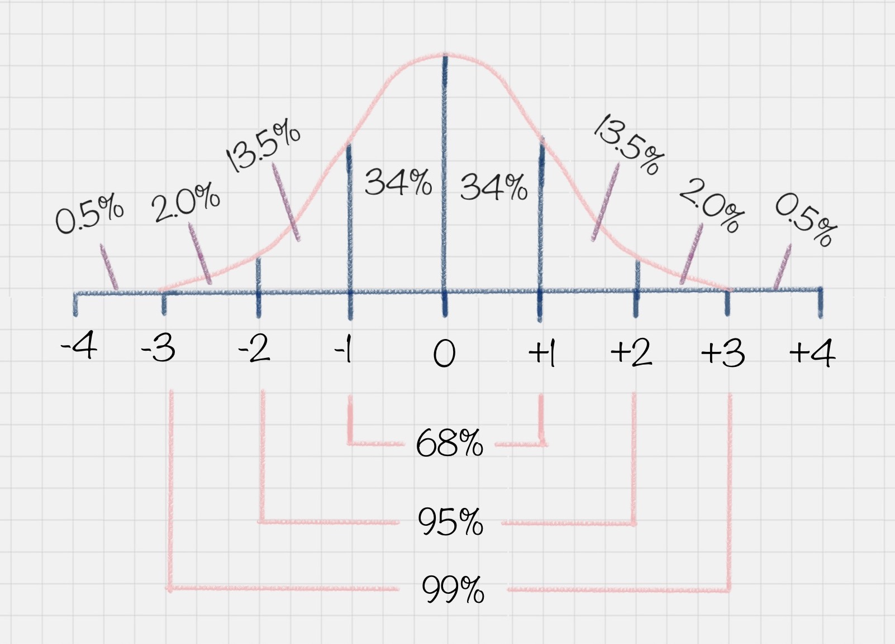

# 13 | 数据变换：考试成绩要求正态分布合理么？

陈旸 2019-01-11





10:19

讲述：陈旸 大小：9.46M

<audio title="13 | 数据变换：考试成绩要求正态分布合理么？" src="https://res001.geekbang.org/media/audio/d1/aa/d1b2ccd5d623553c4df34e4993a71aaa/ld/ld.m3u8"></audio>
上一讲中我给你讲了数据集成，今天我来讲下数据变换。

如果一个人在百分制的考试中得了 95 分，你肯定会认为他学习成绩很好，如果得了 65 分，就会觉得他成绩不好。如果得了 80 分呢？你会觉得他成绩中等，因为在班级里这属于大部分人的情况。

为什么会有这样的认知呢？这是因为我们从小到大的考试成绩基本上都会满足正态分布的情况。什么是正态分布呢？正态分布也叫作常态分布，就是正常的状态下，呈现的分布情况。

比如你可能会问班里的考试成绩是怎样的？这里其实指的是大部分同学的成绩如何。以下图为例，在正态分布中，大部分人的成绩会集中在中间的区域，少部分人处于两头的位置。正态分布的另一个好处就是，如果你知道了自己的成绩，和整体的正态分布情况，就可以知道自己的成绩在全班中的位置。



另一个典型的例子就是，美国 SAT 考试成绩也符合正态分布。而且美国本科的申请，需要中国高中生的 GPA 在 80 分以上（百分制的成绩），背后的理由也是默认考试成绩属于正态分布的情况。

为了让成绩符合正态分布，出题老师是怎么做的呢？他们通常可以把考题分成三类：

第一类：基础题，占总分 70%，基本上属于送分题；

第二类：灵活题，基础范围内 + 一定的灵活性，占 20%；

第三类：难题，涉及知识面较广的难题，占 10%；

那么，你想下，如果一个出题老师没有按照上面的标准来出题，而是将第三类难题比重占到了 70%，也就是我们说的“超纲”，结果会是怎样呢？

你会发现，大部分人成绩都“不及格”，最后在大家激烈的讨论声中，老师会将考试成绩做规范化处理，从而让成绩满足正态分布的情况。因为只有这样，成绩才更具有比较性。所以正态分布的成绩，不仅可以让你了解全班整体的情况，还能了解每个人的成绩在全班中的位置。

## 数据变换在数据分析中的角色

我们再来举个例子，假设 A 考了 80 分，B 也考了 80 分，但前者是百分制，后者 500 分是满分，如果我们把从这两个渠道收集上来的数据进行集成、挖掘，就算使用效率再高的算法，结果也不是正确的。因为这两个渠道的分数代表的含义完全不同。

### 数据错了，算法再正确也是错的

所以说，<u>有时候**数据变换**比算法选择更重要，</u>数据错了，算法再正确也是错的。你现在可以理解为什么 80% 的工作时间会花在前期的数据准备上了吧。

那么如何让不同渠道的数据统一到一个目标数据库里呢？这样就用到了数据变换。

### 准备工作=过程

在数据变换前，我们需要先对字段进行筛选，

然后对数据进行探索和相关性分析，

接着是选择算法模型（这里暂时不需要进行模型计算），

然后针对算法模型对数据的需求进行数据变换，从而完成数据挖掘前的准备工作。


 所以你从整个流程中可以看出，数据变换是数据准备的重要环节，它**通过数据平滑、数据聚集、数据概化和规范化等方式**将数据转换成适用于数据挖掘的形式。

### 变换方法【！！】：

我来介绍下这些常见的变换方法：

1. **数据平滑**：去除数据中的噪声，将连续数据离散化<u>【**去噪**】</u>。这里可以采用分箱、聚类和回归的方式进行数据平滑，我会在后面给你讲解聚类和回归这两个算法；
2. **数据聚集**：对数据进行汇总，在 SQL 中有一些聚集函数可以供我们操作，比如 Max() 反馈某个字段的数值最大值，Sum() 返回某个字段的数值总和；
3. **数据概化**：将数据由较低的概念**抽象成为较高的概念**，减少数据复杂度，即用更高的概念替代更低的概念。比如说上海、杭州、深圳、北京可以概化为中国。
4. **数据规范化**：使属性数据按比例缩放，这样就将原来的数值<u>映射到一个新的特定区域中。</u>常用的方法有最小—最大规范化、Z—score 规范化、按小数定标规范化等，我会在后面给你讲到这些方法的使用；
5. **属性构造**：**【特征工程】**构造出新的属性并添加到属性集中。这里会用到特征工程的知识<u>，因为**通过属性与属性的连接构造新的属性**，其实就是特征工程。</u>比如说，数据表中统计每个人的英语、语文和数学成绩，你可以构造一个“总和”这个属性，来作为新属性。这样“总和”这个属性就可以用到后续的数据挖掘计算中。

在这些变换方法中，最简单易用的就是对数据进行规范化处理。下面我来给你讲下如何对数据进行规范化处理。

## 数据规范化的几种方法

### **1. Min-max 规范化**

Min-max 规范化方法是将原始数据变换到 [0,1] 的空间中。用公式表示就是：

新数值 =（原数值 - 极小值）/（极大值 - 极小值）。

### **2. Z-Score 规范化**

假设 A 与 B 的考试成绩都为 80 分，A 的考卷满分是 100 分（及格 60 分），B 的考卷满分是 500 分（及格 300 分）。虽然两个人都考了 80 分，但是 A 的 80 分与 B 的 80 分代表完全不同的含义。

那么如何用相同的标准来比较 A 与 B 的成绩呢？Z-Score 就是用来可以解决这一问题的。

我们定义：新数值 =（原数值 - 均值）/ 标准差。

假设 A 所在的班级平均分为 80，标准差为 10。B 所在的班级平均分为 400，标准差为 100。那么 A 的新数值 =(80-80)/10=0，B 的新数值 =(80-400)/100=-3.2。

那么在 Z-Score 标准下，A 的成绩会比 B 的成绩好。

我们能看到 Z-Score 的优点是算法简单，不受数据量级影响，结果易于比较。不足在于，它需要数据整体的平均值和方差，而且结果没有实际意义，只是用于比较。

### **3. 小数定标规范化**

小数定标规范化就是通过移动小数点的位置来进行规范化。小数点移动多少位取决于属性 A 的取值中的最大绝对值。

举个例子，比如属性 A 的取值范围是 -999 到 88，那么最大绝对值为 999，小数点就会移动 3 位，即新数值 = 原数值 /1000。那么 A 的取值范围就被规范化为 -0.999 到 0.088。

上面这三种是数值规范化中常用的几种方式。

## Python 的 SciKit-Learn 库使用

SciKit-Learn 是 Python 的重要机器学习库，它帮我们封装了大量的机器学习算法，比如分类、聚类、回归、降维等。此外，它还包括了数据变换模块。

我现在来讲下如何使用 SciKit-Learn 进行数据规范化。

**1. Min-max 规范化**

我们可以让原始数据投射到指定的空间  [min, max]，在 SciKit-Learn 里有个函数 MinMaxScaler  是专门做这个的，它允许我们给定一个最大值与最小值，然后将原数据投射到 [min, max] 中。默认情况下 [min,max] 是  [0,1]，也就是把原始数据投放到 [0,1] 范围内。

我们来看下下面这个例子：

```

# coding:utf-8

from sklearn import preprocessing

import numpy as np

# 初始化数据，每一行表示一个样本，每一列表示一个特征

x = np.array([[ 0., -3.,  1.],

              [ 3.,  1.,  2.],

              [ 0.,  1., -1.]])

# 将数据进行 [0,1] 规范化

min_max_scaler = preprocessing.MinMaxScaler()

minmax_x = min_max_scaler.fit_transform(x)

print minmax_x


```

运行结果：

```

[[0.         0.         0.66666667]

 [1.         1.         1.        ]

 [0.         1.         0.        ]]


```

**2. Z-Score 规范化**

在 SciKit-Learn 库中使用 preprocessing.scale() 函数，可以直接将给定数据进行 Z-Score 规范化。

```

from sklearn import preprocessing

import numpy as np

# 初始化数据

x = np.array([[ 0., -3.,  1.],

              [ 3.,  1.,  2.],

              [ 0.,  1., -1.]])

# 将数据进行 Z-Score 规范化

scaled_x = preprocessing.scale(x)

print scaled_x


```

运行结果：

```

[[-0.70710678 -1.41421356  0.26726124]

 [ 1.41421356  0.70710678  1.06904497]

 [-0.70710678  0.70710678 -1.33630621]]


```

这个结果实际上就是将每行每列的值减去了平均值，再除以方差的结果。

我们看到 Z-Score 规范化将数据集进行了规范化，数值都符合均值为 0，方差为 1 的正态分布。

**3. 小数定标规范化**

我们需要用 NumPy 库来计算小数点的位数。NumPy 库我们之前提到过。

这里我们看下运行代码：

```

# coding:utf-8

from sklearn import preprocessing

import numpy as np

# 初始化数据

x = np.array([[ 0., -3.,  1.],

              [ 3.,  1.,  2.],

              [ 0.,  1., -1.]])

# 小数定标规范化

j = np.ceil(np.log10(np.max(abs(x))))

scaled_x = x/(10**j)

print scaled_x


```

运行结果：

```

[[ 0.  -0.3  0.1]

 [ 0.3  0.1  0.2]

 [ 0.   0.1 -0.1]]


```

## 数据挖掘中数据变换比算法选择更重要

在考试成绩中，我们都需要让数据满足一定的规律，达到规范性的要求，便于进行挖掘。这就是数据变换的作用。

如果不进行变换的话，要不就是维数过多，增加了计算的成本，要不就是数据过于集中，很难找到数据之间的特征。

在数据变换中，重点是如何将数值进行规范化，有三种常用的规范方法，分别是  Min-Max 规范化、Z-Score 规范化、小数定标规范化。其中 Z-Score  规范化可以直接将数据转化为正态分布的情况，当然不是所有自然界的数据都需要正态分布，我们也可以根据实际的情况进行设计，比如取对数  log，或者神经网络里采用的激励函数等。


在最后我给大家推荐了  Python 的 sklearn 库，它和 NumPy, Pandas 都是非常有名的 Python  库，在数据统计工作中起了很大的作用。SciKit-Learn 不仅可以用于数据变换，它还提供了分类、聚类、预测等数据挖掘算法的 API  封装。后面我会详细给你讲解这些算法，也会教你如何使用 SciKit-Learn 工具来完成数据挖掘算法的工作。

最后给你留道思考题吧，假设属性 income 的最小值和最大值分别是 5000 元和 58000 元。利用 Min-Max 规范化的方法将属性的值映射到 0 至 1 的范围内，那么属性 income 的 16000 元将被转化为多少？

另外数据规范化都有哪些方式，他们是如何进行规范化的？欢迎在评论区与我分享你的答案，也欢迎你把这篇文章分享给你的朋友或者同事，一起讨论一下。


© 版权归极客邦科技所有，未经许可不得传播售卖。 页面已增加防盗追踪，如有侵权极客邦将依法追究其法律责任。         


夜瓜居士


Ctrl + Enter 发表

0/2000字

提交留言

## 精选留言(33)

- 

  锦水春风 

  老师，你好：
  随着学习的不断加深，许多内容需要掌握理解或者编码测试，每个人多少都有疑难问题，如不能及时解决势必影响学习效果。建议对上课人员建立交流QQ群，有些问题可以互相交流学习，对仍有问题的老师可亲自回答。

  ** 20

  2019-01-13

- 

  跳跳 

  ** 14

  2019-01-11

- 

  杨名流 

  Min-max规范化的结果为什么是
  [[0.         0.         0.66666667]
   [1.         1.         1.        ]
   [0.         1.         0.        ]]
  这是怎么计算的？

  ** 8

  2019-01-20

- 

  sunny 

  ​      老师您好， Z-Score 规范化的分数转化这块，由于我目前在一家公司做产品经理，现在刚好在负责教育行业成绩分析业务，想跟你探讨下。
  ​       将学生的原始分数成绩进行转化成Z分可以进行比较一个学生历次考试之间的波动情况进步程度，或者是同一次考试的不同科目直接进行比较来判断学生的各科均衡度。
  ​       但是，这个“Z-Score”分的计算方式，目前我查到其它资料，老师文章中的列出的计算公式是属于“Z分的线性计算公式”，将整批学生的成绩都转化成Z分后，其Z分不一定能完全呈现标准的正态分布，在某些情况下做比较可信度是不高的（比如：一次考试本身的原始分数呈现负偏态，另一次考试原始成绩呈现正偏态，转化后的Z分并不一定能让偏态变成标准正态，在两次考试都处于偏态情况下，同一学生的两次考试成绩做波动进步程度分析就不大可信）
  ​        我刚查到另一种计算非线性Z分的方式：
  ​        1、先按该公式计算出百级等级分：百分等级分数（年级）=100﹣（100×年级名次-50）÷年级有效参考总人数；该百级等级分便是每个学生在该批学生的相对位置，其百分等级分数对应便是标准正态分布图的所占面积比例
  ​        2、再按该百分等级数去标准正态分布表里去查出Z-Score ，这样最终得出的Z分便是标准的正态分布，能将偏态转化成标准正态，这样就能比较同一学生的各次考试
  ​       以上是我目前的理解，还望老师指点下!!!

  

  ** 6

  2019-01-11

- 

  Chen 

  ** 5

  2019-01-11

- 

  柚子 

  (16000-5000)/(58000-5000) = 0.20754717
  代码实现：
  import numpy as np
  from sklearn import preprocessing
  x = np.array([[16000],[5000],[58000]])
  minmax_scale = preprocessing.MinMaxScaler().fit_transform(x)
  print(minmax_scale)

  感觉这块的内容讲的有点浅了 有很多的细节没有讲到 比如MinMaxScaler()，fit_transform(x)这2个函数的解释，希望老师可以把sklearn库中一些相关函数详细讲解下，谢谢

  ** 2

  2019-01-27

- 

  王钰 

  有些问题可以自己先百度一下，简单了解下函数的用法，不影响继续阅读就可以了

  ** 1

  2019-03-11

- 

  杰之7 

  通过这一节的阅读学习，对数据的转换有了更全面的整理。数据工程师大多数的工作内容也是在处理数据清洗，集成和转换的内容。数据质量能直接影响到后续的算法建模的好坏。

  对于常见的变换，有数据平滑、聚集、概化、规范化、属性构造等方法，老师在文章中主要讲述来了规范化的3种方法，Min_max规范化，Z_score，小数立标规范化，并在sklearn中加已了实现。

  ** 1

  2019-02-11

- 

  林 

  ** 1

  2019-01-11

- 

  Andre 

  看到这里我发现，自己什么都不懂，虽然能够理解文章的内容，但是让自己来操作就很困难了

  ** 

  2019-06-05

- 

  Geek_7d79b8 

  不明白为什么非要用python2

  ** 

  2019-05-16

- 

  jk 

  [min, max] 规范化:     (16000-5000) / (58000-5000) = 11/53 ≈ 0.2075

  ** 

  2019-04-27

- 

  滢 

  ceil()本身就是Python的一个向正无穷取整的函数，np.ceil(np.log10(np.max(abs(x))))得到的是需要将数据整体移动的小数位数。

  ** 

  2019-04-12

- 

  永降不息之雨 

  按特征计算啊

  ** 

  2019-03-24

- 

  行者 

  思考题答案：0.20754717
  老师，有两个问题：1、在min-max转换方法中，如果得到的新数值不在[0,1]范围内，那该怎么办？
  2、小数点移位转换中，分母是不是最大数值的位数？即999是三位数，那么我们是不是就应该除以1000？希望老师能指点一下。谢谢老师！

  ** 

  2019-03-16

- 

  pythonzwd 

  我觉得有许多函数没有解释什么意思，例如这个ceil（当然可以自己网上查询）      Z-Score我在书上学到的知识是和标准分，数据分析我觉得统计学的知识还是很重要的，当然这里是用python  ，上一节课在linux环境下没有搞好kettle的图形界面暂时先跳过了，主要关于老师讲解的内容很多时候有同学又疑问无法得到解答，仅仅写留言是顾及不到的，然后对于他人的留言也无法回复，有个QQ群好点至少可以交流
  仅仅建议
  j = np.ceil(np.log10(np.max(abs(x))))   
  print(np.log10((np.max(x))))              # =0.47712125471966244
  print(j)                                             # =1.0

  ** 

  2019-03-10

- 

  周飞 

  （16000-5000）/（58000-5000）=0.207

  ** 

  2019-02-27

- 

  王彬成 

  ** 

  2019-02-14

- 

  bankwc 

  老师，文中叙述的min-max规范化中，应该是最大值和最小值吧，极小值和极大值是局部描述，极小值不一定是最小值，极大值不一定是最大值。请老师点评。

  ** 

  2019-01-30

- 

  圆圆的大食客 

  from sklearn import preprocessing
  import numpy as np
  x = np.array([[5000.],
                [16000.],
                [58000.]])
  min_max_scaler = preprocessing.MinMaxScaler()
  minmax_x = min_max_scaler.fit_transform(x)
  print (minmax_x)

  ** 

  2019-01-24

- 

  李沛欣 

  今天的看完了。

  数据挖掘前的最后步骤。还包括字段过滤，相关性分析，数据探索，算法筛选，数据变换。

  数据变换的过程中，有几种类型：数据平滑，数据聚集，数据概化，数据规范化，以及属性构造。

  在数据规范化的方法中又有三种：最大最小值，标准差，小数点后位法。

  
  问：假设属性 income 的最小值和最大值分别是 5000 元和 58000 元。利用 Min-Max 规范化的方法将属性的值映射到 0 至 1 的范围内，那么属性 income 的 16000 元将被转化为多少？

  答：采用[0，1]规范的数据变换后的income=（原数值-极小值）/（极大值-极小值 ）= （16000-5000）/（58000-5000）= 0.20754

  

  ** 

  2019-01-24

- 

  YTY 

  @杨名流 我也有这个困惑，后来发现这个是按列计算的。

  ** 

  2019-01-23