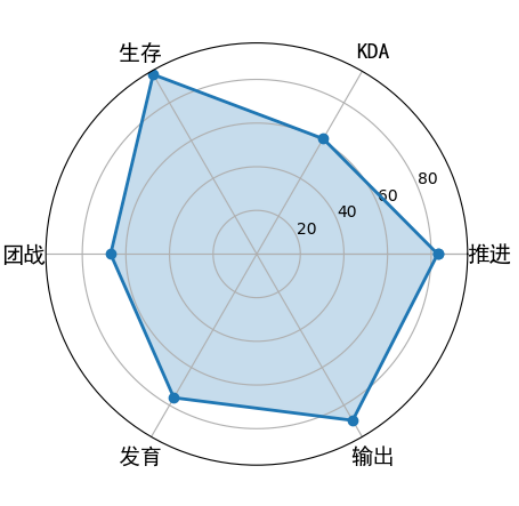

# 14丨数据可视化：掌握数据领域的万金油技能

陈旸 2019-01-14



12:17

讲述：陈旸 大小：11.26M

<audio title="14丨数据可视化：掌握数据领域的万金油技能" src="https://res001.geekbang.org/media/audio/48/8c/484bbea09a7e82b9872cbcdb0a466e8c/ld/ld.m3u8"></audio>
上一讲中，我给你讲了数据变换，今天讲一下数据可视化。如果你想做一名数据分析师，那么掌握可视化技能是必不可少的，因为在大部分情况下，老板更关心呈现的结果。

另外当这些可视化的结果呈现在你眼前时，你才能直观地体会到“数据之美”。图片在内容表达上，要远胜于文字，它不仅能体现数据真实性，还能给人很大的想象空间。

## 数据可视化的视图都有哪些？

在了解数据可视化的重要性之后，我们来看下，在数据可视化产品中，一般都包括哪些视图？

我们常用的可视化视图超过 20 种，分别包括：文本表、热力图、地图、符号地图、饼图、水平条、堆叠条、并排条、树状图、圆视图、并排圆、线、双线、面积图、双组合、散点图、直方图、盒须图、甘特图、靶心图、气泡图等。

你不用记住这些视图名称都是什么，因为在可视化工具中，操作面板上都会有这些图形可控选择。你看一眼就知道它是不是你想要的。

当然，你不仅要掌握这些视图的使用，更要了解使用它们背后的目的是什么，这里我整理了下，可以分为以下的 9 种情况：

 在上面的这几种情况里，你也许想要看某个数据的分布情况，或者它随着时间的趋势，或者是局部与整体之间的关系等等。所以在设计之前，你需要思考的是，你的用户是谁，想给他们呈现什么，需要突出数据怎样的特点，以及采用哪种视图来进行呈现。

比如说，你想呈现某个变量的分布情况，就可以通过直方图的形式来呈现。如果你想要看两个变量之间的相关性及分布情况，可以采用散点图的形式呈现。

一个视图可能会有多种表达的目的，比如散点图既可以表明两个变量之间的关系，也可以体现它们的分布情况。同样，如果我想看变量的分布情况，既可以采用散点图的形式，也可以采用直方图的形式。

所以说，具体要采用哪种视图，取决于你想要数据可视化呈现什么样的目的。

## 数据可视化工具都有哪些？

那么如何把数据弄成上面说的视图呢？我们需要借助数据可视化的工具。

这些工具有很多，我从几个维度来给你介绍下。这几个维度分别是商业智能分析软件、可视化大屏、前端可视化组件和编程语言类。

### **商业智能分析**

首先在商业智能分析软件中，最著名的当属 Tableau 和 PowerBI 了，另外中国帆软出品的 FineBI 也受到国内很多企业的青睐。

Tableau 是国外的商业软件，收费不低。它适合 BI 工程师、数据分析分析师。如果可以熟练掌握 Tableau，那么找到一份数据分析的工作是不难的。

PowerBI 是微软出品的，可以和 Excel 搭配使用，你可以通过 PowerBI 来呈现 Excel 的可视化内容。

在 BI 行业中，Tableau 和 PowerBI 远超其他 BI 产品，处于行业的领导者的位置。

另外 FineBI 是中国的帆软出品，针对国内使用更加友好，同时也倾向于企业级应用的 BI。

**可视化大屏类**

大屏作为一种视觉效果强、科技感强的技术，被企业老板所青睐，可以很好地展示公司的数据化能力。这里给你介绍两款可视化大屏的软件 DataV 和 FineReport。

- **DataV**

DataV 是一款可视化的工具，天猫双十一大屏就是用它呈现的。你要做的就是选择相应的控件，配置控件的样式、数据传输和交互效果等。当然 DataV 本身有一些免费的模板，你可以直接通过模板来创建。不过一些特殊的控件和交互效果还是需要购买企业版才行。

- **FineReport**

FineReport 是帆软出品的工具，你可以看出他家的产品基本上都是 Fine 开头的，包括刚才给你介绍的  FineBI。FineReport  可以做数据大屏，也可以做可视化报表，在很多行业都有解决方案，操作起来也很方便。可以实时连接业务数据，对数据进行展示。

### **前端可视化组件**

如果你想要成为一名前端数据可视化工程师的话，至少熟练掌握一种前端可视化组件是必不可少的，不少公司招聘“高级前端工程师”的时候，都要求熟悉几个开源数据可视化组件。

可视化组件都是基于 Web 渲染的技术的。所以你需要了解一下几个典型的 Web 渲染技术：Canvas、SVG 和 WebGL。简单来说，**Canvas 和 SVG 是 HTML5 中主要的 2D 图形技术，WebGL 是 3D 框架。**

**Canvas 适用于位图**，也就是给了你一张白板，需要你自己来画点。Canvas 技术可以绘制比较复杂的动画。不过它是 HTML5 自带的，所以低版本浏览器不支持 Canvas。ECharts 这个可视化组件就是基于 Canvas 实现的。

**SVG**  的中文是可缩放矢量图形，它是使用 XML  格式来定义图形的。相当于用点和线来描绘了图形，相比于位图来说文件比较小，而且任意缩放都不会失真。SVG  经常用于图标和图表上。它最大的特点就是支持大部分浏览器，动态交互性实现起来也很方便，比如在 SVG 中插入动画元素等。

**WebGL 是一种 3D 绘图协议**，能在网页浏览器中呈现 3D 画面技术，并且可以和用户进行交互。你在网页上看到的很多酷炫的 3D 效果，基本上都是用 WebGL 来渲染的。下面介绍的 Three.js 就是基于 WebGL 框架的。

在了解这些 Web 渲染协议之后，我再来带你看下这些常用的可视化组件： Echarts、D3、Three.js 和 AntV。

***ECharts*** 是基于 H5 canvas 的 Javascript 图表库，是百度的开源项目，一直都有更新，使用的人也比较多。它作为一个组件，可以和 DataV、Python 进行组合使用。

你可以在  DataV 企业版中接入 ECharts 图表组件。也可以使用 Python 的 Web 框架（比如  Django、Flask）+ECharts 的解决方案。这样可以让你的项目更加灵活地使用到 ECharts 的图表库，不论你是用 Python  语言，还是用 DataV 的工具，都可以享受到 ECharts 丰富的图表库样式。

**D3 的全称是 Data-Driven Documents**，简单来说，是一个 JavaScript 的函数库，因为文件的后缀名通常为“.js”，所以 D3 也常使用 D3.js 来称呼。

它提供了各种简单易用的函数，大大简化了 JavaScript 操作数据的难度。你只需要输入几个简单的数据，就能够转换为各种绚丽的图形。由于它本质上是 JavaScript，所以用 JavaScript 也是可以实现所有功能的。

Three.js，顾名思义，就是  Three+JS 的意思。“Three”表示 3D 的意思，“Three.js”就是使用 JavaScript 来实现 3D  效果。Three.js 是一款 WebGL 框架，封装了大量 WebGL 接口，因为直接用 WebGL API 写 3D 程序太麻烦了。

AntV  是蚂蚁金服出品的一套数据可视化组件，包括了 G2、G6、F2 和 L7 一共 4 个组件。其中 G2 应该是最知名的，它的意思是 The  grammar Of Graphics，也就是一套图形语法。它集成了大量的统计工具，而且可以让用户通过简单的语法搭建出多种图表。G6  是一套流程图和关系分析的图表库。F2 适用于移动端的可视化方案。L7 提供了地理空间的数据可视化框架。

**编程语言**

使用数据分析工具，你一定离不开 Python 语言，当然也有人使用 R 语言。在用 Python 和 R 做数据分析的时候，一定少不了用到可视化的部分。

下面我简单介绍下，如何使用 Python 和 R 进行数据可视化。

在 Python 里包括了众多可视化库，比如 Matplotlib、Seaborn、Bokeh、Plotly、Pyecharts、Mapbox 和 Geoplotlib。其中使用频率最高，<u>最需要掌握的就是 **Matplotlib** 和 **Seaborn**。</u>

Matplotlib 是 Python 的可视化基础库，作图风格和 MATLAB 类似，所以称为 Matplotlib。一般学习 Python 数据可视化，都会从 Matplotlib 入手，然后再学习其他的 Python 可视化库。

下面这张图就是我拿 Matplotlib 做的蜘蛛图。

 Seaborn 是一个基于 Matplotlib 的高级可视化效果库，针对 Matplotlib 做了更高级的封装，让作图变得更加容易。你可以用短小的代码绘制更多维度数据的可视化效果图，比如下面这个例子：

 在 R 中也有很多可视化库可供选择。其中包括了 R 自带的绘图包 Graphics 以及工具包 ggplot2、ggmap、timevis 和 plotly 等。

其中  ggplot2 是 R 语言中重要的绘图包，这个工具包将数据与绘图操作进行了分离，所以使用起来清晰明了，画出的图也漂亮。其实在 Python  里后来也引入了 ggplot 库，这样在 Python 中也可以很方便地使用到 ggplot，而且和 R 语言中的 ggplot2  代码差别不大，稍作修改，就能直接在 Python 中运行了。

## 如何开始数据可视化的学习

其实很多企业都有在用商业分析软件，Tableau 算是使用率很高的。如果你想做相关的数据分析研究，掌握一门语言尤其是 Python 还是很有必要的。如果你想要全面的学习数据可视化，你可以有以下的 3 个路径：

**1. 重点推荐 Tableau**

Tableau 在可视化灵活分析上功能强大，主要目标用户更多是较专业的数据分析师。同时在工作场景中使用率高，因此掌握 Tableau 对于晋升和求职都很有帮助。不过 Tableau 是个商业软件，收费不低。而且上手起来有一些门槛，需要一定数据基础。

**2.  使用微图、DataV**

前面我给你讲过八爪鱼的使用，微图和八爪鱼是一家公司的产品，使用起来非常方便，而且免费。当你用八爪鱼采集数据之后，就直接可以用微图进行数据可视化。

DataV 是阿里推出的数字大屏技术，不过它是收费的产品。它最大的好处，就是可以分享链接，让别人可以在线浏览，不需要像 Tableau 一样安装客户端才能看到数据可视化的结果。另外 DataV 有一些模板，你直接可以使用。

你可以先使用微图和 DataV 作为你的数据可视化体验工具，因为成本低，上手起来快。这样你对数据可视化可以有个直观的了解。如果你想从事数据可视化这份工作，你可以花更多的精力去研究和学习 Tableau。

**3. Python 可视化**

Python 是数据分析的首选语言，如果你不进行编程，可以使用我在上文中提到的数据可视化的工具。如果你的目标是个数据挖掘工程师，或者算法工程师，那么最重要的就是要了解，并且熟练掌握 Python 的数据可视化。

## 总结

我今天给你介绍了数据可视化的视图，然后带你讲解了当前主流的数据可视化工具。Tableau  和 PowerBI 是 BI 商业智能行业的领导者，是很多大公司里商业数据分析工作必备的工具。如果你使用 Python  作为数据分析的语言，那么也需要对 Python 数据可视化有所掌握。

 最后给你留两道思考题吧。你平时的工作是怎样的，是否需要用到数据可视化技术呢？在数据可视化技术中，你都用过哪些工具，你觉得哪个工具使用起来比较顺手？

欢迎和我在评论区进行讨论，也欢迎你把这篇文章分享给你的朋友或者同事。

© 版权归极客邦科技所有，未经许可不得传播售卖。 页面已增加防盗追踪，如有侵权极客邦将依法追究其法律责任。         

夜瓜居士

Ctrl + Enter 发表

0/2000字

提交留言

## 精选留言(33)

- 

  数据化分析 

  陈老师讲得很全面👍👍👍，数据分析的学习任重而道远。
  我写过一篇〖Python编程实践（2）：数据可视化〗，感兴趣的同学可以去看看，搜索微信公众号〖数据化分析〗，在历史消息中可以找到。
  文章链接：https://mp.weixin.qq.com/s/dmJGMvFAroxJkTk5NwynSw

  ** 9

  2019-01-14

- 

  三儿 

  老师，感觉讲得像数据分析的科普太浅了

  ** 8

  2019-01-14

- 

  蜘蛛的梦呓 

   Excel：体量小且需要马上出结果；
   Python：灵活可复用，数据量大
   Tableau：清洗数据后使用，一般不知道如何分析时，会用 Tableau 随意分析，找寻灵感。
   个人比较喜欢 excel 和 tableau，python 一般用于搭建可复用的框架（编程能力并不强）。

  ** 6

  2019-01-14

- 

  成欣睿 

  作为学生说一句，Tableau现在有Tableau Prep类似ETL可以处理数据合并数据，而且现在学生通过学校邮箱注册可以有1年使用权，官网还有视频教程！

  ** 4

  2019-01-23

- 

  吴舒成 

  公司推的是FineBI,Finereport。不过能用excel绘图的就没用Python,R。说句实话，Python,R绘制出的图形不仅美观，还分辨率高。换句话说，你写论文用 excel作图，会因为分辨率的问题而被嫌弃的。

  ** 4

  2019-01-14

- 

  FORWARD―MOUNT 

  漏了一个也是阿里巴巴最好用的QuickBI，可以无缝对接所有数据源，上手非常简单，不用编程。我们公司一直在用。

  ** 3

  2019-01-15

- 

  西野圭吾 

  我们公司用的帆软，我也是来公司后才了解的这款，也想上手tableau，不知道tableau支不支持在网页端部署浏览

  ** 3

  2019-01-14

- 

  杰之7 

  通过这一节的阅读，对可视化报表的工具有了更全面的了解。

  目前我接触到了是PowerBI和Python的Matplotlib，我想对于数据工程师而言，可视化懂一到二种主流的，对于其他的可视化工具，能在前端可视化，大屏及可视化组建的使用，能在实际的过程中去使用更好。

  ** 2

  2019-02-11

- 

  浩林 

  海致BDP也很好用

  ** 2

  2019-01-14

- 

  梁林松 

  微图个人版，被业务调整了。

  ** 2

  2019-01-14

- 

  莫巽 

  少量的数据还是喜欢用EXCEL来画简单的图，数据量大的话基本就用matplotlib和seaborn了。

  ** 2

  2019-01-14

- 

  yiwu 

  用最多的，还是excel。来做系统巡检统计，容量分析。客户分布，名单管理。

  ** 2

  2019-01-14

- 

  SageCat 

  帆软员工路过🤪

  ** 1

  2019-04-01

- 

  凛冬里的匍匐者 

  老师，文中提到常用数据可视化图标有20多种，其使用的背后目的总结了9种，麻烦给一个映射关系吧。

  ** 1

  2019-01-22

- 

  你看起来很好吃 

  请问老师，看您的目录上，数据分析的算法和十大机器学习的算法是一样的啊，他们是不是其实是一个东西

  ** 1

  2019-01-15

- 

  徐洲更 

  我平时主要用R语言进行可视化，用的最多就是ggplot系列的工具，基本能用ggplot去组合出自己任意想要的结果

  ** 1

  2019-01-15

- 

  iamtalent123 

  tableau public是可以在线分享作品的呀

  ** 1

  2019-01-14

- 

  奔跑的鳄鱼 

  请问老师，本专栏日后会否涉及机器学习范畴的知识？

  ** 1

  2019-01-14

- 

  几何 

  最近发现plotly_express 也是很好用 可以看此博客  https://blog.csdn.net/weixin_38507462/article/details/88769529

  ** 

  2019-03-24

- 

  周飞 

  我是全栈工程师，工作中使用node、vue和 react。数据可视化方面用过Echarts

  ** 

  2019-02-27

- 

  王彬成 

  你平时的工作是怎样的，是否需要用到数据可视化技术呢？在数据可视化技术中，你都用过哪些工具，你觉得哪个工具使用起来比较顺手？
  我上一份工作是作为房地产商业软件的产品助理，其中一个功能板块是展示房地产销售的营业数据，其中用到的就是Echarts插件，他提供了许多模板，很好地为客户展示数据。
  在这个过程中，我么团队大部分的时间是用来校对数据上，即清洗数据。因为存在大量的错误的，重复的数据，虽然低效，但至关重要。

  ** 

  2019-02-14

- 

  李沛欣 

  数据可视化，工具可真不少，我就记住了Tableu,微图，DataV，Matplotlib这几个，微图我可以试试，因为有八爪鱼的经验在手了。

  ** 

  2019-01-27

- 

  Steven 

  tableau不是必须安装客户端才可以看到可视化的结果的哦。

  ** 

  2019-01-23

- 

  大萌 

  进公司之后就培训了Tableau，学习了基础Tableau的使用方法，平常拿到数据后可先利用Tableau查看数据分布等等，还是挺方便的。
  python用于画图更为灵活和高效，平常编程时候可直接编程画图。

  以上两种我觉得是数据分析师需要掌握的。

  ** 

  2019-01-16

- 

  John 

  Tableau是按照用戶數量和服務器數量收費的 老師能不能講一講 項目該怎麼計算 用多少個服務器的license 我們知道Hadoop類似的架構需要很多的CPU 但是該如何計算需要多少個Tableau的server實在難以入手 請老師解惑

  ** 

  2019-01-15

- 

  coyang 

  使用过 Python的matplotlib解析iostat的结果，将iops，await图形化

  ** 

  2019-01-15

- 

  桃园悠然在 

  方法总比问题多，工具千千万，个人和企业的有不同的适用工具。文中开头提到的数据可视化9中场景值得思考，相当于提出问题：分布、时间相关、局部/整体、偏差、相关性、排名、量级、地图、流动。平时在看各类智库出品的行业观察报告的图表也值得品味。

  ** 

  2019-01-15

- 

  任欣 

  一般用Python将一些可重复性的工作自动化，用excel透视图快速对数据进行初步的分析和整理，得出结果汇报给老板。后期用finebi进行可视化，个人感觉用finebi交互感觉更好，不过tableau的桌面版功能更强大，操作起来也很方便。

  ** 

  2019-01-15

- 

  Jerry 

  spotfire

  ** 

  2019-01-14

- 

  vkingnew 

  在中小企业或者发展中的企业，我觉得会优先选择自定义开发或者开源产品，看好echart

  ** 

  2019-01-14

- 

  青椒 

  我们目前使用power bi，业务场景基本都匹配

  ** 

  2019-01-14

- 

  跳跳 

  工作中用过Excel和python画图
  Excel门槛低一些，绘图也很丰富，适用于数据量较小的情况下
  python的matplotlib使用起来也很方便，画过直方图、折线图等，自己试也是小数据

  ** 

  2019-01-14

- 

  JingZ 

  平时工作的确需要做不少的图，之前都是用excel做的直方图、饼图、雷达图、结构图等等，使用条件格式或是数据透视表动态化~PowerBI感觉连接速度很慢，所以放弃使用了~

  
  Python的Matplotlib感觉还挺好的，稍后试试Seaborn，看到3D的有Mayavi~

  下载了Tableau，打算跟着教程学一下~

  前端可视化组件基本很少用，只听过百度的Echarts和地图汇什么的~

  ** 

  2019-01-14