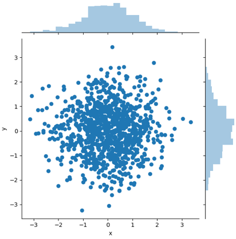
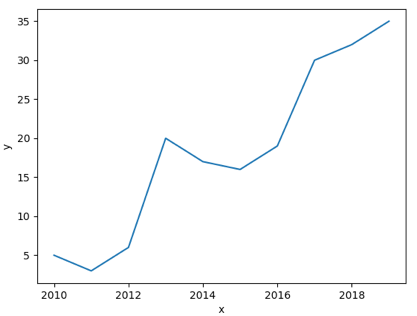
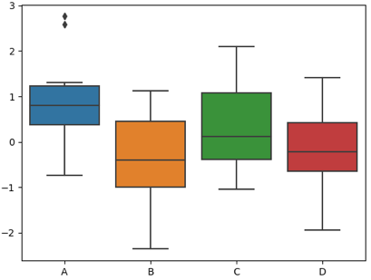
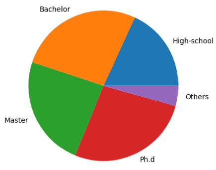
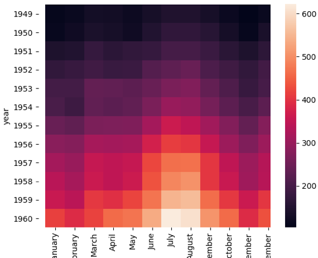
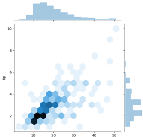

# 15丨一次学会Python数据可视化的10种技能

陈旸 2019-01-16





15:03

讲述：陈旸 大小：13.79M

<audio title="15丨一次学会Python数据可视化的10种技能" src="https://res001.geekbang.org/media/audio/a9/54/a91eb41bd136885f75bfd4a40fdd7054/ld/ld.m3u8"></audio>

今天我来给你讲讲 Python 的可视化技术。

如果你想要用  Python  进行数据分析，就需要在项目初期开始进行探索性的数据分析，这样方便你对数据有一定的了解。其中最直观的就是采用数据可视化技术，这样，数据不仅一目了然，而且更容易被解读。同样在数据分析得到结果之后，我们还需要用到可视化技术，把最终的结果呈现出来。

## 可视化视图都有哪些？

按照数据之间的关系，我们可以把可视化视图划分为 4 类，它们分别是比较、联系、构成和分布。我来简单介绍下这四种关系的特点：

1. 比较：比较数据间各类别的关系，或者是它们随着时间的变化趋势，比如折线图；
2. 联系：查看两个或两个以上变量之间的关系，比如散点图；
3. 构成：每个部分占整体的百分比，或者是随着时间的百分比变化，比如饼图；
4. 分布：关注单个变量，或者多个变量的分布情况，比如直方图。

同样，按照变量的个数，我们可以把可视化视图划分为单变量分析和多变量分析。

单变量分析指的是一次只关注一个变量。比如我们只关注“身高”这个变量，来看身高的取值分布，而暂时忽略其他变量。

多变量分析可以让你在一张图上可以查看两个以上变量的关系。比如“身高”和“年龄”，你可以理解是同一个人的两个参数，这样在同一张图中可以看到每个人的“身高”和“年龄”的取值，从而分析出来这两个变量之间是否存在某种联系。

可视化的视图可以说是分门别类，多种多样，今天我主要介绍常用的 10 种视图，这些视图包括了散点图、折线图、直方图、条形图、箱线图、饼图、热力图、蜘蛛图、二元变量分布和成对关系。


下面我给你一一进行介绍。

###     散点图###     

散点图的英文叫做 scatter plot，它将两个变量的值显示在二维坐标中，非常适合展示两个变量之间的关系。当然，除了二维的散点图，我们还有三维的散点图。

我在上一讲中给你简单介绍了下 Matplotlib 这个工具，在 Matplotlib 中，我们经常会用到 pyplot 这个工具包，它包括了很多绘图函数，类似 Matlab 的绘图框架。在使用前你需要进行引用：

```python

import matplotlib.pyplot as plt


```

在工具包引用后，画散点图，需要使用  plt.scatter(x, y, marker=None) 函数。x、y 是坐标，marker  代表了标记的符号。比如“x”、“>”或者“o”。选择不同的 marker，呈现出来的符号样式也会不同，你可以自己试一下。

下面三张图分别对应“x”“>”和“o”。


 除了 Matplotlib 外，你也可以使用 Seaborn 进行散点图的绘制。在使用 Seaborn 前，也需要进行包引用：

```

import seaborn as sns


```

在引用  seaborn 工具包之后，就可以使用 seaborn 工具包的函数了。如果想要做散点图，可以直接使用 sns.jointplot(x, y,  data=None, kind=‘scatter’) 函数。其中 x、y 是 data 中的下标。data 就是我们要传入的数据，一般是  DataFrame 类型。kind 这类我们取 scatter，代表散点的意思。当然 kind  还可以取其他值，这个我在后面的视图中会讲到，不同的 kind 代表不同的视图绘制方式。

好了，让我们来模拟下，假设我们的数据是随机的 1000 个点。

```

import numpy as np

import pandas as pd

import matplotlib.pyplot as plt

import seaborn as sns

# 数据准备

N = 1000

x = np.random.randn(N)

y = np.random.randn(N)

# 用 Matplotlib 画散点图

plt.scatter(x, y,marker='x')

plt.show()

# 用 Seaborn 画散点图

df = pd.DataFrame({'x': x, 'y': y})

sns.jointplot(x="x", y="y", data=df, kind='scatter');

plt.show()


```

我们运行一下这个代码，就可以看到下面的视图（第一张图为  Matplotlib 绘制的，第二张图为 Seaborn 绘制的）。其实你能看到 Matplotlib 和 Seaborn  的视图呈现还是有差别的。Matplotlib 默认情况下呈现出来的是个长方形。而 Seaborn  呈现的是个正方形，而且不仅显示出了散点图，还给了这两个变量的分布情况。

Matplotlib 绘制：


Seaborn 绘制：



###     折线图###     

折线图可以用来表示数据随着时间变化的趋势。

在 Matplotlib 中，我们可以直接使用 plt.plot() 函数，当然需要提前把数据按照 x 轴的大小进行排序，要不画出来的折线图就无法按照 x 轴递增的顺序展示。

在 Seaborn 中，我们使用 sns.lineplot (x, y, data=None) 函数。其中 x、y 是 data 中的下标。data 就是我们要传入的数据，一般是 DataFrame 类型。

这里我们设置了 x、y 的数组。x 数组代表时间（年），y 数组我们随便设置几个取值。下面是详细的代码。

```

import pandas as pd

import matplotlib.pyplot as plt

import seaborn as sns

# 数据准备

x = [2010, 2011, 2012, 2013, 2014, 2015, 2016, 2017, 2018, 2019]

y = [5, 3, 6, 20, 17, 16, 19, 30, 32, 35]

# 使用 Matplotlib 画折线图

plt.plot(x, y)

plt.show()

# 使用 Seaborn 画折线图

df = pd.DataFrame({'x': x, 'y': y})

sns.lineplot(x="x", y="y", data=df)

plt.show()


```

然后我们分别用 Matplotlib 和 Seaborn 进行画图，可以得到下面的图示。你可以看出这两个图示的结果是完全一样的，只是在 seaborn 中标记了 x 和 y 轴的含义。




###     直方图###     

直方图是比较常见的视图，它是把横坐标等分成了**一定数量的小区间**，这个小区间也叫作“箱子”，然后在每个“箱子”内用矩形条（bars）展示该箱子的箱子数（也就是 y 值），这样就完成了对数据集的直方图分布的可视化。

在 Matplotlib 中，我们使用 plt.hist(x, bins=10) 函数，其中参数 x 是一维数组，bins 代表直方图中的箱子数量，默认是 10。

在  Seaborn 中，我们使用 sns.distplot(x, bins=10, kde=True) 函数。其中参数 x 是一维数组，bins  代表直方图中的箱子数量，kde 代表显示核密度估计，默认是 True，我们也可以把 kde 设置为  False，不进行显示。核密度估计是通过核函数帮我们来估计概率密度的方法。

这是一段绘制直方图的代码。

```

import numpy as np

import pandas as pd

import matplotlib.pyplot as plt

import seaborn as sns

# 数据准备

a = np.random.randn(100)

s = pd.Series(a) 

# 用 Matplotlib 画直方图

plt.hist(s)

plt.show()

# 用 Seaborn 画直方图

sns.distplot(s, kde=False)

plt.show()

sns.distplot(s, kde=True)

plt.show()


```

我们创建一个随机的一维数组，然后分别用 Matplotlib 和 Seaborn 进行直方图的显示，结果如下，你可以看出，没有任何差别，其中最后一张图就是 kde 默认为 Ture 时的显示情况。


###     条形图###     

如果说通过直方图可以看到变量的数值分布，那么条形图可以帮我们查看类别的特征。在条形图中，长条形的长度表示类别的频数，宽度表示类别。

在 Matplotlib 中，我们使用 plt.bar(x, height) 函数，其中参数 x 代表 x 轴的位置序列，height 是 y 轴的数值序列，也就是柱子的高度。

在 Seaborn 中，我们使用 sns.barplot(*x=None, y=None, data=None*) 函数。其中参数 data 为 DataFrame 类型，x、y 是 data 中的变量。

```

import matplotlib.pyplot as plt

import seaborn as sns

# 数据准备

x = ['Cat1', 'Cat2', 'Cat3', 'Cat4', 'Cat5']

y = [5, 4, 8, 12, 7]

# 用 Matplotlib 画条形图

plt.bar(x, y)

plt.show()

# 用 Seaborn 画条形图

sns.barplot(x, y)

plt.show()


```

我们创建了 x、y 两个数组，分别代表类别和类别的频数，然后用 Matplotlib 和 Seaborn 进行条形图的显示，结果如下：


###     箱线图###     

箱线图，又称盒式图，它是在 1977 年提出的，由五个数值点组成：最大值 (max)、最小值 (min)、中位数 (median) 和上下四分位数 (Q3, Q1)。它可以帮我们分析出数据的差异性、离散程度和异常值等。

在 Matplotlib 中，我们使用 plt.boxplot(x, labels=None) 函数，其中参数 x 代表要绘制箱线图的数据，labels 是缺省值，可以为箱线图添加标签。

在 Seaborn 中，我们使用 sns.boxplot(*x=None, y=None, data=None*) 函数。其中参数 data 为 DataFrame 类型，x、y 是 data 中的变量。

```

# 数据准备

# 生成 0-1 之间的 10*4 维度数据

data=np.random.normal(size=(10,4)) 

lables = ['A','B','C','D']

# 用 Matplotlib 画箱线图

plt.boxplot(data,labels=lables)

plt.show()

# 用 Seaborn 画箱线图

df = pd.DataFrame(data, columns=lables)

sns.boxplot(data=df)

plt.show()


```

这段代码中，我生成 0-1 之间的 10*4 维度数据，然后分别用 Matplotlib 和 Seaborn 进行箱线图的展示，结果如下。

Matplotlib 绘制：


Seaborn 绘制：



###     饼图###     

饼图是常用的统计学模块，可以显示每个部分大小与总和之间的比例。在 Python 数据可视化中，它用的不算多。我们主要采用 Matplotlib 的 pie 函数实现它。

在 Matplotlib 中，我们使用 plt.pie(x, labels=None) 函数，其中参数 x 代表要绘制饼图的数据，labels 是缺省值，可以为饼图添加标签。

这里我设置了 lables 数组，分别代表高中、本科、硕士、博士和其他几种学历的分类标签。nums 代表这些学历对应的人数。

```

import matplotlib.pyplot as plt

# 数据准备

nums = [25, 37, 33, 37, 6]

labels = ['High-school','Bachelor','Master','Ph.d', 'Others']

# 用 Matplotlib 画饼图

plt.pie(x = nums, labels=labels)

plt.show()


```

通过 Matplotlib 的 pie 函数，我们可以得出下面的饼图：



###     热力图###

热力图，英文叫 heat map，是一种矩阵表示方法，其中矩阵中的元素值用颜色来代表，不同的颜色代表不同大小的值。通过颜色就能直观地知道某个位置上数值的大小。另外你也可以将这个位置上的颜色，与数据集中的其他位置颜色进行比较。

热力图是一种非常直观的多元变量分析方法。

我们一般使用 Seaborn 中的 sns.heatmap(data) 函数，其中 data 代表需要绘制的热力图数据。

这里我们使用 Seaborn 中自带的数据集 flights，该数据集记录了 1949 年到 1960 年期间，每个月的航班乘客的数量。

```

import matplotlib.pyplot as plt

import seaborn as sns

# 数据准备

flights = sns.load_dataset("flights")

data=flights.pivot('year','month','passengers')

# 用 Seaborn 画热力图

sns.heatmap(data)

plt.show()


```

通过 seaborn 的 heatmap 函数，我们可以观察到不同年份，不同月份的乘客数量变化情况，其中颜色越浅的代表乘客数量越多，如下图所示：



###     蜘蛛图###     

蜘蛛图是一种显示一对多关系的方法。在蜘蛛图中，一个变量相对于另一个变量的显著性是清晰可见的。

假设我们想要给王者荣耀的玩家做一个战力图，指标一共包括推进、KDA、生存、团战、发育和输出。那该如何做呢？

这里我们需要使用 Matplotlib 来进行画图，首先设置两个数组：labels 和 stats。他们分别保存了这些属性的名称和属性值。

因为蜘蛛图是一个圆形，你需要计算每个坐标的角度，然后对这些数值进行设置。当画完最后一个点后，需要与第一个点进行连线。

因为需要计算角度，所以我们要准备 angles 数组；又因为需要设定统计结果的数值，所以我们要设定 stats 数组。并且需要在原有 angles 和 stats 数组上增加一位，也就是添加数组的第一个元素。

```

import numpy as np

import matplotlib.pyplot as plt

import seaborn as sns

from matplotlib.font_manager import FontProperties  

# 数据准备

labels=np.array([u" 推进 ","KDA",u" 生存 ",u" 团战 ",u" 发育 ",u" 输出 "])

stats=[83, 61, 95, 67, 76, 88]

# 画图数据准备，角度、状态值

angles=np.linspace(0, 2*np.pi, len(labels), endpoint=False)

stats=np.concatenate((stats,[stats[0]]))

angles=np.concatenate((angles,[angles[0]]))

# 用 Matplotlib 画蜘蛛图

fig = plt.figure()

ax = fig.add_subplot(111, polar=True)   

ax.plot(angles, stats, 'o-', linewidth=2)

ax.fill(angles, stats, alpha=0.25)

# 设置中文字体

font = FontProperties(fname=r"C:\Windows\Fonts\simhei.ttf", size=14)  

ax.set_thetagrids(angles * 180/np.pi, labels, FontProperties=font)

plt.show()


```

代码中  flt.figure 是创建一个空白的 figure 对象，这样做的目的相当于画画前先准备一个空白的画板。然后  add_subplot(111) 可以把画板划分成 1 行 1 列。再用 ax.plot 和 ax.fill  进行连线以及给图形上色。最后我们在相应的位置上显示出属性名。这里需要用到中文，Matplotlib  对中文的显示不是很友好，因此我设置了中文的字体 font，这个需要在调用前进行定义。最后我们可以得到下面的蜘蛛图，看起来是不是很酷？


###     二元变量分布###     

如果我们想要看两个变量之间的关系，就需要用到二元变量分布。当然二元变量分布有多种呈现方式，开头给你介绍的散点图就是一种二元变量分布。

在  Seaborn 里，使用二元变量分布是非常方便的，直接使用 sns.jointplot(x, y, data=None, kind)  函数即可。其中用 kind  表示不同的视图类型：“kind=‘scatter’”代表散点图，“kind=‘kde’”代表核密度图，“kind=‘hex’ ”代表  Hexbin 图，它代表的是直方图的二维模拟。

这里我们使用 Seaborn 中自带的数据集  tips，这个数据集记录了不同顾客在餐厅的消费账单及小费情况。代码中 total_bill 保存了客户的账单金额，tip  是该客户给出的小费金额。我们可以用 Seaborn 中的 jointplot 来探索这两个变量之间的关系。

```

import matplotlib.pyplot as plt

import seaborn as sns

# 数据准备

tips = sns.load_dataset("tips")

print(tips.head(10))

# 用 Seaborn 画二元变量分布图（散点图，核密度图，Hexbin 图）

sns.jointplot(x="total_bill", y="tip", data=tips, kind='scatter')

sns.jointplot(x="total_bill", y="tip", data=tips, kind='kde')

sns.jointplot(x="total_bill", y="tip", data=tips, kind='hex')

plt.show()


```

代码中我用 kind 分别显示了他们的散点图、核密度图和 Hexbin 图，如下图所示。

散点图：


核密度图：


Hexbin 图：



### 

###     成对关系###     

如果想要探索数据集中的多个成对双变量的分布，可以直接采用  sns.pairplot() 函数。它会同时展示出 DataFrame  中每对变量的关系，另外在对角线上，你能看到每个变量自身作为单变量的分布情况。它可以说是探索性分析中的常用函数，可以很快帮我们理解变量对之间的关系。

pairplot 函数的使用，就像在 DataFrame 中使用 describe() 函数一样方便，是数据探索中的常用函数。

这里我们使用  Seaborn 中自带的 iris 数据集，这个数据集也叫鸢尾花数据集。鸢尾花可以分成 Setosa、Versicolour 和  Virginica 三个品种，在这个数据集中，针对每一个品种，都有 50 个数据，每个数据中包括了 4  个属性，分别是花萼长度、花萼宽度、花瓣长度和花瓣宽度。通过这些数据，需要你来预测鸢尾花卉属于三个品种中的哪一种。

```

import matplotlib.pyplot as plt

import seaborn as sns

# 数据准备

iris = sns.load_dataset('iris')

# 用 Seaborn 画成对关系

sns.pairplot(iris)

plt.show()


```

这里我们用  Seaborn 中的 pairplot 函数来对数据集中的多个双变量的关系进行探索，如下图所示。从图上你能看出，一共有  sepal_length、sepal_width、petal_length 和 petal_width4  个变量，它们分别是花萼长度、花萼宽度、花瓣长度和花瓣宽度。

下面这张图相当于这 4 个变量两两之间的关系。比如矩阵中的第一张图代表的就是花萼长度自身的分布图，它右侧的这张图代表的是花萼长度与花萼宽度这两个变量之间的关系。


## 总结

我今天给你讲了 Python 可视化工具包 Matplotlib 和 Seaborn 工具包的使用。他们两者之间的关系就相当于 NumPy 和 Pandas 的关系。Seaborn 是基于 Matplotlib 更加高级的可视化库。

另外针对我讲到的这  10  种可视化视图，可以按照变量之间的关系对它们进行分类，这些关系分别是比较、联系、构成和分布。当然我们也可以按照随机变量的个数来进行划分，比如单变量分析和多变量分析。在数据探索中，成对关系  pairplot() 的使用，相好比 Pandas 中的 describe() 使用一样方便，常用于项目初期的数据可视化探索。

在 Matplotlib 和 Seaborn 的函数中，我只列了最基础的使用，也方便你快速上手。当然如果你也可以设置修改颜色、宽度等视图属性。你可以自己查看相关的函数帮助文档。这些留给你来进行探索。

关于本次 Python 可视化的学习，我希望你能掌握：

1. 视图的分类，以及可以从哪些维度对它们进行分类；
2. 十种常见视图的概念，以及如何在 Python 中进行使用，都需要用到哪些函数；
3. 需要自己动手跑一遍案例中的代码，体验下 Python 数据可视化的过程。


最后，我给你留两道思考题吧，Seaborn  数据集中自带了 car_crashes 数据集，这是一个国外车祸的数据集，你要如何对这个数据集进行成对关系的探索呢？第二个问题就是，请你用  Seaborn 画二元变量分布图，如果想要画散点图，核密度图，Hexbin 图，函数该怎样写？

欢迎你在评论区与我分享你的答案，也欢迎点击“请朋友读”，把这篇文章分享给你的朋友或者同事，一起来动手练习一下。


© 版权归极客邦科技所有，未经许可不得传播售卖。 页面已增加防盗追踪，如有侵权极客邦将依法追究其法律责任。         


夜瓜居士


Ctrl + Enter 发表

0/2000字

提交留言

## 精选留言(38)

- 

  佳佳的爸 

  建议所有的示例代码加上完整的引用(完整的import语句)，谢谢!

  ** 20

  2019-01-17

- 

  数据化分析 

  ** 8

  2019-01-16

- 

  sxpujs 

  在 Mac 下设置中文字体，可以使用以下路径：
  \# 设置中文字体
  font = FontProperties(fname="/System/Library/Fonts/STHeiti Medium.ttc", size=14)

  ** 3

  2019-04-21

- 

  jsw 

  我的数据和程序都在服务器上，如何可以生成html在web上展示？

  ** 2

  2019-01-17

- 

  跳跳 

  第一题：seaborn car_crashes成对关系探索
  iris=sns.load_dataset("car_crashes")
  sns.pairplot(iris)
  plt.show()
  第二题：由第一题可以看出酒精和速度由类似线性关系，因此做酒精和速度二元变量的分布图
  iris=sns.load_dataset("car_crashes")
  print(iris.head(10))
  sns.jointplot(x='alcohol',y='speeding',data=iris,kind='scatter')
  sns.jointplot(x='alcohol',y='speeding',data=iris,kind='kde')
  sns.jointplot(x='alcohol',y='speeding',data=iris,kind='hex')
  碎碎念一下：为啥留言不支持图片？难受

  ** 2

  2019-01-16

- 

  周飞 

  折线图的demo  中 如果运行出现如下的错误 ： AttributeError: module 'seaborn' has no attribute  'lineplot'. 请看这里  https://stackoverflow.com/questions/51846948/seaborn-lineplot-module-object-has-no-attribute-lineplot  。 解决方案是 ： conda install -c anaconda seaborn=0.9.0

  ** 1

  2019-02-27

- 

  毛毛🐛虫🌻 

  热力图那个是颜色越浅，值越大么？

  ** 1

  2019-01-18

- 

  拉我吃 

  \# coding:utf-8
  import matplotlib.pyplot as plt
  import seaborn as sns

  \# Data Prep
  car_crashes = sns.load_dataset('car_crashes')
  sns.pairplot(car_crashes)
  plt.show()

  \# plot with seaborn (scatter, kde, hex)
  sns.jointplot(x='alcohol', y='speeding', data=car_crashes, kind='scatter')
  sns.jointplot(x='alcohol', y='speeding', data=car_crashes, kind='kde')
  sns.jointplot(x='alcohol', y='speeding', data=car_crashes, kind='hex')
  plt.show()

  二元关系选了喝酒和超速的对比，基本上在大部分区间下是线性关系，就是喝得多速度快:)

  ** 1

  2019-01-17

- 

  吴舒成 

  python在慢慢追赶R，我的R语言分析水平停止了，python水平在往上涨，现在的状态是，有老师的课就学课，没有就看《精益数据分析》。

  ** 1

  2019-01-16

- 

  Andre 

  我的想法是把老师的几种操作，自己做一遍然后发到github和自己的知乎专栏上面

  ** 

  2019-06-05

- 

  阿敦教授 

  老师您好，在用sns.load_dataset（）时，不管load哪个在线数据集，都报错  urllib.error.URLError: <urlopen error [SSL:  CERTIFICATE_VERIFY_FAILED] certificate verify failed: unable to get  local issuer certificate (_ssl.c:1056)>。请问怎么解决呀？谢谢老师

  ** 

  2019-06-03

- 

  滢 

  ** 

  2019-04-15

- 

  Y2Y 

  为什么sns画图操作之后也要plt.show()一下呢？

  ** 

  2019-04-09

- 

  靳学佳 

  老师很全面 就是很深 我零基础

  ** 

  2019-03-24

- 

  周飞 

  1.车祸数据集的成对关系：
  import matplotlib.pyplot as plt
  import seaborn as sns
  \# 数据准备
  car_crash = sns.load_dataset('car_crashes')
  \# 用 Seaborn 画成对关系
  sns.pairplot(car_crash)
  plt.show()
  2.seaborn 画二元变量分布图：
  \# 用 Seaborn 画二元变量分布图（散点图，核密度图，Hexbin 图）
  sns.jointplot(x="total_bill", y="tip", data=tips, kind='scatter')
  sns.jointplot(x="total_bill", y="tip", data=tips, kind='kde')
  sns.jointplot(x="total_bill", y="tip", data=tips, kind='hex')
  plt.show()

  

  ** 

  2019-02-27

- 

  周飞 

  macOS的用户如果不能显示，请看这里：https://matplotlib.org/faq/osx_framework.html#conda 
  conda  install python.app  然后 用pythonw 来运行脚步，此时可能会报错： Intel MKL FATAL ERROR:  Cannot load libmkl_intel_thread.dylib. ， 然后看这里  https://blog.csdn.net/u010900574/article/details/53413937    运行  conda  install -f numpy  和 conda install mkl  。然后在用pythonw 来运行脚本就可以了。 

  ** 

  2019-02-27

- 

  Lambert 

  第一题答案
  import matplotlib.pyplot as plt
  import seaborn as sns
  car_crashes = sns.load_dataset('car_crashes')
  sns.pairplot(car_crashes)
  plt.show()

  第二题答案
  import matplotlib.pyplot as plt
  import seaborn as sns
  car_crashes = sns.load_dataset("car_crashes")
  print(car_crashes.head(10))
  sns.jointplot(x="total", y="speeding", data=car_crashes, kind='scatter')
  sns.jointplot(x="total", y="speeding", data=car_crashes, kind='kde')
  sns.jointplot(x="total", y="speeding", data=car_crashes, kind='hex')
  sns.jointplot(x="total", y="alcohol", data=car_crashes, kind='scatter')
  sns.jointplot(x="total", y="alcohol", data=car_crashes, kind='kde')
  sns.jointplot(x="total", y="alcohol", data=car_crashes, kind='hex')
  sns.jointplot(x="total", y="not_distracted", data=car_crashes, kind='scatter')
  sns.jointplot(x="total", y="not_distracted", data=car_crashes, kind='kde')
  sns.jointplot(x="total", y="not_distracted", data=car_crashes, kind='hex')
  sns.jointplot(x="total", y="no_previous", data=car_crashes, kind='scatter')
  sns.jointplot(x="total", y="no_previous", data=car_crashes, kind='kde')
  sns.jointplot(x="total", y="no_previous", data=car_crashes, kind='hex')
  sns.jointplot(x="total", y="ins_premium", data=car_crashes, kind='scatter')
  sns.jointplot(x="total", y="ins_premium", data=car_crashes, kind='kde')
  sns.jointplot(x="total", y="ins_premium", data=car_crashes, kind='hex')
  sns.jointplot(x="total", y="ins_losses", data=car_crashes, kind='scatter')
  sns.jointplot(x="total", y="ins_losses", data=car_crashes, kind='kde')
  sns.jointplot(x="total", y="ins_losses", data=car_crashes, kind='hex')
  plt.show()

  ** 

  2019-02-21

- 

  xiaoyu0309 

  \#第15课作业,微信：xiaoyu41102126
  import matplotlib.pyplot as plt
  import seaborn as sns
  \# 数据准备
  data = sns.load_dataset('car_crashes')
  print(data.head(20))
  sns.pairplot(data)
  sns.jointplot(x="total", y="speeding", data=data, kind='scatter')
  sns.jointplot(x="total", y="speeding", data=data, kind='kde')
  sns.jointplot(x="total", y="speeding", data=data, kind='hex')
  plt.show()

  ** 

  2019-02-18

- 

  xfoolin 

  ** 

  2019-02-15

- 

  王彬成 

  使用mac的同学，在加载中文字体时，路径可使用
  font=FontProperties(fname='/Library/Fonts/Songti.ttc',size=14)

  ** 

  2019-02-15

- 

  王彬成 

  ** 

  2019-02-15

- 

  小熊猫 

  import matplotlib.pyplot as plt
  import seaborn as sns

  car_crashes = sns.load_dataset('car_crashes')
  car_crashes.head()
  \# 成对关系
  sns.pairplot(car_crashes)
  \# 二元变量
  sns.jointplot(x='alcohol', y='speeding', data=car_crashes, kind='scatter')
  sns.jointplot(x='alcohol', y='speeding', data=car_crashes, kind='kde')
  sns.jointplot(x='alcohol', y='speeding', data=car_crashes, kind='hex')

  ** 

  2019-02-13

- 

  柚子 

  1、seaborn car_crashes成对关系探索：
  import matplotlib.pyplot as plt
  import seaborn as sns
  %matplotlib inline
  car_crashes = sns.load_dataset('car_crashes')
  sns.pairplot(car_crashes)

  2、以酒精和超速画二元变量分布图：
  散点图：sns.jointplot(x = 'alcohol',y = 'speeding',data =car_crashes, kind = 'scatter')
  核密度图：sns.jointplot(x = 'alcohol',y = 'speeding',data =car_crashes, kind = 'kde')
  hexbin图：sns.jointplot(x = 'alcohol',y = 'speeding',data =car_crashes, kind = 'hex')

  ** 

  2019-02-13

- 

  leo 

  请问为什么用jupyter画的图片无法download？点击下载显示一个新的网页，不能下载

  ** 

  2019-01-30

- 

  李沛欣 

  数据可视化的四种分类：比较，联系，构成，分布。

  10种呈现类型：散点图，折线图，直方图，条形图，箱形图，热力图，蜘蛛图（雷达图），二元变量分布图，成对关系图。

  ** 

  2019-01-29

- 

  胖陶 

  \#作业
  \#成对关系图
  import matplotlib.pyplot as plt
  import seaborn as sns
  import pandas as pd
  car_crashes = sns.load_dataset('car_crashes')
  sns.pairplot(car_crashes)
  plt.show()
  \#散点图，核密度图，Hexbin图
  df = pd.DataFrame(car_crashes)
  sns.jointplot(x="alcohol",y="speeding",data=df,kind='scatter')
  sns.jointplot(x="alcohol",y="speeding",data=df,kind='kde')
  sns.jointplot(x="alcohol",y="speeding",data=df,kind='hex')

  ** 

  2019-01-26

- 

  Chino 

  请问在蜘蛛图的代码中 这个 angles=np.linspace(0, 2*np.pi, len(labels), endpoint=False) 里的
  2*np.pi 为什么要这样写呢

  ** 

  2019-01-25

- 

  圆圆的大食客 

  ** 

  2019-01-25

- 

  白夜 

  改字体的这个模块的引用。部分朋友可能需要
  from matplotlib.font_manager import FontProperties

  ** 

  2019-01-24

- 

  胖猫 

  \# mac python3.6
  import matplotlib.pyplot as plt
  import seaborn as sns
  \# 数据准备
  \# 用mac的同学这边会踩坑， mac自带的openssl太老，需要先升级。command is /Applications/Python\ 3.6/Install\ Certificates.command
  car_crashes = sns.load_dataset("car_crashes")
  sns.pairplot(car_crashes)
  plt.show()
  \# 二元变量分布图（散点图，核密度图，Hexbin 图）
  sns.jointplot(x="alcohol", y="speeding", data=car_crashes, kind='scatter')
  sns.jointplot(x="alcohol", y="speeding", data=car_crashes, kind='kde')
  sns.jointplot(x="alcohol", y="speeding", data=car_crashes, kind='hex')
  plt.show()

  ** 

  2019-01-23

- 

  梁林松 

  交作业
  import matplotlib.pyplot as plt
  import seaborn as sns

  df = sns.load_dataset("car_crashes")
  print(df.head(10))
  sns.pairplot(df)
  sns.jointplot(x="total",y="alcohol",data=df,kind="scatter")
  sns.jointplot(x="total",y="alcohol",data=df,kind="kde")
  sns.jointplot(x="total",y="alcohol",data=df,kind="hex")
  plt.show()

  ** 

  2019-01-20

- 

  梁林松 

  ** 

  2019-01-18

- 

  姜戈 

  ** 

  2019-01-18

- 

  Grandia_Z 

  Seaborn Lineplot Module Object Has No Attribute 'Lineplot'

  ** 

  2019-01-16

- 

  从未在此 

  pairplot和facetgrid比较喜欢。一次画好多

  ** 

  2019-01-16

- 

  晴天小雨 

  老师，seaborn是不是不支持饼图？文档搜了半天都没有搜到关键字段！

  ** 

  2019-01-16

- 

  JingZ 

  \#2019/1/16,可视化10种技能
  car_crashes有8个变量， total, speeding, alcohol, no_distracted, no_previous, ins_premium, ins_losses, abbrev，可以考虑变量之间的比较、联系、构成和分布关系～

  import matplotlib.pyplot as plt
  import seaborn as sns

  \#数据准备
  car_crashes = sns.load_dataset('car_crashes')
  print(car_crashes.head(10))

  \#用 Seaborn 画成对关系
  sns.pairplot(car_crashes)
  plt.savefig('car_crashes.jpg')

  \#用 Seaborn 画二元变量分布图（散点图、核密度图、Hexbin图）
  sns.jointplot(x='speeding', y='total', data=car_crashes, kind='scatter')
  sns.jointplot(x='speeding', y='total', data=car_crashes, kind='kde')
  sns.jointplot(x='speeding', y='total', data=car_crashes, kind='hex')

  plt.show()

  起早码代码~

  ** 

  2019-01-16

- 

  晴天小雨 

  老师，辛苦了！这么晚还在更新！

  ** 

  2019-01-16