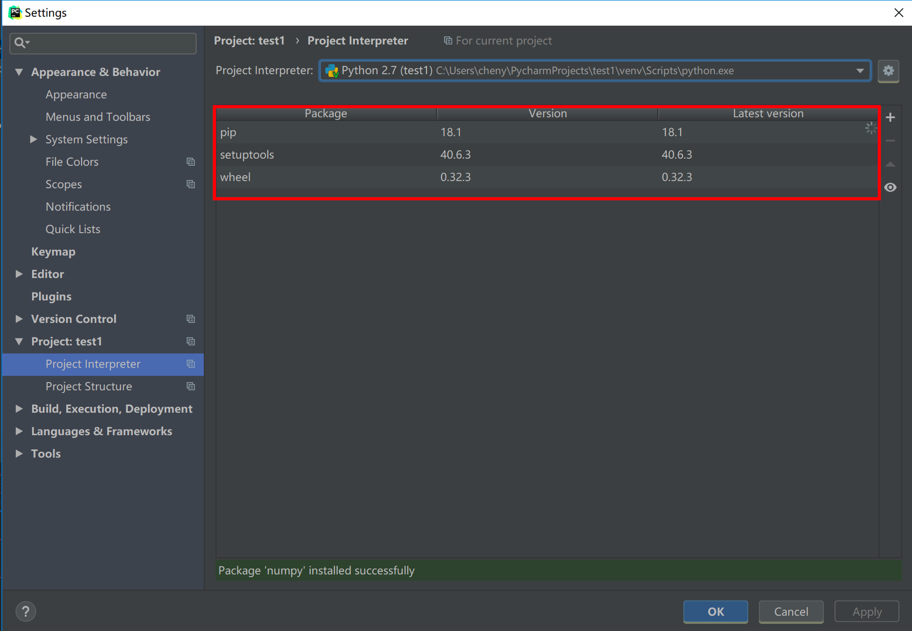
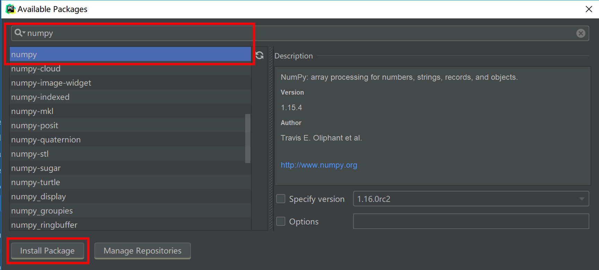

# 16丨数据分析基础篇答疑

陈旸 2019-01-18





16:06

讲述：陈旸 大小：14.76M

<audio title="16丨数据分析基础篇答疑" src="https://res001.geekbang.org/media/audio/4d/3c/4dddb2c025ea8fb2d49396dcc8a37c3c/ld/ld.m3u8"></audio>

截止到今天，我们已经将数据分析基础篇的内容都学习完了。在这个过程中，感谢大家积极踊跃地进行留言，既给其他同学提供了不少帮助，也让专栏增色了不少。在这些留言中，有很多同学对某个知识点有所疑惑，我总结了  NumPy、Pandas、爬虫以及数据变换中同学们遇到的问题，精选了几个具有代表性的来作为答疑。

## NumPy 相关

**答疑 1：如何理解 NumPy 中 axis 的使用？**

这里我引用文稿中的一段代码：

```

a = np.array([[4,3,2],[2,4,1]])

print np.sort(a)

print np.sort(a, axis=None)

print np.sort(a, axis=0)  

print np.sort(a, axis=1)  


```

同学们最容易混淆的是 axis=0 和 axis=1 的顺序。你可以记住：axis=0 代表跨行（实际上就是按列），axis=1 代表跨列（实际上就是按行）。

如果排序的时候，没有指定 axis，默认 axis=-1，代表就是按照数组最后一个轴来排序。如果 axis=None，代表以扁平化的方式作为一个向量进行排序。

所以上面的运行结果为：

```

[[2 3 4]

 [1 2 4]]

[1 2 2 3 4 4]

[[2 3 1]

 [4 4 2]]

[[2 3 4]

 [1 2 4]]


```

我解释下  axis=0 的排序结果，axis=0 代表的是跨行（跨行就是按照列），所以实际上是对 [4, 2] [3, 4] [2, 1]  来进行排序，排序结果是 [2, 4] [3, 4] [1, 2]，对应的是每一列的排序结果。还原到矩阵中也就是 [[2 3 1], [4, 4,  2]]。

### 

**答疑 2：定义结构数组中的 S32 代表什么意思**？

我文稿中定义了一个结构数组 persontype。

```

import numpy as np

persontype = np.dtype({

    'names':['name', 'age', 'chinese', 'math', 'english'],

    'formats':['S32','i', 'i', 'i', 'f']})


```

这里实际上用的是 numpy 中的字符编码来表示数据类型的定义，比如 i 代表整数，f 代表单精度浮点数，S 代表字符串，S32 代表的是 32 个字符的字符串。


如果数据中使用了中文，可以把类型设置为 U32，比如：

```

import numpy as np

persontype = np.dtype({

    'names':['name', 'age', 'chinese', 'math', 'english'],

    'formats':['U32','i', 'i', 'i', 'f']})

peoples = np.array([(" 张飞 ",32,75,100, 90),(" 关羽 ",24,85,96,88.5), (" 赵云 ",28,85,92,96.5),(" 黄忠 ",29,65,85,100)], dtype=persontype)


```

**答疑 3：PyCharm 中无法 import numpy 的问题**

有些同学已经安装好了 numpy，但在 PyCharm 中依然无法使用 numpy。遇到这个问题的主要原因是 PyCharm 会给每一个新建的项目都是一个全新的虚拟环境。


在这个环境下，默认的包只有 pip、setuptools 和 wheel 这三个工具，你可以在 File->Settings 里面找到这个界面。



这说明 numpy 并没有配置到你创建的这个 Project 下的环境中，需要手动点击右侧的 + 号，对 numpy 进行添加。


 添加之后，你就可以正常运行程序，显示出结果了。

**答疑 4：我不明白为什么打印出来的 name 会带一个 b？**

这位同学的代码是这样的：

```

student = np.dtype([('name','S20'), ('age', 'i1'), ('marks', 'f4')])

 a = np.array([('abc', 21, 50),('xyz', 18, 75)], dtype = student)

 print(a)

 print(a['name'])

 结果：

 [(b'abc', 21, 50.) (b'xyz', 18, 75.)]

 [b'abc' b'xyz']


```

我来解释一下。Python3 默认 str 是 Unicode 类型，所以要转成 bytestring，会在原来的 str 前加上 b。如果你用 py2.7 就不会有这个问题，py3 的 b 只是告诉你这里它转化成了 bytestring 进行输出。

**答疑 5：np.ceil 代表什么意思？**

ceil 是 numpy 中的一个函数，代表向上取整。比如 np.ceil(2.4)=3。

## 数据分析思维培养及练习相关

**答疑 1：Online Judge 的比赛题目，数学不好怎么办？**

Vol1~Vol32 的难度是逐渐增加吗的，怎么可以选出有易到难的题目？

Online  Judge 有一些简单的题目可以选择，选择使用人数多，且 accepted 比例高的题目。另外它面向的是一些参加比赛的人员，比如高中的 NOI  比赛，或者大学的 ACM 比赛。你也可以选择 leetcode 或者 pythontip 进行训练。

难度不一定是增加的，而是出题的先后顺序。难易程度，你可以看下提交的人数和 Accepted 的比例。提交人数和 Accepted 比例越高，说明越简单。

**答疑 2：加餐中小区宽带使用多台手机等设备，不会被检测到吗？**

小区宽带和手机飞行是两种解决方案。用手机飞行不需要用到小区宽带。 用小区宽带需要使用到交换机，这里可以自己来控制交换机，每次自动切换 IP。

**答疑 3：加餐中提到的一万个手机号。。。那怎么更换呢？也要一万台设备吗？**

1 万个手机号，主要用于账号注册，通常采用的是“卡池”这个设备。简单来说，卡池可以帮你做收发短信。一个卡池设备 512 张卡，并发 32 路。

有了卡池，还需要算法。你不能让这  512 张卡每次操作都是有规律可循的，比如都是同步执行某项操作，否则微信、Facebook 会直接把它们干掉。学过数据挖掘的人应该会知道，这  512 张卡如果是协同操作，可以直接被算法识别出来。在微信、Facebook 看来，这 512  张卡实际上是同一个人，也就是“机器人”。所以卡池可以帮你做短信验证码，以便账号登录用。MIFI+SIM  帮你做手机流量上网用。这是两套不同的设备。

**答疑 4：听说企业里用 SQL 和 Excel 进行数据分析的很多，这块该如何选择？**

SQL 和 Excel 做统计的工作多一些，涉及到编程的很少。如果你想在这个行业进一步提升，或者做一名算法工程师，那么你都要和 Python 打交道。专栏里数据挖掘算法的部分，是用 Python 交付的。Excel 和 SQL 很难做数据挖掘。

如果想对数据概况有个了解，做一些基础分析，用 Excel 和 SQL 是 OK 的。但是想进一步挖掘数据的价值，掌握 Python 还是挺有必要的。

另外，如果你做的是数据可视化工作，在企业里会用到 tableau 或者 powerBI 这些工具。数据采集你也可以选择第三方工具，或者自己用 Python 来编写。

**答疑 5：学一些算法的时候比如 SVM，是不是掌握它们的理论内容即可。不需要自己去实现，用的时候调用库即可？**

是的，这些算法都有封装，直接使用即可。在 python 的 sklearn 中就是一行语句的事。

**答疑 6：老师，我现在等于从零开始学数据挖掘，所谓的数学基础指的是把高数学到哪种境界啊？是像考研那样不管极限导数积分每种题型都要会解，还是只需要了解这些必备的高数基础的概念？**

不需要求解每一道数学题，只需要具备高数基础概念即可！概率论与数理统计、线性代数、最优化方法和图论这些，我在算法中涉及的地方都会讲到，你暂时不用提前学习这些数学知识。我觉得最好的方式就是在案例中灵活运用，这样可以加深你对这些数学知识的理解。

对于大部分从 0 开始学数据挖掘的人来说，可以淡化公式，重点理解使用场景和概念。

## 爬虫相关问题

**答疑 1：关于 Python 爬虫工具的推荐**

我除了在专栏里讲到了**Requests、XPath 解析**，以及 Selenium、PhantomJS。还有一些工具是值得推荐的。

**Scrapy**  是一个 Python 的爬虫框架，它依赖的工具比较多，所以在 pip install 的时候，会安装多个工具包。scrapy  本身包括了爬取、处理、存储等工具。在 scrapy 中，有一些组件是提供给你的，需要你针对具体任务进行编写。比如在 item.py  对抓取的内容进行定义，在 spider.py 中编写爬虫，在 pipeline.py 中对抓取的内容进行存储，可以保存为 csv  等格式。这里不具体讲解 scrapy 的使用。

另外，***Puppeteer*** 是个很好的选择，可以控制 Headless  Chrome，这样就不用 Selenium 和 PhantomJS。与 Selenium 相比，Puppeteer 直接调用 Chrome 的  API 接口，不需要打开浏览器，直接在 V8 引擎中处理，同时这个组件是由 Google 的 Chrome 团队维护的，所以兼容性会很好。

**答疑 2：driver = webdriver.Chrome()，为什么输入这个代码就会报错了呢？**

报错的原因是没有下载或正确配置 ChromeDriver 路径，正确的方法如下：

\1. 下载 ChromeDriver，并放到 Chrome 浏览器目录中；

下载地址：<http://npm.taobao.org/mirrors/chromedriver/72.0.3626.7/>

\2. 将 Chrome 浏览器目录添加到系统的环境变量 Path 中，然后再运行下试试.

另外你也可以在代码中设置 ChromeDriver 的路径，方法如下：

```

chrome_driver = "C:\Users\cheny\AppData\Local\Google\Chrome\Application\chromedriver.exe"

driver = webdriver.Chrome(executable_path=chrome_driver)


```

**答疑 3：如果是需要用户登陆后才能爬取的数据该怎么用 python 来实现呢？**

你可以使用  Python+Selenium 的方式完成账户的自动登录，因为 Selenium 是个自动化测试的框架，使用 Selenium 的  webdriver 就可以模拟浏览器的行为。找到输入用户名密码的地方，输入相应的值，然后模拟点击即可完成登录（没有验证码的情况下）。

另外你也可以使用 cookie 来登录网站，方法是你登录网站时，先保存网站的 cookie，然后在下次访问的时候，加载之前保存的 cookie，放到 request headers 中，这样就不需要再登录网站了。

**答疑 4：为什么我在豆瓣网查询图片的网址与你不一样？https://www.douban.com/search?cat=1025&q=王祖贤 &source=suggest 。**

咱们访问豆瓣查询图片的网址应该是一样的。只是我给出的是 json 的链接。

方法是这样的：用 Chrome 浏览器的开发者工具，可以监测出来网页中是否有 json 数据的传输，所以我给出的链接是 json 数据传输的链接： [https://www.douban.com/j/search_photo?q=%E7%8E%8B%E7%A5%96%E8%B4%A4&limit=20&start=0](https://www.douban.com/j/search_photo?q=王祖贤&limit=20&start=0)

**答疑 5：XHR 数据这个是如何查出来的，我使用 chrome 的开发者工具查看 XHR 数据，但是查不到这部分，麻烦老师帮忙解答。**

你需要使用浏览器的插件查看 XHR 数据，比如在 Chrome 的开发者工具。

在豆瓣搜索中，我们对“王祖贤”进行了模拟，发现 XHR 数据中有一个请求是这样的：

<https://www.douban.com/j/search_photo?q=>王祖贤 &limit=20&start=0

你可以看一下操作流程。


<video style="vertical-align: top;width:680px;height:382px" webkit-playsinline="" playsinline="" x5-playsinline="" x5-video-player-type="h5" x5-video-player-fullscreen="true" src="blob:https://time.geekbang.org/53228fdd-2ad1-4e28-bcca-450152a7f9ea" controls="controls" poster=""></video>


## 数据变换相关

**答疑 1：数据规范化、归一化、标准化是同一个概念么？**

数据规范化是更大的概念，它指的是将不同渠道的数据，都按照同一种尺度来进行度量，这样做有两个好处，一是让数据之间具有可比较性；另一个好处就是方便后续运算，因为数据在同一个数量级上规整了，在机器学习迭代的时候，也会加快收敛效率。

数据归一化和数据标准化都是数据规范化的方式。不同点在于数据归一化会让数据在一个  [0,1] 或者 [-1,1] 的区间范围内。而数据标准化会让规范化的数据呈现正态分布的情况，所以你可以这么记：归一化的“一”，是让数据在  [0,1] 的范围内。而标准化，目标是让数据呈现标准的正态分布。

**答疑 2：什么时候会用到数据规范化（Min-max、Z-Score 和小数定标）？**

刚才提到了，进行数据规范化有两个作用：一是让数据之间具有可比较性，二是加快后续算法的迭代收敛速度。

实际上你能看到  Min-max、Z-Score  和小数定标规范化都是一种线性映射的关系，将原来的数值投射到新的空间中。这样变换的好处就是可以看到在特定空间内的数值分布情况，比如通过  Min-max 可以看到数据在 [0,1] 之间的分布情况，Z-Score 可以看到数值的正态分布情况等。

不论是采用哪种数据规范化方法，规范化后的数值都会在同一个数量的级别上，这样方便后续进行运算。

那么回过头来看，在数据挖掘算法中，是否都需要进行数据规范化呢？一般情况下是需要的，尤其是针对距离相关的运算，比如在 K-Means、KNN 以及聚类算法中，我们需要有对距离的定义，所以在做这些算法前，需要对数据进行规范化。

另外还有一些算法用到了梯度下降作为优化器，这是为了提高迭代收敛的效率，也就是提升找到目标函数最优解的效率。我们也需要进行数据规范化，比如逻辑回归、SVM 和神经网络算法。

在这些算法中都有目标函数，需要对目标函数进行求解。梯度下降的目标是寻找到目标函数的最优解，而梯度的方法则指明了最优解的方向，如下图所示。


当然不是所有的算法都需要进行数据规范化。在构造决策树的时候，可以不用提前做数据规范化，因为我们不需要关心特征值的大小维度，也没有使用到梯度下降来做优化，所以数据规范化对决策树的构造结果和构造效率影响不大。除此之外，还是建议你在做数据挖掘算法前进行数据规范化。

**答疑 3：如何使用 Z-Score 规范化，将分数变成正态分布？**

我在专栏文稿中举了一个  Z-Score 分数规范化的例子，假设 A 与 B 的考试成绩都为 80 分，A 的考卷满分是 100 分（及格 60 分），B 的考卷满分是  500 分（及格 300 分）。这里假设 A 和 B 的考试成绩都是成正态分布，可以直接采用 Z-Score 的线性化规范化方法。

在专栏的讨论区中，有个同学提出了“Z-Score”的非线性计算方式，大家可以一起了解下：

1. 先按公式计算出百分等级。百分等级（年级）=100-(100x 年级名次 -50)/ 有效参加考试人数。这里百分等级是每个学生在该批学生中的相对位置，其中百分等级是按照正态分布图的所占面积比例求得的；
2. 按照百分等级数去标准正态分布表中查询得出 Z-Score 值，这样最终得出的 Z 分便是标准的正态分布，能够将偏态转化成标准正态。

因为在很多情况下，数值如果不是正态分布，而是偏态分布，直接使用 Z-Score  的线性计算方式无法将分数转化成正态分布。采用以上的方法可以解决这一个问题，大家可以了解下。这里偏态分布指的是非对称分布的偏斜状态，包括了负偏态，也就是左偏态分布，以及正偏态，也就是右偏态分布。

我发现大家对工具的使用和场景比较感兴趣，所以最后留两道思考题。

第一道题：假设矩阵 a = np.array([[4,3,2],[2,4,1]])，请你编写代码将矩阵中的每一列按照从小到大的方式进行排序。

第二道题：你都用过哪些 Python 爬虫工具，抓取过哪些数据，觉得哪个工具好用？

欢迎你在评论分享你的想法，也欢迎你点击“请朋友读”，把它分享给你的朋友或者同事。


© 版权归极客邦科技所有，未经许可不得传播售卖。 页面已增加防盗追踪，如有侵权极客邦将依法追究其法律责任。         


夜瓜居士


Ctrl + Enter 发表

0/2000字

提交留言

## 精选留言(23)

- 

  HxScript 

  这个答疑课是真的良心了。。。。。。

  ** 24

  2019-01-18

- 

  任欣 

  使用过Python中的beautiful soup挖掘招聘网站中的人员信息。解析网页比较快，但是遇到验证码的问题比较难搞，如果遇见比较难搞的验证码，比如火车票的验证码，怎么办

  ** 2

  2019-01-19

- 

  許敲敲 

  np.sort(a,axis=0)
  第二题 就会最简单的request 加beautifulsoup. 
  加re表达式，爬过 地铁网站 机械专业论坛

  ** 2

  2019-01-18

- 

  一语中的 

  import numpy as np
  a = np.array([[4,3,2],[2,4,1]])
  print (np.sort(a, axis=0) )

  关于爬虫：
  1.selenium+chrome/chromeless/phatomJS， 可以处理页面加载后，需要运行javaScript，元素才会显示的情况；
  2.Scrapy 爬虫框架，针对数据量大，层级嵌套较多的网页，框架中用到yield生成器，是关键
  3.解析，lxml,bs4包，正则表达式等  

  ** 1

  2019-02-25

- 

  Mingjie 

  我简单学过scrapy，很容易上手的爬虫框架，用cookie解决登录问题，

  ** 1

  2019-01-19

- 

  Grandia_Z 

  报个到，已经上了18讲了，打算利用周末的时间回顾下做个期中复习(^_^)a

  ** 1

  2019-01-18

- 

  泄矢的呼啦圈 

  \# 评论没啥有用内容，纯夸，加热度
  虽然看到这里的时候前面遇到的疑惑已经自行搜索解决了，还是要为老师的处理方式点赞啊（之前看老师回复相对较少，还以为已经不对评论区内容跟进了）

  ** 

  2019-04-17

- 

  随便讲两句 

  ChromeDriver要留意版本问题，老师上面留的地址是对应Chrome 72的。
  应该到 https://npm.taobao.org/mirrors/chromedriver/ 下载对应版本（暂时最新是74）。

  ** 

  2019-04-03

- 

  几何 

  chromedriver那个需要下载和自己电脑chrome版本相对应的chromedriver

  ** 

  2019-03-24

- 

  几何 

  pyquery解析网页挺好用的

  ** 

  2019-03-24

- 

  尚科 

  在一些教材中，数据预处理环节，有一致性检验，具体含义、作用是什么？有没有什么场景举例

  ** 

  2019-03-20

- 

  周飞 

  按列排序：
  import numpy as np
  a = np.array([[4,3,2],[2,4,1]])
  print (np.sort(a,axis=0))

  ** 

  2019-02-28

- 

  Chen 

  需要和陈老师讨论一个问题，在网上看到有前辈讲关于“逻辑回归是否需要进行标准化？”，答案是取决于逻辑回归是不是用正则。讲的原因是不用正则时，仅仅是度量预测与真实值的差距，加上正则后，损失函数除了要度量差距外还要度量参数值是否足够小。。而参数值的大小程度或者说大小的级别是与特征的数值范围相关的。您是否同意呢？您讲是当用到梯度下降作为优化器，提高寻找最优解的效率而做标准化。这个前辈讲的是否有道理呢？我比较迷糊了。

  ** 

  2019-02-18

- 

  路过蜻蜓 

  第一题：
  import numpy as np
  a = np.array([[4,3,2],[2,4,1]])
  print (np.sort(a, axis=0) )
  第二题
  爬虫用的是requests，分析用的比较多的是xpath，有时会用re，re有些优势是xpath不能替代的。beautiful  soup 会用，但不用，因为抓取速度是比xpath和re慢。用过senlenium 和headless chromedriver  抓取过一些只用javascript生成数据的网页，xhr都抓不出什么数据的，加密的太严格了。senlenium的确可以无脑抓取网页，但很容易崩溃，不稳定，Puppeteer没有用过，之后会尝试去替代senlenium来抓取。

  ** 

  2019-02-16

- 

  王彬成 

  第一道题：假设矩阵 a = np.array([[4,3,2],[2,4,1]])，请你编写代码将矩阵中的每一列按照从小到大的方式进行排序。
  import numpy as np
  a = np.array([[4,3,2],[2,4,1]])
  print (np.sort(a, axis=0) )
  第二道题：你都用过哪些 Python 爬虫工具，抓取过哪些数据，觉得哪个工具好用？
  1、爬虫工具用过八爪鱼采集器，原因是简单可视化操作。
  2、也是用过python的requests库，另外加beautiful解析

  ** 

  2019-02-16

- 

  小熊猫 

  \1. 按列，axis=0
  a = np.array([[4,3,2], [2, 4, 1]])
  np.sort(a, axis=0)

  2.目前就用了跟老师一样的。requests，selenium，

  ** 

  2019-02-13

- 

  hh 

  抓过爱卡汽车、豆瓣电影、猫眼电影、今日头条图片、百度贴吧、CSDN等一些网站，scrapy很好用

  ** 

  2019-01-29

- 

  Chino 

  np.sort(a,axis = 0)

  用过request，re，beautifulsoup
  只爬取过一些不用登陆的网站. 因为还没学到爬取登陆的网站(也一直想学) 希望有类似的实战

  ** 

  2019-01-28

- 

  雨先生的晴天 

  打卡报到， 第一题： np.sort(a, axis=0)
  第二题，现在就用过八爪鱼，需要付费的品牌有diff bo t

  ** 

  2019-01-26

- 

  wonderland 

  练习1：代码：
  a =np.array([[4,3,2],[2,4,1]])
  b = np.sort(a,axis=0)
  print(b)
  练习2：目前只用过老师在课上说的并让我们实操的抓取工具：
  第一个是八爪鱼，下载并安装，然后抓取了新浪微博上“D&G”的评论数据，使用感受：完全可视化界面操作，方便简单直接，比较容易上手，但是感觉比较卡顿，抓取不够顺畅
  第个是request抓取Jason数据，主要是通过jupyter抓取了豆瓣上明星的图片，使用感受：代码量少，直接调用一些常用的库即可完成抓取工作，而且可以导出成我们想要的数据，比较顺畅，但是上手还需要多上网查些相关资料，中间会遇到一些意想不到抓取失败的bug

  

  ** 

  2019-01-19

- 

  JingZ 

  \#2019/1/18 数据分析基础答疑
  1、排序
  import numpy as np

  a = np.array([[4, 3, 2], [2, 4, 1]])
  print(np.sort(a, axis=0))

  2、爬虫
  \- 八爪鱼，爬取豆瓣/微信/微博数据，感觉用起来还算方便，细节还待优化
  \- urllib/requests/BeautifulSoup，爬取股票数据，熟悉框架后还不错，正则表达式还需熟悉用法
  \- Scrapy，貌似很高级，还没实际爬，只看了慕课上的课程

  问题：工作面试一般会看中数据结构和算法等基础知识和白板写程序，像转型者如何更好准备？目前考虑刷课、写作业、刷题~

  ** 

  2019-01-18

- 

  Destroy、 

  答疑 2：driver = webdriver.Chrome()，为什么输入这个代码就会报错了呢？
  这个问题还有一个方法，就是直接把下载的ChromeDriver放在和程序文件同个文件夹下即可。

  ** 

  2019-01-18

- 

  大龄小学生 

  用过requests+re,但是python的re不完整。

  ** 

  2019-01-18