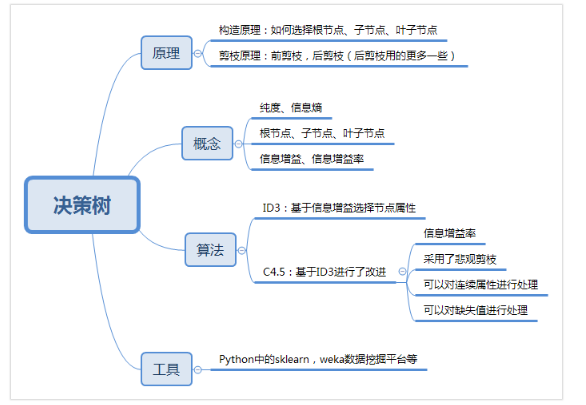

## 数据挖掘--算数流

第二个部分是数据挖掘，它可以说是知识型的工程，相当于整个专栏中的“算法”部分。首先你要知道它的基本流程、十大算法、以及背后的数学基础。

### 数据挖掘的十大算法

为了进行数据挖掘任务，数据科学家们提出了各种模型，在众多的数据挖掘模型中，国际权威的学术组织 ICDM （the IEEE International Conference on Data Mining）评选出了十大经典的算法。

按照不同的目的，我可以将这些算法分成四类，以便你更好的理解。

l **分类算法**：C4.5，朴素贝叶斯（Naive Bayes），SVM，KNN，Adaboost，CART

l **聚类算法**：K-Means，EM

l **关联分析**：Apriori

l **连接分析**：PageRank

Python  的 sklearn，或者是  Weka（一个免费的数据挖掘工作平台），它们已经集成了这两种算法。只是我们在了解了这两种算法之后，才能更加清楚这两种算法的优缺点。

我们总结下，这次都讲到了哪些知识点呢？

##【决策树分类Classification  】

首先我们采用**决策树分类**，需要了解它的原理，包括它的构造原理、剪枝原理。另外在信息度量上，我们需要了解信息度量中的纯度和信息熵的概念。在决策树的构造中，一个决策树包括根节点、子节点、叶子节点。在属性选择的标准上，度量方法包括了信息增益和信息增益率。在算法上，我讲解了两种算法：ID3  和 C4.5，其中 ID3 是基础的决策树算法，C4.5  在它的基础上进行了改进，也是目前决策树中应用广泛的算法。

首先 ID3  算法的优点是方法简单，缺点是对噪声敏感。训练数据如果有少量错误，可能会产生决策树分类错误。

C4.5 在 ID3  的基础上，用信息增益率代替了信息增益，解决了噪声敏感的问题，并且可以对构造树进行剪枝、处理连续数值以及数值缺失等情况，但是由于 C4.5  需要对数据集进行多次扫描，算法效率相对较低。

然后在了解这些概念和原理后，强烈推荐你使用工具，具体工具的使用我会在后面进行介绍。

##【回归树分类Regression 】

**分类树**可以处理离散数据，也就是数据种类有限的数据，它输出的是样本的类别，

而**回归树**可以对连续型的数值进行预测，也就是数据在某个区间内都有取值的可能，它输出的是一个数值。