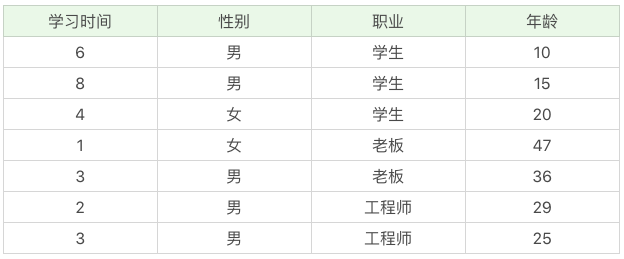
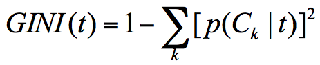
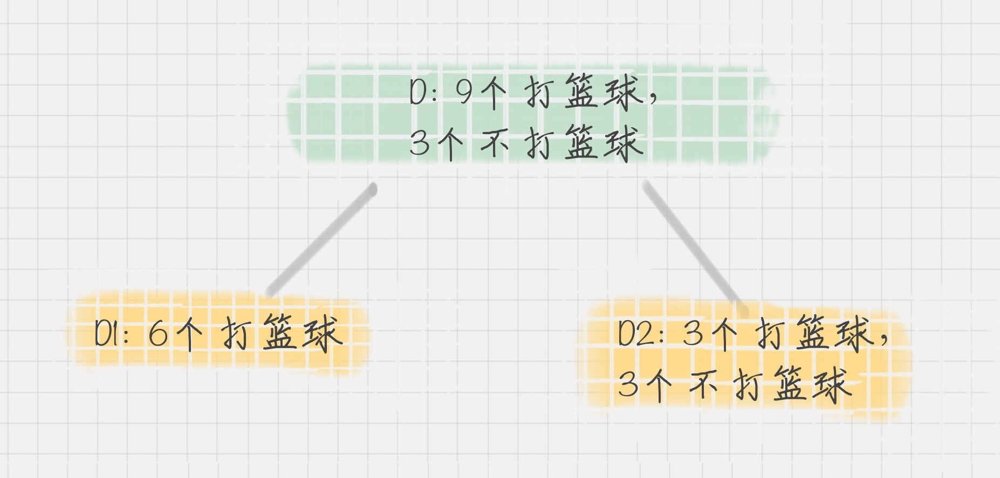
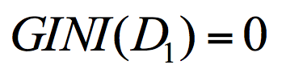
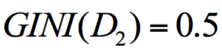
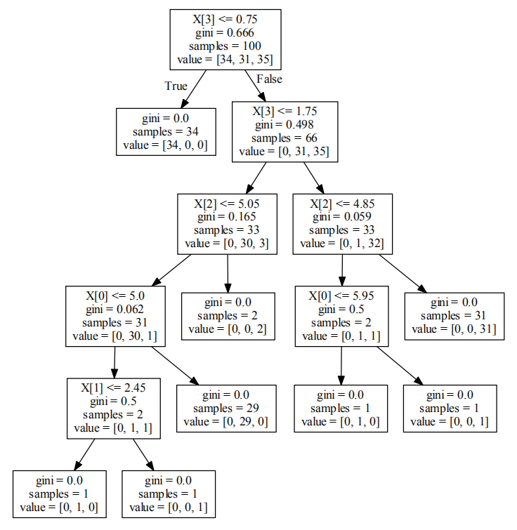
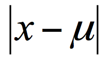
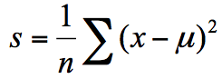
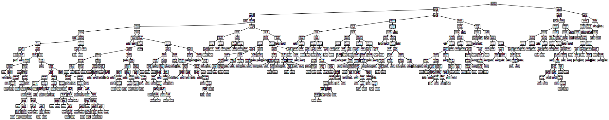
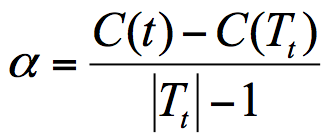

# 18丨决策树（中）：CART，一棵是回归树，另一棵是分类树

陈旸 2019-01-23





11:24

讲述：陈旸 大小：26.13M

<audio title="18丨决策树（中）：CART，一棵是回归树，另一棵是分类树" src="https://res001.geekbang.org//media/audio/2c/d6/2cc78634b5338a0be9a52d53f0e2d4d6/ld/ld.m3u8"></audio>

上节课我们讲了决策树，基于信息度量的不同方式，我们可以把决策树分为  ID3 算法、C4.5 算法和 CART 算法。今天我来带你学习 CART 算法。CART 算法，英文全称叫做 Classification  And Regression Tree，中文叫做分类回归树。ID3 和 C4.5 算法可以生成二叉树或多叉树，而 CART 只支持二叉树。同时  CART 决策树比较特殊，既可以作分类树，又可以作回归树。

那么你首先需要了解的是，什么是分类树，什么是回归树呢？

我用下面的训练数据举个例子，你能看到不同职业的人，他们的年龄不同，学习时间也不同。如果我构造了一棵决策树，想要基于数据判断这个人的职业身份，这个就属于分类树，因为是从几个分类中来做选择。如果是给定了数据，想要预测这个人的年龄，那就属于回归树。


 分类树可以处理离散数据，也就是数据种类有限的数据，它输出的是样本的类别，而回归树可以对连续型的数值进行预测，也就是数据在某个区间内都有取值的可能，它输出的是一个数值。

## CART 分类树的工作流程

通过上一讲，我们知道决策树的核心就是寻找纯净的划分，因此引入了纯度的概念。在属性选择上，我们是通过统计“不纯度”来做判断的，ID3  是基于信息增益做判断，C4.5 在 ID3 的基础上做了改进，提出了信息增益率的概念。实际上 CART 分类树与 C4.5  算法类似，只是属性选择的指标采用的是**基尼系数**。

你可能在经济学中听过说基尼系数，它是用来衡量一个国家收入差距的常用指标。当基尼系数大于 0.4 的时候，说明财富差异悬殊。基尼系数在 0.2-0.4 之间说明分配合理，财富差距不大。

基尼系数本身反应了**样本的不确定度**。当基尼系数越小的时候，说明**样本之间的差异性**小，不确定程度低。

分类的过程本身是一个**不确定度降低**的过程，即纯度的提升过程。所以 CART 算法在构造分类树的时候，会选择基尼系数最小的属性作为属性的划分。

我们接下来详解了解一下基尼系数。基尼系数不好懂，你最好跟着例子一起手动计算下。

假设 t 为节点，那么该节点的 GINI 系数的计算公式为：


 这里 p(Ck|t) 表示节点 t 属于类别 Ck 的概率，节点 t 的基尼系数为 1 减去各类别 Ck 概率平方和。

通过下面这个例子，我们计算一下两个集合的基尼系数分别为多少：

集合 1：6 个都去打篮球；

集合 2：3 个去打篮球，3 个不去打篮球。

针对集合 1，所有人都去打篮球，所以 p(Ck|t)=1，因此 GINI(t)=1-1=0。

针对集合 2，有一半人去打篮球，而另一半不去打篮球，所以，p(C1|t)=0.5，p(C2|t)=0.5，GINI(t)=1-（0.5*0.5+0.5*0.5）=0.5。

通过两个基尼系数你可以看出，集合 1 的基尼系数最小，也证明样本最稳定，而集合 2 的样本不稳定性更大。

在 CART 算法中，基于基尼系数对特征属性进行二元分裂，假设属性 A 将节点 D 划分成了 D1 和 D2，如下图所示：


 节点 D 的基尼系数等于子节点 D1 和 D2 的归一化基尼系数之和，用公式表示为：


 归一化基尼系数代表的是每个子节点的基尼系数乘以该节点占整体父亲节点 D 中的比例。

上面我们已经计算了集合 D1 和集合 D2 的 GINI 系数，得到：
 
 

所以节点 D 的基尼系数为：


节点 D 被属性 A 划分后的基尼系数越大，样本集合的不确定性越大，也就是不纯度越高。

## 如何使用 CART 算法来创建分类树

通过上面的讲解你可以知道，CART  分类树实际上是基于基尼系数来做属性划分的。在 Python 的 sklearn 中，如果我们想要创建 CART 分类树，可以直接使用  DecisionTreeClassifier 这个类。创建这个类的时候，默认情况下 criterion 这个参数等于  gini，也就是按照基尼系数来选择属性划分，即默认采用的是 CART 分类树。

下面，我们来用 CART 分类树，给 iris 数据集构造一棵分类决策树。iris 这个数据集，我在 Python 可视化中讲到过，实际上在 sklearn 中也自带了这个数据集。基于 iris 数据集，构造 CART 分类树的代码如下：

```

# encoding=utf-8

from sklearn.model_selection import train_test_split

from sklearn.metrics import accuracy_score

from sklearn.tree import DecisionTreeClassifier

from sklearn.datasets import load_iris

# 准备数据集

iris=load_iris()

# 获取特征集和分类标识

features = iris.data

labels = iris.target

# 随机抽取 33% 的数据作为测试集，其余为训练集

train_features, test_features, train_labels, test_labels = train_test_split(features, labels, test_size=0.33, random_state=0)

# 创建 CART 分类树

clf = DecisionTreeClassifier(criterion='gini')

# 拟合构造 CART 分类树

clf = clf.fit(train_features, train_labels)

# 用 CART 分类树做预测

test_predict = clf.predict(test_features)

# 预测结果与测试集结果作比对

score = accuracy_score(test_labels, test_predict)

print("CART 分类树准确率 %.4lf" % score)


```

运行结果：

```

CART 分类树准确率 0.9600


```

如果我们把决策树画出来，可以得到下面的图示：


 首先 train_test_split 可以帮助我们把数据集抽取一部分作为测试集，这样我们就可以得到训练集和测试集。

使用 clf = DecisionTreeClassifier(criterion=‘gini’) 初始化一棵 CART 分类树。这样你就可以对 CART 分类树进行训练。

使用 clf.fit(train_features, train_labels) 函数，将训练集的特征值和分类标识作为参数进行拟合，得到 CART 分类树。

使用 clf.predict(test_features) 函数进行预测，传入测试集的特征值，可以得到测试结果 test_predict。

最后使用 accuracy_score(test_labels, test_predict) 函数，传入测试集的预测结果与实际的结果作为参数，得到准确率 score。

我们能看到 sklearn 帮我们做了 CART 分类树的使用封装，使用起来还是很方便的。

**CART 回归树的工作流程**

CART  回归树划分数据集的过程和分类树的过程是一样的，只是回归树得到的预测结果是连续值，而且评判“不纯度”的指标不同。在 CART  分类树中采用的是基尼系数作为标准，那么在 CART  回归树中，如何评价“不纯度”呢？实际上我们要根据样本的混乱程度，也就是样本的离散程度来评价“不纯度”。

样本的离散程度具体的计算方式是，先计算所有样本的均值，然后计算每个样本值到均值的差值。我们假设 x 为样本的个体，均值为 u。为了统计样本的离散程度，我们可以取差值的绝对值，或者方差。

其中差值的绝对值为样本值减去样本均值的绝对值：


 方差为每个样本值减去样本均值的平方和除以样本个数：


 所以这两种节点划分的标准，分别对应着两种目标函数最优化的标准，即用最小绝对偏差（LAD），或者使用最小二乘偏差（LSD）。这两种方式都可以让我们找到节点划分的方法，通常使用最小二乘偏差的情况更常见一些。

我们可以通过一个例子来看下如何创建一棵 CART 回归树来做预测。

## 如何使用 CART 回归树做预测

这里我们使用到 sklearn 自带的波士顿房价数据集，该数据集给出了影响房价的一些指标，比如犯罪率，房产税等，最后给出了房价。

根据这些指标，我们使用 CART 回归树对波士顿房价进行预测，代码如下：

```

# encoding=utf-8

from sklearn.metrics import mean_squared_error

from sklearn.model_selection import train_test_split

from sklearn.datasets import load_boston

from sklearn.metrics import r2_score,mean_absolute_error,mean_squared_error

from sklearn.tree import DecisionTreeRegressor

# 准备数据集

boston=load_boston()

# 探索数据

print(boston.feature_names)

# 获取特征集和房价

features = boston.data

prices = boston.target

# 随机抽取 33% 的数据作为测试集，其余为训练集

train_features, test_features, train_price, test_price = train_test_split(features, prices, test_size=0.33)

# 创建 CART 回归树

dtr=DecisionTreeRegressor()

# 拟合构造 CART 回归树

dtr.fit(train_features, train_price)

# 预测测试集中的房价

predict_price = dtr.predict(test_features)

# 测试集的结果评价

print('回归树二乘偏差均值:', mean_squared_error(test_price, predict_price))

print('回归树绝对值偏差均值:', mean_absolute_error(test_price, predict_price)) 


```

运行结果（每次运行结果可能会有不同）：

```

['CRIM' 'ZN' 'INDUS' 'CHAS' 'NOX' 'RM' 'AGE' 'DIS' 'RAD' 'TAX' 'PTRATIO' 'B' 'LSTAT']

回归树二乘偏差均值: 23.80784431137724

回归树绝对值偏差均值: 3.040119760479042


```

如果把回归树画出来，可以得到下面的图示（波士顿房价数据集的指标有些多，所以树比较大）：



你可以在[这里](https://pan.baidu.com/s/1RKD6-IwAzL--cL0jt4GPiQ)下载完整 PDF 文件。

我们来看下这个例子，首先加载了波士顿房价数据集，得到特征集和房价。然后通过 train_test_split 帮助我们把数据集抽取一部分作为测试集，其余作为训练集。

使用 dtr=DecisionTreeRegressor() 初始化一棵 CART 回归树。

使用 dtr.fit(train_features, train_price) 函数，将训练集的特征值和结果作为参数进行拟合，得到 CART 回归树。

使用 dtr.predict(test_features) 函数进行预测，传入测试集的特征值，可以得到预测结果 predict_price。

最后我们可以求得这棵回归树的二乘偏差均值，以及绝对值偏差均值。

我们能看到 CART 回归树的使用和分类树类似，只是最后求得的预测值是个连续值。

## CART 决策树的剪枝

CART 决策树的剪枝主要采用的是 CCP 方法，它是一种后剪枝的方法，英文全称叫做 cost-complexity prune，中文叫做代价复杂度。这种剪枝方式用到一个指标叫做节点的表面误差率增益值，以此作为剪枝前后误差的定义。用公式表示则是：


 其中 Tt 代表以 t 为根节点的子树，C(Tt) 表示节点 t 的子树没被裁剪时子树 Tt 的误差，C(t) 表示节点 t 的子树被剪枝后节点 t 的误差，|Tt|代子树 Tt 的叶子数，剪枝后，T 的叶子数减少了|Tt|-1。

所以节点的表面误差率增益值等于节点 t 的子树被剪枝后的误差变化除以剪掉的叶子数量。

因为我们希望剪枝前后误差最小，所以我们要寻找的就是最小α值对应的节点，把它剪掉。这时候生成了第一个子树。重复上面的过程，继续剪枝，直到最后只剩下根节点，即为最后一个子树。

得到了剪枝后的子树集合后，我们需要用验证集对所有子树的误差计算一遍。可以通过计算每个子树的基尼指数或者平方误差，取误差最小的那个树，得到我们想要的结果。

## 总结

今天我给你讲了  CART 决策树，它是一棵决策二叉树，既可以做分类树，也可以做回归树。你需要记住的是，作为分类树，CART  采用基尼系数作为节点划分的依据，得到的是离散的结果，也就是分类结果；作为回归树，CART  可以采用最小绝对偏差（LAD），或者最小二乘偏差（LSD）作为节点划分的依据，得到的是连续值，即回归预测结果。

最后我们来整理下三种决策树之间在属性选择标准上的差异：

- ID3 算法，基于信息增益做判断；
- C4.5 算法，基于信息增益率做判断；
- CART 算法，分类树是基于基尼系数做判断。回归树是基于偏差做判断。

实际上这三个指标也是计算“不纯度”的三种计算方式。

在工具使用上，我们可以使用 sklearn 中的 DecisionTreeClassifier 创建 CART 分类树，通过 DecisionTreeRegressor 创建 CART 回归树。

你可以用代码自己跑一遍我在文稿中举到的例子。


 最后给你留两道思考题吧，你能说下 ID3，C4.5，以及 CART 分类树在做节点划分时的区别吗？第二个问题是，sklearn  中有个手写数字数据集，调用的方法是 load_digits()，你能否创建一个 CART  分类树，对手写数字数据集做分类？另外选取一部分测试集，统计下分类树的准确率？

欢迎你在评论下面留言，与我分享你的答案。也欢迎点击“请朋友读”，把这篇文章分享给你的朋友或者同事，一起交流。


© 版权归极客邦科技所有，未经许可不得传播售卖。 页面已增加防盗追踪，如有侵权极客邦将依法追究其法律责任。         


夜瓜居士


Ctrl + Enter 发表

0/2000字

提交留言

## 精选留言(25)

- 

  胡 

  cart分类树的决策树那副图看不懂。

  ** 13

  2019-01-31

- 

  王彬成 

  ** 7

  2019-02-17

- 

  梁林松 

  老师 那个打篮球的例子里 D1/D和D2/D为什么是6/9和2/9呢？如果是子节点占父节点的比例不是应该是各1/2吗？

  ** 4

  2019-01-23

- 

  jake 

  
  首先想问一个问题 就是在讲到基尼系数那里 有一个图那里的例子 什么D: 9个打篮球 3个不打篮球那里
  那里的D的基尼系数用到了子节点归一化基尼系数之和这个方法求  请问D的基尼系数不能直接用 上面那个公式 也就是"1 - [p(ck|t)]^2"那个公式计算吗 我用这个公式计算出D的基尼系数为 1 -  (9/12 * 9/12 + 3/12 * 3/12) = 6/16。 我也想问一下上面那个同学提的这个问题

  ** 3

  2019-02-24

- 

  make some time 

  老师你好，决策的数是怎么生成的？

  ** 2

  2019-03-01

- 

  Lee 

  ** 2

  2019-01-24

- 

  xfoolin 

  ** 1

  2019-02-19

- 

  小熊猫 

  ** 1

  2019-02-15

- 

  rainman 

  对于 CART 回归树的可视化，可以先在电脑上安装 graphviz；然后 pip install graphviz，这是安装python的库，需要依赖前面安装的 graphviz。可视化代码如下：

  \----
  from sklearn.tree import export_graphviz
  import graphviz

  \# 参数是回归树模型名称，不输出文件。
  dot_data = export_graphviz(dtr, out_file=None)
  graph = graphviz.Source(dot_data)
  \# render 方法会在同级目录下生成 Boston PDF文件，内容就是回归树。
  graph.render('Boston')
  \----

  具体内容可以去 sklearn(https://scikit-learn.org/stable/modules/generated/sklearn.tree.export_graphviz.html)
  和 graphviz(https://graphviz.readthedocs.io/en/stable/) 看看。

  ** 1

  2019-02-15

- 

  Chino 

  ** 1

  2019-02-01

- 

  雨先生的晴天 

  scikit learn package 确实非常好用，很简洁。推荐大家也去官网看一看，请问一下怎样可以把decision tree 可视化呀？ 

  ** 1

  2019-01-27

- 

  羊小看 

  ** 

  2019-05-10

- 

  张晓辉 

  \#encoding=utf-8
  from sklearn.datasets import load_digits
  from sklearn.tree import DecisionTreeClassifier
  from sklearn.metrics import accuracy_score
  from sklearn.model_selection import train_test_split

  digits = load_digits()
  features = digits.data 
  targets = digits.target 
  train_features, test_features, train_digits, test_digits = train_test_split(features, targets, test_size = 0.33)
  clf = DecisionTreeClassifier()
  clf = clf.fit(train_features, train_digits)
  predict_digits = clf.predict(test_features)
  print("The predict accuracy is:", accuracy_score(test_digits, predict_digits))

  ** 

  2019-05-09

- 

  滢 

  ** 

  2019-04-17

- 

  郑志宾 

  CART 剪枝算法中，是将剪掉的子树组成子树序列，然后进行测试？
  还是将剪去后剩下的子树组成子树序列进行测试呢？

  还有最后取得的误差最小的那个子树为什么是我们想要的结果？
  剪枝后的决策树不是我们想要的吗？为什么还要测试子树序列？

  

  ** 

  2019-04-07

- 

  挠头侠 

  老师 能不能分析一下决策数图里面的内容分别是什么和如何算出来的呀。

  ** 

  2019-04-05

- 

  Linus 

  X[2] <= 5.415
  mse = 0.955
  samples = 27
  value = 23.785
  老师能不能解释一下x[2]<=5.415 是不是过滤了小于5.415的数字 再进行算gini系数

  ** 

  2019-03-06

- 

  littlePerfect 

  探索数据那一行代码有什么作用?
  print(boston.feature_names)

  ** 

  2019-02-21

- 

  柚子 

  from sklearn.model_selection import train_test_split
  from sklearn.datasets import load_digits
  from sklearn.tree import DecisionTreeClassifier
  from sklearn.metrics import accuracy_score

  digits = load_digits()     #准备数据集
  features = digits.data   #获取特征值
  labels = digits.target    #获取分类类别

  train_features,test_features,train_labels,test_labels  = train_test_split(features,labels,test_size = 0.33,random_state = 0)      #随机抽取33%作为测试集

  dig = DecisionTreeClassifier(criterion='gini')            #创建决策树
  dig.fit(train_features,train_labels)                             #拟合构造决策树
  test_predict = dig.predict(test_features)                  #预测
  score = accuracy_score(test_labels,test_predict)      #测试集结果评价
  print('决策树准确率：%.4lf'% score)

  ** 

  2019-02-15

- 

  圆圆的大食客 

  ** 

  2019-02-02

- 

  胖陶 

  ** 

  2019-01-27

- 

  Python 

  老师，剪枝是用什么函数来实现的？

  ** 

  2019-01-24

- 

  Feng.X 

  老师，这一节课里的归一化基尼系数的公式里，所乘的比例里分母D=9，只看父节点里打篮球的数；而上一节课里，归一化信息熵的公式里，所成的比例里分母D=10，把父节点里的打篮球与不打篮球的数量都计算在内。想问下，为什么归一化基尼系数里的分母不将不打篮球的数计算在内呢？

  ** 

  2019-01-24

- 

  从未在此 

  那个九分之六和九分之三，计算的时候应该之考虑我们需要的正样本。比如例子中，一共12个人，但只有9个人打篮球，所以计算时总样本是9。我是这么理解的不知道对不对

  ** 

  2019-01-24

- 

  JingZ 

  ** 

  2019-01-23