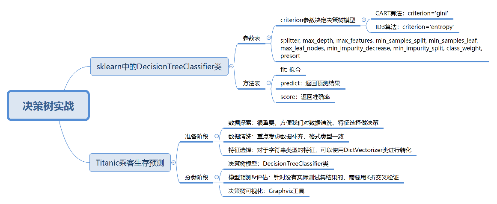

# 19丨决策树（下）：泰坦尼克乘客生存预测

陈旸 2019-01-25





12:54

讲述：陈旸 大小：11.82M

<audio title="19丨决策树（下）：泰坦尼克乘客生存预测" src="https://res001.geekbang.org//media/audio/24/c0/2488ceea1b379251231440e4f03b50c0/ld/ld.m3u8"></audio>

在前面的两篇文章中，我给你讲了决策树算法。决策树算法是经常使用的数据挖掘算法，这是因为决策树就像一个人脑中的决策模型一样，呈现出来非常直观。基于决策树还诞生了很多数据挖掘算法，比如随机森林（Random forest）。

今天我来带你用决策树进行项目的实战。

决策树分类的应用场景非常广泛，在各行各业都有应用，比如在金融行业可以用决策树做贷款风险评估，医疗行业可以用决策树生成辅助诊断，电商行业可以用决策树对销售额进行预测等。

在了解决策树的原理后，今天我们用 sklearn 工具解决一个实际的问题：泰坦尼克号乘客的生存预测。

## sklearn 中的决策树模型

首先，我们需要掌握 sklearn 中自带的决策树分类器 DecisionTreeClassifier，方法如下：

```

clf = DecisionTreeClassifier(criterion='entropy')


```

到目前为止，sklearn  中只实现了 ID3 与 CART 决策树，所以我们暂时只能使用这两种决策树，在构造 DecisionTreeClassifier  类时，其中有一个参数是 criterion，意为标准。它决定了构造的分类树是采用 ID3 分类树，还是 CART 分类树，对应的取值分别是  entropy 或者 gini：

- entropy: 基于信息熵，也就是 ID3 算法，实际结果与 C4.5 相差不大；
- gini：默认参数，基于基尼系数。CART 算法是基于基尼系数做属性划分的，所以 criterion=gini 时，实际上执行的是 CART 算法。

我们通过设置 criterion='entropy’可以创建一个 ID3 决策树分类器，然后打印下 clf，看下决策树在 sklearn 中是个什么东西？

```

DecisionTreeClassifier(class_weight=None, criterion='entropy', max_depth=None,

            max_features=None, max_leaf_nodes=None,

            min_impurity_decrease=0.0, min_impurity_split=None,

            min_samples_leaf=1, min_samples_split=2,

            min_weight_fraction_leaf=0.0, presort=False, random_state=None,

            splitter='best')


```

这里我们看到了很多参数，除了设置 criterion 采用不同的决策树算法外，一般建议使用默认的参数，默认参数不会限制决策树的最大深度，不限制叶子节点数，认为所有分类的权重都相等等。当然你也可以调整这些参数，来创建不同的决策树模型。

我整理了这些参数代表的含义：


在构造决策树分类器后，我们可以使用 fit 方法让分类器进行拟合，使用 predict 方法对新数据进行预测，得到预测的分类结果，也可以使用 score 方法得到分类器的准确率。

下面这个表格是 fit 方法、predict 方法和 score 方法的作用。


## Titanic 乘客生存预测

**问题描述**

泰坦尼克海难是著名的十大灾难之一，究竟多少人遇难，各方统计的结果不一。现在我们可以得到部分的数据，具体数据你可以从 GitHub 上下载：<https://github.com/cystanford/Titanic_Data>

其中数据集格式为 csv，一共有两个文件：

- train.csv 是训练数据集，包含特征信息和存活与否的标签；
- test.csv: 测试数据集，只包含特征信息。

现在我们需要用决策树分类对训练集进行训练，针对测试集中的乘客进行生存预测，并告知分类器的准确率。

在训练集中，包括了以下字段，它们具体为：


 **生存预测的关键流程**

我们要对训练集中乘客的生存进行预测，这个过程可以划分为两个重要的阶段：


1. **准备阶段**：我们首先需要对训练集、测试集的数据进行探索，分析数据质量，并对数据进行清洗，然后通过特征选择对数据进行降维，方便后续分类运算；
2. **分类阶段**：首先通过训练集的特征矩阵、分类结果得到决策树分类器，然后将分类器应用于测试集。然后我们对决策树分类器的准确性进行分析，并对决策树模型进行可视化。

下面，我分别对这些模块进行介绍。

**模块 1：数据探索**

数据探索这部分虽然对分类器没有实质作用，但是不可忽略。我们只有足够了解这些数据的特性，才能帮助我们做数据清洗、特征选择。

那么如何进行数据探索呢？这里有一些函数你需要了解：

- 使用 info() 了解数据表的基本情况：行数、列数、每列的数据类型、数据完整度；
- 使用 describe() 了解数据表的统计情况：总数、平均值、标准差、最小值、最大值等；
- 使用 describe(include=[‘O’]) 查看字符串类型（非数字）的整体情况；
- 使用 head 查看前几行数据（默认是前 5 行）；
- 使用 tail 查看后几行数据（默认是最后 5 行）。

我们可以使用 Pandas 便捷地处理这些问题：

```

import pandas as pd

# 数据加载

train_data = pd.read_csv('./Titanic_Data/train.csv')

test_data = pd.read_csv('./Titanic_Data/test.csv')

# 数据探索

print(train_data.info())

print('-'*30)

print(train_data.describe())

print('-'*30)

print(train_data.describe(include=['O']))

print('-'*30)

print(train_data.head())

print('-'*30)

print(train_data.tail())


```

运行结果：

```

<class 'pandas.core.frame.DataFrame'>

RangeIndex: 891 entries, 0 to 890

Data columns (total 12 columns):

PassengerId    891 non-null int64

Survived       891 non-null int64

Pclass         891 non-null int64

Name           891 non-null object

Sex            891 non-null object

Age            714 non-null float64

SibSp          891 non-null int64

Parch          891 non-null int64

Ticket         891 non-null object

Fare           891 non-null float64

Cabin          204 non-null object

Embarked       889 non-null object

dtypes: float64(2), int64(5), object(5)

memory usage: 83.6+ KB

None

------------------------------

       PassengerId    Survived     ...           Parch        Fare

count   891.000000  891.000000     ...      891.000000  891.000000

mean    446.000000    0.383838     ...        0.381594   32.204208

std     257.353842    0.486592     ...        0.806057   49.693429

min       1.000000    0.000000     ...        0.000000    0.000000

25%     223.500000    0.000000     ...        0.000000    7.910400

50%     446.000000    0.000000     ...        0.000000   14.454200

75%     668.500000    1.000000     ...        0.000000   31.000000

max     891.000000    1.000000     ...        6.000000  512.329200

 

[8 rows x 7 columns]

------------------------------

                                          Name   Sex   ...       Cabin Embarked

count                                      891   891   ...         204      889

unique                                     891     2   ...         147        3

top     Peter, Mrs. Catherine (Catherine Rizk)  male   ...     B96 B98        S

freq                                         1   577   ...           4      644

 

[4 rows x 5 columns]

------------------------------

   PassengerId  Survived  Pclass    ...        Fare Cabin  Embarked

0            1         0       3    ...      7.2500   NaN         S

1            2         1       1    ...     71.2833   C85         C

2            3         1       3    ...      7.9250   NaN         S

3            4         1       1    ...     53.1000  C123         S

4            5         0       3    ...      8.0500   NaN         S

 

[5 rows x 12 columns]

------------------------------

     PassengerId  Survived  Pclass    ...      Fare Cabin  Embarked

886          887         0       2    ...     13.00   NaN         S

887          888         1       1    ...     30.00   B42         S

888          889         0       3    ...     23.45   NaN         S

889          890         1       1    ...     30.00  C148         C

890          891         0       3    ...      7.75   NaN         Q

 

[5 rows x 12 columns]


```

**模块 2：数据清洗**

通过数据探索，我们发现 Age、Fare 和 Cabin 这三个字段的数据有所缺失。其中 Age 为年龄字段，是数值型，我们可以通过平均值进行补齐；Fare 为船票价格，是数值型，我们也可以通过其他人购买船票的平均值进行补齐。

具体实现的代码如下：

```

# 使用平均年龄来填充年龄中的 nan 值

train_data['Age'].fillna(train_data['Age'].mean(), inplace=True)

test_data['Age'].fillna(test_data['Age'].mean(),inplace=True)

# 使用票价的均值填充票价中的 nan 值

train_data['Fare'].fillna(train_data['Fare'].mean(), inplace=True)

test_data['Fare'].fillna(test_data['Fare'].mean(),inplace=True)


```

Cabin 为船舱，有大量的缺失值。在训练集和测试集中的缺失率分别为 77% 和 78%，无法补齐；Embarked 为登陆港口，有少量的缺失值，我们可以把缺失值补齐。

首先观察下 Embarked 字段的取值，方法如下：

```

print(train_data['Embarked'].value_counts())


```

结果如下：

```

S    644

C    168

Q     77


```

我们发现一共就 3 个登陆港口，其中 S 港口人数最多，占到了 72%，因此我们将其余缺失的 Embarked 数值均设置为 S：

```

# 使用登录最多的港口来填充登录港口的 nan 值

train_data['Embarked'].fillna('S', inplace=True)

test_data['Embarked'].fillna('S',inplace=True)


```

**模块 3：特征选择**

特征选择是分类器的关键。特征选择不同，得到的分类器也不同。那么我们该选择哪些特征做生存的预测呢？

通过数据探索我们发现，PassengerId  为乘客编号，对分类没有作用，可以放弃；Name 为乘客姓名，对分类没有作用，可以放弃；Cabin 字段缺失值太多，可以放弃；Ticket  字段为船票号码，杂乱无章且无规律，可以放弃。其余的字段包括：Pclass、Sex、Age、SibSp、Parch 和  Fare，这些属性分别表示了乘客的船票等级、性别、年龄、亲戚数量以及船票价格，可能会和乘客的生存预测分类有关系。具体是什么关系，我们可以交给分类器来处理。

因此我们先将 Pclass、Sex、Age 等这些其余的字段作特征，放到特征向量 features 里。

```

# 特征选择

features = ['Pclass', 'Sex', 'Age', 'SibSp', 'Parch', 'Fare', 'Embarked']

train_features = train_data[features]

train_labels = train_data['Survived']

test_features = test_data[features]


```

特征值里有一些是字符串，这样不方便后续的运算，需要转成数值类型，比如 Sex 字段，有 male 和 female 两种取值。我们可以把它变成 Sex=male 和 Sex=female 两个字段，数值用 0 或 1 来表示。

同理 Embarked 有 S、C、Q 三种可能，我们也可以改成 Embarked=S、Embarked=C 和 Embarked=Q 三个字段，数值用 0 或 1 来表示。

那该如何操作呢，我们可以使用 sklearn 特征选择中的 DictVectorizer 类，用它将可以处理符号化的对象，将符号转成数字 0/1 进行表示。具体方法如下：

```

from sklearn.feature_extraction import DictVectorizer

dvec=DictVectorizer(sparse=False)

train_features=dvec.fit_transform(train_features.to_dict(orient='record'))


```

你会看到代码中使用了 fit_transform 这个函数，它可以将特征向量转化为特征值矩阵。然后我们看下 dvec 在转化后的特征属性是怎样的，即查看 dvec 的 feature_names_ 属性值，方法如下：

```

print(dvec.feature_names_)


```

运行结果：

```

['Age', 'Embarked=C', 'Embarked=Q', 'Embarked=S', 'Fare', 'Parch', 'Pclass', 'Sex=female', 'Sex=male', 'SibSp']


```

你可以看到原本是一列的 Embarked，变成了“Embarked=C”“Embarked=Q”“Embarked=S”三列。Sex 列变成了“Sex=female”“Sex=male”两列。

这样 train_features 特征矩阵就包括 10 个特征值（列），以及 891 个样本（行），即 891 行，10 列的特征矩阵。

**模块 4：决策树模型**

刚才我们已经讲了如何使用  sklearn 中的决策树模型。现在我们使用 ID3 算法，即在创建 DecisionTreeClassifier 时，设置  criterion=‘entropy’，然后使用 fit 进行训练，将特征值矩阵和分类标识结果作为参数传入，得到决策树分类器。

```

from sklearn.tree import DecisionTreeClassifier

# 构造 ID3 决策树

clf = DecisionTreeClassifier(criterion='entropy')

# 决策树训练

clf.fit(train_features, train_labels)


```

**模块 5：模型预测 & 评估**

在预测中，我们首先需要得到测试集的特征值矩阵，然后使用训练好的决策树 clf 进行预测，得到预测结果 pred_labels：

```

test_features=dvec.transform(test_features.to_dict(orient='record'))

# 决策树预测

pred_labels = clf.predict(test_features)


```

在模型评估中，决策树提供了 score 函数可以直接得到准确率，但是我们并不知道真实的预测结果，所以无法用预测值和真实的预测结果做比较。我们只能使用训练集中的数据进行模型评估，可以使用决策树自带的 score 函数计算下得到的结果：

```

# 得到决策树准确率

acc_decision_tree = round(clf.score(train_features, train_labels), 6)

print(u'score 准确率为 %.4lf' % acc_decision_tree)


```

运行结果：

```

score 准确率为 0.9820


```

你会发现你刚用训练集做训练，再用训练集自身做准确率评估自然会很高。但这样得出的准确率并不能代表决策树分类器的准确率。

这是为什么呢？

因为我们没有测试集的实际结果，因此无法用测试集的预测结果与实际结果做对比。如果我们使用 score 函数对训练集的准确率进行统计，正确率会接近于 100%（如上结果为 98.2%），无法对分类器的在实际环境下做准确率的评估。

那么有什么办法，来统计决策树分类器的准确率呢？

这里可以使用 K 折交叉验证的方式，交叉验证是一种常用的验证分类准确率的方法，原理是拿出大部分样本进行训练，少量的用于分类器的验证。K 折交叉验证，就是做 K 次交叉验证，每次选取 K 分之一的数据作为验证，其余作为训练。轮流 K 次，取平均值。

K 折交叉验证的原理是这样的：

1. 将数据集平均分割成 K 个等份；
2. 使用 1 份数据作为测试数据，其余作为训练数据；
3. 计算测试准确率；
4. 使用不同的测试集，重复 2、3 步骤。

在 sklearn 的 model_selection 模型选择中提供了 cross_val_score  函数。cross_val_score 函数中的参数 cv 代表对原始数据划分成多少份，也就是我们的 K 值，一般建议 K 值取  10，因此我们可以设置 CV=10，我们可以对比下 score 和 cross_val_score 两种函数的正确率的评估结果：

```

import numpy as np

from sklearn.model_selection import cross_val_score

# 使用 K 折交叉验证 统计决策树准确率

print(u'cross_val_score 准确率为 %.4lf' % np.mean(cross_val_score(clf, train_features, train_labels, cv=10)))


```

运行结果：

```

cross_val_score 准确率为 0.7835


```

你可以看到，score 函数的准确率为 0.9820，cross_val_score 准确率为 0.7835。

这里很明显，对于不知道测试集实际结果的，要使用 K 折交叉验证才能知道模型的准确率。

**模块 6：决策树可视化**

sklearn 的决策树模型对我们来说，还是比较抽象的。我们可以使用 Graphviz 可视化工具帮我们把决策树呈现出来。


 安装 Graphviz 库需要下面的几步：

1. 安装 graphviz 工具，这里是它的下载地址；<http://www.graphviz.org/download/>
2. 将 Graphviz 添加到环境变量 PATH 中；
3. 需要 Graphviz 库，如果没有可以使用 pip install graphviz 进行安装。

这样你就可以在程序里面使用 Graphviz 对决策树模型进行呈现，最后得到一个决策树可视化的 PDF 文件，可视化结果文件 Source.gv.pdf 你可以在 GitHub 上下载：<https://github.com/cystanford/Titanic_Data>

## 决策树模型使用技巧总结

今天我用泰坦尼克乘客生存预测案例把决策树模型的流程跑了一遍。在实战中，你需要注意一下几点：

1. 特征选择是分类模型好坏的关键。选择什么样的特征，以及对应的特征值矩阵，决定了分类模型的好坏。通常情况下，特征值不都是数值类型，可以使用 DictVectorizer 类进行转化；
2. 模型准确率需要考虑是否有测试集的实际结果可以做对比，当测试集没有真实结果可以对比时，需要使用 K 折交叉验证 cross_val_score；
3. Graphviz 可视化工具可以很方便地将决策模型呈现出来，帮助你更好理解决策树的构建。


 我上面讲了泰坦尼克乘客生存预测的六个关键模块，请你用 sklearn 中的决策树模型独立完成这个项目，对测试集中的乘客是否生存进行预测，并给出模型准确率评估。数据从 GitHub 上下载即可。

最后给你留一个思考题吧，我在构造特征向量时使用了 DictVectorizer 类，使用 fit_transform 函数将特征向量转化为特征值矩阵。DictVectorizer 类同时也提供 transform 函数，那么这两个函数有什么区别？

欢迎你在评论区留言与我分享你的答案，也欢迎点击“请朋友读”把这篇文章分享给你的朋友或者同事，一起交流一下。


© 版权归极客邦科技所有，未经许可不得传播售卖。 页面已增加防盗追踪，如有侵权极客邦将依法追究其法律责任。     \


## 精选留言(45)

- 

  ken 

  经典入门案例，浅入但没有提供完整的代码和说明，缺少拓展，对包调用的逻辑方法也不够完整。
  是一次手把手练习的实操过程，但有点不上不下的，完全没python基础的可能连sklearn也不知道，有点工程基础的，又没有理论拓展说明，未免鸡肋。

  当然，本人可能严格了。

  ** 51

  2019-01-25

- 

  不做键盘侠 

  Fare似乎没有缺失值？

  ** 9

  2019-02-05

- 

  每天晒白牙 

  ** 9

  2019-01-30

- 

  小熊猫 

  fit 从一个训练集中学习模型参数，其中就包括了归一化时用到的均值，标准偏差等，可以理解为一个训练过程。
  transform: 在fit的基础上，对数据进行标准化，降维，归一化等数据转换操作
  fit_transform:  将模型训练和转化合并到一起，训练样本先做fit，得到mean，standard  deviation，然后将这些参数用于transform（归一化训练数据），使得到的训练数据是归一化的，而测试数据只需要在原先fit得到的mean，std上来做归一化就行了，所以用transform就行了。

  ** 7

  2019-02-18

- 

  hh 

  老师的课太值了，请问老师还有其他课吗，真是干货满满

  ** 4

  2019-02-17

- 

  MachineLP 

  这讲的确需要在精进一些哦，还有后续应该如何通过更好的数据分析进行效果提升也没有体现，感觉这才是关键，并不是简单跑个模型而已。

  ** 4

  2019-01-27

- 

  听妈妈的话 

  https://github.com/apachecn/kaggle/tree/master/competitions/getting-started/titanic
  我个人认为这里的预测方案写的更加详细一点，大家可以参考一下

  ** 3

  2019-03-21

- 

  听妈妈的话 

  我想问Fare是怎么看出来有缺失的呀，数目是891呀

  ** 3

  2019-03-20

- 

  mickey 

  ** 3

  2019-01-25

- 

  旭霁 

  安装 graphviz 工具，并设置好环境变量后，发现还是出错，加了下边两行代码后得以解决。

  import os
  os.environ["PATH"] += os.pathsep + 'D:/Program Files (x86)/Graphviz2.38/bin/'

  在 Windows 中，只需在开头添加这两行，其中 'D：/ Program Files（x86）/Graphviz2.38/bin/' 将替换为 bin 文件所在的地址。

  ** 2

  2019-03-27

- 

  Lambert 

  \# 决策树可视化
  from sklearn import tree
  import graphviz
  dot_data = tree.export_graphviz(clf, out_file=None)
  graph = graphviz.Source(dot_data)
  graph.render("tree")
  graph.view('graph')

  ** 2

  2019-02-27

- 

  笔落惊风雨 

  我表示真的没看明白 来回来看5遍了

  ** 2

  2019-02-26

- 

  上官 

  Carbin缺失率分别为 77% 和 78%， Age\Fare有缺失值，这都是在哪儿判断出来的？

  ** 2

  2019-01-25

- 

  JackWu 

  ** 1

  2019-02-14

- 

  szm 

  那个问如何将预测的结果写入到test.csv中的? 直接test_data['Survived'] = pred_labels就可以了。

  ** 1

  2019-01-28

- 

  乐天 

  安装 Graphviz 库需要下面的几步：

  这个是如何下载安装呢，还是不太懂

  ** 1

  2019-01-28

- 

  JingZ 

  Mac下配置graphviz

  安装brew

  ruby -e "$(curl -fsSL https://raw.githubusercontent.com/Homebrew/install/master/install)"

  安装graphviz：

  brew install graphviz
  \--------------------- 

  \#决策树可视化
  from sklearn import tree
  import pydotplus
  from sklearn.externals.six import StringIO
  dot_data = StringIO()
  tree.export_graphviz(clf, out_file=dot_data)
  graph = pydotplus.graph_from_dot_data(dot_data.getvalue())
  graph.write_pdf("Titanic.pdf")

  ** 1

  2019-01-26

- 

  上官 

  Graphviz 可视化这一段的代码可以贴一下吗？安装好了不知道怎么实现，谢谢

  ** 1

  2019-01-25

- 

  从未在此 

  分类非字符特征感觉get_dummies更方便

  ** 1

  2019-01-25

- 

  Python 

  这两个函数最后得出的结果完全一样，但实际上用法有所不同。如果一定要两个一起用，那肯定是得先
  fit_transforms,再transforms，不然就会报错。fit_transforms实际上是fit()和transforms（）这两个函数的集合

  ** 1

  2019-01-25

- 

  姜泮昌 

  特征的归一化过程有吗？是在哪一步里面做的？

  ** 

  2019-06-01

- 

  羊小看 

  老师，你好！想问下，做分类时，样本的正负类别的数量对比，有限制吗？正类比较少，占比只有5%，可以吗？会出现什么问题吗？谢谢！

  ** 

  2019-05-13

- 

  张晓辉 

  ** 

  2019-05-11

- 

  永降不息之雨 

  为何同样的代码，准确率相近，可视化的决策树却不同呢？

  ** 

  2019-03-31

- 

  pythonzwd 

  咨询一下，就是那个是否生存的结果如何生成出来

  ** 

  2019-03-22

- 

  滨滨 

  基本的逻辑就是构造一棵树，使得墒值最大，方便分类。

  ** 

  2019-03-14

- 

  毛毛 

  使用train_test_split函数，提前拆分训练集测试集，就不需要再用k折交叉验证了

  ** 

  2019-03-06

- 

  liuyyy 

  为啥同样的数据，同样的方法我使用交叉验证后准确率只有0.38呀老师

  ** 

  2019-02-26

- 

  柚子 

  关于graphviz：我用的是anaconda，通过在anaconda prompt界面输入 conda install python-graphviz 可以直接安装graphviz

  ** 

  2019-02-19

- 

  王彬成 

  补充：
  \#模块6: 决策树可视化
  from sklearn import tree
  import pydotplus
  from sklearn.externals.six import StringIO
  dot_data = StringIO()
  tree.export_graphviz(clf, out_file=dot_data)
  graph = pydotplus.graph_from_dot_data(dot_data.getvalue())
  graph.write_pdf("Titanic.pdf")

  ** 

  2019-02-19

- 

  王彬成 

  ** 

  2019-02-19

- 

  王彬成 

   \1. fit_transform()的作用就是先拟合数据，然后转化它将其转化为标准形式，一般应用在训练集中。
  \2. tranform()的作用是通过找中心和缩放等实现标准化，一般用在测试集中。

  ** 

  2019-02-18

- 

  Kenny 

  read_csv时报错“UnicodeDecodeError:  'utf-8' codec can't decode byte 0xcf in position 15: invalid  continuation byte”是什么问题呢？？好奇怪，百度了半天也不知道问题出在哪里，麻烦老师解答一下

  ** 

  2019-02-12

- 

  Chino 

  ** 

  2019-02-04

- 

  雨先生的晴天 

  Visualization Code for Decision Tree: 
  from sklearn.externals.six import StringIO  
  from IPython.display import Image  
  from sklearn.tree import export_graphviz
  import pydotplus

  dot_data = StringIO()

  export_graphviz(clf, out_file=dot_data,  
                  filled=True, rounded=True,
                  special_characters=True)
  graph = pydotplus.graph_from_dot_data(dot_data.getvalue())  
  Image(graph.create_png())

  ** 

  2019-01-31

- 

  雨先生的晴天 

  关于Cabin缺失率的判断如下： Train_data:（891-204）/891=77%
                                                 Test_data:  (418-91) / 418 = 78%

  关于Graphviz的安装问题：  
  第一步：  大家应该先从官网下载Graphviz, 本人选择了 Stable 2.38 Windows install packages  Link:https://graphviz.gitlab.io/_pages/Download/Download_windows.html
  选择graphviz-2.38.msi
  第二步，在advanced  system setting中，environment variables下面的 system  variables.粘贴graphviz文件夹bin的位置. 本人个人设置为：C:\Program Files  (x86)\Graphviz2.38\bin
  第三步：重启jupyter notebook. 重新run一边graphviz  或者 在新的Windows prompt里输入dot -version. 如果安装成功，prompt会显示 graphviz 的版本信息。

  ** 

  2019-01-31

- 

  胖陶 

  fit_transform是先拟合数据再标准化，transform是数据标准化

  ** 

  2019-01-28

- 

  搞笑极客 

  想问下 这个案例可以使用train _test_split吗？如果使用了还需要用K折验证吗？ 

  ** 

  2019-01-28

- 

  雨先生的晴天 

  这一节的案例还不错，从数据采集，清理，再到决策树分析，关键点都有重点说明。scikit learn package的官网还是蛮容易找到的，（本人无python基础）建议大家去看看 而且实际操作一下。

  ** 

  2019-01-28

- 

  Lee 

  可以用那个train_test_split把训练集数据37分，训练模型，然后再用测试集数据进行测试

  ** 

  2019-01-28

- 

  fancy 

  Carbin缺失率分别为  77% 和 78%,   Age\Fare有缺失值，都是通过原始数据文件中得到的。文章中第一部分，使用describe(),head()或者tail()都只显示了部分数据，所以最好直接打开原始数据文件，会看到的更全面。或者也可以用print(train_data['Cabin'].head())来查看某一列的数据。其实这部分用的全都是关于Pandas。Graphviz在决策树（上）的那一课的回复里有个同学有用到这个工具实现了决策树，我贴一下，如果有侵权什么之类的，请告诉我，我就删掉。。。除了最后一行代码我把graph修改为了graph.view()其他的都是之前那个同学的代码直接贴过来的。。。
  from sklearn import tree
  import sys
  import os
  import graphviz
  import numpy as np
  \# os.environ["PATH"] += os.pathsep + 'D:/Program Files/Anaconda3/Library/bin/graphviz'

  data = np.array([[1,1],[1,0],[0,1],[0,0]])
  target = np.array([1,1,0,0])

  clf = tree.DecisionTreeClassifier()
  clf = clf.fit(data,target)

  dot_data = tree.export_graphviz(clf,out_file=None)
  graph = graphviz.Source(dot_data)
  graph.view()

  ** 

  2019-01-26

- 

  lingmacker 

  graphviz 的使用可以参考https://scikit-learn.org/stable/modules/tree.html

  ** 

  2019-01-26

- 

  JingZ 

  fit_transform():  Fit to data, then tranform it，即先拟合数据，然后转化它将其转化为标准形式；tranform():Perform  standardization by centering and scaling，通过找中心和缩放等实现标准化

  ** 

  2019-01-26

- 

  yeeeeeeti 

  问个比较低端的问题，如何将预测的结果写入到test.csv中呢？

  ** 

  2019-01-25

- 

  Yezhiwei 

  是否可以将文章中的训练集分成训练集和测试集进行模型训练和评估，文章中的测试集模拟未知的真实数据？

  ** 

  2019-01-25


​    