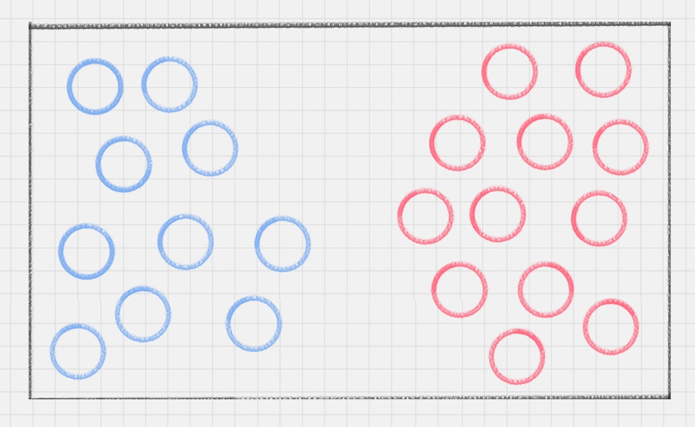
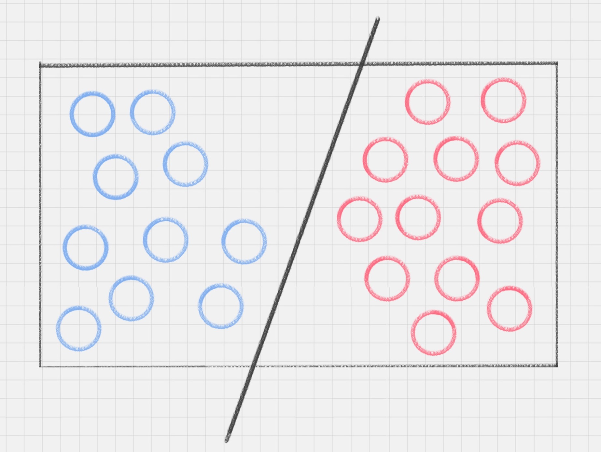
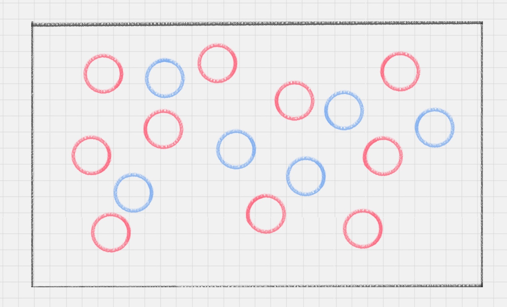
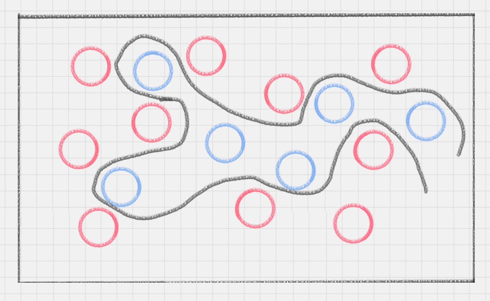
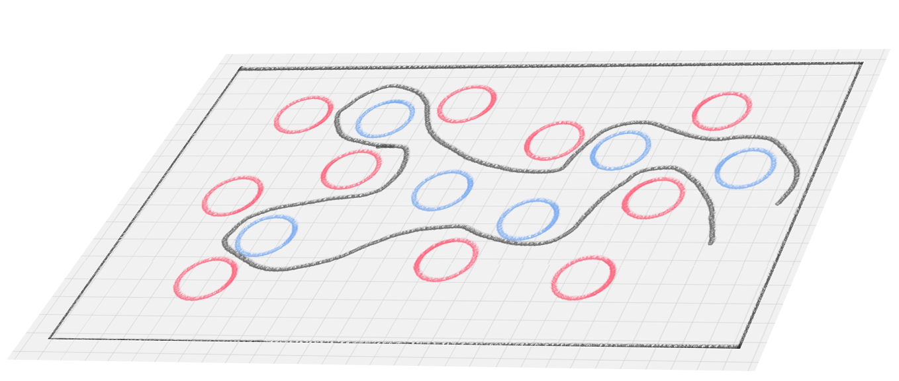
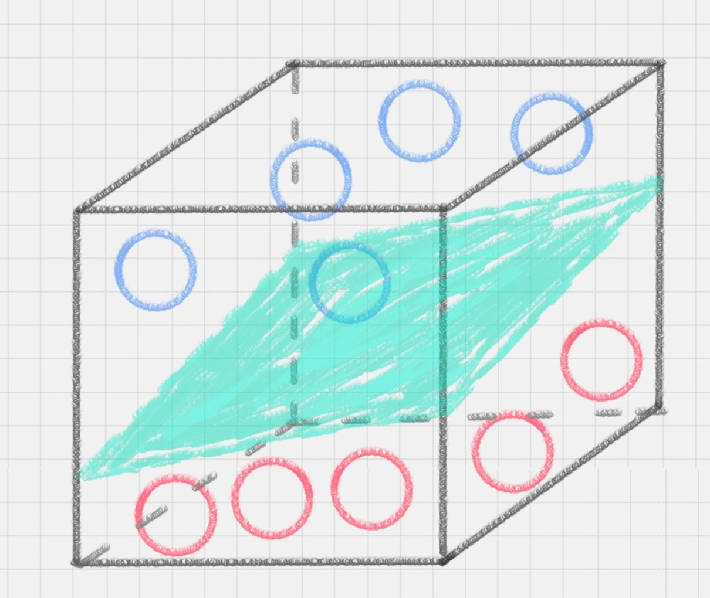
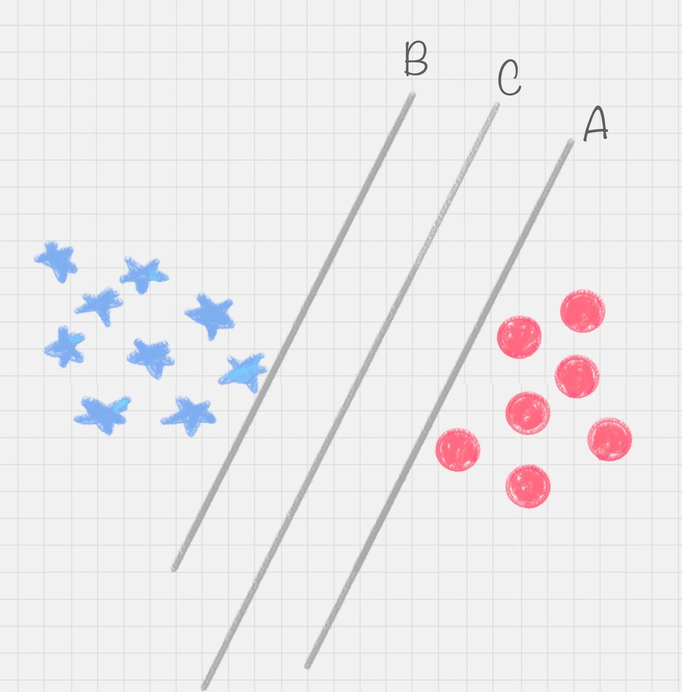
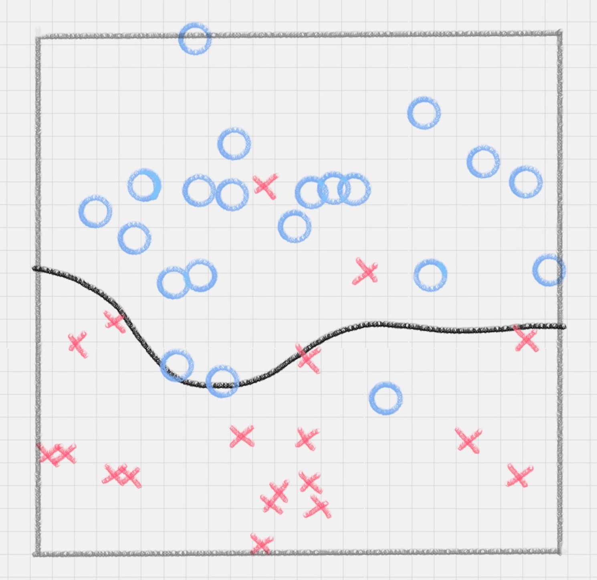

# 22丨SVM（上）：如何用一根棍子将蓝红两色球分开？

陈旸 2019-02-01



11:44

讲述：陈旸 大小：10.75M

<audio title="22丨SVM（上）：如何用一根棍子将蓝红两色球分开？" src="https://res001.geekbang.org//media/audio/9d/49/9dedf904e39f47c1865d15ab91b18d49/ld/ld.m3u8"></audio>

今天我来带你进行 SVM 的学习，SVM 的英文叫 Support Vector Machine，中文名为支持向量机。它是常见的一种分类方法，在机器学习中，SVM 是有监督的学习模型。

什么是有监督的学习模型呢？它指的是我们需要事先对数据打上分类标签，这样机器就知道这个数据属于哪个分类。同样无监督学习，就是数据没有被打上分类标签，这可能是因为我们不具备先验的知识，或者打标签的成本很高。所以我们需要机器代我们部分完成这个工作，比如将数据进行聚类，方便后续人工对每个类进行分析。SVM  作为有监督的学习模型，通常可以帮我们模式识别、分类以及回归分析。

听起来，是不是很高大上。我先带你做个小练习。

练习 1：桌子上我放了红色和蓝色两种球，请你用一根棍子将这两种颜色的球分开。

 你可以很快想到解决方案，在红色和蓝色球之间画条直线就好了，如下图所示：

 练习 2：这次难度升级，桌子上依然放着红色、蓝色两种球，但是它们的摆放不规律，如下图所示。如何用一根棍子把这两种颜色分开呢？

 你可能想了想，认为一根棍子是分不开的。除非把棍子弯曲，像下面这样：

 所以这里直线变成了曲线。如果在同一个平面上来看，红蓝两种颜色的球是很难分开的。那么有没有一种方式，可以让它们自然地分开呢？

这里你可能会灵机一动，猛拍一下桌子，这些小球瞬间腾空而起，如下图所示。在腾起的那一刹那，出现了一个水平切面，恰好把红、蓝两种颜色的球分开。

 在这里，二维平面变成了三维空间。原来的曲线变成了一个平面。这个平面，我们就叫做超平面。

## SVM 的工作原理

用 SVM 计算的过程就是帮我们找到那个超平面的过程，这个超平面就是我们的 SVM 分类器。

我们再过头来看最简单的练习 1，其实我们可以有多种直线的划分，比如下图所示的直线 A、直线 B 和直线 C，究竟哪种才是更好的划分呢？

 很明显图中的直线 B 更靠近蓝色球，但是在真实环境下，球再多一些的话，蓝色球可能就被划分到了直线 B 的右侧，被认为是红色球。同样直线 A  更靠近红色球，在真实环境下，如果红色球再多一些，也可能会被误认为是蓝色球。所以相比于直线 A 和直线 B，直线 C  的划分更优，因为它的鲁棒性更强。

那怎样才能寻找到直线 C 这个更优的答案呢？这里，我们引入一个 SVM 特有的概念：**分类间隔**。

实际上，我们的分类环境不是在二维平面中的，而是在多维空间中，这样直线 C 就变成了决策面 C。

在保证决策面不变，且分类不产生错误的情况下，我们可以移动决策面  C，直到产生两个极限的位置：如图中的决策面 A 和决策面 B。极限的位置是指，如果越过了这个位置，就会产生分类错误。这样的话，两个极限位置 A  和 B 之间的分界线 C 就是最优决策面。极限位置到最优决策面 C 之间的距离，就是“分类间隔”，英文叫做 margin。

如果我们转动这个最优决策面，你会发现可能存在多个最优决策面，它们都能把数据集正确分开，这些最优决策面的分类间隔可能是不同的，而那个拥有“最大间隔”（max margin）的决策面就是 SVM 要找的最优解。

 **点到超平面的距离公式**

在上面这个例子中，如果我们把红蓝两种颜色的球放到一个三维空间里，你发现决策面就变成了一个平面。这里我们可以用线性函数来表示，如果在一维空间里就表示一个点，在二维空间里表示一条直线，在三维空间中代表一个平面，当然空间维数还可以更多，这样我们给这个线性函数起个名称叫做“超平面”。超平面的数学表达可以写成：

 在这个公式里，w、x 是 n 维空间里的向量，其中 x 是函数变量；w 是法向量。法向量这里指的是垂直于平面的直线所表示的向量，它决定了超平面的方向。

**SVM 就是帮我们找到一个超平面**，这个超平面能将不同的样本划分开，同时使得样本集中的点到这个分类超平面的最小距离（即分类间隔）最大化。

在这个过程中，**支持向量**就是离**分类超平面**最近的样本点，实际上如果确定了支持向量也就确定了这个超平面。所以支持向量决定了分类间隔到底是多少，而在最大间隔以外的样本点，其实对分类都没有意义。

所以说， SVM 就是求解最大分类间隔的过程，我们还需要对分类间隔的大小进行定义。

首先，我们定义某类样本集到超平面的距离是这个样本集合内的样本到超平面的最短距离。我们用 di 代表点 xi 到超平面 wxi+b=0 的欧氏距离。因此我们要求 di 的最小值，用它来代表这个样本到超平面的最短距离。di 可以用公式计算得出：

 其中||w||为超平面的范数，di 的公式可以用解析几何知识进行推导，这里不做解释。

**最大间隔的优化模型**

我们的目标就是找出所有分类间隔中最大的那个值对应的超平面。在数学上，这是一个凸优化问题（凸优化就是关于求凸集中的凸函数最小化的问题，这里不具体展开）。通过凸优化问题，最后可以求出最优的  w 和 b，也就是我们想要找的最优超平面。中间求解的过程会用到拉格朗日乘子，和  KKT（Karush-Kuhn-Tucker）条件。数学公式比较多，这里不进行展开。

## 硬间隔、软间隔和非线性 SVM

假如数据是完全的线性可分的，那么学习到的模型可以称为硬间隔支持向量机。**换个说法，硬间隔指的就是完全分类准确，不能存在分类错误的情况。软间隔，就是允许一定量的样本分类错误**。

我们知道，实际工作中的数据没有那么“干净”，或多或少都会存在一些噪点。所以线性可分是个理想情况。这时，我们需要使用到软间隔 SVM（近似线性可分），比如下面这种情况：

 另外还存在一种情况，就是非线性支持向量机。

比如下面的样本集就是个非线性的数据。图中的两类数据，分别分布为两个圆圈的形状。那么这种情况下，不论是多高级的分类器，只要映射函数是线性的，就没法处理，SVM 也处理不了。这时，我们需要引入一个新的概念：**核函数。它可以将样本从原始空间映射到一个更高维的特质空间中，使得样本在新的空间中线性可分**。这样我们就可以使用原来的推导来进行计算，只是所有的推导是在新的空间，而不是在原来的空间中进行。

 所以在非线性 SVM 中，核函数的选择就是影响 SVM 最大的变量。最常用的核函数有线性核、多项式核、高斯核、拉普拉斯核、sigmoid  核，或者是这些核函数的组合。这些函数的区别在于映射方式的不同。通过这些核函数，我们就可以把样本空间投射到新的高维空间中。

当然软间隔和核函数的提出，都是为了方便我们对上面超平面公式中的 w* 和 b* 进行求解，从而得到最大分类间隔的超平面。

## 用 SVM 如何解决多分类问题

SVM 本身是一个二值分类器，最初是为二分类问题设计的，也就是回答 Yes 或者是 No。而实际上我们要解决的问题，可能是多分类的情况，比如对文本进行分类，或者对图像进行识别。

针对这种情况，我们可以将多个二分类器组合起来形成一个多分类器，常见的方法有“一对多法”和“一对一法”两种。

\1. 一对多法

假设我们要把物体分成 A、B、C、D 四种分类，那么我们可以先把其中的一类作为分类 1，其他类统一归为分类 2。这样我们可以构造 4 种 SVM，分别为以下的情况：

（1）样本 A 作为正集，B，C，D 作为负集；

（2）样本 B 作为正集，A，C，D 作为负集；

（3）样本 C 作为正集，A，B，D 作为负集；

（4）样本 D 作为正集，A，B，C 作为负集。

这种方法，针对 K 个分类，需要训练 K 个分类器，分类速度较快，但训练速度较慢，因为每个分类器都需要对全部样本进行训练，而且负样本数量远大于正样本数量，会造成样本不对称的情况，而且当增加新的分类，比如第 K+1 类时，需要重新对分类器进行构造。

\2. 一对一法

一对一法的初衷是想在训练的时候更加灵活。我们可以在任意两类样本之间构造一个 SVM，这样针对 K 类的样本，就会有 C(k,2) 类分类器。

比如我们想要划分 A、B、C 三个类，可以构造 3 个分类器：

（1）分类器 1：A、B；

（2）分类器 2：A、C；

（3）分类器 3：B、C。

当对一个未知样本进行分类时，每一个分类器都会有一个分类结果，即为 1 票，最终得票最多的类别就是整个未知样本的类别。

这样做的好处是，如果新增一类，不需要重新训练所有的 SVM，只需要训练和新增这一类样本的分类器。而且这种方式在训练单个 SVM 模型的时候，训练速度快。

但这种方法的不足在于，分类器的个数与 K 的平方成正比，所以当 K 较大时，训练和测试的时间会比较慢。

## 总结

今天我给你讲了 SVM 分类器，它在文本分类尤其是针对二分类任务性能卓越。同样，针对多分类的情况，我们可以采用一对多，或者一对一的方法，多个二值分类器组合成一个多分类器。

另外关于 SVM 分类器的概念，我希望你能掌握以下的三个程度：

1. 完全线性可分情况下的线性分类器，也就是线性可分的情况，是最原始的 SVM，它最核心的思想就是找到最大的分类间隔；
2. 大部分线性可分情况下的线性分类器，引入了软间隔的概念。软间隔，就是允许一定量的样本分类错误；
3. 线性不可分情况下的非线性分类器，引入了核函数。它让原有的样本空间通过核函数投射到了一个高维的空间中，从而变得线性可分。

在 SVM 的推导过程中，有大量的数学公式，这里不进行推导演绎，因为除了写论文，你大部分时候不会用到这些公式推导。

所以最重要的还是理解我上面讲的这些概念，能在实际工作中使用 SVM 才是最重要的。下一节我会和你讲如何用 sklearn 工具包进行 SVM 分类，带你做一个实际的案例。

最后，你能说一下你对有监督学习和无监督学习的理解吗？以及，SVM 最主要的思想就是硬间隔、软间隔和核函数。你是如何理解它们的？

欢迎你在评论区进行留言，与我分享你的答案。也欢迎点击“请朋友读”，把这篇文章分享给你的朋友或者同事。

© 版权归极客邦科技所有，未经许可不得传播售卖。 页面已增加防盗追踪，如有侵权极客邦将依法追究其法律责任。         

夜瓜居士

Ctrl + Enter 发表

0/2000字

提交留言

## 精选留言(18)

- 

  captain 

  老师好，最近几期的算法课内容量比较大，麻烦推荐一些相关的理论或案例的书籍，谢谢

  ** 14

  2019-02-01

- 

  third 

  有监督学习，就是告诉他这个是红的那个是蓝的。你给我分出红蓝
  无监督，自己学会认识红色和蓝色，然后再分类

  硬间接，就是完美数据下的完美情况，分出完美类
  软间隔，就是中间总有杂质，情况总是复杂，分类总是有一点错误
  核函数，高纬度打低纬度，

  ** 11

  2019-02-18

- 

  李沛欣 

  核函数，是一种格局更高的分类模式。通过它我们可以把原本混沌的一堆数据映射到高维，从上帝视角来对这些数据进行线性分类。

  来，扔个二向箔🤣

  ** 4

  2019-02-09

- 

  fancy 

  \1. 有监督学习and无监督学习
  有监督学习，即在已有类别标签的情况下，将样本数据进行分类。
  无监督学习，即在无类别标签的情况下，样本数据根据一定的方法进行分类，即聚类，分类好的类别需要进一步分析后，从而得知每个类别的特点。
  \2. 硬间隔、软间隔、核函数
  使用SVM算法，是基于数据是线性分布的情况，这时使用硬间隔的方法分类数据即可。但实际情况下，大部分数据都不属于线性分布，即通过软间隔、核函数处理后，使得数据可以利用SVM算法进行分类。软间隔是通过允许数据有误差，不是绝对的线性分布；核函数是通过将非线性分布的数据映射为线性分布的数据。

  ** 1

  2019-02-27

- 

  林 

  老师好，这一块的数学原理讲的有点少了吧，能不能讲讲拉格朗日对偶和kkt

  ** 1

  2019-02-16

- 

  Python 

  硬间隔，我认为就像线性回归一样，一条直线粗暴的画出边界，然后回答YES OR NO。
  软间隔，我认为类似逻辑回归，会绕一下弯子，最后给出的答案是一个概率。
  以上两种方式都是处理线性可分的数据，但碰到线性完全分布开的非线性数据的时候，就需要用到核函数，核函数主要是通过把低维的数据映射到高纬，产生一个落差，并给出一个超平面来划分。

  不知道我理解的对不对，希望老师回答YES OR NO

  ** 1

  2019-02-03

- 

  Python 

  老师，多分类器用的是集成法吗？

  ** 1

  2019-02-02

- 

  姜泮昌 

  老师，能不能讲讲这些分类算法的区别？尤其是二分类算法，在使用时怎样进行选择呢？谢谢

  ** 

  2019-06-06

- 

  张晓辉 

  监督学习适用于打标签的数据。无监督学习适于用没有标签的数据。
  SVM的硬间隔是指线性分类器完全线性可分，软间隔是指允许线性分类器有一定的分类错误。核函数是针对非线性可分的情况提出来的，可以利用核函数把样本空间投射到高维空间，然后再利用线性分类器进行分类。

  ** 

  2019-05-17

- 

  滢 

  告诉机器，给它一些数据，这部分数据一些是数据集合A，一部分是属于集合B，然后让机器去把数据往集合A和集合B里去划分，这是有监督学习；同样的数据给机器，只是告诉它去做划分和归类，这是无监督学习，类似于孩子的放养。   
  硬间隔：表示得到的分类间隔即超平面 能完美的划分数据，不存在划分错误的情况，即零误差
  软间隔：表示得到的分类间隔，没有达到完美的程度，对数据划分存在一定的误差
  核函数：在数据分布无法用线性函数来表示的时候，需要对数据进行划分的标准变成来非线性的，这个时候就需要用到一种函数名叫核函数，核函数要做的工作是将原来的映射关系在更高维度的空间重新映射，使得新的映射关系变得线性可分。

  ** 

  2019-04-18

- 

  Daniel的爹 

  有监督学习就是在训练组中已知数据的结果，可以对模型的训练进行Supervise监督。无监督就是拿到手的训练集并不知道分类情况，要根据算法来区分并生成对应的结果。
  硬间隔是理想化的世界，非红即白，不允许出错。软间隔有容错率更现实点，包容性强，更有普适性。核函数可以在原本训练集中多加一维，让分类更容易。

  ** 

  2019-04-12

- 

  滨滨 

  有监督学习和无监督学习的根本区别，就是训练数据中是否有标签。监督学习的数据既有特征又有标签，而非监督学习的数据中只有特征而没有标签。
  监督学习是通过训练让机器自己找到特征和标签之间的联系，在以后面对只有特征而没有标签的数据时可以自己判别出标签。
  非监督学习由于训练数据中只有特征没有标签，所以就需要自己对数据进行聚类分析，然后就可以通过聚类的方式从数据中提取一个特殊的结构。
  2、硬间隔、软间隔和核函数
  硬间隔指的就是完全分类准确，不能存在分类错误的情况。软间隔，就是允许一定量的样本分类错误。
  线性不可分的情况下，可以使用核函数将样本从原始空间映射到一个更高维的特质空间中，使得样本在新的空间中线性可分。

  ** 

  2019-03-29

- 

  行者 

  有点烧脑了，慢慢消化，感觉一篇文章要花几个小时才能消化。

  ** 

  2019-03-26

- 

  Geek_dancer 

  SVM如何与回归应用联系起来？

  ** 

  2019-03-16

- 

  Wei_强 

  能讲解一下什么叫做“线性不可分”么？对这个知识点不是很了解，结果导致文章后面的知识点没有怎么理解

  ** 

  2019-02-28

- 

  王彬成 

  1、有监督学习和无监督学习的理解
  有监督学习和无监督学习的根本区别，就是训练数据中是否有标签。监督学习的数据既有特征又有标签，而非监督学习的数据中只有特征而没有标签。
  监督学习是通过训练让机器自己找到特征和标签之间的联系，在以后面对只有特征而没有标签的数据时可以自己判别出标签。
  非监督学习由于训练数据中只有特征没有标签，所以就需要自己对数据进行聚类分析，然后就可以通过聚类的方式从数据中提取一个特殊的结构。
  2、硬间隔、软间隔和核函数
  硬间隔指的就是完全分类准确，不能存在分类错误的情况。软间隔，就是允许一定量的样本分类错误。
  它可以将样本从原始空间映射到一个更高维的特质空间中，使得样本在新的空间中线性可分。

  ** 

  2019-02-21

- 

  深白浅黑 

  核心在于数据是否线性可分，以及容错能力强弱。
  硬间隔和软间隔都是处理线性可分的情况，区别在于容错能力。
  核函数用于处理线性不可分情况，将现有数据进行升维，达到线性可分，再进行类别划分处理。

  ** 

  2019-02-15

- 

  JingZ 

  监督学习和无监督学习根本区别在于是否有标签，核心分别是分类和聚类、同维和降维等~

  硬间隔、软间隔、核函数是适用于线性可分、不完全可分、不可分等不同情况下的分类思想

  ** 

  2019-02-12