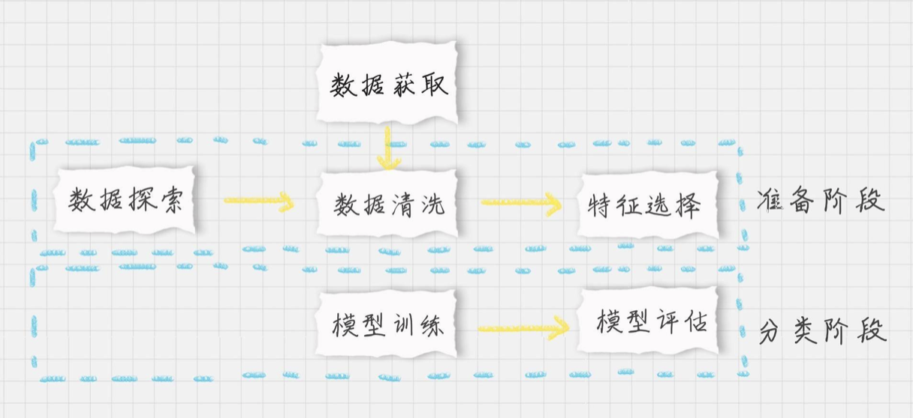
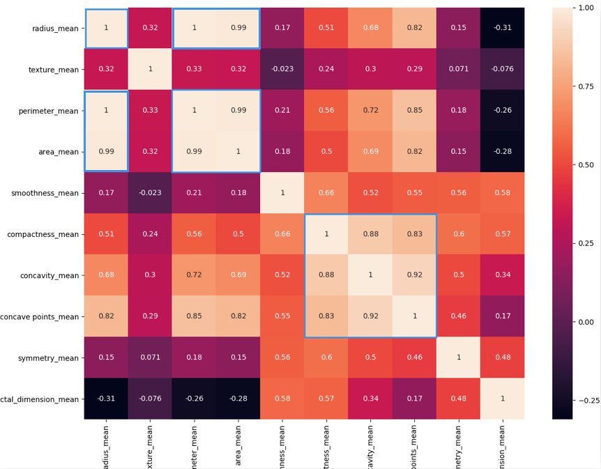

# 23丨SVM（下）：如何进行乳腺癌检测？

陈旸 2019-02-04





10:21

讲述：陈旸 大小：23.71M

<audio title="23丨SVM（下）：如何进行乳腺癌检测？" src="https://res001.geekbang.org//media/audio/b3/cc/b338f169d9377c97fe6353c962591dcc/ld/ld.m3u8"></audio>

讲完了 SVM 的原理之后，今天我来带你进行 SVM 的实战。

在此之前我们先来回顾一下 SVM 的相关知识点。SVM 是有监督的学习模型，我们需要事先对数据打上分类标签，通过求解最大分类间隔来求解二分类问题。如果要求解多分类问题，可以将多个二分类器组合起来形成一个多分类器。

上一节中讲到了硬间隔、软间隔、非线性 SVM，以及分类间隔的公式，你可能会觉得比较抽象。这节课，我们会在实际使用中，讲解对工具的使用，以及相关参数的含义。

## 如何在 sklearn 中使用 SVM

在 Python 的 sklearn 工具包中有 SVM 算法，首先需要引用工具包：

```

from sklearn import svm


```

SVM 既可以做回归，也可以做分类器。

当用 SVM 做回归的时候，我们可以使用 SVR 或 LinearSVR。SVR 的英文是 Support Vector Regression。这篇文章只讲分类，这里只是简单地提一下。

当做分类器的时候，我们使用的是 SVC 或者 LinearSVC。SVC 的英文是 Support Vector Classification。

我简单说一下这两者之前的差别。

从名字上你能看出 LinearSVC 是个线性分类器，用于处理线性可分的数据，只能使用线性核函数。上一节，我讲到 SVM 是通过核函数将样本从原始空间映射到一个更高维的特质空间中，这样就使得样本在新的空间中线性可分。

如果是针对非线性的数据，需要用到 SVC。在 SVC 中，我们既可以使用到线性核函数（进行线性划分），也能使用高维的核函数（进行非线性划分）。

如何创建一个 SVM 分类器呢？

我们首先使用 SVC 的构造函数：model = svm.SVC(kernel=‘rbf’, C=1.0, gamma=‘auto’)，这里有三个重要的参数 kernel、C 和 gamma。

kernel 代表核函数的选择，它有四种选择，只不过默认是 rbf，即高斯核函数。

1. linear：线性核函数
2. poly：多项式核函数
3. rbf：高斯核函数（默认）
4. sigmoid：sigmoid 核函数

这四种函数代表不同的映射方式，你可能会问，在实际工作中，如何选择这 4 种核函数呢？我来给你解释一下：

线性核函数，是在数据线性可分的情况下使用的，运算速度快，效果好。不足在于它不能处理线性不可分的数据。

多项式核函数可以将数据从低维空间映射到高维空间，但参数比较多，计算量大。

高斯核函数同样可以将样本映射到高维空间，但相比于多项式核函数来说所需的参数比较少，通常性能不错，所以是默认使用的核函数。

了解深度学习的同学应该知道 sigmoid 经常用在神经网络的映射中。因此当选用 sigmoid 核函数时，SVM 实现的是多层神经网络。

上面介绍的 4 种核函数，除了第一种线性核函数外，其余 3 种都可以处理线性不可分的数据。

参数 C 代表目标函数的惩罚系数，惩罚系数指的是分错样本时的惩罚程度，默认情况下为 1.0。当 C 越大的时候，分类器的准确性越高，但同样容错率会越低，泛化能力会变差。相反，C 越小，泛化能力越强，但是准确性会降低。

参数 gamma 代表核函数的系数，默认为样本特征数的倒数，即 gamma = 1 / n_features。

在创建  SVM 分类器之后，就可以输入训练集对它进行训练。我们使用 model.fit(train_X,train_y)，传入训练集中的特征值矩阵  train_X 和分类标识  train_y。特征值矩阵就是我们在特征选择后抽取的特征值矩阵（当然你也可以用全部数据作为特征值矩阵）；分类标识就是人工事先针对每个样本标识的分类结果。这样模型会自动进行分类器的训练。我们可以使用  prediction=model.predict(test_X) 来对结果进行预测，传入测试集中的样本特征矩阵  test_X，可以得到测试集的预测分类结果 prediction。

同样我们也可以创建线性 SVM 分类器，使用  model=svm.LinearSVC()。在 LinearSVC 中没有 kernel 这个参数，限制我们只能使用线性核函数。由于  LinearSVC 对线性分类做了优化，对于数据量大的线性可分问题，使用 LinearSVC 的效率要高于 SVC。

如果你不知道数据集是否为线性，可以直接使用 SVC 类创建 SVM 分类器。

在训练和预测中，LinearSVC 和 SVC 一样，都是使用 model.fit(train_X,train_y) 和 model.predict(test_X)。

## 如何用 SVM 进行乳腺癌检测

在了解了如何创建和使用 SVM 分类器后，我们来看一个实际的项目，数据集来自美国威斯康星州的乳腺癌诊断数据集，[点击这里进行下载](https://github.com/cystanford/breast_cancer_data/)。

医疗人员采集了患者乳腺肿块经过细针穿刺 (FNA) 后的数字化图像，并且对这些数字图像进行了特征提取，这些特征可以描述图像中的细胞核呈现。肿瘤可以分成良性和恶性。部分数据截屏如下所示：


 数据表一共包括了 32 个字段，代表的含义如下：


上面的表格中，mean  代表平均值，se 代表标准差，worst 代表最大值（3 个最大值的平均值）。每张图像都计算了相应的特征，得出了这 30 个特征值（不包括  ID 字段和分类标识结果字段 diagnosis），实际上是 10  个特征值（radius、texture、perimeter、area、smoothness、compactness、concavity、concave  points、symmetry 和 fractal_dimension_mean）的 3 个维度，平均、标准差和最大值。这些特征值都保留了 4  位数字。字段中没有缺失的值。在 569 个患者中，一共有 357 个是良性，212 个是恶性。

好了，我们的目标是生成一个乳腺癌诊断的 SVM 分类器，并计算这个分类器的准确率。首先设定项目的执行流程：



1. 首先我们需要加载数据源；
2. 在准备阶段，需要对加载的数据源进行探索，查看样本特征和特征值，这个过程你也可以使用数据可视化，它可以方便我们对数据及数据之间的关系进一步加深了解。然后按照“完全合一”的准则来评估数据的质量，如果数据质量不高就需要做数据清洗。数据清洗之后，你可以做特征选择，方便后续的模型训练；
3. 在分类阶段，选择核函数进行训练，如果不知道数据是否为线性，可以考虑使用 SVC(kernel=‘rbf’) ，也就是高斯核函数的 SVM 分类器。然后对训练好的模型用测试集进行评估。

按照上面的流程，我们来编写下代码，加载数据并对数据做部分的探索：

```

# 加载数据集，你需要把数据放到目录中

data = pd.read_csv("./data.csv")

# 数据探索

# 因为数据集中列比较多，我们需要把 dataframe 中的列全部显示出来

pd.set_option('display.max_columns', None)

print(data.columns)

print(data.head(5))

print(data.describe())


```

这是部分的运行结果，完整结果你可以自己跑一下。

```

Index(['id', 'diagnosis', 'radius_mean', 'texture_mean', 'perimeter_mean',

       'area_mean', 'smoothness_mean', 'compactness_mean', 'concavity_mean',

       'concave points_mean', 'symmetry_mean', 'fractal_dimension_mean',

       'radius_se', 'texture_se', 'perimeter_se', 'area_se', 'smoothness_se',

       'compactness_se', 'concavity_se', 'concave points_se', 'symmetry_se',

       'fractal_dimension_se', 'radius_worst', 'texture_worst',

       'perimeter_worst', 'area_worst', 'smoothness_worst',

       'compactness_worst', 'concavity_worst', 'concave points_worst',

       'symmetry_worst', 'fractal_dimension_worst'],

      dtype='object')

         id diagnosis  radius_mean  texture_mean  perimeter_mean  area_mean  \

0    842302         M        17.99         10.38          122.80     1001.0   

1    842517         M        20.57         17.77          132.90     1326.0   

2  84300903         M        19.69         21.25          130.00     1203.0   

3  84348301         M        11.42         20.38           77.58      386.1   

4  84358402         M        20.29         14.34          135.10     1297.0 


```

接下来，我们就要对数据进行清洗了。

运行结果中，你能看到  32 个字段里，id 是没有实际含义的，可以去掉。diagnosis 字段的取值为 B 或者 M，我们可以用 0 和 1 来替代。另外其余的  30 个字段，其实可以分成三组字段，下划线后面的 mean、se 和 worst 代表了每组字段不同的度量方式，分别是平均值、标准差和最大值。

```

# 将特征字段分成 3 组

features_mean= list(data.columns[2:12])

features_se= list(data.columns[12:22])

features_worst=list(data.columns[22:32])

# 数据清洗

# ID 列没有用，删除该列

data.drop("id",axis=1,inplace=True)

# 将 B 良性替换为 0，M 恶性替换为 1

data['diagnosis']=data['diagnosis'].map({'M':1,'B':0})


```

然后我们要做特征字段的筛选，首先需要观察下 features_mean 各变量之间的关系，这里我们可以用 DataFrame 的 corr() 函数，然后用热力图帮我们可视化呈现。同样，我们也会看整体良性、恶性肿瘤的诊断情况。

```

# 将肿瘤诊断结果可视化

sns.countplot(data['diagnosis'],label="Count")

plt.show()

# 用热力图呈现 features_mean 字段之间的相关性

corr = data[features_mean].corr()

plt.figure(figsize=(14,14))

# annot=True 显示每个方格的数据

sns.heatmap(corr, annot=True)

plt.show()


```

这是运行的结果：



 热力图中对角线上的为单变量自身的相关系数是 1。颜色越浅代表相关性越大。所以你能看出来 radius_mean、perimeter_mean 和  area_mean 相关性非常大，compactness_mean、concavity_mean、concave_points_mean  这三个字段也是相关的，因此我们可以取其中的一个作为代表。

那么如何进行特征选择呢？

特征选择的目的是降维，用少量的特征代表数据的特性，这样也可以增强分类器的泛化能力，避免数据过拟合。

我们能看到  mean、se 和 worst 这三组特征是对同一组内容的不同度量方式，我们可以保留 mean 这组特征，在特征选择中忽略掉 se 和  worst。同时我们能看到 mean 这组特征中，radius_mean、perimeter_mean、area_mean  这三个属性相关性大，compactness_mean、daconcavity_mean、concave points_mean  这三个属性相关性大。我们分别从这 2 类中选择 1 个属性作为代表，比如 radius_mean 和 compactness_mean。

这样我们就可以把原来的 10 个属性缩减为 6 个属性，代码如下：

```

# 特征选择

features_remain = ['radius_mean','texture_mean', 'smoothness_mean','compactness_mean','symmetry_mean', 'fractal_dimension_mean'] 


```

对特征进行选择之后，我们就可以准备训练集和测试集：

```

# 抽取 30% 的数据作为测试集，其余作为训练集

train, test = train_test_split(data, test_size = 0.3)# in this our main data is splitted into train and test

# 抽取特征选择的数值作为训练和测试数据

train_X = train[features_remain]

train_y=train['diagnosis']

test_X= test[features_remain]

test_y =test['diagnosis']


```

在训练之前，我们需要对数据进行规范化，这样让数据同在同一个量级上，避免因为维度问题造成数据误差：

```

# 采用 Z-Score 规范化数据，保证每个特征维度的数据均值为 0，方差为 1

ss = StandardScaler()

train_X = ss.fit_transform(train_X)

test_X = ss.transform(test_X)


```

最后我们可以让 SVM 做训练和预测了：

```

# 创建 SVM 分类器

model = svm.SVC()

# 用训练集做训练

model.fit(train_X,train_y)

# 用测试集做预测

prediction=model.predict(test_X)

print('准确率: ', metrics.accuracy_score(prediction,test_y))


```

运行结果：

```

准确率:  0.9181286549707602


```

准确率大于 90%，说明训练结果还不错。完整的代码你可以从[GitHub](https://github.com/cystanford/breast_cancer_data)上下载。

## 总结

今天我带你一起做了乳腺癌诊断分类的 SVM 实战，从这个过程中你应该能体会出来整个执行的流程，包括数据加载、数据探索、数据清洗、特征选择、SVM 训练和结果评估等环节。

sklearn 已经为我们提供了很好的工具，对上节课中讲到的 SVM 的创建和训练都进行了封装，让我们无需关心中间的运算细节。但正因为这样，我们更需要对每个流程熟练掌握，通过实战项目训练数据化思维和对数据的敏感度。


 最后给你留两道思考题吧。还是这个乳腺癌诊断的数据，请你用 LinearSVC，选取全部的特征（除了 ID 以外）作为训练数据，看下你的分类器能得到多少的准确度呢？另外你对 sklearn 中 SVM 使用又有什么样的体会呢？

欢迎在评论区与我分享你的答案，也欢迎点击“请朋友读”，把这篇文章分享给你的朋友或者同事，一起来交流，一起来进步。


© 版权归极客邦科技所有，未经许可不得传播售卖。 页面已增加防盗追踪，如有侵权极客邦将依法追究其法律责任。         


夜瓜居士


Ctrl + Enter 发表

0/2000字

提交留言

## 精选留言(21)

- 

  reverse 

  极客时间数据分析实战45讲的详细笔记(包含markdown、图片、思维导图 代码) github地址： https://github.com/xiaomiwujiecao/DataAnalysisInAction

  ** 7

  2019-03-06

- 

  滢 

  利用SVM做分类，特征选择影响度大，要想SVM分类准确，人工处理数据这一步很重要

  ** 3

  2019-04-18

- 

  Geek_dancer 

  默认SVC训练模型，6个特征变量，训练集准确率：96.0%，测试集准确率：92.4%
  默认SVC训练模型，10个特征变量，训练集准确率：98.7% ，测试集准确率：98.2%
  LinearSVC训练模型， 6个特征变量， 训练集准确率：93.9%，测试集准确率：92.3%
  LinearSVC训练模型， 10个特征变量， 训练集准确率：99.4%，测试集准确率：96.0%

  结论：
  \1. 增加特征变量可以提高准确率，可能是因为模型维度变高，模型变得更加复杂。可以看出特征变量的选取很重要。
  \2. 训练集拟合都比较好，但是测试集准确率出现不同程度的下降。
  \3. 模型训练的准确率与人类水平之间偏差可以通过增加特征变量或采用新的训练模型来降低；模型训练的准确率与测试集测试的准确率之间的方差可以通过正则化，提高泛化性能等方式来降低。

  ** 3

  2019-02-27

- 

  mickey 

  ** 2

  2019-02-26

- 

  Rickie 

  思考题：
  使用全部数据进行训练得到的准确率为0.9766，高于示例中的准确率。是否是由于多重共线性，使得测试结果偏高？

  ** 2

  2019-02-05

- 

  hlz-123 

  首先要说，老师的课讲得非常好，深奥的算法和理论通过生动有趣的例子让人通俗易懂，兴趣盎然。
  老师的本课案例中，对特征数据都做了Z-Score规范化处理（正态分布），准确率在90%以上，如果数据不做规范化处理，准确率在88%左右，我的问题：
  1、数据规范化处理，是不是人为地提供了准确率？实际情况，数据不一定是正态分布。
  2、模型建好后，在实际应用中去评估某个案例时，该案例数据是不是也要规范化，这样做是不是很麻烦并且数据对比不是很直观呢？

  ** 1

  2019-03-16

- 

  third 

  第二个，准确率 0.935672514619883。

  感觉还蛮好用的，只是不是很熟练的使用各个算法做分类和回归

  ** 1

  2019-02-18

- 

  姜泮昌 

  准备训练集和测试集的代码是否有问题？
  test_X= test[features_remain]
  这里应该是features_remain吧？

  ** 

  2019-06-06

- 

  张晓辉 

  采用linearSVC, 预测准确率更高。
  import pandas as pd 
  from sklearn.model_selection import train_test_split
  from sklearn import svm
  from sklearn.metrics import accuracy_score
  from sklearn.preprocessing import StandardScaler

  data = pd.read_csv('data.csv')
  data.drop('id', axis=1, inplace=True)

  feature_names = list(data.columns)
  feature_names.remove('diagnosis')

  traindata, testdata = train_test_split(data, test_size=0.3)
  train_x = traindata[feature_names]
  train_y = traindata['diagnosis']
  test_x = testdata[feature_names]
  test_y = testdata['diagnosis']

  ss = StandardScaler()
  train_x = ss.fit_transform(train_x)
  test_x = ss.transform(test_x)
                      
  model = svm.LinearSVC()
  model.fit(train_x, train_y)
  prediction = model.predict(test_x)
  print("The accuracy is %f" % accuracy_score(prediction, test_y))

  ** 

  2019-05-19

- 

  滢 

  ** 

  2019-04-18

- 

  王彬成 

  ** 

  2019-04-02

- 

  圆圆的大食客 

  ** 

  2019-03-18

- 

  叮当猫 

  ** 

  2019-03-16

- 

  三硝基甲苯 

  用K折交叉验证，LinearSVC的准确率是92.64% SVC是92.98% 
  至于SVC的使用，我一开始直接按照自己的想法写完以后，会有聚合警告，然后看了一下，是数据没有进行StandardScaler，我觉得这个步骤容易忘记。

  ** 

  2019-03-10

- 

  fancy 

  使用LinearSVC和全部特征作为训练集时，分类器的准确率达到了99.4152%，在其他条件不变的情况下，其准确率高于SVC。

  ** 

  2019-03-02

- 

  ldw 

  陈老师，这堂课留的课后任务，包括可能使用的数据清洗，您会期望您团队的人用多长时间完成？超过多长时间以上，就是不合格的？谢谢🙏

  ** 

  2019-02-28

- 

  mickey 

  勘误：热力学图中的第一个蓝色框框应该是标记在第1列第3-4行上，而不是第1列第1行。

  ** 

  2019-02-26

  编辑回复: 代表的含义是：radius_mean，perimeter_mean，area_mean这三个指标正相关，因此选择其中一个代表即可（我在正文中也写到了）
  你说的标注第一列第3-4行也是对的，因为这几个指标都是正相关。完整的看第一行的第3-4列也可以标注上，实际上这三个指标可以重新组成一个小矩形。
  我的标注（第一行第一列+第34行第34列，代表的是这三个指标相关）起到提示的作用，最主要的还是说明：radius_mean，perimeter_mean，area_mean这三个指标正相关。这个是最终的结果。
  Anyway 你把第一列第3-4行标注出来，或者第一行第3-4列标注出来都是对的

- 

  Destroy、 

  ** 

  2019-02-20

- 

  深白浅黑 

  使用全部特征：（相同训练集和测试集）
  LinearSVC准确率:  0.9298245614035088
  SVC高斯核准确率: 0.9415204678362573
  SVM首先是有监督的学习模型，需要数据有较好的分类属性。其次依据硬间隔、软间隔和核函数的应用，可以解决线性分类和非线性分类的问题。最后在使用过程中，需要对数据的特征进行有针对性的降维，利用数据的相关性，对相关性较大的类别属性选择其中一个作为特征，在特征选取后，要进行标准化处理。

  ** 

  2019-02-15

- 

  JingZ 

  ** 

  2019-02-15

- 

  Python 

  老师可以用PCA进行特征选择吗？如果可以，那和你这种手动的方法比有什么差别

  ** 

  2019-02-04