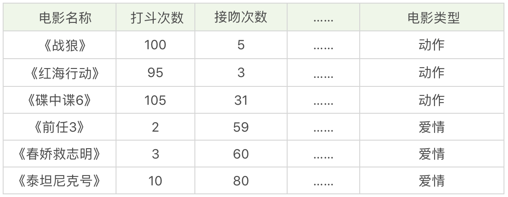
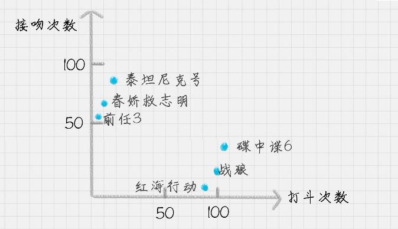
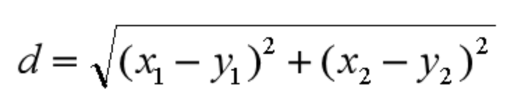
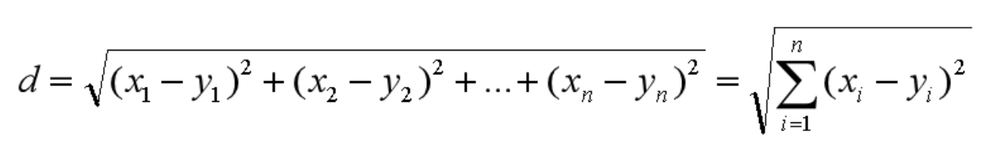
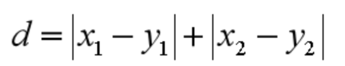
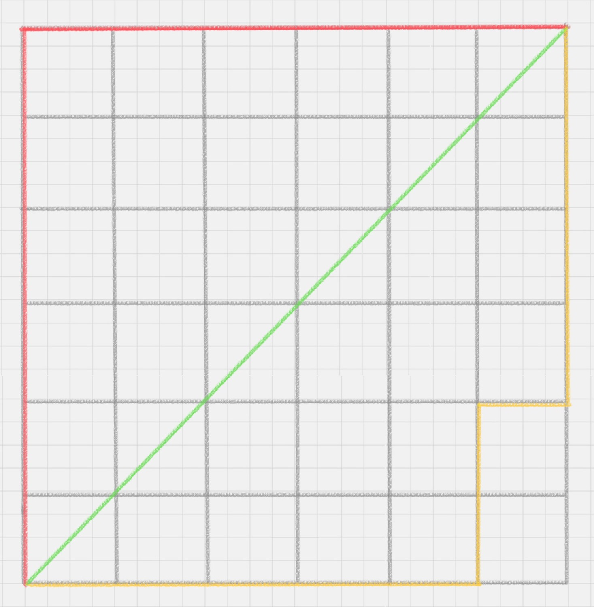
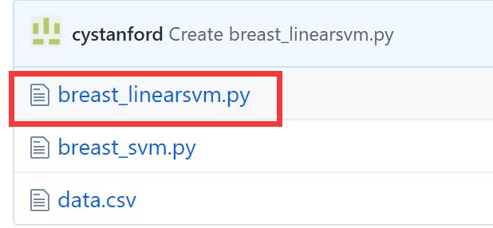

# 24丨KNN（上）：如何根据打斗和接吻次数来划分电影类型？

陈旸 2019-02-06



08:30

讲述：陈旸 大小：7.79M

<audio title="24丨KNN（上）：如何根据打斗和接吻次数来划分电影类型？" src="https://res001.geekbang.org//media/audio/4c/22/4c6cb0d4b941254d064f275d496e1122/ld/ld.m3u8"></audio>

今天我来带你进行 KNN 的学习，KNN 的英文叫 K-Nearest Neighbor，应该算是数据挖掘算法中最简单的一种。

我们先用一个例子体会下。

假设，我们想对电影的类型进行分类，统计了电影中打斗次数、接吻次数，当然还有其他的指标也可以被统计到，如下表所示。

 我们很容易理解《战狼》《红海行动》《碟中谍 6》是动作片，《前任 3》《春娇救志明》《泰坦尼克号》是爱情片，但是有没有一种方法让机器也可以掌握这个分类的规则，当有一部新电影的时候，也可以对它的类型自动分类呢？

我们可以把打斗次数看成  X 轴，接吻次数看成 Y 轴，然后在二维的坐标轴上，对这几部电影进行标记，如下图所示。对于未知的电影 A，坐标为  (x,y)，我们需要看下离电影 A 最近的都有哪些电影，这些电影中的大多数属于哪个分类，那么电影 A  就属于哪个分类。实际操作中，我们还需要确定一个 K 值，也就是我们要观察离电影 A 最近的电影有多少个。

## KNN 的工作原理

“近朱者赤，近墨者黑”可以说是 KNN 的工作原理。整个计算过程分为三步：

1. 计算待分类物体与其他物体之间的距离；
2. 统计距离最近的 K 个邻居；
3. 对于 K 个最近的邻居，它们属于哪个分类最多，待分类物体就属于哪一类。

**K 值如何选择**

你能看出整个 KNN 的分类过程，K 值的选择还是很重要的。那么问题来了，K 值选择多少是适合的呢？

如果 K 值比较小，就相当于未分类物体与它的邻居非常接近才行。这样产生的一个问题就是，如果邻居点是个噪声点，那么未分类物体的分类也会产生误差，这样 KNN 分类就会产生过拟合。

如果 K 值比较大，相当于距离过远的点也会对未知物体的分类产生影响，虽然这种情况的好处是鲁棒性强，但是不足也很明显，会产生欠拟合情况，也就是没有把未分类物体真正分类出来。

所以 K 值应该是个实践出来的结果，并不是我们事先而定的。在工程上，我们一般采用交叉验证的方式选取 K 值。

交叉验证的思路就是，把样本集中的大部分样本作为训练集，剩余的小部分样本用于预测，来验证分类模型的准确性。所以在 KNN 算法中，我们一般会把 K 值选取在较小的范围内，同时在验证集上准确率最高的那一个最终确定作为 K 值。

**距离如何计算**

在 KNN 算法中，还有一个重要的计算就是关于距离的度量。两个样本点之间的距离代表了这两个样本之间的相似度。距离越大，差异性越大；距离越小，相似度越大。

关于距离的计算方式有下面五种方式：

1. 欧氏距离；
2. 曼哈顿距离；
3. 闵可夫斯基距离；
4. 切比雪夫距离；
5. 余弦距离。

其中前三种距离是 KNN 中最常用的距离，我给你分别讲解下。

**欧氏距离**是我们最常用的距离公式，也叫做欧几里得距离。在二维空间中，两点的欧式距离就是：

 同理，我们也可以求得两点在 n 维空间中的距离：

 **曼哈顿距离**在几何空间中用的比较多。以下图为例，绿色的直线代表两点之间的欧式距离，而红色和黄色的线为两点的曼哈顿距离。所以曼哈顿距离等于两个点在坐标系上绝对轴距总和。用公式表示就是：

 **闵可夫斯基距离**不是一个距离，而是一组距离的定义。对于 n 维空间中的两个点 x(x1,x2,…,xn) 和 y(y1,y2,…,yn) ， x 和 y 两点之间的闵可夫斯基距离为：

 其中 p 代表空间的维数，当 p=1 时，就是曼哈顿距离；当 p=2 时，就是欧氏距离；当 p→∞时，就是切比雪夫距离。

**那么切比雪夫距离**怎么计算呢？二个点之间的切比雪夫距离就是这两个点坐标数值差的绝对值的最大值，用数学表示就是：max(|x1-y1|,|x2-y2|)。

**余弦距离**实际上计算的是两个向量的夹角，是在方向上计算两者之间的差异，对绝对数值不敏感。在兴趣相关性比较上，角度关系比距离的绝对值更重要，因此余弦距离可以用于衡量用户对内容兴趣的区分度。比如我们用搜索引擎搜索某个关键词，它还会给你推荐其他的相关搜索，这些推荐的关键词就是采用余弦距离计算得出的。

## KD 树

其实从上文你也能看出来，KNN  的计算过程是大量计算样本点之间的距离。为了减少计算距离次数，提升 KNN 的搜索效率，人们提出了 KD 树（K-Dimensional  的缩写）。KD 树是对数据点在 K 维空间中划分的一种数据结构。在 KD 树的构造中，每个节点都是 k  维数值点的二叉树。既然是二叉树，就可以采用二叉树的增删改查操作，这样就大大提升了搜索效率。

在这里，我们不需要对 KD 树的数学原理了解太多，你只需要知道它是一个二叉树的数据结构，方便存储 K 维空间的数据就可以了。而且在 sklearn 中，我们直接可以调用 KD 树，很方便。

## 用 KNN 做回归

KNN 不仅可以做分类，还可以做回归。首先讲下什么是回归。在开头电影这个案例中，如果想要对未知电影进行类型划分，这是一个分类问题。首先看一下要分类的未知电影，离它最近的 K 部电影大多数属于哪个分类，这部电影就属于哪个分类。

如果是一部新电影，已知它是爱情片，想要知道它的打斗次数、接吻次数可能是多少，这就是一个回归问题。

那么 KNN 如何做回归呢？

对于一个新点，我们需要找出这个点的  K 个最近邻居，然后将这些邻居的属性的平均值赋给该点，就可以得到该点的属性。当然不同邻居的影响力权重可以设置成不同的。举个例子，比如一部电影  A，已知它是动作片，当 K=3 时，最近的 3 部电影是《战狼》，《红海行动》和《碟中谍 6》，那么它的打斗次数和接吻次数的预估值分别为  (100+95+105)/3=100 次、(5+3+31)/3=13 次。

## 总结

今天我给你讲了 KNN  的原理，以及 KNN 中的几个关键因素。比如针对 K 值的选择，我们一般采用交叉验证的方式得出。针对样本点之间的距离的定义，常用的有 5  种表达方式，你也可以自己来定义两个样本之间的距离公式。不同的定义，适用的场景不同。比如在搜索关键词推荐中，余弦距离是更为常用的。

另外你也可以用 KNN 进行回归，通过 K 个邻居对新的点的属性进行值的预测。

KNN 的理论简单直接，针对 KNN 中的搜索也有相应的 KD 树这个数据结构。KNN 的理论成熟，可以应用到线性和非线性的分类问题中，也可以用于回归分析。

不过 KNN 需要计算测试点与样本点之间的距离，当数据量大的时候，计算量是非常庞大的，需要大量的存储空间和计算时间。另外如果样本分类不均衡，比如有些分类的样本非常少，那么该类别的分类准确率就会低很多。

当然在实际工作中，我们需要考虑到各种可能存在的情况，比如针对某类样本少的情况，可以增加该类别的权重。

同样 KNN 也可以用于推荐算法，虽然现在很多推荐系统的算法会使用 TD-IDF、协同过滤、Apriori 算法，不过针对数据量不大的情况下，采用 KNN 作为推荐算法也是可行的。

 最后我给你留几道思考题吧，KNN 的算法原理和工作流程是怎么样的？KNN 中的 K 值又是如何选择的？

## 上一篇文章思考题的代码

我在上篇文章里留了一道思考题，你可以在[GitHub](http://github.com/cystanford/breast_cancer_data)上看到我写的关于这道题的代码（完整代码和文章案例代码差别不大），供你借鉴。

欢迎你在评论区与我分享你的答案，也欢迎点击“请朋友读”，把这篇文章分享给你的朋友或者同事。

© 版权归极客邦科技所有，未经许可不得传播售卖。 页面已增加防盗追踪，如有侵权极客邦将依法追究其法律责任。         

夜瓜居士

Ctrl + Enter 发表

0/2000字

提交留言

## 精选留言(19)

- 

  白夜 置顶

  曼哈顿距离写错了吧？ 应该d=|X1-X2|+|Y1-Y2|吧

  ** 2

  2019-02-14

  编辑回复:   我之前在微信群里说过这个问题，这个主要是因为后面有个n维空间，所以我定义的两个点分别是(x1,x2,...,xn)和(y1,y2,...,yn)。所以你看到的公式是用|x1-x2|和|y1-y2|，看起来会和我们之前学到的不一样，关键还是在于对点的定义上。你能理解公式的含义即可，另外这里主要是考虑到不光是2维的空间，如果是2维，3维我可以用字母来表示，比如用x,y,z，但是更多的维度，我在文章里是会用x1,x2,...,xn来表示一个点的定义。

- 

  Python 

  k越少就会越拟合，越多则越不拟合。最后就是为了寻找k的数值

  ** 5

  2019-02-06

- 

  文晟 

  老师，那几个距离公式怎么跟别处的不一样，记得课本上是x1-x2而不是x1-y1这种形式

  ** 4

  2019-02-06

- 

  FORWARD―MOUNT 

  KNN回归，既然已经知道某部电影的位置了，也就知道接吻次数和打斗次数。还用相邻的电影做回归求接吻次数和打斗次数？
  这个表示没懂。

  ** 2

  2019-02-15

- 

  Python 

  老师，能不能推荐一下kaggle上谁的项目能让我们学习。

  ** 2

  2019-02-06

- 

  fancy 

  \1. KNN的算法原理
  离哪个邻居越近，属性与那个邻居越相似，和那个邻居的类别越一致。
  \2. KNN的工作流程
  首先，根据场景，选取距离的计算方式
  然后，统计与所需分类对象距离最近的K个邻居
  最后，K个邻居中，所占数量最多的类别，即预测其为该分类对象的类别
  \3. K值的选取
  交叉验证的方式，即设置多个测试集，用这些测试集测试多个K值，那个测试集所预测准确率越高的，即选取其相应的K值。

  ** 1

  2019-03-02

- 

  王彬成 

  KNN 的算法原理和工作流程是怎么样的？KNN 中的 K 值又是如何选择的？
  1、kNN算法的核心思想是如果一个样本在特征空间中的k个最相邻的样本中的大多数属于某一个类别，则该样本也属于这个类别，并具有这个类别上样本的特性。
  2、整个计算过程分为三步：
  1）计算待分类物体与其他物体之间的距离；
  2）统计距离最近的 K 个邻居；
  3）对于 K 个最近的邻居，它们属于哪个分类最多，待分类物体就属于哪一类。
  3、我们一般采用交叉验证的方式选取 K 值。
  交叉验证的思路就是，把样本集中的大部分样本作为训练集，剩余的小部分样本用于预测，来验证分类模型的准确性，准确率最高的那一个最终确定作为 K 值。

  ** 1

  2019-02-22

- 

  third 

  跟谁像，就是谁

  计算距离
  通过交叉验证的方法，找到较小K，准确还较高的
  计算K个近邻，
  跟谁多

  ** 1

  2019-02-18

- 

  Python 

  老师，在实际工作中，我们直接调库和调参就行了吗？

  ** 1

  2019-02-06

- 

  Dr. ZZZ 

  老师，您在KNN做回归时举例说已知分类求属性。问题是，在没有属性只知道分类的情况下，怎么求出k个近邻呢？

  ** 1

  2019-02-06

- 

  闫伟 

  老师，微信群是多少呀，想进群一起学习，麻烦老师加 下，vx：yw903167000

  ** 

  2019-05-22

- 

  滢 

  KNN工作原理：计算分类物体与其它物体的距离，选取k值，获得k个邻居的属性，哪种属性最多，该类就归属于这种属性。
  K值选择：交叉验证选择

  ** 

  2019-04-18

- 

  大鱼 

  如果回归的话，怎么找到那k个相邻的点呢？除了类别，是不是还需要其他的特征来辅助，比如我是爱情电影，除了这个分类，还得有我是几级的爱情电影？

  ** 

  2019-04-09

- 

  滨滨 

  kd树的简单解释https://blog.csdn.net/App_12062011/article/details/51986805

  ** 

  2019-03-30

- 

  滨滨 

  \1. KNN的算法原理
  离哪个邻居越近，属性与那个邻居越相似，和那个邻居的类别越一致。
  \2. KNN的工作流程
  首先，根据场景，选取距离的计算方式
  然后，统计与所需分类对象距离最近的K个邻居
  最后，K个邻居中，所占数量最多的类别，即预测其为该分类对象的类别
  \3. K值的选取
  交叉验证的方式，即设置多个测试集，用这些测试集测试多个K值，那个测试集所预测准确率越高的，即选取其相应的K值。

  ** 

  2019-03-30

- 

  上善若水 

  请问TD-IDF是什么，为啥我搜的是tf-idf,是不同的命名吗？

  

  ** 

  2019-02-26

- 

  开心 

  预估值就是历史的平均值，这样理解对吗？上一讲的乳腺癌的发病率是不是这样算的

  ** 

  2019-02-20

- 

  Chen 

  1、K值太小的时候，模型变得复杂，容易发生过拟合，这点怎么理解呢？难道不是K太小，看的邻居太少，学习能力不足，会欠拟合吗，这儿没有理解。
  2、当数据量非常大的时候，KNN会面临庞大的存储空间和计算时间问题，我们可以用kd树解决。
  当样本类别非常地不均衡的时候，KNN会面临分类准确率很低的问题，我们该怎么解决呢？

  ** 

  2019-02-19

- 

  从未在此 

  欧式距离应该是同坐标轴数字相减吧？跨坐标轴不好计算

  ** 

  2019-02-12