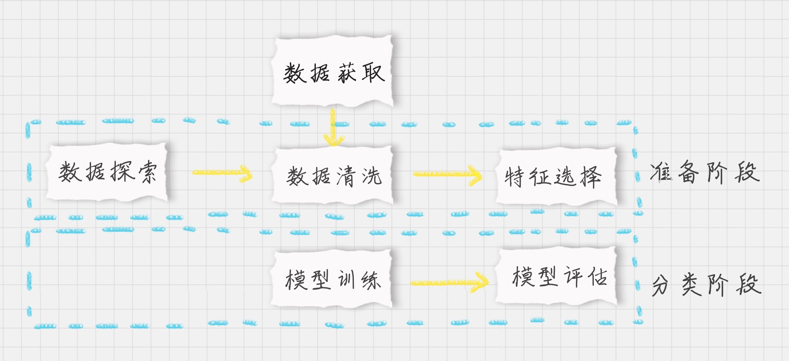
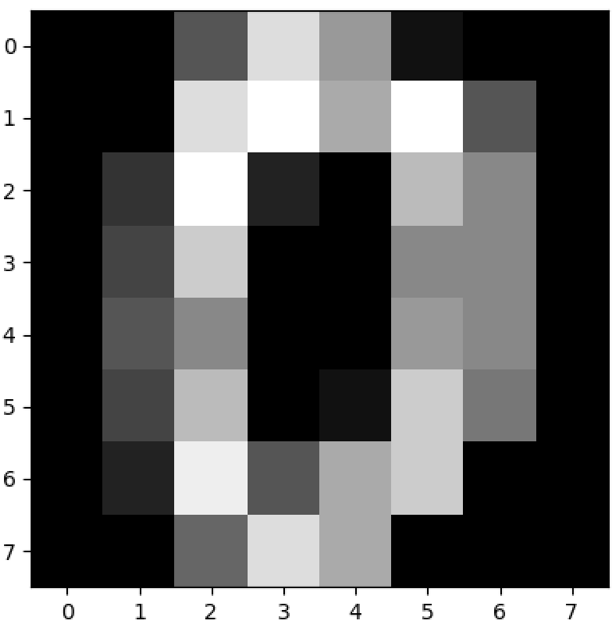
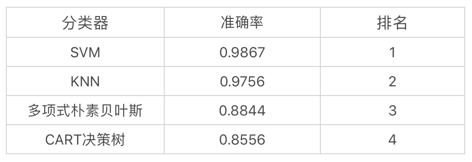

# 25丨KNN（下）：如何对手写数字进行识别？

陈旸 2019-02-08





08:33

讲述：陈旸 大小：7.85M

<audio title="25丨KNN（下）：如何对手写数字进行识别？" src="https://res001.geekbang.org//media/audio/bd/11/bd87b5d9179bfd3740fd19f6b7641b11/ld/ld.m3u8"></audio>

今天我来带你进行 KNN 的实战。上节课，我讲了 KNN 实际上是计算待分类物体与其他物体之间的距离，然后通过统计最近的 K 个邻居的分类情况，来决定这个物体的分类情况。

这节课，我们先看下如何在 sklearn 中使用 KNN 算法，然后通过 sklearn 中自带的手写数字数据集来进行实战。

之前我还讲过 SVM、朴素贝叶斯和决策树分类，我们还可以用这个数据集来做下训练，对比下这四个分类器的训练结果。

## 如何在 sklearn 中使用 KNN

在 Python 的 sklearn 工具包中有 KNN 算法。KNN 既可以做分类器，也可以做回归。如果是做分类，你需要引用：

```

from sklearn.neighbors import KNeighborsClassifier


```

如果是做回归，你需要引用：

```

from sklearn.neighbors import KNeighborsRegressor

 


```

从名字上你也能看出来  Classifier 对应的是分类，Regressor 对应的是回归。一般来说如果一个算法有 Classifier 类，都能找到相应的  Regressor 类。比如在决策树分类中，你可以使用 DecisionTreeClassifier，也可以使用决策树来做回归  DecisionTreeRegressor。

好了，我们看下如何在 sklearn 中创建 KNN 分类器。

这里，我们使用构造函数 KNeighborsClassifier(n_neighbors=5, weights=‘uniform’, algorithm=‘auto’, leaf_size=30)，这里有几个比较主要的参数，我分别来讲解下：

1.n_neighbors：即 KNN 中的 K 值，代表的是邻居的数量。K 值如果比较小，会造成过拟合。如果 K 值比较大，无法将未知物体分类出来。一般我们使用默认值 5。

2.weights：是用来确定邻居的权重，有三种方式：

- weights=uniform，代表所有邻居的权重相同；
- weights=distance，代表权重是距离的倒数，即与距离成反比；
- 自定义函数，你可以自定义不同距离所对应的权重。大部分情况下不需要自己定义函数。

3.algorithm：用来规定计算邻居的方法，它有四种方式：

- algorithm=auto，根据数据的情况自动选择适合的算法，默认情况选择 auto；
- algorithm=kd_tree，也叫作 KD 树，是多维空间的数据结构，方便对关键数据进行检索，不过 KD 树适用于维度少的情况，一般维数不超过 20，如果维数大于 20 之后，效率反而会下降；
- algorithm=ball_tree，也叫作球树，它和 KD 树一样都是多维空间的数据结果，不同于 KD 树，球树更适用于维度大的情况；
- algorithm=brute，也叫作暴力搜索，它和 KD 树不同的地方是在于采用的是线性扫描，而不是通过构造树结构进行快速检索。当训练集大的时候，效率很低。

4.leaf_size：代表构造 KD 树或球树时的叶子数，默认是 30，调整 leaf_size 会影响到树的构造和搜索速度。

创建完  KNN 分类器之后，我们就可以输入训练集对它进行训练，这里我们使用 fit() 函数，传入训练集中的样本特征矩阵和分类标识，会自动得到训练好的  KNN 分类器。然后可以使用 predict() 函数来对结果进行预测，这里传入测试集的特征矩阵，可以得到测试集的预测分类结果。

## 如何用 KNN 对手写数字进行识别分类

手写数字数据集是个非常有名的用于图像识别的数据集。数字识别的过程就是将这些图片与分类结果  0-9 一一对应起来。完整的手写数字数据集 MNIST 里面包括了 60000 个训练样本，以及 10000  个测试样本。如果你学习深度学习的话，MNIST 基本上是你接触的第一个数据集。

今天我们用 sklearn 自带的手写数字数据集做 KNN 分类，你可以把这个数据集理解成一个简版的 MNIST 数据集，它只包括了 1797 幅数字图像，每幅图像大小是 8*8 像素。

好了，我们先来规划下整个 KNN 分类的流程：


 整个训练过程基本上都会包括三个阶段：

1. 数据加载：我们可以直接从 sklearn 中加载自带的手写数字数据集；
2. 准备阶段：在这个阶段中，我们需要对数据集有个初步的了解，比如样本的个数、图像长什么样、识别结果是怎样的。你可以通过可视化的方式来查看图像的呈现。通过数据规范化可以让数据都在同一个数量级的维度。另外，因为训练集是图像，每幅图像是个  8*8 的矩阵，我们不需要对它进行特征选择，将全部的图像数据作为特征值矩阵即可；
3. 分类阶段：通过训练可以得到分类器，然后用测试集进行准确率的计算。

好了，按照上面的步骤，我们一起来实现下这个项目。

首先是加载数据和对数据的探索：

```

# 加载数据

digits = load_digits()

data = digits.data

# 数据探索

print(data.shape)

# 查看第一幅图像

print(digits.images[0])

# 第一幅图像代表的数字含义

print(digits.target[0])

# 将第一幅图像显示出来

plt.gray()

plt.imshow(digits.images[0])

plt.show()


```

运行结果：

```

(1797, 64)

[[ 0.  0.  5. 13.  9.  1.  0.  0.]

 [ 0.  0. 13. 15. 10. 15.  5.  0.]

 [ 0.  3. 15.  2.  0. 11.  8.  0.]

 [ 0.  4. 12.  0.  0.  8.  8.  0.]

 [ 0.  5.  8.  0.  0.  9.  8.  0.]

 [ 0.  4. 11.  0.  1. 12.  7.  0.]

 [ 0.  2. 14.  5. 10. 12.  0.  0.]

 [ 0.  0.  6. 13. 10.  0.  0.  0.]]

0


```


 我们对原始数据集中的第一幅进行数据可视化，可以看到图像是个 8*8 的像素矩阵，上面这幅图像是一个“0”，从训练集的分类标注中我们也可以看到分类标注为“0”。

sklearn  自带的手写数字数据集一共包括了 1797 个样本，每幅图像都是 8*8  像素的矩阵。因为并没有专门的测试集，所以我们需要对数据集做划分，划分成训练集和测试集。因为 KNN  算法和距离定义相关，我们需要对数据进行规范化处理，采用 Z-Score 规范化，代码如下：

```

# 分割数据，将 25% 的数据作为测试集，其余作为训练集（你也可以指定其他比例的数据作为训练集）

train_x, test_x, train_y, test_y = train_test_split(data, digits.target, test_size=0.25, random_state=33)

# 采用 Z-Score 规范化

ss = preprocessing.StandardScaler()

train_ss_x = ss.fit_transform(train_x)

test_ss_x = ss.transform(test_x)


```

然后我们构造一个 KNN 分类器 knn，把训练集的数据传入构造好的 knn，并通过测试集进行结果预测，与测试集的结果进行对比，得到 KNN 分类器准确率，代码如下：

```

# 创建 KNN 分类器

knn = KNeighborsClassifier() 

knn.fit(train_ss_x, train_y) 

predict_y = knn.predict(test_ss_x) 

print("KNN 准确率: %.4lf" % accuracy_score(predict_y, test_y))


```

运行结果：

```

KNN 准确率: 0.9756


```

好了，这样我们就构造好了一个 KNN 分类器。之前我们还讲过 SVM、朴素贝叶斯和决策树分类。我们用手写数字数据集一起来训练下这些分类器，然后对比下哪个分类器的效果更好。代码如下：

```

# 创建 SVM 分类器

svm = SVC()

svm.fit(train_ss_x, train_y)

predict_y=svm.predict(test_ss_x)

print('SVM 准确率: %0.4lf' % accuracy_score(predict_y, test_y))

# 采用 Min-Max 规范化

mm = preprocessing.MinMaxScaler()

train_mm_x = mm.fit_transform(train_x)

test_mm_x = mm.transform(test_x)

# 创建 Naive Bayes 分类器

mnb = MultinomialNB()

mnb.fit(train_mm_x, train_y) 

predict_y = mnb.predict(test_mm_x) 

print(" 多项式朴素贝叶斯准确率: %.4lf" % accuracy_score(predict_y, test_y))

# 创建 CART 决策树分类器

dtc = DecisionTreeClassifier()

dtc.fit(train_mm_x, train_y) 

predict_y = dtc.predict(test_mm_x) 

print("CART 决策树准确率: %.4lf" % accuracy_score(predict_y, test_y))


```

运行结果如下：

```

SVM 准确率: 0.9867

多项式朴素贝叶斯准确率: 0.8844

CART 决策树准确率: 0.8556


```

这里需要注意的是，我们在做多项式朴素贝叶斯分类的时候，传入的数据不能有负数。因为 Z-Score 会将数值规范化为一个标准的正态分布，即均值为 0，方差为 1，数值会包含负数。因此我们需要采用 Min-Max 规范化，将数据规范化到 [0,1] 范围内。

好了，我们整理下这 4 个分类器的结果。


 你能看出来 KNN 的准确率还是不错的，和 SVM 不相上下。

你可以自己跑一遍整个代码，在运行前还需要 import 相关的工具包（下面的这些工具包你都会用到，所以都需要引用）：

```

from sklearn.model_selection import train_test_split

from sklearn import preprocessing

from sklearn.metrics import accuracy_score

from sklearn.datasets import load_digits

from sklearn.neighbors import KNeighborsClassifier

from sklearn.svm import SVC

from sklearn.naive_bayes import MultinomialNB

from sklearn.tree import DecisionTreeClassifier

import matplotlib.pyplot as plt


```

代码中，我使用了  train_test_split 做数据集的拆分，使用 matplotlib.pyplot 工具包显示图像，使用 accuracy_score  进行分类器准确率的计算，使用 preprocessing 中的 StandardScaler 和 MinMaxScaler 做数据的规范化。

完整的代码你可以从[GitHub](https://github.com/cystanford/knn)上下载。

## 总结

今天我带你一起做了手写数字分类识别的实战，分别用   KNN、SVM、朴素贝叶斯和决策树做分类器，并统计了四个分类器的准确率。在这个过程中你应该对数据探索、数据可视化、数据规范化、模型训练和结果评估的使用过程有了一定的体会。在数据量不大的情况下，使用  sklearn 还是方便的。

如果数据量很大，比如 MNIST 数据集中的 6 万个训练数据和 1 万个测试数据，那么采用深度学习 +GPU 运算的方式会更适合。因为深度学习的特点就是需要大量并行的重复计算，GPU 最擅长的就是做大量的并行计算。


 最后留两道思考题吧，请你说说项目中 KNN 分类器的常用构造参数，功能函数都有哪些，以及你对 KNN 使用的理解？如果把 KNN 中的 K 值设置为 200，数据集还是 sklearn 中的手写数字数据集，再跑一遍程序，看看分类器的准确率是多少？

欢迎在评论区与我分享你的答案，也欢迎点击“请朋友读”，把这篇文章分享给你的朋友或者同事。


© 版权归极客邦科技所有，未经许可不得传播售卖。 页面已增加防盗追踪，如有侵权极客邦将依法追究其法律责任。         


夜瓜居士


Ctrl + Enter 发表

0/2000字

提交留言

## 精选留言(20)

- 

  不做键盘侠 

  为什么test只需要使用transform就可以了？test_ss_x = ss.transform(test_x）

  ** 7

  2019-02-08

  编辑回复: 一个很好的问题。我在train的时候用到了：train_ss_x = ss.fit_transform(train_x)
  实际上：fit_transform是fit和transform两个函数都执行一次。所以ss是进行了fit拟合的。只有在fit拟合之后，才能进行transform
  在进行test的时候，我们已经在train的时候fit过了，所以直接transform即可。
  另外，如果我们没有fit，直接进行transform会报错，因为需要先fit拟合，才可以进行transform。

- 

  Ricardo 

  accuracy_score的参数顺序都错了，由于是计算真实标签和预测标签重合个数与总个数的比值，总能得到正确的答案，但是官方文档中写明的正确顺序应该是(y_true,y_pred)

  ** 2

  2019-04-10

- 

  third 

  KNN常用的构造参数
  KNeighborsClassifier(n_neighbors=5,weights='uniform',algorithm='auto',leaf_size=30)
  n_neighbors是邻居的数目

  weights是权重
  uniform是权重相同，求平均值
  distance是根据距离的倒数
  自定义

  algorithm规定邻居的方式
  auto根据数据自动选择
  kd_tree，多维空间的数据结构，一般不超过20维，对关键数据检索很方便
  ball_tree，适用于维度大的
  brute包里搜索，线性扫描

  leaf_size是叶子数

  

  ** 2

  2019-02-18

- 

  FORWARD―MOUNT 

  train_x与train_y都是训练集？

  ** 1

  2019-02-16

  编辑回复: 对 训练集的特征矩阵和分类结果。对应test_x和test_y是测试集的特征矩阵和分类结果。

- 

  JingZ 

  ** 1

  2019-02-15

  编辑回复: 对的K值大未必好

- 

  Lee 

  KNN 中的 K 值设置为 200，KNN 准确率: 0.8489，k值过大，导致部分未知物体没有分类出来，所以准确率下降了

  ** 1

  2019-02-14

- 

  牛奶布丁 

  老师，为什么做多项式朴素贝叶斯分类的时候，传入的数据不能有负数呢，之前老师讲文本分类的时候好像没有提到这一点？

  ** 1

  2019-02-13

  编辑回复: 多项式朴素贝叶斯实际上是符合多项式分布，不会存在负数。而高斯朴素贝叶斯呈现的是高斯分布，也就是正态分布，比如均值为0，方差为1的标准正态分布，可以存在负数。

- 

  张晓辉 

  如果把K设置为200，KNN的准确率会下降到0.84。比之前默认值要差很多。

  from sklearn.neighbors import KNeighborsClassifier
  from sklearn.datasets import load_digits
  from sklearn.preprocessing import StandardScaler
  from sklearn.preprocessing import MinMaxScaler
  import matplotlib.pyplot as plt 
  from sklearn.model_selection import train_test_split
  from sklearn.metrics import accuracy_score
  from sklearn.svm import SVC
  from sklearn.naive_bayes import MultinomialNB
  from sklearn.tree import DecisionTreeClassifier

  digits = load_digits()
  data = digits.data
  train_x, test_x, train_y, test_y = train_test_split(data, digits.target, test_size=0.25, random_state=33)
  ss = StandardScaler()

  train_ss_x = ss.fit_transform(train_x)
  test_ss_x = ss.transform(test_x)

  knn = KNeighborsClassifier()
  knn.fit(train_ss_x, train_y)
  predict_y = knn.predict(test_ss_x)
  print("KNN precision %.4lf" % accuracy_score(predict_y, test_y))

  svm = SVC(gamma='auto')
  svm.fit(train_ss_x, train_y)
  predict_y = svm.predict(test_ss_x)
  print("SVM precision %.4lf" % accuracy_score(predict_y, test_y))

  mm = MinMaxScaler()
  train_mm_x = mm.fit_transform(train_x)
  test_mm_x = mm.transform(test_x)
  mnb = MultinomialNB()
  mnb.fit(train_mm_x, train_y)
  predict_y = mnb.predict(test_mm_x)
  print("MultinomialNB precision %.4lf" % accuracy_score(predict_y, test_y))

  dtc = DecisionTreeClassifier()
  dtc.fit(train_mm_x, train_y)
  predict_y = dtc.predict(test_mm_x)
  print("DecisionTree precision %.4lf" % accuracy_score(predict_y, test_y))

  ** 

  2019-05-21

- 

  滢 

  老师，想问个问题，KNeighborsClassifier的默认k值为5，我们可以给其设置默认k值。在上一节中讲到K值的选取用交叉验证，如果用sklearn实现的话，我们需要给KNeighborsClassifier设定不同的k值来寻找最优K值吗？

  ** 

  2019-04-18

- 

  滢 

  用代码计算来以下准确率：
  knn默认k值为5 准确率:0.9756
  knn的k值为200的准确率:0.8489
  SVM分类准确率:0.9867
  高斯朴素贝叶斯准确率:0.8111
  多项式朴素贝叶斯分类器准确率:0.8844
  CART决策树准确率:0.8400

  K值的选取如果过大，正确率降低。 
  算法效率排行 SVM > KNN(k值在合适范围内) >多项式朴素贝叶斯 > CART > 高斯朴素贝叶斯

  ** 

  2019-04-18

- 

  XP@培新 

  请教老师一个可能很“外行”的问题，KNN分类器训练输出到底是什么？ 感觉直接算不就可以了吗？ 谢谢

  ** 

  2019-04-15

- 

  周飞 

  如果把 KNN 中的 K 值设置为 200 ,那么准确率是 0.8489

  ** 

  2019-04-14

- 

  周飞 

  knn分类器的常用构造参数有：
  1.n_neighbors  代表邻居的数量。
  2.weights： 代表所有邻居的权重，其中 uniform 代表所有邻居权重相同， distance  代表权重是距离的倒数。还可以自定义。
  3.algorithm: 计算邻居的方法，auto代表 根据数据的情况自动选择，kd_tree 是kd树，适用于维数不超过20的情况。ball_tree是球树，可以用于维度更大的情况。brute 是暴力搜索。
  4.leaf_size:是kd树或者球树的叶子数量，默认是20.

  ** 

  2019-04-13

- 

  滨滨 

  knn算法就是说，邻居大多数是什么你就是什么。
  n_neighbors是邻居的数目

  weights是权重
  uniform是权重相同，求平均值
  distance是根据距离的倒数
  自定义

  algorithm规定邻居选择的方式
  auto根据数据自动选择
  kd_tree，类似平衡二叉树，提高查找效率，多维空间的数据结构，一般不超过20维，对关键数据检索很方便
  ball_tree，适用于维度大的
  brute 暴力搜索，线性扫描

  leaf_size是叶子数

  k为200的时候准确率降低。
  多项式分布没有负数，高斯分布可以有负数。

  ** 

  2019-03-30

- 

  叮当猫 

  ** 

  2019-03-17

- 

  fancy 

  \1. KNN分类器的常用构造参数：
  n_neighbors := k = 5(默认下)
  weights = 'uniform'/'distance'/自定义函数
  algorithm='auto'/'ball_tree'/'kd_tree'/'brute'
  leaf_size
  \2. 功能函数
  fit(train_x,train_y)--训练分类器
  predict(test_x)--用分类器预测测试集
  3.改变K值
  当k=200时，预测结果的准确性从97%左右下降到了84.89%

  ** 

  2019-03-03

- 

  mickey 

  ** 

  2019-02-27

- 

  Destroy、 

  from sklearn.metrics import accuracy_score
  \# 创建KNN分类器
  knn = KNeighborsClassifier(n_neighbors=200)
  knn.fit(train_ss_x, train_y)
  predict_y = knn.predict(test_ss_x)
  print('KNN准确率：%.4lf' % accuracy_score(predict_y, test_y))

  KNN准确率：0.8489

  ** 

  2019-02-22

- 

  王彬成 

  1、项目中 KNN 分类器的常用构造参数，功能函数都有哪些
  1）n_neighbors：即 KNN 中的 K 值，代表的是邻居的数量。
  2）weights：是用来确定邻居的权重，有三种方式：
  weights=uniform，代表所有邻居的权重相同；
  weights=distance，代表权重是距离的倒数，即与距离成反比；
  自定义函数，你可以自定义不同距离所对应的权重。大部分情况下不需要自己定义函数。
  3）algorithm：用来规定计算邻居的方法，它有四种方式：
  algorithm=auto，根据数据的情况自动选择适合的算法，默认情况选择 auto；
  algorithm=kd_tree，也叫作 KD 树，适用于维度少的情况
  algorithm=ball_tree，也叫作球树，球树更适用于维度大的情况；
  algorithm=brute，也叫作暴力搜索，它和 KD 树不同的地方是在于采用的是线性扫描，而不是通过构造树结构进行快速检索。
  4）leaf_size：代表构造 KD 树或球树时的叶子数，默认是 30，调整 leaf_size 会影响到树的构造和搜索速度。

  2、KNN使用过程分为3步
  \1. 数据加载：我们可以直接从 sklearn 中加载自带的手写数字数据集；
  \2. 准备阶段：需要对数据集有个初步的了解，比如样本的个数、图像长什么样、识别结果是怎样的。你可以通过可视化的方式来查看图像的呈现。通过数据规范化可以让数据都在同一个数量级的维度。
  \3. 分类阶段：通过训练可以得到分类器，然后用测试集进行准确率的计算。

  3、如果把 KNN 中的 K 值设置为 200，数据集还是 sklearn 中的手写数字数据集，再跑一遍程序，看看分类器的准确率是多少？
  在创建KNN分类器的代码：
  knn=KNeighborsClassifier(n_neighbors=200)
  KNN 准确率：0.8489

  ** 

  2019-02-22

- 

  从未在此 

  那个标准化函数已经在训练集上拟合并产生了平均值和标准差。所以测试集用同样的标准直接拿来用就行了

  ** 

  2019-02-12