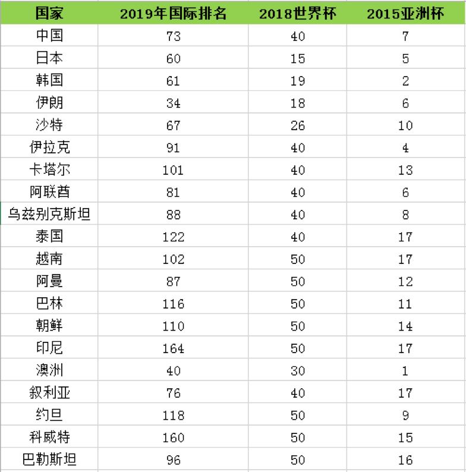
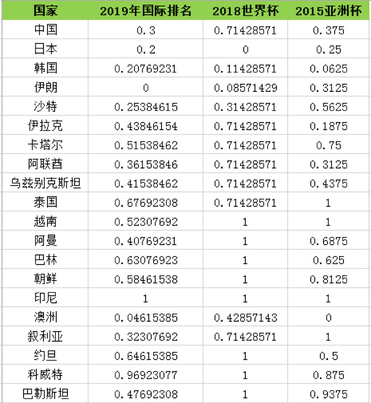
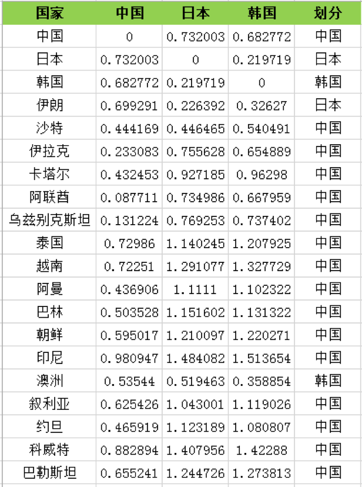
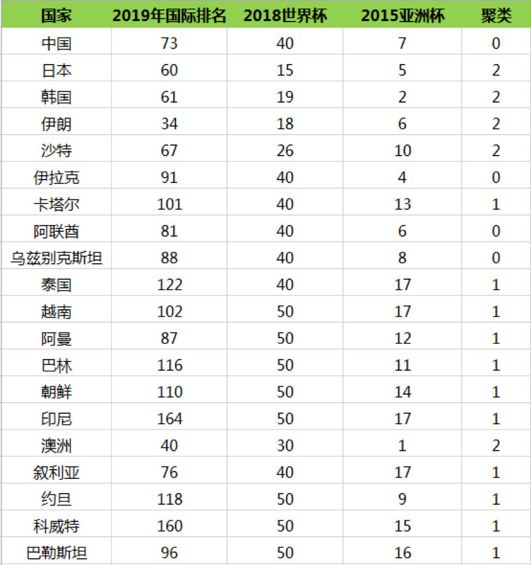

# 26丨K-Means（上）：如何给20支亚洲球队做聚类？

陈旸 2019-02-11





10:08

讲述：陈旸 大小：9.29M

<audio title="26丨K-Means（上）：如何给20支亚洲球队做聚类？" src="https://res001.geekbang.org//media/audio/bc/86/bc32d39df47bfa5cc044cd9c2a778886/ld/ld.m3u8"></audio>

今天我来带你进行 K-Means 的学习。K-Means 是一种非监督学习，解决的是聚类问题。K 代表的是 K 类，Means 代表的是中心，你可以理解这个算法的本质是确定 K 类的中心点，当你找到了这些中心点，也就完成了聚类。

那么请你和我思考以下三个问题：

- 如何确定 K 类的中心点？
- 如何将其他点划分到 K 类中？
- 如何区分 K-Means 与 KNN？

如果理解了上面这 3 个问题，那么对 K-Means 的原理掌握得也就差不多了。

先请你和我思考一个场景，假设我有 20 支亚洲足球队，想要将它们按照成绩划分成 3 个等级，可以怎样划分？

## K-Means 的工作原理

对亚洲足球队的水平，你可能也有自己的判断。比如一流的亚洲球队有谁？你可能会说伊朗或韩国。二流的亚洲球队呢？你可能说是中国。三流的亚洲球队呢？你可能会说越南。

其实这些都是靠我们的经验来划分的，那么伊朗、中国、越南可以说是三个等级的典型代表，也就是我们每个类的中心点。

所以回过头来，如何确定 K 类的中心点？一开始我们是可以随机指派的，当你确认了中心点后，就可以按照距离将其他足球队划分到不同的类别中。

这也就是  K-Means  的中心思想，就是这么简单直接。你可能会问：如果一开始，选择一流球队是中国，二流球队是伊朗，三流球队是韩国，中心点选择错了怎么办？其实不用担心，K-Means  有自我纠正机制，在不断的迭代过程中，会纠正中心点。中心点在整个迭代过程中，并不是唯一的，只是你需要一个初始值，一般算法会随机设置初始的中心点。

好了，那我来把 K-Means 的工作原理给你总结下：

1. 选取 K 个点作为初始的类中心点，这些点一般都是从数据集中随机抽取的；
2. 将每个点分配到最近的类中心点，这样就形成了 K 个类，然后重新计算每个类的中心点；
3. 重复第二步，直到类不发生变化，或者你也可以设置最大迭代次数，这样即使类中心点发生变化，但是只要达到最大迭代次数就会结束。

## 如何给亚洲球队做聚类

对于机器来说需要数据才能判断类中心点，所以我整理了 2015-2019 年亚洲球队的排名，如下表所示。

我来说明一下数据概况。

其中  2019 年国际足联的世界排名，2015 年亚洲杯排名均为实际排名。2018  年世界杯中，很多球队没有进入到决赛圈，所以只有进入到决赛圈的球队才有实际的排名。如果是亚洲区预选赛 12 强的球队，排名会设置为  40。如果没有进入亚洲区预选赛 12 强，球队排名会设置为 50。


 针对上面的排名，我们首先需要做的是数据规范化。你可以把这些值划分到 [0,1] 或者按照均值为 0，方差为 1 的正态分布进行规范化。具体数据规范化的步骤可以看下 13 篇，也就是[数据变换](https://time.geekbang.org/column/article/77059)那一篇。

我先把数值都规范化到 [0,1] 的空间中，得到了以下的数值表：


 如果我们随机选取中国、日本、韩国为三个类的中心点，我们就需要看下这些球队到中心点的距离。

距离有多种计算的方式，有关距离的计算我在 KNN 算法中也讲到过：

- 欧氏距离
- 曼哈顿距离
- 切比雪夫距离
- 余弦距离

欧氏距离是最常用的距离计算方式，这里我选择欧氏距离作为距离的标准，计算每个队伍分别到中国、日本、韩国的距离，然后根据距离远近来划分。我们看到大部分的队，会和中国队聚类到一起。这里我整理了距离的计算过程，比如中国和中国的欧氏距离为  0，中国和日本的欧式距离为 0.732003。如果按照中国、日本、韩国为 3 个分类的中心点，欧氏距离的计算结果如下表所示：


 然后我们再重新计算这三个类的中心点，如何计算呢？最简单的方式就是取平均值，然后根据新的中心点按照距离远近重新分配球队的分类，再根据球队的分类更新中心点的位置。计算过程这里不展开，最后一直迭代（重复上述的计算过程：计算中心点和划分分类）到分类不再发生变化，可以得到以下的分类结果：


 所以我们能看出来第一梯队有日本、韩国、伊朗、沙特、澳洲；第二梯队有中国、伊拉克、阿联酋、乌兹别克斯坦；第三梯队有卡塔尔、泰国、越南、阿曼、巴林、朝鲜、印尼、叙利亚、约旦、科威特和巴勒斯坦。

## 如何使用 sklearn 中的 K-Means 算法

sklearn 是 Python 的机器学习工具库，如果从功能上来划分，sklearn 可以实现分类、聚类、回归、降维、模型选择和预处理等功能。这里我们使用的是 sklearn 的聚类函数库，因此需要引用工具包，具体代码如下：

```

from sklearn.cluster import KMeans


```

当然  K-Means 只是 sklearn.cluster 中的一个聚类库，实际上包括 K-Means 在内，sklearn.cluster  一共提供了 9 种聚类方法，比如 Mean-shift，DBSCAN，Spectral clustering（谱聚类）等。这些聚类方法的原理和  K-Means 不同，这里不做介绍。

我们看下 K-Means 如何创建：

```

KMeans(n_clusters=8, init='k-means++', n_init=10, max_iter=300, tol=0.0001, precompute_distances='auto', verbose=0, random_state=None, copy_x=True, n_jobs=1, algorithm='auto')


```

我们能看到在 K-Means 类创建的过程中，有一些主要的参数：

- **n_clusters**: 即 K 值，一般需要多试一些 K 值来保证更好的聚类效果。你可以随机设置一些 K 值，然后选择聚类效果最好的作为最终的 K 值；
- **max_iter**： 最大迭代次数，如果聚类很难收敛的话，设置最大迭代次数可以让我们及时得到反馈结果，否则程序运行时间会非常长；
- **n_init**：初始化中心点的运算次数，默认是  10。程序是否能快速收敛和中心点的选择关系非常大，所以在中心点选择上多花一些时间，来争取整体时间上的快速收敛还是非常值得的。由于每一次中心点都是随机生成的，这样得到的结果就有好有坏，非常不确定，所以要运行  n_init 次, 取其中最好的作为初始的中心点。如果 K 值比较大的时候，你可以适当增大 n_init 这个值；
- **init：** 即初始值选择的方式，默认是采用优化过的 k-means++  方式，你也可以自己指定中心点，或者采用 random 完全随机的方式。自己设置中心点一般是对于个性化的数据进行设置，很少采用。random  的方式则是完全随机的方式，一般推荐采用优化过的 k-means++ 方式；
- **algorithm**：k-means 的实现算法，有“auto”  “full”“elkan”三种。一般来说建议直接用默认的"auto"。简单说下这三个取值的区别，如果你选择"full"采用的是传统的  K-Means 算法，“auto”会根据数据的特点自动选择是选择“full”还是“elkan”。我们一般选择默认的取值，即“auto” 。

在创建好 K-Means 类之后，就可以使用它的方法，最常用的是 fit 和 predict 这个两个函数。你可以单独使用  fit 函数和 predict 函数，也可以合并使用 fit_predict 函数。其中 fit(data) 可以对 data 数据进行  k-Means 聚类。 predict(data) 可以针对 data 中的每个样本，计算最近的类。

现在我们要完整地跑一遍 20 支亚洲球队的聚类问题。我把数据上传到了[GitHub](https://github.com/cystanford/kmeans)上，你可以自行下载。

```

# coding: utf-8

from sklearn.cluster import KMeans

from sklearn import preprocessing

import pandas as pd

import numpy as np

# 输入数据

data = pd.read_csv('data.csv', encoding='gbk')

train_x = data[["2019 年国际排名 ","2018 世界杯 ","2015 亚洲杯 "]]

df = pd.DataFrame(train_x)

kmeans = KMeans(n_clusters=3)

# 规范化到 [0,1] 空间

min_max_scaler=preprocessing.MinMaxScaler()

train_x=min_max_scaler.fit_transform(train_x)

# kmeans 算法

kmeans.fit(train_x)

predict_y = kmeans.predict(train_x)

# 合并聚类结果，插入到原数据中

result = pd.concat((data,pd.DataFrame(predict_y)),axis=1)

result.rename({0:u'聚类'},axis=1,inplace=True)

print(result)


```

运行结果：

```

国家  2019 年国际排名  2018 世界杯  2015 亚洲杯  聚类

0       中国         73       40        7   2

1       日本         60       15        5   0

2       韩国         61       19        2   0

3       伊朗         34       18        6   0

4       沙特         67       26       10   0

5      伊拉克         91       40        4   2

6      卡塔尔        101       40       13   1

7      阿联酋         81       40        6   2

8   乌兹别克斯坦         88       40        8   2

9       泰国        122       40       17   1

10      越南        102       50       17   1

11      阿曼         87       50       12   1

12      巴林        116       50       11   1

13      朝鲜        110       50       14   1

14      印尼        164       50       17   1

15      澳洲         40       30        1   0

16     叙利亚         76       40       17   1

17      约旦        118       50        9   1

18     科威特        160       50       15   1

19    巴勒斯坦         96       50       16   1


```

## 总结

今天我给你讲了 K-Means 算法原理，我们再来看下开篇我给你提的三个问题。

如何确定 K 类的中心点？其中包括了初始的设置，以及中间迭代过程中中心点的计算。在初始设置中，会进行 n_init 次的选择，然后选择初始中心点效果最好的为初始值。在每次分类更新后，你都需要重新确认每一类的中心点，一般采用均值的方式进行确认。

如何将其他点划分到 K 类中？这里实际上是关于距离的定义，我们知道距离有多种定义的方式，在 K-Means 和 KNN 中，我们都可以采用欧氏距离、曼哈顿距离、切比雪夫距离、余弦距离等。对于点的划分，就看它离哪个类的中心点的距离最近，就属于哪一类。

如何区分 K-Means 和 KNN 这两种算法呢？刚学过 K-Means 和 KNN 算法的同学应该能知道两者的区别，但往往过了一段时间，就容易混淆。所以我们可以从三个维度来区分 K-Means 和 KNN 这两个算法：

- 首先，这两个算法解决数据挖掘的两类问题。K-Means 是聚类算法，KNN 是分类算法。
- 这两个算法分别是两种不同的学习方式。K-Means 是非监督学习，也就是不需要事先给出分类标签，而 KNN 是有监督学习，需要我们给出训练数据的分类标识。
- 最后，K 值的含义不同。K-Means 中的 K 值代表 K 类。KNN 中的 K 值代表 K 个最接近的邻居。


 那么学完了今天的内容后，你能说一下 K-Means 的算法原理吗？如果我们把上面的 20 支亚洲球队用 K-Means 划分成 5 类，在规范化数据的时候采用标准化的方式（即均值为 0，方差为 1），该如何编写程序呢？运行的结果又是如何？

欢迎你在评论区与我分享你的答案，也欢迎点击“请朋友读”，把这篇文章分享给你的朋友或者同事。


© 版权归极客邦科技所有，未经许可不得传播售卖。 页面已增加防盗追踪，如有侵权极客邦将依法追究其法律责任。         


夜瓜居士


Ctrl + Enter 发表

0/2000字

提交留言

## 精选留言(26)

- 

  Lee 置顶

  ** 3

  2019-02-14

  编辑回复: 正确

- 

  third 置顶

  ** 2

  2019-02-19

  编辑回复: 举例很生动，代码也正确。大家可以看下。

- 

  iamtalent123 

  老师，请问为什么要对train_x转化为datadframe格式呢？df=pd.DataFrame(train_x)，df有什么用呢？

  ** 2

  2019-03-05

- 

  白夜 

  然后我们再重新计算这三个类的中心点，如何计算呢？最简单的方式就是取平均值，然后根据新的中心点按照距离远近重新分配球队的分类，再根据球队的分类更新中心点的位置。计算过程这里不展开，最后一直迭代（重复上述的计算过程：计算中心点和划分分类）到分类不再发生变化。

  老师，这段可以再解释一下吗？没计算过程不太理解

  ** 2

  2019-02-15

  编辑回复:   同一个类别下的平均值。比如都属于同一个类别里面有10个点，那么新的中心点就是这10个点的中心点，一种简单的方式就是取平均值。比如我在文章里举了足球队的例子，一共有3个指标，每个球队都有这三个指标的特征值，那么新的中心点，就是取这个类别中的这些点  这三个指标特征值的平均值。。

- 

  听妈妈的话 

  代码里的第八行应该去掉列名里的空格：
  train_x = data[['2019年国际排名','2018世界杯','2015亚洲杯']]
  Z-score标准化的代码：train_x=preprocessing.scale(train_x)

  国家	2019年国际排名	2018世界杯	2015亚洲杯	聚类
  0	中国	73	40	7	3
  1	日本	60	15	5	1
  2	韩国	61	19	2	1
  3	伊朗	34	18	6	1
  4	沙特	67	26	10	1
  5	伊拉克	91	40	4	3
  6	卡塔尔	101	40	13	0
  7	阿联酋	81	40	6	3
  8	乌兹别克斯坦	88	40	8	3
  9	泰国	122	40	17	4
  10	越南	102	50	17	4
  11	阿曼	87	50	12	0
  12	巴林	116	50	11	0
  13	朝鲜	110	50	14	0
  14	印尼	164	50	17	2
  15	澳洲	40	30	1	1
  16	叙利亚	76	40	17	4
  17	约旦	118	50	9	0
  18	科威特	160	50	15	2
  19	巴勒斯坦	96	50	16	4

  ** 1

  2019-03-22

- 

  FORWARD―MOUNT 

  如何调整聚类中心没听懂

  ** 1

  2019-02-18

  编辑回复: 取特征值的平均值为中心点。

- 

  张晓辉 

  \#coding:utf-8
  from sklearn.cluster import KMeans
  from sklearn import preprocessing
  import pandas as pd 
  import numpy as np

  data = pd.read_csv('data.csv', encoding='utf-8')
  train_x = data[["2019年国际排名", "2018世界杯", "2015亚洲杯"]]
  df = pd.DataFrame(train_x)
  kmeans = KMeans(n_clusters=5)
  std = preprocessing.StandardScaler()
  \#min_max_scaler = preprocessing.MinMaxScaler()
  \#train_x = min_max_scaler.fit_transform(train_x)
  train_x = std.fit_transform(train_x)
  kmeans.fit(train_x)
  predict_y = kmeans.predict(train_x)
  result = pd.concat((data, pd.DataFrame(predict_y)), axis=1)
  result.rename({0:u'聚类'}, axis=1, inplace=True)
  print(result)

  ** 

  2019-05-23

- 

  Frederick 

  老师，我想问下，决策树可以用来聚类吗，如果可以，要怎么做呢？

  ** 

  2019-05-19

- 

  Sam.张朝 

  运行一次，结果变化一次。

  ** 

  2019-05-09

- 

  Sam.张朝 

  文章里的代码也好，问题的解决代码也好，中国都会在0 和2 之间变化。运行一次，变化一次。

  ** 

  2019-05-09

- 

  Aries 

  老师，怎么更换距离计算方法

  ** 

  2019-04-27

- 

  滢 

  老师，想问个问题，为何我计算出来的结果正好相反，就是后面聚类生成的0、1、2 这些数据，最弱的队归位来0类，一流队归类来2类，看留言里的代码大家计算出来的结果也不尽相同，想问下老师，是不是K-Means结果只是起到聚类的效果，没有展示其它属性的效果

  ** 

  2019-04-19

- 

  周飞 

  ** 

  2019-04-14

- 

  周飞 

  k-means的算法原理就是：
  1.选择几个初始的中心点。
  2.计算每个点到各个中心点的距离，然后把每个点划分到距离最近的中心点所在的类。
  3.更新中心点的值。对于每个类，计算类中所有数据的平均值，把平均值作为新的中心点。
  4.重复 2 和4 步骤，直到每个类中的数据不再变化，或者到达指定的迭代步数。

  ** 

  2019-04-14

- 

  滨滨 

  Kmeans开班，选老大，风水轮流转，直到选出最佳中心老大
  Knn小弟加队伍，离那个班相对近，就是那个班的

  一群人的有些人想要聚在一起
  首先大家民主（无监督学习）随机选K个老大（随机选择K个中心点）
  谁跟谁近，就是那个队伍的人（计算距离，距离近的聚合到一块）
  随着时间的推移，老大的位置在变化（根据算法，重新计算中心点）
  直到选出真正的中心老大（重复，直到准确率最高）

  Knn
  一个人想要找到自己的队伍
  首先听从神的旨意（有监督学习），随机最近的几个邻居
  看看距离远不远（根据算法，计算距离）
  近的就是一个班的了（属于哪个分类多，就是哪一类）

  ** 

  2019-03-31

- 

  跳跳 

  ** 

  2019-03-06

- 

  fancy 

  ** 

  2019-03-04

- 

  mickey 

  ** 

  2019-02-28

- 

  JingZ 

  import numpy as np 这行代码不需要吧~感觉没用到

  ** 

  2019-02-26

- 

  liyooo 

  眼界大开！

  ** 

  2019-02-25