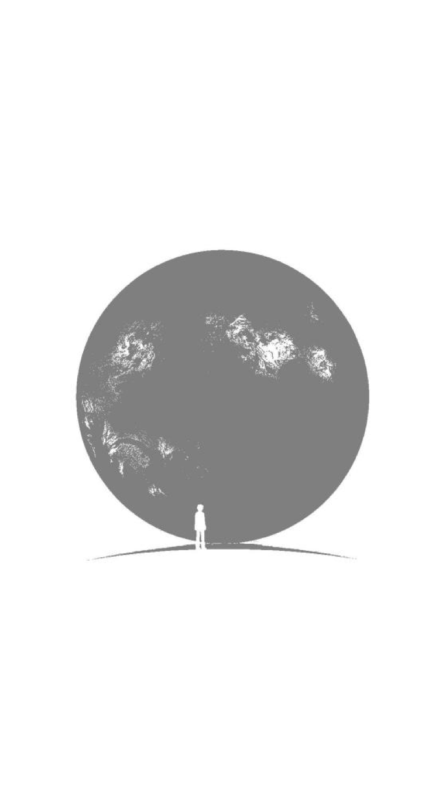
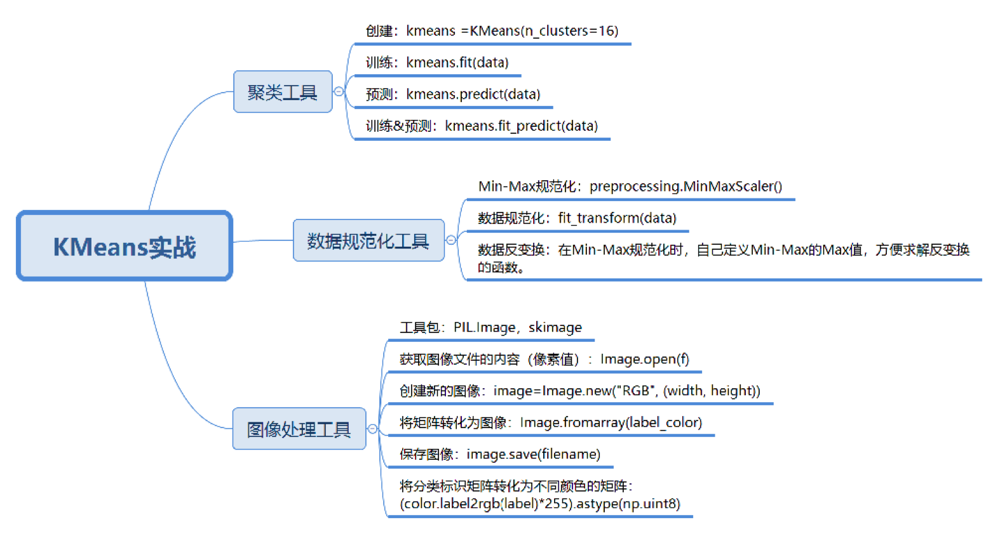

# 27丨K-Means（下）：如何使用K-Means对图像进行分割？

陈旸 2019-02-13





08:49

讲述：陈旸 大小：8.09M

<audio title="27丨K-Means（下）：如何使用K-Means对图像进行分割？" src="https://res001.geekbang.org//media/audio/68/32/68974aaf0975c8e01c9dab7897c2a732/ld/ld.m3u8"></audio>

上节课，我讲解了 K-Means 的原理，并且用 K-Means 对 20 支亚洲球队进行了聚类，分成 3 个梯队。今天我们继续用 K-Means 进行聚类的实战。聚类的一个常用场景就是对图像进行分割。

图像分割就是利用图像自身的信息，比如颜色、纹理、形状等特征进行划分，将图像分割成不同的区域，划分出来的每个区域就相当于是对图像中的像素进行了聚类。单个区域内的像素之间的相似度大，不同区域间的像素差异性大。这个特性正好符合聚类的特性，所以你可以把图像分割看成是将图像中的信息进行聚类。当然聚类只是分割图像的一种方式，除了聚类，我们还可以基于图像颜色的阈值进行分割，或者基于图像边缘的信息进行分割等。

## 将微信开屏封面进行分割

上节课，我讲了 sklearn 工具包中的 K-Means 算法使用，我们现在用 K-Means 算法对微信页面进行分割。微信开屏图如下所示：


 我们先设定下聚类的流程，聚类的流程和分类差不多，如图所示：


 在准备阶段里，我们需要对数据进行加载。因为处理的是图像信息，我们除了要获取图像数据以外，还需要获取图像的尺寸和通道数，然后基于图像中每个通道的数值进行数据规范化。这里我们需要定义个函数 load_data，来帮我们进行图像加载和数据规范化。代码如下：

```

# 加载图像，并对数据进行规范化

def load_data(filePath):

    # 读文件

    f = open(filePath,'rb')

    data = []

    # 得到图像的像素值

    img = image.open(f)

    # 得到图像尺寸

    width, height = img.size

    for x in range(width):

        for y in range(height):

            # 得到点 (x,y) 的三个通道值

            c1, c2, c3 = img.getpixel((x, y))

            data.append([c1, c2, c3])

    f.close()

    # 采用 Min-Max 规范化

    mm = preprocessing.MinMaxScaler()

    data = mm.fit_transform(data)

    return np.mat(data), width, height


```

因为 jpg 格式的图像是三个通道 (R,G,B)，也就是一个像素点具有 3 个特征值。这里我们用 c1、c2、c3 来获取平面坐标点 (x,y) 的三个特征值，特征值是在 0-255 之间。

为了加快聚类的收敛，我们需要采用  Min-Max 规范化对数据进行规范化。我们定义的 load_data 函数返回的结果包括了针对 (R,G,B)  三个通道规范化的数据，以及图像的尺寸信息。在定义好 load_data 函数后，我们直接调用就可以得到相关信息，代码如下：

```

# 加载图像，得到规范化的结果 img，以及图像尺寸

img, width, height = load_data('./weixin.jpg')


```

假设我们想要对图像分割成 2 部分，在聚类阶段，我们可以将聚类数设置为 2，这样图像就自动聚成 2 类。代码如下：

```

# 用 K-Means 对图像进行 2 聚类

kmeans =KMeans(n_clusters=2)

kmeans.fit(img)

label = kmeans.predict(img)

# 将图像聚类结果，转化成图像尺寸的矩阵

label = label.reshape([width, height])

# 创建个新图像 pic_mark，用来保存图像聚类的结果，并设置不同的灰度值

pic_mark = image.new("L", (width, height))

for x in range(width):

    for y in range(height):

        # 根据类别设置图像灰度, 类别 0 灰度值为 255， 类别 1 灰度值为 127

        pic_mark.putpixel((x, y), int(256/(label[x][y]+1))-1)

pic_mark.save("weixin_mark.jpg", "JPEG")


```

代码中有一些参数，我来给你讲解一下这些参数的作用和设置方法。

我们使用了  fit 和 predict 这两个函数来做数据的训练拟合和预测，因为传入的参数是一样的，我们可以同时进行 fit 和 predict  操作，这样我们可以直接使用 fit_predict(data) 得到聚类的结果。得到聚类的结果 label  后，实际上是一个一维的向量，我们需要把它转化成图像尺寸的矩阵。label 的聚类结果是从 0 开始统计的，当聚类数为 2 的时候，聚类的标识  label=0 或者 1。

如果你想对图像聚类的结果进行可视化，直接看 0 和 1 是看不出来的，还需要将 0 和 1  转化为灰度值。灰度值一般是在 0-255 的范围内，我们可以将 label=0 设定为灰度值 255，label=1 设定为灰度值  127。具体方法是用 int(256/(label[x][y]+1))-1。可视化的时候，主要是通过设置图像的灰度值进行显示。所以我们把聚类  label=0 的像素点都统一设置灰度值为 255，把聚类 label=1 的像素点都统一设置灰度值为 127。原来图像的灰度值是在 0-255  之间，现在就只有 2 种颜色（也就是灰度为 255，和灰度 127）。

有了这些灰度信息，我们就可以用 image.new 创建一个新的图像，用 putpixel 函数对新图像的点进行灰度值的设置，最后用 save 函数保存聚类的灰度图像。这样你就可以看到聚类的可视化结果了，如下图所示：


 上面是分割成 2 个部分的分割可视化，完整代码见[这里](https://github.com/cystanford/kmeans/blob/master/kmeans1.py)。

<https://github.com/cystanford/kmeans/blob/master/kmeans1.py>

如果我们想要分割成 16 个部分，该如何对不同分类设置不同的颜色值呢？这里需要用到 skimage 工具包，它是图像处理工具包。你需要使用 pip install scikit-image 来进行安装。

这段代码可以将聚类标识矩阵转化为不同颜色的矩阵：

```

from skimage import color

# 将聚类标识矩阵转化为不同颜色的矩阵

label_color = (color.label2rgb(label)*255).astype(np.uint8)

label_color = label_color.transpose(1,0,2)

images = image.fromarray(label_color)

images.save('weixin_mark_color.jpg')


```

代码中，我使用  skimage 中的 label2rgb 函数来将 label 分类标识转化为颜色数值，因为我们的颜色值范围是 [0,255]，所以还需要乘以  255 进行转化，最后再转化为 np.uint8 类型。unit8 类型代表无符号整数，范围是 0-255 之间。

得到颜色矩阵后，你可以把它输出出来，这时你发现输出的图像是颠倒的，原因可能是图像源拍摄的时候本身是倒置的。我们需要设置三维矩阵的转置，让第一维和第二维颠倒过来，也就是使用  transpose(1,0,2)，将原来的 (0,1,2）顺序转化为 (1,0,2) 顺序，即第一维和第二维互换。

最后我们使用 fromarray 函数，它可以通过矩阵来生成图片，并使用 save 进行保存。

最后得到的分类标识颜色化图像是这样的：


 完整的代码见[这里](https://github.com/cystanford/kmeans/blob/master/kmeans2.py)。

<https://github.com/cystanford/kmeans/blob/master/kmeans2.py>

刚才我们做的是聚类的可视化。如果我们想要看到对应的原图，可以将每个簇（即每个类别）的点的 RGB 值设置为该簇质心点的 RGB 值，也就是簇内的点的特征均为质心点的特征。

我给出了完整的代码，代码中，我可以把范围为 0-255 的数值投射到 1-256 数值之间，方法是对每个数值进行加 1，你可以自己来运行下：

```

# -*- coding: utf-8 -*-

# 使用 K-means 对图像进行聚类，并显示聚类压缩后的图像

import numpy as np

import PIL.Image as image

from sklearn.cluster import KMeans

from sklearn import preprocessing

import matplotlib.image as mpimg

# 加载图像，并对数据进行规范化

def load_data(filePath):

    # 读文件

    f = open(filePath,'rb')

    data = []

    # 得到图像的像素值

    img = image.open(f)

    # 得到图像尺寸

    width, height = img.size

    for x in range(width):

        for y in range(height):

            # 得到点 (x,y) 的三个通道值

            c1, c2, c3 = img.getpixel((x, y))

            data.append([(c1+1)/256.0, (c2+1)/256.0, (c3+1)/256.0])

    f.close()

    return np.mat(data), width, height

# 加载图像，得到规范化的结果 imgData，以及图像尺寸

img, width, height = load_data('./weixin.jpg')

# 用 K-Means 对图像进行 16 聚类

kmeans =KMeans(n_clusters=16)

label = kmeans.fit_predict(img)

# 将图像聚类结果，转化成图像尺寸的矩阵

label = label.reshape([width, height])

# 创建个新图像 img，用来保存图像聚类压缩后的结果

img=image.new('RGB', (width, height))

for x in range(width):

    for y in range(height):

        c1 = kmeans.cluster_centers_[label[x, y], 0]

        c2 = kmeans.cluster_centers_[label[x, y], 1]

        c3 = kmeans.cluster_centers_[label[x, y], 2]

        img.putpixel((x, y), (int(c1*256)-1, int(c2*256)-1, int(c3*256)-1))

img.save('weixin_new.jpg')


```

完整代码见[这里](https://github.com/cystanford/kmeans/blob/master/kmeans3.py)。

<https://github.com/cystanford/kmeans/blob/master/kmeans3.py>

你可以看到我没有用到  sklearn 自带的 MinMaxScaler，而是自己写了 Min-Max 规范化的公式。这样做的原因是我们知道 RGB 每个通道的数值在  [0,255] 之间，所以我们可以用每个通道的数值 +1/256，这样数值就会在 [0,1] 之间。

对图像做了 Min-Max 空间变换之后，还可以对其进行反变换，还原出对应原图的通道值。

对于点 (x,y)，我们找到它们所属的簇 label[x,y]，然后得到这个簇的质心特征，用 c1,c2,c3 表示：

```

c1 = kmeans.cluster_centers_[label[x, y], 0]

c2 = kmeans.cluster_centers_[label[x, y], 1]

c3 = kmeans.cluster_centers_[label[x, y], 2]


```

因为 c1, c2, c3 对应的是数据规范化的数值，因此我们还需要进行反变换，即：

```

c1=int(c1*256)-1

c2=int(c2*256)-1

c3=int(c3*256)-1


```

然后用 img.putpixel 设置点 (x,y) 反变换后得到的特征值。最后用 img.save 保存图像。

## 总结

今天我们用 K-Means 做了图像的分割，其实不难发现 K-Means 聚类有个缺陷：聚类个数 K 值需要事先指定。如果你不知道该聚成几类，那么最好会给 K 值多设置几个，然后选择聚类结果最好的那个值。

通过今天的图像分割，你发现用 K-Means 计算的过程在 sklearn 中就是几行代码，大部分的工作还是在预处理和后处理上。预处理是将图像进行加载，数据规范化。后处理是对聚类后的结果进行反变换。

如果涉及到后处理，你可以自己来设定数据规范化的函数，这样反变换的函数比较容易编写。

另外我们还学习了如何在 Python 中如何对图像进行读写，具体的代码如下，上文中也有相应代码，你也可以自己对应下：

```

import PIL.Image as image

# 得到图像的像素值

img = image.open(f)

# 得到图像尺寸

width, height = img.size


```

这里会使用  PIL 这个工具包，它的英文全称叫 Python Imaging Library，顾名思义，它是 Python  图像处理标准库。同时我们也使用到了 skimage 工具包（scikit-image），它也是图像处理工具包。用过 Matlab  的同学知道，Matlab 处理起图像来非常方便。skimage 可以和它相媲美，集成了很多图像处理函数，其中对不同分类标识显示不同的颜色。在  Python 中图像处理工具包，我们用的是 skimage 工具包。

这节课没有太多的理论概念，主要讲了 K-Means  聚类工具，数据规范化工具，以及图像处理工具的使用，并在图像分割中进行运用。其中涉及到的工具包比较多，你需要在练习的时候多加体会。当然不同尺寸的图像，K-Means  运行的时间也是不同的。如果图像尺寸比较大，你可以事先进行压缩，长宽在 200 像素内运行速度会比较快，如果超过了 1000 像素，速度会很慢。


 今天我讲了如何使用 K-Means 聚类做图像分割，谈谈你使用的体会吧。另外我在[GitHub](https://github.com/cystanford/kmeans/blob/master/baby.jpg)上上传了一张 baby.jpg 的图片，请你编写代码用 K-Means 聚类方法将它分割成 16 个部分。

链接：<https://github.com/cystanford/kmeans/blob/master/baby.jpg>

欢迎在评论区与我分享你的答案，也欢迎点击“请朋友读”，把这篇文章分享给你的朋友或者同事。


© 版权归极客邦科技所有，未经许可不得传播售卖。 页面已增加防盗追踪，如有侵权极客邦将依法追究其法律责任。         


夜瓜居士


Ctrl + Enter 发表

0/2000字

提交留言

## 精选留言(13)

- 

  淡魂 

  请问老师。自己写Min-Max规范化公式的时候为什么不直接除以255，这样得到的数据也是在[0,1]之间，是因为那个值不可以为0吗？什么原因呢？

  ** 4

  2019-02-13

  编辑回复: 一个不错的问题，实际上都是一样的，只要能划分到[0,1]空间内，而且在变化的过程中不存在分母为0的情况即可。因为我们是缩放一个固定的尺寸，所以除以255，反变换的时候乘以255是没有问题的。你也可以自己修改运行下，同样可以得到结果。

- 

  mickey 

  import PIL.Image as image
  导入的是pillow包，而非pil包。
  pil包不支持64位，但是有pillow包代替用。

  ** 2

  2019-02-28

- 

  vortual 

  衷心希望老师能开一讲讲下数据规范化的问题。从之前的几讲总是遇到有些是minmax规范化，有些是需要正态分布，希望老师能讲下具体什么时候用哪种，而且规范化的好处，目前知道的是加快收敛和降低维度，但为啥还不是很清楚

  ** 1

  2019-03-12

- 

  王彬成 

  新概念总结
  1、图像分割就是把图像分成若干个特定的、具有独特性质的区域并提出感兴趣目标的技术和过程。它是由图像处理到图像分析的关键步骤

  有一个问题，最后一个案例中，图像分割，输出原图有什么意义

  ** 1

  2019-02-23

- 

  third 

  ** 1

  2019-02-19

  编辑回复: 不用np.mat()也是OK的，jpg和png通道数确实需要注意。

- 

  滨滨 

  图像分割的主要工作在于数据的预处理，同时分割为几类需要人工指定这个很不方便

  ** 

  2019-04-05

- 

  三硝基甲苯 

   一开始对那个baby的图进行16份用Kmeans分类后的颜色感觉到怪怪的，折腾了好久才反应过来，这个是个分类，还好醒悟的早，不然这个要纠结好久，以为自己哪里有问题。。

  ** 

  2019-03-16

- 

  宋晓明 

  极客时间 pc界面终于改了。。之前的界面找某篇文章费死个劲

  ** 

  2019-03-12

- 

  mickey 

  ** 

  2019-02-28

- 

  cua 

  为什么会出现这个错误呢ValueError: too many values to unpack (expected 3)

  ** 

  2019-02-28

- 

  深白浅黑 

  老师下面函数中，最后的参数代表什么意思？手册上显示的是n_feature，但没说具体的意义，不是很明白。
          c1 = kmeans.cluster_centers_[label[x, y], 2]
          c2 = kmeans.cluster_centers_[label[x, y], 1]
          c3 = kmeans.cluster_centers_[label[x, y], 0]

  ** 

  2019-02-19

  编辑回复:   一个很好的问题，实际上label[x,y]是得到当前点的类别，kmeans.cluster_centers_可以得到某类别的数值，因为图像JPG是3个通道，所以通过kmeans.cluster_centers_[label[x,  y], 0]，kmeans.cluster_centers_[label[x, y],  1]，kmeans.cluster_centers_[label[x, y],  2]可以获得这3个通道的数值，然后将这些数值作为当前点的数值。因为当前点已经被划分到了这个类别，所以数值是一致的。这样如果原来图像中有N种颜色，现在聚类数是16，相当于每个点的颜色值就变成了其中一个类别的颜色值，也就是变成了16种颜色，完成了聚类（降维）。

- 

  Rickie 

  老师好，想请问下您聚类后得到的那张灰度图像有其他的设置吗？我使用跟您一样的代码，最后生成的图尺寸非常小，且一些细节并没有分类正确...不知道是什么原因？

  ** 

  2019-02-14

  编辑回复: 可以找运营加到微信群里，我帮你看看。

- 

  梁利文 

  那连接只能在手机上看，在电脑上看不到，不方便看案例和操作

  ** 

  2019-02-14