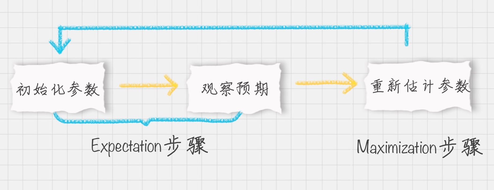

# 28丨EM聚类（上）：如何将一份菜等分给两个人？

陈旸 2019-02-15



08:47

讲述：陈旸 大小：8.05M

<audio title="28丨EM聚类（上）：如何将一份菜等分给两个人？" src="https://res001.geekbang.org//media/audio/6d/e6/6d752319263686e1e5602069b257e0e6/ld/ld.m3u8"></audio>

今天我来带你学习 EM 聚类。EM 的英文是 Expectation Maximization，所以 EM 算法也叫最大期望算法。

我们先看一个简单的场景：假设你炒了一份菜，想要把它平均分到两个碟子里，该怎么分？

很少有人用称对菜进行称重，再计算一半的分量进行平分。大部分人的方法是先分一部分到碟子  A 中，然后再把剩余的分到碟子 B 中，再来观察碟子 A 和 B 里的菜是否一样多，哪个多就匀一些到少的那个碟子里，然后再观察碟子 A 和 B  里的是否一样多……整个过程一直重复下去，直到份量不发生变化为止。

你能从这个例子中看到三个主要的步骤：初始化参数、观察预期、重新估计。首先是先给每个碟子初始化一些菜量，然后再观察预期，这两个步骤实际上就是期望步骤（Expectation）。如果结果存在偏差就需要重新估计参数，这个就是最大化步骤（Maximization）。这两个步骤加起来也就是  EM 算法的过程。

## EM 算法的工作原理

说到 EM 算法，我们先来看一个概念“最大似然”，英文是 Maximum Likelihood，Likelihood 代表可能性，所以最大似然也就是最大可能性的意思。

什么是最大似然呢？举个例子，有一男一女两个同学，现在要对他俩进行身高的比较，谁会更高呢？根据我们的经验，相同年龄下男性的平均身高比女性的高一些，所以男同学高的可能性会很大。这里运用的就是最大似然的概念。

最大似然估计是什么呢？它指的就是一件事情已经发生了，然后反推更有可能是什么因素造成的。还是用一男一女比较身高为例，假设有一个人比另一个人高，反推他可能是男性。最大似然估计是一种通过已知结果，估计参数的方法。

那么 EM 算法是什么？它和最大似然估计又有什么关系呢？EM 算法是一种求解最大似然估计的方法，通过观测样本，来找出样本的模型参数。

再回过来看下开头我给你举的分菜的这个例子，实际上最终我们想要的是碟子 A 和碟子 B 中菜的份量，你可以把它们理解为想要求得的**模型参数**。然后我们通过 EM 算法中的 E 步来进行观察，然后通过 M 步来进行调整 A 和 B 的参数，最后让碟子 A 和碟子 B 的参数不再发生变化为止。

实际我们遇到的问题，比分菜复杂。我再给你举个一个投掷硬币的例子，假设我们有 A 和 B 两枚硬币，我们做了 5 组实验，每组实验投掷 10 次，然后统计出现正面的次数，实验结果如下：

 投掷硬币这个过程中存在隐含的数据，即我们事先并不知道每次投掷的硬币是 A 还是 B。假设我们知道这个隐含的数据，并将它完善，可以得到下面的结果：

 我们现在想要求得硬币 A 和 B 出现正面次数的概率，可以直接求得：

而实际情况是我不知道每次投掷的硬币是 A 还是 B，那么如何求得硬币 A 和硬币 B 出现正面的概率呢？

这里就需要采用 EM 算法的思想。

\1. 初始化参数。我们假设硬币 A 和 B 的正面概率（随机指定）是θA=0.5 和θB=0.9。

\2. 计算期望值。假设实验 1 投掷的是硬币 A，那么正面次数为 5 的概率为：

 公式中的 C(10,5) 代表的是 10 个里面取 5 个的组合方式，也就是排列组合公式，0.5 的 5 次方乘以 0.5 的 5 次方代表的是其中一次为 5 次为正面，5 次为反面的概率，然后再乘以 C(10,5) 等于正面次数为 5 的概率。

假设实验 1 是投掷的硬币 B ，那么正面次数为 5 的概率为：

 所以实验 1 更有可能投掷的是硬币 A。

然后我们对实验 2~5 重复上面的计算过程，可以推理出来硬币顺序应该是{A，A，B，B，A}。

这个过程实际上是通过假设的参数来估计未知参数，即“每次投掷是哪枚硬币”。

\3. 通过猜测的结果{A, A, B, B, A}来完善初始化的参数θA 和θB。

然后一直重复第二步和第三步，直到参数不再发生变化。

简单总结下上面的步骤，你能看出 EM 算法中的 E 步骤就是通过旧的参数来计算隐藏变量。然后在 M 步骤中，通过得到的隐藏变量的结果来重新估计参数。直到参数不再发生变化，得到我们想要的结果。

## EM 聚类的工作原理

上面你能看到 EM 算法最直接的应用就是求参数估计。如果我们把潜在类别当做隐藏变量，样本看做观察值，就可以把聚类问题转化为参数估计问题。这也就是 EM 聚类的原理。

相比于 K-Means 算法，EM 聚类更加灵活，比如下面这两种情况，K-Means 会得到下面的聚类结果。

 因为 K-Means 是通过距离来区分样本之间的差别的，且每个样本在计算的时候只能属于一个分类，称之为是硬聚类算法。而 EM 聚类在求解的过程中，实际上每个样本都有一定的概率和每个聚类相关，叫做软聚类算法。

你可以把  EM 算法理解成为是一个框架，在这个框架中可以采用不同的模型来用 EM 进行求解。常用的 EM 聚类有 GMM 高斯混合模型和 HMM  隐马尔科夫模型。GMM（高斯混合模型）聚类就是 EM 聚类的一种。比如上面这两个图，可以采用 GMM 来进行聚类。

和  K-Means  一样，我们事先知道聚类的个数，但是不知道每个样本分别属于哪一类。通常，我们可以假设样本是符合高斯分布的（也就是正态分布）。每个高斯分布都属于这个模型的组成部分（component），要分成  K 类就相当于是 K 个组成部分。这样我们可以先初始化每个组成部分的高斯分布的参数，然后再看来每个样本是属于哪个组成部分。这也就是 E 步骤。

再通过得到的这些隐含变量结果，反过来求每个组成部分高斯分布的参数，即 M 步骤。反复 EM 步骤，直到每个组成部分的高斯分布参数不变为止。

这样也就相当于将样本按照 GMM 模型进行了 EM 聚类。

## 总结

EM  算法相当于一个框架，你可以采用不同的模型来进行聚类，比如 GMM（高斯混合模型），或者 HMM（隐马尔科夫模型）来进行聚类。GMM  是通过概率密度来进行聚类，聚成的类符合高斯分布（正态分布）。而 HMM  用到了马尔可夫过程，在这个过程中，我们通过状态转移矩阵来计算状态转移的概率。HMM 在自然语言处理和语音识别领域中有广泛的应用。

在 EM 这个框架中，E 步骤相当于是通过初始化的参数来估计隐含变量。M 步骤就是通过隐含变量反推来优化参数。最后通过 EM 步骤的迭代得到模型参数。

在这个过程里用到的一些数学公式这节课不进行展开。你需要重点理解 EM 算法的原理。通过上面举的炒菜的例子，你可以知道 EM 算法是一个不断观察和调整的过程。

通过求硬币正面概率的例子，你可以理解如何通过初始化参数来求隐含数据的过程，以及再通过求得的隐含数据来优化参数。

通过上面 GMM 图像聚类的例子，你可以知道很多 K-Means 解决不了的问题，EM 聚类是可以解决的。在 EM 框架中，我们将潜在类别当做隐藏变量，样本看做观察值，把聚类问题转化为参数估计问题，最终把样本进行聚类。

 最后给你留两道思考题吧，你能用自己的话说一下 EM 算法的原理吗？EM 聚类和 K-Means 聚类的相同和不同之处又有哪些？

欢迎你在评论区与我分享你的答案，也欢迎点击“请朋友读”，把这篇文章分享给你的朋友或者同事，一起来交流。

© 版权归极客邦科技所有，未经许可不得传播售卖。 页面已增加防盗追踪，如有侵权极客邦将依法追究其法律责任。         

夜瓜居士

Ctrl + Enter 发表

0/2000字

提交留言

## 精选留言(20)

- 

  third 

  想起了一个故事，摘叶子
  要找到最大的叶子
  1.先心里大概有一个叶子大小的概念（初始化模型）
  2.在三分之一的的路程上，观察叶子大小，并修改对大小的评估（观察预期，并修改参数）
  3.在三分之二的路程上，验证自己对叶子大小模型的的评估（重复1,2过程）
  4.在最后的路程上，选择最大的叶子（重复1.2，直到参数不再改变）

  相同点
  1.EM，KMEANS，都是随机生成预期值，然后经过反复调整，获得最佳结果
  2.聚类个数清晰

  不同点
  1.EM是计算概率，KMeans是计算距离。
  计算概率，概率只要不为0，都有可能即样本是每一个类别都有可能
  计算距离，只有近的的票高，才有可能，即样本只能属于一个类别

  ** 11

  2019-02-19

  编辑回复: 例子举的不错，相同和不同之处理解也很到位，大家都可以看看。

- 

  FORWARD―MOUNT 

  请问：

  通过猜测的结果{A, A, B, B, A}来完善初始化的参数θA 和θB。
  然后一直重复第二步和第三步，直到参数不再发生变化。

  
  怎么完善初始化参数？，急需解答。

  ** 5

  2019-03-28

- 

  mickey 

  文中抛硬币的例子，应该还要说明“5组实验，每组实验投掷10次，每组中只能抛同一枚硬币”。

  ** 4

  2019-02-28

- 

  黄楚门的世界 

  “”通过猜测的结果{A, A, B, B, A}来完善初始化的θA 和θB“” 这个步骤是怎样的？

  A  5
  A  7
  B  8
  B  9
  A  4
  θA=(5+7+4)/(10+10+10)
  θB=(8+9)/(10+10)

  ** 3

  2019-02-24

- 

  滨滨 

  em算法是假定一个样本分布概率，然后根据最大似然估计进行聚类，然后根据聚类结果修正参数，直到结果不在变化，而kmeans算法则是根据随机确定初始点，根据欧式距离等算法来计算和初始点的距离，完成初始聚类，然后迭代直到聚类结果不发生变化。kmeans是计算硬聚类，em是软聚类。

  ** 2

  2019-04-05

- 

  梁林松 

  EM 就好像炒菜，做汤，盐多了放水，味淡了再放盐，直到合适为止。然后，就能得出放盐和水的比例（参数）

  ** 2

  2019-02-15

- 

  白夜 

  EM，聚类的个数是已知的，首先，预设初始化的参数，然后获得对应的结果，再通过结果计算参数，不断循环以上两步，直到收敛。属于软分类，每个样本有一定概率和一个聚类相关。
  K-Means，聚类的个数也是已知的，首先选定一个中心点，然后计算距离，获得新的中心点，重复，直到结果收敛。属于硬分类，每个样本都只有一个分类。

  ** 2

  2019-02-15

- 

  Python 

  em聚类和K均值的区别就是一个软一个硬，软的输出概率，硬的要给出答案。我理解的em聚类的过程是一个翻来覆去决策的过程，这种聚类方式是先确定一个初始化的参数，再反过来推算结果，看和自己期望的差距，又在翻回去调整。好就好在，你想要一个什么样的结果他都能慢慢给你调整出来

  ** 2

  2019-02-15

  编辑回复: 一软一硬这个说的很恰当！一个输出概率，一个输出明确的答案。

- 

  滨滨 

  说的通俗一点啊，最大似然估计，就是利用已知的样本结果，反推最有可能（最大概率）导致这样结果的参数值。
  例如：一个麻袋里有白球与黑球，但是我不知道它们之间的比例，那我就有放回的抽取10次，结果我发现我抽到了8次黑球2次白球，我要求最有可能的黑白球之间的比例时，就采取最大似然估计法： 我假设我抽到黑球的概率为p,那得出8次黑球2次白球这个结果的概率为：
  P(黑=8)=p^8*（1-p）^2,现在我想要得出p是多少啊，很简单，使得P(黑=8)最大的p就是我要求的结果，接下来求导的的过程就是求极值的过程啦。
  可能你会有疑问，为什么要ln一下呢，这是因为ln把乘法变成加法了，且不会改变极值的位置（单调性保持一致嘛）这样求导会方便很多~

  ** 1

  2019-04-05

- 

  mickey 

  to third：

  吴军老师说过，这种找最大叶子的问题，最优解最大概率会在37%的时候，而不是最后。

  ** 1

  2019-02-28

- 

  老师 冯 

  “”通过猜测的结果{A, A, B, B, A}来完善初始化的θA 和θB“”  这个步骤是怎样的？跪求解答

  

  

  ** 1

  2019-02-19

- 

  对三要不起 

  TO FORWARD―MOUNT
  【通过猜测的结果{A, A, B, B, A}来完善初始化的参数θA 和θB。
  然后一直重复第二步和第三步，直到参数不再发生变化。】

  这个步骤就是通过第一次随机，我们一直知道了顺序了可能是{A  A B B  A}，然后就可以算出A和B投正面的概率，再通过算出来的这个新概率（之前是随即指定的），再去模拟一遍五组硬币，可能这次模拟出来的就不是{A A B  B A}了，重复这个步骤直到模拟出来的五枚硬币不再改变。此时的概率就是A和B 投正面的概率。

  ** 

  2019-05-19

- 

  奔跑的徐胖子 

  原理的话就拿老师的这个抛掷硬币的例子来看：
  1、初始的时候，我们并不知道1~5次试验抛掷的分别是A硬币还是B硬币，我们就先假设一下A、B正面向上的概率。
  2、通过我们假设的概率，我们根据1~5次实验中每次正面向上的频率，使用我们1中假设的A、B正面的概率来分别计算期望值。两个期望值比较哪个大，我们就觉得这次试验抛掷的是哪个硬币。
  3、我们通过2，就第一次将本来没有分类的试验（该次实验抛掷的是哪一个硬币）给分类了，但是这个结果是我们初始化一个随机的正面向上的概率来算出来的，不准确。
  4、我们把1、2、3的出来的初始的分类结果当做已知，通过全体数据来算一下此时A、B正面向上的概率（全体数据的频率），这样，我们就得到了类似2步骤中的正面向上的概率，这里就优化了A、B这面向上的概率（完善参数）。
  5、就这样一直重复2、3的过程，直到稳定为止

  ** 

  2019-04-26

- 

  奔跑的徐胖子 

  EM的原理，其实就拿这个老师给的硬币的例子来看。初始的时候，我们只有一堆数据，并不知道试验1~5分别抛掷的是哪一个硬币。这样，我们先随机一下A、B两枚硬币的正面出现的概率。

  ** 

  2019-04-26

- 

  王彬成 

  1、 EM 算法的原理？
  当我们需要从样本观察数据中，找出样本的模型参数。 但是问题含有未观察到的隐含数据，这时采用EM算法。
  在EM算法的Expectation步，先猜想隐含数据，接着基于观察数据和猜测的隐含数据一起来极大化对数似然，求解我们的模型参数。（EM算法的Maximization步)。
  我们基于当前得到的模型参数，继续猜测隐含数据（EM算法的E步），然后继续极大化对数似然，求解我们的模型参数（EM算法的M步)。以此类推，不断的迭代下去，直到模型分布参数基本无变化，算法收敛，找到合适的模型参数。
  2、EM 聚类和 K-Means 聚类的相同和不同之处又有哪些？
  k-means 计算过程：
  1）随机选择k个类簇的中心
  2）计算每一个样本点到所有类簇中心的距离，选择最小距离作为该样本的类簇
  3）重新计算所有类簇的中心坐标，直到达到某种停止条件（迭代次数/簇中心收敛/最小平方误差）

  ** 

  2019-02-23

- 

  李沛欣 

  今天的看完了。我理解的EM算法，是先估计一个大概率的可能参数，然后再根据数据不断进行调整，直到找到最终的确认参数。

  它主要有高斯模型和隐马尔科夫模型，前者在自然语言处理领域有很多应用。

  它和K-means都属于聚类算法，但是，EM属于软聚类，同一样本可能属于多个类别；而后者则属于硬聚类，一个样本只能属于一个类别。所以前者能够发现一些隐藏的数据。

  ** 

  2019-02-20

- 

  深白浅黑 

  原理哪里都有，还是需要结合实战！
  个人觉得，如果从数学定义角度出发，会更容易对算法原理进行理解。
  EM算法是求解隐含参数的算法，依据算法推导过程，可以视为求局部最优解的方法，可以归属为求解凸函数的问题。
  https://www.cnblogs.com/bigmoyan/p/4550375.html

  ** 

  2019-02-19

- 

  松花皮蛋me 

  有同学说:核心是初始参数啊。如果一开始就错那就完了。这完全是错的，只不过增加了更新次数而已。

  ** 

  2019-02-18

  编辑回复:   EM有自我更新的机制，就像K-Means一样，所以不用担心初始化参数，即使初始化参数不正确也会逐渐迭代出来结果。区别是在于迭代的次数，也就是运行的时间。这就好比把菜分到两个盘子中，一开始A盘很少，B盘非常多。这时候初始化参数并不理想，但是没有关系，EM机制通过参数估计，最终通过迭代会让两个盘子的分量一样多。只是迭代次数会略多一些。

- 

  littlePerfect 

  陈老师什么时候会更新面试的内容？

  ** 

  2019-02-17

  编辑回复: 2月底会上线一个找工作面试的专题。在专栏的最后部分会有几节和工作面试相关的。

- 

  从未在此 

  核心是初始参数啊。如果一开始就错那就完了

  ** 

  2019-02-15

  编辑回复:   不如担心，一个算法的强大在于它的鲁棒性，或者说它的机制价值会允许初始化参数存在误差。举个例子EM的核心是通过参数估计来完成聚类，如果你想要把菜平均分到两个盘子中，一开始盘子A的菜很少，B中的菜很多。同样没有关系，最后EM通过不断迭代会让两个盘子的菜量一样多，只是迭代的次数会多一些。