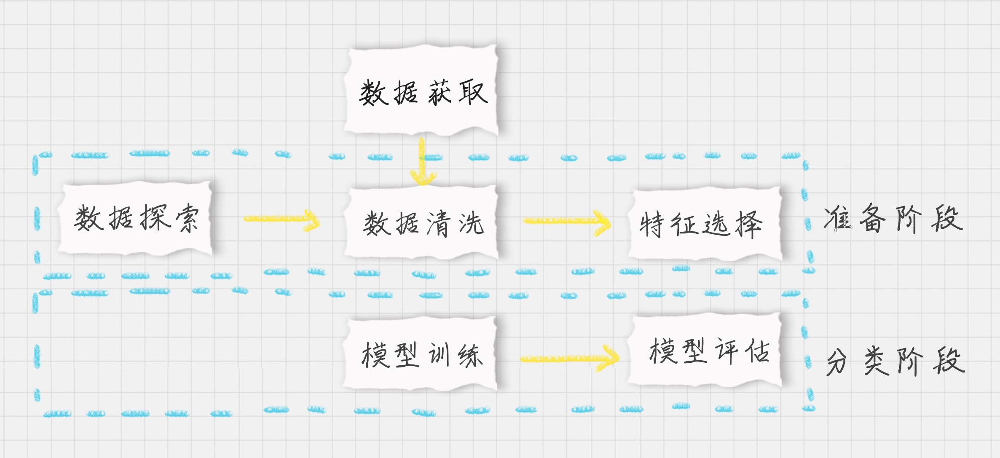
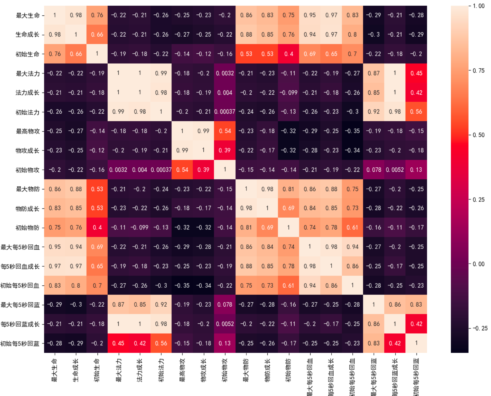
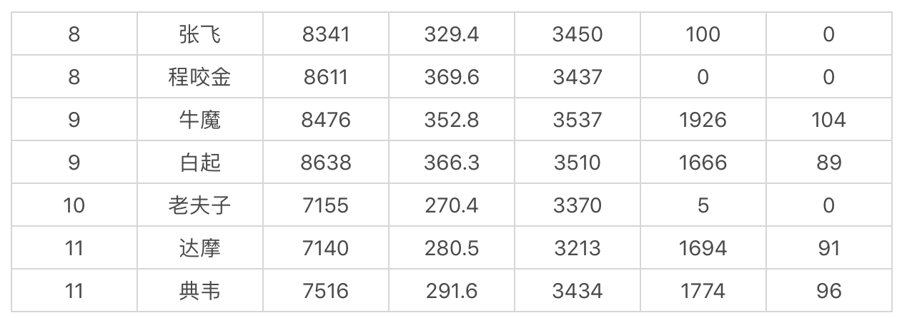
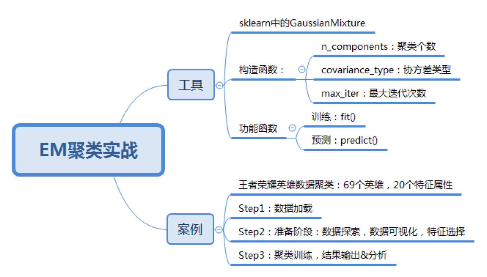

# 29丨EM聚类（下）：用EM算法对王者荣耀英雄进行划分

陈旸 2019-02-18





09:37

讲述：陈旸 大小：8.82M

<audio title="29丨EM聚类（下）：用EM算法对王者荣耀英雄进行划分" src="https://res001.geekbang.org//media/audio/68/d6/6879af42f10088cac0d936d2dec92dd6/ld/ld.m3u8"></audio>

今天我来带你进行  EM 的实战。上节课，我讲了 EM 算法的原理，EM 算法相当于一个聚类框架，里面有不同的聚类模型，比如 GMM 高斯混合模型，或者 HMM  隐马尔科夫模型。其中你需要理解的是 EM 的两个步骤，E 步和 M 步：E 步相当于通过初始化的参数来估计隐含变量，M  步是通过隐含变量来反推优化参数。最后通过 EM 步骤的迭代得到最终的模型参数。

今天我们进行 EM 算法的实战，你需要思考的是：

- 如何使用 EM 算法工具完成聚类？
- 什么情况下使用聚类算法？我们用聚类算法的任务目标是什么？
- 面对王者荣耀的英雄数据，EM 算法能帮助我们分析出什么？

## 如何使用 EM 工具包

在 Python 中有第三方的 EM 算法工具包。由于 EM 算法是一个聚类框架，所以你需要明确你要用的具体算法，比如是采用 GMM 高斯混合模型，还是 HMM 隐马尔科夫模型。

这节课我们主要讲解 GMM 的使用，在使用前你需要引入工具包：

```

 

from sklearn.mixture import GaussianMixture

 


```

我们看下如何在 sklearn 中创建 GMM 聚类。

首先我们使用  gmm = GaussianMixture(n_components=1, covariance_type=‘full’,  max_iter=100) 来创建 GMM 聚类，其中有几个比较主要的参数（GMM  类的构造参数比较多，我筛选了一些主要的进行讲解），我分别来讲解下：

1.n_components：即高斯混合模型的个数，也就是我们要聚类的个数，默认值为 1。如果你不指定 n_components，最终的聚类结果都会为同一个值。

2.covariance_type：代表协方差类型。一个高斯混合模型的分布是由均值向量和协方差矩阵决定的，所以协方差的类型也代表了不同的高斯混合模型的特征。协方差类型有 4 种取值：

- covariance_type=full，代表完全协方差，也就是元素都不为 0；
- covariance_type=tied，代表相同的完全协方差；
- covariance_type=diag，代表对角协方差，也就是对角不为 0，其余为 0；
- covariance_type=spherical，代表球面协方差，非对角为 0，对角完全相同，呈现球面的特性。

3.max_iter：代表最大迭代次数，EM 算法是由 E 步和 M 步迭代求得最终的模型参数，这里可以指定最大迭代次数，默认值为 100。

创建完 GMM 聚类器之后，我们就可以传入数据让它进行迭代拟合。

我们使用 fit 函数，传入样本特征矩阵，模型会自动生成聚类器，然后使用 prediction=gmm.predict(data) 来对数据进行聚类，传入你想进行聚类的数据，可以得到聚类结果 prediction。

你能看出来拟合训练和预测可以传入相同的特征矩阵，这是因为聚类是无监督学习，你不需要事先指定聚类的结果，也无法基于先验的结果经验来进行学习。只要在训练过程中传入特征值矩阵，机器就会按照特征值矩阵生成聚类器，然后就可以使用这个聚类器进行聚类了。

## 如何用 EM 算法对王者荣耀数据进行聚类

了解了 GMM 聚类工具之后，我们看下如何对王者荣耀的英雄数据进行聚类。

首先我们知道聚类的原理是“人以群分，物以类聚”。通过聚类算法把特征值相近的数据归为一类，不同类之间的差异较大，这样就可以对原始数据进行降维。通过分成几个组（簇），来研究每个组之间的特性。或者我们也可以把组（簇）的数量适当提升，这样就可以找到可以互相替换的英雄，比如你的对手选择了你擅长的英雄之后，你可以选择另一个英雄作为备选。

我们先看下数据长什么样子：


 这里我们收集了 69 名英雄的 20  个特征属性，这些属性分别是最大生命、生命成长、初始生命、最大法力、法力成长、初始法力、最高物攻、物攻成长、初始物攻、最大物防、物防成长、初始物防、最大每  5 秒回血、每 5 秒回血成长、初始每 5 秒回血、最大每 5 秒回蓝、每 5 秒回蓝成长、初始每 5 秒回蓝、最大攻速和攻击范围等。

具体的数据集你可以在 GitHub 上下载：<https://github.com/cystanford/EM_data>。

现在我们需要对王者荣耀的英雄数据进行聚类，我们先设定项目的执行流程：



1. 首先我们需要加载数据源；
2. 在准备阶段，我们需要对数据进行探索，包括采用数据可视化技术，让我们对英雄属性以及这些属性之间的关系理解更加深刻，然后对数据质量进行评估，是否进行数据清洗，最后进行特征选择方便后续的聚类算法；
3. 聚类阶段：选择适合的聚类模型，这里我们采用 GMM 高斯混合模型进行聚类，并输出聚类结果，对结果进行分析。

按照上面的步骤，我们来编写下代码。完整的代码如下：

```

# -*- coding: utf-8 -*-

import pandas as pd

import csv

import matplotlib.pyplot as plt

import seaborn as sns

from sklearn.mixture import GaussianMixture

from sklearn.preprocessing import StandardScaler

 

# 数据加载，避免中文乱码问题

data_ori = pd.read_csv('./heros7.csv', encoding = 'gb18030')

features = [u'最大生命',u'生命成长',u'初始生命',u'最大法力', u'法力成长',u'初始法力',u'最高物攻',u'物攻成长',u'初始物攻',u'最大物防',u'物防成长',u'初始物防', u'最大每 5 秒回血', u'每 5 秒回血成长', u'初始每 5 秒回血', u'最大每 5 秒回蓝', u'每 5 秒回蓝成长', u'初始每 5 秒回蓝', u'最大攻速', u'攻击范围']

data = data_ori[features]

 

# 对英雄属性之间的关系进行可视化分析

# 设置 plt 正确显示中文

plt.rcParams['font.sans-serif']=['SimHei'] # 用来正常显示中文标签

plt.rcParams['axes.unicode_minus']=False # 用来正常显示负号

# 用热力图呈现 features_mean 字段之间的相关性

corr = data[features].corr()

plt.figure(figsize=(14,14))

# annot=True 显示每个方格的数据

sns.heatmap(corr, annot=True)

plt.show()

 

# 相关性大的属性保留一个，因此可以对属性进行降维

features_remain = [u'最大生命', u'初始生命', u'最大法力', u'最高物攻', u'初始物攻', u'最大物防', u'初始物防', u'最大每 5 秒回血', u'最大每 5 秒回蓝', u'初始每 5 秒回蓝', u'最大攻速', u'攻击范围']

data = data_ori[features_remain]

data[u'最大攻速'] = data[u'最大攻速'].apply(lambda x: float(x.strip('%'))/100)

data[u'攻击范围']=data[u'攻击范围'].map({'远程':1,'近战':0})

# 采用 Z-Score 规范化数据，保证每个特征维度的数据均值为 0，方差为 1

ss = StandardScaler()

data = ss.fit_transform(data)

# 构造 GMM 聚类

gmm = GaussianMixture(n_components=30, covariance_type='full')

gmm.fit(data)

# 训练数据

prediction = gmm.predict(data)

print(prediction)

# 将分组结果输出到 CSV 文件中

data_ori.insert(0, '分组', prediction)

data_ori.to_csv('./hero_out.csv', index=False, sep=',')


```

运行结果如下：



```

[28 14  8  9  5  5 15  8  3 14 18 14  9  7 16 18 13  3  5  4 19 12  4 12

 12 12  4 17 24  2  7  2  2 24  2  2 24  6 20 22 22 24 24  2  2 22 14 20

 14 24 26 29 27 25 25 28 11  1 23  5 11  0 10 28 21 29 29 29 17]


```

同时你也能看到输出的聚类结果文件 hero_out.csv（它保存在你本地运行的文件夹里，程序会自动输出这个文件，你可以自己看下）。

我来简单讲解下程序的几个模块。

**关于引用包**

首先我们会用  DataFrame 数据结构来保存读取的数据，最后的聚类结果会写入到 CSV 文件中，因此会用到 pandas 和 CSV  工具包。另外我们需要对数据进行可视化，采用热力图展现属性之间的相关性，这里会用到 matplotlib.pyplot 和 seaborn  工具包。在数据规范化中我们使用到了 Z-Score 规范化，用到了 StandardScaler 类，最后我们还会用到 sklearn 中的  GaussianMixture 类进行聚类。

**数据可视化的探索**

你能看到我们将 20  个英雄属性之间的关系用热力图呈现了出来，中间的数字代表两个属性之间的关系系数，最大值为  1，代表完全正相关，关系系数越大代表相关性越大。从图中你能看出来“最大生命”“生命成长”和“初始生命”这三个属性的相关性大，我们只需要保留一个属性即可。同理我们也可以对其他相关性大的属性进行筛选，保留一个。你在代码中可以看到，我用  features_remain 数组保留了特征选择的属性，这样就将原本的 20 个属性降维到了 13 个属性。

**关于数据规范化**

我们能看到“最大攻速”这个属性值是百分数，不适合做矩阵运算，因此我们需要将百分数转化为小数。我们也看到“攻击范围”这个字段的取值为远程或者近战，也不适合矩阵运算，我们将取值做个映射，用  1 代表远程，0 代表近战。然后采用 Z-Score 规范化，对特征矩阵进行规范化。

**在聚类阶段**

我们采用了 GMM 高斯混合模型，并将结果输出到 CSV 文件中。

这里我将输出的结果截取了一段（设置聚类个数为 30）：


 第一列代表的是分组（簇），我们能看到张飞、程咬金分到了一组，牛魔、白起是一组，老夫子自己是一组，达摩、典韦是一组。聚类的特点是相同类别之间的属性值相近，不同类别的属性值差异大。因此如果你擅长用典韦这个英雄，不防试试达摩这个英雄。同样你也可以在张飞和程咬金中进行切换。这样就算你的英雄被别人选中了，你依然可以有备选的英雄可以使用。

## 总结

今天我带你一起做了 EM 聚类的实战，具体使用的是 GMM 高斯混合模型。从整个流程中可以看出，我们需要经过数据加载、数据探索、数据可视化、特征选择、GMM 聚类和结果分析等环节。

聚类和分类不一样，聚类是无监督的学习方式，也就是我们没有实际的结果可以进行比对，所以聚类的结果评估不像分类准确率一样直观，那么有没有聚类结果的评估方式呢？这里我们可以采用 Calinski-Harabaz 指标，代码如下：

```

from sklearn.metrics import calinski_harabaz_score

print(calinski_harabaz_score(data, prediction))


```

指标分数越高，代表聚类效果越好，也就是相同类中的差异性小，不同类之间的差异性大。当然具体聚类的结果含义，我们需要人工来分析，也就是当这些数据被分成不同的类别之后，具体每个类表代表的含义。

另外聚类算法也可以作为其他数据挖掘算法的预处理阶段，这样我们就可以将数据进行降维了。


 最后依然是两道思考题。针对王者荣耀的英雄数据集，我进行了特征选择，实际上王者荣耀的英雄数量并不多，我们可以省略特征选择这个阶段，你不妨用全部的特征值矩阵进行聚类训练，来看下聚类得到的结果。第二个问题是，依然用王者荣耀英雄数据集，在聚类个数为  3 以及聚类个数为 30 的情况下，请你使用 GMM 高斯混合模型对数据集进行聚类，并得出 Calinski_Harabaz 分数。

欢迎在评论区与我分享你的答案，也欢迎点击“请朋友读”，把这篇文章分享给你的朋友或者同事。


© 版权归极客邦科技所有，未经许可不得传播售卖。 页面已增加防盗追踪，如有侵权极客邦将依法追究其法律责任。         


夜瓜居士


Ctrl + Enter 发表

0/2000字

提交留言

## 精选留言(27)

- 

  王彬成 

  有一个疑惑，在数据规范化的时候，为何Z-Score进行规范化，而不是Min-Max进行规范化，虽然最后的结果是差不多的。
  请问在数据规范化时，何时用Z-Score进行规范化，何时是Min-Max

  ** 8

  2019-02-24

- 

  哆哩咪fa👻 

  才买的课，请问有vx群或者可以相互沟通的群么

  ** 7

  2019-02-18

- 

  Grandia_Z 

  画热力图时 为什么没有“最大攻速”和“攻击范围”这两项

  ** 5

  2019-02-18

- 

  Frank 

  老师，covariance_type这个参数，什么情况下选择什么类型，能不能再说的详细点儿呢？

  ** 3

  2019-03-10

- 

  iamtalent123 

  老师，请问有没有什么方法在得到相关性系数后，自动筛选出不太相关的特征呢？在特征比较多的时候，自己一个一个的看是不是有点太费时了？

  ** 2

  2019-03-20

- 

  third 

  思考：为什么分类越少，反而指标分数越高，分类效果越好？
  总样本过少，分成的类越多，每个类的所拥有的个体相对越少，类中个体差异变大，导致指标分数变低
  为3个
  [2 2 1 2 1 1 1 1 2 2 2 2 2 0 2 2 2 2 1 0 0 0 0 0 0 0 0 0 0 0 2 0 0 0 0 0 0
   0 0 0 0 0 0 0 0 0 2 0 2 0 1 0 1 0 0 2 2 0 0 1 2 1 1 2 1 0 0 0 0]
  34.74970397246901

  为30
  [ 1 20  5 13 26 15 14  5  8 20 16 20 13  0 22 16 19 22 26 10  6  4 10  4
    4  4 10 12  3 27  0 27 29  3 27  3  3 24 27 18 29  3  3 27  3 18 20 27
   20  3 21 11  2 23 23  1 28 11 25 26 28  2 17  1  9 11 11  7 12]
  24.220124542171177

  ** 2

  2019-02-20

- 

  許敲敲 

  最后一个 data_to_csv()也最好加上encoding='gb18030';不然会乱码

  ** 2

  2019-02-19

  编辑回复: 嗯 中文的话需要需要注意这个。

- 

  高桥凉瓜 

  之所以热力图不显示最大攻速和攻击范围，是因为这两列的数据的类型是string，想要在热力图也显示这两项的话可以在构建热力图前就进行数据清洗：
  \```
  data[u'最大攻速'] = data[u'最大攻速'].apply(lambda x: float(x.strip('%'))/100)
  data[u'攻击范围']=data[u'攻击范围'].map({'远程':1,'近战':0})
  \```

  ** 1

  2019-03-27

- 

  白夜 

  这个相关性的计算原理能扩展讲讲吗？蛮好奇的

  ** 1

  2019-02-18

- 

  从未在此 

  还有，非数值型的特征怎么进行聚类？

  ** 1

  2019-02-18

  编辑回复: 非数值的类型需要先转化为数值类型，比如“远程”转化为1，“近战”转化为0。这样才能做矩阵的运算。

- 

  从未在此 

  问下老师，当几个特征相关性较大时，怎么选择最具有代表性的那个呢

  ** 1

  2019-02-18

  编辑回复: 相关性比较大的时候，可以任意选择其中一个，因为这些指标相关性比较大，所以你选择哪一个其实结果都相差不大。当然对于相关性比较大，不同人的理解是不同的额，比如你可以定义相关性大于0.9或者相关性大于0.8。

- 

  挠头侠 

  老师能否说明一下不同的协方差类型会带来一个什么样的效果呢？

  ** 

  2019-05-14

- 

  周飞 

  1.不做特征选择的情况下，得到的Calinski_Harabaz 分数 大约是 23.1530273621 ,做特征选择的情况下 大约是：21.2142191471.
  2.聚类个数为3的时候 Calinski_Harabaz 分数 大约是 22.9119297953 。聚类个数为30的时候 Calinski_Harabaz 分数 大约是 21.2142191471

  ** 

  2019-04-27

- 

  滢 

  全部特征，聚类个数为3个：
  [0 0 2 0 2 2 2 2 0 0 0 0 0 0 0 0 0 0 2 1 1 1 1 1 1 1 1 1 1 1 0 1 1 1 1 1 1
   1 0 1 1 1 1 1 1 1 0 0 0 1 2 0 2 0 0 0 0 0 1 2 0 2 2 0 2 1 1 0 1]
  22.91192979526994
  全部特征：聚类个数为30个
  [16 12 11 13  2  2 19 11  3 12 15 12 13  8 24 15 25 13 21 27 26  7 27  7
    7  7 27 22 28  1  8  1 29 28  1  1 28  6 20 18 29 28 28  1 28 18 12 20
   12 28 17 14 21  4  4 16  0 12 23 21  0  5  9 16 10 14 14 16 22]
  22.211084900636873

  ** 

  2019-04-20

- 

  滨滨 

  为什么分类越少，反而指标分数越高，分类效果越好？
  总样本过少，分成的类越多，每个类的所拥有的个体相对越少，类中个体差异变大，导致指标分数变低

  ** 

  2019-04-05

- 

  hlz-123 

  老师，同一程序每次运行结果不一样，有时赵云和孙悟空聚在一类，有时赵云和兰陵王聚在一类，这种情况正常吗？

  ** 

  2019-03-24

- 

  三硝基甲苯 

  在同样30个类的时候，没有任何特征过滤的时候分数大概是23附近，若是每种最大 成长 最初这三个里面去掉成长的话分数大概是19-21左右，若是只保留最大那一项，则分数可以到44-46左右。

  
  聚类30个和聚类3个分数差距，3个的分数比30个高

  ** 

  2019-03-16

- 

  mickey 

  ** 

  2019-03-01

- 

  mickey 

  问题1：
  data[u'最大攻速'] = data[u'最大攻速'].apply(lambda x: float(x.strip('%')) / 100)
  会产生 SettingWithCopyWarning 警告
  解决方法：使用 pd.set_option('mode.chained_assignment', None) 屏蔽警告

  问题2：
  导出文件时，会报UnicodeEncodeError: 'ascii' codec can't encode characters in position 0-1: ordinal not in range(128)
  解决方法：
  设置编码 data_ori.to_csv('./hero_out.csv', index=False, sep=',', encoding='utf-8')

  ** 

  2019-03-01

- 

  mickey 

  跑案例提示如下，请问老师怎么破？谢谢。

  SettingWithCopyWarning: 
  A value is trying to be set on a copy of a slice from a DataFrame.
  Try using .loc[row_indexer,col_indexer] = value instead

  See the caveats in the documentation: http://pandas.pydata.org/pandas-docs/stable/indexing.html#indexing-view-versus-copy
    data[u'最大攻速'] = data[u'最大攻速'].apply(lambda x: float(x.strip('%')) / 100)
  E:\DevelopTool\Python\Python27\lib\site-packages\pandas\core\indexes\base.py:3259:  UnicodeWarning: Unicode equal comparison failed to convert both  arguments to Unicode - interpreting them as being unequal
    indexer = self._engine.get_indexer(target._ndarray_values)
  G:/Program/python/Geekbang/DataAnalysis/Part01/Lesson29/01_GMM.py:31: SettingWithCopyWarning: 
  A value is trying to be set on a copy of a slice from a DataFrame.
  Try using .loc[row_indexer,col_indexer] = value instead

  See the caveats in the documentation: http://pandas.pydata.org/pandas-docs/stable/indexing.html#indexing-view-versus-copy
    data[u'攻击范围'] = data[u'攻击范围'].map({'远程': 1, '近战': 0})
  E:\DevelopTool\Python\Python27\lib\site-packages\sklearn\preprocessing\data.py:625:  DataConversionWarning: Data with input dtype int64, float64 were all  converted to float64 by StandardScaler.
    return self.partial_fit(X, y)
  E:\DevelopTool\Python\Python27\lib\site-packages\sklearn\utils\extmath.py:776:  RuntimeWarning: invalid value encountered in true_divide
    updated_mean = (last_sum + new_sum) / updated_sample_count
  ...
  Traceback (most recent call last):
    ...
  ValueError: Input contains NaN, infinity or a value too large for dtype('float64').

  ** 

  2019-03-01

- 

  JingZ 

  \# EM算法
  全部特征值
  [20 11  9 27  5  5  0  9  6  2 16 22 27 11 25 16 24  6  5 14  7 14 13 14
   14 14 13 18 21  8 11  8 28 21  8  8 21 23  1 11 28 21 21  8  8 28 22  1
   11 21 10  4 17  3  3 20 12  4 26  5 12 17 19 20 15  4 29  4 18]
  23.16819127214688

  聚类个数=3
  [0 0 1 0 1 1 1 1 0 0 0 0 0 0 0 0 0 0 1 2 2 2 2 2 2 2 2 2 2 2 0 2 2 2 2 2 2
   2 0 2 2 2 2 2 2 2 0 0 0 2 1 0 1 0 0 0 0 0 2 1 0 1 1 0 1 2 2 0 2]
  22.91192979526994

  聚类个数=30
  [10  1  9  8  2  2  6  9  8 27  4  5  8  1 19  4 25  8 12  3 23 17  3 17
   17 17  3 11  0 13  1 18 18  0 13 18  0  7 20 22 22  0  0 18  0 22  5 20
    5  0 28 14 12 24 24 10 10 26 21  2 10 29 15 10 16 26 26 10 11]
  21.034625759895164

  ** 

  2019-02-27

- 

  王彬成 

  1、用全部的特征值矩阵进行聚类训练
  [12 17  9 13  1  1 15  9  3 27 18 24 13 17 14 18 12  3  1  5 23 11  5 11
   11 11  5 22  7 26 17  7 21  7 26  7  7  4  0 28 21  7  7  7  7 28 24  0
   17  7 25  2  8 19 19 12 10  2 20  1 10  8 16 12  6  2 29  2 22]
  23.195087563465346

  2、依然用王者荣耀英雄数据集，
  1）聚类个数为 3 以及
  [1 1 2 1 2 2 2 2 1 1 1 1 1 1 1 1 1 1 2 0 0 0 0 0 0 0 0 0 0 0 1 0 0 0 0 0 0
   0 1 0 0 0 0 0 0 0 1 1 1 0 2 1 2 1 1 1 1 1 0 2 1 2 2 1 2 0 0 1 0]
  聚类结果评估：22.91192979526994

  2）聚类个数为 30 
  [20 12  9 16  3  3 18  9  6 20 15  4 16 28 26 15  0  6 23 14  7  5 14  5
    5  5 14 24 10 29 28 10 10 10 29 10  1 21 25 19 10  1 10 10 10 19  4 25
    4 10  8  2 23 17 17 20  2 12 19  3  2 11 13 20 22 27 27 12 24]
  聚类结果评估：21.300387287083122

  ** 

  2019-02-24

- 

  王彬成 

  1、在特征选择时，老师是以选取相关性大于0.95中的一个特征进行保留的吗？
  那么应该是20个属性保留12个属性
  \#老师提供的特征选择
  features_remain  = [u'最大生命', u'初始生命', u'最大法力', u'最高物攻', u'初始物攻', u'初始物攻', u'最大物防',  u'初始物防', u'最大每 5 秒回血', u'最大每 5 秒回蓝', u'初始每 5 秒回蓝', u'最大攻速', u'攻击范围']

  \#自己筛选的特征
  features = [u'最大生命',u'初始生命',u'最大法力',u'最高物攻',u'初始物攻',u'最大物防',u'初始物防', u'最大每 5 秒回血', u'最大每 5 秒回蓝', u'初始每 5 秒回蓝', u'最大攻速', u'攻击范围']

  ** 

  2019-02-24

- 

  fancy 

  运行时出错，说不存在u'初始每 5 秒回蓝'和u'每 5 秒回蓝成长'这两个index，删了以后能正常运行

  ** 

  2019-02-20

- 

  深白浅黑 

  全部特征
  聚类个数为3：
  [2 2 0 2 0 0 0 0 2 2 2 2 2 2 2 2 2 2 0 1 1 1 1 1 1 1 1 1 1 1 2 1 1 1 1 1 1
   1 1 2 1 1 1 1 1 1 2 1 2 1 0 2 0 1 1 2 2 2 1 0 2 0 0 2 0 1 1 2 1]
  34.46996086536748
  聚类个数为30：
  [22 23 11 16  1  1 25 11  2  7  9  7 16 24 28  9 14  2  1  4  5  4 20  4
    4  4 20 27  0  8 23  0 26  0  8  0  0 17 15 10 26  0  0 26  0 10 29 15
    7  0  6  3 12 13 13 22 22 23 18  1 22 12 21 22 19  3  3 23 27]
  25.04467629288216

  ** 

  2019-02-19

  编辑回复: Good

- 

  Chen 

  需要和陈老师讨论一个问题（关于数据规范化那节的），在网上看到有前辈讲关于“逻辑回归是否需要进行标准化？”，答案是取决于逻辑回归是不是用正则。讲的原因是不用正则时，仅仅是度量预测与真实值的差距，加上正则后，损失函数除了要度量差距外还要度量参数值是否足够小。。而参数值的大小程度或者说大小的级别是与特征的数值范围相关的。您是否同意呢？您讲是当用到梯度下降作为优化器，提高寻找最优解的效率而做标准化。这个前辈讲的是否有道理呢？我比较迷糊了。

  ** 

  2019-02-18

- 

  文晟 

  老师，样本自动就是样本特征矩阵了吗

  ** 

  2019-02-18