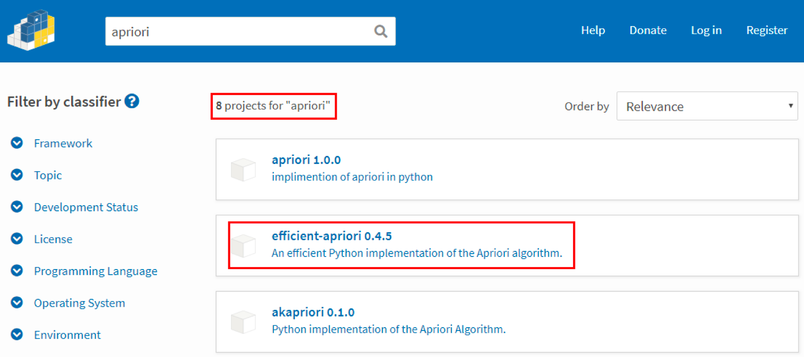
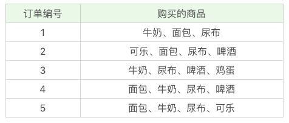
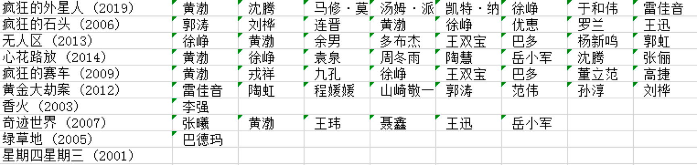

# 31丨关联规则挖掘（下）：导演如何选择演员？

陈旸 2019-02-22





07:42

讲述：陈旸 大小：7.06M

<audio title="31丨关联规则挖掘（下）：导演如何选择演员？" src="https://res001.geekbang.org//media/audio/9f/d1/9ffd041fdd8bebf8c686ae7166c566d1/ld/ld.m3u8"></audio>

上次我给你讲了关联规则挖掘的原理。关联规则挖掘在生活中有很多使用场景，不仅是商品的捆绑销售，甚至在挑选演员决策上，你也能通过关联规则挖掘看出来某个导演选择演员的倾向。

今天我来带你用 Apriori 算法做一个项目实战。你需要掌握的是以下几点：

1. 熟悉上节课讲到的几个重要概念：支持度、置信度和提升度；
2. 熟悉与掌握 Apriori 工具包的使用；
3. 在实际问题中，灵活运用。包括数据集的准备等。

## 如何使用 Apriori 工具包

Apriori 虽然是十大算法之一，不过在 sklearn 工具包中并没有它，也没有 FP-Growth 算法。这里教你个方法，来选择 Python 中可以使用的工具包，你可以通过<https://pypi.org/> 搜索工具包。


 这个网站提供的工具包都是 Python 语言的，你能找到 8 个 Python 语言的 Apriori 工具包，具体选择哪个呢？建议你使用第二个工具包，即 efficient-apriori。后面我会讲到为什么推荐这个工具包。

首先你需要通过 pip install efficient-apriori 安装这个工具包。

然后看下如何使用它，核心的代码就是这一行：

```

itemsets, rules = apriori(data, min_support,  min_confidence)


```

其中  data 是我们要提供的数据集，它是一个 list 数组类型。min_support 参数为最小支持度，在 efficient-apriori  工具包中用 0 到 1 的数值代表百分比，比如 0.5 代表最小支持度为 50%。min_confidence  是最小置信度，数值也代表百分比，比如 1 代表 100%。

关于支持度、置信度和提升度，我们再来简单回忆下。

支持度指的是某个商品组合出现的次数与总次数之间的比例。支持度越高，代表这个组合出现的概率越大。

置信度是一个条件概念，就是在 A 发生的情况下，B 发生的概率是多少。

提升度代表的是“商品 A 的出现，对商品 B 的出现概率提升了多少”。

接下来我们用这个工具包，跑一下上节课中讲到的超市购物的例子。下面是客户购买的商品列表：



具体实现的代码如下：

```

from efficient_apriori import apriori

# 设置数据集

data = [('牛奶','面包','尿布'),

           ('可乐','面包', '尿布', '啤酒'),

           ('牛奶','尿布', '啤酒', '鸡蛋'),

           ('面包', '牛奶', '尿布', '啤酒'),

           ('面包', '牛奶', '尿布', '可乐')]

# 挖掘频繁项集和频繁规则

itemsets, rules = apriori(data, min_support=0.5,  min_confidence=1)

print(itemsets)

print(rules)

 


```

运行结果：

```

{1: {('啤酒',): 3, ('尿布',): 5, ('牛奶',): 4, ('面包',): 4}, 2: {('啤酒', '尿布'): 3, ('尿布', '牛奶'): 4, ('尿布', '面包'): 4, ('牛奶', '面包'): 3}, 3: {('尿布', '牛奶', '面包'): 3}}

[{啤酒} -> {尿布}, {牛奶} -> {尿布}, {面包} -> {尿布}, {牛奶, 面包} -> {尿布}]


```

你能从代码中看出来，data 是个 List 数组类型，其中每个值都可以是一个集合。实际上你也可以把 data 数组中的每个值设置为 List 数组类型，比如：

```

data = [['牛奶','面包','尿布'],

           ['可乐','面包', '尿布', '啤酒'],

           ['牛奶','尿布', '啤酒', '鸡蛋'],

           ['面包', '牛奶', '尿布', '啤酒'],

           ['面包', '牛奶', '尿布', '可乐']]


```

两者的运行结果是一样的，efficient-apriori 工具包把每一条数据集里的项式都放到了一个集合中进行运算，并没有考虑它们之间的先后顺序。因为实际情况下，同一个购物篮中的物品也不需要考虑购买的先后顺序。

而其他的 Apriori 算法可能会因为考虑了先后顺序，出现计算频繁项集结果不对的情况。所以这里采用的是 efficient-apriori 这个工具包。

## 挖掘导演是如何选择演员的

在实际工作中，数据集是需要自己来准备的，比如今天我们要挖掘导演是如何选择演员的数据情况，但是并没有公开的数据集可以直接使用。因此我们需要使用之前讲到的 Python 爬虫进行数据采集。

不同导演选择演员的规则是不同的，因此我们需要先指定导演。数据源我们选用豆瓣电影。

先来梳理下采集的工作流程。

首先我们先在<https://movie.douban.com>搜索框中输入导演姓名，比如“宁浩”。


 页面会呈现出来导演之前的所有电影，然后对页面进行观察，你能观察到以下几个现象：

1. 页面默认是 15 条数据反馈，第一页会返回 16 条。因为第一条数据实际上这个导演的概览，你可以理解为是一条广告的插入，下面才是真正的返回结果。
2. 每条数据的最后一行是电影的演出人员的信息，第一个人员是导演，其余为演员姓名。姓名之间用“/”分割。

有了这些观察之后，我们就可以编写抓取程序了。在代码讲解中你能看出这两点观察的作用。抓取程序的目的是为了生成宁浩导演（你也可以抓取其他导演）的数据集，结果会保存在 csv 文件中。完整的抓取代码如下：

```

# -*- coding: utf-8 -*-

# 下载某个导演的电影数据集

from efficient_apriori import apriori

from lxml import etree

import time

from selenium import webdriver

import csv

driver = webdriver.Chrome()

# 设置想要下载的导演 数据集

director = u'宁浩'

# 写 CSV 文件

file_name = './' + director + '.csv'

base_url = 'https://movie.douban.com/subject_search?search_text='+director+'&cat=1002&start='

out = open(file_name,'w', newline='', encoding='utf-8-sig')

csv_write = csv.writer(out, dialect='excel')

flags=[]

# 下载指定页面的数据

def download(request_url):

	driver.get(request_url)

	time.sleep(1)

	html = driver.find_element_by_xpath("//*").get_attribute("outerHTML")

	html = etree.HTML(html)

	# 设置电影名称，导演演员 的 XPATH

	movie_lists = html.xpath("/html/body/div[@id='wrapper']/div[@id='root']/div[1]//div[@class='item-root']/div[@class='detail']/div[@class='title']/a[@class='title-text']")

	name_lists = html.xpath("/html/body/div[@id='wrapper']/div[@id='root']/div[1]//div[@class='item-root']/div[@class='detail']/div[@class='meta abstract_2']")

	# 获取返回的数据个数

	num = len(movie_lists)

	if num > 15: # 第一页会有 16 条数据

		# 默认第一个不是，所以需要去掉

		movie_lists = movie_lists[1:]

		name_lists = name_lists[1:]

	for (movie, name_list) in zip(movie_lists, name_lists):

		# 会存在数据为空的情况

		if name_list.text is None: 

			continue

		# 显示下演员名称

		print(name_list.text)

		names = name_list.text.split('/')

		# 判断导演是否为指定的 director

		if names[0].strip() == director and movie.text not in flags:

			# 将第一个字段设置为电影名称

			names[0] = movie.text

			flags.append(movie.text)

			csv_write.writerow(names)

	print('OK') # 代表这页数据下载成功

	print(num)

	if num >= 14: # 有可能一页会有 14 个电影

		# 继续下一页

		return True

	else:

		# 没有下一页

		return False

 

# 开始的 ID 为 0，每页增加 15

start = 0

while start<10000: # 最多抽取 1 万部电影

	request_url = base_url + str(start)

	# 下载数据，并返回是否有下一页

	flag = download(request_url)

	if flag:

		start = start + 15

	else:

		break

out.close()

print('finished')


```

代码中涉及到了几个模块，我简单讲解下这几个模块。

在引用包这一段，我们使用  csv 工具包读写 CSV 文件，用 efficient_apriori 完成 Apriori 算法，用 lxml 进行 XPath  解析，time 工具包可以让我们在模拟后有个适当停留，代码中我设置为 1 秒钟，等 HTML 数据完全返回后再进行 HTML 内容的获取。使用  selenium 的 webdriver 来模拟浏览器的行为。

在读写文件这一块，我们需要事先告诉 python 的 open 函数，文件的编码是 utf-8-sig（对应代码：encoding=‘utf-8-sig’），这是因为我们会用到中文，为了避免编码混乱。

编写  download 函数，参数传入我们要采集的页面地址（request_url）。针对返回的 HTML，我们需要用到之前讲到的 Chrome  浏览器的 XPath Helper 工具，来获取电影名称以及演出人员的 XPath。我用页面返回的数据个数来判断当前所处的页面序号。如果数据个数  >15，也就是第一页，第一页的第一条数据是广告，我们需要忽略。如果数据个数  =15，代表是中间页，需要点击“下一页”，也就是翻页。如果数据个数 <15，代表最后一页，没有下一页。

在程序主体部分，我们设置 start 代表抓取的 ID，从 0 开始最多抓取 1 万部电影的数据（一个导演不会超过 1 万部电影），每次翻页 start 自动增加 15，直到 flag=False 为止，也就是不存在下一页的情况。

你可以模拟下抓取的流程，获得指定导演的数据，比如我上面抓取的宁浩的数据。这里需要注意的是，豆瓣的电影数据可能是不全的，但基本上够我们用。


 有了数据之后，我们就可以用 Apriori 算法来挖掘频繁项集和关联规则，代码如下：

```

# -*- coding: utf-8 -*-

from efficient_apriori import apriori

import csv

director = u'宁浩'

file_name = './'+director+'.csv'

lists = csv.reader(open(file_name, 'r', encoding='utf-8-sig'))

# 数据加载

data = []

for names in lists:

     name_new = []

     for name in names:

           # 去掉演员数据中的空格

           name_new.append(name.strip())

     data.append(name_new[1:])

# 挖掘频繁项集和关联规则

itemsets, rules = apriori(data, min_support=0.5,  min_confidence=1)

print(itemsets)

print(rules)


```

代码中使用的 apriori 方法和开头中用 Apriori 获取购物篮规律的方法类似，比如代码中都设定了最小支持度和最小置信系数，这样我们可以找到支持度大于 50%，置信系数为 1 的频繁项集和关联规则。

这是最后的运行结果：

```

{1: {('徐峥',): 5, ('黄渤',): 6}, 2: {('徐峥', '黄渤'): 5}}

[{徐峥} -> {黄渤}]


```

你能看出来，宁浩导演喜欢用徐峥和黄渤，并且有徐峥的情况下，一般都会用黄渤。你也可以用上面的代码来挖掘下其他导演选择演员的规律。

## 总结

Apriori  算法的核心就是理解频繁项集和关联规则。在算法运算的过程中，还要重点掌握对支持度、置信度和提升度的理解。在工具使用上，你可以使用  efficient-apriori  这个工具包，它会把每一条数据中的项（item）放到一个集合（篮子）里来处理，不考虑项（item）之间的先后顺序。

在实际运用中你还需要灵活处理，比如导演如何选择演员这个案例，虽然工具的使用会很方便，但重要的还是数据挖掘前的准备过程，也就是获取某个导演的电影数据集。


 最后给你留两道思考题吧。请你编写代码挖掘下张艺谋导演使用演员的频繁项集和关联规则，最小支持度可以设置为 0.1 或 0.05。另外你认为 Apriori 算法中的最小支持度和最小置信度，一般设置为多少比较合理？

欢迎你在评论区与我分享你的答案，也欢迎点击“请朋友读”，把这篇文章分享给你的朋友或者同事。


© 版权归极客邦科技所有，未经许可不得传播售卖。 页面已增加防盗追踪，如有侵权极客邦将依法追究其法律责任。         


夜瓜居士


Ctrl + Enter 发表

0/2000字

提交留言

## 精选留言(17)

- 

  third 

  个人的直觉感觉，这个应该跟数据集的大小和特点有关。

  

  ** 3

  2019-02-22

  编辑回复: 对 和数据集特点有关系，不过数据集大的情况下，不好观察特征。我们可以通过设置最小值支持度和最小置信度来观察关联规则的结果。
  一般来说最小支持度常见的取值有0.5，0.1, 0.05。最小置信度常见的取值有1.0, 0.9, 0.8。可以通过尝试一些取值，然后观察关联结果的方式来调整最小值尺度和最小置信度的取值。

- 

  mickey 

  安装工具包报错，请问怎样解决？
  E:\DevelopTool\Python\Python27\Scripts>pip install efficient-apriori
  DEPRECATION:  Python 2.7 will reach the end of its life on January 1st, 2020. Please  upgrade your Python as Python 2.7 won't be maintained after that date. A  future versio
  ill drop support for Python 2.7.
  Collecting efficient-apriori
    Using  cached  https://files.pythonhosted.org/packages/d2/7b/71c12582b2e1b561e76cf52239bcece4ced6aac9c93974b7fdede5f407e7/efficient_apriori-0.4.5.tar.gz
      Complete output from command python setup.py egg_info:
      Traceback (most recent call last):
        File "<string>", line 1, in <module>
        File "c:\users\wujian\appdata\local\temp\pip-install-p5k8a3\efficient-apriori\setup.py", line 15, in <module>
          from efficient_apriori import __version__
        File   "c:\users\wujian\appdata\local\temp\pip-install-p5k8a3\efficient-apriori\efficient_apriori\__init__.py",  line 9, in <module>
          from efficient_apriori.apriori import apriori
        File "c:\users\wujian\appdata\local\temp\pip-install-p5k8a3\efficient-apriori\efficient_apriori\apriori.py", line 12
          def apriori(transactions: typing.List[tuple], min_support: float=0.5,
                                  ^
      SyntaxError: invalid syntax

  ​    \----------------------------------------
  Command  "python setup.py egg_info" failed with error code 1 in  c:\users\wujian\appdata\local\temp\pip-install-p5k8a3\efficient-apriori\

  ** 1

  2019-03-01

- 

  third 

  感觉：1，张艺谋喜欢用那些组合的人
  2.某些组合出现的匹配率

  最小支持度为0.1，{1: {(' 巩俐 ',): 9, (' 李雪健 ',): 5}}

  最小支持度为0.05，{1:  {(' 葛优 ',): 3, (' 巩俐 ',): 9, (' 姜文 ',): 2, (' 郭涛 ',): 2, (' 李雪健 ',): 5,  (' 陈维亚 ',): 2, (' 张继钢 ',): 2, (' 刘德华 ',): 2, (' 倪大红 ',): 3, (' 傅彪 ',):  2, (' 牛犇 ',): 2, (' 孙红雷 ',): 2, (' 闫妮 ',): 2, (' 陈道明 ',): 2, (' 赵本山 ',):  2, (' 杨凤良 ',): 2, (' 章子怡 ',): 3, (' 李保田 ',): 3, (' 刘佩琦 ',): 2}, 2: {('  巩俐 ', ' 李保田 '): 2, (' 巩俐 ', ' 刘佩琦 '): 2, (' 葛优 ', ' 巩俐 '): 2, (' 李雪健 ', '  傅彪 '): 2, (' 李雪健 ', ' 李保田 '): 2, (' 巩俐 ', ' 郭涛 '): 2, (' 陈维亚 ', ' 张继钢  '): 2, (' 巩俐 ', ' 杨凤良 '): 2, (' 巩俐 ', ' 倪大红 '): 2}}
  [{ 刘佩琦 } -> {  巩俐 }, { 傅彪 } -> { 李雪健 }, { 郭涛 } -> { 巩俐 }, { 张继钢 } -> { 陈维亚 }, {  陈维亚 } -> { 张继钢 }, { 杨凤良 } -> { 巩俐 }]

  ** 1

  2019-02-22

- 

  third 

  对于Xpath的query的删除，来找到需要查找的内容，表示艰难。

  自己总结的是，
  1.保留div[1]
  2.删除名字比较长的class
  3.保留//
  4.注意看右边的结果

  不知道该怎么删，有什么技巧吗？

  ** 1

  2019-02-22

  编辑回复:   我的技巧就是不断的尝试，另外XPath是有自己规则的，99%的情况下都是以//开头，因为想要匹配所有的元素，然后找一些关键的特征来进行匹配，比如class='item-root'的节点，或者id='root'都是很好的特征。通过观察id或class，可以自己编写XPath，这样写的XPath会更短。总之，都是要不断的尝试，才能找到自己想要找的内容。寻找XPath的过程就是一个找规律的过程。

- 

  白夜 

  ** 1

  2019-02-22

  编辑回复: 一般来说最小置信度都会大一些，比如1.0, 0.9或者0.8。最小支持度和数据集大小和特点有关，可以尝试一些数值来观察结果，比如0.1, 0.5

- 

  戒不了辣条不改名 

  在运行 driver = webdriver.Chrome()这句时一直报错   OSError:[WinError  740]  请求的操作休要提升。
  试了更改Anaconda的的权限为管理员权限什么的都不行，老师能帮我看看吗，谢谢老师

  ** 

  2019-05-14

- 

  滢 

  ** 

  2019-04-20

- 

  普罗米修斯 

  如果要使用FP-Growth这个算法，是直接使用FP-Growth这个包吗？

  ** 

  2019-04-11

- 

  滨滨 

  支持度：购买ABC这一商品组合，在所有商品组合中的出现概率

  置信度：购买A商品的条件下，购买B商品的概率

  提升度：购买A商品又购买B商品的概率，与所有购买了B商品的概率之比。也就是购买A商品对购买B商品的可能性提升能力。

  提升度＞1，说明相互促进
  等于1，没影响，
  ＜1，相互排斥

  ** 

  2019-04-06

- 

  陈奇 

  看了几遍，终于算是看懂了

  ** 

  2019-03-28

- 

  听妈妈的话 

  我觉得mtime网上的电影信息更加全面，就从上面爬取的信息
  最小支持度为0.1:
  {1:  {('倪大红',): 3, ('孙红雷',): 3, ('巩俐',): 9, ('李保田',): 4, ('李雪健',): 4,  ('章子怡',): 3, ('葛优',): 3, ('赵本山',): 3}, 2: {('巩俐', '李保田'): 3}}
  []
  最小支持度为0.05:
  {1:  {('丁嘉丽',): 2, ('倪大红',): 3, ('傅彪',): 2, ('刘佩琦',): 2, ('刘德华',): 2,  ('姜文',): 2, ('孙红雷',): 3, ('巩俐',): 9, ('张艺谋',): 2, ('李保田',): 4, ('李雪健',):  4, ('牛犇',): 2, ('窦骁',): 2, ('章子怡',): 3, ('葛优',): 3, ('董立范',): 2,  ('赵本山',): 3, ('郑恺',): 2, ('郭涛',): 2, ('闫妮',): 2, ('陈道明',): 2,  ('齐达内·苏阿内',): 2}, 2: {('倪大红', '巩俐'): 2, ('傅彪', '李雪健'): 2, ('刘佩琦', '巩俐'):  2, ('孙红雷', '赵本山'): 2, ('巩俐', '李保田'): 3, ('巩俐', '葛优'): 

  2, ('巩俐', '郭涛'): 2, ('李保田', '李雪健'): 2, ('李雪健', '赵本山'): 2, ('牛犇', '董立范'): 2}}
  [{傅彪} -> {李雪健}, {刘佩琦} -> {巩俐}, {郭涛} -> {巩俐}, {董立范} -> {牛犇}, {牛犇} -> {董立范}]

  ** 

  2019-03-23

- 

  reverse 

  极客时间数据分析实战45讲的详细笔记(包含markdown、图片、思维导图、代码)  https://github.com/xiaomiwujiecao/DataAnalysisInAction

  ** 

  2019-03-12

- 

  滢 

  老师能推荐几本有关 概率论、统计学、运筹学的书嘛 ，感觉大学的课本比较枯燥

  ** 

  2019-03-11

- 

  mickey 

  最小支持度为0.1：
  {  1: {('倪大红',): 2, ('刘德华',): 2, ('姜文',): 2, ('巩俐',): 5, ('李雪健',): 2, ('章子怡',): 3, ('葛优',): 2, ('郭涛',): 2, ('陈道明',): 2}, 
     2: {('倪大红', '巩俐'): 2, ('巩俐', '郭涛'): 2}}
  [{倪大红} -> {巩俐}, {郭涛} -> {巩俐}]

  最小支持度为0.05：
  太多了。。。。

  结论：不管男一号选谁，女一号必须是巩俐。

  ** 

  2019-03-05

- 

  mickey 

  Efficient-Apriori
  An efficient pure Python implementation of the Apriori algorithm.Works with Python 3.6 and 3.7.

  efficient-apriori在2.7下不能用，只能用于3.6和3.7。老师应该告知一下环境有所变化。

  ** 

  2019-03-02

- 

  JingZ 

  \# 关联规则挖掘
  出现错误  selenium.common.exceptions.WebDriverException: Message: 'chromedriver'  executable needs to be in PATH.  参考https://blog.csdn.net/liaoningxinmin/article/details/82686185  按正常的套路Mac下载了Chromedriver，将解压好的文件放入/usr/local/bin目录中，由于mac的很多目录都是隐藏的，所以我们按快捷键command+shift+g就可以打开这个目录，接着将解压好的驱动放入此目录即可

  min_support=0.1
  频繁项集： {1: {('倪大红',): 3, ('孙红雷',): 3, ('巩俐',): 9, ('李保田',): 3, ('李雪健',): 4, ('章子怡',): 3, ('葛优',): 3}}
  关联规则： []

  min_support=0.05
  频繁项集：  {1: {('倪大红',): 3, ('傅彪',): 2, ('刘佩琦',): 2, ('刘德华',): 2, ('姜文',): 2,  ('孙红雷',): 3, ('巩俐',): 9, ('李保田',): 3, ('李雪健',): 4, ('杨凤良',): 2, ('牛犇',):  2, ('章子怡',): 3, ('葛优',): 3, ('赵本山',): 2, ('郭涛',): 2, ('闫妮',): 2,  ('陈道明',): 2}, 2: {('倪大红', '巩俐'): 2, ('傅彪', '李雪健'): 2, ('刘佩琦', '巩俐'): 2,  ('孙红雷', '赵本山'): 2, ('巩俐', '李保田'): 2, ('巩俐', '杨凤良'): 2, ('巩俐', '葛优'): 2,  ('巩俐', '郭涛'): 2, ('李保田', '李雪健'): 2}}
  关联规则： [{傅彪} -> {李雪健}, {刘佩琦} -> {巩俐}, {赵本山} -> {孙红雷}, {杨凤良} -> {巩俐}, {郭涛} -> {巩俐}]

  ** 

  2019-02-28

- 

  王彬成 

  1）最小支持度设置为0.1
  {1: {('倪大红',): 3, ('孙红雷',): 3, ('巩俐',): 9, ('李保田',): 3, ('李雪健',): 4, ('章子怡',): 3, ('葛优',): 3}}
  []
  2）最小支持度设置为0.05
  {1:  {('倪大红',): 3, ('傅彪',): 2, ('刘佩琦',): 2, ('刘德华',): 2, ('姜文',): 2,  ('孙红雷',): 3, ('巩俐',): 9, ('李保田',): 3, ('李雪健',): 4, ('杨凤良',): 2, ('牛犇',):  2, ('章子怡',): 3, ('葛优',): 3, ('赵本山',): 2, ('郭涛',): 2, ('闫妮',): 2,  ('陈道明',): 2}, 2: {('倪大红', '巩俐'): 2, ('傅彪', '李雪健'): 2, ('刘佩琦', '巩俐'): 2,  ('孙红雷', '赵本山'): 2, ('巩俐', '李保田'): 2, ('巩俐', '杨凤良'): 2, ('巩俐', '葛优'): 2,  ('巩俐', '郭涛'): 2, ('李保田', '李雪健'): 2}}
  [{傅彪} -> {李雪健}, {刘佩琦} -> {巩俐}, {赵本山} -> {孙红雷}, {杨凤良} -> {巩俐}, {郭涛} -> {巩俐}]

  ** 

  2019-02-24