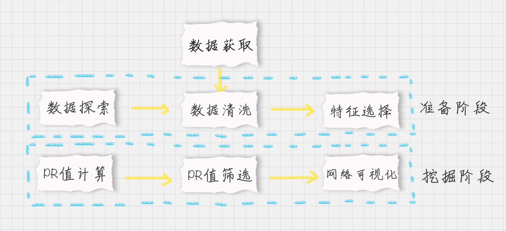

# 33丨PageRank（下）：分析希拉里邮件中的人物关系

陈旸 2019-02-27





09:13

讲述：陈旸 大小：8.45M

<audio title="33丨PageRank（下）：分析希拉里邮件中的人物关系" src="https://res001.geekbang.org//media/audio/26/29/26184d17ba65dc29e7af467ae4c59a29/ld/ld.m3u8"></audio>

上节课我们讲到 PageRank 算法经常被用到网络关系的分析中，比如在社交网络中计算个人的影响力，计算论文的影响力或者网站的影响力等。

今天我们就来做一个关于 PageRank 算法的实战，在这之前，你需要思考三个问题：

1. 如何使用工具完成 PageRank 算法，包括使用工具创建网络图，设置节点、边、权重等，并通过创建好的网络图计算节点的 PR 值；
2. 对于一个实际的项目，比如希拉里的 9306 封邮件（工具包中邮件的数量），如何使用 PageRank 算法挖掘出有影响力的节点，并且绘制网络图；
3. 如何对创建好的网络图进行可视化，如果网络中的节点数较多，如何筛选重要的节点进行可视化，从而得到精简的网络关系图。

## 如何使用工具实现 PageRank 算法

PageRank 算法工具在 sklearn 中并不存在，我们需要找到新的工具包。实际上有一个关于图论和网络建模的工具叫 NetworkX，它是用 Python 语言开发的工具，内置了常用的图与网络分析算法，可以方便我们进行网络数据分析。

上节课，我举了一个网页权重的例子，假设一共有 4 个网页 A、B、C、D，它们之间的链接信息如图所示：


 针对这个例子，我们看下用 NetworkX 如何计算 A、B、C、D 四个网页的 PR 值，具体代码如下：

```

import networkx as nx

# 创建有向图

G = nx.DiGraph() 

# 有向图之间边的关系

edges = [("A", "B"), ("A", "C"), ("A", "D"), ("B", "A"), ("B", "D"), ("C", "A"), ("D", "B"), ("D", "C")]

for edge in edges:

    G.add_edge(edge[0], edge[1])

pagerank_list = nx.pagerank(G, alpha=1)

print("pagerank 值是：", pagerank_list)


```

NetworkX 工具把中间的计算细节都已经封装起来了，我们直接调用 PageRank 函数就可以得到结果：

```

pagerank 值是： {'A': 0.33333396911621094, 'B': 0.22222201029459634, 'C': 0.22222201029459634, 'D': 0.22222201029459634}


```

我们通过 NetworkX 创建了一个有向图之后，设置了节点之间的边，然后使用 PageRank 函数就可以求得节点的 PR 值，结果和上节课中我们人工模拟的结果一致。

好了，运行完这个例子之后，我们来看下 NetworkX 工具都有哪些常用的操作。

**1. 关于图的创建**

图可以分为无向图和有向图，在  NetworkX 中分别采用不同的函数进行创建。无向图指的是不用节点之间的边的方向，使用 nx.Graph()  进行创建；有向图指的是节点之间的边是有方向的，使用 nx.DiGraph() 来创建。在上面这个例子中，存在 A→D 的边，但不存在 D→A  的边。

**2. 关于节点的增加、删除和查询**

如果想在网络中增加节点，可以使用  G.add_node(‘A’) 添加一个节点，也可以使用 G.add_nodes_from([‘B’,‘C’,‘D’,‘E’])  添加节点集合。如果想要删除节点，可以使用 G.remove_node(node) 删除一个指定的节点，也可以使用  G.remove_nodes_from([‘B’,‘C’,‘D’,‘E’]) 删除集合中的节点。

那么该如何查询节点呢？

如果你想要得到图中所有的节点，就可以使用 G.nodes()，也可以用 G.number_of_nodes() 得到图中节点的个数。

**3. 关于边的增加、删除、查询**

增加边与添加节点的方式相同，使用  G.add_edge(“A”, “B”) 添加指定的“从 A 到 B”的边，也可以使用 add_edges_from  函数从边集合中添加。我们也可以做一个加权图，也就是说边是带有权重的，使用 add_weighted_edges_from  函数从带有权重的边的集合中添加。在这个函数的参数中接收的是 1 个或多个三元组 [u,v,w] 作为参数，u、v、w 分别代表起点、终点和权重。

另外，我们可以使用 remove_edge 函数和 remove_edges_from 函数删除指定边和从边集合中删除。

另外可以使用 edges() 函数访问图中所有的边，使用 number_of_edges() 函数得到图中边的个数。

以上是关于图的基本操作，如果我们创建了一个图，并且对节点和边进行了设置，就可以找到其中有影响力的节点，原理就是通过 PageRank 算法，使用 nx.pagerank(G) 这个函数，函数中的参数 G 代表创建好的图。

## 如何用 PageRank 揭秘希拉里邮件中的人物关系

了解了 NetworkX 工具的基础使用之后，我们来看一个实际的案例：希拉里邮件人物关系分析。

希拉里邮件事件相信你也有耳闻，对这个数据的背景我们就不做介绍了。你可以从 GitHub 上下载这个数据集：<https://github.com/cystanford/PageRank>。

整个数据集由三个文件组成：Aliases.csv，Emails.csv  和 Persons.csv，其中 Emails 文件记录了所有公开邮件的内容，发送者和接收者的信息。Persons  这个文件统计了邮件中所有人物的姓名及对应的 ID。因为姓名存在别名的情况，为了将邮件中的人物进行统一，我们还需要用 Aliases  文件来查询别名和人物的对应关系。

整个数据集包括了 9306 封邮件和 513  个人名，数据集还是比较大的。不过这一次我们不需要对邮件的内容进行分析，只需要通过邮件中的发送者和接收者（对应 Emails.csv 文件中的  MetadataFrom 和 MetadataTo 字段）来绘制整个关系网络。因为涉及到的人物很多，因此我们需要通过 PageRank  算法计算每个人物在邮件关系网络中的权重，最后筛选出来最有价值的人物来进行关系网络图的绘制。

了解了数据集和项目背景之后，我们来设计到执行的流程步骤：



1. 首先我们需要加载数据源；
2. 在准备阶段：我们需要对数据进行探索，在数据清洗过程中，因为邮件中存在别名的情况，因此我们需要统一人物名称。另外邮件的正文并不在我们考虑的范围内，只统计邮件中的发送者和接收者，因此我们筛选  MetadataFrom 和 MetadataTo  这两个字段作为特征。同时，发送者和接收者可能存在多次邮件往来，需要设置权重来统计两人邮件往来的次数。次数越多代表这个边（从发送者到接收者的边）的权重越高；
3. 在挖掘阶段：我们主要是对已经设置好的网络图进行 PR 值的计算，但邮件中的人物有 500 多人，有些人的权重可能不高，我们需要筛选 PR  值高的人物，绘制出他们之间的往来关系。在可视化的过程中，我们可以通过节点的 PR 值来绘制节点的大小，PR 值越大，节点的绘制尺寸越大。

设置好流程之后，实现的代码如下：

```

# -*- coding: utf-8 -*-

# 用 PageRank 挖掘希拉里邮件中的重要任务关系

import pandas as pd

import networkx as nx

import numpy as np

from collections import defaultdict

import matplotlib.pyplot as plt

# 数据加载

emails = pd.read_csv("./input/Emails.csv")

# 读取别名文件

file = pd.read_csv("./input/Aliases.csv")

aliases = {}

for index, row in file.iterrows():

    aliases[row['Alias']] = row['PersonId']

# 读取人名文件

file = pd.read_csv("./input/Persons.csv")

persons = {}

for index, row in file.iterrows():

    persons[row['Id']] = row['Name']

# 针对别名进行转换        

def unify_name(name):

    # 姓名统一小写

    name = str(name).lower()

    # 去掉, 和 @后面的内容

    name = name.replace(",","").split("@")[0]

    # 别名转换

    if name in aliases.keys():

        return persons[aliases[name]]

    return name

# 画网络图

def show_graph(graph, layout='spring_layout'):

    # 使用 Spring Layout 布局，类似中心放射状

    if layout == 'circular_layout':

        positions=nx.circular_layout(graph)

    else:

        positions=nx.spring_layout(graph)

    # 设置网络图中的节点大小，大小与 pagerank 值相关，因为 pagerank 值很小所以需要 *20000

    nodesize = [x['pagerank']*20000 for v,x in graph.nodes(data=True)]

    # 设置网络图中的边长度

    edgesize = [np.sqrt(e[2]['weight']) for e in graph.edges(data=True)]

    # 绘制节点

    nx.draw_networkx_nodes(graph, positions, node_size=nodesize, alpha=0.4)

    # 绘制边

    nx.draw_networkx_edges(graph, positions, edge_size=edgesize, alpha=0.2)

    # 绘制节点的 label

    nx.draw_networkx_labels(graph, positions, font_size=10)

    # 输出希拉里邮件中的所有人物关系图

    plt.show()

# 将寄件人和收件人的姓名进行规范化

emails.MetadataFrom = emails.MetadataFrom.apply(unify_name)

emails.MetadataTo = emails.MetadataTo.apply(unify_name)

# 设置遍的权重等于发邮件的次数

edges_weights_temp = defaultdict(list)

for row in zip(emails.MetadataFrom, emails.MetadataTo, emails.RawText):

    temp = (row[0], row[1])

    if temp not in edges_weights_temp:

        edges_weights_temp[temp] = 1

    else:

        edges_weights_temp[temp] = edges_weights_temp[temp] + 1

# 转化格式 (from, to), weight => from, to, weight

edges_weights = [(key[0], key[1], val) for key, val in edges_weights_temp.items()]

# 创建一个有向图

graph = nx.DiGraph()

# 设置有向图中的路径及权重 (from, to, weight)

graph.add_weighted_edges_from(edges_weights)

# 计算每个节点（人）的 PR 值，并作为节点的 pagerank 属性

pagerank = nx.pagerank(graph)

# 将 pagerank 数值作为节点的属性

nx.set_node_attributes(graph, name = 'pagerank', values=pagerank)

# 画网络图

show_graph(graph)

 

# 将完整的图谱进行精简

# 设置 PR 值的阈值，筛选大于阈值的重要核心节点

pagerank_threshold = 0.005

# 复制一份计算好的网络图

small_graph = graph.copy()

# 剪掉 PR 值小于 pagerank_threshold 的节点

for n, p_rank in graph.nodes(data=True):

    if p_rank['pagerank'] < pagerank_threshold: 

        small_graph.remove_node(n)

# 画网络图, 采用 circular_layout 布局让筛选出来的点组成一个圆

show_graph(small_graph, 'circular_layout')


```

运行结果如下：


 
 针对代码中的几个模块我做个简单的说明：

**1. 函数定义**

人物的名称需要统一，因此我设置了 unify_name 函数，同时设置了 show_graph 函数将网络图可视化。NetworkX 提供了多种可视化布局，这里我使用 spring_layout 布局，也就是呈中心放射状。

除了 spring_layout 外，NetworkX 还有另外三种可视化布局，circular_layout（在一个圆环上均匀分布节点），random_layout（随机分布节点 ），shell_layout（节点都在同心圆上）。

**2. 计算边权重**

邮件的发送者和接收者的邮件往来可能不止一次，我们需要用两者之间邮件往来的次数计算这两者之间边的权重，所以我用  edges_weights_temp 数组存储权重。而上面介绍过在 NetworkX 中添加权重边（即使用  add_weighted_edges_from 函数）的时候，接受的是 u、v、w  的三元数组，因此我们还需要对格式进行转换，具体转换方式见代码。

**3.PR 值计算及筛选**

我使用  nx.pagerank(graph) 计算了节点的 PR 值。由于节点数量很多，我们设置了 PR 值阈值，即  pagerank_threshold=0.005，然后遍历节点，删除小于 PR 值阈值的节点，形成新的图 small_graph，最后对  small_graph 进行可视化（对应运行结果的第二张图）。

## 总结

在上节课中，我们通过矩阵乘法求得网页的权重，这节课我们使用 NetworkX 可以得到相同的结果。

另外我带你用 PageRank 算法做了一次实战，我们将一个复杂的网络图，通过 PR 值的计算、筛选，最终得到了一张精简的网络图。在这个过程中我们学习了 NetworkX 工具的使用，包括创建图、节点、边及 PR 值的计算。

实际上掌握了  PageRank 的理论之后，在实战中往往就是一行代码的事。但项目与理论不同，项目中涉及到的数据量比较大，你会花 80% 的时间（或 80%  的代码量）在预处理过程中，比如今天的项目中，我们对别名进行了统一，对边的权重进行计算，同时还需要把计算好的结果以可视化的方式呈现。


 今天我举了一个网页权重的例子，假设一共有 4 个网页 A、B、C、D。它们之间的链接信息如文章中的图示。我们假设用户有 15% 的概率随机跳转，请你编写代码重新计算这 4 个节点的 PR 值。

欢迎你在评论区与我分享你的答案，也欢迎点击“请朋友读”，把这篇文章分享给你的朋友或者同事。


© 版权归极客邦科技所有，未经许可不得传播售卖。 页面已增加防盗追踪，如有侵权极客邦将依法追究其法律责任。         


夜瓜居士


Ctrl + Enter 发表

0/2000字

提交留言

## 精选留言(7)

- 

  szm 

  有2个问题：
  第一个：pagerank已经是字典类型了，为什么还要用pagerank_list = {node: rank for node, rank in pagerank.items()}将其转换为字典呢？是不是删掉这个语句也没关系？
  第二个：阈值大于0.005的图仍有很多重叠在一起，无法观看，请问怎样才能让画出来的图像美观呢？

  ** 1

  2019-03-04

  编辑回复: 第一个问题：对的，pagerank是字典类型，直接使用nx.set_node_attributes(graph, name = 'pagerank', values=pagerank)是OK的
  第二个问题，阈值大于0.005时，很多图重叠在一起，可以采用nx.circular_layout(graph)来进行显示。这样可以让筛选出来的点都分布到一个圆上，来显示出来他们之间的关系。

- 

  白夜 

  默认阻尼就是0.85，alpha去掉完事、、
  pagerank 值是： {'A': 0.3245609358176831, 'B': 0.22514635472743894, 'C': 0.22514635472743894, 'D': 0.22514635472743894}

  ** 1

  2019-02-27

  编辑回复: 这样使用最方便，alpha默认是0.85

- 

  third 

  提问：
   UserWarning:  Pandas doesn't allow columns to be created via a new attribute name -  see  https://pandas.pydata.org/pandas-docs/stable/indexing.html#attribute-access

  不允许列被新属性创建？？？

  点击网页进去，也没有找到这个警告。
  需要修改或者别的什么东西吗？

  ** 1

  2019-02-27

- 

  third 

  pagerank 值是： {'C': 0.22514635472743896, 'A': 0.3245609358176832, 'D': 0.22514635472743894, 'B': 0.22514635472743896}

  import networkx as nx
  \# 创建有向图
  G = nx.DiGraph()
  \# 有向图之间边的关系
  edges = [("A", "B"), ("A", "C"), ("A", "D"), ("B", "A"), ("B", "D"), ("C", "A"), ("D", "B"), ("D", "C")]
  for edge in edges:
      G.add_edge(edge[0], edge[1])
  pagerank_list = nx.pagerank(G, alpha=0.85)
  print("pagerank 值是：", pagerank_list)

  ** 1

  2019-02-27

  编辑回复: 正确。

- 

  滢 

  %15跳转概率，对应的阻尼因子是0.85 ， 阻尼因子默认就是0.85，所以在创建的时候可以直接省略啊alpha参数的设定。
  import networkx
  \#创建有向图
  digraph = networkx.DiGraph()
  \#有向图之间边的关系
  edges = [("A", "B"), ("A", "C"), ("A", "D"), ("B", "A"), ("B", "D"), ("C", "A"), ("D", "B"), ("D", "C")]
  for edge in edges:
      digraph.add_edge(edge[0],edge[1])
  pagerank_list = networkx.pagerank(digraph)
  print('PageRank 值是：',pagerank_list)
  输出结果：
  PageRank 值是： {'A': 0.3245609358176831, 'B': 0.22514635472743894, 'C': 0.22514635472743894, 'D': 0.22514635472743894}

  ** 

  2019-04-21

- 

  mickey 

  import networkx as nx
  \# 创建有向图
  G = nx.DiGraph()
  \# 有向图之间边的关系
  edges = [("A", "B"), ("A", "C"), ("A", "D"), ("B", "A"), ("B", "D"), ("C", "A"), ("D", "B"), ("D", "C")]
  for edge in edges:
      G.add_edge(edge[0], edge[1])
  pagerank_list = nx.pagerank(G) #alpha为阻尼因子，默认值：0.85
  print("pagerank值是：", pagerank_list)

  pagerank值是： {'A': 0.3245609358176831, 'B': 0.22514635472743894, 'C': 0.22514635472743894, 'D': 0.22514635472743894}

  ** 

  2019-03-05

- 

  王彬成 

  1、pagerank_list=nx.pagerank(G,alpha=1)理解
  参考链接：https://networkx.github.io/documentation/networkx-1.10/reference/generated/networkx.algorithms.link_analysis.pagerank_alg.pagerank.html
  alpha指的是阻尼因子。根据公式了解到，这因子代表用户按照跳转链接来上网的概率。
  题目说15%的概率随机跳转，所以阻尼因子为0.85

  2、代码
  import networkx as nx
  \# 创建有向图
  G=nx.DiGraph()
  \# 有向图之间边的关系
  edges = [("A", "B"), ("A", "C"), ("A", "D"), ("B", "A"), ("B", "D"), ("C", "A"), ("D", "B"), ("D", "C")]
  for edge in edges:
      G.add_edge(edge[0],edge[1])
  pagerank_list=nx.pagerank(G,alpha=0.85)
  print('pagerank 值是: ', pagerank_list)

  3、结果
  pagerank 值是:  {'A': 0.3245609358176831, 'B': 0.22514635472743894, 'C': 0.22514635472743894, 'D': 0.22514635472743894}

  

  ** 

  2019-03-01

  编辑回复: 结果正确，对alpha阻尼因子的理解也正确