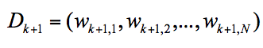
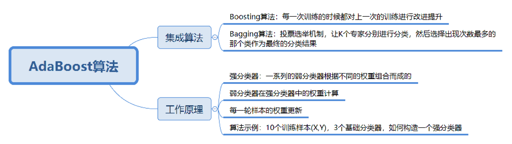

# 34丨AdaBoost（上）：如何使用AdaBoost提升分类器性能？

陈旸 2019-03-01



08:42

讲述：陈旸 大小：7.97M

<audio title="34丨AdaBoost（上）：如何使用AdaBoost提升分类器性能？" src="https://res001.geekbang.org//media/audio/d0/4a/d0fb67a24425fe85dbd3bd7a7389e64a/ld/ld.m3u8"></audio>

今天我们学习 AdaBoost 算法。在数据挖掘中，分类算法可以说是核心算法，其中 AdaBoost 算法与随机森林算法一样都属于分类算法中的集成算法。

集成的含义就是集思广益，博取众长，当我们做决定的时候，我们先听取多个专家的意见，再做决定。集成算法通常有两种方式，分别是投票选举（bagging）和再学习（boosting）。投票选举的场景类似把专家召集到一个会议桌前，当做一个决定的时候，让  K 个专家（K 个模型）分别进行分类，然后选择出现次数最多的那个类作为最终的分类结果。再学习相当于把 K 个专家（K  个分类器）进行加权融合，形成一个新的超级专家（强分类器），让这个超级专家做判断。

所以你能看出来，投票选举和再学习还是有区别的。Boosting  的含义是提升，它的作用是每一次训练的时候都对上一次的训练进行改进提升，在训练的过程中这 K 个“专家”之间是有依赖性的，当引入第 K  个“专家”（第 K 个分类器）的时候，实际上是对前 K-1 个专家的优化。而 bagging 在做投票选举的时候可以并行计算，也就是 K  个“专家”在做判断的时候是相互独立的，不存在依赖性。

## AdaBoost 的工作原理

了解了集成算法的两种模式之后，我们来看下今天要讲的 AdaBoost 算法。

AdaBoost 的英文全称是 Adaptive Boosting，中文含义是自适应提升算法。它由 Freund 等人于 1995 年提出，是对 Boosting 算法的一种实现。

什么是  Boosting 算法呢？Boosting  算法是集成算法中的一种，同时也是一类算法的总称。这类算法通过训练多个弱分类器，将它们组合成一个强分类器，也就是我们俗话说的“三个臭皮匠，顶个诸葛亮”。为什么要这么做呢？因为臭皮匠好训练，诸葛亮却不好求。因此要打造一个诸葛亮，最好的方式就是训练多个臭皮匠，然后让这些臭皮匠组合起来，这样往往可以得到很好的效果。这就是  Boosting 算法的原理。

 我可以用上面的图来表示最终得到的强分类器，你能看出它是通过一系列的弱分类器根据不同的权重组合而成的。

假设弱分类器为 *G**i*(*x*)

，它在强分类器中的权重 

*α**i*

，那么就可以得出强分类器 f(x)：

 有了这个公式，为了求解强分类器，你会关注两个问题：

1. 如何得到弱分类器，也就是在每次迭代训练的过程中，如何得到最优弱分类器？
2. 每个弱分类器在强分类器中的权重是如何计算的？

我们先来看下第二个问题。实际上在一个由 K 个弱分类器中组成的强分类器中，如果弱分类器的分类效果好，那么权重应该比较大，如果弱分类器的分类效果一般，权重应该降低。所以我们需要基于这个弱分类器对样本的分类错误率来决定它的权重，用公式表示就是：

 其中 *e**i*

 代表第 i 个分类器的分类错误率。

然后我们再来看下第一个问题，如何在每次训练迭代的过程中选择最优的弱分类器？

实际上，AdaBoost  算法是通过改变样本的数据分布来实现的。AdaBoost  会判断每次训练的样本是否正确分类，对于正确分类的样本，降低它的权重，对于被错误分类的样本，增加它的权重。再基于上一次得到的分类准确率，来确定这次训练样本中每个样本的权重。然后将修改过权重的新数据集传递给下一层的分类器进行训练。这样做的好处就是，通过每一轮训练样本的动态权重，可以让训练的焦点集中到难分类的样本上，最终得到的弱分类器的组合更容易得到更高的分类准确率。

我们可以用 *D**k*+1

 代表第 k+1 轮训练中，样本的权重集合，其中 

*W**k*+1,1

 代表第 k+1 轮中第一个样本的权重，以此类推 

*W**k*+1,*N*

 代表第 k+1 轮中第 N 个样本的权重，因此用公式表示为：

 第 k+1 轮中的样本权重，是根据该样本在第 k 轮的权重以及第 k 个分类器的准确率而定，具体的公式为：

## AdaBoost 算法示例

了解 AdaBoost 的工作原理之后，我们看一个例子，假设我有 10 个训练样本，如下所示：

 现在我希望通过 AdaBoost 构建一个强分类器。

该怎么做呢？按照上面的 AdaBoost 工作原理，我们来模拟一下。

首先在第一轮训练中，我们得到 10 个样本的权重为 1/10，即初始的 10 个样本权重一致，D1=(0.1, 0.1, 0.1, 0.1, 0.1, 0.1, 0.1, 0.1, 0.1, 0.1)。

假设我有 3 个基础分类器：

 我们可以知道分类器 f1 的错误率为 0.3，也就是 x 取值 6、7、8 时分类错误；分类器 f2 的错误率为 0.4，即 x 取值 0、1、2、9 时分类错误；分类器 f3 的错误率为 0.3，即 x 取值为 3、4、5 时分类错误。

这 3 个分类器中，f1、f3 分类器的错误率最低，因此我们选择 f1 或 f3 作为最优分类器，假设我们选 f1 分类器作为最优分类器，即第一轮训练得到：

 根据分类器权重公式得到：

 然后我们对下一轮的样本更新求权重值，代入 *W**k*+1,*i*

 和 

*D**k*+1

 的公式，可以得到新的权重矩阵：D2=(0.0715, 0.0715, 0.0715, 0.0715, 0.0715, 0.0715, 0.1666, 0.1666, 0.1666, 0.0715)。

在第二轮训练中，我们继续统计三个分类器的准确率，可以得到分类器  f1 的错误率为 0.1666*3，也就是 x 取值为 6、7、8 时分类错误。分类器 f2 的错误率为 0.0715*4，即 x 取值为  0、1、2、9 时分类错误。分类器 f3 的错误率为 0.0715*3，即 x 取值 3、4、5 时分类错误。

在这 3 个分类器中，f3 分类器的错误率最低，因此我们选择 f3 作为第二轮训练的最优分类器，即：

 根据分类器权重公式得到：

 同样，我们对下一轮的样本更新求权重值，代入 *W**k*+1,*i*

 和 

*D**k*+1

 的公式，可以得到 D3=(0.0455,0.0455,0.0455,0.1667, 0.1667,0.01667,0.1060, 0.1060, 0.1060, 0.0455)。

在第三轮训练中，我们继续统计三个分类器的准确率，可以得到分类器  f1 的错误率为 0.1060*3，也就是 x 取值 6、7、8 时分类错误。分类器 f2 的错误率为 0.0455*4，即 x 取值为  0、1、2、9 时分类错误。分类器 f3 的错误率为 0.1667*3，即 x 取值 3、4、5 时分类错误。

在这 3 个分类器中，f2 分类器的错误率最低，因此我们选择 f2 作为第三轮训练的最优分类器，即：

 我们根据分类器权重公式得到：

 假设我们只进行 3 轮的训练，选择 3 个弱分类器，组合成一个强分类器，那么最终的强分类器 G(x) = 0.4236G1(x) + 0.6496G2(x)+0.7514G3(x)。

实际上 AdaBoost 算法是一个框架，你可以指定任意的分类器，通常我们可以采用 CART 分类器作为弱分类器。通过上面这个示例的运算，你体会一下 AdaBoost 的计算流程即可。

## 总结

今天我给你讲了  AdaBoost  算法的原理，你可以把它理解为一种集成算法，通过训练不同的弱分类器，将这些弱分类器集成起来形成一个强分类器。在每一轮的训练中都会加入一个新的弱分类器，直到达到足够低的错误率或者达到指定的最大迭代次数为止。实际上每一次迭代都会引入一个新的弱分类器（这个分类器是每一次迭代中计算出来的，是新的分类器，不是事先准备好的）。

在弱分类器的集合中，你不必担心弱分类器太弱了。实际上它只需要比随机猜测的效果略好一些即可。如果随机猜测的准确率是  50% 的话，那么每个弱分类器的准确率只要大于 50% 就可用。AdaBoost 的强大在于迭代训练的机制，这样通过 K  个“臭皮匠”的组合也可以得到一个“诸葛亮”（强分类器）。

当然在每一轮的训练中，我们都需要从众多“臭皮匠”中选择一个拔尖的，也就是这一轮训练评比中的最优“臭皮匠”，对应的就是错误率最低的分类器。当然每一轮的样本的权重都会发生变化，这样做的目的是为了让之前错误分类的样本得到更多概率的重复训练机会。

同样的原理在我们的学习生活中也经常出现，比如善于利用错题本来提升学习效率和学习成绩。

 最后你能说说你是如何理解 AdaBoost 中弱分类器，强分类器概念的？另外，AdaBoost 算法是如何训练弱分类器从而得到一个强分类器的？

欢迎你在评论区与我分享你的答案，也欢迎点击“请朋友读”，把这篇文章分享给你的朋友或者同事。

© 版权归极客邦科技所有，未经许可不得传播售卖。 页面已增加防盗追踪，如有侵权极客邦将依法追究其法律责任。         

夜瓜居士

Ctrl + Enter 发表

0/2000字

提交留言

## 精选留言(11)

- 

  third 

  
  作业
  1.假设分类正确就是吃鸡成功。

  1）训练多个弱分类器，并不断迭代弱分类器，选择最优弱分类器
  枪法，一个弱分类器，你可以通过玩的越来越多，练习越来越好
  身法，一个弱分类器，同理
  意识，一个弱分类器。同理
  ···

  
  2）将弱分类器组合起来，形成一个强分类器

  枪法，身法，眼神，你只有一个的话，实际上，你的吃鸡概率并不高。但是三个都好的人，吃鸡概率就是高。这就是强分类器。

  2.把分类正确理解成功的的话，

  1）训练多个弱分类器，并不断迭代弱分类器，选择最优弱分类器
  努力获取了一个领域的知识和道理，就是一个弱分类器，不断地学习和精进，在一个知识领域变得更强

  3）将弱分类器组合起来，形成一个强分类器
  合理跨界，将两个领域的知识组合起来，产生新收益。比如软硬件结合的苹果，仅一家公司就占据了整个手机市场利润的50%以上。

  两个领域的组合，就是一个强分类器。

  
  理解
  1.通过修改样本的数据分布来实现算法的。
  正确分类的，就少分点
  错误分类的，就多分点。

  像做题，
  做正确的题，下次就少做点，反正会了。
  做错的题，下次多做点，集中在错题上
  每次这个题都在变化，随着你学习的深入，你做错的题会越来越少。

  
  2.样本的权重时根据之前的k论权重以及k个分类器的准确率而定的。

  你决定做什么样题。
  1.取决于你上次做对了什么题，做错了什么题
  2.做正确了，你就少做点。
  3.做错了，你就多做点。

  提问：Zk是啥意思？，yi是啥意思？

  流程
  1.获取基础权重
  2.获取基础分类器
  3.计算错误率，选择错误率最低的为最优分类器
  4.通过计算分类器权重公式，达到减少正确样本数据分布，增加错误样本数据分布
  5.代入W k+1,i和D k+1 的公式，得到新的权重矩阵
  7.在新的权重矩阵上，计算错误率，选择错误最低的为最优分类器
  剩下的就是迭代，重复
  直到迭代完成，获得强分类器

  ** 3

  2019-03-01

- 

  Ehh1ouyz 

  补充：这里的Zk是归一化因子。

  ** 2

  2019-03-03

- 

  王彬成 

  如何理解 AdaBoost 中弱分类器，强分类器概念的？另外，AdaBoost 算法是如何训练弱分类器从而得到一个强分类器的？

  1、弱分类器，是指基础分类器，正确率略高于50%的那种。
  强分类器是通过训练出多个弱分类器，并赋值权重，最后形成弱分类器+权重的模型。

  2、得到强分类器的方法：
  参考链接：https://www.cnblogs.com/hlongch/p/5734293.html
  adaboost算法的核心思想是针对同一个训练集训练不同的分类器(弱分类器)，然后把这些弱分类器集合起来，构成一个更强的最终分类器(强分类器)。

  1.一开始，给训练数据中的每一个样本，赋予其一个权重，权重都初始化成相等值。如（1/样本数量）
  2.首先在训练数据中训练出一个弱分类器并计算改分类器的错误率，选取错误率最小的分类器，并基于分类器错误率计算其权重值alpha。
  3.在分类器的第二次训练当中，将会重新调整每个样本的权重，其中第一次分对的样本的权重将会降低，而第一次分错的样本权重将会提高。然后在同一数据集上再次训练弱分类器。得出第二个错误率小的分类器，并基于错误率计算权重。
  4.重复“重新分配样本权重——计算分类器错误率——选取分类器——计算分类器权重”

  5.最后将每次训练得到的分类器最后融合起来，作为最后的决策分类器。

  ** 1

  2019-03-01

- 

  那时刻 

  老师，你好。请问样本权重的计算公式是个指数函数exp，为啥是指数函数？不用指数的话，有啥不同么？

  ** 1

  2019-03-01

- 

  滨滨 

  弱分类器分类正确率比随机稍微高一点，每次选择相对最优的分类器，然后对分类错误的部分加强训练，最后得到一个强分类器。

  1.一开始，给训练数据中的每一个样本，赋予其一个权重，权重都初始化成相等值。如（1/样本数量）
  2.首先在训练数据中训练出一个弱分类器并计算改分类器的错误率，选取错误率最小的分类器，并基于分类器错误率计算其权重值alpha。
  3.在分类器的第二次训练当中，将会重新调整每个样本的权重，其中第一次分对的样本的权重将会降低，而第一次分错的样本权重将会提高。然后在同一数据集上再次训练弱分类器。得出第二个错误率小的分类器，并基于错误率计算权重。
  4.重复“重新分配样本权重——计算分类器错误率——选取分类器——计算分类器权重”

  5.最后将每次训练得到的分类器最后融合起来，作为最后的决策分类器。

  ** 

  2019-04-21

- 

  三硝基甲苯 

  根据我的反推，首先这里的所有涉及到对数和指数的都是以e为底的，然后就是Dk+1这一步，需要先计算Zk，这个就是把 wk*e^(-ak*y*Gk(x))把全部的加起来就是了，然后再去算Wk+1，然后就进一步可以算出Dk+1。
  个人理解就是AdaBoost就是先把数据通过权重的方式分割成不同的部分，然后每个部分再去交给在这些里较为专业的分类器去分类，通过迭代，再把计算的结果带上权重后，就是结果了。

  ** 

  2019-03-23

- 

  李沛欣 

  通过训练多个弱分类器，集成一个强分类器。

  ** 

  2019-03-16

- 

  Python 

  弱分类器是决策层，强分类器是决策汇总后的结果

  ** 

  2019-03-02

- 

  忠超 

  您好。我有两个地方不明白，请老师答疑。为什么每次迭代的权重的计算方式是那么设置？另外，每次迭代得到的分类器前面的权重之和也不为1？还有，错误率等于权重乘以分类错误的个数，这个也不太理解。

  ** 

  2019-03-01

- 

  未来已来 

  请问每次迭代之后，错误率是如何进行计算的呢？

  ** 

  2019-03-01

- 

  未来已来 

  我的显示界面中，很多数学符号变成了[Math Processing Error]

  ** 

  2019-03-01