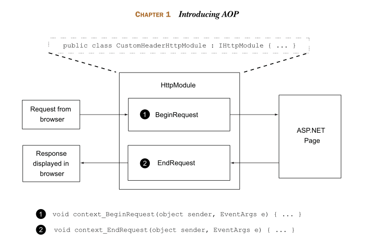
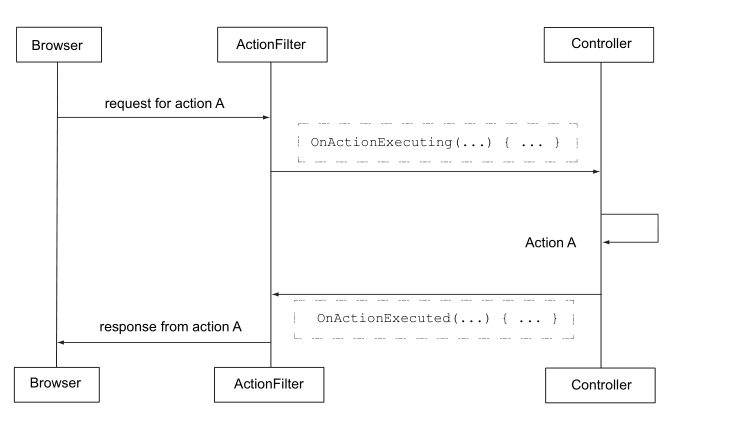
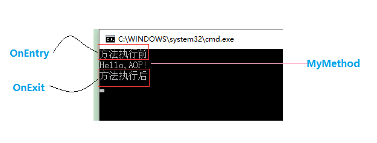

**返回《.Net中的AOP》系列学习总目录**

------

## 本篇目录

- **AOP是什么？**
- **Hello，World！**
- **小结**

------

本系列的源码本人已托管于Coding上：**点击查看**，想要注册Coding的可以**点击该连接注册**。

本系列的实验环境：VS 2013 Update 5（建议最好使用集成了Nuget的VS版本，VS Express版也够用）。

这篇博客覆盖的内容包括：

- AOP简史
- AOP解决什么问题
- 使用PostSharp编写一个简单的切面

### AOP是什么？

AOP在计算机科学领域还是相对年轻的概念，由Xerox PARC公司发明。Gregor Kiczales  在1997年领导一队研究人员首次介绍了AOP。当时他们关心的问题是如何在大型面向对象的代码库中重复使用那些必要且代价高的样板，那些样板的通用例子具有日志，缓存和事务功能。

在最终的“AOP”研究报告中，Kiczales和他的团队描述了OOP技术不能捕获和解决的问题，他们发现横切关注点最终分散在整个代码中，这种交错的代码会变得越来越难开发和维护。他们分析了所有技术原因，包括为何这种纠缠模式会出现，为什么避免起来这么困难，甚至涉及了设计模式的正确使用。

该报告描述了一种解决方案作为OOP的补充，即使用“切面aspects”封装横切关注点以及允许重复使用。最终实现了AspectJ,就是今天Java开发者仍然使用的一流AOP工具。

如果你想深入研究AOP的话，不妨读一下该报告http://www.cs.ubc.ca/~gregor/papers/kiczales-ECOOP1997-AOP.pdf。

该系列不会让你觉得使用AOP很复杂，相反，只需要关注如何在.NET项目中使用AOP解决问题。

#### 功能

**AOP的目的：横切关注点**

------

推动AOP发明的主要驱动因素之一是OOP中横切关注点的出现。横切关注点是用于一个系统的多个部分的片段功能，它更偏向是一个架构概念而不是技术问题。横切关注点和非功能需求有许多重叠：非功能需求经常横切应用程序的多个部分。

> #### 功能需求和非功能需求
>
> 功能需求指项目中的增值需求，比如业务逻辑，UI，持久化（数据库）。
>  非功能需求是项目中次要的，但却不可缺少的元素，比如日志记录，安全，性能和数据事务等等。

无论是否使用AOP，横切关注点都是存在的。比如有个方法X，如果想要记录日志C，那么该方法必须执行X和C。如果需要为方法Y和Z记录日志，那么必须在每个方法中放置C。这里，C就是横切关注点。

**切面的任务：通知（Advice）**

------

通知就是执行横切关注点的代码，比如对于横切关注点logging，该代码可能是log4net或者NLog的库的调用，也可能是单条语句如`Log.Write ("information")`或检查和记录参数，时间戳，性能指标等的批量逻辑。

Advice相当于AOP的“what”，下面看看“where”。

**切面的映射：切入点（PointCut）**

------

PointCut相当于AOP的“where”，在定义一个切入点之前，先要定义一个连接点（join point）。连接点就是程序执行的逻辑步骤之间的地方。为了方便理解，看一下下面的代码：

```
nameService.SaveName();//nameService 是 NameService类型
nameService.GetListOfNames();
addressService.SaveAddress();//addressService 是 AddressService类型
```

以上代码中的任何一个间隙都可以看作是一个连接点。只说这一句话，你肯定还是不知道有多少连接点。我们用图示的方式来解释一下，就解释第一行代码：


看见了吧？只第一行代码就3个连接点，现在你应该明白连接点的意思了吧！现在再来看看切入点，一个切入点是一系列连接点（或者一个描述一系列连接点的表达式）。举个例子，一个连接点是“调用svc.SaveName()之前”，那么一个切入点就是“调用任何方法之前”。切入点可以很简单，比如“类中的每个方法之前”，也可以很复杂，比如“MyServices命名空间下的类的每个方法，除了私有方法和DeleteName方法”。

假设我想在NameService对象的退出连接点插入advice（一些代码段），切入点就可以表达为“NameService的方法退出时”。如何在代码中表达依赖于你正在使用的AOP工具的切入点呢？事实上，可以定义一个连接点不意味着使用工具可以到达该连接。一些连接点太低级了，一般不可行。

一旦确认了advice（what）和pointcut（where），就可以定义切面了。切面通过叫做编织（weaving）的过程工作。

**AOP如何工作：编织（Weaving）**

------

没有AOP的时候，横切关注点代码经常是和核心业务逻辑混合在一个方法中的，这种方式就是传说中的**缠绕（tangling）**，因为核心业务逻辑和横切关注点代码就像意大利面条那样缠绕在一起。当横切关注点代码用于多个方法和多个类时（一般使用复制，粘贴），这种方式叫做**分散（scattering）**，因为代码分散在整个应用中。用一张图解释如下：


使用AOP重构时，需要把所有的红色代码移到一个新类中，只保留执行业务逻辑的绿色代码。然后通过指定一个切入点告诉AOP工具应用切面（红色的类）到业务类（绿色的类）上。AOP工具执行这个连接步骤的过程就叫编织（weaving）,如下图：


#### 优势

使用AOP的主要优势是**精简代码**，从而使得**容易阅读**，更不容易出bug，以及容易维护。

使得代码容易阅读很重要，因为这样会使得团队成员很舒服并加速阅读。而且，未来你也会感谢你。因为你或许被一个月前写的代码搞晕过。AOP允许你将缠绕的代码移到它自己的类中，从而使得代码更清晰，更具有陈述性。

AOP可以**降低维护开销**，当然，使得代码更容易阅读就会使得维护更容易，此外，如果你在项目中使用了处理线程的样板代码片段，并且重用了，那么必须到处修复或更改代码。如果**使用AOP重构代码到封装的切面**中，只需要在一个地方更改代码就可以了。

**清除意大利面条式代码**

------

你可能听过“温水煮青蛙”的故事，如果要求你在一个大型代码库中添加很多横切关注点，你可能拒绝每次都在一个方法中添加那些代码。但是如果在一个新的项目中或给一个小项目添加功能时，可能只需要几行代码，并且也重复不了几次，你可能就会想着先复制、粘贴，以后再重构精简一下。

“只要能跑起来”的诱惑是很强的，所以才会复制、粘贴，这种分散的或者缠绕的代码已经被分类为反模式（antipattern），叫做散弹式修改。为什么叫散弹式修改？因为除了主要的业务逻辑，经过反复的复制、粘贴，代码和其他的代码混合在一起，更像散弹壳爆炸向整个目标扩散，所以形象地成为“散弹式修改”。**单一职责原则（Single Responsibility Principle）**就是为了避免这种模式的：一个类应该只有一个要修改的原因。

> #### 反模式（Antipatterns）
>
> 反模式是软件工程已确认的一种模式，例如你可以在**“Gang of Four book”（全名是：设计模式：可复用面向对象软件的基础）**中找到任何模式，跟那些好的模式不同，反模式会导致bug，产生昂贵的维护费用以及令人头疼的问题。

复制-粘贴策略可能会帮你快速解决问题，但长期看来，你最终的代码会像昂贵的意大利苗条那样纠缠不清，所以才有了有名的法则**：Don't Repeat yourself(DRY)!**

**减少重复**

------

你可能技术更牛一点或者不屑于使用复制-粘贴，你可能会使用比如**D**I或者**装饰者模式来处理横切关注点**。有进步，因为你这样的话代码就松耦合并且更容易测试。但谈到横切关注点时，**当使用DI时，你最后可能仍然会让代码缠绕或分散。**

试想，你已经将一个横切关注点比如**事务管理（begin/commit/rollback）**重构到一个单独的服务中，伪代码可能像下面那样：

```csharp
public class InvoiceService {
    ITransactionManagementService _transaction;
    IInvoiceData _invoicedb;
    InvoiceService(IInvoiceData invoicedb,
    ITransactionManagementService transaction)//实例化类时，必须传入两个服务，其中一个是处理横切关注点的
    {
    _invoicedb = invoicedb;
    _transaction = transaction;
    }
    void CreateInvoice(ShoppingCart cart) {//CreateInvoice方法必须管理事务的开始和结束，以及核心的业务逻辑
        _transaction.Start();//即使使用了依赖注入，依赖的使用仍是缠绕的
        _invoicedb.CreateNewInvoice();
        foreach(item in cart)
        _invoicedb.AddItem(item);
        _invoicedb.ProcessSalesTax();
        _transaction.Commit();
    }
}
```

正如代码中解释的那样，虽然使用DI比将事务代码硬编码到每个方法更好，而且事务管理是松耦合的，但是`InvoiceService`中的代码仍然是缠绕的：因为**`_transaction.Start()和 _transaction.Commit()`仍然存在该服务中。**这种方法会使得单元测试更加棘手，因为依赖越多，需要使用的伪造（stubs/fakes）越多。

如果熟悉DI，相信你也应该熟悉**装饰者模式**。假设`InvoiceService`类有个接口`IInvoiceService`，那么我们就可以**定义一个装饰者来处理所有的事务**，它也实现了`IInvoiceService`，这样就可以通过构造函数传入一个真实的`InvoiceService`依赖了，代码如下：

```csharp
public class TransactionDecorator : IInvoiceData //装饰者实现了相同的接口
{
    IInvoiceData _realService;
    ITransactionManagementService   _transaction;
    public TransactionDecorator( IInvoiceData svc,//依赖于正在装饰的服务
                     ITransactionManagementService _trans )//依赖于事务实现
    {
        _realService    = svc;
        _transaction    = trans;
    }


    public void CreateInvoice( ShoppingCart cart )
    {
        _transaction.Start();//事务现在位于装饰者中
        _realService.CreateInvoice( cart );//调用装饰的方法
        _transaction.End();
    }
}
```

该装饰者以及所有的依赖都是使用IoC工具（比如，StructureMap）配置的，而不是直接使用`InvoiceService`。现在，我们遵守**开闭原则**，扩展`InvoiceService`，不用修改`InvoiceService`类就可以添加事务管理，这是个好的开始，有时这种方法对于小项目处理横切关注点足够了。

但是思考一下这种方法的缺点，尤其是随着项目的成长，诸如logging或事物管理的横切关注点可能会应用在不同的类中，有了这个装饰者，只能让`InvoiceService`这一个类简洁一些，如果有其他的类，就需要为其他的类写装饰者。如果有1000个这样的服务类呢，你要写1000个装饰者吗？累死你！考虑一下这样重复了多少！

某些时候，如果要定义3到100个装饰者（多少取决于你），那么就可以抛弃装饰者而转向使用一个切面了。**切面跟装饰者很相似**，但是使用AOP工具会使得切面更具有通用目的。下面来写一个切面类，然后使用特性指明切面应该使用的地方，如下：

```csharp
public class InvoiceService
 {
    IInvoiceData _invoicedb;
    InvoiceService( IInvoiceData invoicedb )//只传入一个服务类
    {
        _invoicedb = invoicedb;
    }
    [TransactionAspect]
    void CreateInvoice( ShoppingCart cart )//CreateInvoice方法不包含任何事务代码
    {
        _invoicedb.CreateNewInvoice();
        foreach ( item in cart )
            _invoicedb.AddItem( item );
    }
}
public class TransactionAspect {
    ITransactionManagementService _transaction;
    TransactionAspect( ITransactionManagementService transaction )
    {
        _transaction = transaction;
    }
    void OnEntry()
    {
        _transaction.Start();//事务Start移到了切面的OnEntry方法中
    }
    void OnSuccess()
    {
        _transaction.Commit();
    }
}
```

注意，AOP绝不能完全取代DI（也不应该取代）。`InvoiceService`仍然使用了DI来获取`IInvoiceData`的实例，它对于执行业务逻辑是至关重要的，同时也不是横切关注点。但`ITransactionManagementService`不再是`InvoiceService`的依赖了，它已经被移动到了切面中。这样就没有了任何缠绕的代码，因为`CreateInvoice`再也没有了事务相关的代码。

**封装**

------

不需要1000个装饰者，只需要一个切面足以，有了这个切面，就可以将横切关注点封装到一个类中。

下面是一个伪代码类，由于横切关注点而没有遵守**单一职责原则**：

```
public class AddressBookService 
{
    public string GetPhoneNumber( string name )
    {
        if ( name is null )
            throw new ArgumentException( "name" );
        var entry = PhoneNumberDatabase.GetEntryByName( name );
        return(entry.PhoneNumber);
    }
}
```

虽然上面的代码阅读和维护都相当简单，但是它做了两件事：一是检查传入的name是否是有效的；二是基于传入的name找到电话号码。虽然检查参数的有效性和服务方法相关，但是它仍然是可以分离和复用的辅助功能。下面是使用AOP重构之后的伪代码：

```csharp
public class AddressBookService
{
    [CheckForNullArgumentsAspect]
    public string GetPhoneNumber( string name )
    {
        var entry = PhoneNumberDatabase.GetEntryByName( name );
        return(entry.PhoneNumber);
    }
}
public class CheckForNullArgumentsAspect 
{
    public void OnEntry( MethodInformation method )
    {
        foreach ( arg in method.Arguments )
            if ( arg is null )
                throw ArgumentException( arg.name )
    }
} c
```

这个例子中的`OnEntry`方法多了个`MethodInformation`参数，它提供了一些关于方法的信息，为的是可以检测方法的参数是否为null。虽然这个方法微不足道，但是`CheckForNullArgumentsAspect`代码可以**复用到确保参数有效的其他方法上**。

```csharp
public class AddressBookService
{
    [CheckForNullArgumentAspect]
    public string GetPhoneNumber( string name )
    {
        ...
    }
}
public class InvoiceService
{
    [CheckForNullArgumentAspect]
    public Invoice GetInvoiceByName( string name )
    {
        ...
    }
    [CheckForNullArgumentAspect]
    public void CreateInvoice( ShoppingCart cart )
    {
        ...
    }
}
public class PaymentSevice
{
    [CheckForNullArgumentAspect]
    public Payment FindPaymentByInvoice( string invoiceId )
    {
        ...
    }
}
```

这样一来，如果我们想要修改和Invoice相关的东西，只需要修改`InvoiceService`。如果想要修改和null检测相关的一些事情，只需要修改`CheckForNullArgumentAspect`。涉及到的每个类只有一个原因修改。现在我们就不太可能1因为修改造成bug或倒退。

#### AOP就在你的日常开发中

作为一名.NET 开发人，你可能每天都在做着很多普通的事情，这些事情就是AOP的一部分，例如：

- ASP.NET Forms认证
- ASP.NET的IHttpModule实现
- ASP.NET MVC认证
- ASP.NET MVC IActionFilter的实现

ASP.NET有一个可以实现和在web.config中安装的IHttpModule。完成之后，对于web应用的每个页面请求的每个模块都会运行。在IHttpModule实现的内部，可以定义运行在请求开始时或请求结束时（分别是BeginRequest和EndRequest）的事件处理程序，然后，再创建一个**边界（boundary）**切面：运行在页面请求边界的代码。

如果使用了现成的forms认证，那么上面的这些已经默认实现了，ASP.NET Forms认证内部使用了`Forms-AuthenticationModule`,它本身就是`IHttpModule`的实现。不需要在每个页面上使用代码检测认证，只需要**巧妙地使用这个模块封装认证即可**。如果认证更改了，只需要修改配置，而不是每个页面。这样，即使添加一个新页面，也不会担心忘记给它添加认证。



ASP.NET MVC应用程序也是一样，我们也可以创建实现了`IActionFilter`的`Attribute`类。这些特性可以应用于action方法，它们会在action方法执行前后运行（分别是OnActionExecuting和OnActionExecuted）。如果在一个新的ASP.NET MVC项目中，使用了默认的`AccountController`，那么你很可能已经看到了action方法上的`[Authorize]`特性。`AuthorizeAtrribute`是`IActionFilter`的内置实现，它会为我们处理forms认证而不需要在所有的控制器的action方法都添加认证代码！



不仅仅是ASP.NET开发者，其他的开发者也一样，他们可能已经看到并用到了AOP，但就是没有意识到这是AOP。上面的例子都是在.NET框架中使用AOP的例子，如果你之前看到过类似的代码，那么你应该清楚AOP如何帮助你了。

从下面开始，跟我动手敲代码吧！你将会写出第一个切面！

### Hello，World！

现在我们正式开始写第一个切面，在写代码时，我会指出AOP的一些特征（advice,pointcut等等），不要担心你是否能完全理解正在做什么，只需要跟着我做即可。

下面创建一个控制台应用程序，取名AopFirstDemo：


然后，打开VS的程序包管理器控制台，输入`Install-Package postsharp`安装PostSharp（当然，也可以通过可视化的方式安装，这里不解释了）。

这里虽然安装了postsharp的程序包，但是你还得安装PostSharp的扩展，安装了扩展之后会有一个45天的有效期（因为PostSharp是收费的），此外，PostSharp   的Express版是商用免费的，因此，我们也可以在工作中使用这个免费版的（仍然需要许可，但是是一个免费许可）。安装了postsharp之后，就可以在解决方案资源管理器的引用中看到项目中添加了PostSharp引用。

现在定义一个简单的类和方法如下：

```
class MyClass
{
    public void MyMehtod()
    {
        Console.WriteLine("Hello,AOP!");
    }
}
```

在Main方法中实例化`MyClass`，并调用该方法，代码如下：

```
static void Main(string[] args)
{
    var obj = new MyClass();
    obj.MyMehtod();
    Console.Read();
}
```

以上代码很简单，相信初学C#的人都会知道什么意思，就不解释了！

继续深入关于切面，在创建一个切面之前，我们先要明确一点：这个切面要处理什么横切关注点。这里为了简单，我们定义的需求很简单，在方法执行前后分别输出"方法执行前"和"方法执行后"。因为这个切面可以被其他的类复用，所以我们必须创建一个新类MyAspect,它继承自`OnMehodBoundaryAspect`(它是PostSharp.Aspects命名空间的一个基类)，代码如下：

```
[Serializable]
public class MyAspect:OnMethodBoundaryAspect
{
    public override void OnEntry(MethodExecutionArgs args)
    {
        Console.WriteLine("方法执行前");
    }

    public override void OnExit(MethodExecutionArgs args)
    {
        Console.WriteLine("方法执行后");
    }
}
```

PostSharp要求切面类必须是`Serializable`(因为PostSharp在编译时实例化切面，这样它们就可以在编译时和运行时持久存在，后面的系列还会说的，看官莫急)。

还记得连接点吗？每个方法都有边界连接点：方法开始之前，结束之后，抛出异常时，正常结束时（在PostSharp中分别对应`OnEntry,OnExit,OnException和OnSuccess`）。

注意一下 `MethodExecutionArgs`参数，它提供了关于绑定方法的信息和上下文。这个简单的例子中没用它，但是在真实项目中这个参数会经常使用。

这个切面的Advice（通知）只是简单地输出了一句话。现在，切面定义好了，但是在哪个方法前后输出信息呢？最基本的方式就是告诉PostSharp该切面以特性的方式用在哪个方法上。比如，将`MyAspect`切面以特性的形式用在之前创建的“Hello，AOP！”的`MyMethod`方法上：

```
class MyClass
{
    [MyAspect]
    public void MyMehtod()
    {
        Console.WriteLine("Hello,AOP!");
    }
}
```

现在，再次运行程序。在程序编译完成之后，PostSharp会接管并执行Weaving（编织）。因为PostSharp是一个**post compiler**AOP 工具，因此它会在程序编译之后、执行之前修改程序。

执行结果如下：



> #### 特性（Attributes）
>
> 事实上，使用PostSharp时没必要在每个代码段上都添加特性，请继续关注该博客，后面会讲PostSharp的多播特性。在介绍多播特性之前，我们为了简单先使用单个特性。

现在，我们已经写了一个切面，并告诉PostSharp在那里使用它，以及PostSharp已经执行了编织。这个简单的例子也许吸引不了你，但是注意你没有对`MyMethod`本身做任何修改，就可以把代码放到它的周围，当然，要使用[MyAspect]特性才行。此外，使用特性并不是使用AOP的唯一方式：例如Castle DynamicProxy使用了IoC工具，这个后面再讲。

### 小结

AOP并没有听上去那么复杂，你可能需要花费点时间来习惯，因为你可能必须要调整思考横切关注点的方式。

AOP是一个鼓舞人心的、强大的工具，并且使用起来很有趣。本系列教程将使用的AOP工具是PostSharp和Castle DynamicProxy，如果你不喜欢，你可以选择其他的AOP工具，见下表：

#### 编译时AOP工具

- PostSharp
- LinFu
- SheepAspect
- Fody
- CIL操作工具

#### 运行时AOP工具

- Castle Windsor/DynamicProxy
- StructureMap
- Unity
- Spring.NET

最后，无论你选择的是什么工具，AOP都会更加有效地完成工作：再也不用复制-粘贴相同的样板代码了或者在样板代码中修复相同的bug达到上百次。在抽象层面上，这会帮你有效地坚持**单一职责原则**和 **开闭原则**。在真实项目中，你会将更多的时间花在增值的功能上而不是那些乏味的工作上。总之，掌握了AOP，会让你事半功倍，爱上Code!

好文要顶

​     **如果您认为这篇文章还不错或者有所收获，您可以通过右边的“打赏”功能 打赏我一杯咖啡【物质支持】，也可以点击右下角的【好文要顶】按钮【精神支持】，因为这两种支持都是我继续写作，分享的最大动力！** 

​      **作者：tkb至简     来源：http://farb.cnblogs.com/     声明：原创博客请在转载时保留原文链接或者在文章开头加上本人博客地址，如发现错误，欢迎批评指正。凡是转载于本人的文章，不能设置打赏功能，如有特殊需求请与本人联系！   已将所有赞助者统一放到单独页面！签名处只保留最近10条赞助记录！查看赞助者列表**