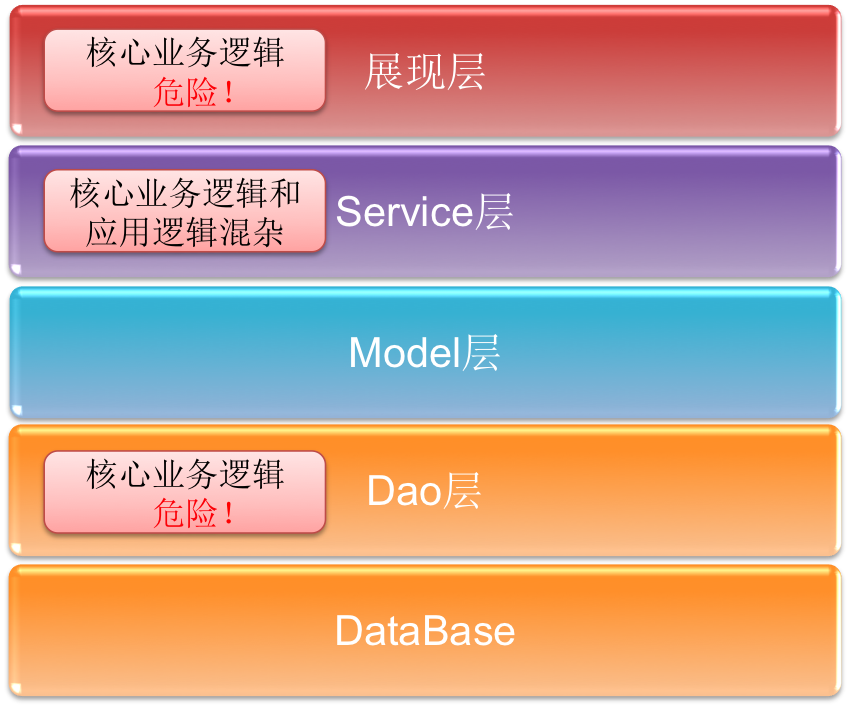
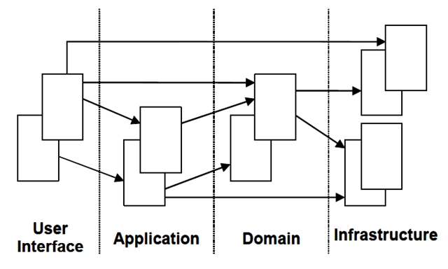
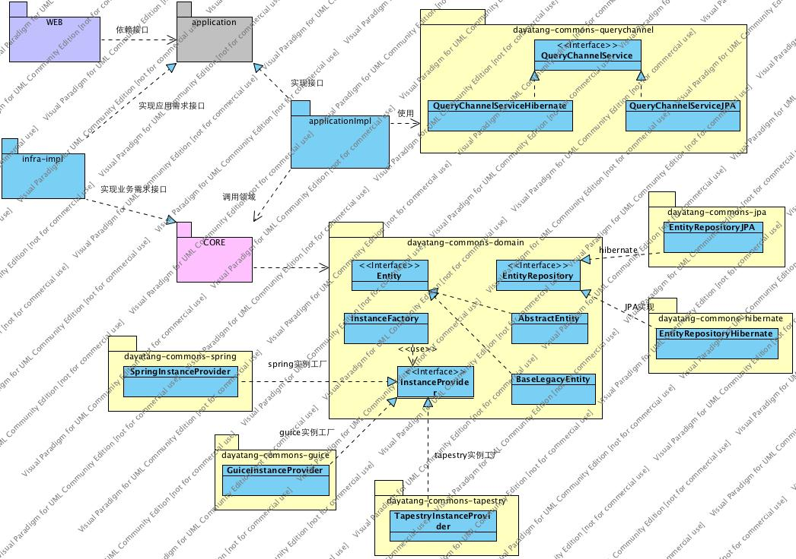
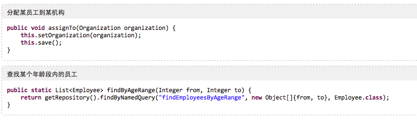
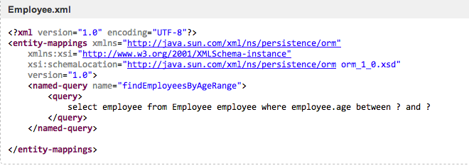
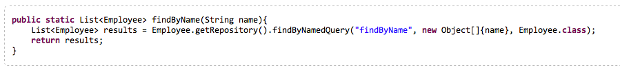
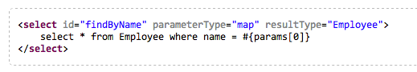

# [DDD & DDDLib在恒拓开源的发展历程与推广经验](https://kb.cnblogs.com/page/196945/)

​                 作者: 刘林  来源: InfoQ  发布时间: 2014-01-01 17:52  阅读: 7098 次  推荐: 6                   [原文链接](http://www.infoq.com/cn/articles/ddd-dddlib-development-process-and-marketing-experience)                   [[收藏\]](javascript:void(0))               

　　领域驱动设计（DDD）的概念源于2004年著名建模专家Eric Evans发表的书籍:《Domain-Driven Design – Tackling Complexity in the Heart of Software》**（**中文译名：领域驱动设计—软件核心复杂性应对之道**）**，池建强在2011年发表的一篇文章《[领域驱动设计和实践](http://www.cnblogs.com/chijianqiang/archive/2011/08/17/DDD.html)》中是这样形容DDD的：

> 领域驱动设计事实上是针对OOAD的一个扩展和延伸，DDD基于面向对象分析与设计技术，对技术架构进行了分层规划，同时对每个类进行了策略和类型的划分。

　　本文主要介绍为什么我们在恒拓开源内部推广DDD，我们如何通过开发 [DDDLib](https://github.com/dayatang/dddlib) 和 [Koala](http://www.infoq.com/cn/news/2013/09/koala-release/) 等工具来完善这一过程，推广过程中遇到了哪些问题，以及我们如何解决这一问题。

　　**为什么选择DDD**

　　传统的模式的最大优点在于开发人员非常熟悉，开发成本低，但它也有一些问题：



　　采用DDD开发模式之前，传统的开发模型是最流行的Model-Dao-Service-UI开发模型，通常是基于事务脚本（Transaction  Script）和表模块（Table  Module）模式的实现，这种模式通常是先设计表，再建模，实现容易依赖特定的表的一些特性，如存储过程。基于表的设计模式容易带来以下几个问题：

- 业务建模完全是表的复制，无法真实反映业务。
- 核心业务分散在各个地方，非常危险，修改扩展难，且难以阅读。

　　这种开发模式适合一些需求小，后续维护扩展需求小的中小型项目，但在大型企业级系统或产品，扩展维护或需求变量非常多的情况下，缺点也非常明显。

　　相对而言，DDD则有以下四点好处：

　　1、面向对象，模型真实反映业务现实：使用DDD领域驱动设计，模型通常是业务的真实反映，业务集中在领域而不是分散在各Service中，有利于对业务的理解。

　　2、使用领域统一建模语言：有利于业务沟通与建模： DDD倡导先对业务建模，而非关注表或脚本的设计；在建模过程中，由于领域本身是对真实业务的反映与建模，因此与业务专家更容易沟通，打破技术与业务的沟通隔阂。

　　3、可重用性高：DDD中，领域层为核心，每个领域对象都是一个相对完整的内聚的业务对象描述，所以可以形成直接的复用。基于领域建模的设计，并不会依赖特定的数据库及特性，模型是可以完全重用且没有技术上的冲突。

　　4、业务越复杂，DDD的优势越明显：领域模型采用OO设计，通过将职责分配到相应的模型对象或Service，可以很好的组织业务逻辑，当业务变得复杂时，领域模型显出巨大的优势。

　　**DDDLib登场**

　　DDD本质上是一种思想，并不是新技术。在恒拓开源，由我们的杨宇老师和陈操总共同创作的DDDLib库，是对DDD思想的核心支持与实现。

　　DDDLib是一整套支持DDD思想实现的类库，DDDLib下还是使用的 Hibernate、JPA或MyBatis、noSQL等技术为实现。

　　如同DDD所要求样，使用DDDLib 的项目分层图为：



- 用户界面/展现层

- - 用于向用户展现信息，处理用户在界面上的请求，比如struts，tapestry，springMVC等页面框架。

- 应用层

- - 用来处理应用的活动，不包含领域中的业务逻辑。
  - 应用层可以用来处理一些与领域概念无关的拦截性质的工作，比如日志，事务等。此外，应用层也可以用来处理一些既不属于展现层，也不属于领域层，而是属于目前应用相关的一些服务。比如资金转账的业务的读取输入功能（读取输入不是转账的核心业务含义）。

- 领域层

- - 此层是DDD的核心：领域对象，领域服务，仓储接口均位于此层。
  - 领域的信息，是业务软件的核心所在。
  - 需要保留业务对象的状态，对业务对象及其状态持久化的操作交给基础设施层。
  - 领域层应该遵从以下原则：除非业务发生变化，否则其他任何变化均不应该影响到领域层。这些其他变化包括：不同的展现框架，不同的页面展现内容，是否要分页，是否支持手机客户端，是否公开WebService，是否提供OpenAPI等等。

- 基础设施层

- - 此层作为其他层次的支撑，可以为领域层的持久化提供支持，当领域层或应用层有特殊的业务或应用需求(发送短信等)时，它们会定义需求接口，然后在基础设施层中实现这个接口，满足特定的业务或应用需求。

　　DDDLib的核心实现如下：



　　上图就是使用 DDDLib 项目的整体技术架构图，也表明了DDDLib的整体原则：

1. 领域层是业务核心，这一层不依赖任何特定的技术框架，保证它的业务纯洁性。DDDLib中的领域层只依赖JDK、DDDLib的Domain库以及仓储接口及其它自定义接口。
2. 使用仓储和查询通道作为与存储介质相关的操作接口，隔离对特定数据库技术或存储介质的依赖。
3. 提供多种不同的IoC容器实现及InstanceFactory实例工厂，隔离对特定IOC 技术的依赖。
4. 领域层包括值对象、领域对象以及领域服务三个要素，领域层不是数据库操作层而是业务建模层。许多开发者在使用的过程中，最终还是把领域层作为数据库操作层来使用，对实体的方法也是以数据库的操作行为为标准  ，如查询，新增，删除一个实体，最终依然回归到以数据库为中心的方向去了，这是需要避免的。
5. 改变以数据库为中心的核心是意识到业务行为才是核心，数据库存储是支撑。意识到数据库是支撑非常关键，业务上的任何行为，在系统中最终需要存储记录，数据库存储是对业务实现的支撑，也可以使用文件，缓存或云空间等其它存储介质。想像一下，使用数据库进行设计的项目，最终就限定了存储介质为特定的数据库，如果下一次需要更换为云空间或缓存等其它存储形式，就会发现整个系统需要重新设计开发，但使用DDDLib，只需更换仓储实现，提供一个云空间的实现就行了，核心业务逻辑完全不需要变动与修改。

　　DDDLib在实现过程中也经历了内部的不少争议，经过很多次的讨论和打磨形成了现在的格局。在下面的部分，我将介绍DDDLib在几个重要组件上的实现细节。

　　**DDDLib仓储的实现**

　　从DDDLib 1.0到3.5版本，仓储实现历经几个阶段，分别是：

1. 给每个领域对象定义一个仓储接口及一个仓储实现。 

   这种仓储实现非常受争议，开发人员并不认可这种方式，仓储接口及实现非常多，一方面导致项目类太多，并且也带来编码的重复操作。

2. 与spring data整合，给每个领域对象定义仓储接口，无须定义实现。这种模式对前面的模式有了优化，只定义接口不定义实现，但是spring data这种依赖方法名，参数来进行查询的模式，针对一些复杂的查询，难以胜任。

3. 提供默认的hibernate及JPA的通用仓储接口。 

   为每个仓储定义一个接口，这种模式慢慢的不被接受，使用spring data带来的优化方案，也有非常多的问题，后面根据JPA的实体管理思路，于是形成了通用仓储接口及不同技术实现的思路，定义一个通用的仓储接口，包括通用的增删改查数据库行为。

4. 支持MyBatis的通用仓储接口 

   DDDLib的JPA及hibernate仓储实现，这个方案是一个较佳的方案，所有领域实体使用通用的仓储，避免了大量重复代码，但DDDLib一直是基于Hibernate/JPA提供的实现与技术支持，在项目的使用过程中，经常会遇到不适合使用Hibernate/JPA模式的项目，对MyBatis的需求也非常大，这种情况下，Koala团队定义实现了MyBatis的仓储实现，并保证其与JPA/Hibernate模式下API的一致性。

　　**DDDLib中的DTO**

　　DTO，数据传输对象，领域对象虽然有数据（属性），但是领域对象上面还带有操作，在某些场合不适合进行传输，有些时候传输还需要序列化。但并不是所有的领域对象属性都可以暴露，而且有些属性可能要合并，可能要分解，之后才有利于前端的使用。于是就有了专门用来传输数据的DTO，只有属性，没有操作，必要的时候加上序列化标记，实现远程调用。

　　这是DDD中DTO的作用，但是DTO同时也带来了实体与DTO的转换性能问题，在大数据量下尤其明显。

　　**DDDLib中的数据库支撑行为类**

　　在DDDLib实现中，提供了Repository以及QueryChannelService两个接口，分别使用在领域层以及应用层，都是对数据库的操作接口。

　　**SQL/HQL/JPQL写在哪**

　　在使用DDDLib的过程中，不同的持久层框架的SQL语言不一样，比如MyBatis使用的是SQL，Hibernate使用的是 HQL，JPA下使用的是JPQL。

　　这些语句写在哪儿在公司也经历过一番争议与变更，历史如下：

　　1、写在代码中

```
public static Resource newResource(String name,String identifier,String level,String menuIcon){
　　Resource resource = null;
　　List<Resource> resources = Resource.getRepository().find("select r from Resource r where r.name = ? " + "and r.identifier = ?", new Object[]{name,identifier}, Resource.class);
　　...
} 
```

　　这个非常容易理解：哪里要查询，哪里写SQL，这种模式是公司最初的使用方式，优缺点也非常明显。优点是直观，缺点则是，DDDLib倡导隔离特定技术，那这些语句写在写到代码中，意味着领域层中依赖了特定的技术语句，违背了DDDLib的目标。

　　2、以@NamedQuery注解写在类上

```
@Entity
@NamedQuery(name="findAllEmployeesByFirstName",queryString="SELECT OBJECT(emp) FROM Employee emp WHERE emp.firstName = 'John'")
public class Employee implements Serializable {
　　...
} 
```

　　在Koala产品出现以前，DDDLib支持Hibernate以及JPA，这两种模式都支持@NamedQuery这种注解。曾经有人提议过这种方式，但并没有解决上面的问题，反而带来难以阅读的问题。

　　3、以命名查询+xml实现

```
/**
* 判断一个资源是否有子资源
*/
public static boolean hasChildByParent(Long parentId) {
　　return !Resource.findByNamedQuery("hasChildByParent", new Object[] { parentId }, Resource.class).isEmpty();
} 
```

　　在对应的 XML 配置中定义：

```
<named-query name="hasChildByParent">
<query>
select distinct m.id from ResourceLineAssignment m where m.parent.id=?
</query>
</named-query>  
```

　　Koala团队后期定制了我们的方式，使用命名查询+xml配置方式来实现，并且基于这种方式，提供了MyBatis协议的支持实现，获得了一定的认可。

　　使用这种方式，领域层的代码中不会出现特定的技术语句，解决了上述问题，不同的技术实现下不同的xml配置这种模式是可以接受的。

　　但这种模式也仍有一些问题，包括：

　　a) 动态条件查询不支持。一些查询的条件是动态的，这种模式下的HQL/JPQL是不支持的，但由于通常动态条件查询不属于业务核心，而是应用需求是在应用层，因此暂时仍然可以接受。

　　b) 扩展其它存储介质的问题。Hibernate/JPA/MyBatis是常用的持久层框架，但是现在越来越多的出现诸如NoSQL、云存储等非关系型存储，使用这种模式来匹配这些存储，当前没有现成的解决方案

　　4、不使用语句，而使用QueryCriterion

　　DDDLib中提供了QueryCriterion这种查询机制，以期望做到隔离特定持久层框架的影响。很可惜，早期在恒拓推广使用 DDDLib 时，没有提及这种实现，因此恒拓的DDD一直未使用此方案。

　　这种方式对于MyBatis难以支持，对于NoSQL、云存储等其它存储介质同样没有现成的解决方案。

　　DDDLib最终使用了第三种方案。

　　JPA下的写法：





　　MyBatis下的写法：





　　推广DDD遇到的挑战

　　上面阐述了传统开发模式的一些问题，但是从另一个角度来说，传统的开发模式也有着它的优点：

1. 使用成本低：基于传统开发方法，使用SSH等框架，基本上所有的开发人员都没有上手代价，立马可以参与开发。
2. 开发速度快：传统模式的开发速度也快，尤其使用一些快速开发框架，开发一些简单业务的项目，是比较合适的。
3. 在实际项目的开发中，传统模势的缺点并不明显，国内大部分项目只注重实际页面效果，至于设计的好坏，维护扩展的难易度并没有被重视。

　　基于这些理解，在公司层面推广使用DDD思想存一些难点与阻碍，尤其是公司早期一些项目，使用DDD的所带来的优势并不明显，反而前期会带来使用成本。

　　另一方面，对大部分开发人员来说，传统的模式更容易接受和习惯，表->DAO->Services->UI这种非常简单，基本没有学习成本。推广使用DDD则不一样，虽然技术上并没有任何创新，使用的还是Hibernate、Struts、Spring这些常用的技术，但关键是编码的思想不一样。DDD的要点，领域对象，领域服务，查询通道这些让开发人员理解并熟悉这种编码风格，也是个不小的挑战，推广初期经常会遇到开发人员对这些理念的质疑。

　　另外，虽然DDD倡导先对领域进行分析建模，编写领域方法等核心，再考虑表的设计实现，但在实际的开发过程中，受以往的模式影响，就算使用了DDD模式，开发人员经常还是会用传统方式开发，对新模式无法理解，如：

- 开发人员还是先设计表，再根据表设计领域对象。许多项目依然还是对实体进行增删改查，于是出现DTO与实体属性一模一样的情况。开发人员对DTO的存在的必要性无法理解。
- 在传统的模式中，操作数据库的基本上属于Dao的责任。DDDLib提供了两个数据查询通道，开发人员对于哪些需要使用仓储，哪些需要使用查询通道不能清晰理解。
- DDDLib提供了值对象，领域对象，领域服务来将领域与值进行分离，但是在实际的项目中，许多开发人员在项目使用领域对象，然后直接针对领域对象增删改查，很少真正使用到值对象、领域服务、聚合、工厂这些要素。

　　以上种种让 DDD 又变成传统方式，这又进一步让开发人员感觉DDD与传统模式没有本质区别，于是加剧了开发人员对使用 DDD 的疑问。

　　**如何解决这些问题**

- 在公司内部推广宣传DDD&DDDLib 

  DDD更多的是理念，技术细节和传统的方式没有区别，更多的是要让开发人员在理念上转变过来，因此推广DDD&DDDLib及其理念非常重要。不理解DDD思想理念来使用DDD，最终非常容易造成难以使用，这有什么用，或为什么要用这样的感觉。

- 定期进行DDD在技术上的交流与探讨 

  如前文所述，DDDLib的一些技术实现细节非常有争议性，因此我们会定期召集有想法的人员，不断讨论，收集使用者的意见，不断的修正优化实现。

  对于有争议的技术，也通过讨论，集思广益，找到最佳的实现方式。

- 制定最佳编码实践，指导DDD方式的编码 

  考虑到开发人员从传统模式转变到DDDLib编码风格的转变及学习成本问题，通常公司的架构部都会编写一个最佳DEMO，示例大家如何编写代码，理解查询通道，值对象，DTO，仓储，聚合等的实现与细节，帮助开发人员正确编写。

- 通过真实项目逐步让大家认识到DDD的优点 

  在一些项目上，使用 DDD 并没有实际的优点，只有在业务复杂，需要不断迭代的如产品这样的项目，才比较适合 DDD。我们通常会拿真实的项目中的代码来示例说明使用DDD的好处。

- 开发一套基于DDD思想的开发平台，辅助更容易使用DDD编码 

  在使用了较长的 DDDLib 之后，恒拓也推出了基于它的思想的Koala开发平台，借助这个开发平台，能更容易让开发者上手使用DDD。

　　**总结**

　　到目前，公司的大部分项目已经在使用DDDLib&Koala平台来实现。开发人员慢慢接受了这种思想，并且有许多人在DDDLib实现上提出了自己的意见与想法，包括仓储没有native  SQL支持，NoSQL如何实现，DTO是否有必要，没有体现聚合，领域层是否可使用工厂，父实体需不需要基本属性（创建时间，创建者）等。

　　接下来，我们计划在以下方面继续展开工作：

　　1) 完善支持技术细节

　　包括对NoSQL的仓储实现的支持，较好的支持非Spring IOC等，技术细节上仍然需要优化。

　　2) 制定更为优化的DDDLib标准规范

　　包括仓储，查询通道，聚合等理念，为它们提供更为优化的技术实现标准，更好的支持DDD设计。

　　3) 完善基于DDDLib的Koala开发平台

　　进一步完善 Koala开发平台，更好的支持DDD&DDDLib理念的实现。

　　4) 推广DDD理念

　　公司借助Koala这个开源平台，以让更多的人尝试并加入到使用 DDD或 DDDLib，推动国内做出更优秀的应用

　　**相关资料**

- 《领域驱动设计——软件核心复杂性应对之道》Eric Evans著
- [DDDLib](https://github.com/dayatang/dddlib)
- [Koala – 开源免费的开发平台](http://openkoala.org/)

　　**作者介绍**

　　刘林，恒拓开源架构师，对技术非常热爱与执着，关注开源技术及开源的解决方案，信奉并参与开源。在Java开发领域有一定的经验积累。参与并主导过一些开源项目的成功实施。现专注于Koala开源平台的开发。