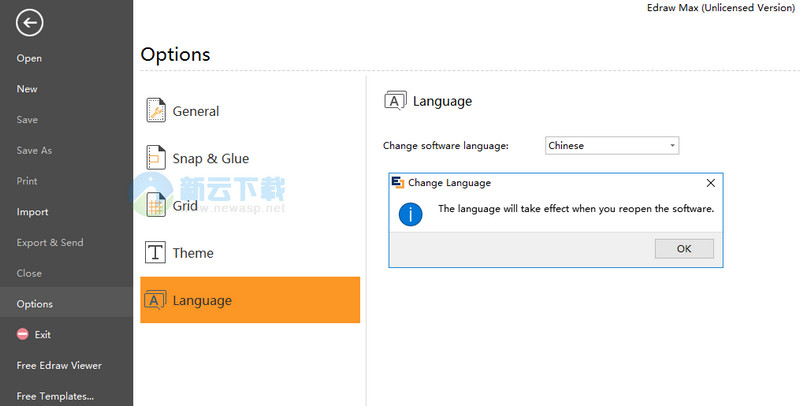

https://www.newasp.net/soft/466555.html

2、断网或使用防火墙阻止Edraw Max 9.3连接到网络，然后运行软件，在设置中将语言设置为中文后重启启动。

3、在帮助菜单中点击激活，弹出激活窗口。

4、打开Edraw Max 注册机，点击Gen生成注册码，不要点击Patch！

Name：Shadow Mask

Code：PPDBNL68HL0INSOM01D8

Activation Code  ：A04E4E1469738E006FC534FECE55D39CE117EAE617E47F287A1D65032A308E4DC1B0CF94A9554C7953FD213B6E49C1AF86D6FBF04E3B5B736B2F1C93176B5EA66228BC6243DC44234D53721A75D2A7B29C73A22ECE08A7C33E5AE6C3ECED1A7D722F10075EE69790021836C56FBF1BF7B40F86D38CEEB572FAECC33E9FE373A3

5、将用户名和产品秘钥从注册机中复制到激活窗口中点击激活，会提示错误，显示需要输入激活码，再将注册机中的激活码复制进去，点击手动激活。

6、提示激活后关闭软件，将BaseCore.dll和ObjectModule.dll文件复制到安装目录中替换。

7、破解完成。

### 更新日志

1、新增鼠标右键拖拽画布功能；

2、新增插入二维码功能。支持输入个人信息自动生成二维码名片；支持输入URL网址、电话、WiFi帐号信息自动生成二维码；

3、新增截取屏幕的功能，截取的图片可以直接插入软件中；

4、新增修改默认字体替代主题字体；

5、新增家谱图模板、例子和符号库；

6、增加了人工智能、智能家居、电子设备、物联网等相关的图形符号；

7、改进线框图符号库和模板；

8、更新大量剪贴画图库；

9、新增科学图模板和符号库；

10、新增云盘文件拖拽功能；

11、完善高显示率下导出图片时文字会换行的问题；

12、修复了部分bug；

13、其他。

#### 下载Edraw Max 9.4 中文破解版 9.4.0 含安装教程