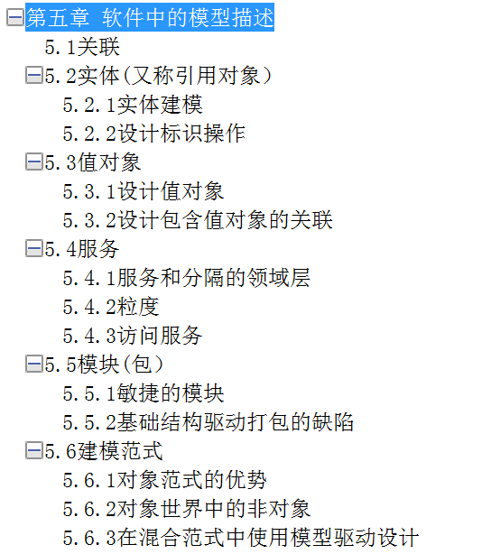
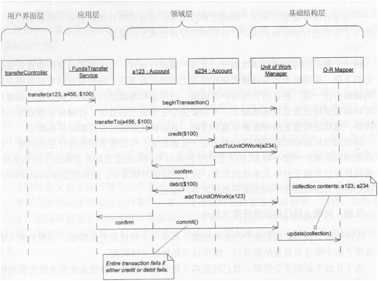
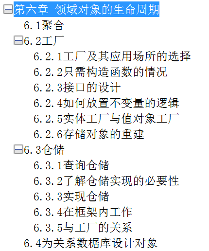

# [设计窘境：来自 Repository 的一丝线索，Domain Model 再重新设计](https://www.cnblogs.com/xishuai/p/domain_model_repository.html)


　阅读目录：

- [疑惑解读](https://www.cnblogs.com/xishuai/p/domain_model_repository.html#xishuai_h1)
- [设计窘境](https://www.cnblogs.com/xishuai/p/domain_model_repository.html#xishuai_h2)
- [一幅图的灵感](https://www.cnblogs.com/xishuai/p/domain_model_repository.html#xishuai_h3)
- [为嘛还是你－Repository](https://www.cnblogs.com/xishuai/p/domain_model_repository.html#xishuai_h4)
- [后记](https://www.cnblogs.com/xishuai/p/domain_model_repository.html#xishuai_h5)

　　上一篇《[No zuo no die：DDD 应对具体业务场景，Domain Model 重新设计](http://www.cnblogs.com/xishuai/p/3827216.html)》。

　　希望本篇博文废话少点，注：上一篇瞎扯的地方太多。

## 疑惑解读

　　先回顾一下，在上一篇博文中，主要阐述的是领域模型的重新设计，包含：真正的去理解领域模型和领域服务的加入（感兴趣的朋友可以看下前几篇来了解一下前因后果。）。凡事都有修改的理由，为什么加入领域服务，主要是之前对领域模型的认知不够（实体充当起了伪领域模型），所以就造成之前设计的对象发送对象之说。

　　上一篇博文发表后，园中有很多朋友积极参与了讨论，比如一如既往的 netfocus 兄、深蓝医生、xuefly、螺丝钉爱螺丝帽、殇、凌枫、鼻涕成诗、徐少侠、JRoger等等，详细的讨论内容，请看上一篇的评论。在这里，必须和以上参与讨论的兄台说声感谢，我觉得分享领域驱动设计的博文，就是要有讨论的气氛才好，如果死气沉沉，只是我在这边唱独角戏也没什么意思，讨论才有学习，学习才有进步，这是一个共赢。

　　首先我先表述一下 MessageManager（短消息系统）  项目的具体业务场景，因为在前几篇博文中，大家对这个业务场景的不了解，以致造成一些无谓的讨论（第二篇博文中和 netfocus  兄真是如此，还有后面的  xuefly）。回到重点，短消息系统类似于我们日常生活中的写信或者发信息，一个用户给另一个用户发消息，仅此而已，而不是像大家所说的应用性的发消息（类似于人机通信），这种发消息没有什么业务概念，只是说应用层发出一条命令让基础层去发一条消息，不会像日常生活中的写信发消息，需要判断一些业务规则（比如一个用户一天可以发多少条消息等），对业务场景有一些误读，就会造成一些无谓的讨论，希望朋友们在理解这个领域驱动设计实践前，先明白这是一个什么业务场景。

　　插一句 dudu 在闪存中说过的一段话：“领域驱动设计就是要以领域为中心，围绕着领域转，不然没必要叫领域“驱动”，最多只能叫“面向”领域。领域驱动出来的产物——代码，就是领域模型。”。领域驱动设计使用自然语言（不懂技术的需求专家也可以看懂），去描述我们现实生活中的业务场景，设计的时候忘掉数据库，忘掉表现层，忘掉应用层，这样才会设计出一个“纯净”的领域模型，但是也要针对现实中的业务场景去设计和实现，要不然就会变成“面向对象设计”，只是一个“无所作为”的领域模型，并没有解决实际的业务需求。

　　下面主要针对 netfocus 兄在上篇所提出的疑问（其他兄台的疑问，大部分评论中已回复），做一些解读（因为当时头脑发热，处在一个迷迷糊糊的状态）。

1.先说一个bug吧：if  (message.SendUser.SendMessages.Where(m => m.SendTime ==  DateTime.Now).Count() >  100)这句话中DateTime.Now是当前时间，是精确到秒的，所以你这里判断一天只能发送100条消息的逻辑有bug;应该只比较天才对；
2.你不是说domain service的方法的入参和返回值都应该是领域对象吗？那为啥返回值是OperationResponse<Message>？这个明显不是领域对象呀！实际上，这里我觉得没必要用返回值，如果校验失败，直接抛异常不就好了；
3.你要验证发件人和收件人不能是同一个人，现在放在domain service中做，个人认为放在message聚合根中做更好啊，聚合根的构造函数中直接判断发件人和收件人不能是同一个就行了。
4.我没看到你哪里有更新MessageState的，是不是漏代码了？
\5. 你现在发送人对象上有一个集合，表示他总共已经发了多少条消息，那如果这个人以后他了1W条消息，你也要加载到内存吗？性能上存在严重问题；以后如果收件 人也要有一个限制一天不能超过1000条消息，那是不是也要在收件人上设置一个集合，存放所有的收到的消息，呵呵；这个问题如何解决，你还得再想想；
6.最后一点，也是最关键的一点：**我希望你能明确说出，消息发出去的标志是什么？**你 现在是调用domain  service的SendMessage方法，认为该方法返回后就表示消息已发送出去了；但是我怎么看到这个方法里就做了两件事情：1）校验发送人和收件 人不能是同一个人；2）校验发送人一天里不能发送100条消息；也就是说，你这个方法里只是对给定的消息做了一些业务规则的验证；那为何不把这个领域服务 取名为ValidateMessageService呢？**我之前那篇文章里和你谈到过，当你的方法里实际做的事情和你的方法的名称不一致时，说明你还没理解这个方法所代表的职责该谁执行，或者你还没理解这个职责的含义；**
所以，你最根本的，你先要说明你的业务场景中，怎么样才代表一个消息发送出去了。

我觉得像你这个场景，只要：
1.把消息new出来，构造函数中做必要的业务规则检查（包括发件人和收件人必须相同）；
2.继续做其他验证，比如发件人的消息不能超过100；（可以调用一个领域服务来验证，不通过直接抛异常即可）；
3.上述两步通过，则调用repository把消息持久化到db，就好了；

所以，怎么样才算消息发送了呢？难道不是把消息持久化起来就好了吗？然后我们其他可能专门有一个定时job定时从消息表获取未发送的消息；拿出来去发送，发送完成后再更新消息的状态是已发送；

当然，如果你不想定时，也可以把消息放到一个消息队列（这种方式就是我之前我贴的调用基础服务将消息发送到分布式消息队列的那句代码），然后由队列的监听放消费这个消息，拿到消息，去做真正的发送，发送成功后，修改消息的状态为已发送即可；

总 感觉，你现在脑子中一直在思考，发送消息是一个业务逻辑，所以需要在领域模型中提现出来，但真的是业务逻辑吗？发送消息其实是一个业务场景（DCI中的 C），是应用层需要体现出来的，而领域层不一定要显式的体现发送消息这个动作；你一定要强行体现出来，那就会像你上面那样，方法里做的事情和方法的名称不相符。

　　方便大家阅读，就直接粘贴过来了（不要嫌多哦），大家也可以看下我之前的[回复内容](http://www.cnblogs.com/xishuai/p/3827216.html#2978729)，首先，“调用的参数和返回的结果应该是领域对象”这段话引自《领域驱动设计》，具体在领域服务的讲解中，关于这一段的文字表述，我现在是有些疑问的，首先关键词”应该“，并不是”必须“，也就是说可以为其他的对象，”领域对象“是什么？实体？值对象？其实并不只是实体和值对象，可能是一些自建的领域对象，比如书中创建的  FundsTransfer  表示两个账户的转账结果对象，但是有时候我们在领域服务中做一些操作，比如发消息领域服务，发送成功返回一个领域对象，这个对象一般为消息实体，但是在删除消息服务中，返回的领域对象是什么？难道还是消息实体（也有可能），我觉得还不如返回一个  BOOL 类型的对象更清晰明白（如果），这一点是有些疑问。

　　后面第五点和第六点是比较重要的，先说第五点，用户对象附着两个集合（发件箱和收件箱），关于这一点我觉得是设计问题，但是为什么要加这两个集合呢？因为在领域服务中做发件人或收件人信息验证的时候，可以很方便的访问，比如下面这段代码：

```
1             if (message.SendUser.SendMessages.Where(m => m.SendTime.Date == DateTime.Now.Date).Count() > 200)
2             {
3                 throw new Exception("发件人一天之内只能发送200个短消息");
4             }
```

　　这种代码可能写着可能没什么问题，也方便于理解，但是在实现的时候就有问题了，领域对象是这样获取的吗？如果我再加很多个业务规则，对发件人或收件人的信息判断，都是这样写的吗？这个问题会引入第六点，消息的发送标示是什么？我之前认为是在发送领域服务中通过发送业务规则的验证，返回的那个过程就表示这条信息已经发送了，netfocus  兄对此的疑问就是在这个发消息领域服务中，体现的不是发消息，而是验证消息，还不如用 ValidateMessageService  领域服务来的贴切，确实是这个道理，但是如果领域服务改成这个名称，那领域模型中就没有发消息这个概念了，有的只是验证消息，消息的发送也只体现在了持久化上面，这是我不愿意看到了，关于这个疑问以上并没有做解读，请接着看下面。

　　首先在这个消息系统中，没有持久话，忘掉一些，我们要通过领域模型中去描述这个消息业务场景，那就必须包含：发消息、回复消息、查看邮件箱等等业务需求，也就是说我们要在这个消息领域模型中也体现出这些业务需求，然后让不是技术的需求人员也可以看懂，也就像  dudu  所说的那样：以领域为核心，围绕这领域转，领域驱动而不是面向领域。但是说的简单，实现起来是很难的，这也是领域驱动设计最痛苦的地方，但是理解这一点很重要，以领域为核心。

　　很抱歉，看到这里，其实我还是没有对 netfocus 兄的疑问做根本的解读，没关系，理解上面我所说的后，我们接着往下看，或许答案就在下面哦。

## 设计窘境

　　好，现在我们按照上面分析的方式进行领域模型设计，项目中只有领域层和相对应的单元测试，用领域模型去表述消息的具体业务场景，那就必须有发消息、回复消息等，我们使用领域服务实现，也就是每个业务对应一个领域服务（领域服务命名都必须是动词），这样我们表面上会完整的描述一个消息业务场景，具体是怎样实现的，我不管，但是必须可以体现出这个业务，也就是说我们不能把 SendMessageService 修改成 ValidateMessageService。

　　我们接着思路往下面进行具体的设计，比如下面这个发消息领域服务：

[](javascript:void(0);)

```
 1 /**
 2 * author:xishuai
 3 * address:https://www.github.com/yuezhongxin/MessageManager
 4 **/
 5 
 6 using MessageManager.Domain.Entity;
 7 using System;
 8 using System.Linq;
 9 namespace MessageManager.Domain.DomainService
10 {
11     /// <summary>
12     /// SendMessage领域服务实现
13     /// </summary>
14     public class SendMessageService
15     {
16         public static Message SendMessage(Message message)
17         {
18             //示例业务规则，对象导航关联访问需要探讨
19             if (message.SendUser.SendMessages.Where(m => m.SendTime.Date == DateTime.Now.Date).Count() > 200)
20             {
21                 throw new Exception("发件人一天之内只能发送200个短消息");
22             }
23             if (message.SendUser.SendMessages.Where(m => m.SendTime.Date == DateTime.Now.Date && m.ReceiveUser == message.ReceiveUser).Count() > 50)
24             {
25                 throw new Exception("发件人一天之内只能和同一人发送50个短消息");
26             }
27             //to do...
28             return message;
29         }
30     }
31 } 
```

[](javascript:void(0);)

　　SendMessage  表示发消息，看这几行代码，传入一个消息对象，返回一个消息对象，中间做一些验证操作，这个方法所做的工作就是验证，也不怪 netfocus  兄这样说，发送的业务体现不出来，可能我硬说是验证通过返回是发送，可能可以挺过一段时间，但是也骗不了自己多久，因为在写领域单元测试的时候，对发送消息进行测试，测试的代码就没办法写，因为这个消息对象在发送前和发送后得不到体现，只能做一些验证异常测试，这是没法接受的，停滞了。。。

　　回到用户附带的两个集合（发件箱和收件箱）这个问题上，如果添加这两个集合是正确的情况下（只是假设），就可以解决上面的问题，很简单，分别往这条消息所属的发件人－发件箱，收件人－收件箱里填充这条消息就行了，也就是下面的伪代码：

```
1             message.SendUser.SendMessages.Add(message);
2             message.ReceiveUser.ReceiveMessages.Add(message);
```

　　这样进行发消息表述的话，我们在单元测试的代码也就好写了，但是如果你仔细看这段代码，不理解意思也会觉得很别扭，难道领域模型中去存储领域对象是这样存储的？？？还有就是关于发件人和收件人的消息业务规则判断也是有问题的（message.SendUser.SendMessages.Where...）。

　　以上这种问题的表象就是有点为了领域而领域了，虽然领域是核心，但是这就有点不符合编程的基本原则，整体来说就是有点太“面向对象”了，并没有解决实际的问题，说到底还是没有真正领域驱动设计。关于以上设计窘境，真是太痛苦了，前前后后也停滞了好长时间，完全不晓得怎么做，代码写了删，删了写，总之没有一点头绪，真是比要死了还痛苦。

　　总的来说，我记录下设计窘境的两个主要方面：

1. 发消息、阅读消息等业务体现（如果单元测试代码可以写出，那就可以体现，但是写不出）
2. 领域对象的存储和读取（主要用在业务规则验证）

　　有时候编程像艺术创作一样，就是靠灵感，苦思白日，不如灵光一现，请接着往下看。

## 一幅图的灵感

　　有时候困在一个角落出不来，那就仰望下天空，说不准上面就是出路。

　　没办法，自己想不通就找资料找灵感，网上多说都是领域驱动设计概念或是伪领域驱动设计实践（只是示例，也就是空架子），又没办法，只能翻阅两本经典著作《领域驱动设计》和《企业应用架构模式》，在第一本书中以前关注的主要是第五章节的部分，如下：



　　也就是关于实体、值对象和领域服务的设计，其实我是想找一下领域服务到底是如何进行实现的，领域服务这一节点的内容我看了不知道多少遍，都是概念性的描述，没有一行代码实践，所以理解起来很困难，有很多朋友看到这，也许会说领域驱动设计就是要概念描述指导，用代码就体现不出来了，如果这样理解，那只能呵呵了，因为电脑不只是用来看电影，最主要的还是用来写代码的。

　　回到正题，在看第一本书的时候，无意间看到第四章（分离领域）的第一节（分离架构）中的一幅协作图，以前也是看过，但是这次是针对问题的看，所以会注意很多内容，协作图如下：



　　　　　　　　　　　　　　　　　　　　　　*没错，就是它*

　　这是书中的一个账户转账示例，一个账户加钱，一个账户减钱，完成的过程是一个事务，就是这么简单。从这幅图上我们可以很清晰的看到各个层所做的工作，可能平时看的时候会一闪而过，但是当抱着一些疑问去看的时候，所获取的信息量是很大的，比如我想知道在一个简单业务用例中，领域模型到底实现的是什么（不要和我说概念，概念大家都会说）？然后就可以推敲出其他层的一些实际工作，比如应用层，其实有时候我们在领域驱动设计的时候最容易混淆的就是应用层和领域层，当然网上关于领域层和应用层的定义概念一搜一大把，你可能也会说几句，比如什么应用层是很薄的一层，主要工作是协调任务的等等，但是实践起来呢？用代码表示就蒙了，说多了。

　　回到这幅图上，虽然瞟了几眼，我就知道我以前的设计是有问题的，比如应用层，从图上就可以看出领域层最复杂，应用层很薄，所做的工作是：

1. 发起一个请求
2. 确认处理结果
3. 提交工作单元

　　那我们再来看下我之前在应用层的设计代码：

[](javascript:void(0);)

```
 1         /// <summary>
 2         /// 发送消息
 3         /// </summary>
 4         /// <param name="title">消息标题</param>
 5         /// <param name="content">消息内容</param>
 6         /// <param name="senderLoginName">发件人-登陆名</param>
 7         /// <param name="receiverDisplayName">收件人-显示名</param>
 8         /// <returns></returns>
 9         public OperationResponse SendMessage(string title, string content, string senderLoginName, string receiverDisplayName)
10         {
11             User sendUser = userRepository.GetUserByLoginName(senderLoginName);
12             if (sendUser == null)
13             {
14                 return OperationResponse.Error("未获取到发件人信息");
15             }
16             User receiveUser = userRepository.GetUserByDisplayName(receiverDisplayName);
17             if (receiveUser == null)
18             {
19                 return OperationResponse.Error("未获取到收件人信息");
20             }
21             Message message = new Message(title, content, sendUser, receiveUser);
22             OperationResponse<Message> serviceResult = SendMessageService.SendMessage(message);
23             if (serviceResult.IsSuccess)
24             {
25                 return serviceResult.GetOperationResponse();
26                 //messageRepository.Add(message);
27                 //return messageRepository.Context.Commit();
28             }
29             else
30             {
31                 return serviceResult.GetOperationResponse();
32             }
33         }
```

[](javascript:void(0);)

　　什么 GetUserByLoginName 和  GetUserByDisplayName 方法获取领域对象然后进行判断，我觉得就有问题，除去 SendMessageService  领域服务的实现不说，后面注释的 messageRepository.Add(message);  这段代码也是有问题的，领域对象的存储在应用层上？不过后面的 messageRepository.Context.Commit();  工作单元提交是正确的，从上面可以看出，这个应用层是很厚的，并不像书中应用层那么薄。

　　在上面问题中最关键的问题是领域对象的创建，从上面图中可以看出，是在领域模型中创建并存储的，应用层只是提交一个请求，确认请求，然后提交工作单元（相当于事务），就是这么简单，而我们实现的太复杂了，所以就有可能导致前面一直的设计窘境－领域模型只是用来验证。

　　总的来说，我们有了一个重要线索，那就是领域对象的生命周期管理，如果理解了这一点，或许我们就可以走出之前的设计窘境。

## 为嘛还是你－Repository

　　沿着领域对象的生命周期管理这条线索，我们在《领域驱动设计》书中找到了以下内容：



　　管理领域对象的生命周期，主要是通过工厂（负责创建）和仓储（负责存储、重建和销毁）进行管理，领域对象的创建，简单的做法是通过构造函数进行创建（我们正是如此），复杂性的领域对象就要必须通过工厂进行创建，首先我们先说下工厂（虽然我们没用到），组装一个复杂的复合对象的工作，与该对象被组装成功后所执行的任何其他工作，最好是分离开来，就比如只有在生产轿车时才需要组装功能，我们在开车时并不需要一个机器人或者一个技师，因为轿车从来都不会一边组装一边行驶，因此把这些功能塞进同一个机制中是没有价值的。还有就是创建领域对象要放在哪？毫无疑问，应该是在领域中，但是在上面我们设计应用层代码的时候，比如  new  Message(....)，这个就是领域对象的创建，如果放在应用层，就会暴露出领域对象，而且领域对象创建发生了改变，是必须要去修改应用层的代码的（这就是我们不希望看到的），而如果在领域层，我们只要修改工厂就行了，其他不需要任何修改。

　　还有就是，如果把组装的职责转移给其他对此感兴趣的对象，如应用中的客户对象，那就会使问题变得更加糟糕。客户知道需要让哪些领域对象来执行必须的计算，从而完成自己的工作。如果我们希望让客户程序来组装其所需的领域对象，那它就必须知道一些有关该对象内部结构的事情。为了保证领域对象中各个部分之间的关系满足所有不变量，客户程序又必须知道该对象上的某些规则。即使是调用构造函数也会使客户与它正在创建的具体类关联起来。对领域对象的实现所作的所有修改都需要客户做出相应修改，导致重构更加困难。

　　因为工厂我们暂时没用到，就不多说了，我们来看下  Repository（仓储），其实我们对仓储并不陌生，在前面几篇博文中都有提到，而且曾经还怀疑过它。但是说实话，其实并没有真正的去理解它，在理解仓储之前，需要注意一点的就是，它的概念是相对于领域驱动设计而言的。关于仓储的定义，在《领域驱动设计》这本书中并没有准确的定义（都是一些论述），但是在《企业应用架构模式》这本书中有下面定义：

Repository（仓储）：协调领域和数据映射层，利用类似与集合的接口来访问领域对象。

　　这段定义可以说是相当的给力，主要包含两个重要信息点：

1. 协调领域
2. 访问领域对象

　　以前也看过这段定义，但都是一闪而过，并没有像现在这样，带着问题去理解，再回到《领域驱动设计》这本书上关于仓储的论述，无论对对象执行什么操作，我们首先必须要获得对它的引用。我们是怎样获得引用的呢？一种方法是创建这个对象，因为创建操作将把新对象的引用返回给我们。另一种方法是通过关联的导航。我们从一个已知的对象出发，向它请求一个与之关联的对象。这种方法在任何面向对象的程序都会大量用到。同时，对象之间的链接也使对象模型获得了相当一部分的表达能力。但是，我们必须得到那第一个对象。

　　一个仓储将某种类型的所有对象描述为一个概念性的集合（通常是模拟的集合）。它的行为与集合类似，但是包含更精细的查询能力。仓储可以加入和删除具有合适类型的对象，并通过仓储背后的机制将它们插入数据库或从数据库中删除。从这个定义可以推断出，仓储具有一系列紧密相关的职责，为我们提供了对聚合根从产生之初直到其生命周期结束期间的访问能力。

　　为每种需要全局访问的对象类型创建一个对象，该对象为该类型所有对象在内存中的集合提供影像。用一个众所周知的全局接口来设立访问入口。提供增删对象的方法，把对数据存储的实际的插入和删除封装起来。提供根据某种标准筛选对象的方法，返回完整实例化了的属性值符合标准的对象或对象集合，把实际的存储和查询技术封装起来。仅为确实需要直接访问的聚合根提供仓储。让客户聚焦于模型，把所有对象存储和访问的工作委托给仓储来完成。

　　部分持久对象必须通过按对象属性进行查询的方式来实现全局访问。对不便于通过导航来访问的聚合根来说，这种访问方式是必需的。这些对象通常是实体，有时是包含复杂内部结构的值对象，有时是枚举值。为其他对象提供这种访问会使一些重要的区别变得模糊。不受限制的数据库查询实际上会破坏领域对象和聚合的封装。把技术基础结构和数据库访问机制暴露出来，会使客户变得复杂，同时掩盖了模型驱动设计。

　　以上是我摘自关于仓储的部分精彩论述，概念性的东西了解太多容易迷失自我，我们回到两个很现实的问题，仓储是干嘛的？仓储谁来用？毫无疑问，仓储是提供领域对象访问的接口，哪谁来调用？不知道你有没有从上面的论述找到一丝线索，反正我是没有，仓储的调用无非就是两个，一个是应用层，另一个就是领域层。首先，我们探讨下应用层的可能性，其实从上面的那张协作图就可以找到答案，账户的重建并没有在应用层，而是在领域层，应用层只是传递几个参数，发出一个转账请求而已，然后根据确认结果，提交工作单元。

　　说了这么多，如果在领域层加入仓储，代码会变成怎样？请看下面示例：

[](javascript:void(0);)

```
 1 /**
 2 * author:xishuai
 3 * address:https://www.github.com/yuezhongxin/MessageManager
 4 **/
 5 
 6 using MessageManager.Domain.Entity;
 7 using MessageManager.Domain.Repositories;
 8 using System;
 9 namespace MessageManager.Domain.DomainService
10 {
11     /// <summary>
12     /// SendMessage领域服务实现
13     /// </summary>
14     public class SendMessageService
15     {
16         #region Private Fields
17         private readonly IMessageRepository messageRepository;
18         private readonly IUserRepository userRepository;
19         #endregion
20 
21         #region Ctor
22         public SendMessageService(IMessageRepository messageRepository, IUserRepository userRepository)
23         {
24             this.messageRepository = messageRepository;
25             this.userRepository = userRepository;
26         }
27         #endregion
28 
29         public Message SendMessage(string title, string content, string senderLoginName, string receiverDisplayName)
30         {
31             User sendUser = userRepository.GetUserByLoginName(senderLoginName);
32             if (sendUser == null)
33             {
34                 throw new Exception("发送失败，未获取到发件人信息");
35             }
36             User receiveUser = userRepository.GetUserByDisplayName(receiverDisplayName);
37             if (receiveUser == null)
38             {
39                 throw new Exception("发送失败，未获取到收件人信息");
40             }
41             Message message = new Message(title, content, sendUser, receiveUser);
42             if (messageRepository.GetMessageCount(DateTime.Now) > 200)
43             {
44                 throw new Exception("发件人一天之内只能发送200个短消息");
45             }
46             messageRepository.Add(message);
47             return message;
48         }
49     }
50 }
```

[](javascript:void(0);)

　　从代码实现上可以看到，领域对象的重建、获取都是在领域中，你也可以由此想到应用层的实现代码，和上面转账比较类似，GetUserByLoginName  之类的仓储查询方法是我们获取领域对象的方式，比如我们在做消息发送领域服务的时候，只要定义消息仓储的接口就行了，代码如下：

[](javascript:void(0);)

```
 1 /**
 2 * author:xishuai
 3 * address:https://www.github.com/yuezhongxin/MessageManager
 4 **/
 5 
 6 using MessageManager.Domain.Entity;
 7 using System;
 8 using System.Collections.Generic;
 9 
10 namespace MessageManager.Domain.Repositories
11 {
12     /// <summary>
13     /// 表示继承于该接口的类型是作用在“消息”聚合根上的仓储类型。
14     /// </summary>
15     public interface IMessageRepository : IRepository<Message>
16     {
17         int GetMessageCount(DateTime sendTime);
18         ICollection<Message> GetOutbox(User readUser);
19         ICollection<Message> GetInbox(User readUser);
20     }
21 }
```

[](javascript:void(0);)

　　至于仓储的实现，这在领域中并不关心，它只要知道领域对象的获取方式就行了，实现应该在基础层，可以存储内存，也可以存储数据库，messageRepository.Add(message);   这段代码表示往消息仓储中添加消息领域对象（并没有持久化），你可以把消息仓储看作是邮箱，我们可以从这个邮箱提取出任何消息聚合根内的领域对象，这个可以让我们很方便的在领域中进行消息的业务判断。往消息仓储中添加消息对象可以看成是发消息的业务体现，因为消息仓储其实就是相当于消息系统，它是消息领域对象的集合，我们前面  new Message  其实只是创建一个消息领域对象，但并不表示在这个消息仓储中，也就体现不出发消息这个业务，需要注意一点的就是往消息仓储中添加消息对象并不是持久化数据库什么的，消息仓储是管理所有消息领域对象的集合，和数据库没有半毛钱关系，这个很容易造成误解。如果按照这种逻辑，发消息的单元测试就是判断这个消息在消息仓储中是否存在。

## 后记

　　以上关于领域模型的再重新设计，主要是添加了仓储，也就是说领域对象的生命周期管理，放在了领域中，其实说实话，我也不清楚这样做是否正确，虽然表面上看上去有些合乎常理，但是却又感觉不那么看得顺眼，如果你有什么想法或建议，请参与讨论，在此感谢。

　　MessageManager 项目开源地址：

- GitHub 开源地址：https://github.com/yuezhongxin/MessageManager
- ASP.NET MVC 发布地址：http://www.xishuaiblog.com:8081/
- ASP.NET WebAPI 发布地址：http://www.xishuaiblog.com:8082/api/Message/GetMessagesBySendUser/小菜

　　如果你觉得本篇文章对你有所帮助，请点击右下部“推荐”，^_^