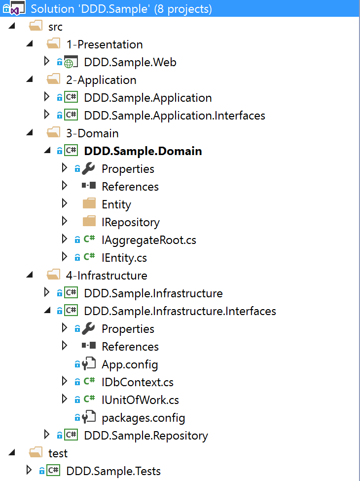

#   [DDD 领域驱动设计－谈谈 Repository、IUnitOfWork 和 IDbContext 的实践（1）](https://www.cnblogs.com/xishuai/p/ddd-repository-iunitofwork-and-idbcontext.html)


好久没写 DDD 领域驱动设计相关的文章了，嘎嘎！！！

这几天在开发一个新的项目，虽然不是基于领域驱动设计的，但我想把 DDD 架构设计的一些东西运用在上面，但发现了很多问题，这些在之前的[短消息](https://github.com/yuezhongxin/MessageManager)项目中也有，比如我一直想重构短消息 Repository 实现的一些东西，但之前完全没有头绪，因为内部的实现错综复杂，牵一发而动全身，不知道从哪下手。

正好这次新项目的开发，让我一步一步代码设计，所以之前疑惑的问题，可以很清晰的分析并解决，解决问题的过程最终形成了一个 DDD 框架示例，大家可以参考下：



开源地址：https://github.com/yuezhongxin/DDD.Sample

## 1. 一点一滴－疑惑出现

疑惑就是 Repository 和 IUnitOfWork，以及 Application Service 的调用，这样说可能很笼统，其实就是这三者如何更好的结合使用？并且让它们各司其职，发挥出自己的最大作用，下面我举个例子，可能大家更好理解一些。

首先，关于 IUnitOfWork 的定义实现，网上我搜了很多，很多都太一样，比如有人这样定义：

```csharp
public interface IUnitOfWork
{
    IQueryable<TEntity> Set<TEntity>() where TEntity : class;
    TEntity Add<TEntity>(TEntity entity) where TEntity : class;
    TEntity Attach<TEntity>(TEntity entity) where TEntity : class;
    TEntity Remove<TEntity>(TEntity entity) where TEntity : class;
    void Commit();
    void Rollback();
    IDbContext Context { get; set; }//也有人添加这个
}
```

是不是感觉有点像 EF 中的 DbContext 呢？所以这也是一个疑惑点，IUnitOfWork 和 DbContext  是什么关系？比如有很多人疑惑：EF 中有 SaveChanges，为什么还有包裹一层  IUnitOfWork？这个问题之前已经讨论了无数次，但这些都是纸上进行的，如果你实践起来可能会是另一种感受。

如果 IUnitOfWork 按照上面的代码进行设计，那 Repository 会是什么样的呢？我们来看一下：

```csharp
public class StudentRepository: IStudentRepository
{
    private IUnitOfWork _unitOfWork;

    public StudentRepository(IUnitOfWork unitOfWork)
    {
        _unitOfWork = unitOfWork;
    }

    public Student Get(int id)
    {
        return _unitOfWork.Set<Student>().Where(x => x.Id == id).FirstOrDefault();
    }

    public void Add(Student student)
    {
        return _unitOfWork.Set<Student>().Add(student);
    }

    //....
}
```

上面是 Repository 的一种设计，也有人会这样定义：`private IQueryable<Student> _students;`，然后在 StudentRepository 构造函数中进行赋值，但不管怎么设计，我们一般会将 Repository 和 IUnitOfWork 结合起来使用，这是一个重要的疑惑点：Repository 和 IUnitOfWork 真的有关系么？？？

另外，关于 [Repository 返回 IQueryable？还是 IEnumerable？](http://www.cnblogs.com/xishuai/p/repository-return-iqueryable-or-ienumerable.html)可以参考之前的一篇博文，这里我采用的是“概念上的合理”，即 Not IQueryable。

如果 Repository 按照上面的代码进行设计，那 Application Service 会是什么样的呢？我们来看一下：

```csharp
public class StudentService : IStudentService
{
    private IUnitOfWork _unitOfWork;
    private IStudentRepository _studentRepository;

    public StudentService(IUnitOfWork unitOfWork, 
        IStudentRepository studentRepository)
    {
        _unitOfWork = unitOfWork;
        _studentRepository = studentRepository;
    }

    public Student Get(int id)
    {
        //return _unitOfWork.Set<Student>().Where(x => x.Id == id).FirstOrDefault();
        return _studentRepository.Get(id);
    }

    public bool Add(Student student)
    {
        //_unitOfWork.Add<Student>(student);
        _studentRepository.Add(student);
        return _unitOfWork.Commit();
    }

    //....
}
```

看到上面的代码，我想你应该明白到底疑惑什么了？在 StudentService 中，StudentRepository 似乎变得有些多余，因为它所做的，UnitOfWork 也都可以做，随着项目的复杂，这样就会造成很多的问题，比如：

- IUnitOfWork 的职责不明确。
- Repository 的职责不明确。
- Application Service 很困惑，因为它不知道该使用谁。
- Application Service 的代码越来越乱。
- ....

## 2. 一步一步－分析解决

其实问题是可以进行溯源，如果一开始的设计变的很糟，那么接下来相关的其它设计，也会变的很糟，我们可以发现，上面出现问题的根源，其实就是一开始  IUnitOfWork 的设计问题，网上有关 IUnitOfWork 的设计实现，简直五花八门，那我们应该相信谁呢？我们应该相信一开始关于  IUnitOfWork 的定义：http://martinfowler.com/eaaCatalog/unitOfWork.html


- Unit of Work：**维护受业务事务影响的对象列表，并协调变化的写入和并发问题的解决**。工作单元记录在业务事务过程中对数据库有影响的所有变化，操作结束后，作为一种结果，工作单元了解所有需要对数据库做的改变，统一对数据库操作。

上面的文字定义要结合 IUnitOfWork 图中的实现，可以更好的理解一些。

我们发现，它和我们一开始的定义差别很大，比如：`IQueryable<TEntity> Set<TEntity>()` 这样的定义实现，如果结合上面的定义就不是很恰当，IUnitOfWork 是记录业务事务过程中对象列表的改变，平常我们所说对数据的增删改查，你可以理解为 IUnitOfWork 和增删改有关，和查询不太相关。

所以，我们完全按照定义，再重新实现一次 IUnitOfWork：

```csharp
public interface IUnitOfWork
{
    void RegisterNew<TEntity>(TEntity entity) where TEntity : class;
    void RegisterDirty<TEntity>(TEntity entity) where TEntity : class;
    void RegisterClean<TEntity>(TEntity entity) where TEntity : class;
    void RegisterDeleted<TEntity>(TEntity entity) where TEntity : class;
    bool Commit();
    void Rollback();
}
```

你可以看到，我们完全按照定义进行实现的，甚至是接口名字都一样，下面我们看一下 IUnitOfWork 的具体实现：

```csharp
public class EfUnitOfWork : DbContext, IUnitOfWork
{
    public EfUnitOfWork()
        : base("name=db_school")
    { }

    protected override void OnModelCreating(DbModelBuilder modelBuilder)
    {
        modelBuilder.Entity<Student>();
        modelBuilder.Entity<Teacher>();

        base.OnModelCreating(modelBuilder);
    }

    public void RegisterNew<TEntity>(TEntity entity)
        where TEntity : class
    {
        base.Set<TEntity>().Add(entity);
    }

    public void RegisterDirty<TEntity>(TEntity entity)
        where TEntity : class
    {
        base.Entry<TEntity>(entity).State = EntityState.Modified;
    }

    public void RegisterClean<TEntity>(TEntity entity)
        where TEntity : class
    {
        base.Entry<TEntity>(entity).State = EntityState.Unchanged;
    }

    public void RegisterDeleted<TEntity>(TEntity entity)
        where TEntity : class
    {
        base.Set<TEntity>().Remove(entity);
    }

    public bool Commit()
    {
        return base.SaveChanges() > 0;
    }

    public void Rollback()
    {
        throw new NotImplementedException();
    }
}
```

EfUnitOfWork 继承 DbContext 和 IUnitOfWork，使用 EF  作为对象管理和持久化，这样实现好像没有什么问题，我们一般也是这样做的，其实，这是一个坑，我们后面会讲到，另外，之前说到 EF 中有  SaveChanges，为什么还有包裹一层 IUnitOfWork？其实就是说的上面代码，因为所有的 IUnitOfWork  的实现，我们都是使用的 EF，既然如此，为啥不把 IUnitOfWork 这个空壳拿掉呢？有人会说了，IUnitOfWork 是 DDD  中的概念，巴拉巴拉，不能拿掉，要不然就不是 DDD 了呢？

上面的问题先放在这个，如果 EfUnitOfWork 这样实现 IUnitOfWork，那 Repository 会怎样？看下面的代码：

```csharp
public class StudentRepository: IStudentRepository
{
    private IQueryable<Student> _students;

    public StudentRepository(IUnitOfWork unitOfWork)
    {
        _students = unitOfWork.Set<Student>();//没有了之前的 Set<TEntity>()，咋办啊？？？
    }

    public Student Get(int id)
    {
        return _students.Where(x => x.Id == id).FirstOrDefault();
    }

    //....   
}
```

代码进行到这，突然进行不下去了，咋办呢？如果你回过头去修改 IUnitOfWork 的接口，比如增加 `Set<TEntity>()`，这时候将又回到开始的问题，一切将前功尽弃，这么解决呢？这时候要停下来，思考 Repository 和 IUnitOfWork 的关系，也就是之前提到的，它们俩有关系么？？？

IUnitOfWork 的定义上面说过了，我们再看下 Repository 的定义：

- Repository：**协调领域和数据映射层，利用类似于集合的接口来访问领域对象。**

重点在于访问，Repository 是用来访问领域对象的，所以，之前我们在 IRepository 中定义  Add、Update、Renove 等等接口，我觉得这些不是很恰当，因为对象列表的更改，我们可以用 IUnitOfWork  记录和实现，Repository 和 IUnitOfWork 应该是**平级的概念**，如果在 Repository 中去使用 IUnitOfWork，就有点违背其定义了。

IUnitOfWork 有其 EfUnitOfWork 的实现，难道我们还要搞一个 IRepository 对应的  EfRepository 实现？很显然，如果这样设计是非常冗余的，这时候，你是不是想到了我们还没有提到的 IDbContext  呢？？？没错就是它，让 UnitOfWork 和 Repository 都依赖于 IDbContext，而不是依赖于具体的  EF，这样也就没有了之前一直提到的 UnitOfWork 和 EF 的问题，具体怎么做呢？我们得先定义 IDbContext：

```csharp
public interface IDbContext
{
    DbSet<TEntity> Set<TEntity>()
        where TEntity : class;

    DbEntityEntry<TEntity> Entry<TEntity>(TEntity entity)
        where TEntity : class;

    int SaveChanges();
}
```

IDbContext 的作用，就是提供对象列表的一切操作接口，接下来实现一个 SchoolDbContext：

```csharp
public class SchoolDbContext : DbContext, IDbContext
{
    public SchoolDbContext()
        : base("name=db_school")
    { }

    protected override void OnModelCreating(DbModelBuilder modelBuilder)
    {
        modelBuilder.Entity<Student>();
        modelBuilder.Entity<Teacher>();

        base.OnModelCreating(modelBuilder);
    }
}
```

SchoolDbContext 有点像我们之前的 EfUnitOfWork，但它和 IUnitOfWork  没有任何关系，它的作用就是提供具体的对象持久化和访问，我们一般会放在 Infrastructure 层。另外，可以看到  SchoolDbContext 似乎并没有实现 IDbContext 的接口，为什么呢？因为我们继承了 DbContext，这些接口都在  DbContext 中进行进行实现了，你可以按 F12 进行查看。

接下来我们要对 EfUnitOfWork 进行改造了，IUnitOfWork 和 EF 已经没有半毛钱关系了，所以我们命名直接去掉 Ef，具体实现代码：

```csharp
public class UnitOfWork : IUnitOfWork
{
    private IDbContext _dbContext;

    public UnitOfWork(IDbContext dbContext)
    {
        _dbContext = dbContext;
    }

    public void RegisterNew<TEntity>(TEntity entity)
        where TEntity : class
    {
        _dbContext.Set<TEntity>().Add(entity);
    }

    public void RegisterDirty<TEntity>(TEntity entity) 
        where TEntity : class
    {
        _dbContext.Entry<TEntity>(entity).State = EntityState.Modified;
    }

    public void RegisterClean<TEntity>(TEntity entity) 
        where TEntity : class
    {
        _dbContext.Entry<TEntity>(entity).State = EntityState.Unchanged;
    }

    public void RegisterDeleted<TEntity>(TEntity entity) 
        where TEntity : class
    {
        _dbContext.Set<TEntity>().Remove(entity);
    }

    public bool Commit()
    {
        return _dbContext.SaveChanges() > 0;
    }

    public void Rollback()
    {
        throw new NotImplementedException();
    }
}
```

UnitOfWork 脱离了 EF， 是不是有种小清新的感觉？UnitOfWork 依赖于  IDbContext，所以，UnitOfWork  并不关心用哪种具体技术进行实现，你只需要给我对象访问和持久化接口就可以了，下面再看一下之前进行不下去的 Repository：

```csharp
public class StudentRepository: IStudentRepository
{
    private IQueryable<Student> _students;

    public StudentRepository(IDbContext dbContext)
    {
        _students = dbContext.Set<Student>();
    }

    public Student Get(int id)
    {
        return _students.Where(x => x.Id == id).FirstOrDefault();
    }
}
```

Repository 脱离了 IUnitOfWork，也有种小清新的感觉，Repository 的定义中说到，访问领域对象的集合，这个我们可以从 IDbContext 中进行操作，再来看一下 Application Service 中的代码：

```csharp
public class StudentService : IStudentService
{
    private IUnitOfWork _unitOfWork;
    private IStudentRepository _studentRepository;
    private ITeacherRepository _teacherRepository;

    public StudentService(IUnitOfWork unitOfWork, 
        IStudentRepository studentRepository,
        ITeacherRepository teacherRepository)
    {
        _unitOfWork = unitOfWork;
        _studentRepository = studentRepository;
        _teacherRepository = teacherRepository;
    }

    public Student Get(int id)
    {
        return _studentRepository.Get(id);
    }

    public bool Add(string name)
    {
        var student = new Student { Name = name };
        var teacher = _teacherRepository.Get(1);
        teacher.StudentCount++;

        _unitOfWork.RegisterNew(student);
        _unitOfWork.RegisterDirty(teacher);
        return _unitOfWork.Commit();
    }
}
```

需要仔细看下 Add 中的方法，为了测试同一上下文中不同实体的操作，所以，我后面又增加了 Teacher 实体，因为这个方法比较有代表性，我大致分解下过程：

1. 通过 _teacherRepository 获取 Teacher 对象，注意这个操作通过 TeacherRepository 中的 IDbContext 完成。
2. teacher 对象的学生数量 +1。
3. 通过 _unitOfWork.RegisterNew 标识添加实体对象 student。
4. 通过 _unitOfWork.RegisterDirty 标识修改实体对象 teacher。
5. 通过 _unitOfWork.Commit 提交更改。

这个方法测试的主要目的是，通过 Repository 获取对象，并进行相应修改，然后用 UnitOfWork  提交修改，另外，在这个过程中，也会有其它对象的一些操作，测试是可行的，可以很好的避免之前修改 Student 需要通过  StudentRepository，修改 Teacher 需要通过 TeacherRepository，然后 Commit  两次，别问我为什么？因为我之前就这样干过。。。

最后的最后，附上测试代码：

```csharp
public class StudentServiceTest
{
    private IStudentService _studentService;

    public StudentServiceTest()
    {
        var container = new UnityContainer();
        container.RegisterType<IDbContext, SchoolDbContext>();
        container.RegisterType<IUnitOfWork, UnitOfWork>();
        container.RegisterType<IStudentRepository, StudentRepository>();
        container.RegisterType<ITeacherRepository, TeacherRepository>();
        container.RegisterType<IStudentService, StudentService>();

        _studentService = container.Resolve<IStudentService>();
    }

    [Fact]
    public void GetByIdTest()
    {
        var student = _studentService.Get(1);
        Assert.NotNull(student);
    }

    [Fact]
    public void AddTest()
    {
        var result = _studentService.Add("xishuai");
        Assert.True(result);
    }
}
```

 作者：田园里的蟋蟀 
微信公众号：**你好架构** 
出处：http://www.cnblogs.com/xishuai/  
 公众号会不定时的分享有关架构的方方面面，包含并不局限于：Microservices（微服务）、Service  Mesh（服务网格）、DDD/TDD、Spring Cloud、Dubbo、Service  Fabric、Linkerd、Envoy、Istio、Conduit、Kubernetes、Docker、MacOS/Linux、Java、.NET  Core/ASP.NET  Core、Redis、RabbitMQ、MongoDB、GitLab、CI/CD（持续集成/持续部署）、DevOps等等。 
 本文版权归作者和博客园共有，欢迎转载，但未经作者同意必须保留此段声明，且在文章页面明显位置给出原文连接。 