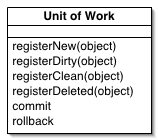

#                   [DDD 领域驱动设计－谈谈 Repository、IUnitOfWork 和 IDbContext 的实践（2）](https://www.cnblogs.com/xishuai/p/ddd-repository-iunitofwork-and-idbcontext-part-2.html)              


上一篇：《[DDD 领域驱动设计－谈谈 Repository、IUnitOfWork 和 IDbContext 的实践（1）](http://www.cnblogs.com/xishuai/p/ddd-repository-iunitofwork-and-idbcontext.html)》

阅读目录：

1. [抽离 IRepository 并改造 Repository](https://www.cnblogs.com/xishuai/p/ddd-repository-iunitofwork-and-idbcontext-part-2.html#xishuai_h1)
2. [IUnitOfWork 和 Application Service 的变化](https://www.cnblogs.com/xishuai/p/ddd-repository-iunitofwork-and-idbcontext-part-2.html#xishuai_h2)
3. [总结三种设计方案](https://www.cnblogs.com/xishuai/p/ddd-repository-iunitofwork-and-idbcontext-part-2.html#xishuai_h3)

简单总结上篇所做的两个改进：

- 从 Repository 和 UnitOfWork 中抽离出 IDbContext，并且它们只依赖于 IDbContext。
- Repository 和 UnitOfWork 为平级关系，UnitOfWork 负责维护对象状态（增删改），Repository 负责获取对象（查）。

后来，园友 Qlin 在评论中，提出了另外一种[方式](http://www.cnblogs.com/xishuai/p/ddd-repository-iunitofwork-and-idbcontext.html#3286032)，大致为：

- Repository 和 UnitOfWork 还是依赖于 IDbContext。
- UnitOfWork 只有 Commit，Repository 提供对象的所有操作（增删改查）。

这篇文章我们就按照这种方式实现一下，关于 Repository、IUnitOfWork 和 IDbContext 的设计，以及  Application Service  的调用，上面是两种设计方案，加上上一篇博文开头说到的一种方案，我大致总结了三种，关于它们的优缺点，文章最后我再进行总结。

另外，关于 IDbContext 的接口设计，其实是有些模糊的，因为它并没有真正解耦 EF，比如 `DbSet<TEntity> Set<TEntity>()`  还是依赖于 EF，没办法，就像我们在 Repository 中返回 IQueryable，你在 Application Service  调用的时候，也必须引用 EF 一样，对于 IDbContext  来说，我们暂时把它看作是一个数据上下文容器，所有对象的持久化最后都通过它来完成，因为我们的解决方案暂时只能使用 EF，所以对于  IDbContext，我们先暂时这样设计。

下面我们开始进行设计。

## 1. 抽离 IRepository 并改造 Repository

抽离 IRepository 啥意思？我们直接来看下代码：

```
namespace DDD.Sample.Domain.IRepository
{
    public interface IRepository<TAggregateRoot> 
        where TAggregateRoot : class, IAggregateRoot
    {
        void Add(TAggregateRoot aggregateRoot);

        void Update(TAggregateRoot aggregateRoot);

        void Delete(TAggregateRoot aggregateRoot);

        TAggregateRoot Get(int id);
    }
}
```

IRepository 是一个泛型接口，类型为 IAggregateRoot，我们在里面定义了增删改查的常用操作，它的作用就是减少 Repository 的冗余代码，我们看下 IStudentRepository 的定义：

```
namespace DDD.Sample.Domain.IRepository
{
    public interface IStudentRepository : IRepository<Student>
    {
        Student GetByName(string name);
    }
}
```

IStudentRepository 需要继承 IRepository，并确定泛型类型为 Student，Student 继承自  IAggregateRoot，因为增删改查常用操作已经定义，所以我们在其它类似的 IStudentRepository 中就不需要定义了。

IRepository 需要进行实现，如果在 StudentRepository 中进行实现，就没有什么作用了，所以我们需要一个 BaseRepository 来实现 IRepository：

```
namespace DDD.Sample.Repository
{
    public abstract class BaseRepository<TAggregateRoot> : IRepository<TAggregateRoot>
        where TAggregateRoot : class, IAggregateRoot
    {
        public readonly IDbContext _dbContext;

        public BaseRepository(IDbContext dbContext)
        {
            _dbContext = dbContext;
        }

        public void Add(TAggregateRoot aggregateRoot)
        {
            _dbContext.Set<TAggregateRoot>().Add(aggregateRoot);
        }

        public void Update(TAggregateRoot aggregateRoot)
        {
            _dbContext.Entry<TAggregateRoot>(aggregateRoot).State = EntityState.Modified;
        }

        public void Delete(TAggregateRoot aggregateRoot)
        {
            _dbContext.Set<TAggregateRoot>().Remove(aggregateRoot);
        }

        public TAggregateRoot Get(int id)
        {
            return _dbContext.Set<TAggregateRoot>().FirstOrDefault(t => t.Id == id);
        }
    }
}
```

咋一看 BaseRepository 有点像我们上篇的 UnitOfWork，因为我们把增删改放在 Repository 了，因为  Repository 还是和 UnitOfWork 为平级关系，所以我们在 Repository 中用的 IDbContext 而非  IUnitOfWork，这个没什么问题，我们看下 StudentRepository 的具体实现：

```
namespace DDD.Sample.Repository
{
    public class StudentRepository : BaseRepository<Student>, IStudentRepository
    {
        public StudentRepository(IDbContext dbContext)
            : base(dbContext)
        {
        }

        public Student GetByName(string name)
        {
            return base._dbContext.Set<Student>().Where(x => x.Name == name).FirstOrDefault();
        }
    }
}
```

StudentRepository 很简单，因为常用操作 BaseRepository 已经实现了，`base(dbContext)` 的作用就是给 BaseRepository 注入 IDbContext 对象。

Repository 的改造基本上就这些，表面看起来确实很好，另外，如果没有 IUnitOfWork 和 Application Service，我们对 Domain 进行单元测试，也是能满足我们的需求，但需要将 IDbContext 再进行修改下。

## 2. IUnitOfWork 和 Application Service 的变化

我们先看下 IUnitOfWork 的变化，直接贴下代码：

```
namespace DDD.Sample.Infrastructure.Interfaces
{
    public interface IUnitOfWork
    {
        bool Commit();

        void Rollback();
    }
}
```

因为增删改都移到 Repository 中了，所以 IUnitOfWork 的工作就很简单，只有 Commit 和 Rollback，实现也比较简单，我们看下：

```
namespace DDD.Sample.Infrastructure
{
    public class UnitOfWork : IUnitOfWork
    {
        private IDbContext _dbContext;

        public UnitOfWork(IDbContext dbContext)
        {
            _dbContext = dbContext;
        }

        public bool Commit()
        {
            return _dbContext.SaveChanges() > 0;
        }

        public void Rollback()
        {
            throw new NotImplementedException();
        }
    }
}
```

这个没啥说的，我们直接看下 Application Service 的代码：

```
namespace DDD.Sample.Application
{
    public class StudentService : IStudentService
    {
        private IUnitOfWork _unitOfWork;
        private IStudentRepository _studentRepository;
        private ITeacherRepository _teacherRepository;

        public StudentService(IUnitOfWork unitOfWork, 
            IStudentRepository studentRepository,
            ITeacherRepository teacherRepository)
        {
            _unitOfWork = unitOfWork;
            _studentRepository = studentRepository;
            _teacherRepository = teacherRepository;
        }

        public Student Get(int id)
        {
            return _studentRepository.Get(id);
        }

        public bool Add(string name)
        {
            var student = new Student { Name = name };
            var teacher = _teacherRepository.Get(1);
            teacher.StudentCount++;

            _studentRepository.Add(student);
            _teacherRepository.Update(teacher);
            return _unitOfWork.Commit();
        }
    }
}
```

StudentService 其实变化不大，只是将原来的 _unitOfWork 添加修改操作，改成了  _studentRepository 和 _teacherRepository，执行下 StudentService.Add  的单元测试代码，发现执行不通过，为什么呢？因为 Repository 和 UnitOfWork 的 IDbContext  不是同一个对象，添加修改对象通过 Repository 注册到 IDbContext 中，最后 UnitOfWork 执行 Commit  却是另一个 IDbContext，所以我们需要确保 Repository 和 UnitOfWork 共享一个 IDbContext  对象，怎么实现呢？

我们进行改造下：

```
namespace DDD.Sample.Application
{
    public class StudentService : IStudentService
    {
        private IDbContext _dbContext;
        private IUnitOfWork _unitOfWork;
        private IStudentRepository _studentRepository;
        private ITeacherRepository _teacherRepository;

        public StudentService(IDbContext dbContext)
        {
            _dbContext = dbContext;
        }

        public Student Get(int id)
        {
            _studentRepository = new StudentRepository(_dbContext);
            return _studentRepository.Get(id);
        }

        public bool Add(string name)
        {
            _unitOfWork = new UnitOfWork(_dbContext);
            _studentRepository = new StudentRepository(_dbContext);
            _teacherRepository = new TeacherRepository(_dbContext);

            var student = new Student { Name = name };
            var teacher = _teacherRepository.Get(1);
            teacher.StudentCount++;

            _studentRepository.Add(student);
            _teacherRepository.Update(teacher);
            return _unitOfWork.Commit();
        }
    }
}
```

上面对应的测试代码执行通过，其实解决方式很简单，就是手动给 UnitOfWork、StudentRepository 和  TeacherRepository 注入相同的 IDbContext  对象，当然这是一种解决方式，还有人喜欢用属性注入，这都是可以的，无非最后就是想让 Repository 和 UnitOfWork 共享一个  IDbContext 对象。

本篇的相关代码已提交到 GitHub，大家可以参考下：https://github.com/yuezhongxin/DDD.Sample

## 3. 总结三种设计方案

关于 Repository、IUnitOfWork 和 IDbContext 的设计，以及 Application Service 的调用，我总结了三种设计方式，我觉得也是我们常用的几种方式，下面我大致分别说下。

### 1. IUnitOfWork -> EfUnitOfWork -> Repository -> Application Service

这种设计应该我们最熟悉，因为我们一开始就是这样设计的，但问题也是最多的，要不然我也不会写上一篇博文了，比如存在的问题：

- IUnitOfWork 的职责不明确。
- Repository 的职责不明确。
- Application Service 很困惑，因为它不知道该使用谁。
- Application Service 的代码越来越乱。
- ....

上一篇博文最后分析出来是 IUnitOfWork 的设计问题，因为它做了太多的事，并且 Repository 依赖于  IUnitOfWork，以至于最后在 Application Service 的调用中，Repository  显得非常多余，这种设计最大的问题就是**职责不明确**。

### 2. IDbContext -> IUnitOfWork/IRepository(only query) -> UnitOfWork/Repository -> Application Service

第二种设计是我比较倾向于的，因为第一种设计出现的问题，所以我对 IUnitOfWork 的设计非常看重，并且我读了《企业应用架构模式》中关于 UnitOfWork 的所有内容，其实就那么几个字可以概括：**维护对象状态，统一提交更改。**我个人觉得架构设计最重要的地方就是底层接口的设计，就像我们盖一栋摩天大楼，如果地基打不稳，最后的结果肯定是垮塌，所以，我比较坚持 IUnitOfWork 这样的设计：



相对于第一种设计，这种设计还有一个不同就是 IUnitOfWork 和 IRepository  为平级关系，为什么这样设计？因为我们不能通过 IUnitOfWork 提供查询操作，并且 IUnitOfWork 和 ORM  也没什么关系，所以我们最后抽离出来一个 IDbContext，并且用 EF 去实现它。

IRepository 只有查询，这是我们的定义，在 Application Service 的调用中，对象的新增和修改都是通过  IUnitOfWork 进行实现的，因为查询并不需要记录状态，所以我们并不需要将 IDbContext 在 IUnitOfWork 和  IRepository 之间进行共享，有人会说，IRepository 应该提供领域对象的增删改操作啊，我们再看下 Repository  的定义：协调领域和数据映射层，利用类似于集合的接口来访问领域对象。

集合访问领域对象，那 Repository 如果这样设计呢：

```
public class StudentRepository : IStudentRepository
{
    private IQueryable<Student> _students;

    public StudentRepository(IDbContext dbContext)
    {
        _students = dbContext.Set<Student>();
    }

    public Student GetByName(string name)
    {
        return _students.Where(x => x.Name == name).FirstOrDefault();
    }
}
```

这种 Repository 设计是比较符合定义的，另外，我们如果对 Domain 进行单元测试，集合性质的领域对象也是可以进行维护的，只不过没有持久化而已。

总的来说，第二种设计最大的优点就是**职责明确**，你想干坏事也干不了（因为接口已经被约束），目前来说没发现什么问题。

### 3. IDbContext -> IUnitOfWork(only commit)/IRepository -> UnitOfWork/Repository -> Application Service

第三种设计就是本篇博文讲述的，它其实是从第一种和第二种之间取一个中间值，做了一些妥协工作，具体的实现，上面已经详细说明了，我最接受不了的是对  IUnitOfWork  的更改，虽然表面看起来蛮好的，但我总觉得有些不对劲的地方，就像我们“迫于现实做一些违背道德的事”，可能现在觉察不到什么，但出来混的总是要还的。

关于 Repository、IUnitOfWork 和 IDbContext 的设计，以及 Application Service 的调用，我觉得应该是我们在 DDD 架构设计过程中，最普遍遇到的一个问题，但也是最困惑的一个问题，比如最近两个园友写的博文：

- [关于 Repository、IUnitOfWork 在领域层和应用服务层之间的代码分布与实现](http://www.cnblogs.com/zuowj/p/4884947.html)
- [关于 MVC EF 架构及 Repository 模式的一点心得](http://www.cnblogs.com/crazyboy/p/4895256.html)

对于本篇博文，如果你有什么问题或疑问，欢迎探讨学习。:)

 作者：田园里的蟋蟀 
微信公众号：**你好架构** 
出处：http://www.cnblogs.com/xishuai/  
 公众号会不定时的分享有关架构的方方面面，包含并不局限于：Microservices（微服务）、Service  Mesh（服务网格）、DDD/TDD、Spring Cloud、Dubbo、Service  Fabric、Linkerd、Envoy、Istio、Conduit、Kubernetes、Docker、MacOS/Linux、Java、.NET  Core/ASP.NET  Core、Redis、RabbitMQ、MongoDB、GitLab、CI/CD（持续集成/持续部署）、DevOps等等。 
 本文版权归作者和博客园共有，欢迎转载，但未经作者同意必须保留此段声明，且在文章页面明显位置给出原文连接。 