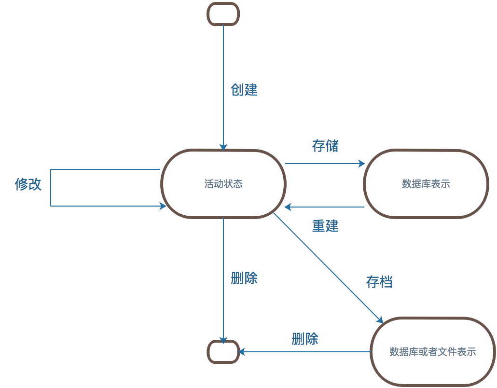

# 领域驱动设计理论基础

https://yq.aliyun.com/articles/648024

https://blog.csdn.net/weixin_34257076/article/details/89626658

## 运用领域模型

### 消化知识

做好一块业务的第一步是如何消化一个知识，消化一个知识其实就是**建立有效模型**，

将知识**透明化**，变成**可视化**、**可交流**的文档或者图形。有效建模的要素包括以下几点：

-  *模型和现实的绑定*。最初的原型可能比较简陋，但它会在模型与现实之间建立早期链接，所有后续的迭代是维护完善该链接。
-  *建立了一种基于模型的语言*。随着项目的进展，**参与者都能够使用模型中的术语**，并将它们组织成符合模型结构的语句，而且无需翻译即可理解互相要表达的意思。
-  *开发一个蕴含丰富知识的模型*。 对象**具有行为**和**强制性规则**。模型不仅仅是一种数据模式，它还是解决复杂问题不可或缺的部分。我们需要**挖掘提取业务知识背后隐藏的概念**。将复杂的知识进行分解，分解成单一变化的对象。
-  *提炼模型*。 在模型日趋完整的过程中，重要的概念不断被添加到模型中，但同样重要的是，不再使用的或不重要的概念则从模型中被移除。**当一个不需要的概念与一个重要的概念关联时，则把重要的概念提取到一个新模型中，其他那些不要的概念就可以丢弃。**
-  *头脑风暴和实验*。语言和草图，再加上头脑风暴活动，将我们的讨论变成“模型实验室”，在这些讨论中可以演示、尝试和判断上百种变化。当团队走查场景时，**口头表达本身就可以作为所提议的模型的可行性测试。**

在传统的瀑布方法中，业务专家与分析员进行讨论，分析员消化理解这些知识后，对其进行抽象并将结果结果传递给程序员，再由程序员编写软件代码。由于这种方法**没有反馈**，因此总是失败。分析员全权负责创建模型，但他们创建的模型只是基于业务专家的意见。他们既没有向程序员学习的机会，也得不到早期软件版本的经验。知识只是朝一个方向在流动，但是不会积累。
 好的程序员会自然而然地**抽象并开发出**一个可以**完成更多工作的模型**。但是这个模型只是局部的，只能满足特定时刻特定部分的需求。只有团队所有成员一起消化理解模型，通过**频繁的交互才能形成全局有效一致的认知**。领域模型的不断精化迫使开发人员学习重要的业务原理，而不是机械地进行功能开发。领域专家被迫提炼自己已知的重要知识过程往往也是完善其自身理解的过程，而且他们会渐渐理解软件项目所必须的概念严谨性。模型聚焦于需求分析，同时与编程和设计紧密交互。它通过良性循环加深团队对领域的理解，使他们更透彻地理解模型，并对其进一步精化。

### 统一团队的领域交流语言

要想创建一种灵活的、蕴含丰富知识的设计，需要一种通用的、共享的团队语言，以及对语言的不断的试验。
 如果语言支离破碎，项目必将遭遇严重问题。日常讨论所使用的术语和代码（软件项目的最重要产品）中使用的**术语【表述】不一致**。甚至同一个人在讲话和写东西时使用的语言也不一致，这导致的后果是，对领域的深刻表述常常稍纵即逝，根本无法记录到代码或文档中。
 翻译使得沟通不畅，并削弱了知识消化，带来误解的风险。口头沟通会产生信息不可逆的丢失。
 团队统一的领域语言的词汇应该包括但不限于类及主要操作的名称。语言中的术语，有些可以是模型**讨论中已经明确的规则**，有些可以是**来自模型上的高级组织规则**，团队常常用于领域模型的设计模式也使领域语言更加丰富。
 通过大量使用基于模型的语言，并且不达流畅绝不罢休，我们可以逐步得到一个完整的、易于理解的模型，它由简单元素组成，并通过组合这些简单元素表达复杂概念。
 将模型作为语言的支柱。确保团队在内部所有交流中以及代码中坚持使用这种语言。在画图、写东西，特别是讲话时也要使用这种语言。
 通过尝试不同的表示方法（它们反映了备选模型）来消除难点。然后重构代码，重新命名类、方法和模块，以便与新模型保持一致。

领域专家应该**抵制不合适或无法充分表达领域理解的术语或结构**，开发人员应该密切关注那些将会妨碍设计的有歧义和不一致的地方。
 讨论系统时要结合模型。使用模型元素及其交互来大声描述场景，并且按照模型允许的方式将各种概念结合到一起。找到更简单的表达方式讲出你要讲的话，然后将这些新的想法应用到图和代码中。

### 绑定模型和实现

如果整个程序设计或者其核心部分没有与领域模型相对应，那么这个模型就是没有价值的，软件的正确性也值得怀疑。同时，模型和设计功能之间过于复杂的对应关系也是难于理解的，在实际项目中，当设计改变时也无法维护这种关系。若分析与设计之间产生严重分歧，那么在分析和设计活动中所获得的知识就无法彼此共享。

 模型驱动设计（Model-Driven  Design）**不再将分析模型和程序设计分离开**，而是寻求一种能够满足这两方面需求的单一模型。不考虑纯粹的技术问题，程序设计中的每个对象都反映了模型中所描述的响应概念。这就要求我们以更高的标准来选择模型，因为它必须同时满足两种完全不同的目标。
 软件系统各个部分的设计应该**忠实地反映领域模型**，以便体现出这两者之间的明确对应关系。我们应该**反复检查并修改模型**，以便软件**可以更加自然地实现模型**，即使想让模型反映出更深层次的领域概念也该如此。我们需要的模型不但应该满足这两种需求，还应该能够支持健壮的通用语言。
 从模型中获取用于程序设计和基本职责分配的术语。**让程序代码成为模型的表达。**代码的改变可能会是模型的改变，而其影响势必要波及接下来响应的需求项目。
 面向对象编程之所以功能强大，是因为它基于建模范式，并且为模型构造提供了实现方式。从程序员的角度来看，对象真实存在于内存中，它们与其他对象互相联系，它们被组织成类，并且通过消息传递来完成相应的行为。
 模型驱动设计的核心点是**编程思想的转变**，从过程设计转变成面向对象设计。如果编写代码的人员认为自己没必要对模型负责，或者不知道如何让模型为应用程序服务，那么这个模型就和程序没有任何关联。如果开发人员没有意识到改变代码就意味着改变模型，那么他们对程序的重构不但不会增强模型的作用，反而还会削弱它的效果。同样，如果建模人员不参与到程序实现的过程中，那么对程序实现的约束就没有切身的感受，即使有，也会很快忘记。**如果分工阻断了设计人员与开发人员之间的协作，使他们无法转达实现模型驱动设计（Model-Driven  Design）的种种细节，那么经验丰富的设计人员则不能将自己的知识和技术传递给开发人员。**
 任何参与建模的技术人员，不管在项目中的主要职责是什么，都必须花时间了解代码。任何负责修改代码的人员则必须学会用代码来表达模型。每一个开发人员都必须不同程度地参与模型讨论。参与不同工作的人都必须有意识地通过团队统一语言与接触代码的人及时交换关于模型的想法。

## 分离领域

分层的价值在于每一层都只代表程序中的**某一特定方面**。这种限制使每个方面的设计都**更具内聚性，更容易解释。**当然，要分离出内聚设计中最重要的方面，选择恰当的分层方式是至关重要的。尽管Layered  Architecture的种类繁多，但是大多数成功的架构使用的都是下面4个概念层的某种变体。

| 层级                   | 说明                                                         |
| ---------------------- | ------------------------------------------------------------ |
| 用户界面层（或表示层） | 负责向用户显示信息和解释用户指令。这里指的用户可以是另一个计算机系统，不一定是使用用户界面的人 |
| 应用层                 | 定义软件要完成的任务，并且**指挥表达领域概念的对象**来解决问题。这一层所负责的工作对业务来说意义重大，也是与其他系统的应用层进行交互的必要渠道 |
| 领域层（或模型层）     | 负责表达**业务概念**，业务**状态信息**以及业务规则。尽管保存业务状态的技术细节是由基础设施层实现的，但是反映业务情况的**状态是由领域层控制**并且使用的领域层是业务软件的核心。 |
| 基础设施层             | 为上面各层提供通用的技术能力；**为应用层传递消息**，为领域层提**供持久化机制**，为用户界面层绘制屏幕组件等等。基础设施层还能够通过架构框架来支持4个层次间的交互模式。 |

如果与领域有关的代码分散在大量的其他层（用户界面层、应用层、基础设施层等）之中，那么查看与分析领域代码就会变得异常困难。对用户界面的简单修改实际上很可能会改变业务逻辑。而要想调整业务规则也可能需要对用户界面代码、数据库操作代码或者其他的程序元素进行仔细的筛查。这样就不太可能实现一致的、模型驱动的对象了，同时也会给自动化测试带来困难。
 给复杂的应用程序划分层次。在每一层内分别进行设计，使其**具有内聚性并且只依赖于它的下层**。采用标准的架构模式，只与上层进行松散的耦合。将所有与领域模型相关的代码放在一个层中，并把它与用户界面层、应用层以及基础设施层的代码分开。领域对象应该将重点放在**如何表达领域模型上，而不需要考虑自己的显示和存储问题，也无需管理应用任务等内容**。这使得模型的**含义足够丰富**，**结构足够清晰**，可以捕捉到**基本的业务知识**，并有效的使用这些知识。

 各层之间是松散连接的，层与层的依赖关系只能是单向的。上层可以直接使用或操作下层元素，方法是通过调用下层元素的公共接口，保持对下层元素的引用，以及采用常规的交互手段。而如果下层元素需要与上层元素进行通信，则需要采用另一种通信机制，使用架构模式来连接上下层，如回调模式或观察者模式等。
 一个复杂的项目应该采用模型驱动设计（Model-Driven Design），不应该使用一些类似Smart  UI的“反模式”，这类模式虽然效率高，可以顺利地使用关系数据库，能够提供数据级的整合，但是违反了层次架构，在复杂业务场景中没有对业务问题进行抽象，导致很多代码无法复用，同时会形成概念模糊，无中心的现象。

### 模型表示的元素

用于表示模型的3种模型元素模式：Entity、Value  Object和**Service**。一个对象是用来表示某种具有连续性和标识事物，还是用于描述某种状态的属性，这是**Entity**和**Value  Objecct**之间的根本区别。明确的选择这两种模式中的一个来定义对象，**有利于减少歧义，并帮助我们做出特定的选择**，这样才能得到健壮的设计。
 领域中还有一些方面适合**用动作或操作来表示，这比用对象表示更加清楚**。这些方面**最好用Service**来表示，而不应把操作的责任强加到Entity或Value Object上，尽管这样做只是稍微违背了面向对象的建模传统。**Service是接受客户端请求来完成某事**。在软件技术层中有很多Service（这些不全是领域层所说的Service）。领域层的也可以使用Service，当对软件要做的某项无状态的活动进行建模时，就可以将该活动作为一项Service。

##### **关联**

 现实生活中有大量“多对多”关联，其中有很多关联天生就是双向的，我们在模型开发的早期进行头脑风暴活动并探索领域时，也会得到很多这样的关联。但这些普遍的关联会使实现和维护变得很复杂。
 尽可能地对关系进行约束是非常重要的。我们可以**规定一个方向去梳理关联**；通过添加一个限定符，以便有效的**将“多对多”关联限制为“一对多”关联；**从业务角度去**消除不必要的关联**。
 从仔细地简化和约束模型的关联到真正的模型驱动设计还有一段很漫长的探索过程。仔细区分对象可以使得模型更加清晰，并得到更实用的实现。

##### **Entity**

 一些对象主要不是由它们的属性定义的，它们实际上表示了一条“标识线”，这些主要由标识定义的对象被称作Entity。Entity（实体）有特殊的建模和设计思路。它们**具有生命周期**，这期间它们的**形式和内容可能发生根本改变**，但必须保持一种内在的**连续性**。**【状态】**
 标识有时只有在系统上下文中才重要。比如体育场预定程序可能将座位和观众当作Entity来处理，但如果活动采用入场券方式，那么就不需要对座位加以区分，这种情况下，只有座位总数才是重要的。
 当一个对象由其标识（而不是属性）区分时，那么在模型中应该主要通过标识来确定该对象的定义。使类定义变得简单，并集中关注生命周期的连续性和标识。定义一种区分每个对象的方式，这种方式应该与形式和历史无关。要格外注意那些需要**通过属性来匹配对象**的需求。在定义标识操作时，要确保这种操作作为每个对象生成唯一的结果，**这可以通过附加一个保证唯一性的符号来实现**。这种定义标识的方法可能来自外部，也可能是由系统创建的任意标识符，但**它在模型中必须是唯一的标识。模型必须定义出“符合什么条件才算是相同的事物”（可以理解为数据库表的业务唯一健）**。比如挂号场景下，用户订单就是一个Entity，而这个订单所对应的科室疾病就不是一个Entity。
 每个Entity都必须有一种建立标识的操作方式，以便与其他对象区分开。不管系统是如何定义的，都必须确保标识属性在系统中是唯一的，即使是分布式系统中，或者对象已经被归档，也必须确保标识的唯一性。

##### **Value Object**

 很多对象没有概念上的标识，但它们**描述**了一个**事物的某种特征**。用于描述领域的某个方面而本身没有概念标识的对象称为Value Object。Value  Object被实例化之后用来表示一些设计元素，对于这些设计元素，我们只关心它们是什么，而不关心它们是谁。Value  Object是对Entity的补充。
 跟踪Entity的标识是非常重要的，但为其他对象也加上标识会影响系统性能并增加分析工作，而且会使模型变得混乱，因为所有对象看起来都是相同的。
 软件设计要**时刻与复杂性做斗争**。我们必须区别对待问题，仅在真正需要的地方进行特殊处理。
 当我们**只关心一个模型元素的属性时**，应把它归类为Value  Object。我们应该使用这个模型元素能够表示出其属性的意义，并为它提供相关功能。Value  Object应该是不可变的（不是绝对的不可变）。不要为它分配任何标识，而且不要把它设计成像Entity那么复杂。
 Entity之间的双向关联很难维护，两个Value Object之间的双向关联则完全没有任何意义。

##### **Service**

 有时候对象不是一个事物，在设计中会**包含一些特殊的操作**，这些操作从概念上讲不属于任何对象。与其把它们强制地归于哪一个类，不如顺其自然地在模型中引入一种新的元素，这就是Service（服务）。一些领域改变**不适合被建模为对象**。如果勉强把这些重要的领域功能归为Entity或Value   Object的职责，那么不是歪曲基于建模的对象定义，就是人为增加一些无意义的对象。比如账户之间的转账，用转账服务来描述比将转账行为分解到账户中更加自然。
 使用Service时应谨慎，它们不应该替代Entity和Value  Object的所有行为。但是，一个操作实际上是一个重要的领域概念时，Service很自然就会称为Model-Driven  Design中的一部分。将模型中的独立操作声明为一个Service，而不是声明为一个不代表任何事情的虚拟对象，可以避免对任何人产生的误导。

###### 好的Service应该有以下3个特征：

- 与领域概念相关的不是Entity或Value Object 的一个自然组成部分。
- 接口是根据领域模型的其他元素定义的。
- 操作是无状态，这里说得无状态是指任何客户都可以使用某个Service的任何实例，而不必关心该实例的历史状态。

当领域中的某个重要的过程或转换操作不是Entity或Value  Object的自然职责时，应该在模型中添加一个作为独立接口的操作，并将其声明为Service。同时应该使Service成为无状态的。这里说的Service是那些在领域中具有重要意义的Service，但Service这个概念并不只是在领域层中使用。我们需要注意区分属于领域层的Service和那些属于其他层的Service（比如发送短信的service等），并划分责任，以便将它们明确区分开。
 Service可以控制领域层中的接口的粒度，并且避免客户端与Entity和Value  Object的耦合。在大型系统中，**中等粒度的、无状态的Service更容易被复用**，因为它们在**简单的接口背后封装了重要的功能**。此外，**细粒度的对象可能导致分布式系统的消息传递的效率低下**。

##### **Module（也成为Package）**

 Module为人们提供了两种观察模型的方式，

一是可以在Module中**查看细节**，而不会被整个模型淹没；

二是**观察Module之间的关系**，而不考虑其内部细节。

领域层中的Module应该成为模型中有意义的部分，Module从**更大的角度描述了领域。**
 众所周知，Module之间应该是低耦合的，而在Module的**内部则是高内聚的**。Module不仅仅是代码的划分，也是概念的划分。一个人一次考虑的事情是有限的（因此菜肴低耦合）。不连贯的思想和“一锅粥”似的思想同样难于理解（因此才要高内聚）。
 在一个好的模型中，元素之间是要协同工作的，而仔细选择的Module可以将那些**具有紧密概念关系的模型元素集中**到一起。将这些具有**相同职责的对象元素聚合在一起**，可以把建模和设计集中到单一的Module中，这**极大地降级建模和设计的复杂性**，使人们可以从容应对这些工作。
 选择能够描述系统的Module，并**使之包含一个内聚的概念集合**。这通常会实现Module之间的低耦合，但如果效果不理想，则应寻找一种更改模型的方式来消除概念之间的耦合，或者找到一个新的Module概念（可能之前被忽略了），基于这个概念组织的Module可以以一种有意义的方式**将元素集中到一起**。对模型进行精化，直到可以根据高层领域概念对模型进行划分，同时对应的代码也不会产生耦合。Module及其名称应该能反映出领域模型深层知识。
 领域模型中的每个概念都应该在实现元素中反映出来。Entity、Value  Object、它们之间的关联、领域Service以及用于组织元素的Module都是实现与模型直接对应的地方。实现中的对象、指针和检索机制**必须直接、清楚地映射到模型元素。**如果没有做到这一点，就要重写代码，或者回头修改模型，或者同时修改代码和模型。

##### **建模范式**

 目前主流的范式是面向对象设计，而且现在的大部分复杂项目都开始使用对象。对象建模在简单性和复杂性之间实现了一个很好的平衡。
 虽然对象建模的概念很简单，但它的丰富功能足以捕获重要的领域知识。而且它从一开始就获得了开发工具的支持，使得模型可以在软件中表达出来。大多数开发人员、项目经理和从事项目工作的其他专家都已经很好的接受了面向对象设计。
 领域建模不一定是对象模型。当领域中只有个别元素适合用其他范式时，开发人员可以接受一些蹩脚的对象，以使整个模型保持一致。可以将业务规则引擎或者工作流引擎等类似的非对象组件集成到对象系统中，以使开发人员能够用最适当的风格对待特殊概念进行建模。
 虽然Model-Driven Design 不一定是面向对象的，但它确实需要一种富有表达力的模型结构实现，无论是对象、规则还是工作流，都是如此。当将非对象元素混合到以面向对象为主的系统中时，需要遵循以下4条经验规则：

-  *不要和实现范式对抗*。我们总是可以用别的方式来考虑领域，从而**找到适合于范式的模型概念。**
-  ***把通用语言作为依靠的基础***。即使工具之间没有严格联系时，语言使用上的**高度一致性**也能防止各个设计部分分裂。
-  *不要一味依赖UML*。有时固定使用某种工具（如UML绘图工具）将导致人们通过歪曲模型来得到UML图。有时使用其他风格的图形或简单的语言描述比牵强附会地视图更好。
-  *保持怀疑态度*。工具是否真正有用武之地？不能因为存在一些规则，就必须使用规则引擎。规则也可以表示为对象，虽然可能不是特别优雅。

### 领域对象的生命周期

领域对象的生命周期

管理这些对象时面临诸多挑战，稍有不慎就会偏离Model-Driven Design的轨道。主要的挑战有以下两类：

- 在整个生命周期中维护**完整性和事务**。
- 防止模型陷入管理生命周期**复杂性**造成的困境当中。

通过3种模式解决这些问题。

首先是**Aggregate（聚合）**，它通过定义清晰的**所属关系和边界**，并避免错综复杂的对象关系网来**实现模型的内聚**。聚合模式对于维护生命周期各个阶段的完整性具有至关重要的作用。

接着是在生命周期的开始阶段，使用**Factory（工厂）**来**创建和重建复杂对象**，从而封装它们的内部结构。

最后，在生命周期的中间和末尾使用R**epository（存储库）**来**提供查找和检索持久化对象并封装庞大基础设施的手段。**尽管Repository和Factory本身并不是来源于领域，但它们在领域设计中扮演者重要的角色。

这些结构提供了易于掌握的模型对象处理方式，使Model-Driven  Desogn更完备。

---

### **Aggregate**

 典型对象模型中的关系网使我们难以断定一个修改会产生哪些潜在的影响。仅仅因为存在依赖就更新系统中的每个对象，这样做是不现实的。在多个客户对相同对象进行并发访问的系统中，这个问题更加突出。当很对用户对系统中的对象进行查询和更新时，必须防止他们同时修改互相依赖的对象，范围错误将导致严重的后果。
 在具有复杂关系的模型中，要保证对象更改的一致性是很难的。不仅互不关联的对象需要遵守一定固定规则，而且紧密关联的各组对象也要遵守一些固定规则。然而，过于谨慎的锁定机制又会导致多个用户之间毫无意义地互相干扰，从而使系统不可用。
 实际上，要想找到一种兼顾各种问题的解决方案，要求对领域有深刻的理解，要了解特定类实例之间的更改频率这样的深层次等因素。我们需要找到一个使对象间冲突较少而固定规则联系更紧密的模型。**【内聚】**
 尽管从表面上看这个问题是数据库事务方面的一个技术难题，但它的**根源在模型**，归根结底是由于模型中缺乏**明确定义的边界**。从模型得到的解决方案将使模型**更易于理解**，并且使设计**更易于沟通**。当模型被修改时，它将引导我们对实现作出修改。
 我们需要用一个抽象来封装模型中的引用。Aggregate就是一组相关对象的集合，我们把它作为数据修改的单元。每个Aggregate都有一个根（root）和一个边界（boundary）。根是Aggregate所包含的一个特定Entity。对Aggregate而言，**外部对象只可以引用根**，而**边界内部的对象之间则可以互相引用。**
 为了实现这个概念上的Aggregate，需要对所有事务应用一组规则。

- 根Entity具有全局标识，它最终**负责检查固定规则**。
- 根Entity具有全局标识。边界内的Entity具有本地标识，这些标识只在Aggregate内部才是唯一的。
- Aggregate外部的对象不能引用除Entity之外的任何内部对象。根Entity可以把内部Entity的引用传给它们，但这些对象只能临时使用这些引用，而不能保持引用。根可以把一个Value  Object的副本传给另一个对象，而不必关系它发生什么变化，因为它只是一个Value，不再与Aggregate有任何关联。
- 作为上一条规则的推论，**只有Aggregate的根才能直接通过数据库查询获取。所有其他对象必须通过关联来发现。**
- Aggregate内部的对象可以保持对其他Aggregate根的引用。
- **删除操作必须一次删除Aggregate边界之内的所有对象。**
- 当提交对Aggregate边界内部的任何对象的修改时，整个Aggregate的所有固定规则都必须被满足。

我们应该将Entity和Value  Object分门别类地聚集到Aggregate中，并定义每一个Aggregate的边界。在每个Aggregate中，选择一个Entity作为根，并**通过根来控制对边界内其他对象的所有访问。**由于根控制访问，因此不能绕过它来修改内部对象。这种设计有利于确保Aggregate中的对象满足所有固定规则，也可以确保在任何状态变化时**Aggregate作为一个整体满足固定规则**。

### **Factory**

 当创建一个对象或创建整个Aggregate时，如果创建工作很复杂，或者暴露了过多的内部结构，则可以使用Factory进行封装。
 对象的功能主要体现在其复杂的内部配置以及关联方面。我们应该一直对对象进行提炼，直到所有与其意义或在交互中的角色无关的内容被完全剔除为止。一个对象在它的生命周期里面要承担大量的职责。如果再让复杂对象负责自身的创建，那么职责过载将会导致很多问题。
 复杂的对象创建是领域层的职责，然而这项任务并不属于那些用于表示模型的对象。当客户负责创建复杂对象时，它会牵涉不必要的复杂性，并将其职责搞的模糊不清。这违背了领域对象及所创建的Aggregate的封装要求。更严重的是，如果客户是应用的一部分，那么职责就会从领域层泄漏到应用层中。应用层与实现细节之间的这种耦合使得领域层抽象大部分优势荡然无存，而且导致后续更改的代价变得更加高昂。
 对象的创建本身可以是一个主要操作，但被创建的对象并不适合承担复杂的装配操作。将这些职责混在一起可能产生难以理解的拙劣设计。让客户直接创建对象又会使客户的设计陷入混乱，并且破坏被装配对象或Aggregate的封装，而且导致客户与被创建对象的实现之间产生过于紧密的耦合。
 每种面向对象的语言都提供了一种创建对象的机制（例如C++和java中的构造函数，Smalltalk中创建实例的类方法），但我们仍然需要一种更加抽象且不与其他对象发生耦合的构造机制。Factory就是一种负责创建其他对象的构造机制，封装了创建复杂对象或Aggregate所需的知识。Factory提供了反映客户目标的接口，以及被创建对象的抽象视图，从而使客户无需知道对象的工作机理就可以使用对象的功能。
 Factory有很多设计方式，包括但不限于工厂方法模式、抽象工厂模式和构造器模式。任何好的工厂都需要满足以下两个基本需求：

- 每个创建方法都是原子的，而且要保证被创建对象或Aggregate的所有固定规则。Factory生成的对象要处于一致的状态。在生成Entity时，意味着创建满足所有固定规则的整个Aggregate，但在创建完成后可以向Aggregate添加可选元素。
- Factory应该被抽象为所需的类型，而不是所要创建的具体类。

在向Aggregate添加元素时可以通过在Aggregate的根上创建一个Factory Method，从而把Aggregate的内部实现细节隐藏起来，使任何外部客户看不到这些细节，同时使根负责确保Aggregate在添加元素的完整性。
 当创建一个对象时，这个对象与另一个对象的生成密切相关，但它并不拥有所生成的对象。也就是当一个对象的创建主要使用另一个对象的数据（或许还有规则）时，则可以在后者的对象上创建一个Factory  Method，这样就不必将后者的信息提取到其他地方来创建前者。这样做还有利于表达前者和后者之间的关系。
 Factory与被构造对象之间是紧密耦合的，因此Factory应该只被关联到与被构造对象有着密切联系的对象上。当有些细节需要隐藏而又找不到合适的地方来隐藏它们时，必须创建一个专用的Factory对象或Service。整个Aggregate通常由一个独立的Factory来创建，Factory负责把对根的引用传递出去，并确保创建出的Aggregate满足固定规则。如果Aggregate内部的某个对象需要一个Factory，而这个Factory又不适合在Aggregate根上创建，那么应该构建一个独立的Factory。

Factory的引入提供了巨大的优势，而这种优势往往并未得到充分利用。但是，在有些情况下直接使用构造函数确实是最佳选择。Factory实际上会使那些不具有多态性的简单对象复杂化。以下情况下最好使用简单的、公共的构造函数。

- 类是一种类型。它不是任何相关层次结构的一部分，而且也没有通过接口实现多态性。
- 客户关心的是实现，可能是将其作为选择Strategy的一种方式。比如java中的集合类。
- 客户可以访问对象的所有属性，因此向客户公开的构造函数中没有嵌套的对象创建。
- 构造并不复杂。
- 公共构造函数必须遵守与Factory相同的规则：它必须是原子操作，而且要满足被创建对象的所有固定规则。

不要在构造函数中调用其他类的构造函数。构造函数应该保持绝对简单。复杂的装配，特别是Aggregate，需要使用Factory。
 无论是独立的Factory还是Factory Method，都要记住以下两点：

-  *每个操作都必须是原子的*。我们必须在与Factory的一次交互中把创建对象所需的所有信息传递给Factory。同时必须确定当创建失败时将执行什么操作。可以考虑采用编码标准来处理所有Factory的失败。
-  *Factory将与其参数发生耦合*。如果在选择输入参数时不小心，可能会产生错综复杂的依赖关系。耦合程度取决于对参数的处理。如果只是简单地将参数插入到要构建的对象中，则依赖程度适中；如果从参数选出一部分在构造对象时使用，耦合将更紧密。

在某些情况下，把固定规则的相关逻辑放到Factory中是有好处的，这样可以让被创建对象的职责更明晰。对于Aggregate规则来说尤其如此（这些规则会约束很多对象）。固定规则的相关逻辑应该集中在Entity的构造Factory中，特别**不适合**放到那些与其他领域对象关联的Factory Method中。

检索操作需要一个复杂的操作将各个部分重新装配成一个可用的对象。用于重建对象的Factory与用于创建对象的Factory很类似，主要有以下两点不同。

- 用于重建对象的Entity Factory不分配新的跟踪ID。如果分配新ID，将丢失与先前对象的连续性。因此，在重建对象的Factory中，标识属性必须是输入参数的一部分。
- 当固定规则未被满足时，重建对象的Factory采用不同的方式进行处理。当创建新对象时，如果未满足固定规则，Factory应该简单的拒绝创建对象，但在重建对象时则需要更灵活的响应。如果对象已经在系统某个地方存在（如数据库中），那么不能忽略这个事实。

### **Repository**

 Factory封装了对象创建和重建时的生命周期转换。还有一种转换大大增加了领域设计的技术复杂性，就是对象与存储之间的互相转换。这种转换由另一种领域设计构造来处理，它就是Repository。
 我们可以通过对象之间的关联找到对象。但当它处于生命周期的中间时，必须要有一个起点，以便从这个起点遍历到一个Entity或Value。
 领域驱动设计的目标是通过关注领域模型（而不是技术）来创建更好的软件。假设开发人员构造了一个SQL查询，并将它传递给基础设施层中的某个查询服务，然后再根据得到的表行数据的结果集提取出所需信息，最后将这些信息传递给构造函数或者Factory。开发人员执行这一连串操作的时候，早已不再把模型当作重点了。当客户代码直接使用数据库时，开发人员会试图绕过模型的功能（如Aggregate，甚至是对象封装），而直接获取和操作他们所需的数据。这将导致越来越多的领域规则被嵌入查询代码中，或干脆丢失了。如果基础设施提供了这方面的便利，那么开发人员可能会增加很多遍历的关联，这会使模型变得非常混乱。另一方面，开发人员可能使用查询从数据库中提取他们所需的数据，或是直接提取具体的对象，而不是通过Aggregate的根来得到这些对象。这样就导致领域逻辑进入查询和客户代码中，而Entity和Value   Object则变成单纯的数据容器。采用大多数处理数据库访问的技术复杂性很快就会使客户代码变得混乱，这将导致开发人员简化领域层，最终使模型变得无关紧要。
 除了通过根来遍历查找对象这种方法以外，禁止用其他方法对Aggregate内部的任何对象进行访问。持久化的Value Object一般可以通过遍历某个Entity来找到，在这里Entity就是把对象封装在一起的Aggregate的根。
 在所有持久化对象中，有一小部分（通常是Entity，有时是具有复杂内部结构的Value  Object）必须通过基于对象属性的搜索来全局访问。当很难通过遍历方式来访问某些Aggregate根的时候，就需要使用这种访问方式。  其他对象不宜使用这种访问方式，因为这会混淆它们之间的重要区别。随意的数据库查询会破坏领域对象的封装和Aggregate。技术基础设施和数据库访问机制的暴露会增加客户的复杂度，并妨碍模型驱动的设计。
 Repository将某种类型的所有对象表示为一个概念集合（通常是模拟的）。它的行为类似于集合，只是具有更复杂的查询功能。在添加或删除相应类型的对象时，Repository的后台机制负责将对象添加到数据库中，或从数据库中删除对象。这个定义将一组紧密相关的职责集中在一起，这些职责提供了对Aggregate根的整个生命周期的全程访问。
 客户使用查询方法向Repository请求对象，这些查询方法根据客户所指定的条件（通常是特定属性的值）来挑选对象。Repository检索被请求的对象，并封装数据库查询和元数据映射机制。Repository可以根据客户所要求的各种条件来挑选对象。它们也可以返回汇总信息，如有多少个实例满足查询条件。
 Repository解除了客户的巨大负担，使客户只需与一个简单的、易于理解的接口进行对话，并根据模型向这个接口提出它的请求。要实现所有这些功能需要大量复杂的技术基础设施，但接口很简单，而且在概念层次上与领域模型紧密联系在一起。只为那些确实需要直接访问的Aggregate根提供Repository，让客户始终聚焦于模型，而将所有对象的存储和访问操作封装起来，在Repository里来完成。Respository有很多优点，包括：

- 它们为客户提供了一个简单的模型，可用来获取持久化对象并管理它们的生命周期。
- 它们使应用程序和领域设计与持久化技术（多种数据库策略甚至是多个数据源）解构。
- 它们体现了有关对象访问的设计决策
- 可以很容易将它们替换为“哑实现”，以便在测试中使用（通常使用内存中的集合）

在一些需要执行大量查询的项目上，可以构建一个支持更灵活查询的Repository框架。这要求开发人员熟悉必要的技术，而且一个支持性的基础设施会提供巨大的帮助。即使一个Repository的设计采取了灵活的查询方式，也应该允许添加专门的硬编码查询。不支持这些特殊查询方式的框架有可能会扭曲领域设计，或干脆被开发人员弃之不用。客户代码可以忽略Repository的实现，但开发人员不能忽略，必须知道在封装背后都发生了什么事情。
 Repository概念在很多情况下都适用。可能的实现方法有很多，这里只能列出一些需要谨记的注意事项。

-  *对类型进行抽象*。Repository“含有”特定类型的所有实例，但这并不意味着每个类都需要一个Repository。类型可以是一个层次结构中的抽象超类。类型可以是一个接口，也可以是一个具体的类。由于数据库缺乏这样的多态性质，因此我们将面临很多约束。
-  *充分利用与客户解耦的优点*。我们可以很容易地更改Repository的实现，但如果客户直接调用底层机制，我们就很难修改其实现。也可以利用解耦来优化性能，因为这样就可以使用不同的查询技术，或在内存中缓存对象。

当数据库被视作对象存储时，数据模型与对象模型的差别不应太大。可以牺牲一些对象关系的丰富性，以保证它与关系模型的紧密关联。简单的对应关系才是最好的。表中的一行应该包含一个对象，也可能包含Aggregate中的一些附属项。表中的外键应该转换为对另一个Entity对象的引用。有时我们不得不违背这种简单的对应关系，但不应该由此就全盘放弃简单映射的原则。

