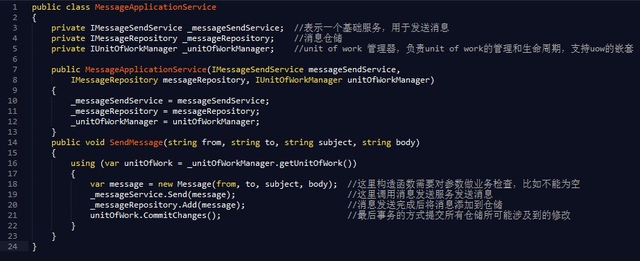
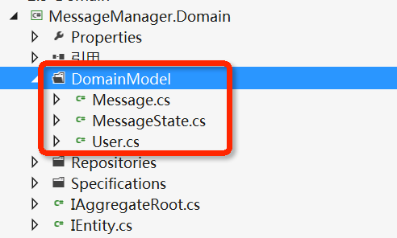
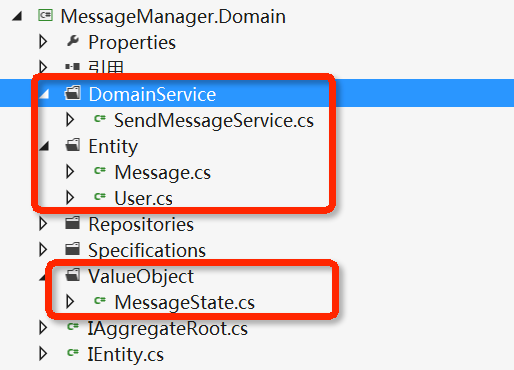

# [No zuo no die：DDD 应对具体业务场景，Domain Model 重新设计](https://www.cnblogs.com/xishuai/p/3827216.html)


## 写在前面

上联：no zuo no die why you try 下联：no try no high give me five 横批： let it go
上联：no zuo no die why you cry 下联：you try you die don't ask why 横批： just do it


阅读目录：

- [自作自受                        ](https://www.cnblogs.com/xishuai/p/3827216.html#xishuai_h1)
- [迷雾中的探照灯          ](https://www.cnblogs.com/xishuai/p/3827216.html#xishuai_h2)
- [我的错，我承认](https://www.cnblogs.com/xishuai/p/3827216.html#xishuai_h3)
- [再次出发                        ](https://www.cnblogs.com/xishuai/p/3827216.html#xishuai_h4)
- [开源地址                        ](https://www.cnblogs.com/xishuai/p/3827216.html#xishuai_h5)
- [后记                        ](https://www.cnblogs.com/xishuai/p/3827216.html#xishuai_h6)

　　上面那幅对联前段时间在网上还蛮火的，意思大家意会就可以了，这边就不翻译了，我个人理解，所表达的个性就是：in my life，no zuo no die。

　　为什么会引入这个流行语？因为在应对具体业务场景，进行领域驱动设计的时候，整个项目的设计实现过程，所表达的就是这个意思：不作不死。　

- **我的“第一次”，就这样没了：DDD（领域驱动设计）理论结合实践**：伪领域驱动设计，只是用 .NET 实现的一个“空壳”，仅此而已。

- **一缕阳光：DDD（领域驱动设计）应对具体业务场景，如何聚焦 Domain Model（领域模型）？**：只是聚焦领域模型（认清各个部分的职责，让设计的焦点集中在领域模型中），文中关于领域模型的实现就是一个“渣”，仅此而已。

- **死去活来，而不变质：Domain Model（领域模型） 和 EntityFramework 如何正确进行对象关系映射？**：走了个弯路，ORM 的映射关系及仓储的实现，应该是在本篇内容之后探讨，原因都是脚本驱动模式惹的祸，如果说脚本驱动模式是恶魔（特定的环境，也有好处，不能一概而论，这边只是一个比喻），那领域驱动设计可以看作是天使，心里想的是天使，却听了恶魔的话，为什么？因为它在你心中已根深蒂固，仅此而已。
- **拨开迷雾，找回自我：DDD 应对具体业务场景，Domain Model 到底如何设计？**：在迷雾森林迷失那么久，自以为走了出来，其实是又走进了另一个迷雾森林，评论中和 netfocus 兄的讨论就证实了这一点。

## 自作自受

　　我曾在上一篇博文的最后这样写道：“可能几天或者几周后，看现在的这篇博文就像一坨屎一样”。这篇博文指的是《[拨开迷雾，找回自我：DDD 应对具体业务场景，Domain Model 到底如何设计？](http://www.cnblogs.com/xishuai/p/3820041.html)》，现在看来，正被我说中了。

　　先回顾一下，上一篇博文所探讨的内容：Domain Model  到底如何设计？毫无疑问，领域模型的设计是领域驱动设计最重要的部分，关于领域模型的设计，从一开始的不理解，把领域模型设计的很贫血，然后业务逻辑都实现在了应用层，后来经过反思，把造成这种设计误区的元凶，怀疑到了  **Repository（仓储）**身上（后来证实，人家是无辜的），然后针对仓储，引入了 **Domain  Service（领域服务）**，把业务逻辑转移到了领域服务中（后来证实，完全错误的引用），只是把 Application 单词变成了 Domain Service 这个单词，其他无任何变化，以至于工作流程逻辑和业务逻辑完全分不开。

　　造成以上的主要原因都是为了领域而领域，并没有实实在在的去**思考业务逻辑和领域模型**，后来认识到这个根本问题后，就抛开一切外在因素，比如领域服务、仓储、应用层、表现层等等，这些统统不管，只做领域模型的设计，让真正的设计焦点集中在领域模型上，然后再针对领域模型做单元测试。

　　上面的思路听起来是还蛮不错的，至少听起来是不错，在上一篇博文中，后来，我是这样“忽悠”大家的：

回到短消息系统－MessageManager，需要注意的是，我们做的是消息系统，**一切的一切都应该围绕 Message 领域模型展开**，   在这个系统中，最重要的就是发送消息这个业务逻辑，什么叫发消息？不要被上面的面向对象所迷惑，只考虑发消息这个具体的业务，我们来分析一下：比如在现实生活中，我们要给女朋友写信，首先我们要写信的内容，写完之后，要写一下女朋友的地址信息及名字，这个写信才算完成，邮递员邮递并不在这个业务逻辑之内了，因为这封信我写上收件人之后，这封信相对于我来说就已经发出了，后面只不过是收件人收不收得到的问题了（即使我写好，没有寄出去）。也就是说邮递员邮递这个工作过程相当于数据的持久化，写信的这个过程就是邮递（发消息的业务逻辑），just  it。

　　观点富有辩证性，会让你认为“的确是这样啊”，呵呵。其实有一点我是说的不错，就是我们做的是短消息系统，一切的**一切都应该围绕  Message  领域模型展开**，消息领域模型中最重要的一个业务逻辑就是发消息（其他业务规则暂不考虑），那发消息的业务逻辑是什么？仅仅是我所固执的认为，往这条消息贴上一个收件人？你能接受吗？至少  netfocus 兄就不接受（具体请看上一篇博文评论），按照这种设计思路，消息领域模型的设计代码如下：

[](javascript:void(0);)

```csharp
 1 /**
 2 * author:xishuai
 3 * address:https://www.github.com/yuezhongxin/MessageManager
 4 **/
 5 
 6 using System;
 7 
 8 namespace MessageManager.Domain.DomainModel
 9 {
10     public class Message : IAggregateRoot
11     {
12         public Message(string title, string content, User sendUser)
13         {
14             if (title.Equals("") || content.Equals("") || sendUser == null)
15             {
16                 throw new ArgumentNullException();
17             }
18             this.ID = Guid.NewGuid().ToString();
19             this.Title = title;
20             this.Content = content;
21             this.SendTime = DateTime.Now;
22             this.State = MessageState.NoRead;
23             this.SendUser = sendUser;
24         }
25         public string ID { get; set; }
26         public string Title { get; set; }
27         public string Content { get; set; }
28         public DateTime SendTime { get; set; }
29         public MessageState State { get; set; }
30         public virtual User SendUser { get; set; }
31         public virtual User ReceiveUser { get; set; }
32 
33         public bool Send(User receiveUser)
34         {
35             if (receiveUser == null)
36             {
37                 throw new ArgumentNullException();
38             }
39             this.ReceiveUser = receiveUser;
40             return true;
41             ///to do...
42         }
43     }
44 }
```

[](javascript:void(0);)

　　我们按照之前的思路来分析一下这个消息领域模型，首先，我们发送一条短消息，需要填写标题、内容、发件人，也就是创建一个消息对象需要在构造函数中传入这些必要值，然后进行为空验证，如果验证不通过，则消息对象就创建失败，也就没有了下面发送的操作，验证成功，进入发送流程。看下消息领域模型中的  Send  方法，也就是我所认为的发送业务逻辑，就是一个简单的收件人赋值操作（可能在赋值之前，有对收件人的验证），收件人赋值，就是消息发送业务逻辑？还有就是  Message 领域模型中的 Send 方法，Send 是动词，Message 对象可以发送自己？

　　关于以上两个疑问，请看下面摘自我和 netfocus 兄的一些讨论内容。

## 迷雾中的探照灯

netfocus 兄：

聚合根的最根本意义是**封装业务规则**

**只对我们所关心的信息和业务规则**进行建模

**应用层代表什么，就是代表系统**

领域建模，切记**不要以人为中心**，要区分什么是**系统的使用者**，什么是模型中**业务逻辑的参与者**；如果认为某某行为是某个人做的，就把这个行为设计到人这个模型上，那就犯了以人为中心的错误了；在模型中，我们应该表达的是消息被创建并发送出去了，然后**人只是这个消息模型的一部分**，就是作**为发送者**，同样，消息接受者也是消息的一部分；实际上，消息是一个聚合根，**聚合根的最根本意义是封装业务规则**，那么消息的业务规则是什么呢？就是，一个消息必须**至少要有一个发送者**，以及**接受者信息**，还要有**消息的标题内容等**；不然这个就不是消息了；

另外，发送消息显然是应用层的一个职责；那么**应用层代表什么，就是代表系统**；所以，  我们要明白人与系统的关系；

人使用系统，**系统提供外部功能**，系统**内部有领域模型**；

另外一点也非常重要，就是我们做领域建模，不是要对整个现实的对象交互过程建模。也就是说，假如你现实生活中是先拿起笔写信，写完后写上收件人和收信地址，然后投递员帮你去投递，然后你女朋友接收到信；这是一 个过程，而我们的系统，不可能把每一个步骤都建模出来，领域建模**只对我们所关心的信息和业务规则**进行建模；

那么假如我们要设计一个系统， 要为系统使用者提供发送消息的功能，那要怎么做呢？先要问问我们自己，我们关心什么？首先，消息肯定要建模出来，不然也谈不上发送消息了；那消息要包含什么信息呢？就是至少包含我上面说到的信息；而且重点是，我认为这些信息应该从**消息的构造函数传入**，然后构造函数中检查各种必要的信息是否传入了；否则就意 味着我们能构建一个非法的消息，试想一个没有收件人的消息如何发送？然后消息的所有属性都应该只读，否则怎么保证消息的状态是合法的，当然如果你的业务允 许修改消息，那也要在刚方法上确保消息修改后也是合法的；总之，你既然设计了消息这个模型，就要充分考虑清楚这个**模型的业务规则是什么**；这个就是DDD一 直强调的聚合根要有true invariants【真正的不变量】，也就是把**真正的不变性封装到模型中**；

然后消息需要有什么行为吗？消息自己有一个Send方法？消息自己能发送自己？这个就好比**聚合根能自己保存自己**，那我们要repository来干嘛？

消息本身只定义了消息模型以及封装了一些**不变性规则**，然后发送消息我上面说了，是一个系统行为；只有系统才知道消息要如何发送，应用层应该有一个SendMessage的方法；

对了，那发送消息是什么呢？发送消息难道不就是先创建消息，然后把消息通过某个Infrastructure的消息发送服务把消息发送出去吗？和领域层有啥 关系呢？所以，我想，你必定是希望消息不仅仅是被发送出去就好了的，肯定还要把已发送的消息持久化下来，或者你是先持久化再发送，发送完之后在修改消息的 状态；这些业务场景楼主好像没提到吧，我也不好发挥了；

----


netfocus 兄：

看到这个代码，我觉得不太舒服的是，message.Send方法不合理，message自己如何send自己；现实生活着我们的信是自己send自己的？
另外，如果message自己要Send自己，那Send方法里只是设置下收件人信息？这个不叫Send，而是叫“写收信人”；目前你的Send方法里我看不到发送消息的逻辑；

看到你最后注释的这两句，我知道了你发送完消息后是要持久化消息的，这个我可以理解。挺好，呵呵

小蟋蟀：

再次感谢netfocus兄的指  点，netfocus兄在那洋洋洒洒的评论中主要说明两点内容，消息系统的建模排除以人为中心；还有就是最重要的一点，消息可以自己发送消息？也就是  Message领域模型中的Send方法，关于第一点，现在的消息系统确实是这样做的，并未把用户作为核心，用户只是一个参与者，或者称之为触发者，由他的参与会激发这个消息领域，然后完成消息领域中的核心业务－发消息，也就是像netfocus兄所说的**应用层相当于系统，人使用系统，系统提供外部功能，系统内部有领域模型**，换句话说就是**领域模型可以独立于用户存在**  【脱离人，无状态】，	**领域模型抽象的描述业务，但并不是真实的业务场景**，比如现实生活中，驾车这个动作，如果以这个为领域，人就是驱动者，车就是领域模型，相当于消息系统中的消息模型，那车这个领域模型在驾车这个业务场景中描述的是什么样的业务逻辑？我觉得应该是   相对于车来说，驾车这个动作对其所造成的影响，比如车的状态会变成形式状态，燃油减少等等，但是在这个领域模型中并不包含人，他相对于领域模型只是一个驱  动者，也可以没有人驾驶，但是驾车**这个动作照样可以完成（自动驾驶）**，车这个**领域模型中描述的就只是驾车【这个业务】**，和人没有半毛钱关系。

关于第二点，和   netfocus兄一样，我也是有些疑点了，然后就看了借书换书这个业务场景的讨论，希望可以找到些灵感，首先，在这篇文章中几位大神关于这个话题的讨论非常精彩，在借书换书这个业务场景中，有点和发消息这个业务类似，只不过是多了一层介质－借书卡，其实讨论的和用户是一个意思，只不过是另一种方式的体现   罢了，关于借书换书这个业务场景的讨论，最后看完了，也把自己整蒙了，我是这样理解的，在这个场景中，借书换书是核心业务，什么时候发生呢，就是用户在刷卡的时候，至于刷卡的身份验证，不属于这个借书换书这个领域中，或者准确的说不在借书换书这个聚合之内，为什么？因为比如学生健身要刷卡，也是一个身份验   证，其实是和借书换书这个场景一样，刷卡的身份验证是另外一个聚合或是领域，当然也可以进行重用，只不过在借书换书这个场景之内，加了一些属于这个场景的规则（比如这个卡有没有开通借书功能等），借书还书这个业务所造成的影响是对图书馆而言的（比如书少了等等），用户只是一个驱动者，和消息系统中一样，发消息这个业务也是对消息所造成的影响，那这个发这个动作谁来完成，或者Send这个业务逻辑的方法谁来定义？消息本身？还是应用层？还是用户？首先说下应用层，我觉得不可能，因为它是提供给用户的调用者，协调者，不可能会定于这些业务逻辑，这也不在它的管辖范围之内，它只是接受UI传过来的一个请求，然后协调处理，至于发消息的业务实现不可能，那用户呢？我觉得更不可能，如果是的话就是用户消息系统了，所有的业务实现都是在用户中，这就偏离了主题。消息本身？消息发送消息？首先这句话就有问题，如果是这样说的话，那消息就看作是一个已死的东西，也就是躺在桌上的一封信，它能发送它自己吗？显然不可能，这就像让已死的人起来走两步一样，回到消息发送消息这段话，这里面的消息我认为是消息模型，它不只是消息的一些属性状态，它还包含消息业务的所有描述（比如发   消息），也消息业务的一种体现，不是说消息发送消息，应该说消息模型中的消息业务描述这个发消息，不知道我这样说，对不对？就好像老子提出的：“有之以为  利，无之以为用”的观点，消息模型就像是这个“无”，只能讲到这了，后面探讨，再次感谢netfocus兄。

netfocus 兄：

总之，不管你如何解释，message对象有一个send方法，我是无法接受的。因为你已经承认消息就是聚合根了，不是吗？

消息发送的含义是让消息发送到外部，比如发送到消息队列，或者调用外部系统的接口，总之要和领域外部交互。那你聚合里要如何实现发送这个动作？难道你的发送只是设置下收消息的人？

我 前面的意思是，发送消息是一个用例场景，对应应用层的一个方法，就是你上面应用层的SendMessage方法。这个方法里的所有实现就是在做消息发送， 而领域模型，即Message对象，只是承载了消息的信息而已。我一直认为，消息是被发送的；消息就像一个信封，是被投递来投递去的；

netfocus 兄：



小蟋蟀：

netfocus兄的代码我看到了，有几个问题想请教下：var  message=new  message(…);这段代码，传个发件人和收件人，标题和内容，这些东西就是一封信的所有概念，代表是一个完整的信，既然这封信已经创建成功，那就说明这封信的状态已经存在，是不是表示这封信已经寄出？寄信的概念是什么？我认为的寄信的概念是写上收件人，至于邮寄不邮寄那不是我考虑的范围之内，信既然已经寄出，收不收到那是收件人的问题，也就是仓储的持久话成不成功，如果这封信已经创建成   功，_messageService.Send(Message);这段代码中实现的是什么？发送到消息队列，还是其他的，如果是这样我觉得这就不是业务逻辑了，那是基础层所做的事。

netfocus兄的意思我明白，消息是一个载体，它不能自己发送自己，只能别人来驱动发送，也就是应用层 的工作，不知道我理解netfocus的意思对不对，这样造成的工作就是，消息领域模型就变得贫血，就像netfocus兄说的一样，只是一些承载了一些消息的信息而已，我觉得这样就失去了领域模型的意义，领域模型是抽象的业务逻辑，它并不只是一些实体值，它描述的是一种业务的具体抽象，就比如消息这个领 域模型，它描述的是整个消息系统的所有抽象业务逻辑（比如发消息），虽然看起来它的意思就像是消息发消息，很不合理，它只是描述这个业务逻辑，但并不真正 的业务逻辑，这一点我记得好像在借书还书的讨论中有提到，不知道我这样理解，对不对？

小蟋蟀：

现在有点明白，为什么当时有人在netfocus兄那一篇关于DDD理论的超详细讲解上这样评论：
地址：http://www.cnblogs.com/netfocus/archive/2011/10/10/2204949.html#2872854
内容：**《老子》书中有个观点：有之以为利，无之以为用。这个理解传统道的模块化思想很到位。**

注：我也是因为看了netfocus这篇文章才开始接触DDD的，也是看了这个评论才开始探究道德经的，再次感谢netfocus兄。
老子的这段话的意思大家都懂得，我再解释一遍字面意思：“有”给人便利，“无”发挥它的作用。记得园中有位兄台的签名：只有把自己置空，才能装更多的东西。 其实就是这个道理，那老子的这个理论，如何和领域驱动设计联系起来呢？我当时是很不理解的，不知道我现在这样理解对不对？“无”代表的是领域模型抽象的业务，只是描述业务逻辑，你可以看不到，但它并不是不存在，就像是一个空杯子，虽然它是空的，但是它可以装一杯水，这就是它的价值，也就是“无”所代表的意义，我可以装一杯水。“有”代表的是什么呢？就是具体的业务逻辑实现了，也就是Send这个东西，用来和外部协调，就不是具体的抽象了，也就是说领域模型 它所描述的抽象业务逻辑具体化了，体现在应用层的SendMessage这个方法，在空杯子的体现就是这杯水装满了。

netfocus 兄：

1.是不是表示这封信已经寄出？不是，创建信只是写好信并在信封上写好收件人信息。
2.寄信的概念：现实生活中，寄信是一个过程，不是一个简单的 动作，你得先把心交到邮局，然后邮局的人帮你寄送，要经过很长的路才把信寄到收信人手上；而我们系统中，不可能设计的这么复杂，我们也不会关心这么多东西，对我们来说，就是应用层创建“信”，然后把“信”交给基础服务即可；基础服务通过消息管道，把信传出去，然后后面信怎么到收信人的收件箱里，那是另一个话题了；
3.你理解的寄信的概念和我完全不同，如果你认为寄信就是写上收件人，那我会觉得无法理解。现实生活中，你把信写好，你在信封上写上收件人就表示信寄出去了，信会自己飞出去到目标收件人那里？你必定需要把信送到邮局或啥的地方；对应到代码，就相当于我上面调用基础服务把message对象传给基础服务，让其把message发送出去；
4.我觉得你对领域模型理解还是不够精确，你把领域模型的职责想的太多了。领域模型不是为了充血！我们不需要考虑当前领域模型是否太贫血了；领域模型表达的是我们所关心的领域内的信息的结构以及各种业务规则的封装；上面我的message的构造函 数中为什么要有这四个参数是因为我们所关心的消息有且必须有这四个信息，所以，我们通过构造函数来实现这个业务规则（true  invariants），实际上还要把消息设计为只读，因为消息一旦生成就不能修改，所以不能不加思索的加上get;set，这种代码都是不加思索的体现；
5.应用层里的代码本来就不是业务逻辑，逻辑分两种：1）业务逻辑；2）流程控制逻辑；领域层负责实现业务逻辑，应用层负责实现流程控制逻辑；我上面的代码中做了以下三步，是一个业务流程，体现的是流程控制逻辑；
1）创建Message对象，就是让领域层帮我实现构建消息的业务逻辑（领域层负责消息的合法性）；
2）调用基础服务发送消息；
3）调用领域中的仓储保存消息；

你仔细对比下ddd原著上的转账的例子吧，是不是和我上面的思路一样呢。

这个过程中，领域层、应用层的代码各司其职；至少我觉得比消息对象自己发送自己要自然的多。

netfocus 兄：

有之以为利，无之以为用。这个的意思就是只有空杯子才能装水。回到DDD，那就是用户的业务需求就是水，领域模型就是杯子，领域模型可以容纳用户的业务需求；

那用户的业务需求是什么呢？1）用户关心什么，这个就是数据、信息；2）用户对这些数据有一定的业务规则定义在里面；这就是领域内的invariants，按照DDD的术语来说就是不变性，你可以理解为数据一致性；

但 是领域模型自己无法驱动自己，领域模型就像杯子，它只能被别人使用；所以对一个系统来说，那就是应用层使用领域模型；应用层接收controller过来 的command即用户需求，经过一些简单的参数转化（将DTO转化为领域层要的数据），调用领域层实现需求；当然用户的需求不是光靠领域层可以实现的， 用户的需求还包含了流程控制逻辑，以及一些非业务功能性需求，比如事务强一致性，并发控制，发送消息，记录日志等，这些东西统一由应用层进行协调。

所以不要把领域模型想的太强大了，认为要充血。最后，我在用Craig Larman提出的GRASP九大模式中的第一个模式，信息专家模式。希望对你有用：将职责分配给拥有执行该职责所需信息的类；

当 你的方法名称和你方法里做的事情不一致时，说明你没有理解该方法所表示的职责该分配给谁。你文章中的Message对象的Send方法，只是在设置收件人 而已（所以按照方法里做的事情来定义方法名，那应该叫SetReceiveUser才对），我没办法认同设置收件人就是等于发送消息。

小蟋蟀：

首先，为什么这么久回复，因为我对我自己也有点怀疑了，netfocus兄的意思我懂得，我再简单描述一下，主要是第五点，发消息这个动作主要体现在应用   层中，首先创建一个Message对象，在构造函数中传入相应的必要值（发送人，收件人，标题，内容等等），在创建这个消息对象之前，会在领域模型中有一些验证，比如用户的存在性，这些都是业务逻辑的体现，验证不成功的话，消息对象也就创建不成功，也就没有了下面的发送操作，如果创建成功，就进入发送这个环节（这边我不说是业务逻辑，netfocus兄认为是工作流程），这个发送工作是由基础层去完成的，至于它怎么发送，我们并不关心，然后就是仓储保存消  息，大概就是这个过程，代码实现起来也很简单，就是上面应用层的代码。

消息系统中的发送消息过程就是上面所描述的，简单明了，也就像netfocus兄所说的，领域层和应用层各司其职。

但是有几个疑问：
1）这个消息系统中的发消息这个动作不是业务逻辑，是工作流程？
2）领域模型所涉及的只是去验证消息必要值的真实性，消息领域模型所抽象出来的业务只是去验证信息值的必要性？

netfocus兄对我的几个疑问：
1）主要是消息对象中的Send，所不能接受，也就是对象不能发送对象本身，就像对象保存对象自己一样。
2）还有就是设置收件人就是等于发送消息这个观点。

小蟋蟀：

我所理解的：
首先关于那几个疑问并不是说我为了领域而领域，然后就把领域模型看的很重要（其实是很重要），先不说发消息这个场景，回到那个空杯装水的话题上，空杯子就是代表的“无”，所蕴含的意义就是可以装水，具体体现就是水杯的水装满了，也可能在这个装水之前我要对水进行验证，比如茶杯就不能装饮料，这就是空杯子所具有的规则。我是把空杯子看作是领域模型，它所描述的是装水这个“无”，也就是消息领域模型中的发送消息，并不是说它自己就驱动自己装水，而是说它描述这个东西，对消息领域模型而言，水杯水装满了的具体体现就是这条消息已经赋予了收件人，赋予了收件人的消息就相当于这个水杯的水满了， 才具有“有”的这个含义，这个业务操作才能具体的体现出来，至于基础层的发送消息或者是仓储的消息持久话，就相当于我在邮局写了这封信，把信息填写之后， 邮递员要让我填写收件人，写好之后，这封信就相对于我来说就已经发出了（也就是水杯的水装满了），那个邮递员邮递消息就像持久话一样，这就不是我所关心的问题了，因为水杯的水已经满了，至于你看不看得见是另一个问题。
关于对象发送对象，这个问题，我觉得是理解上面的偏差，领域模型是业务的抽象描 述，我只是描述我可以发，message.send是有点误解，当一个消息具有发送的前提时（发件人，标题，内容），发送这个业务描述就是在这个消息上贴上收件人。理解这个可能有点问题，再回到空杯装水这个话题，装水这个定义就相当于消息领域中的send，指示我可以装水，水杯装水这个体现就是要有水，然后倒进水杯，对消息而言，这个水就是收件人。

netfocus 兄：

哎，好吧。你如果一定要认为设置收信人就是表示信已经发送了，那我也没办法和你交流了。我看你应用层的代码，message.send方法只是设置消息的收件人，那你的消息发送的功能就这样好了？那你的消息怎么体现被发出去了呢？比如我用outlook发送一封邮件，按照你的实现，你只要创建一个邮件实   例，然后设置下邮件的收件人，然后其他啥都不用做了，这样你就实现了邮件发送？那你不调用发送组件去发送你的邮件了？那我真的很好奇你的邮件是如何发到目  标收件人那里的。你说真正发送你不关心，那谁去关心呢？如果是经典DDD，那就是由应用层去发送的，如果是domain event+event  sourcing，那可以实现为通过响应事件然后发送邮件；但这个事件也不是在设置收件人的时候产生的事件，而是在message被构造时，构造函数中所产生的事件。

模型其实是活动的结果，计算机本质就是在帮我们记录活动的交互结果；我之所以一次性new Message的时候，就传入这4个参数，是因为用户在调用应用层时，就已经通知系统说，我要把某个消息发送给谁，然后系统生成这个消息，帮他发送这个消息；仅此而已。

既然你也认为message.send是有点误解，那你为何不起一个更好的名称呢？我很好奇你会取一个什么名称，呵呵。

发送消息不是业务逻辑，而是一个用例场景！发送消息是一个复杂的过程，领域能参与的只是这个过程中的一部分环节。而你相当于是让领域完成整个发送消息的过程了。这就是我们本质的理解差别。

netfocus 兄：

LZ，可能我没有好好看你关于消息发送的定义。我所理解的发送是要类似像分布式消息队列那样，一个消息要被从一台电脑传递到另一台电脑的。可能你所理解的   消息发送对我来说也许只是创建消息而已。因为我创建完了的消息就已经有接收人信息了，而你的消息没有，然后你通过一个send方法给消息设置接收人，然后  这个设置动作对你来说就是发送。这就是我们对消息发送的理解的区别吧。

我觉得发送是一个动词，一个动作，这个动作由系统使用者（用户）产生，然后这个动作通过http请求传递到web  server，然后到controller，然后controller调用应用层的sendMessage方法，意思就是通知系统帮我发送消息，然后传入 上面我说的这四个信息给这个方法，意思就是通知系统，麻烦你帮吧我标题为subject,内容为body，发件人为sender,收件人为 receiver的消息发送一下。然后系统就先通过领域层构造这个消息，同时检查合法性，然后如果合法，就发送（发送到消息队列），发送成功，就持久化 （是否需要持久化看需求）。

我所理解的就是这样一个人与系统，系统与模型的交互过程。

小蟋蟀：

确实如netfocus兄所说的一样，理解上面有些偏差，是我对领域驱动设计的理解不深入，你懂我的意思，我也懂你的意思，只是理解不同，我比较侧重于领域模型这一块，所以就像netfocus兄所说，让领域去完成整个发送消息的过程，至于后面所说的：如果按照你的说法，那运输货物是否也要在cargo上设计一个运输的方法呢？应聘人投递简历是否也要在简历上设计一个投递方法呢？借书人借书是否要在书上面设计一个被借的方法呢？关于这一观点，其实很多人会认为这是瞎扯，也就是，货物怎么能运输自己？简历怎么能投递自己？书怎么能自己被借？想想是不可能，我所理解的消息模型，并不只是包含消息本身，它是整个消息业务场景的抽象，并不只是表示一个已死的消息，已死的消息怎么能发送自己呢？这是不可能的，可能是因为在这个消息领域模型中只有发送这个业务逻辑，所以就会认为它怎么可能发送自己，在这个领域模型中围绕的是消息这个概念，也就包含发送消息，或者以后的处理消息，消息变更等等一些业务逻辑，描述的是抽象  的具体业务，也就是我一直所说的“无”。

小蟋蟀：

哈哈，其实在与netfocus兄的讨论中，我也有点意识到我们各自所理解的发消息的概念不同，我所说的发消息就是像现实生活中的邮递信件一   样，netfocus兄所说的应该是人机交互的短消息发送，其实一开始我就有点纳闷，发消息为什么要涉及到基础层（发送消息队列），然后仓储持久化，如果像我描述的发消息是应该不涉及到基础层的（最多也就是发个邮件提醒下，谁谁给你发送了一个消息），对于netfocus兄所说的发消息这个概念，很大层次  上是工作流程的控制，也就是应用层所实现的，但是我所说的发消息就是领域模型中的概念，就是这样。

netfocus 兄：

终于清楚了，呵呵。

那建议你不要把这个模型直接叫做Message，因为这个名字大家就认为这是一个被发送的死的消息了。而不是你说的代表整个消息发送业务的模型了。是不是叫SendMessageService这个领域服务更好呢？然后领域服务有一个Send方法。这个我是针对LZ38 楼的回复内容。

netfocus 兄：

我所说的发送消息就是：
假如你做一个简单的消息发送系统，支持系统用户与用户之间相互发消息。就类似博客园里的消息发送一样啊。
就是你在系统UI上填好消息的标题和内容和收件人，然后点击发送。
这 种场景的，和工作流层无关的。然后我上面的代码就是应用层的实现代码了。刚想到这，其实我的那个方法实现里，调用基础服务的send方法时不需要的。因为调用仓储持久化消息就表示消息发送完成了。我之所以上面加上调用基础服务的send方法，是因为那时我脑子里可能想的是分布式系统之间的消息发送了。不好意思，你现在可以忽略那句话。但即便这样，我和你的理解还是有本质不同呀，因为我还是不会有message.send这样的设计，呵呵。

小蟋蟀：

是这样，如netfocus兄所说，这一块确实需要再考虑下，我曾经看到《领域驱动设计－软件核心复杂性应对之道》这本书中的货物运输系统的示例，其实作者在设计领域模型的时候，就类似netfoucs兄所说的SendMessageService，在这个领域模型中，Message只能算是一个消息领域模型的一个实体，就像是Cargo一样，领域模型就像是一个具体业务场景内的聚合一样，包含实体也包含事件等，这一方面内容需要更深入的理解一下，因为至少现在的消息领域模型只包含实体。
设计是我出现了问题，多谢netfocus兄不厌其烦的指点，真心感谢。

## 我的错，我承认

　　上面我和 netfocus 兄的讨论，主要包含两个内容：

- Message 对象可以发送自己（消息领域模型中的 Send 方法）？
- 发送消息的业务逻辑是赋值收件人（Send 方法中的代码）？

　　关于这个两个疑问，其实我自己也知道，只不过当时观念有点固执，然后就和 netfocus 兄一顿瞎扯，没有的也说成有了，这一点我必须得承认错误。

　　趁现在头脑清醒点，我们先分析一下第一个问题，对象可以发送自己？或者对象可以保存自己？答案是：当然不可以（有点面向对象思想的朋友都知道）。那为什么我还要在消息领域模型中写  Send 方法呢？主要是对领域模型的认知出现了严重偏离，在上面我贴了一段“消息领域模型”中的代码（消息领域模型打上了引号），你可以看到，那其实并不是真正的领域模型，领域模型是什么？它的组成部分是什么？

　　懂一点领域驱动设计思想的朋友都知道，领域模型包含实体（Entity）、值对象（Value  Object）和领域服务（Domain  Service），这三个模块组成一个整体，才能称为真正的领域模型，那再看一下消息领域模型的代码，只不过打着领域模型的旗号，干着伪领域模型的事，它最多充其量只是个实体而已，事实上，它就仅仅只是一个实体，实体能发送实体自己？除非脑袋锈掉了，才会这样认为（不得不承认，我就是这样）。

　　我曾在和 netfocus 兄在讨论的过程中，引入了老子《道德经》中的一段话“有之以为利，无之以为用”，然后根据杯子盛水的例子来说明发送消息这个业务场景，具体如下：

先不说发消息这个场景，回到那个空杯装水的话题上，空杯子就是代表的“无”，所蕴含的意义就是可以装水，具体体现就是水杯的水装满了，也可能在这个装水之前我要对水进行验证，比如茶杯就不能装饮料，这就是空杯子所具有的规则。我是把空杯子看作是领域模型，它所描述的是装水这个“无”，也就是消息领域模型中的发送消息，并不是说它自己就驱动自己装水，而是说它描述这个东西，对消息领域模型而言，水杯水装满了的具体体现就是这条消息已经赋予了收件人，赋予了收件人的消息就相当于这个水杯的水满了，才具有“有”的这个含义，这个业务操作才能具体的体现出来，至于基础层的发送消息或者是仓储的消息持久话，就相当于我在邮局写了这封信，把信息填写之后，邮递员要让我填写收件人，写好之后，这封信就相对于我来说就已经发出了（也就是水杯的水装满了），那个邮递员邮递消息就像持久话一样，这就不是我所关心的问题了，因为水杯的水已经满了，至于你看不看得见是另一个问题。

关于对象发送对象，这个问题，我觉得是理解上面的偏差，领域模型是业务的抽象描   述，我只是描述我可以发，message.send是有点误解，当一个消息具有发送的前提时（发件人，标题，内容），发送这个业务描述就是在这个消息上贴上收件人。理解这个可能有点问题，再回到空杯装水这个话题，装水这个定义就相当于消息领域中的send，指示我可以装水，水杯装水这个体现就是要有水，然后倒进水杯，对消息而言，这个水就是收件人。

　　今天我就再当个被告人，来反驳一下当时的“原告”。首先，我是这样认为的，领域模型是描述抽象的业务逻辑（在领域模型中具体怎么抽象的，并没有描述清楚），在空杯子倒水的比喻中，我把空杯子看作领域模型，它所描述的是装水这个“无”，也就是消息领域模型中的发消息，水看做是收件人，当水倒进空杯子，这个空杯子就满了，体现的的就是“有”，倒水这个过程就是发消息的操作。一切听起来还蛮合理的，但其实实际想一想就觉得有些不对，我当时把领域模型想的太抽象，也就是把它当作是业务逻辑的抽象描述，其实这个观点是不对的，领域模型是业务逻辑的体现，也就是说它是解决实际问题的，比如领域模型中的  Send  方法，在当时我硬说成是消息领域模型对发送消息的一种描述，把那个消息领域模型并不仅仅看作是一个对象，而是一种对消息业务逻辑整体的一种描述，其实这种观点是有有些正确点的，但是实际实现的时候却并没有体现出这种思想，体现出什么？Message  实体中放一个 Send 自己的方法，然后硬说成业务逻辑的抽象描述。

　　其实说实话，关于忽悠这一点，我还是蛮佩服我自己的，呵呵。

## 再次出发

　　承认了错误，就要有所改正，这才是好孩子，不是吗？

　　在上一篇中，其实主要是 Message  这个伪领域模型设计的有问题，就比如命名，Message 对象中有个 Send  方法发送自己，听听感觉也不对。除了命名之外，就是对领域模型的理解偏差，领域模型是实体、值对象和领域服务所组成的一个整体，体现出来的就是所具体的业务逻辑，但是在之前的设计中却仅仅是一个实体，然后自己操作自己，其实说实话，有时候这样设计有点为了充血而充血，总想把领域模型设计的行为多些，让它看起来并不是那么贫血，其实这就有点设计过度了。有时候想想，一个消息实体，自己有行为吗？其实是没有的，只有外部可以更改自身的状态，它不像别的实体，比如用户，可以更改自己的状态，也可以拥有自己的一些行为，也就是说把消息实体设计看起来贫血是正常的，因为这就是它的正常状态。

　　还有就是关于领域服务：

所谓服务，它强调与其他对象的联系。不像实体和值对象，服务完全是根据能够为客户做什么来定义的。服务往往代表一种行为，而不是一个实体，是一个动词而不是一个名词。服务可以有一个抽象的、有意图的定义，这与一个对象的定义有所不同。服务应该还有一个定义好的职责，它的职责和接口被定义为领域模型的一部分。操作名应该来自通用语言，如果通用语言中还没有这个操作名，则应该把它添加进去。调用的参数和返回的结果应该是领域对象。

　　以上关于领域服务的概念来自《领域驱动设计－软件核心复杂性应对之道》，其实这一段描述只是这本书中的一点，还有很多精彩的讲解，朋友们感兴趣的话可以参考下，关于领域服务的描述，主要有几个注意点：

- **强调与其他对象的管理；**
- **代表一种行为，是动词而非名词；**
- **职责和定义是领域模型的一部分；**
- **操作名来来自通用语言（比如发消息，那就可以定义为 SendMessage，谁都可以看得懂）；**
- **调用的参数和返回结果应该是领域对象（比如实体）**

　　在领域驱动设计中，除了领域服务外，还包含基础层服务和应用层服务，有时候我们如果处理的不小心的话，容易把他们三个搞混掉，在领域驱动设计这本书中讲了一个转账事例，用来区分这三者之间的职责关系，如下：

　　应用层－资金转账应用服务

1. 读取输入(例如XML请求）
2. 发送消息给领域服务，要求处理
3. 监听确认消息
4. 决定用基础结构层的服务发送通告

　　领域层－资金转账领域服务

1. 必要的账户和分类账对象的相互作用，完成正确的提取和存入
2. 确认转账结果(转账是否被允许或拒绝等）

　　基础结构层－发送通告服务

1. 由应用选择通告方法，发送电子邮件、信件或者通过其他通信途径

　　通过这个事例，我们可以很清晰的分辨出这三个服务所对应的职责：应用服务管流程；领域服务管业务；基础服务管后勤。在这个转账事例中，我们在设计领域服务的时候就可以设计为：FundsTransferService，代表的是资金转账服务，转账就是一个动词。可以想一想，如果按照我们之前的那种设计思想，肯定会在资金实体中，定义一个转账方法，用来表示资金对象可以转自己？还真是蛮可笑的。在设计领域服务的时候可以这样考虑，当一种业务逻辑，在实体中所不能表述的时候，或者表述的所不合理的时候，就要考虑一下领域服务设计的必要了。

　　回到我们的消息领域模型，来看一下充血设计前后解决方案图：



 　　　　　　　　　　　　*前*　　　　　　　　　　　　　　　　　　　　　　　　　  *后*

　　可以看到在设计之前，我对文件名的命名就有问题，而且 MessageState 是值对象，应该和实体是区分开来的，设计后，这三者组成才可以称之为领域模型，具体的实现代码如下。

　　消息实体：

  View Code

　　发送消息领域服务：

  View Code

　　消息应用服务：

  View Code

　　这边再简单描述下发送消息这个业务流程实现，其实看下应用层的代码就清楚了，首先，UI 发送一个发消息的请求给应用层（相当于系统），参数为：标题、内容、发送人登录名、收件人显示名，应用层服务接到请求之后，先根据发送人和收件人的名称去仓储中查找相对应的用户，如果用户不存在，直接越过下面的发送操作，如果用户存在，则创建一个消息对象，在消息实体的构造函数中去验证这些参数的规则（比如参数不为空、字符串长度限制等等），如果验证成功则创建消息对象成功，首先这这一方面的改进之处就是，把收件人的赋值操作放在这边了，发送消息这个业务逻辑的体现其实并不是简单的赋值操作，其实这种实现更符合实际生活，比如我写一封信给女朋友，写好标题、内容、收件人和发件人之后，我并没有寄出，但是这封信已经存在了（符合信存在的标准），但是没有寄出，也就是说这个消息对象已经存在，只是现在这个对象的状态是未寄出，关于这一点，其实是和之前的设计是完全不同的，具体不同我也就不说了。

　　换个行，要不然看着太费劲。我们接着说，消息对象创建成功之后（状态是未发），调用发送消息领域服务，进行业务规则验证（比如发送人不能和收件人相同，发送人一天之内不能发送超过100个的短消息等等），其实这才是真正的发送消息业务逻辑，正如领域服务所定义的那样，参数和返回值都是领域对象，也就是消息实体，发送验证成功后进入持久化或者基础服务发送邮箱，整个发送消息的工作流程就是这样。

　　在上述发送消息工作流程描述中，需要注意的最重要的一点，就是消息状态的体现，也就是消息对象的未发状态和已发状态，这两个状态确定的前提这个消息对象是存在的，也就是创建成功的。在以前的设计中，如何体现这个发送状态的确定？答案就是收件人的赋值，之前认为，只有填写了收件人，那这个消息的状态就是已发送，其实这种逻辑有点天马星空。我现在个人感觉，消息对象的发送状态不能由它自身确定，也就是说不能由它自己的某一个属性确定，它应该是一个动态的过程，也就是在验证发送业务规则成功后，retrun  之后的那个消息对象，表示这个消息对象的状态是已发送的，因为它是符合发送消息业务规则并验证通过，那它的状态就是已发送。

## 开源地址

- GitHub 开源地址：https://github.com/yuezhongxin/MessageManager
- ASP.NET MVC 发布地址：http://www.xishuaiblog.com:8081/
- ASP.NET WebAPI 发布地址：http://www.xishuaiblog.com:8082/api/Message/GetMessagesBySendUser/小菜

## 后记


　　关于领域驱动设计实践的博文，也写了几篇，但是说句实在话，是有点对不住大家，因为下一篇都在为上一篇做一些解释或更正，希望大家在看得过程中保留一下自己的想法，不要被我给忽悠了。关于这一篇的内容，其实我现在已经做好下一篇更正的准备了，呵呵。

　　下一步的计划是我是这样想的：现在一个发送消息用例基本上差不多了（可能还存在其他问题），然后接下来按照这种模式把其他消息用例加进来（比如消息回复、查看等等），看看会发生什么情况，可能会出现一大堆问题，这也是我想要的，与其有针对性的解决问题，总比苦思冥想的思考要好很多。

　　MessageManager 项目设计到现在是没有数据库的（no  datebase），在下面的开发设计过程中也会坚持这一原则。以前开发模式都是先根据需求建立表结构，然后再围绕数据库用面向对象语言做 SQL  的搬运工。可以幻想下，如果开发一个项目，在开发设计的过程中，完全没有数据库的概念（数据库在开发完成之后生成，只是数据存储的一种方式），会是什么感觉呢？我想那应该很奇妙。

　　如果你觉得本篇文章对你有所帮助，请点击右下部“推荐”，^_^

　　参考资料：

- http://gorodinski.com/blog/2012/04/14/services-in-domain-driven-design-ddd/

