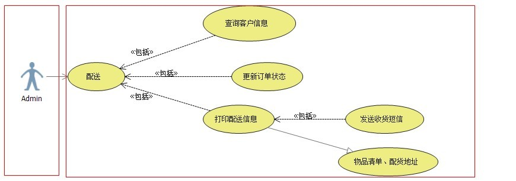
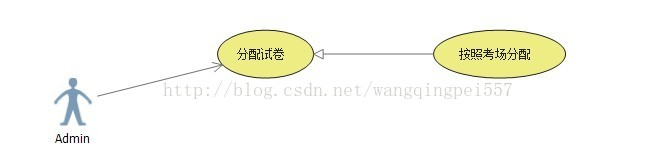
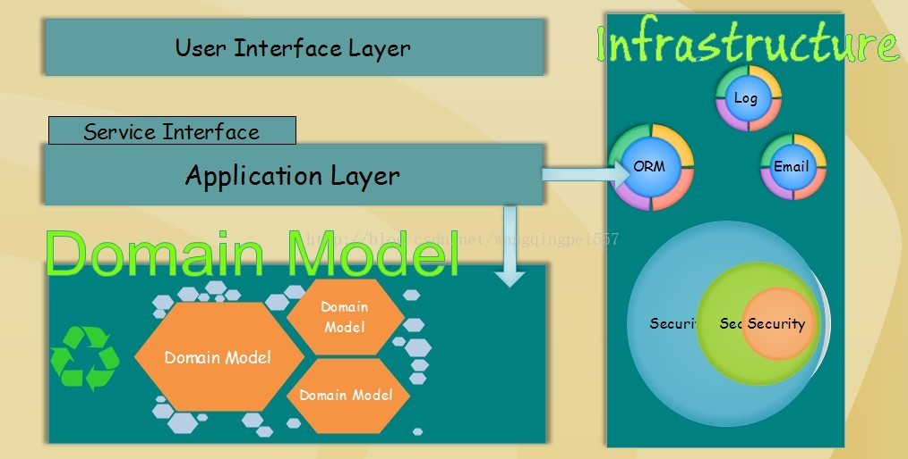

# NET领域驱动设计—初尝(一：疑问、模式、原则、工具、过程、框架、实践)

2013年04月07日 17:43:07[plen_wang](https://me.csdn.net/wangqingpei557)阅读数 1581

​                                 分类专栏：                                                                                                             [                                             应用框架设计                                        ](https://blog.csdn.net/wangqingpei557/article/category/1064007)                                                                                                 

​                                     

​                 [                     ](http://creativecommons.org/licenses/by-sa/4.0/)                              版权声明：本文为博主原创文章，遵循[ CC 4.0 BY-SA ](http://creativecommons.org/licenses/by-sa/4.0/)版权协议，转载请附上原文出处链接和本声明。                                                 本文链接：https://blog.csdn.net/wangqingpei557/article/details/8768775                              

- 1.1.疑问
    -  **1.1.1.UML何用**
    -  **1.1.2.领域建模**
-  **1.2.模式**
-  **1.3.原则**
-  **1.4.工具**
-  **1.5.过程**
-  **1.6.框架**
-  **1.7.项目演示**

最近在研究DDD颇有收获，所以整理出来跟大家分享，共同进步！

我们在设计业务系统的时候都会存在一个非常棘手而又无法回避的问题“业务扩展性”、“业务灵活性、”面向对象化“，尽管我们熟练掌握设计思想、设计模式、设计原则等等关于如何设计灵活性的系统设计理论，但是我们似乎都没有将它们运用到真正业务系统设计、开发当中去，为什么？这样的疑问如果对有心想设计好系统的朋友来说肯定是很早就出现过，只是无法解决，因为我们目前使用的设计方法是与面向对象设计背道而驰的。

漫长的数据库驱动开发历史，导致我们根本无法脱离这个环境进行学习和实战。从教科书再到真正的企业项目开发都是先设计数据库然后进行逻辑的编写，大部分的业务逻辑都是存在于UI和数据库【*存储过程、自定义函数*】中，所谓的三层架构中的BLL层其实是形同虚设，根本没有起到它应有的作用。

当然我们不是大师，我们只是普通的程序员，希望有一种方法论能引导我们进行真确的系统设计。在未接触DDD之前，我也一样有着同样的困扰，我们编写很多的开发框架、组件、插件、服务等等太多太多类似能提高开发效率的功能，梦想着自己的系统能想真正如书上所说的搭积木一样搭建自己的系统，我们扪心问自己真的可以做到吗？我叹息，很难；

我一直感觉复杂的系统设计对我来说真的没有办法应付，只能凭借细心和对业务的熟悉程度，没有正确的理论引导，那些所谓的大师们的设计思想的书真的对我帮助不大，看了不知道如何进行运用。时至今日我终于可以感觉到那种神秘的设计确实可以带领我们穿越复发的系统设计。当然这条路对刚开始接触DDD的朋友来说会存在很多问题，恰巧在下有幸接触DDD有点心得，也通过分析了一个小的系统进行DDD的开发工作，所以在这里把自己最近研究的心得和疑惑跟同行们分享，如有不对的地方请多指点。[王清培版权所有，转载请给出署名]

#  

# **1.1】疑问**

>  在任何一项新技术被采纳之前必须要解决几个关键的问题，这也是我们程序员考虑使用一项新技术的必须过程，它的出现能解决哪些问题和将会带来哪些问题。DDD固然很好，但是要想把它运用到自己的项目当中去，是需要很多时间和精力来分析它的实施过程和对项目团队的要求。当然人为的因素和外在的环境问题我们这里不考虑，毕竟那些是我们无法改变的事情，这里只讨论和我们密切相关的问题。

## **1.1.1】UML何用**

做程序开发的我们都知道UML是干什么的，简单的讲它属于一种标准的系统建模语言，便于我们对系统进行分析和团队之间的合作。既然是语言它的主要作用是沟通，技术人员和分析人间的桥梁。但是到目前为止我没有发现它真正帮助过我进行系统分析和设计，上面已经提过其实是两种开发方法论恰恰相反，所以导致根本无法集成，就拿UML中的类图来讲，我们都是先设计数据库然后进行开发何来的对象？直接是表驱动，通过一些快速的代码生成器进行界面和一些通用的单表的CDUS代码的生成，程序中根本没有对象的概念，业务逻辑遍布UI层[图1.1]。UML画的类图无法在程序中表现出来，所以它无法在绝大部分的企业中普及。

1.1图


上图假设是一个简单的模拟B2C的基本功能，通过它我们能简单的了解到我们的系统开发的问题所在。

以上图中的系统结构，我们很难知道系统的具体业务逻辑，更别说对系统的扩展性能有保障。这样的结构在开发初期没有什么问题，但是在后期的维护工作中将是费事费力的，最后的项目代码无法进行的很好的阅读，也就无法很好的进行稳定性维护。特别是业务系统，它的需求会变的很多甚至很变态，如果按照这种方式进行维护，那么界面上的代码会越来越多，而BLL、DAL中的重复性的功能方法也会急剧变多或者是服务层的相同功能不同方法参数的代码会越来越多。其实到最后也就谈不上什么艺术了，更别说项目进行产品化后上市。

那么UML真的起不到作用吗？或者说我们真的与UML无缘？当然不是，而是我们没有使用相关的软件设计、开发方法论而已。按照DDD的思想，我们是业务驱动开发，先进行领域模型的创建，然后才是数据库的设计。其实只有按照DDD的开发理论来才能最大的保证系统的扩展性和业务整洁性，才能保证项目的良性循环。[王清培版权所有，转载请给出署名]

## **1.1.2】领域建模**

>  “领域建模”很抽象也很艺术的一个词，它是软件设计艺术中的一个境界。

我们常常接触面向对象编程、面向对象设计的书籍或者话题，大家都对它有独特的见解，但是我们始终没有将它用作真正的系统性开发中去。但是在编写框架的时候我们都能得心应手的进行面向对象设计，为了保证框架的灵活性乃至最大的扩展性就要进行最细粒度的分解、抽象、提取，这些在非数据库系统开发中都没有问题。然而最大的问题出在对象需要与数据库结合，对象的生命周期持久化在数据库中，生也数据库死也数据库。所以这里的问题就是如何在面向对象设计与关系型数据库设计之间平滑的过度持久化。这是领域驱动开发的最大的问题，也是很多面向DDD框架的开发重点。

在上图中我们目睹了以数据库驱动后系统的大致结构，假设我们需要保证功能模块的最大的扩展性我们在编写数据库驱动代码的时候，很难抽象出复杂的变化点，因为都是贫血型的业务模型或者说根本不知道变化点在什么地方。而且并不是普通的开发人员能发掘到的，当然数据库驱动开发也一样可以进行灵活设计、开发，但是这样毕竟对开发人员要求很高，他需要具备很强的面向对象设计能力，在不污染现有的代码的情况下进行扩展性重构。至少我的经验告诉我很难，而且在需求阶段并没有一个完整的大局观，很容易造成头重脚轻。对后期的系统开发进度也很难控制，因为无法确定每个功能模块到底存在哪些接口。

所以我们还是朝着光明的道路前进，掌握DDD进行系统设计开发。

我们下面试着用建模的方式对上图中的功能点进行大致面向对象设计，尽量提取变化点。

**【简单用例】**

根据上图的基本功能我们确定两组用例，第一组是【**客户Custom】**发起的所有动作，第二组是**【后台管理人员Admin】**，比如配货部门、订单审核部门等等。这里纯粹是为了演示建模的功能不是特地的项目实践，所以功能简单明了。

1.2图


**客户首次进去平台之后肯定是需要进行账户的【注册】,有注册就会有【注销】，这里的注销不是退出系统的意思，而是注销在当前平台的使用，就跟销户是一个意思。**

(当然有人会觉得注销不妥，电子商务平台是不应该有注销的，这只是主观的设计而已，每个人的想法不同所以可以取长补短  ，我觉得有一个正面的注销功能很好，可以让用户进行使用，到底如何使用我们这里就不分析了。)

**成为正式用户之后就可以挑选自己喜欢的商品进行【下订单】，下订单后就会进入平台运行管理的流程的，客户会随时收到平台发过来的流程信息反馈。所以这里有一个【短信管理】用例，该用例当然会包含  【删除信息】、【读取信息】、【回复信息】包含的子用例。**

(当然可能我分析的不够细致或者有问题的地方，由于我也是最近接触UML建模所以可能有点不熟悉，对UML有兴趣的朋友可以参考相关专业书籍。)

1.3图


**后台管理人员需要对客户下的订单进行【配送】处理，配送环节将牵扯到【客户信息】、【更新订单状态】、【打印配送信息】用例，对【打印配送信息】**

**功能需要【发送收货信息】给用户，告知用户货物已经发出。这里还包括一个泛化的用例【物品清单、配送地址】，在【打印配送信息】功能里面需要具体的打印出跟配货信息相关的信息。**

（这里提一下UML用例图其实是通过纵横向的方式来寻找系统的所有功能点，纵向是系统的所有功能，横向是系统的外部调用者。）

**【领域模型】**

根据上述用例我们基本能捕获到大致的系统功能，下面我们通过创建UML类图来描述领域模型。

模型的创建要根据上一步的用例图来进行分析，只要创建的模型能满足用例的所有功能点就已经完成了一个大致轮廓。有些隐藏的模型是需要不断的重构才能逐渐的浮现出来。

1.4图


大致的模型已经创建出来，这只能算是一个基本的草图形式的建模，还有几个过程没有走完，比如：反复的重构、与领域专家讨论模型的准确性、与DBA进行沟通等等，这些都是DDD的整个范畴。

有了领域模型之后我们基本算是有了一个大致的业务方向，剩下的就是精益求精的过程，不断的去分析深层业务关系。

**【场景序列】** 

得出了领域模型之后我们需要对它进行一个基本的验证，也就是看看模型是否能满足所有的功能需求。最常用的就是通过序列图来走查场景，对我们创建的领域模型进行逐步验证。

由于时间关系我这里就不给出所有的序列图了，只给出有代表性的序列【配送】。

1.5图


由于怕截图片太大所以给出关键的序列流程，能表达其意思就行了。

这是经典DDD调用序列，对上面具体的对象不是很清楚的不要紧后面有专门的示例进行全面分析。[王清培版权所有，转载请给出署名]

# **1.2】模式**

>  模式相比大家都知道是什么意思，一些通用的思考问题的思路、解决方法、分析方法。当然在DDD领域也有很多模式供我们学习和使用，在需求阶段讲解的是行为模式在分析阶段有分析模式，在设计阶段有设计模式，在实现阶段有实现模式，还有宏观的架构模式。
>
>  那么在进行领域建模的时候有些前人总结出来的分析模式可以供我们参考。

## **1.2.1】四色原型模式**

四色原型模式是我接触的第一个分析模式，当然目前也是发现它确实很好用，所以给同志们分享一下。

四色原型模式是能帮助我们找出业务当中的核心模型，也就是说核型模式应该具备几个比较重要的特征的。

基本上想要根据UML用例图找出领域模型需要使用名\动词法找出大概的模型，然后顺着领域模型一点一点完善、发掘，从而找出相关的实体模型。但是有些实体模型是一眼就能看出来的，就比如上例中的【用户】、【订单】、【消息】都可以定义为实体类型，也就是当前小示例中的核心领域模型。

看一下四色原型模式的结构图：

1.6图


对照四色原型模式我们很容易发现模型中的核型实体模型，很明显对照上面的领域模型我们确实都是核心模型。

1.7图


对照该模式我们会发现这里的商品其实也是核心实体才对，但是我们能很快发现我们忽视它了，商品也存在状态和一些值类型才对，比如商品的使用状态是不是没货、商品的详细属性是不是也存在独立的值对象。当然这些要看当前项目需求而定。太范式的设计会带来一些问题，有性能问题、有开发成本问题，这些都要进行详细的讨论才能最终确定，所以反范式设计就出现了。[王清培版权所有，转载请给出署名]


# .NET领域驱动设计—初尝(二：疑问、模式、原则、工具、过程、框架、实践)

2013年04月10日 16:01:20[plen_wang](https://me.csdn.net/wangqingpei557)阅读数 2022

​                                 分类专栏：                                                                                                             [                                             应用框架设计                                        ](https://blog.csdn.net/wangqingpei557/article/category/1064007)                                                                                                                                                  [                                             框架设计                                        ](https://blog.csdn.net/wangqingpei557/article/category/1246348)                                                                                                 

​                                     

​                 [                     ](http://creativecommons.org/licenses/by-sa/4.0/)                              版权声明：本文为博主原创文章，遵循[ CC 4.0 BY-SA ](http://creativecommons.org/licenses/by-sa/4.0/)版权协议，转载请附上原文出处链接和本声明。                                                 本文链接：https://blog.csdn.net/wangqingpei557/article/details/8783381                              

**1.3.原则** 

- **精简聚合** 
- **分离用例与接口功能(设计模式的使用之地)** 

**1.4.工具、框架****1.5.过程** 

# **1.3】原则**

> 原则对于任何一项技术实现来说都是至关重要的，在设计某一个系统功能的时候我们讲究的是设计原则：

【*单一职责原则Single  Responsibility Principle、里氏替换原则Liskov Substitution  Principle、依赖倒置原则Dependence Inversion Principle、接口隔离原则Interface  Segregation Principle、迪米特法则Law Of Demeter、开闭原则Open Close  Principle*】。

> 在架构设计的时候我们也讲究架构原则：

> 【分层原则、避免循环依赖】。

> 不仅仅在技术领域在做人做事都要讲究原则，违背原则那么等待你的将是无情的惩罚。

对于DDD的设计我们也有相应的原则需要遵守，当然如果不遵守在前期看不出什么区别，但是到开发阶段问题就会暴露出来。

我们来看两个基本的设计原则问题。 

**【精简聚合】**

精简聚合的设计原则无疑是最重要的。一些软件工程方法论书籍经常指导我们进行UML业务建模，*"在这个阶段不需要考虑任何技术实现问题”*，我按照这样的指导原则进行了UML的设计然后顺利的创建出ER关系图，结果发现那样的数据库结构根本不能作为最终的项目开发数据库。哪里出问题了？我反复查询指导书籍后来在专业的DDD书籍上看到了一句大概这样的话：

- ***【“不以技术实现为前提的设计都是纸上谈兵”】***。

我想这句话很真实的描述了方法论与企业应用之间的鸿沟，很多技术思想或者理论确实很好，但是要想用起来需要解决很多问题。DDD也避免不了这个问题，怎么避免在设计UML模型的时候不会导致设计过度的问题，这里我们只需要遵守【精简聚合】原则就不会导致设计过度问题。

在前面的例子当中我们设计一个完整的UML领域模型，但是我们并没有对它进行【精简聚合】重构，所以它存在的问题就是无法进行项目开发。

1.1图


我们构建出来的领域模型初步版本应该是上图这样的，实体与实体之间是有强联系的，聚合之间的关联太大，导致牵一发而动全身。如果按照这种关系创建数据库那么数据库之间的主\外键肯定很多，对数据库的设计造成了影响。这样的关系如果在程序中使用也会存在很多问题，我们无法进行少数聚合的使用，当我们使用某一个聚合的时候它会接二连三的把相关联的聚合都给拖出来，不仅在查询的时候妨碍而且在Factory创建聚合的时候也会存在无法构造的问题，不管在对聚合Repository进行任何操作的时候都会影响程序逻辑，所以我们需要对一个复杂的庞大的关系进行拆分。

将红线的部分全部断开，聚合之间通过Id进行关联，这样就会变的很清晰。因为很少程序中会在某一个业务逻辑点上需要所有的业务模型参与，这样既方便了程序的开发也方便了数据库的设计，更方便了ORM的使用。ORM的延迟加载其实就是为了聚合之间的依赖，可以在需要的时候在去查询需要的模型。但是这样虽然程序可以说的过去，那么数据库的设计就说不过去了。对于不同的ORM框架的映射原理不同，在构造模型的时候是需要稍微的调整的，比如在EntityFramework中，它能支持的映射方案你保证你的模型能顺利的映射过去，这里就不扯了后面有一个详细的项目做全面实践，到时候在具体问题具体分析。[王清培版权所有，转载请给出署名]

最后我们看一下分解后的类图：

1.2图


这样一来一块一块很清晰，都能直接使用相关的核心领域模型，也不需要担心ORM框架的延迟加载的问题。

**【分离用例与功能接口（设计模式的使用之地）】**

分离用例与功能接口其实也是初次接触DDD的朋友都会犯的职业病，因为我们都熟悉面向对象设计。在进行UML建模的时候我们都非常喜欢抽象，会很清楚的把具有泛化关系的用继承来表示，比如【用户类型】，不同的用户具有不同的行为权限，在初步设计的时候我们一般都会建立关于用户的一个继承关系来表达泛化的业务模型。但是在编码阶段会发现很明显的问题就是我们把关于Repository的行为包含到了发起用例的用户聚合当中去了，这样说可能有点抽象。我们还是用例子来分析；

1.3图



上图中我将【Admin】和【配送】用例分开了，想表达是不能将关于配送的行为放在【Admin】中。在我们对有关权限进行建模的时候经常会潜意识的将各自的行为放在了各自的角色当中，如果后期存在多角色共享行为的就将写在抽象的类中使用虚方法向下传递。问题就出在关于角色行为里，我们知道如果有行为那么就有可能在该行为里面执行有关其他聚合的IRepository操作，这样一来将会把领域模型搞的很乱，无法垂直分析。

1.4图


DDD讲究领域驱动，在我们看来【Dispatching】、【CheckOrders】都是继承管理员角色，管理员属于后台管理人员，意味着企业的员工。对消费者来说他们就是管理人员。同样消费者也会存在相同的情况，消费者可能存在很多种类型，有VIP系列的(VIP1\VIP2\VIP3…)，有钻石会员之类的。如果这样设计的话并不能说是错的，这也完全符合DDD的思想要求，但是实际情况下却是不理想的。

这里就用到了我们长期使用的设计模式了，我们可以通过设计模式中的很多中模式来将用户与行为分离开来，再将使用的规则条件抽象出来就完全独立了用户，用户在使用的时候不会存在直接的行为归属，但是事实上他们确实是有行为。

1.5图


用专业的DDD术语讲**“规约模式”**，将业务规则抽取出来对象化，甚至到最后都可以进行规则的配置化。最让我们兴奋的是，我们苦心学习的设计模式终于可以在系统设计中大面积的使用了，难道不是一件很惊喜的事情吗！

# **1.4】工具、框架**

> 任何一种架构都是需要框架、工具的支撑才能变的完美。

当我们在某种架构下进行开发的时候，我们必须需要很多工具、框架的支撑才能让开发工作变的很便捷，这也和【敏捷开发】的思想一样。在传统的三层架构下开发我们都需要 **"对象映射"、"AOP\IOC”**  等等类似的辅助框架，目的是为了架构前行的可能性。在DDD中我们也需要很多目前还没有出现的很多工具、框架，在.NET平台中目前来看只有EntityFramework框架算是为了DDD做了很多工作，如果我们的领域模型无法与数据库进行映射，那么领域模型开发所要付出的代价将是很大。

在设计阶段我们缺乏一个面向特定领域的建模工具，这种工具与UML不同，UML太技术化通用化。DDD中经常会提起【**领域专家**】一角，他是最具有权威性的领域领头人，我们所创建出来的UML他们未必能看得懂，通过技术人员技术化之后形成UML其实已经变味，【**领域专家**】是懂非懂的无法做到肯定的保证。如果能把领域模型语言化，那么这个将是一大成就。【领域专家】对领域中的任何事物、人物、环节都很熟悉，但是他无法表达清楚自己的想法，如果能有一个工具辅助他的设计，该工具能将设计后的模型进行平滑等价的技术化变成代码模型或者数据库模型，这一条鸿沟如果能跨越那么对行业来说具有很大影响力。

1.8图


如果我们能等价的将上图中的真实模型进行技术化，那么真的每个人都会喜欢需求分析、分析设计。

既然是模型驱动设计，我们在给用户分析类似这样一套系统的时候，前提是我们已经对里面的所有细节进行了抽象封装，每一个过程都是可以拆分的，最后能合并在一起形成一个整体的业务模型。当然这里只是一种技术展望，也是我们奋斗和理想的目标。

> **推荐一本最新Martin Fowler的书：《领域特定语言》**

# **1.5】过程**

DDD不是一种纯技术实现，而是一整套开发思想，它贯穿软件开发的所有生命周期。从我们开发接触领域，对领域知识进行深入的消化，这些都是DDD所强调的。那么在我们日常开发过程中，我们该如何处理这些过程，需求不会再像以前那样是一份杂乱无章的草稿，而是一个内容丰富的领域模型草图。这样的要求对团队对部门甚至对公司来说都是一个提升，要想做到完全的DDD过程其实很难。

公司领导如何看待这样的开发方式，我们多数人都是在一些非专业研发类的公司工作，领导希望能尽早的看到东西，这很矛盾，需要好的东西但是不按照好的东西做法来做。如果有幸能有一个面向DDD、敏捷、XP的研发团队工作，那么可以视项目为一件终身的艺术品。[王清培版权所有，转载请给出署名]


这两篇文章主要是一些本人对DDD的感悟，分享给大家。

后面一篇文章将会详细的使用一个DDD架构的小系统作为案例给大家分享，里面将包括从需求的**分析建模、设计模式的使用、数据库映射、EntityFramework的使用**等等，可以作为真实项目开发的依据。


# .NET领域驱动设计—初尝(三：穿过迷雾走向光明)

2013年07月01日 11:37:57[plen_wang](https://me.csdn.net/wangqingpei557)阅读数 3210

​                                 分类专栏：                                                                                                             [                                             SOA                                        ](https://blog.csdn.net/wangqingpei557/article/category/1063987)                                                                                                                                                  [                                             系统架构设计                                        ](https://blog.csdn.net/wangqingpei557/article/category/1064004)                                                                                                                                                  [                                             应用框架设计                                        ](https://blog.csdn.net/wangqingpei557/article/category/1064007)                                                                                                 

​                                     

​                 [                     ](http://creativecommons.org/licenses/by-sa/4.0/)                              版权声明：本文为博主原创文章，遵循[ CC 4.0 BY-SA ](http://creativecommons.org/licenses/by-sa/4.0/)版权协议，转载请附上原文出处链接和本声明。                                                 本文链接：https://blog.csdn.net/wangqingpei557/article/details/9212223                              

# **开篇介绍**

在开始这篇富有***某种奇妙感觉***的文章之旅时我们先短暂的讨论一下关于软件开发方法论的简要：

纵观软件开发方法论，从***瀑布模型、螺旋模型、RUP(统一软件开发过程)、XP(极限编程)、Agile(敏捷开发)***一路走来，他们的好他们的美，我想接触过的人都会口口称赞，都是大师们一身的经验结晶最后沉淀为专业的技术方向、技术领域，带领我们软件开发者们永无止境的前进，目睹一场又一场的美景一桌又一桌盛宴。他们在不断的开辟新的领域，称为伟大的科学家一点都不为过。

但是为什么这么多方法论都没有能在企业中大面积的普及和使用或者说未能取得理想的效果呢，难道说是我们都不会吗？当然不是，我想我们程序员都是很聪明而且很富有创造性思维的人群，我们敢于改变现状追求真理，但是时间过去了很多，我们似乎都没有真正解决复杂软件的设计问题，我们参考很多书籍，数不胜数，扩展类、模式类、模型类太多太多，但是问题的核心始终未能触碰到，在黑暗中无数的摔倒都未能找到突破口。为什么***DDD（领域驱动设计）***能被我们接受并且愿意花时间花精力去学习去实践它，因为它发现了复杂软件设计问题的核心解决方法***(Model  Driven Develop 模型驱动开发)***，聚焦复杂系统的核心，并且有一套完整的框架、流程指导我们进行相关DDD的设计、开发工作 。

在DDD未出现在我们面前时，我们遇见复杂且庞大的业务系统的时候，会手忙脚乱的乱折腾，会发现根本无法拿下这么一个庞大的Monster，最后项目就算侥幸成功也只是依靠个人力量英雄主义般的在独自一人战斗，加班、熬夜精神极度集中，燃烧生命最后就算能取得成功，但往往系统最后还是这里出错那里出错，甚至还会漏掉什么功能没做，这算是一个常态，不足为奇了。

现在我们有办法改变这种局面，团队是干什么的？团队不是样子好看，三个臭皮匠赛过诸葛亮，只有一起参与系统的分析、设计才能最大化的保证需求的稳定性，最起码做到一起评审分析方案。***别说我太理想化，难道这不是我们共同的期盼吗？***

总而言之使用DDD的朋友都能感受到它的不一样，爱惜生命的朋友请开始和我一起***DDD（领域驱动设计）***之旅吧！

# **1.1】示例介绍【OnlineExaminationSystem】**

经过前面两篇文章的讲解，我们算是对DDD有了一个初步的认识，对它的概念它所提倡的开发原则开发思想有了一个基本的了解。任何方法论都要能被技术化落实到代码上才行，要能真正的为我们解决问题，所以我们这里使用DDD进行一个完整的系统分析、设计、开发来验证它确实如所说的那么好，接受一个新的东西往往需要一个时间过程，所以文章可能会有点长，基本上都是一些理论；

> 前面两篇文章的地址：
>
> **1**[**.NET领域驱动设计—初尝(一：疑问、模式、原则、工具、过程、框架、实践)**](http://wangqingpei557.blog.51cto.com/1009349/1173006)
>
> **2**[**.NET领域驱动设计—初尝(二：疑问、模式、原则、工具、过程、框架、实践)**](http://wangqingpei557.blog.51cto.com/1009349/1175483)
>
> 初次接触DDD的朋友可以先阅读一下上面两篇文章，算是有一个宏观的理解，DDD是如何颠覆传统的设计方法的。

**项目背景介绍：**

为了保证实践项目的全面性，这里挑选了我一直比较关注的教育行业信息化的一块***【在线考试系统】***作为实践的项目，使用了C/S、B/S混合型的系统结构，系统的业务范围主要是一个面向学校的学生在线考试系统。学生通过客户端（C/S）进行在线答卷，答完卷后再通过远程服务进行答题数据提交。老师通过后台（B/S）进行试卷的打分，最后得出所有学生的成绩数据并且在成绩公告栏中显示排名。(当然由于时间关系，示例代码可能推迟一点时间发布；)

**扩展：**

教育类系统都存在一个问题就是**【老师】、【学生】、【家长】**三者之间是没有任何信息化联系；对于像考试类的管理都没有任何方式告知家长学生的成绩情况，包括最近的成绩趋势，还有就是学生的整体对比度等等。21世纪什么最重要？人才；现在的家长都迫切的想知道每一天学生在学校的情况。所以对于这样的需要很有价值去分析，去实践起来，当然前提是教育需要进行改革才行。

1.1图


这是一个形象的需求思维导图，很形象的描述了我们系统的大概功能，最重要的是能表达真实的业务场景，这也是模型驱动开发的首要思想。用专业的领域驱动设计思想来描述的话上图那就是**（解释性模型）**带来的效果，如果我们用很抽象的程序专业图形来表达业务需求很难说明问题，所以我们在前期与业务人员沟通大概需求时基本上给出我们人类天生就能理解的图形化表示，可以视它为“解释性模型”；当然由于时间关系并不会完成上面所有的需求；

在以**【School DataCenter】**为中心的**【Student】学生**、**【Teacher】教师**、**【Parents】家长**、**【Admin】管理员**、**【CEO】最高执行**人，各角色分别处理一个业务环节上的不同操作；

这只是简单的项目介绍，目前大概就这些基本的需求，后面我们会进行详细的系统分析。业务都具有发散性特点，看似简单最后还是会出现很多需求问题，这也符合我们所需要的要求。从上图中我们可以很简单的就明白系统的基本功能，但是毕竟是一个简单的需求草图，只是我们脑子里的一个雏形，我们需要把它落实到真正的项目中去，这个过程非常的不容易，唯一能正确穿过迷雾的方法是对照模型进行分析、设计。

# **1.2】系统分析、建模**

上小节中我们基本了解到了系统主要有哪些功能而已，这一节我们将详细的对系统进行业务分析，当然主要是为了突出领域建模的重要性，关键是它能为我们带来什么样的好处。当我们逐渐按照DDD的方式来设计系统的时候，你会发现一切都很顺利而且很OO，我们完全可以使用OOA\OOD的方式且没有任何干扰的进行系统开发。

虽然说这是一个比较简单的在线考试系统，但是如果要把它做好其实是蛮庞大的，会和很多其他的系统联系，所以这里不会考虑太多的需求；

（这个项目本身的目的是为了演示DDD的设计、开发、架构，所以在需求上不会太难；）

## **1.2.1】用例分析**

通过用例来分析系统中的基本功能调用，这部分的调用是局限于外部的调用，毕竟是外部调用驱动内部调用；所有用例是捕获外部调用的功能图，具体的内部调用看具体的情况而定；

**【学生用例】**

学生用例主要就是进行系统考试，从**【登录系统】**到**【进入考场】**然后**【领取试卷】**等待**【答卷开始】**通知，在限定的时间内进行**【答题】**；等时间到了之后系统自动进行**【试卷提交】**,当然自己也可以**【提前交卷（条件是必须离考试结束时间10分钟之内）】**；

2.1图


**【教师用例】**

选择分配给自己的试卷进行改卷（对于**【选择题】**、**【判断题】**可以实现自动化的改卷；）。

教师的用例主要是**【登录系统】**，每个老师所要批改的试卷都是由**【管理人员】**进行分配的，所以这里直接进入到自己所要批改的**【试卷列表】**即可，然后选择某一个**【试卷】**进行批改，批改的**【参照答案】**应该是事先就已经准备好的，由N多位老师共同完成的一个标准的答案；

2.2图


**【管理者用例】**

 

管理者只需要将所有的试卷分配给参与改试卷的老师们，这里目前按照**【考场进行分配】**；

一个考场需要进行N门科的考试，会有不同的老师站考，但是老师跟科目在这个时候没有任何关系；等考完试之后，我们如何保证公平公正的对批改试卷老师的分配，由于考试的成绩最后会对老师的晋升、年底奖金等等；所以这里我先按照考场+科目进行分配，只有这样才能保证最小的偏差；考场里面的试卷都是经过随机安排的学生提交的，所以不会存在问题；

2.3图



**【家长用例】**

这里我们不考虑太多家长的用例，基本的**【短信通知】**学生的考试成绩和在班级、年级组的排名，如果复杂一点的可以有一个图形的分析，家长可以进入考试系统进行分数的查看或者与老师之间的线上交流；

2.4图


**【最高执行人】**

这类人的功能我们这里只包括一个学生成绩的**【图形统计】**；

2.5图


**【系统分析技巧】**

其实我们大部分程序员都不太愿意与需求的提出人进行多沟通，认为他们提出的东西可能很不太理想；但是在DDD中，提倡头脑风暴似的交流讨论领域问题，过程是需要敏捷的、迭代的；从文章的一开始的项目介绍到用例分析，我想我们都会看到很多被我标记为“**【\**\*】**”这样格式的文本关键字，其实这个过程很重要很重要，这是我们与领域专家在沟通需求的时候需要积累、总结的领域语言，我们只有彻底的弄明白这些关键点才能为我们的分析打下一个初步的基础，这样才能循环渐进的进行迭代。

需求其实就是隐藏在我们交流的描述当中，要习惯性的把一些关键的字\词先抽出来记录下来，事后自己在慢慢的分析琢磨；你会发现很神奇的是这些关键部分恰恰是用例的重点也是下一步领域模型设计的依据；从专业的领域驱动设计角度讲这些关键字都是领域通用语言的一部分，是我们进行交流的模型语言；我们在进行项目交流的时候会对一些口头描述出来的需求产生二义性，但是我们如果使用领域模型进行交流的话就不会存在二义性，需求永远都是等价的在我们之间传递；


# **1.3】系统设计、建模**

按照上图中的用例分析我们这里需要对这些用例进行面向对象设计，也就是创建领域模型，得出领域模型之后我们的系统雏形就出来了；

看过前面两篇文章的朋友就会对创建领域模型有点熟悉，创建领域模型有一个很好的设计思想就是**(四色原型模式)**，它可以帮助我们很好的完善领域模型，找出核心领域模型之后就很容易进行模型边界修饰逐渐的完善，还是那句话：需要敏捷、迭代的进行构造；没有一次就能使用的领域模型，中间的过程是省不了的，需要不断的重构、提炼才能使模型最后精简而富有丰富的领域概念。

*【详细的四色原型模式后面会有专门的文章来深入的讲解，这里大家只需要知道类型原型就行了，有兴趣的朋友可以自己百度相关文章】*

**【领域模型】**

> 如果得出领域模型，需要我们对上面的用例进行细致的分析并且逐渐的勾画出边框，再慢慢的修饰得出一个基本的模型图，但是我们要知道一个有血有肉的模型是需要不断的去呵护它才行的；我们需要不断的重构，不断的剔除一些障碍留最真实的模型，最后领域模型将是本次项目的一笔丰富的财富；

我们一个一个用例来过，首要的是学生的用例；

**【学生用例模型】**

首先是【学生】主体模型，这里我们可以将【四色原型模式】的思想引进来了，你会发现你突然很会设计模型了（呵呵，开个玩笑！）；对照四色原型我们知道【学生】应该是有类型之分的，那么学生的类型的分类属性是按照什么来呢？比如是性别（男、女）、职务（班长、组长）、成绩优差（优、良好、差）等，决定要使用什么属性作为我们的分类标准需要看系统的需求来定了，但是最起码四色原型模式告诉你你缺少某种分类；那么我们这里只需要按照学生的性别进行一个基本的类型分类就行了；

3.1图


有了一个基本的核心点之后我们后面的思路其实基本上就会好延伸下去，我们继续分析；

看到了【Student】发起的第一个用例是登录系统，既然是登录系统那么肯定是要用户名、密码的，并且一般性的约束是要控制是否启用、禁用该学生，比如学生不在本所学校了，不可能将学生的信息删除的，它牵涉到很多其他的系统和业务数据；所以我们这里又增加了三个基本的属性，“用户名”、“密码”、“启用禁用”标志；

3.2图


我们加上了三个基本属性；好像还差点什么？学生的基本信息似乎没有，那么我们加上关于学生的基本属性（学生的姓名、年龄、学号）；

3.3图


那么学生的基本信息算是没问题了，我们继续沿着用例分析；【进入考场】用例是学生选择相应的考场然后进入，在真实的线下考试当中每个考生在考试的时候都会有一个考号，凭考号进入考场才对；但是我们这里不能将【考号】直接放入到学生的基本信息当中去，为什么呢？因为一个学生在学校期间会经历N场考试；所以我们需要独立的模型来表示学生与考号之间的关系；

但是我们自己分析一下，考号的生成是有一定的规律的，它一般都是跟学生所在的考场信息挂钩的，比如：0320，应该是第3考场第20座位；我们在反推一下，其实考号跟学生在考试之前的某一个时间段他们之间是没有任何联系的，也是说应该是先安排考场然后再根据考场中的座位再进行考号的生成，而且每个时间段的考试都是一个年级组的，要么初一的所有学生考试，要么初二的所有学生考试所以当考号生成后将随机的映射到每个学生身上；当然也有另外情况就是每次考试时间周期内会有多个年级组进行考试，但是这个时候考场中的考生是如何设置的就要看具体的需求而定了，由于话题比较大所以这里就不涉及了。这里就当它是独立年级组进行考试；

考场就是班级，在考试的时候所有的班级都将会变成考场的属性，比如原本是**“三五班”**但是考试的时候就变成了03考场了，所以我们需要对班级进行建模，有了班级之后才能慢慢的设计考场的模型。

3.4图


班级的类型存在多个属性的分类，”Class_UseType”是表示班级的使用情况，比如班级在装修的时候可能就是Close状态，平时都是Open状态；另外还存在着一个班级是被哪个年级使用的，比如是初一还是初二，或者是高一、高二等等；我们需要明白的是，类型是事前约定好的，类型是确定的模型，它与可维护基础数据是不同的，后面会有专门的小结做详细的讲解；

这里的Class_UseType模型是代表当前班级的使用情况，班级会存在“使用”、“停用”情况，比如某个班级在装修或者其他的问题；这中分类完全可以用枚举类型进行表示，但是Class_GradeType班级所属年级，代表当前班级是属于哪个年级组的，这个属性在后面肯定是会用到的，比如要将所有的初一班级作为本次考试的场地，这个时候就用到了；在Class中有一个PewNumber的属性是表示当前班级的座位数，一般考试都是50%的座位是在考试中使用；

本打算把所有的用例模型的分析都写出来的，但是这里由于时间关系就不一步一步分析说明了，对于学生考试的这部分模型图差不多是这样子的:

3.5图


麻雀虽小五脏俱全，尽管这里截图不是全部的（有全部源码供下载），但是能说明一个问题：利用领域驱动设计开发软件确实对设计技术要求较高，图中蓝色的都是潜在的深层模型，而灰色的是我们最容易发现的表层模型。我们往常进行面向对象设计的时候都是很容易的发现一些表层的模型比如：人、车等一些实物，但是很难发现一些潜在的模型比如：一次婚纱拍摄场地，一次吃饭过程等等，这些潜在的模型都是核心业务模型，所以当我们使用DDD进行软件开发的时候不知不觉的就会让你对业务清晰度要求变高了，不会存在含含糊糊的业务需求；

## **1.3.1】枚举类型的使用**

在一般的框架型项目中都会使用枚举来表达某些概念上的一个序列，枚举是约定的表达，枚举只限定在它的区间取值；比如我们都爱写写框架、组件被别人使用，大家最熟悉的莫过于ORM框架了，ORM框架里面都会有本框架所能支持的数据库种类枚举，使用枚举来约定只能使用这区间的值，没别的选择；

但是枚举我们也可以用在DDD上，在以往的业务性系统中很少能看见和业务相关的枚举，都是功能性的，比如写Log、Email的等等；然后这里我们需要把它做为在DDD中的核心对象模型来使用，比如用户的登录类型、支付方式，前提是已经约定好的；

枚举类型与基础数据会存着混淆，我到底使用枚举还是基础数据结构，这里很简单的区分就是看你的基础数据日后是否需要不断的维护扩展；比如学校的班级日后肯定是需要不断的修改或者添加新的班级，而学校日常考试范围基本上都是锁定在那几门，中国的可是科目就那几种完全可以直接定义枚举约定；在编码阶段很简单的进行枚举出值，如：FieldExamination.Subject==Subject.English，将本场考试为English作为条件；通常枚举类型都是作为值类型出现在DDD中；

## **1.3.2】基础数据、业务数据**

**【基础数据】**

基础数据是系统在上线运行之前就已经维护进去的启动数据，比如我们这里的【班级】、【学生】、【教师】等等，用来支撑系统运行的必备数据，这些数据普遍存在一个特点那就是**“实体”**数据，那么我们如何断定是不是一个基础数据，按照分析模式**“四色原型模式”**，中的“**参与者、地点、物品（party,  place, or thing ）**”原型我们可以把它想象成是可以进行任何独立使用的独立单位对象，叫做**“基础数据”**；

**【业务数据】**

业务数据很明显的特点就是发生在某个时间段上的事情，比如我们的一次购物、一次郊游、一次拍照等等，都是建立在基础数据之上的，从现实角度去分析人物事情的发生都是需要人的介入，当人介入之后将发生对某物的操作，比如：强强在2013年6月1日参加了学校举办的六一儿童节活动，这里的【强强】是基础数据而发生的这一整个事件为业务数据，也是**“四色原型模式”**中的核心原型，业务数据牵动着基础数据，关联着彼此不相关的基础数据；同样我们使用“四色原型模式”中的**“某个时间段的间隔（moment—interval）”**原型我们就可以很明显的找出什么是业务数据数据；

这里我顺便扯一下“四色原型模式”并不是**Martin Flower**大师所写的分析模式，他写的应该归类于“业务原型”，而这里的“四色原型”是**peter code**的杰作，这里就不多讲了，毕竟我对四色原型也只是初步的了解；【对四色原型有兴趣的朋友可以直接看**《彩色UML建模》**Peter  Code 大师的书】

基础数据与业务数据之间的关联需要很小心，我们要衡量好之间的关系。当我们识别出基础数据之后在首次进行建模的时候为了合理的表达领域模型的完整性会将其关联的很紧密，在团队中进行交流评审的时候都是很有帮助的，到了后面重构阶段一定会将庞大的蜘蛛网合理的拆开形成精简的聚合模型；

本节想强调的是正确的识别出领域中的“基础数据”和“业务数据”，让后将其合理的关联来表达领域模型；

## **1.3.3】模型在数据库中的主外键关联问题**

当模型落实到代码上的时候我们就要考虑如何将模型在关系型数据库中存储的问题，当然你可以存放在任何地方，但是不同的数据存储方式会对你的模型有一定程度的影响或者说会影响你建模的细节思路，这是需要平衡的；有人会说：***“模型的创建应该完全不用去考虑到底如何持久化”***，难道真的是这样的吗？我通过实践证明问题恰恰相反，当你在建模的时候如果不懂的技术实现那么就会产生像DDD书中所说的分析与设计之间的裂缝，分析人员分析出来的模型根本无法在真实的技术环境下实现；难道你还会说：***”分析的时候完全不用去考虑到底如何实现“***，这就是DDD所说的复杂软件开发问题所在；

在目前情况下普遍认为分析人员大于程序员，他们占主导地位，想当然的去搜集业务然后交给你实现，当他让你实现一个很别扭的功能的时候其实你完全可以用自己的专业意见来改善的很平滑，但是由于工作职责的不同他们并不是很懂的技术实现的细节所以问题就在这里；

【这不是我结论，在**《领域驱动设计.软件核心复杂性应对之道》**一书中，**Eric Evans** 是这么定义的，详见书中第7章；问题确实如此；】

这里我们只讨论面向关系型数据库的存储方式；聚合是一类实体的集合，会有一个“**带头”的实体也就是聚合根**，我们对它的操作需要很小心，比如：当你插入一个聚合根时会把聚合根所涉及的一些附属模型都插入，这个时候就是错误的；这个时候如果没有很好的***数据访问组件***来支持的话我们很难保证数据的一致性，后面我会专门写一个系列针对**Microsoft.EntityFramework**的文章，因为目前.NET平台稳定的实体框架就属实体框架EF了；

按道理我们的聚合是一个带有根的实体集，他们被逻辑划分到一个业务范围中，比如【FieldExamination】每场考试聚合，当我们查询有关一场考试信息的时候会关联出它所附属的一些其他信息，这是查询没有问题，但是当我们进行删除、更新、添加的时候问题没有那么简单了，当然是可以避免了这里跟大家分享一下需要注意的地方；

```
public class FieldExamination:EntityRoot{   public string FId{get;set;}   public Datetime BeginTime{get;}   public Datetime ProcessTime{get;}   //获取本场考试的试卷   public  GetCurrentExBook(string stuId){//……}   //本场考试的负责人   public Employee  Principal{get;}   public Subject  CurrentSubject{get;}}public class FieldExaminationRepostiroy:Repository<FieldExamination>{  public FieldExamination GetById(string id){//……}}
```

上述FieldExamination实体没有任何问题，恩  看起来是没有问题；当我们对数据库进行查询的时候是没问题的，会顺利的得到FieldExamination实体确实很方便，这也是DDD的精神所在；但是当我们进行对象的插入的时候问题来了，通常我们对实体进行创建的时候是会通过一个专门的Factory来创建，这个对象是一个完整的，包含了基本的属性信息，比如这里的FieldExamination实体创建的时候是肯定要知道它的负责人是谁并且本场考试的科目是什么，我们会对相关的属性进行赋值，那么这个时候进行插入的时候就会将相关的属性插入到属性所要持久化的表中去，这里也就是会将Principal属性插入到Employee表中去，那么就是错误的，同样其他的属性都是这种情况；

那么到底如何解决，其实就是通过**“标量属性”**来解决，这个时候实体会增加一些属性所对应的**“属性字段”**如：

 

```
public class FieldExamination:EntityRoot{  public string FId{get;set;}  public Datetime BeginTime{get;}  public Datetime ProcessTime{get;}  //获取本场考试的试卷  public GetCurrentExBook(string stuId){//……}  //本场考试的负责人  public int PrincipalId{get;}//查询的时候这个属性不需要关心  public Employee Principal{get;}  public int CurrentSubjectId{get;}//查询的时候这个属性不需要关心  public Subject CurrentSubject{get;}}
```


也就是说进行插入、更新的时候只需要使用**“标量”**属性来更新插入即可，因为不需要涉及到对其他对象的操作；


## **1.3.4】角色、类型**

模型的角色、类型，我想大家应该多少有点了解的，如：订单有订单的类型，考试有考试的类型，这也是**“四色原型”**中所讲**“Role”**原型；不管是从什么维度进行分类、分角色都是有必要的，当你缺少角色分类是应该提醒自己可能你漏掉了什么，因为据以往经验告诉我们“角色、分类“肯定是会用到的；

在我们前面对学生用例进行分析的时候很多地方都是需要角色、类型，使其看起来很合理；

## **1.3.5】名词、动词、隐、显、抽象、具体  模型创建技巧**

这里给大家总结一下系统分析的一些基本的技巧，乱七八糟的理论这里就不扯了，有兴趣的朋友可以看专门的书籍，这里是比较简单能直接用的技巧；

**【名词】—>【显】**

当我们和业务人员进行业务沟通的时候我们会听多很多【业务名词】，首次谈话业务名词对我们来说可能比较难以理解尤其是复杂的业务领域，当然会随着多次的沟通逐渐的理解并且得出比较合理的领域通用语言；在很多时候【名词】法能很快的捕获到最直接的【显】层模型，比如在本示例中我们能很快并且很准确的将【名词】中如：学生、教师、班级等等这些实体模型，这些实体信息最容易被人理解和接受；当我们和业务专家进行沟通业务的时候不要光听他们讲要把他们讲的每一个业务环节中的涉及到的业务名词记下来然后自己再过一遍对不懂的一定不要假设什么什么，一定要虚心的向他们讨教哪怕他们真的烦了那也没办法，因为这是工作；

**【动词】—>【隐】**

同样和业务专家进行沟通的时候会有很多【过程】、【动作】等等这些名词出现，比如进行【一场考试】，那么就会涉及到对动词的抽象了，显然【一次考试】是**”四色原型“**中的**”moment—Intervel“**，对于这样捕获下来的模型是具有很强的业务性的，这样细心的分析慢慢的挖掘这些潜在的动词模型，也有可能动词模型会覆盖动词模型，比如一次考试可能已经包含老师站考记录，一次考试会隐藏诸如这些潜在的模型；

具体的模型是我们一眼就能看穿的实体模型，是一些人、物，而我们很难发现是过程模型也就是复杂的业务流程模型，在某个业务环节下要涉及到很多业务模型，最重要的也就是【发生了什么事情】，只有发生了事情才能将人、物关联起来；

**【具体=名词、显】—>【抽象=动词、隐】**

被我们意识能直接识别出来的通常都在我们的知识水平面上，只有具体的东西才能支撑抽象的事物；如果没有人会有【订单】吗，如果没有货物会有【配送】吗，如果没有CUP、内存会有进程吗；识别出显示的模型当然是最直接的引导方式；

3.6图


上图是一只抽象的鱼(abstract  fish)，如果没有具体的骨架(Concrate  Frame)它是不会有形状的，想要得到这只鱼必须得有骨架模型帮你支撑起来才行；同样的道理，我们在分析系统的时候也一样的，需要识别出具体的事物然后才能稳健的抽象出模型；（当然并不是绝对的，你也可以进行抽象优先，但是我想前提是你脑子里已经有具体的事物了）

## **1.3.6】永远都不要去假设你的模型**

我们以前经常会犯一个错误，就是经常去假设系统能提供什么功能，比如我们在分析一个系统的时候总是喜欢假设它应该具备什么功能，那么这些功能真的能替你画龙点睛呢，还是在画蛇添足；普遍现象是分析人员在进行分析的时候都没有一定程度的搞懂需求的真正目的是什么，每一个需求的背后是价值驱动的，一定要让业务人员告知你一二，这样可以方便你自主能动的去举一反三，而不是他说“告诉你也不懂”你就不好意思的结束了，千万不；如果他不告诉你清楚的需求你就无法画龙点睛，无法进行知识消化也就谈不上模型重构了；切忌不要假设我们应该做什么功能，我们所有的功能需求都是业务人员需要的，或者是潜在需要的，这个潜在是他跟你讲了需求背后的价值才能设计；

# **1.4】重构模型（规则引擎、精简模型、模型扩展性）**

这个过程是设计阶段最重要的核心过程；我们一直都认为自己的设计能力不错，就是一直没找到合适的地方运用，至少在数据库驱动的软件开发中你是用不上什么设计思想的，逻辑都在数据库的存储过程里面；你的面向对象设计如何的了得不，你的面向接口编程运用的如何的出神入化，你的诸多好的模式都用不上；但是在DDD的**(重构模型)**阶段你将可以大展身手，用专业术语来说这个阶段是**(设计模式)**介入的阶段，通过深入的挖掘业务潜在的变化点，通过模式将变化点抽象出来，将变化点隔离在系统的外部；

## **1.4.1】规则引擎**

这里随便提一下**(规则引擎)**的相关概念；

> 我们都知道面向对象设计思想真的很神奇，是那些软件大师、科学家研究出来的，在倡导进行DDD驱动的时候我们用面向对象的思想来抽象领域模型，用C#、JAVA之类的面向对象语言来实现等价的模型代码，但是在一个系统中对象只是一种模型；在DDD的分层架构中的Business   Layer中我们放置的都是Domain相关的模型，在这一层也就是最核心的一层里，我们用对象来表示所有的业务模型，就好比最小粒度的细胞一样；但是这些模型没有一个点将他们穿起来形成一个整体性，比如在业务系统中都存在着业务流程，那么流程需要使用到的Domain如何被模型化，其实也就是**工作流（Workflow），**工作流模型用来抽象所有的业务流程，也就是我们DDD分层架构中的Application  Layer中的元素，所有的调用进入到Application Layer 层之前都是有先后顺序的，比如审批流程，要先提交审批的相关单据信息，然后才能到达**【审批 Public bool Auditing(Forminfo info){//审批逻辑}】**的环节，这样的流程需要相关的框架支持才行；我们有工作流引擎来支撑，但是DDD的核心元素模型***业务规则（Business  specification）***还无法很好的在我们系统中实现；这本身就是静态语言的一个问题，静态语言的所有逻辑在编译时就已经确定，不管你是直译式还是中间式的编译过程，本身语言的设计就是这种静态思想；
>
> 我们大家对Js多多少少肯定是比较熟悉的，它本身就是一个动态的语言，我们且不问是否是脚本语言；它能很好的解决在运行时动态的改变对象的所有属性、行为；这一点在很大程度上便于我们对规则的设计，由于规则是动态变化的，所有动态语言是用来开发规则引擎的一个好的工具；当然并不是规则引擎就是这点东西；我们可以适当的研究一下Ruby、Python之类的动态面向对象语言，对规则的设计是很有好处的；从性能角度将JS肯定是不能在服务器端使用的，可以使用Python编写规则引擎，当然还有很多函数式语言都很不错；在很大程度上改善了一门语言设计系统的限制；语言各有优缺点用在合适的位置都很好；微软的.NET/F#的出现很有可能是为了解决类似问题的，函数式语言是天生的规则模型语言；

### **【规则引擎的位置】：**

在Business Layer  中到处充满了业务规则，规则引擎是独立的系统组件，本身的位置应该处于Infrestructure Cross  Layer中，但是它属于架构框架会对业务层有冲击性，如果设计不好的话甚至会严重污染DomainModel，所以挑选一款合适的规则引擎组件或者自己开发都要很慎重；

4.1图


 

上图中我们看到对于Student、Teacher、Parent三个角色的几个用例活动，用例的活动行为有些是在模型内部的，而有些是在应用层处理的；但是都离不开当前的业务规则，按照上述描述我们的规则引擎是统一管理业务规则的地方，对于任何一个环节需要业务规则的都将通过在规则引擎中获取并且直接执行；规则引擎是实时运行着的，对于大型实时在线系统必须要满足这点，不可能将规则保存在磁盘文件上，比如关系型数据库中、序列化的文件中；应该将它保存在内存中或者通过分布式缓存技术放在可以很快且很方便获取的地方；

这样将规则独立出来可以改变很多事情，甚至有可能颠覆你对业务系统业务逻辑的设计思路；只有这样设计才能真正谈得上是最大粒度的扩展性；我们进一步扩展，将Business  Specification Engine Component 设计于在后台管理中进行动态规则维护；

4.2图


 

在原图中我们加入了SOA接口层，该接口层是通用的后台维护接口；通常SOA被放在真实的用户端所调用的外网，但是这里的位置是出于公司内部网络，可以减少关于安全方面的设计，接口都是对于规则的设计入口；规则被维护后会迅速在内存中处于运行状态，当我们需要规则的时候直接被规则引擎执行；

目前来说这样的系统架构对于高扩展性业务系统来说急需，尤其是在线的个性化定制产品，都会有后台的客服人员或者是信息人员来根据用户的需要来设计业务规则；比如某一家企业需要我们为他的ERP系统中的定时发货逻辑（每天10点，货物的总额必须大于1000元….等等），随时修改成希望的参数，这个时候我们要么去数据库中修改，要么去程序的配置文件修改；

当然好东西是不容易得到的，这块还没有成熟的框架支持，如果需要我们得自己去研究实践了，这里只是扩展一下领域；

## **1.4.2】精简模型**

> 模型的设计并不是最终得到一张庞大的蜘蛛网，更不能为了这张蜘蛛网而沾沾自喜，如果你不及时重构的话它很快让你下不了台；但是随着我们的设计时间推移，需求逐渐的变多模型图慢慢变大应该是正常的才对；问题并不是说大就是错误的，而是大了我们就很难控制它了，要时刻让它在你能控制的范围内；
>
> 模型的重构是迭代的过程，如果只是等到最后再草草的重构一下，仅仅是为了满足一个理想化的过程而已，那就没有必要了；重构要实时记在心里，当一群模型逐渐变的越来越大的时候就要及时对它进行精简，但是前提是不能破坏模型表达的业务知识；

### **【实体的关联】**

想要让模型容易控制，当然首要的是砍断一些不必要的关联，从技术角度考虑一下如果一张庞大的关系网让程序去实现的话会非常的困难，甚至是不可能稳定实现的；所以说领域驱动设计强调的核心精神是分析、设计必须在一个上下文中，通常这需要一个或者一组人员在必须固定的情况下完成，这才能保证领域知识有效的吸收和在team内部传递；

那么如何把一张庞大且复杂的模型网合理的切割成精简的小模型，而且业务模型不会被破坏；通常我们考虑切割复杂功能的时候都是从功能出发的，包括很多现在系统重构都是这样的，会出现很多零碎的Function，要说有用吧这些零碎的Fcuntion都需要，要说没用吧都可以放在一个方法里，为什么会这样？因为我们更本没有深思问题出在哪里，或者说更本没有真正吸收大师们书中的意思；其实问题的重点是我们根本没有考虑业务模型，功能的划分都是理所当然的，小粒度的方法抽取，其实只不过从一个坑里搬到另一个坑里而已，Service层一眼看上去全是几乎名称相似的方法，你根本分不清具有什么样的业务逻辑的；

重构的正确方向是按照**业务逻辑划分**，必须严格按照**业务流程来走查场景**，当然这里的重构包括对现有系统的重构，不管你的系统是不是DDD驱动的，都是需要根据业务流程来抽取功能点的，切忌重构的粒度不仅仅是方法而是逻辑Module；

到目前为止我们的所有业务模型都基本上出来了，虽然不是很复杂但是也充分体现出了模型驱动开发的优点，它很便于我们对业务的梳理和对需要的把握。其实到目前我们对系统都没有进行实质性的编码或者设计数据库，在以往这个时候数据库已经出来了，然后对着一张E-R图讨论系统的需求。但是这里我们还在讨论需求和分析业务的阶段，我们用UML模型来与业务专家敲定潜在的需求；

4.3图


这是最终的模型，好似一张蜘蛛网，这样的模型虽然能直接反馈出真实的业务场景，但是程序设计无法实现或者说实现起来更本不能用，这就是为什么DDD反复强调建模人员一定要懂得程序设计、开发，以往就是因为我们将分析、设计分开来导致领域知识无法传递到设计阶段，分析的模型其实根本没有帮助程序在设计阶段提供帮助；

这里我们将把这张网变成程序中可以使用的精简型的多个小网，而且这些小的网不能破坏模型与现实之间的这种稳定性，其实就是将这复杂的关系能合理、平衡的减少，因为在真实的程序操作当中肯定是有业务缝隙的，也就是业务功能都是一个一个处理的，工作的流程也体现出每一个流程上而不是一股脑的将所有的流程设计到的模型都拉出来；

### **【确定聚合边界】**

确定聚合边界是要根据业务来划分的，那么如何减少模型的直接的关联？模型之间的关联是真实的业务关系，这里我们需要将它的直接关系改成通过ID的方式关联。在程序中我们可以很方便的进行类似Id、Key这种唯一标识来作为下一步的输入数据，因为我们的大部分的数据都在关系型的数据库中，所以我们首要考虑的是将模型与模型之间的引用关系改成Id的关联；这种方式有一个好处就是延迟的加载，在单个业务处理中不需要把所有的数据都读取到内存中，而只需要能满足本次业务处理的即可，因为不管什么系统都有业务流程的先后顺序性；

精简模型的两个核心过程：实体的关联、确定聚合边界其实是一个过程的两个考虑点，只有确定了聚合边界才能将聚合内部与外部的关系砍断。

我们来调一个现有模型来分析：

4.4图


目前来说这个点是关联最多的地方，先来简单的介绍一下这个模型的大概意思：

**【FieldExamination】**是表示【每场考试】、**【Employee】**是表示【员工】、**【Subject】**是表示【课程类别】枚举，目前我们看的见就这三个；

上面曾说过蓝色背景的模型是潜在的模型，这里我们需要精简的是**【每场考试FieldExamination】**模型，上图中可以看到以它为聚合的关联有四个，我们就来看**【Employee】**模型，它是表示所有的学校员工信息，从**【FieldExamination】**到**【Employee】**有一个Principal聚合，对于每场考试我们通常都是有一个负责人的，在考试期间可能会去巡查考试纪律包括站考老师是否真的严格站考；好像没有问题啊，就应该有一个复杂人才对啊，但是**【Employee】**还关联一些其他模型：

4.5图


这样下去一个链接一个，牵一发而动全身，根本无法使用就连重构都很困难；那么我们如何寻找要断开的链接点呢？我们需要考虑【聚合】的范围，在上图中的【FieldExamination】中，我们如果需要关联本场考试的负责人是谁那么在当【FieldExamination】被读进到内存的时候就被一起关联出来，但是当我们考虑真实的业务需求的时候到底需不需要将【Employee】带出来，【Employy】被带出来的时候就要牵扯到【Employee】所涉及的关联；

在我们的程序UI层中展现出正在进行的【FieldExamination】时，我们的管理者很希望一眼就能看到本场考试的负责人是谁，而不是在进行一次查询（不管是异步还是同步）动作，看来我们还不能将【Employee】与【FieldExamination】断开；我们看到【Employee】关联着的是两个基本的枚举类型，【Employee_Role:员工角色】、【Sex_Type：员工性别】，所以将【Employee】带出来应该不会有什么问题；

我们再回头来看【FieldExamination】关联，【Employee】这条线我们先放下了，看一下【Subject：科目】关联：

4.6图


很简单的一个枚举类型，关系不大；现在跟【FieldExamination】聚合关系就剩一条了，我们来看看到底需要不需要关联；

4.7图


粗线圈出来的是两个模型的范围，内部一个小矩形是从【FieldExamination】到【TestBook:考试试卷】的关联；每场考试都会有一份本场考试的试卷，但是这里我们如果将试卷带出来的话，那么试卷模型也会牵扯到它所关联的模型；真是的业务需要我们完全可以将它断开了，对于每场考试的输出我们不需要知道本场考试的试卷是什么，只有需要的时候才会去查询它，这个时候我们可以使用关联Id来断开连接；

当然真实的环境肯定是要比这个复杂很多，要平衡很多的业务环节；

## **1.4.3】模型扩展性**

到目前为止我们基本上看见了系统设计的大概雏形了，这也是建模的好处，会让你对系统的所有业务点有一个比较全面的了解和深思；那么接下来我们会面临着系统设计环节中的重点**“模型扩展性”**那么什么叫模型扩展性？简单点讲就是**“业务逻辑扩展性”**，如何将业务逻辑抽取出来形成一定程度的可配置性；那么首要的问题是我们要能够识别出真正会变化的业务点，而不是盲目的把不重要的或者一棍脑的所有的点都抽出去，这样很不切实际；

其实模型扩展性牵扯到的话题会比较复杂，这也是系统设计中比较难的点，多少年了依然如此，没有很好的方案可行；目前我总结了可能会对模型扩展性起到启发性的技术**“规则引擎”、“冻结程序的延续”、“元数据驱动设计”、“元编程”、“领域特定语言”**，对于这些技术我们需要很多时间去实践验证它们到底如何和DDD结合，要不然也是纸上谈兵；有幸本人对这些东西有略微的实践，但是限于篇幅的问题而且这些东西也不是三两句话就能讲清楚的，这里算是给大家分享一下这些东西，有兴趣的朋友可以去看看，日后一起讨论；

那么这里要讲的是在模型中我们如何在第一层面上剥离出陷在代码中的逻辑，将隐式的业务逻辑显示化，这也是DDD设计过程中的必须要去完成的，要不然日后遇见业务逻辑修改的时候再来重构的话就很麻烦；

我们在现有的模型中找一个业务点来分析抽取它，我一直对时间这个东西比较讨厌，发现它在任何时候都可能会被修改配置，所以就它了；在我们【Student学生用例】中就有一个提前交卷的时间限制，可能各个负责人对提前提交时间的态度都不同，每次考试的负责人基本上都不一样，要不然还不累死；那么我们模拟一个简单的过程：

```
//当前所剩时间一定要小于或者等于10分钟 if (this.LeaveTime <= 10){       //允许提前交卷并且备注提前交卷的记录    ExpeditSubmitLog=new ExpeditSubmitLog();    ……}
```


这是最平常的代码了，但是一般懂点程序扩展性的都会说这里的“10”分钟不能写死了，恩不错，确实不能写死了，哪天要改成“20”分钟的就完了；于是我们将代码改成这样了；

 

```
if (this.LeaveTime <= fieldExamination.Advance){        //允许提前交卷并且做上提前交卷的记录     ExpeditSubmitLog=new ExpeditSubmitLog();     ……}
```


这里的【fieldExamination】是本场考试对象模型，里面有一个Advance属性是用来记录本场考试能提前多少分钟交卷的，貌似能通过配置来解决固定时间交卷了，恩   不错；但是我们在仔细观察代码发现我们将“提前交卷并且做上提前交卷的记录”业务逻辑散开在代码中了，这样对我们系统维护性来说很有威胁得把它抽出来对象化才行，但是问题并没有那么简单，这里的逻辑判断很简单：“只要满足fieldExamination.Advance属性小于this.LeaveTime”   就可以进行下面的操作，你可以将Advance属性配置成任何值，只要你的需求是正确的；那么如果这个时候逻辑判断不再是一个简单的判断变成了多重判断，而且不同的判断执行不同的逻辑操作，也就是说不同的逻辑判断跟下面的业务操作是一起的；

代码可能是这样：

```
if((this.LeaveTime<=fieldExamination.Advance) && fieldExamination.Subject==Subject.English)){      //允许提前交卷并且做上提前交卷的记录      ExpeditSubmitLog=new ExpeditSubmitLog();      ……   }
```


对于提前交卷的判断可能有多个条件，每个条件之间可能有着与或非的关系，这其实是**【DDD中规约模式】**解决的问题，将多个条件判断都设计成可独立可组合使用的对象模型，通过策略模式将条件对象依次的组合使用确实解决了条件判断的问题；

 

```
ExpeditSubmitSpecification expeditSubmitSpecification=new ExpeditSubmitSpecification();expeditSubmitSpecification.Add(new ExpeditSubmitLeaveTime(),ExpressionType.And);expeditSubmitSpecification.Add(new ExpeditSubmitSubject().ExpressionType.Or);if(expeditSubmitSpecification.CheckChaining())//进行提前交卷的逻辑判断；{      //允许提前交卷并且做上提前交卷的记录      ExpeditSubmitLog=new ExpeditSubmitLog();      ……   }
```


这里我们已经可以将条件判断的逻辑对象化了，但是对于提前交卷的业务逻辑还是散开在方法体中的，还记得我们上面曾讲过“规则引擎”吗，将规则的配置在外部设置，我想对象化后这个已经不是不什么难事了，但是对于到底怎么提交【提前试卷】的动作可能不只是一种方式：

```
if(expeditSubmitSpecification.CheckChaining())//进行提前交卷的逻辑判断；{    //允许提前交卷并且做上提前交卷的记录    IExpeditSubmit iexpedit=IoCComponent.Resolve<IExpeditSubmit>();//通过IoC的方式获取，这里其实已经将业务逻辑配置化了；    iexpedit.Submit(ExpeditSubmitContext.CurrentContextInfo);}
```


判断跟执行逻辑是两个不太相干的过程，不同的判断可以执行一组逻辑或者不同的判断执行不同的逻辑，这是根据我们配置来的；

当然这里只是扩展性的介绍一下，本主题在后面的文章中会专门去介绍和研究；

# **1.5】系统架构设计、DDD分层架构**

需求驱动了架构，对于DDD的架构跟以往的架构有着很大的不同，为什么不同与传统的架构因为关注的东西从一开始就是不同的；为了将前期分析出来的DDD模型在系统中体现出来，也就是将DDD理论分析彻底落实在代码上这需要将业务模型作为重点关注对象，所以架构的焦点从原来的组件型、框架型变成了只关注领域模型的架构；

在我们脑子里传统的系统架构都是简单的分层架构当然我是指目前绝大部分的企业中，也就是传统的三层架构或者说四层架构，当然用的如何就各式各样了；架构本身没有好坏之分只有合适不合适之选；对于我们以前传统的三层架构，简单明了很好理解，对开发者的要求门槛很低基本上看一遍就知道怎么写了；话说回来不管是什么类型的系统都需要将其进行简单的分层来分离关注点，在这点上大家都没有问题，各自取长补短，这是计算机科学多少年验证的事实，是用来解决复杂问题的通用解决方案；

上面也说了分层架构在每个公司里面的实现都是不同的，都或多或少的有点特性化在里面，这也是正确的设计，没有一劳永逸的架构，但是世界在变所有东西都在变原本我们只关注技术实现的本身忽视了我们本应该重视的业务实现，但是这些技术现在已经很成熟了我们是时候会过头来关注一下软件设计的本质了；

> 从一开始我们就被一个很大的谎言所欺骗着，在我们还不是太懂这个”社会“的时候被“某些“自认为是”专家“的老师将我们引入了一个生存之道的反方向；我们与真正的软件设计背道而驰，当我们慢慢恢复一个人所应该有的洞察力时我们发现其实世界不是这样子的，我们是可以活的很好的，我们完全有能力来对付一个庞大的系统，之所以我们以前无能为力是因为我们从一开始就错了！

架构被多方面原因驱动着，  从技术方面讲：硬件、大数据、高并发等等，业务方面：低延迟性、高时效性等等，那么架构真的是我们所理解的那样吗？当然我没有这个智慧去总结它到底是什么样子的，当只有一样东西的时候我们很难说出它的好与坏，只有当我们将两个东西在一起比较的时候才能根据互相的参照物进行好与坏的平衡；在计算机领域没有绝对的好与坏，因为这个世界就没有绝对的事情；

随着现在的大数据的到来，我们的架构是否能应付这么庞大的数据流，是否能抗的住另一方面的冲击：高并发等等诸如此类的问题，用简单的一门技术是很难解决一个庞大的问题链的，我们需要结众家之所长来一起对付这些所谓的IT发展的问题流，他们一波又一波的冲击着我们；

那么对于DDD的架构它将与传统架构有着哪些区别，它将为我们带来哪些的技术和思想，你也许会问为什么DDD与众不同，我很高兴的告诉你：“因为它面向领域驱动“；用我亲身体会来总结一句对DDD的认识：**”DDD是系统分析、设计、架构的最佳实践验证“**，所以我更喜欢称我们程序员*为**最佳验证者也是最佳实践者；***

## **1.5.1】传统分层架构**

在我们每个程序员的脑子里都有一个自己的架构模型，每个人的技术底蕴不同架构有强大和简单的，但是都是在分层架构上延伸出来的；我们先来回顾一下传统的架构，这里要解释一下一个概念就是逻辑架构与物理架构的区别，我们所讨论的是逻辑架构也就是代码solution中的结构，从这里面会映射到物理架构中，比如我们的分层架构中都会有cache的功能，在所有的层面上都要进行缓存的功能调用，那么肯定是需要将cache的功能进行公共的封装然后调用，但是这个cache的最终是需要部署到服务器上的，这里就形成物理架构的映射；

5.1图


面对这张图我们在熟悉不过了，基础框架Common  Component里的所有功能都是在所有层面上共用的，边界一定要清晰；在Application  Layer中有一个很简单的服务接口是专门用来对外开发功能的，这里不是SOA只是面向客户端的WEB接口或者是面向socket的接口都行；

这样的架构一如既往的被我们使用着，简单明了，但是我们发现它似乎到头了，问题接踵而来；业务逻辑铺满UI层，随着时间的推移我们的代码变的难以维护，系统面临着进退两难的地步，这不是技术人员的问题也不是设计的问题只能说是技术在进步；

所以**面向领域驱动分层架构**可以解决上面提到的问题，当然也会带来新的问题，不过没关系世界万事万物都是有两面性的，有对就有错，有好就有坏，问题始终是要被解决的，关键是我们能有勇气去解决它；

## **1.5.2】DDD充血性架构**

对于DDD的架构会让我们很新奇，至少我第一次看见它的时候很激动一下子打开了**“软件工程”**的大门，种种问题一下有思路了；当然前提是你曾经埋怨过架构的设计不足带来的问题，如果系统无法重构那么它已经80%死掉了，随着你维护的速度加快它会死的更快；（一定有人有相同的感受）

我们来了解一下DDD的分层架构，我相信你肯定会有很多疑问的，没关系接受任何新的事物都需要一个过程，关键是有充分的理由才行；

5.2】图



一种方法论诞生之后首要的是要用一种可行的理由说服大众，那样才能既众人之力来完善它；DDD当然也是如此，从五年前的DDD推出之后一只到现在已经发展的很成熟且很强大；上图中我们可以很明显的看出我们弱化了除领域层之外的层，架构来自需求的驱动；

DDD强调我们始终聚焦于软件的核心，永远都不要离开业务模型，将所有的规则都封闭在DomainModel中坚决不能让业务规则泄漏出去；这个时候我们不会关心你是用什么UI框架，用什么数据持久化框架，这些都是次要的；价值观一定不要离开领域模型；

DomainModel不会对外部进行任何调用，持久化将在Application   Layer中处理，保证DomainModel是一个POJO的对象；在图的右边是infrastructure，可以把它理解成基础设施，可能你会有点想不通，从功能上看不是和上图中的Common  Component一样吗？恩  确实差不多，从技术角度讲任何东西是差不多的，但是我们考虑的是模型化设计，面向对象设计；问题不在是简简单单的技术问题了而是设计思想的层次了，如果不提升设计思想那计算机也不会发展成今天这样；从抽象的角度讲，一切都围绕着DomainModel，为了支撑DomainModel的运行的都属于基础性设施；“设施”一词很富有高层设计意义，我们已经不在用功能、函数来支撑系统运行了；当然DomainModel的美还需要你亲自去接触才能体会到，这里只是一个介绍；

随着DomainModel的不断庞大，对系统的性能有一定的影响，所以上面曾说过凡事都有两面性，这样充血型的架构会将模型变的很肥胖，所以我们必须要找到解决办法才行，万幸的是我们站在巨人的肩膀上的；对于这样的问题DDD.CQRS架构诞生了，为了解决充血性的DDD架构；

(限于篇幅关系再加上这篇文章不是专门讲架构的，所以这里有兴趣的朋友可以自己去查询相关的资料***DDD.CQRS架构 、DDD.EDA架构*** ;)

## 


# **1.6】数据存储设计**

一直到现在我们都是在设计、分析对象关系，但是事实是我们的对象都运行在内存中才是这一切的本质；对象只有被载入到内存中才能让他们活动起来，但是对象始终是要被持久化保存起来的，也就是离不开数据存储技术；目前我们普遍使用关系型数据库来存储数据，当然也可以放在任何NoSql数据库中；当然最优的方案是In-memory，将DomainModel直接缓存在内存中，但是这项技术目前不是很成熟或者说对他掌握的人很少；按照DDD的架构设计我们将不直接依赖于数据存储框架，不会受限于数据持久化的约束；当然我们完全可以将DDD存储在XMLDOM中，让后将XMLDOM缓存在Memory中，本来DOM就有很强的表现能力，从XAML就能看出DOM在后面将会在很多地方用到；

> 大胆的构想XML将被用作于领域特定语言上，对特性领域的抽象将不在局限于某种编程语言；语言是用来交流，原本的编程语言是程序员用来跟计算机交流的语言，但是技术在发展，编程语言将进一步被抽象被掩盖在底层，很久以后我们将不在需要直接编写程序语言，将通过与领域专家的合作开发出符合特定领域的语言，将用这种专门的语言来生产软件；
>
> 作为Microsoft.NET平台的我们，如果对领域特定语言有兴趣的朋友可以推荐看一下这本书***《VisualStudent DSL 工具特定领域开发指南》***，内容比较深，对**分析、设计、架构、建模** 均要有一定程度的熟悉，不过可以作为技术研究尝试一下；

数据存储设计需要结合实际的需求和架构来的，大型电子商务和企业基本的ERP在数据存储设计上肯定是有所偏重的，比如电子商务在架构设计上可能允许低延迟性、数据最终一致性，而ERP可能需要响应及时性，数据实时一致性，这本身就需要平衡的；

> ***分布式领域的CAP定理*** 大家应该都有所听闻，分布式系统必须要平衡好三要素：Consistency(一致性), 数据一致更新，所有数据变动都是同步的；Availability(可用性), 好的响应性能；Partition tolerance(分区容错性) 可靠性；
>
> 定理：任何分布式系统只可同时满足二点，没法三者兼顾。        
>  忠告：架构师不要将精力浪费在如何设计能满足三者的完美分布式系统，而是应该进行取舍。
>
> ***——引自（解道.板桥里人）***

其实这里的数据存储设计已经不是一个创建Table的那么简单了，现在动不动就大数据量，高并发所以我们如何将DomainModel放入存储设施；这确实很难，设计的不好将对后面的系统整体架构带来难以扩展影响，当然这也不是本篇文章讨论的问题我也不具备这样的能力；这里要讨论的是如何映射DomainModel到关系型数据库；关系数据库是面向关系模型，而我们的DomainModel是复杂的面向对象模型，如何在这两者之间很平滑的映射，我们需要ORM框架的支持；没有很好的ORM框架很难解决一些纯技术问题，这里我们当然是使用.NETEntityFramework框架来支撑（后面本博客将有一个系列详细的深入解析EntityFramework框架的文章），当然也可以使用其他的ORM框架，开源的也好、免费的也好；每种框架的映射原理不同，这里就不一一讲解了，使用EntityFrmework映射其实很简单的，网上也有很多使用文章；

## **1.6.1】模型与关系数据之间的平衡**

在文章中到处充满着模型一词，模型是具体事物的抽象表现，他是人最直观的接收方式；那么毕竟模型是虚拟的东西，只是一种帮助理解的描述而已，将模型等价的持久化到任何数据存储容器中都需要能平衡的进行模型与数据结构之间的映射才行，不管你是SQL也好还是NOSQL也好，都需要事先构造好这种映射关系才行；模型的设计理论是面向对象，而大部分的数据源存储容器基本上都是SQL数据库，如何很好的将模型在数据库中持久化这在架构上也需要一定的要求和调整；

**【继承深度要控制好】**

由于继承很难在关系型模型中体现，数据库需要很牵强的表达这种关系（你可以使用EntityFramework的Model   First试一下）；所以继承层次多了很难在Repository中解决，当然也不是说不用继承，只是说层次不要多，不能像设计框架那样随意的设计类，Domain  Model 尽可能的简单；

**【尽量避开Reposiroty在User\Role中】**

在我们使用***DCI架构***并且使用***行为驱动设计***来捕获系统的需求的时候，传统架构中的对象将在系统中不复存在了，系统中充满了**场景**、**角色**、**数据**，让面向对象上了一层楼，更让面向DDD的分层架构上了一层高楼；如果将很多与Repository相关的行为放入角色、用户对象中将带来很多耦合，当然只有去做一次才能真正体会到，这里我只是总结一下；


总结：本文很长，花了我很多时间，不过很值；希望本篇文章能帮大家简单的扫盲一下关于DDD的相关技术，文章没有太多高深的技术，只是一些我们不太接触的理论技术而已，其实我们真的有必要寻找一条正确的软件工程道路，面向对象分析设计如果脱离编码那一点意义都没有了，至少目前确实是这样的；

那么又有多少人真正知道问题在哪里呢？很可笑，我也不知道，但是我可以很明确的告诉大家，DDD是寻找解决问题的思路，也是通往光明的正确道路，希望对DDD有兴趣的朋友可以去专研它，就算当成兴趣爱好也行，千万别视而不见因为将在下一次的技术革命中DDD会大面积爆发；谢谢；

 

 

**作者：王清培**

**出处：**http://blog.csdn.net/wangqingpei557

**本文版权归作者和CSDN共有，欢迎转载，但未经作者同意必须保留此段声明，且在文章页面明显位置给出原文连接，否则保留追究法律责任的权利。**