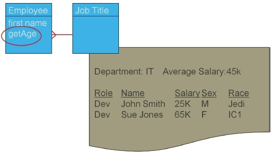
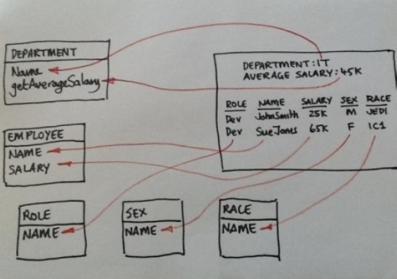

# [领域建模中的七种坏味道信息](https://kb.cnblogs.com/page/185286/)

​                 作者: Kent & Chris  来源: InfoQ  发布时间: 2013-12-17 18:21  阅读: 3459 次  推荐: 7                   [原文链接](http://www.infoq.com/cn/articles/seven-modelling-smells)                   [[收藏\]](javascript:void(0))               

　　**英文原文：**[The Seven Information Smells of Domain Modelling](http://www.infoq.com/articles/seven-modelling-smells)

　　领域建模（Domain modelling  ）作为一项强大的技术，常备于很多IT专业人士的工具箱之中。令人遗憾的是，在过去的几年间，因为领域建模的几个问题导致人们对其大失所望，尤其是在敏捷领域。这种方式的两个切实存在的问题就是：它会消耗太长的时间并且很易于导致“分析瘫痪（analysis  paralysis”），而这会导致停滞（“spinning wheels”）。我们为领域建模提供了一种方式，可以用来解决这些问题。

　　我们会讨论领域模型中的一些信号，这些信号会告诉你要提出更多的问题。我们将这些信号称之为“坏味道信息（information  smells）”，它们会提醒我们可能并没有完全理解领域模型所关注的信息。这些坏味道可能意味着我们在领域模型中丢失了信息或者领域模型中包含了不正确的信息。关注于坏味道信息会引导我们发现需要回答的问题，这是一个很快的过程。当所有的坏味道都消失掉或者能够确认剩余的都是可接受的，我们就会停止，这会避免分析瘫痪。

　　这个过程开始于系统的输出，这些输出会为用户交付价值。我们在本文中不会阐述如何寻找这个价值。接下来，我们基于输出来处理模型中的这些坏味道信息。

　　为了阐述本文中的信息坏味道，我们会使用一个虚拟的例子，这个例子来源于多个现实生活中的场景。我们的人力资源主管想了解各种开发人员的薪酬是如何支付的，这样他们就能避免在不同群体间进行不公正的支付所导致的法律纠纷。

　　在随后进行的讨论中，团队试图理解主管的要求时，产生了如下的草图：

　　领域建模最好的工具就是笔和纸或者记号笔和索引卡片或者白板笔和白板，因为它会将关注的焦点放在要交换的信息上，而不是试图将样例或模型变得“看上去很漂亮”。也就是说，为了防止我们凌乱的笔迹让您晕头转向，我们使用图形化工具来创建了模型。因此，以下就是这个样例的更整洁版本：

　　关于坏味道信息以及它们对领域模型所反映出来的内容，有很重要的几点需要我们记住：

- 坏味道信息并不一定表明**就是一个**问题。
- 坏味道信息是**可能**存在问题的强烈信号。
- 坏味道信息并不像**规则**那样具有强制性，规则通常都是正确的。
- 对于坏味道信息所反映出的问题应该按照“请给我一个……的例子”的形式来进行阐述，而不是“告诉我如何……”的形式。我们会探索领域细节的样例而不是对模型进行泛化（generalisation），从而对细节进行隐藏。

　　闲言少叙，以下就列出了主要的坏味道信息。如果你发现了其他的场景，请告诉我们以便让更多的人知道。

1. 某个条目在输出中，但是不在模型之中。
2. 某个条目在模型之中，但是不在输出中。
3. 两条信息位于同一个地方。
4. 某个实体与任何其他的实体都没有关联。
5. 一对一关系。
6. 多对多关系。
7. 未定义的功能。

　　以下更为详细地描述了每一种坏味道信息。

　　**坏味道信息#1 – 某个条目在输出中，但是不在模型之中。**

　　输出中的所有条目都需要存在于领域模型之中。输出只是对模型中数据的展现。输出中展现的每条信息都应该是模型中的一个属性或方法。在上面的例子中，模型中缺失了部门、平均工资、角色、工资、性别以及种族。为了消除这个坏味道，将它们作为属性或方法添加进来。如果缺失添加这些信息的合适实体，那需要添加实体。

　　**坏味道信息 #2 – 条目在模型中，但是不在输出之中。**

　　条目位于模型之中，但是并不在输出中是分析过程里面“推（push）”的一个例子。分析师认为它们需要这个值，而实际上却并不是这样。他们将值推到了模型之中。这会是比较危险的，因为你最终可能需要额外的开发来添加和维护这个值。但这是一种坏味道，它可能会被添加进来因为分析师觉得它是有用的。为了解决掉这种坏味道，我们需要问一下用户是否需要这个信息。注意，对于分析师来说这是过程的一种分解，因为他们需要将对用户的问题记录在问题日志中，而不是在模型之中。这种情况可能会发生在这样的场景之中，另外的一个项目需要一些信息，因此它就“悄然引入（slip）”到需求中来了。这些额外的需求应该作为单独的一项任务来处理。

　　在结构化系统分析与设计方法（Structured Systems Analysis and Design Method，[SSADM](http://searchsoftwarequality.techtarget.com/definition/SSADM)）中，这被称之为“信宿（Information Sink）”。

　　**坏味道信息 #3 – 两条信息位于一个地方（1NF）**

　　将两条信息放在一个地方会引起混乱。名字“John  Smith”可以按照名和姓进行存储。但是，这是一种坏味道。在一些场景之中，将名字存在一个地方是合适的，但在另一些场景中却不是这样。关键的问题在于，你是不是需要独立地分析或处理这两个信息条目。通常情况下，这被称之为违反“第一范式（First  Normal  Form）”或1NF。尽管1NF确实是一项设计规则，但是它也可以指导我们发现两条不同数据的实际指向是同一个。违反第一范式通常会通过查看真实的数据来识别，因为数据一般会借助名字来进行引用。另外一个样例就是种族（Race），它包含了“Jedi”（一个信仰/宗教）以及“IC1”（英国警方所使用的种族分类）。

　　**坏味道信息#4 – 没有关联**

　　系统中的业务对象应该是连接起来的。当你无法识别两个业务对象之间的关系时，你需要询问用户一个重要的问题：这两件事之间的关联是什么？是直接关联吗？还是通过其他的事情？

　　这是一个很严重的坏味道。根据经验判断，这通常会导致信息的丢失。在企业级系统中，缺失的通常是组织化的结构。

　　**坏味道信息 #5 – 一对一关系，它们是不是同一件事？**

　　当你遇到一对一关系时，通常会有两种可能的解释。第一，业务人员用多个术语表达相同的事情，因此两个业务对象实际上应该是一个对象。第二，一对一关系实际上应该是一对多关系，但是你并不知道原因。例如，汽车和司机可能是一对一的关系，但是当你深入挖掘的时候，你会发现同一时间一辆汽车只能由一位司机进行驾驶。众多的司机可以在不同的时间驾驶同一辆汽车。这里缺失的信息就是关系的暂时性特征。

　　**坏味道信息 #6 – 多对多（缺失信息）**

　　多对多关系有时候会表达合理的关系。但大多数的时候，它们表明缺失了“连接的（link）”业务对象。在关系型软件设计中，多对多关系会用连接实体（link   entity）来取代。连接实体通常也是一个业务对象，它具有关于关系本身的信息。在上面的例子中，一个雇员在不同的时间里面（暂时性的）会有多个工作头衔或者他们会将自己的时间花费在多个角色上。再次强调一遍，这种坏味道信息会帮助我们跟踪潜在的信息缺失。

　　**坏味道信息 #7 – 未定义的功能（缺失信息）**

　　模型中的每个方法都应该进行定义。方法中引用的任何事情都应该在业务模型之中。以getAge为例：

　　getAge按照年份来计算年龄：

　　getAge = (today() – Employee.date of birth) / 365

　　出生日期和获取当前日期的功能缺失了。它们应该被加到业务模型之中。

　　总结一下，过程是这样的：

1. 识别会给用户交付价值的输出。
2. 如果你还没有支持这个输出的领域模型，那就创建一个。
3. 检查模型中的坏味道信息，直到它们不再存在。
4. 停止。

　　这种方式会比传统的领域建模快得多并且更加专注。你采用领域建模却不会陷于“停滞（spinning your wheels）”的状态会令你的朋友感到吃惊的。

　　**侧边栏（Sidebar） - 领域模型**

　　领域模型是组织中某个方面的简化，可能是产品、运作或者是市场。领域模型是特定于组织及其工作方式的。尽管模型可能会使用业界标准的术语，但是模型会为特定的组织及其环境创建明确的词汇表。领域模型通常会描述从事这项业务的人所关心的信息。鉴于大多数的业务系统主要关注于收集、处理以及提供数据，所以可以顺理成章地说，了解信息是什么并且以一种清晰的方式来对信息进行分类是很重要的。一般来讲，领域模型包含业务实体，而业务实体会关联数据和行为。业务实体之间的交互通常也会进行声明。领域建模的示例包括实体—关系模型以及对象模型。

　　**侧边栏 - 所使用的例子**

　　我们从HR主管想要得到的报告开始。

　　**坏味道1—某个条目在输出中，但是不在模型之中。**

　　我们有一些条目在输出中，但是并不在模型中，所以我们将这些条目添加到模型里面。

　　注意一下平均工资是基于其他数据计算出来的，所以将其称之为getAverageSalary以提醒我们这是一个计算所得的属性。

　　**坏味道 2 – 某个条目在模型中但是不在输出之中。**

　　有些人没有管住自己将Birthday添加到Employee之中了。

　　我们询问HR主管是否需要在报表中包含Birthday。他们的回答是“不需要”，但是他们想要在报表中包含“Age”。

　　**坏味道 3 – 两条信息位于同一个位置**

　　名字由名和姓组成。我们询问HR主管是否想要将其分开，这样的话他们就能看到具备相同姓的所有人（姓可以用于识别文化群体）。他的回答是并不想这样。

　　**坏味道 4 –某个实体与其他的所有实体都没有关联**

　　模型中所有的实体必须是连接起来的。我们询问业务方面的专家实体要直接关联还是要通过其他的实体进行关联。例如，雇员是与部门直接关联，还是雇员与团队关联，而团队再与部门关联。

　　**坏味道 5 – 一对一关联**

　　一对一关联是一种坏味道，所以针对这种关系我们要询问相关的专家。我们并不是直接问雇员和部门之间的关系是什么，因为这只会得到通用的情况。相反，我们应该这样问，“你能给我某位员工属于多个部门的例子吗”以及“你能给我某个部门的员工多于一个人的例子吗”。

　　严格使用这种技术可能会问出一些看起来很愚蠢的问题，但是这些问题实际上是很有价值的。“你能给我某位雇员有多个性别或多个种族的例子吗”。通过这些问题识别出来的人很可能正是那些遭受歧视和偏见的人。

　　我们保持这些问题一直是开放的，直到找到某个样例为止。它们会作为系统可能会发生变化的风险指示器。

　　**坏味道 6 – 多对多关系**

　　多对多关系可能意味着信息的丢失。我们询问相关的专家可能丢失的信息是什么。在本例中，雇员的时间被分配到了两个或更多的部门之中。

　　在角色、性别以及种族方面，相关的专家并没有想出任何有额外价值的信息。所以坏味道信息将依然作为开放性的问题，它们指示了一种变化的风险。

　　一个专业的网站通过建立七种分类（male、female、male pre-op female、female pre-op  male、male post-op female、female post-op  male、inter-sex）解决了性别中的多对多关系。缺失的信息可能是某个人决定要做手术的日期，或者他们何时做的手术以及这些事情随后怎样影响工资增长和奖金。.

　　**坏味道 7 – 未定义的功能**

　　我们询问相关的专家如何计算getAverageSalary以及getAge。

　　这会导致将allocation.cost和employee.dateOfBirth的值加入到模型之中。

　　现在已经没有未处理或决定延迟处理的坏味道了。我们可以就停止领域建模了。

　　**关于作者**

　　Chris  Matts是一位敏捷实践者，他会做所有必要的事情。因此，他担当的角色包括项目管理人员、业务分析师、测试人员甚至开发人员（尽管在这方面他做得实在不好）。尽管在过去二十多年的经验中，他主要在为投资银行构建交易和风险管理系统，但是他目前担任Microsoft  Skype部门在企业级级别采用敏捷和Real  Option的教练。Chris的第一个硕士学位是微电子和软件工程（Microelectronics and Software  Engineering）专业的，而第二个硕士学位是数学交易和金融专业（Mathematical Trading and  Finance）的。除了Olav Maassen以及Chris  Geary，他还会出版一本关于业务的图形化小说，将其称之为“Commitment”。“Commitment”是关于项目风险管理的故事。

　　Kent J.  McDonald帮助很多的组织提高了项目的有效性。他超过15年的经验包括担任业务分析师、战略管理、项目管理以及多种行业的产品开发，这涉及到金融服务、健康保险、绩效营销、人力资源服务、非盈利组织以及汽车行业。他是“Stand  Back and Deliver: Accelerating Business Agility”的合作者，目前为B2T  Training提供业务分析培训并且在BeyondRequirements.com站点上分享他在项目有效性方面的想法。