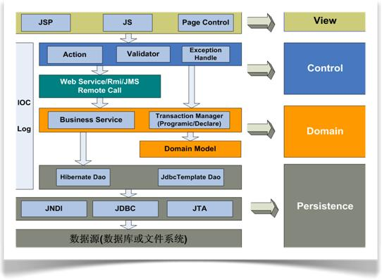
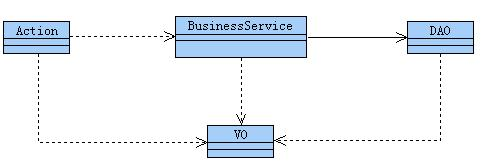
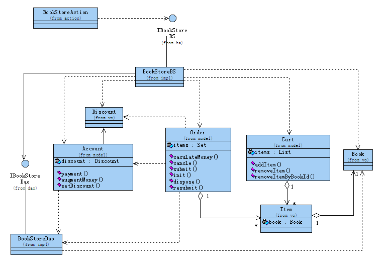

# [领域驱动设计和实践](https://kb.cnblogs.com/page/112298/)

​                 作者: 池建强  来源: InfoQ  发布时间: 2013-12-01 13:03  阅读: 29566 次  推荐: 47                   [原文链接](http://www.infoq.com/cn/articles/cjq-ddd)                   [[收藏\]](javascript:void(0))               

摘要：本文主要介绍了领域驱动设计的基本概念、要素、特点，对比了事务脚本和领域模型的特点，最后介绍了我们在软件开发过程中的领域驱动设计实践。

## 　　引言

　　软件系统面向对象的设计思想可谓历史悠久，20世纪70年代的Smalltalk可以说是面向对象语言的经典，直到今天我们依然将这门语言视为面向对象语言的基础。随着编程语言和技术的发展，各种语言特性层出不穷，面向对象是大部分语言的一个基本特性，像C++、Java、C#这样的静态语言，Ruby、Python这样的动态语言都是面向对象的语言。

　　但是面向对象语言并不是银弹，如果开发人员认为使用面向对象语言写出来的程度本身就是面向对象的，那就大错特错了。实际开发中，大量的业务逻辑堆积在一个巨型类中的例子屡见不鲜，代码的复用性和扩展性无法得到保证。为了解决这样的问题，领域驱动设计提出了清晰的分层架构和领域对象的概念，让面向对象的分析和设计进入了一个新的阶段，对企业级软件开发起到了巨大的推动作用。

　　本文主要介绍了领域驱动设计的基本概念、要素、特点，对比了事务脚本和领域模型的特点，最后介绍了我们在软件开发过程中的领域驱动设计实践。

## 　　什么是领域驱动设计（DDD）

　　2004年著名建模专家Eric Evans发表了他最具影响力的书籍:《Domain-Driven Design: Tackling  Complexity in the Heart of  Software》(中文译名：领域驱动设计：软件核心复杂性应对之道)，书中提出了领域驱动设计(简称 DDD)的概念。

　　领域驱动设计事实上是针对OOAD的一个扩展和延伸，DDD基于面向对象分析与设计技术，对技术架构进行了分层规划，同时对每个类进行了策略和类型的划分。

　　领域模型是领域驱动的核心。采用DDD的设计思想，业务逻辑不再集中在几个大型的类上，而是由大量相对小的领域对象(类)组成，这些类具备自己的状态和行为，每个类是相对完整的独立体，并与现实领域的业务对象映射。领域模型就是由这样许多的细粒度的类组成。基于领域驱动的设计，保证了系统的可维护性、扩展性和复用性，在处理复杂业务逻辑方面有着先天的优势。

## 　　领域驱动设计的特点

　　领域驱动的核心应用场景就是解决复杂业务的设计问题，其特点与这一核心主题息息相关：

1. 分层架构与职责划分：领域驱动设计很好的遵循了关注点分离的原则，提出了成熟、清晰的分层架构。同时对领域对象进行了明确的策略和职责划分，让领域对象和现实世界中的业务形成良好的映射关系，为领域专家与开发人员搭建了沟通的桥梁。
2. 复用：在领域驱动设计中，领域对象是核心，每个领域对象都是一个相对完整的内聚的业务对象描述，所以可以形成直接的复用。同时设计过程是基于领域对象而不是基于数据库的Schema，所以整个设计也是可以复用的。
3. 使用场景：适合具备复杂业务逻辑的软件系统，对软件的可维护性和扩展性要求比较高。不适用简单的增删改查业务。

## 　　如果不使用DDD？

　　面对复杂的业务场景和需求，如果没有建立和实现领域模型，会导致应用架构出现胖服务层和贫血的领域模型，在这样的架构中，Service层开始积聚越来越多的业务逻辑，领域对象则成为只有getter和setter方法的数据载体。这种做法还会导致领域特定业务逻辑和规则散布于多个的Service类中，有些情况下还会出现重复的逻辑。我们曾经见过5000多行的Service类，上百个方法，代码基本上是不可读的。

　　在大多数情况下，贫血的领域模型没有成本效益。它们不会给公司带来超越其它公司的竞争优势，因为在这种架构里要实现业务需求变更，开发并部署到生产环境中去要花费太长的时间。

## 　　领域驱动设计的分层架构和构成要素

　　下面我们简单介绍一下领域驱动设计的分层架构和构成要素，这部分内容在Eric Evans的书中有非常详尽的描述，想要详细了解的，最好去读原版书籍。

　　下面这张图是该书中著名的分层架构图，如下：

　　整个架构分为四层，其核心就是领域层（Domain），所有的业务逻辑应该在领域层实现，具体描述如下：

| 用户界面/展现层 | 负责向用户展现信息以及解释用户命令。                         |
| --------------- | ------------------------------------------------------------ |
| 应用层          | 很薄的一层，用来协调应用的活动。它不包含业务逻辑。它不保留业务对象的状态，但它保有应用任务的进度状态。 |
| 领域层          | 本层包含关于领域的信息。这是业务软件的核心所在。在这里保留业务对象的状态，对业务对象和它们状态的持久化被委托给了基础设施层。 |
| 基础设施层      | 本层作为其他层的支撑库存在。它提供了层间的通信，实现对业务对象的持久化，包含对用户界面层的支撑库等作用。 |

　　领域驱动设计除了对系统架构进行了分层描述，还对对象（Object）做了明确的职责和策略划分：

1. 实体（Entities）：具备唯一ID，能够被持久化，具备业务逻辑，对应现实世界业务对象。
2. 值对象（Value objects）：不具有唯一ID，由对象的属性描述，一般为内存中的临时对象，可以用来传递参数或对实体进行补充描述。
3. 工厂（Factories）：主要用来创建实体，目前架构实践中一般采用IOC容器来实现工厂的功能。
4. 仓库（Repositories）：用来管理实体的集合，封装持久化框架。
5. 服务（Services）：为上层建筑提供可操作的接口，负责对领域对象进行调度和封装，同时可以对外提供各种形式的服务。

　　当然，DDD中还提出了聚合和聚合根（Aggregate Root）的概念，不过我们在实践过程发现聚合根有问题复杂化的倾向，用传统的聚合、组合等概念去描述领域对象之间的关系更容易理解，所以这里对这个概念就不做介绍了。

## 　　事务脚本和领域模型

　　Martin Fowler 2004年所著的企业应用架构模式（Patterns of Enterprise Application  Architecture）中的第九章领域逻辑模式（Domain Logic Patterns）专门介绍了事务脚本（Transaction  Script）和领域模型（Domain Model），理解这两种模式对设计和构建企业应用软件非常有帮助，所以有必要介绍一下。

　　事务脚本：

　　事务脚本的核心是过程，通过过程的调用来组织业务逻辑，每个过程处理来自表现层的单个请求。大部分业务应用都可以被看成一系列事务，从某种程度上来说，通过事务脚本处理业务，就像执行一条条SQL语句来实现数据库信息的处理。事务脚本把业务逻辑组织成单个过程，在过程中直接调用数据库，业务逻辑在服务（Service）层处理。

　　事务脚本模式可以简单的通过UML图表示成这样：

　　由Action层处理UI层的动作请求，将Request中的数据组装后传递给BusinessService，BS层做简单的逻辑处理后，调用数据访问对象进行数据持久化，其中VO充当了数据传输对象的作用，一般是贫血的POJO，只具备getter和setter方法，没有状态和行为。

　　事务脚本模式的特点是简单容易理解，面向过程设计。对于少量逻辑的业务应用来说，事务脚本模式简单自然，性能良好，容易理解，而且一个事务的处理不会影响其他事务。不过缺点也很明显，对于复杂的业务逻辑处理力不从心，难以保持良好的设计，事务之间的冗余代码不断增多，通过复制粘贴方式进行复用。可维护性和扩展性变差。

　　领域模型：

　　领域模型的特点也比较明显，  属于面向对象设计，领域模型具备自己的属性行为状态，并与现实世界的业务对象相映射。各类具备明确的职责划分，领域对象元素之间通过聚合和引用等关系配合解决实际业务应用和规则。可复用，可维护，易扩展，可以采用合适的设计模型进行详细设计。缺点是相对复杂，要求设计人员有良好的抽象能力。

　　领域模型对应的就是领域驱动设计中划分的领域层，这里就不详细讨论了。

　　在实际的设计中，我们需要根据具体的需求选择相应的设计模式。具备复杂业务逻辑的核心业务系统适合使用领域模型，简单的信息管理系统可以考虑采用事务脚本模式。

## 　　领域驱动设计实践

　　下面主要讲一下我们在构建企业级应用开发平台中对DDD的实践和扩展。

　　本人近年来一直在从事企业级应用开发平台的相关工作，GAP平台是我们的一个软件产品，用来解决企业级软件开发过程中复用、快速开发和过程规范等问题。设计这样一个平台，从底层的框架上就应该能够支撑复杂业务逻辑的系统构建，所以我们在大的架构设计思路上采用了领域驱动设计的思路，并根据实际采用的技术和要实现的功能对DDD的四层架构进行了细化和实现：

　　整个平台采用了JavaEE的技术及其相关的开源框架。系统的核心业务逻辑由Domain层处理，其中的业务服务（BusinessService）负责处理某个相对内聚的业务逻辑单元，同时对内对外提供本地或远程的服务。

　　下面是对各层的简要描述：

1. View：展示层，由于GAP平台主要面向B/S架构，展示层主要由web资源文件组成，包括JSP，JS和大量的界面控件，同时还采用了AJAX和Flex等RIA技术，负责向用户展现丰富的界面信息，并执行用户的命令。
2. Control：控制层，负责展示层请求的转发、调度和基础验证，同时自动拦截后台返回的Runtime异常信息，如果控制层需要与第三方系统交互，可以通过Action做远程的请求。
3. Domain：领域层，是系统最为丰富的一层，主要负责处理整个系统的业务逻辑。这一层包括业务服务和领域对象，同时负责系统的事务管理。其中业务服务可以提供本地调用和共享远程服务的功能。
4. Persistence：持久化层，主要负责数据持久化，支持O/R Mapping和JDBC。对数据源的访问提供多种方式。

　　另外，我们引入了Spring的IOC容器，系统的控制层、领域层和持久化层元素都有IOC容器统一管理，实现完全的接口分离和解耦。同时在控制、领域和持久化层都可以引用日志服务。

　　我们对领域驱动要素的定义上和原有的命名和含义上稍有区别。

　　原来的服务（Service），我们定义为业务服务（BusinessService），面向业务服务的架构是GAP平台的核心设计思想，一个业务服务可以由一个或多个领域模型和数据访问对象（DAO）组成，去实现一个完整的业务逻辑单元。业务服务主要负责事务处理和维护各个领域对象之间的关系，同时为上层访问提供本地和远程服务，服务类型包括Web  Service，RMI等。

　　领域对象由实体（Entity）和值对象（VO）构成，实体类具备自己的属性和行为、状态，可以聚合VO，实体类之间可以有聚合关联等关系，可以由数据访问对象（DAO）进行持久化。

　　持久化由数据访问对象（DAO）实现，不处理业务逻辑，主要负责实体类的持久化。提供多种持久化方式（O/R Mapping和JDBC）。

　　那么如何在去实现领域驱动设计呢？我们总结了以下四个步骤：

1. 确定业务服务（Business Service）：根据业务需求和功能模块划分，确定业务单元，每个Business Service是一个内聚的业务单元，覆盖相关的领域对象。
2. 定义领域对象（Entity， VO）：根据业务单元的业务逻辑定义领域对象，通过UML方法和设计模式描述领域对象。
3. 定义领域对象的属性和关联关系：确定领域对象的各种属性和各个领域对象之间的关联关系。
4. 为领域对象增加行为：根据业务需求（系统用例和界面原型等）为领域对象增加行为，并定义哪些方法要被业务服务引用。

## 　　案例网上书店

　　为了更好的理解领域驱动设计，我们基于以上设计方法，实现了一套简单的网上书店系统。

　　网上书店系统是采用DDD设计思想构建的一个应用系统示例。通过网上书店系统，可以快速理解领域驱动设计。该系统实现网上书店的常用功能：包括浏览书籍、挑选书籍、提交订单、查看订单、自动折扣、处理订单、取消订单等。未登录用户可以浏览和挑选书籍；已登录用户可以提交和查看自己相关的订单；管理员可以处理订单。

　　经过业务抽象，即使是这样一个简单的业务场景也包含了很多领域对象，例如订单、账户、书籍、购物车、购物项、折扣等，通过分析和设计，我们可以得到这样的设计图（为了查看方便，图中的类隐藏了属性信息）：

　　BookStoreAction负责处理展现层的请求，并把请求转发给业务服务IBookStoreBS，业务服务负责调度上图中显示的领域对象，处理该场景的所有业务。

　　其中领域对象和现实业务的对应关系为：

- Account账户
- Order订单
- Book书籍
- Cart购物车
- Item订单项
- Discount折扣

　　与事务脚本的编程模式不同，领域驱动设计不是把业务逻辑放在BS（BusinessService）中，而是由具备属性、行为和状态的领域对象处理。例如Order类，如果是贫血的POJO，那它内部只有与数据表字段对应的属性以及getter和setter方法，而在领域驱动设计中，则是一个相对独立的、能够处理自身关联业务的领域对象。在本系统中，我们对Order的描述如下：

　　订单的实现类是gap.template.bookstore.model.Order，类中除了联系方式、邮寄地址等基本属性外，还有以下领域相关的行为：

1. init(...)，结算时调用方法，根据当前用户与购物车中的Items初始化订单，供用户修改。
2. submit(...)，提交订单时调用的方法，保存订单。
3. cancel(...)，取消订单，把订单和相关item的状态设置为已取消，然后委托Dao进行持久化。
4. dispose(...)，处理订单，首先更新订单项的状态，然后委托Dao持久化订单数据。
5. reSubmit、setItemsStatus......

　　通过以上的描述，我们可以看到，Order类基本上覆盖了现实世界中订单这个业务的所有行为和状态，是相对内聚的，这样的特性使其复用性大大增加，即使未来开发新的模块，涉及到订单业务的，可以直接复用Order类。同时在后期维护中，如果我想了解订单的业务，直接读Order的代码就可以了。

　　从上图中我们还可以清晰的看到各个领域对象之间的关系。Order和Cart都聚合了Item，对应都是1...n，Item聚合了Book，对应关系1...1。Order分别与折扣、账户发生关联和调用等等，整个网上书店的场景就这样描述出来了。

　　另外，不要忘了BS，除了起到基础设施的作用外（事务管理和服务共享），它还要负责调度和维护领域对象之间的关系。因为总会有些业务逻辑，既不属于这个领域对象，也不属于那个，那这部分业务由谁来处理呢？由BS来处理。例如在管理员处理订单这个场景中，首先需要根据订单信息获取账户，根据账户信息确定折扣率，同时进行余额校验，如果校验通过，就会调用订单对象的dispose方法处理订单，这个场景会涉及到Order、Account、Discount等对象，这样的业务逻辑，应该由BS实现。

　　IBookStoreDao是数据访问对象，可以被BS调用，用来持久化对象，也可以被领域对象引用，用来持久化自身。

　　通过以上的描述，我们可以看到，整个设计和实现是优雅、清晰的。业务逻辑没有堆积在BS中，而是分散在BS和各个领域对象中，服务和对象都与现实世界的业务息息相关，无论是对领域专家、开发人员和后期维护人员，都能这种方式中获得自己需要的内容。

## 　　总结

　　我们采用领域驱动设计相对比较早，就我个人的检验和实践而言，DDD对构建企业级应用开发平台和大型核心业务系统的作用是非常明显的，无论是在产品的稳定性、扩展性、可维护性、生命周期等方面都有显著的提升。

　　但是，由于这样那样的原因（复杂度、工期、开发人员能力限制等等），很多人会不自觉的抵制采用DDD，有时候一个软件项目重写了两次，第二次依然不去做良好的设计。事实上采用了DDD的设计方法，我们的设计阶段已经变得非常轻量级和敏捷了，开发人员只要能够把领域模型之间的关系画出来并描述说明，并与需求人员达成一致，那么做出来的东西基本上是靠谱的。

　　在技术领域，只有主动的尝试和提升，效果才是最明显的。很多人问过我，如何开始学习和实践XXX，其实很简单，现在就开始吧！