作者：李大颖

链接：https://www.zhihu.com/question/19942068/answer/677558035

来源：知乎

著作权归作者所有。商业转载请联系作者获得授权，非商业转载请注明出处。

网上有非常多**免费的教育资源**，但是你能分辨出哪些资源更**优质**，更**适合学习**吗？要知道，网络资源质量**参差不齐**，学习劣质课程不仅浪费你的时间，还会让你走歪路！

所以，我结合自身体验，给你挑选了10个高质量、免费的教育资源网站！

文末还有更多优质网站链接补充！

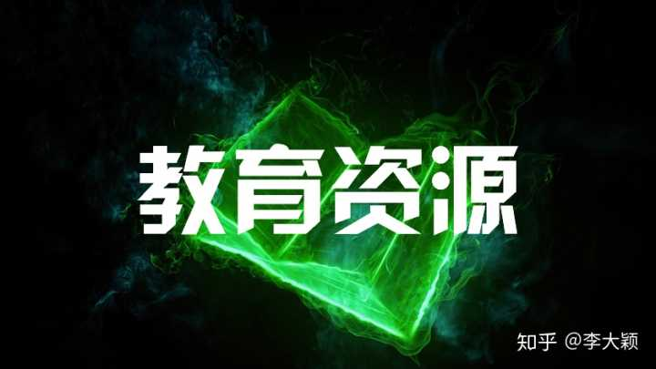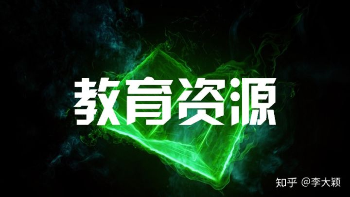

## 一、综合学习篇

### 1.中国大学MOOC

[中国大学MOOC(慕课)_国家精品课程在线学习平台](https://link.zhihu.com/?target=https%3A//www.icourse163.org/)

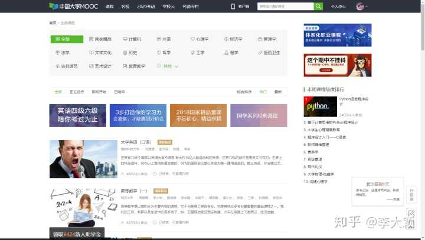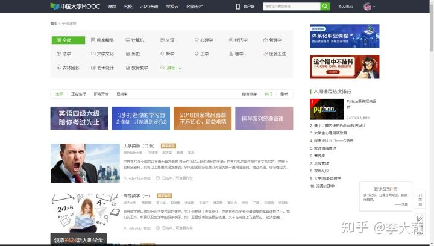

作为一个国内优质的学习平台，这个网站上拥有上千门课程，每一门课程的质量都非常高！因为是由985、211高校提供的内容！

里面的课程涵盖的领域非常多，从计算机、心理学、法学到英语、艺术设计、摄影等等！

给各位分享一门我最近报名的课程，还没有定开课时间，但是超级期待！

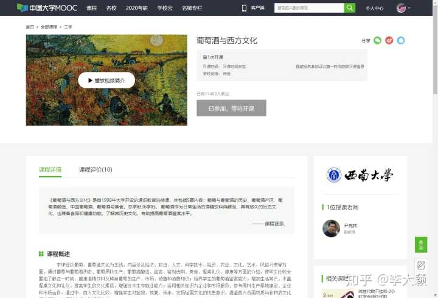

### 2.中国国家图书馆

[中国国家图书馆•中国国家数字图书馆](https://link.zhihu.com/?target=http%3A//www.nlc.cn/)

一个国家总书库网站。教育资源怎么能少的了书籍资源？这个网站不仅是供国家机关使用，而且还是面对社会大众的，你可以在这里搜索书籍、论文、报刊、甚至古籍、音乐、影视！

当然，影视也都是教育、科普类的！

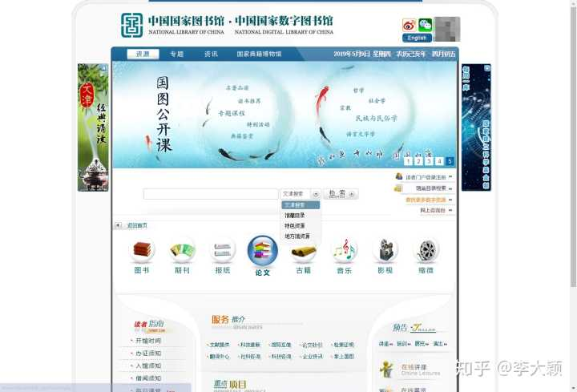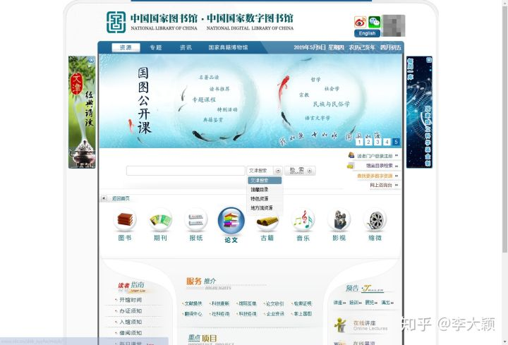

### 3.B站

[哔哩哔哩 (゜-゜)つロ 干杯~-bilibili](https://link.zhihu.com/?target=https%3A//www.bilibili.com/)

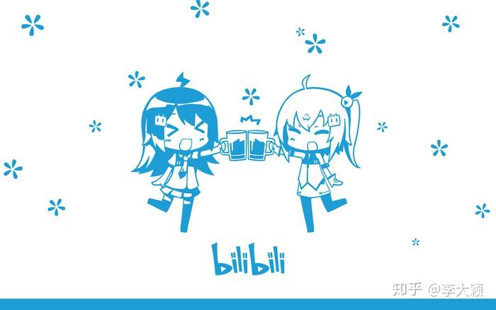

一个视频弹幕网站。如果你觉得这是个二次元网站，那就错了！因为最近央视刚出了一篇文章力挺B站《知道吗？这届年轻人爱上B站搞学习》！

是不是突然觉得B站很厉害？

**搜索“英语四级”：**

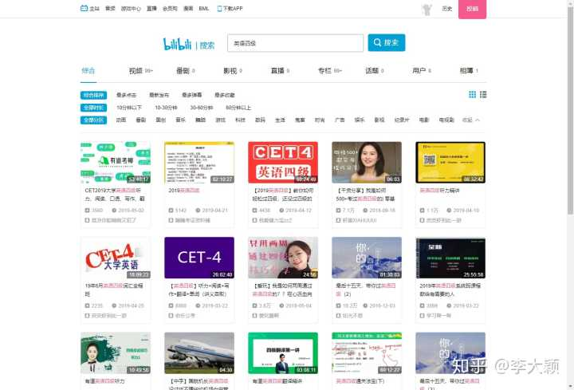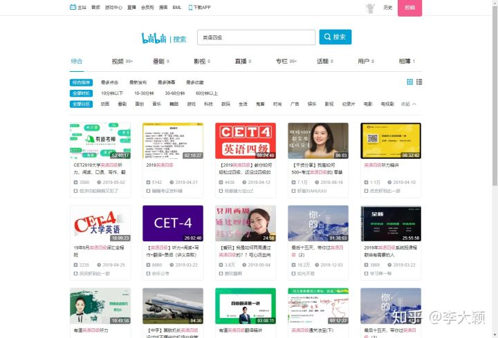

**搜索“教师资格证”：**

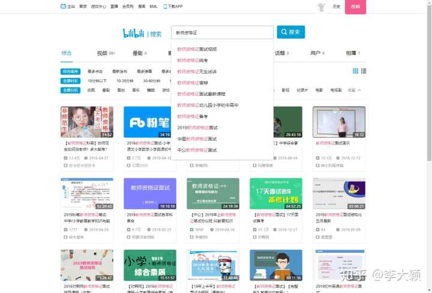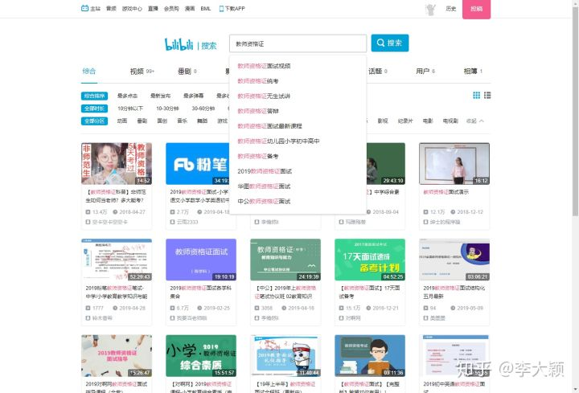

**搜索“日语学习”：**

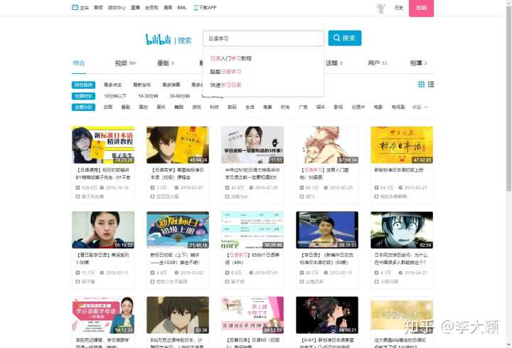

想要什么样的课程，这里都有！

## 二、语言学习篇

### 4.Memrise

[Memrise - Unlock your language learning superpowers!](https://link.zhihu.com/?target=https%3A//www.memrise.com/)

一个可以学习多种外语的平台，中文名字叫做“忆术家”。除了官网，还有APP版本。

它是让用户通过游戏的方式来学习、记忆。该平台使用了非常科学的学习系统，能够提高你大脑的学习速度！

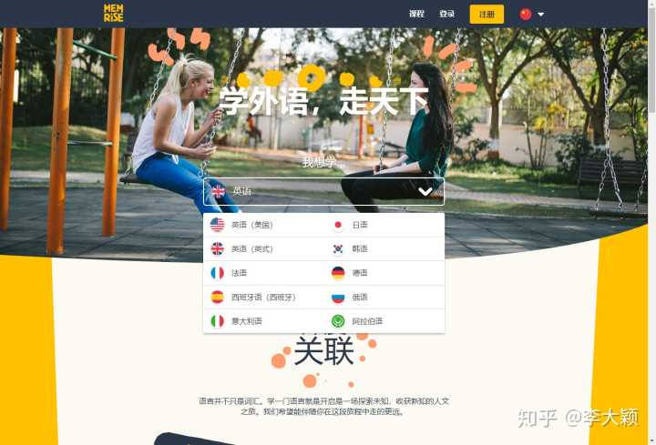

这里的课程被划分为很多等级，你可以选择适合自己的进行学习！

并且，里面所有的课程都是免费的！

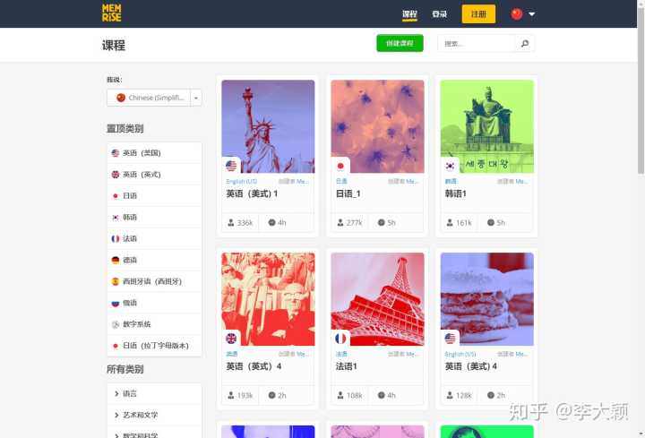

### 5.TED

[TED: Ideas worth spreading](https://link.zhihu.com/?target=https%3A//www.ted.com/%23/)

TED是一个美国创建的机构，宗旨就是“传播一些值得传播的创意”！这里有非常多的演讲视频，来自各界人士，内容也是五花八门！让你拥有最广的视角，了解更大的世界！

全部纯英文演讲，可以锻炼你的英语能力！

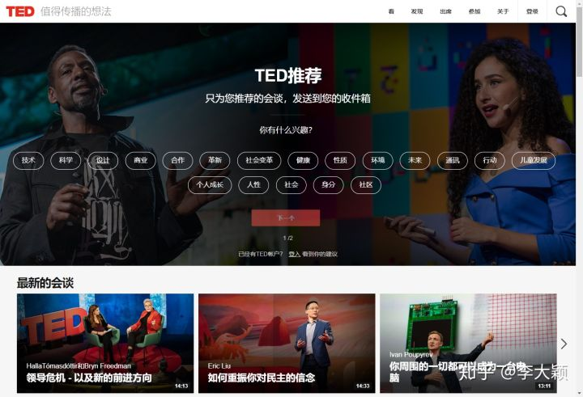

### 6.译学馆

[推荐 - 译学馆 - 知识无疆界](https://link.zhihu.com/?target=https%3A//www.yxgapp.com/47.html)

一个搬运国外优秀视频的网站。如果上面全英的TED视频，你实在看不下去，就可以选择这个网站！上面不仅有TED视频，还有来自国外各大高校的公开课，YouTube上的优秀视频！

所有的视频都是中英字幕，应该更有助于提高英语综合能力，并且还能涨知识！

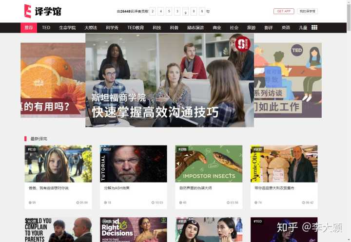

## 三、技能学习篇

### 7.巧匠课堂

[巧匠课堂-学设计上巧匠 免费的设计视频教程平台,PS AI C4D精品教程](https://link.zhihu.com/?target=https%3A//www.qiaojiang.tv/)

一个可以学设计的网站。网站上的课程非常丰富，围绕常用的PS、AI、C4D、AE、手绘，开战了针对学习者各个阶段的课程。

但是这个网站上的视频课程，每天只能免费看一个！

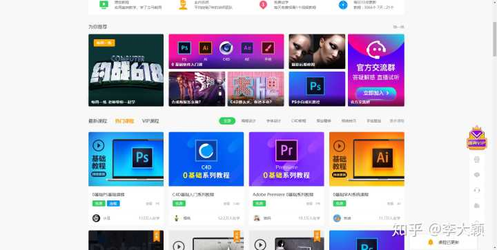

### **8.优优教程网**

[优优教程网 - 学教程找灵感就上优优 - PS教程,AI教程,原创免费教程](https://link.zhihu.com/?target=https%3A//uiiiuiii.com/)

一个设计师教程学习平台。上面的所有课程都是免费的！闲暇无事看一看，就可以提高你的设计水平！常用的设计软件，都可以在这里学习入门课程！

学好设计，真的是百益无一害！

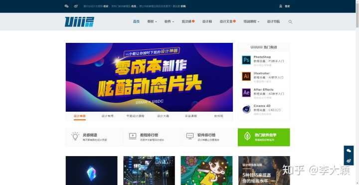

### 9.蓝铅笔

[蓝铅笔-约课学画画，就是快！](https://link.zhihu.com/?target=https%3A//www.lanqb.com/)

一个可以学习绘画的网站。对于初学者来说，上面的免费课程都已经足够入门了！插画、数位板绘画、动漫设计……课程都有！

如果你喜欢画画，可以在这个网站上找个适合自己的课程学习！

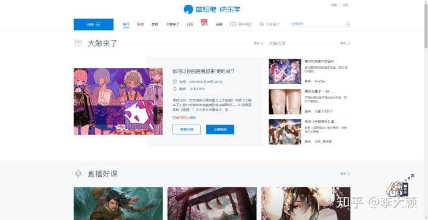

### 10.读写人

[读写人：书评杂志、书评博客、书评网站、读书资源聚合](https://link.zhihu.com/?target=http%3A//www.duxieren.com/)

一个跟文章、书籍有关的网站。你可以在这里阅读书评、文章、甚至英文书籍资源！上面都是专业的书评人写作的文章，非常适合喜欢看书评的小伙伴！

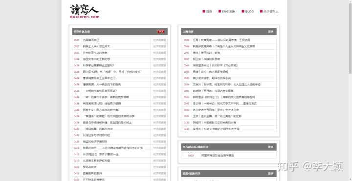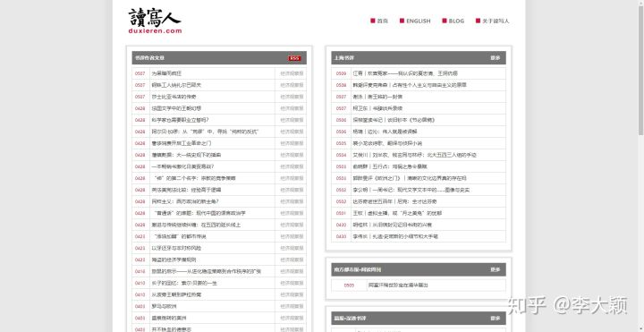

## 四、其他的一些高质量、免费教育资源：

[全网公开课都有，基本包含该问题下所有网站](https://link.zhihu.com/?target=http%3A//1nami.com/site/167.html)

[国外学习网站](https://link.zhihu.com/?target=http%3A//1nami.com/site/210.html)

[考研党必看](https://link.zhihu.com/?target=http%3A//1nami.com/site/182.html)

[喜欢阅读的，别错过这些网站](https://link.zhihu.com/?target=http%3A//1nami.com/site/213.html)

[喜欢看电子书，记得收藏这些网站](https://link.zhihu.com/?target=http%3A//1nami.com/site/214.html)

[外语学习必看网站](https://link.zhihu.com/?target=http%3A//1nami.com/site/180.html)

[日语学习必看](https://link.zhihu.com/?target=http%3A//www.jpwind.com/)

[UI设计师必看](https://link.zhihu.com/?target=http%3A//1nami.com/site/188.html)

[IT_程序员学习网站](https://link.zhihu.com/?target=http%3A//1nami.com/site/175.html)

## 最后

以上，就是我收集的所有高质量、免费网站了！

码字辛苦，到现在还没吃午饭呢，喜欢的话，别忘了给我点个赞哦！

## 我的其他高赞回答分享：

你写论文时发现了哪些神网站？