作者：简道云

链接：https://www.zhihu.com/question/19942068/answer/462000627

来源：知乎

著作权归作者所有。商业转载请联系作者获得授权，非商业转载请注明出处。

亲测整理144个免费学习网站，强烈推荐其中44个。正文多图预警，可以先保存收藏这个 ☞【[学习网站大全](https://link.zhihu.com/?target=https%3A//www.jiandaoyun.com/dash/5b67ee977c2061035127142e)】☜（持续更新）


**先看目录：** 

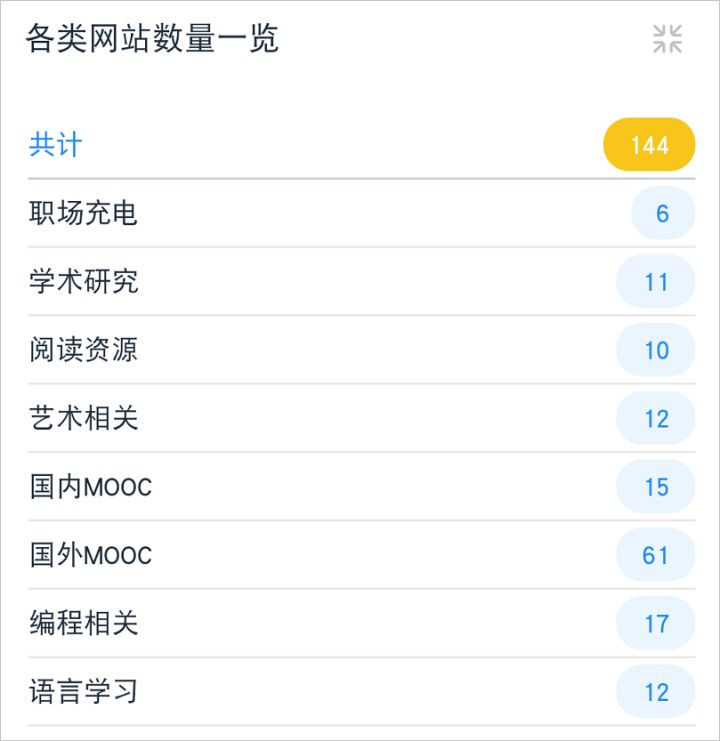

------

## 一、国内MOOC类网站（多综合类）


```text
小科普：MOOC（massive open online courses），即大型开放式网络课程，MOOC教育资源通常来源于各大高校，课程有作业、考试、证书，上同一课程的同学可以互相帮助和交流。一般听课免费、拿证书付费。
```


1）[学堂在线](https://link.zhihu.com/?target=http%3A//www.xuetangx.com/)：清华大学推出的、国内拥有最多精品课程的中文MOOC平台。| 涉足领域广、教学质量高、参与人数多。| 可选择付费/免费课程。 

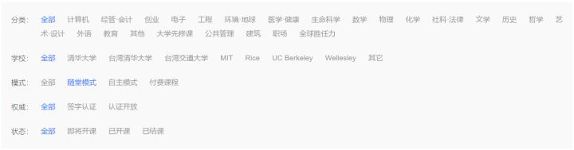


2）[中国大学MOOC](https://link.zhihu.com/?target=https%3A//www.icourse163.org/)：与**国内主流大学**合作的在线课程网站，覆盖计算机、经济、心理、外语等各大领域。| 大多课程免费听。

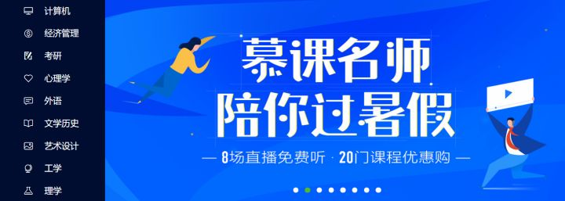


3）[ewant](https://link.zhihu.com/?target=http%3A//www.ewant.org/)：海峡两岸大学联合开课的中文MOOC网站。课程较有创意，可免费听课。 

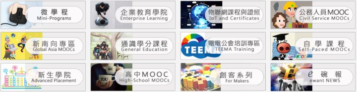


4）[网易云课堂](https://link.zhihu.com/?target=http%3A//study.163.com/courses)：网易公司打造的在线实用技能学习平台，技能偏实践，开课人一般是各领域的专业人士。| 有部分免费课程，不过优质课程越来越多都是付费的。 

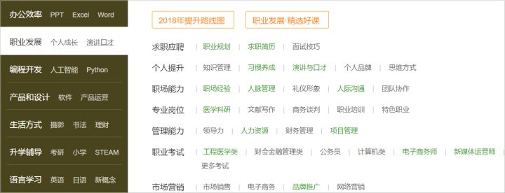


5）[华文慕课](https://link.zhihu.com/?target=http%3A//www.chinesemooc.org/kvideo.php%3Fdo%3Dsearch%26classid%3Dall)：北京大学和阿里巴巴联合打造的中文MOOC平台，涉及领域较多，只是课程数量不多。| 可以免费听课。 

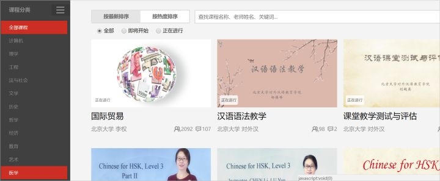


6）[好大学在线](https://link.zhihu.com/?target=http%3A//www.cnmooc.org/portal/frontCourseIndex/course.mooc%3Fk%3D%26n%3Dcourse%26f%3D3%26t%3D%26m%3D%26e%3Dall%26l%3Dall%26c%3Dall%26p%3D1%26s%3D)：国内部分高效组建的开放式MOOC教育平台，涉及多个常见领域课程，课量不多。| 支持免费参加学习。 

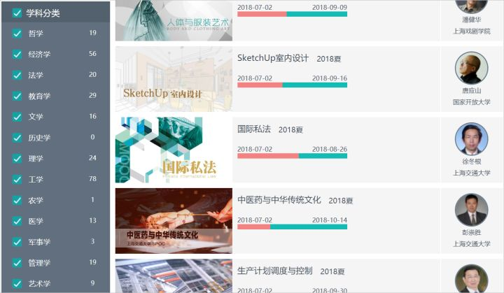


7）[咪咕学堂](https://zhuanlan.zhihu.com/p/20892203)：咪咕数媒推出的实用类线上教学平台。涉足领域较多，其中K12教育线课程内容比较多。| 大多课程付费，少量课程免费。 

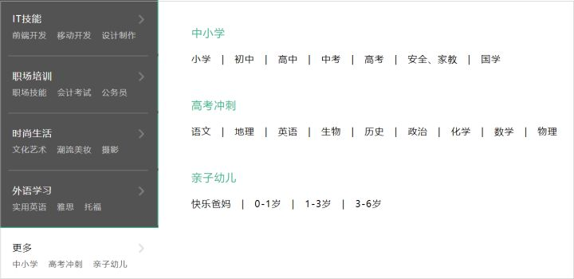


8）[万门大学](https://link.zhihu.com/?target=https%3A//www.wanmen.org/)：北大校友童哲创建的线上课堂（严格讲不算是正宗的MOOC），内容覆盖职场、考证升学、语言、大学、中学以及小学。| 支持免费听一些入门课程。 

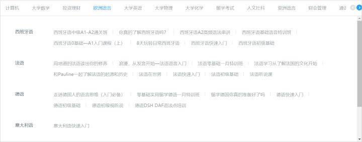


9）[MOOC中国](https://link.zhihu.com/?target=http%3A//www.mooc.cn/course) - 收录了来自世界知名大学的1000+课程。是汇集课程资讯的网站，无社区，本身不提供课程，课程资讯包括国内和国外。 

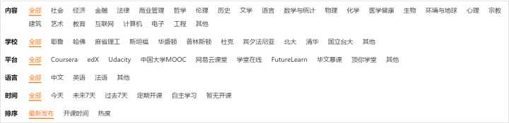


10）[国图公开课](https://link.zhihu.com/?target=http%3A//open.nlc.cn/onlineedu/course/explore/search.htm%3Ffilter%3Dsubject%26subjectId%3D1015%26orderBy%3Dlatest)：偏向传统文化教育的在线课程平台。免费观看，课程角度挺有意思。 

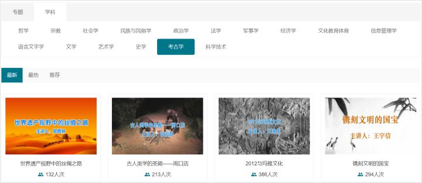


— 以上是比较常见的11个国内MOOC网站。

— 另外在☞【[学习网站大全](https://link.zhihu.com/?target=https%3A//www.jiandaoyun.com/dash/5b67ee977c2061035127142e)】☜还多整理了5个国内MOOC网站，网站类型为“国内MOOC”。

------

## 二、国外MOOC类网站（多综合类）


1）[coursera：](https://link.zhihu.com/?target=https%3A//www.coursera.org/browse)美国斯坦福大学教授创办、拥有最多精品好课的MOOC网站，知名度高，课程覆盖范围广泛。| 课程部分收费，拿学位收费，网站有中文版。 

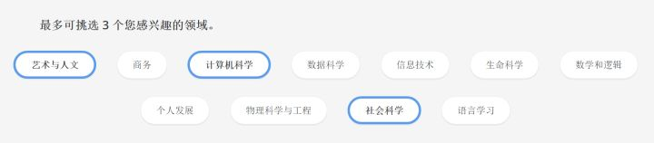


2）[Gacco](https://link.zhihu.com/?target=http%3A//gacco.org/)：日本打造的、课程质量高、非常受欢迎的知名MOOC教育平台。适合学习日文的同学学习语言or了解日本文化/知识。 | 可以免费上课，平台主要是日语。 

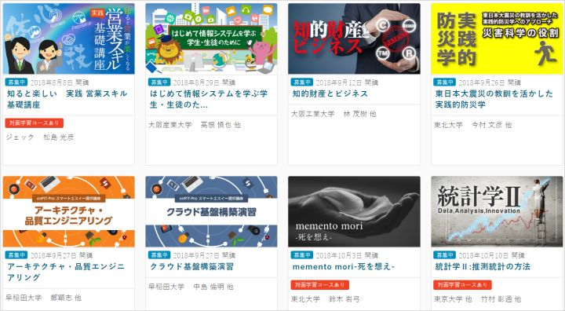


3）[edX](https://link.zhihu.com/?target=https%3A//www.edx.org/course)：美国麻省理工和哈佛大学联手创建的非盈利MOOC网站。课程覆盖领域非常广泛。| 网站课程基本都可以免费听，不过授课方式以英文为主。 

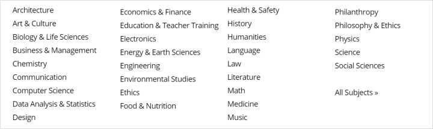


4）[Open2study](https://link.zhihu.com/?target=https%3A//www.open2study.com/)：澳洲线上大学(OUA)设立的实务类MOOC平台。课程多属为期四周的入门型课程，偏向艺术人文、行销广告、健康医学等课程，注重学生交流。| 课程免费，英文授课。 

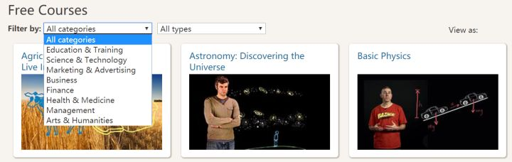


5）[Futurelearn](https://link.zhihu.com/?target=https%3A//www.futurelearn.com/courses/categories)：英国高校创办的具备社交性质的MOOC平台。Futurelearn=普通MOOC平台+Facebook。| 官方鉴定课程永久完全免费，不过拿证书时付费。英文授课方式。 

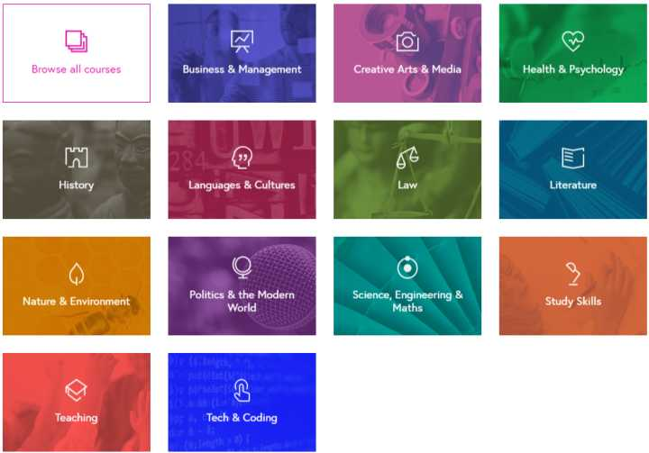


6）[可汗学院](https://link.zhihu.com/?target=https%3A//zh.khanacademy.org/)：孟加拉裔美国人创办的覆盖多年龄段的非营利学习网站。 | 网站课程都免费听，学完就跑没有作业（严格来说不算是MOOC网站）。英文影片为主，有部分中文课程。 

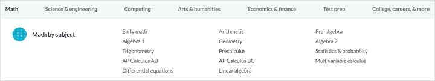


7）[FUN MOOC](https://link.zhihu.com/?target=https%3A//fr.hujiang.com/new/p1166104/)：法国多达90+高校参与的在线MOOC平台。课程涉及学科多达30个+，主要面向高等教育阶段学生。| 可以免费上课，主要法语授课。 

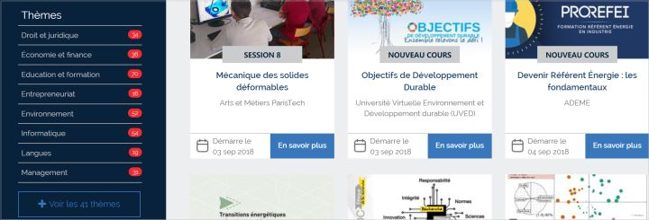


8）[Udacity](https://link.zhihu.com/?target=https%3A//cn.udacity.com/courses/all)： 来自美国硅谷的偏盈利性质、偏高新技术领域的英文授课网站，课程主要偏技术领域，不多但精品，通过后有职业[网站](https://link.zhihu.com/?target=https%3A//www.jiandaoyun.com/r/5b611c463bd7ff48acc415f0)。| 部分课程免费，英文授课。 

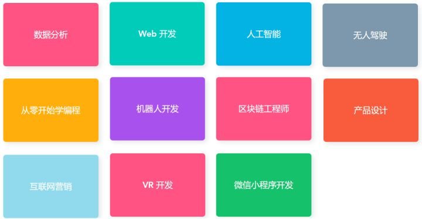


—网站类型较常见的8个国外MOOC网站。

—另外在☞【[学习网站大全](https://link.zhihu.com/?target=https%3A//www.jiandaoyun.com/dash/5b67ee977c2061035127142e)】☜还多整理了50+国外MOOC网站，筛选关键词为“国外MOOC”。

------

## 三、专业技能提升类网站


## **1）语言学习：**


[busuu](https://link.zhihu.com/?target=https%3A//www.busuu.com/zh)：提供12类语言的学习，免费版功能受限，只能进行抽词卡，高级功能解锁需要付费 

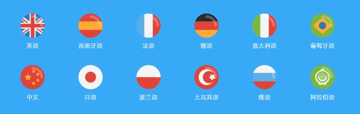


[多邻国](https://link.zhihu.com/?target=http%3A//www.duolingo.cn/register)：一个永久免费的学习外语的平台，中文语言状态下只能学英语和西班牙语，英语状态下可以学几十类语言（需梯子） 


[ChinaVOA](https://link.zhihu.com/?target=https%3A//www.chinavoa.com/)：免费的VOA网站学习/下载网站 


[英语魔方秀](https://link.zhihu.com/?target=http%3A//www.mofunenglish.com/index.php%3Fact%3Dcourse)：网站类型影/演讲/动画免费学习英语的网站 


— 另外在☞【[学习网站大全](https://link.zhihu.com/?target=https%3A//www.jiandaoyun.com/dash/5b67ee977c2061035127142e)】☜还多整理了8个语言学习网站，筛选关键词为“语言学习”。

------

## **2）编程相关：**


[w3school](https://link.zhihu.com/?target=http%3A//www.w3school.com.cn/)：带实际操作的免费编程学习网站 


[CodeCademy](https://link.zhihu.com/?target=https%3A//www.codecademy.com/)：免费学习编程的国外网站（英语） 


[春秋](https://link.zhihu.com/?target=https%3A//www.ichunqiu.com/courses)：学习信息安全知识的国内网站，部分课程免费 


[极客学院](https://link.zhihu.com/?target=http%3A//www.jikexueyuan.com/)：覆盖范围比较广的计算机学习平台，有部分免费课 


[博学谷](https://link.zhihu.com/?target=https%3A//www.boxuegu.com/course/free/)：包含不少实战的编程相关知识学习网站 


[网易编程学习专题](https://link.zhihu.com/?target=http%3A//study.163.com/curricula/cs.htm)：从大一到大四的课程结构 


[慕课网](https://link.zhihu.com/?target=http%3A//www.imooc.com/course/list)：国内垂直的互联网IT技能学习网站 


[FreeCodeCamp](https://link.zhihu.com/?target=https%3A//freecodecamp.cn/home)：闯关式的编程学习网站 


— 另外在☞【[学习网站大全](https://link.zhihu.com/?target=https%3A//www.jiandaoyun.com/dash/5b67ee977c2061035127142e)】☜还多整理了9个编程学习网站，筛选关键词为“编程相关”。

------

## **3）艺术相关：**


[优设](https://link.zhihu.com/?target=https%3A//www.uisdc.com/)：为设计师打造的网站，网站提供的[设计](https://link.zhihu.com/?target=https%3A//hao.uisdc.com/)/[图书](https://link.zhihu.com/?target=https%3A//hao.uisdc.com/book/)/[电商](https://link.zhihu.com/?target=https%3A//hao.uisdc.com/shop/)导航、以及[教程](https://link.zhihu.com/?target=https%3A//uiiiuiii.com/ranking)都比较酷。 


[高高手](https://link.zhihu.com/?target=http%3A//www.gogoup.com/course/list%3Fname%3D%26type%3D%26cate%3D%26subCate%3D%26diff%3D%26soft%3D%26ordType%3D%26isFree%3D2)：摄影/绘画/设计/动画学习网站，部分课程免费。 


[好知网](https://link.zhihu.com/?target=http%3A//www.howzhi.com/channel/music-school%3Ffliter%5Bcategorycode%5D%3Dvocal-music%26orderBy%5B0%5D%3DcomplexSequenceDiffer%26orderBy%5B1%5D%3DDESC)：课程不多、胜在小众的一个网站，部分课程免费。 


[原画梦](https://link.zhihu.com/?target=https%3A//mp.weixin.qq.com/s/AE_BzKh9nvapO1APK5xs_w)：面向新手的手绘/原画学习平台，公众号总结了不少有价值的免费学习内容 


[dave conservatoire](https://link.zhihu.com/?target=http%3A//www.daveconservatoire.org/)：各种乐器的免费学习网站 


— 另外在☞【[学习网站大全](https://link.zhihu.com/?target=https%3A//www.jiandaoyun.com/dash/5b67ee977c2061035127142e)】☜还多整理了7个艺术学习网站，筛选关键词为“艺术相关”。

------

## **4）阅读资源：**


[书格](https://link.zhihu.com/?target=https%3A//shuge.org/)：免费的中国古籍图书馆 


[超星读书](https://link.zhihu.com/?target=http%3A//book.chaoxing.com/)：在线免费看书的优秀平台（可下载APP），书籍丰富，阅读体验不错。 


[Project Gutenberg](https://link.zhihu.com/?target=http%3A//www.gutenberg.org/)：国外知名的电子书免费分享网站 


[Planet eBook](https://link.zhihu.com/?target=https%3A//www.planetebook.com/)：外文古典网站免费下载网站 


[bookbo](https://link.zhihu.com/?target=https%3A//bookboon.com/en)网站类型书籍免费下载的网站，书籍比较丰富 


— 另外在☞【[学习网站大全](https://link.zhihu.com/?target=https%3A//www.jiandaoyun.com/dash/5b67ee977c2061035127142e)】☜还多整理了5个阅读资源网站，筛选关键词为“阅读资源”。

------

## **5）学术研究：**


[国家期刊库](https://link.zhihu.com/?target=http%3A//www.nssd.org/about.aspx%3Fid%3D7)：中国社会科学院承建的哲学社会科学信息平台，免费阅读。 


[学术网站大全](https://link.zhihu.com/?target=http%3A//dir.cnki.net/index.aspx)：找各种论文资料的导航网站，很全面。 


[考研帮](https://link.zhihu.com/?target=http%3A//download.kaoyan.com/)：一个比较全面、免费的考研资料下载中心[网站](https://link.zhihu.com/?target=https%3A//www.jiandaoyun.com/r/5b611c463bd7ff48acc415f0) 


[DART-Europe](https://link.zhihu.com/?target=http%3A//www.dart-europe.eu/basic-search.php)：2网站类型家的学术论文搜索库，可以免费获取 


鉴于篇幅原因，没有把145个网站全放出来，大家可以自己在汇总表☞【[学习网站大全](https://link.zhihu.com/?target=https%3A//www.jiandaoyun.com/dash/5b67ee977c2061035127142e)】☜里查询适合自己的。


---既然看到这里了，不如接下去看一下我的走心软文吧-----

如果你有日常信息/数据录入、数据分析、报表制作的需求，可以尝试将excel数据导入简道云，可多种类筛选、处理，自动生成报表，掌握办公之道。

建议先试免费版：[简道云](https://link.zhihu.com/?target=https%3A//www.jiandaoyun.com/index/price/)


OOOOOver.

以上为原创整理内容，如需转载，请注明来源~