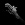

首发于[少数派](https://zhuanlan.zhihu.com/sspaime)

# 关注 bilibili 这 13 个专业 UP 主，你甚至可以在 B 站「干正事」

[少数派](https://www.zhihu.com/org/shao-shu-pai-46)

已认证的官方帐号

[Snape](https://www.zhihu.com/people/123-90-65-86)

、

[卟是我](https://www.zhihu.com/people/pepe-randal)

、

[贝路](https://www.zhihu.com/people/para)

等 

提起哔哩哔哩，你首先想到的或许是番剧和鬼畜。其实，除此之外，B 站还活跃着一群无私有爱的 UP 主，为我们传授各方面的专业知识。在本文中，我就为大家收集了 13 位乐为人师的 UP 主，希望能对你有所帮助。

## 3Blue1Brown

对不少理工科学生来说，数学都是噩梦一般的存在。从线代到离散，从高数到数分，每一科都要耗费大量的时间和精力，让人想怒摔课本。为了人类的未来发展，[3Blue1Brown](https://link.zhihu.com/?target=https%3A//space.bilibili.com/88461692) 决心用动画讲述数学专业知识，其视频涵盖了线性代数、微积分、拓扑学等领域，每门课都配有直观生动的动画演示，帮助观众加深对数学概念定理的理解。

3Blue1Brown 原作者毕业于斯坦福大学数学系，并在 Khan Academy 担任过数学讲师，专业性有所保障。如果你上网方式比较科学，也可以关注其 [YouTube 账号](https://link.zhihu.com/?target=https%3A//www.youtube.com/c/3blue1brown)，第一时间掌握其动态。

## 李永乐老师官方

如果你还是高中生，不妨关注 [李永乐老师官方](https://link.zhihu.com/?target=https%3A//space.bilibili.com/9458053) 这个 B 站账号。他任职于人大附中，取得了北京大学双学士学位，在物理和数学两大学科领域都颇有造诣。除了高中数学讲座外，他还会结合时事热点，推出《流浪地球》科普、金庸武侠的科学解释等视频，幽默风趣，寓教于乐。

## 田浅浅

[田浅浅](https://link.zhihu.com/?target=https%3A//space.bilibili.com/8695736) 是一位人大本科生，高考排名全省前百，她的学习经验对文科生来说大有裨益。在她的个人投稿中，你可以找到文综答题技巧、练字方法、高效笔记术、期末复习技巧等，凝聚了一枚学霸的心血。

## 蜡笔和小勋

[蜡笔和小勋](https://link.zhihu.com/?target=https%3A//space.bilibili.com/250111460) 是一对浙大毕业的情侣，他俩上传的视频，除了狂撒狗粮外，就是自己学习的经验之谈了，例如提高记忆效率、自律和自制力、对付拖延症等。如果你想提高自己的成绩排名，看他们的视频准没错。

## 潘子Jane

[潘子Jane](https://link.zhihu.com/?target=https%3A//space.bilibili.com/14264313) 是一位清华大学在读研究生，她的 B 站账号为我们分享了诸多生活技巧和个人感悟，如学生党如何月入过万、快速背单词方法、考研历程分享等，都是过来人的经验之谈。此外，你也可以借她的视频窥见清华学生的日常生活，激励自己进取前行。

## FanfaniShare

[FanfaniShare](https://link.zhihu.com/?target=https%3A//space.bilibili.com/346396741) 是一位在美国高校教英文的中国女孩，她 TESOL 硕士全 A 毕业，在国内教过雅思口语和新概念课程，水平与母语者不相上下。你可以借助她的投稿视频练习英式口语、雅思写作、单词记忆等，并纠正错误的发音习惯，面对歪果仁也不怯场。

## 小圆脸Paprika

读书破万卷，下笔如有神，这句诗人人皆知，却非人人都能做到。如果你正面临不知看何书、又如何看书的困境，[小圆脸Paprika](https://link.zhihu.com/?target=https%3A//space.bilibili.com/239854589) 就可以帮到你。她会为我们定期分享最近出版的好书、个人读书的感触等，伴你一路前行。

## oeasy

如果你想涉足设计领域，关注 [oeasy](https://link.zhihu.com/?target=https%3A//space.bilibili.com/2884629) 可以避免走许多弯路。作为中国传媒大学的计算机教师，他可谓是这一领域的全才，出品了 Photoshop、Illustrator、Office、视频编辑、动画制作乃至编程入门等教程，内容翔实易懂，广受好评，带你从零开始，成为大神。

## doyoudo

[doyoudo](https://link.zhihu.com/?target=https%3A//space.bilibili.com/20503549) 同样是一位设计教程分享 UP 主，不过其更侧重于技术在具体生活场景中的应用，如用 C4D 制作猫爪杯模型、用 Photoshop 制作表情包、用 Audition 制作鬼畜音频等，选题十分有趣，小白也能轻松跟上节奏。

## 影视飓风

随着智能手机的普及和人们对生活追求的提高，Vlog 这一表现形式受到了越来越多人的欢迎。如果你想拍摄属于自己的 Vlog，又不知从何下手，[影视飓风](https://link.zhihu.com/?target=https%3A//space.bilibili.com/946974) 或许能帮上忙。它的视频涵盖了 Vlog 制作的方方面面，从拍摄前期的准备工作到拍摄过程中的布光技巧，乃至后期剪辑等专业知识，深入浅出。

## 左手plus

拍照人人都会，手机一举，快门咔嚓，就大功告成了。但想拍出一张好照片，却并不那么简单，如果你内心深处有一个摄影梦，关注 [左手plus](https://link.zhihu.com/?target=https%3A//space.bilibili.com/20166755) 准没错。你可以从他的视频中学到鲜为人知的摄影技巧、摄影器材选购知识、照片后期处理流程等，再也不怕给妹子拍照后被踹了。

## Free从容

如果你想学一门乐器，吉他可以说是性价比最高的选择之一：价格实惠、易于上手、在聚会上小露一手还能收获喝彩无数。如果你的公司年会在即，不妨关注 [Free从容](https://link.zhihu.com/?target=https%3A//space.bilibili.com/35289501) 的 B 站账号，突击学习吉他的弹奏方法，成为全公司最靓的仔。

## 少数派sspai

[少数派sspai](https://link.zhihu.com/?target=https%3A//space.bilibili.com/176321970) 是国际知名科技媒体我派本派（本句收费五毛）的 B 站官方账号，专注于提高你的数字生活效率。在目前投稿的视频中，你可以了解 Windows 美化技巧、捷径使用指南、隐私保护秘笈、新鲜科技产品评测等，推荐大家关注。

发布于 2019-05-10

哔哩哔哩

学习

### 文章被以下专栏收录

- 

- ## [少数派](https://zhuanlan.zhihu.com/sspaime)

- 少数派帮你更好地运用数字产品，提升你的工作效率和生活品质。

- 

### 推荐阅读

# 10个好用到哭的黑科技App，一次性全部给你

木子淇

# 网盘不限速下载，无限制上传，从此和百度网盘说再见！

每日优质搜...发表于每日优质搜...

# 为什么费曼技巧被称为终极学习法

YJango

# 【央视力挺】B站上那些值得学习的课程推荐

前几天，一则消息在微博传播开来：『央视网力挺B站』，去年有近2000万人在B站学习。由此可见，B站上优质而数量繁多的学习资源已经获得了众多用户的信赖。记得去年的一段时间，小编也做了很…

初记发表于知识杂货铺

## 397 条评论

写下你的评论...

精选评论（3）

- 

  [ykcawar3](https://www.zhihu.com/people/ykcawar3)

  29 天前

  然而，打开B站那一刻，系统里的推送，就注定让你无法学习。。。

  

[Eric卿](https://www.zhihu.com/people/EricQing-sh)

29 天前

我 夸 我 自 己 [思考]

- 

  [彼铭](https://www.zhihu.com/people/biming-org)

  回复

  [ykcawar3](https://www.zhihu.com/people/ykcawar3)

  28 天前

  傻刁视频：你以为你能逃脱我的魔爪吗？

  

评论（397）

- 

  [ykcawar3](https://www.zhihu.com/people/ykcawar3)

  29 天前

  然而，打开B站那一刻，系统里的推送，就注定让你无法学习。。。

  

[冬之日夏之夜](https://www.zhihu.com/people/dong-zhi-ri-xia-zhi-ye)

回复

[ykcawar3](https://www.zhihu.com/people/ykcawar3)

29 天前

哈哈哈哈哈哈是我了

[彼铭](https://www.zhihu.com/people/biming-org)

回复

[ykcawar3](https://www.zhihu.com/people/ykcawar3)

28 天前

傻刁视频：你以为你能逃脱我的魔爪吗？

[Eric卿](https://www.zhihu.com/people/EricQing-sh)

29 天前

我 夸 我 自 己 [思考]

[呵子](https://www.zhihu.com/people/he-zi-2-1)

回复

[Eric卿](https://www.zhihu.com/people/EricQing-sh)

26 天前

你 打 字 带 空 格

[Try](https://www.zhihu.com/people/try-21-87)

回复

[呵子](https://www.zhihu.com/people/he-zi-2-1)

24 天前

野     蛮      ！！！！

[Goooler](https://www.zhihu.com/people/wangzongle-Googler)

29 天前

doyoudo 好评，他家的教程废话少思路清晰

[小仙女的小迷弟](https://www.zhihu.com/people/xiao-xian-nu-de-xiao-mi-di-78)

回复

[Goooler](https://www.zhihu.com/people/wangzongle-Googler)

24 天前

小白声音好听，尤其笑的时候

[K-anti](https://www.zhihu.com/people/ngss-40)

29 天前

夹 带 私 货[看看你]

[少数派](https://www.zhihu.com/org/shao-shu-pai-46)

 (作者) 

回复

[K-anti](https://www.zhihu.com/people/ngss-40)

16 天前

正 直 派

[Excalibur](https://www.zhihu.com/people/li-hua-wei-76-24)

29 天前

又有小盆友问我

[赵瑞丰](https://www.zhihu.com/people/zhao-rui-feng-11-79)

回复

[Excalibur](https://www.zhihu.com/people/li-hua-wei-76-24)

21 天前

两开花

[流地灬浪球](https://www.zhihu.com/people/yao-yan-si-zhi-yu-zhi-zhe)

回复

[Excalibur](https://www.zhihu.com/people/li-hua-wei-76-24)

21 天前

无中生友

[喵小萌](https://www.zhihu.com/people/miao-xiao-meng-69)

29 天前

看成了window美妆技巧的我……

[AnaBit](https://www.zhihu.com/people/AanBit)

29 天前

怎么木有妈咪说

[长岛没有雪](https://www.zhihu.com/people/chang-dao-mei-you-xue-37)

回复

[AnaBit](https://www.zhihu.com/people/AanBit)

28 天前

这是一个母婴up主

[飞鸿踏雪](https://www.zhihu.com/people/kong-shi-chen)

回复

[AnaBit](https://www.zhihu.com/people/AanBit)

26 天前

母婴up主不配有姓名[思考][思考][思考]

[Change](https://www.zhihu.com/people/change-16-54-15)

28 天前

呃。。。。还有尚硅谷

[oxidationreduction](https://www.zhihu.com/people/oxidationreduction)

28 天前

共青团中央呢？

[正正正正正正正正](https://www.zhihu.com/people/jiu-yue-bing-de-xiao-zheng)

回复

[oxidationreduction](https://www.zhihu.com/people/oxidationreduction)

27 天前

团团发的东西太杂了[捂脸]，啥都发

[雪羽](https://www.zhihu.com/people/xue-yu-63-86)

回复

[正正正正正正正正](https://www.zhihu.com/people/jiu-yue-bing-de-xiao-zheng)

18 天前

我在b站看了好几天新闻联播了[捂脸]

[也只是个普通人](https://www.zhihu.com/people/li-qi-16-45-71)

28 天前

蟹蟹

[Mr.S](https://www.zhihu.com/people/mrs-hello)

28 天前

竟有此等宝物？多谢！

[Steve Liu](https://www.zhihu.com/people/chen-liu-10-54)

28 天前

啊啊啊3b1b终于有名了

[0000000](https://www.zhihu.com/people/0101010101)

28 天前

上网的方式比较科学………

[玉琢器](https://www.zhihu.com/people/yu-zhuo-qi)

27 天前

B站真的还是良心了，希望他们能保持现在的水准。。。哦，对了，里面还有些阅读代码源码之类的视频，挺好的。。

[咔酱的男朋友](https://www.zhihu.com/people/xiang-yi-1-25)

回复

[玉琢器](https://www.zhihu.com/people/yu-zhuo-qi)

25 天前

没看到过诶[捂脸]有推荐的up主吗

[玉琢器](https://www.zhihu.com/people/yu-zhuo-qi)

回复

[咔酱的男朋友](https://www.zhihu.com/people/xiang-yi-1-25)

25 天前

不需要啊，带上关键字去搜索就是了。很多都是一些网络课程的录制视频。。

[欲归隐](https://www.zhihu.com/people/wei-liang-tu-mou-yi-6-98)

27 天前

提名彭酱

[南狸追](https://www.zhihu.com/people/jia-ru-qin)

27 天前

第一个就是3b1b啊啊啊啊啊啊啊啊啊！话说我把他所有的视频都下载了但是两个月过去了一般都没有看见

[陈珺弘](https://www.zhihu.com/people/chen-jun-hong-2-54)

27 天前

提一手，妈咪说的母婴早教（逃）