##                                                                             文科生都能看得懂的贝叶斯定理，从白袜到飞机失事再到人工智能                       

​                                                                                                                                                                                                  [                         无界社区mixlab      ](javascript:void(0);)   *1周前*         文章转载自公众号           

https://mp.weixin.qq.com/s?__biz=MzA3MDgyMjMwMA==&mid=2649936204&idx=1&sn=7d9cf89e340fdb3eff2857f462eab44b&chksm=873081bfb04708a91410ed767bd73cbea6ac7c540cfff4d1cefc16f8886e57185feecf0935d3&mpshare=1&scene=1&srcid=&sharer_sharetime=1564634166988&sharer_shareid=e835def113a49a3f8c77a728e59ba9a9#rd     


​                                                                                                                  PM熊叔                                         ，                                            作者                                            PM熊叔                                                                                

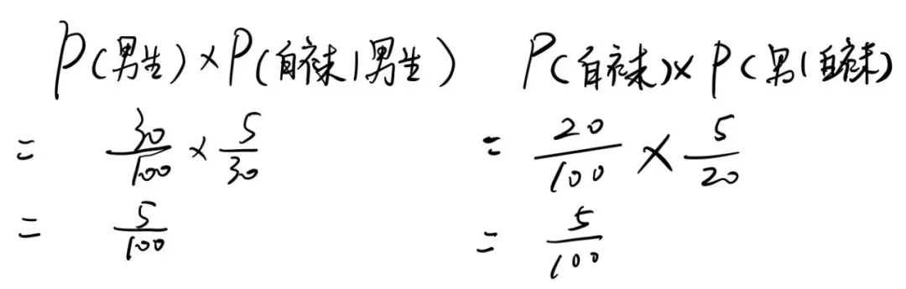


人类很多时候的决策，也都是基于对于事物的预测。比如，“出门要不要带雨伞？”解答这个问题需要查天气预报。人类为了预测天气，古时用的是夜观星象，月亮长毛必有雨。而今天用的是统计预测和经验预测方法。但气象局天气预报也经常会发生不准的情况。佛系的说，世界上本没有绝对的东西，我们算的只是个概率。


在概率领域有一个很重要的学派——贝叶斯学派。其核心是贝叶斯定理，由英国数学家贝叶斯 ( Thomas Bayes 1702-1761 ) 发明的。贝叶斯当时的论文只是对“逆概率”这个问题的一个直接的求解尝试，这哥们当时并不清楚这里面这里面包含着的深刻思想。


贝叶斯学派认为世界是不确定的，人们对世界先有一个预判，而后通过观测数据对这个预判做调整。因为这种方式过于主观，导致贝叶斯学派不受待见，被概率的另外一个“频率学派”所鄙视。频率学派认为事物发生的频率应该是客观的。

### 通过经验

贝叶斯代理论是对事物发生的“可能性”的推理，并不需要这件事情发生后再测量。例如，某地可能发生地震的概率为3%，它的推断源自于观测了地震波、气象、鸡飞狗跳等现象。这种方式区别于“频率学派”抛硬币的测量方式，我们不可能测了100次，结果发生了3次地震。


贝叶斯理论上去更像一个哲学问题。**他告诉人们，我们通过经验是可以推断出事物是否发生的相信程度。**这笛卡尔的“我思故我在”哲学问题相似，将艰难的看似不可测的问题，变成简单的可以测的问题！

 

# **一、对贝叶斯公式的简单理解**


**如上图，有A、B两个事件集合，已知事件A发生的概率为P(A)，事件B发生的概率为P(B)，既满足A又满足B的时间集合是A∩B，概率为P(A∩B) （也可以写成P(A,B)或P(AB)）。**

### 边缘概率

相对联合概率P(A∩B)来说，P(A)和P(B)被称为**边缘概率**，意思这个事件**仅代表自己，而与其它事件无关**。


### 条件概率

如上图，如果我们只看集合A，在A又符合B概率是P(B|A)，简单的说就是在A中找B，因为有**A发生作为前提条件**，所以被称为**条件概率**。（注意：**“|”后面的A是前提条件**，有点像分数“B/A”，**“/”后面代表的是分母**）


**P(A∩B)的样本总体是A∪B，意思在全的样本中，考虑AB都满足的概率事件，简单的说就是A和B里面找AB都有的。**


如上图，不论是P(B|A)还是P(A∩B)从集合的角度看都是A∩B，只是一个总体样本范围大小不同。


如果P(A)、P(B)、P(B|A)是**已知的**，那我们称之为**先验概率**；

如果P(A|B)是未知的，需要我们计算推导而出，我们称之为**后验概率。**


有以下的简化的贝叶斯公式：


用文字表述就是，**在B出现的前提条件下A出现的概率，等于A和B都出现的概率除以B出现概率。**


**但为什么要“A和B都出现的概率除以B出现概率”？**


上面提到过，P(A|B)是以B发生作为前提条件，也就是说我们要在B的样本空间中计算A∩B发生的概率。所以分子是A∩B，分母是B：


# **二、举个形象的例子**【白袜子】


上面的讲得有点抽象，举个例子：

**假设：小学⼀年级有共100⼈，其中有男⽣生30⼈。穿⽩袜⼦的⼈数共有20个，这20个人里面有5个是男⽣。**


- 
- 

```
1. 男生的概率 P(男生)= 男生数/总人数 = 30/100;
2. 穿白袜的概率 P(白袜) = 穿白袜人数/总人数 = 20/100 ;
```

### 不同的视角

如果我们只研究穿白袜的男生的概率，我们会以下三个不同的视角：


- 
- 
- 

```js
A：以30个男生作为总体样本，P(白袜|男生)= 穿白袜男生数/男生数=5/30;
B：以20个穿白袜的学生作为总体样本，P(男生|白袜)=穿白袜男生数/穿白袜学生=5/20；
C：以一年级学生作为总体样本，P(白袜∩男生)= 穿白袜的男生数/总人数 = 5/100;
```

因为穿白袜子的男生始终还是那5个人，只是总体样本不同导致的分母不同，

### 总体样本不同导致的分母不同

如果要让三个数值相等那么“参考系”就要保持统一。我们选取一年级全体学生作为**总体样本。**如下图：


假设我们不知道C的计算结果，我们从**视角A或者视角B**，重新推导在一年级总体样本中，“找出”穿白袜的概率：


如上图，如紫色箭头所示，有两种方式：

视角A：先找出男生再找出穿白袜者，P(男生)P(白袜|男生)；

视角B：先找出穿白袜的人再找出男生，P(白袜)P(男生|白袜)；


### 通过概率相乘的方式，统一了“参考系”

通过计算发现A和B的结果和C是相等的：


对于这个结果也并不意外，因为通过概率相乘的方式，统一了“参考系”，所以就有以下关系

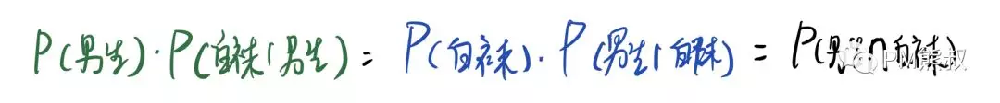


### 移项!!!!


通过移项则可以获得下面式子：

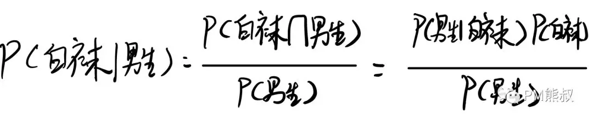


也就是说，贝叶斯公式有如下关系：

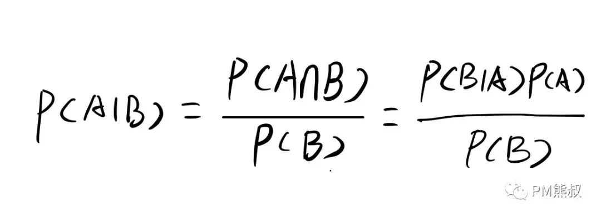

因此，我们只要知道先验概率 P(B|A)、P(A)和P(B)就可以求出P(A|B)。


# **二、全概率公式**

还是举小学校的例子：

**已知男生穿白袜的概率P(白袜|男生)为1/6，P(白袜|女生)的概率为3/14。某个小学有一年学生100人，男生30人，女生70人，求这一年级学生穿白袜的概率P(白袜)。

为了更好的理解，我们把之前的图在视觉上做一下调整，如下面右边图所示：

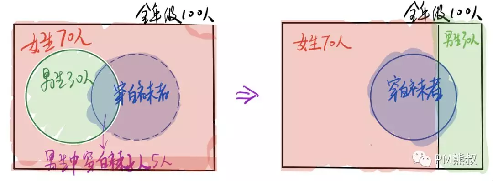


通过上图我们可以很直观的看出，穿白袜的学生可以分成女生和男生，那么我只要分别计算一年级的男生和女生穿白袜的概率，再将他们相加，就可以达到目的。

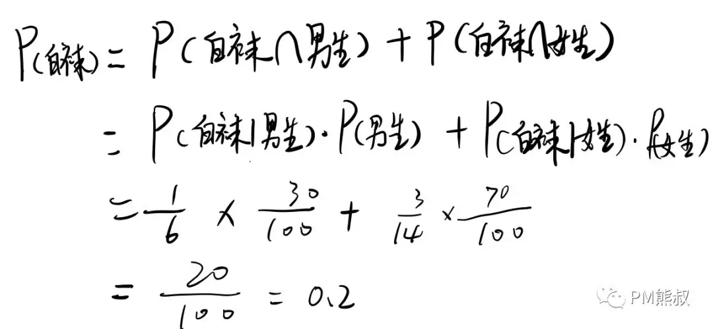


**那如果再复杂一点呢？**

**假设这是家国际学校，我们不按照性别划分，按照国籍划分。**


**某小学是国际学校，一年级的100位学生中，有来自中国、美国、英国等国。这些将这些学生按照国籍分成n组，得到一个学生国籍的集合A{A1,  A2,  A3...An}，每个国籍An所代表的人数都不尽相同。已知不同国籍的学生穿白袜的概率P(白袜|A1)，P(白袜|A2)……P(白袜|An)。求这个国际学校一年级穿白袜的学生P(白袜)。**


国籍和穿白袜学生的关系如下图：

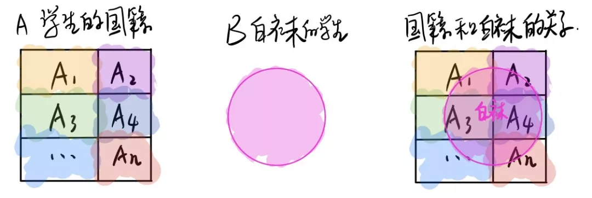

 

和上面的案例类似，我们只要分别计算不同国籍学生穿白袜的概率，然后进行求和即可。如下图：

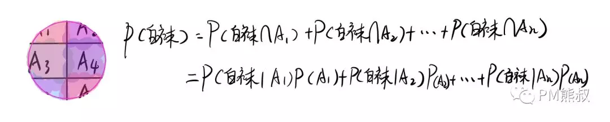


### 概率集合，拆分成每一小块

也就是说，我们将一个较大的概率集合，拆分成每一小块分别计算，然后再求和。这个解题思路就是**全概率公式**。


> **全概率公式**将对一个复杂事件的概率求解问题转化为了在不同情况下发生的简单事件的概率的求和问题。
>
> 内如果事件A1、A2、A3…An 构成一个完备事件组，即它们两两互不相容，其和为全集；
>
> 并且P（Ai)大于0，则对任一事件A有：**P(B)=P(B|A1)P(A1) + P(B|A2)P(A2) + ... +P(B|An)P(An)**。


 

# **三、完整版的贝叶斯公式**


还是上面国际小学的例子

**假设中国学生穿白袜的概率是0.2，美国学生穿白袜的概率是0.1，英国学生穿白袜的概率是0.5。此一年级的100位学生可以分为中美英三个国籍，中国国籍学生60人，美国国籍学生30人，英国国籍学生10人。求白袜学生中，出现美国学生的概率P(美国|白袜)。**

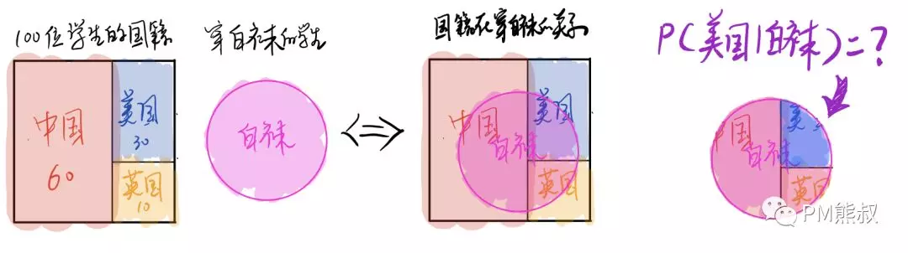

### 拆解到各个国籍

根据**全概率公式**，我们将P(白袜)拆解到各个国籍的穿白袜学生出现的概率，再求和:


```js
P(白袜)=P(美国∩白袜)+P(中国∩白袜)+P(英国∩白袜)      = 
P(白袜|美国)P(美国)+P(白袜|中国)P(中国)+P(白袜|英国)P(英国)
```

所以根据上面式子，可以计算P(美国|白袜)的概率：

```
各国学生概率：P(中国)=0.6; P(美国)=0.3; P(英国)=0.1
```

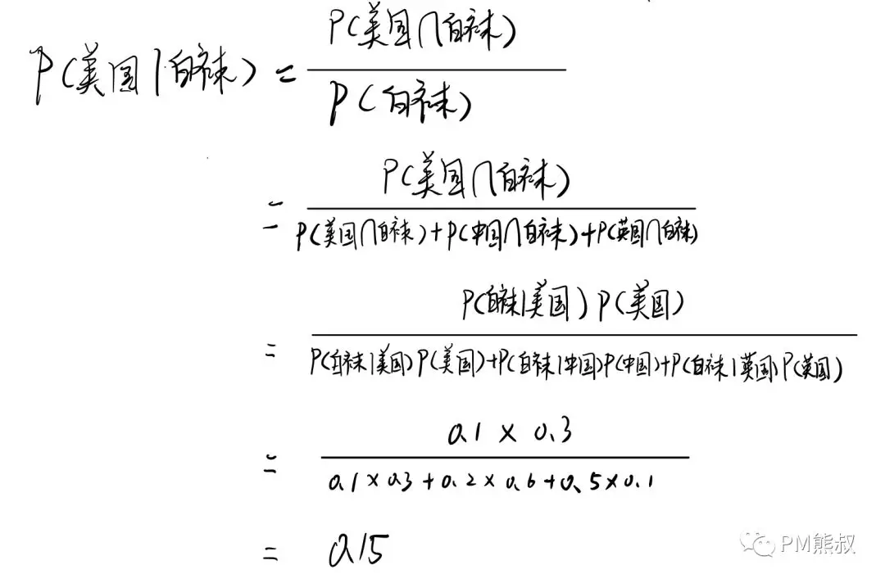

如果，我们把国籍替换成Ai，白袜替换成B，就可以得到完整版的贝叶斯公式了：


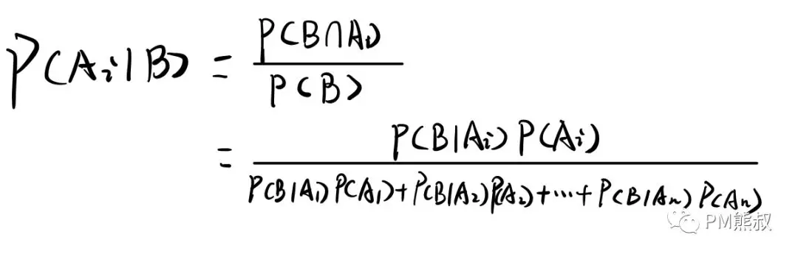

### “∑”表示求和

上面这样写太长了，我们换个写法，用“∑”表示求和：

A:国籍


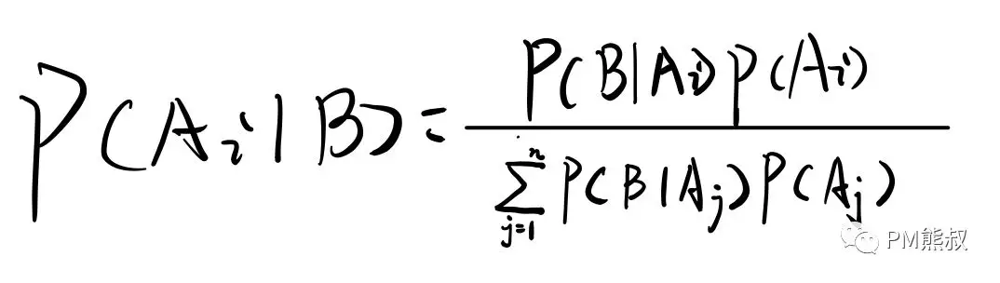

上面这个就是我们的完整的贝叶斯公式了。


# **四、使用贝叶斯公式搜寻失事飞机**

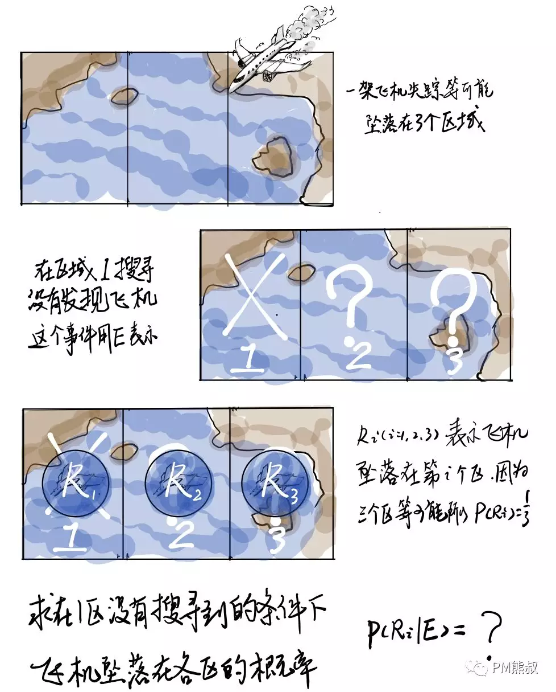


**E**	没有在i区搜到飞机

**β𝑖**	称为忽略概率

如上图，一架飞机失踪了，推测它可能落在3个区域，R𝑖(𝑖=1,2,3)表示飞机坠落**在第𝒊区域**。 

令1-β𝑖 (𝑖=1,2,3)，表示飞机**事实上落**在第𝒊个区域**且被发现的概率**(β𝑖称为忽略概率，

因为它表示忽略飞机的概率，通常由该区域的地理和环境条件决定）。 

已知对于区域1的搜索没有飞机，求在此条件下，飞机坠落在第𝑖(𝑖=1,2,3)个区域的条件概率。


 

因为

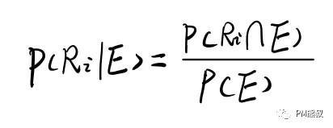

那么我们可以先求P(E)的全概率，在1区没有搜寻到的原因分三种情况:


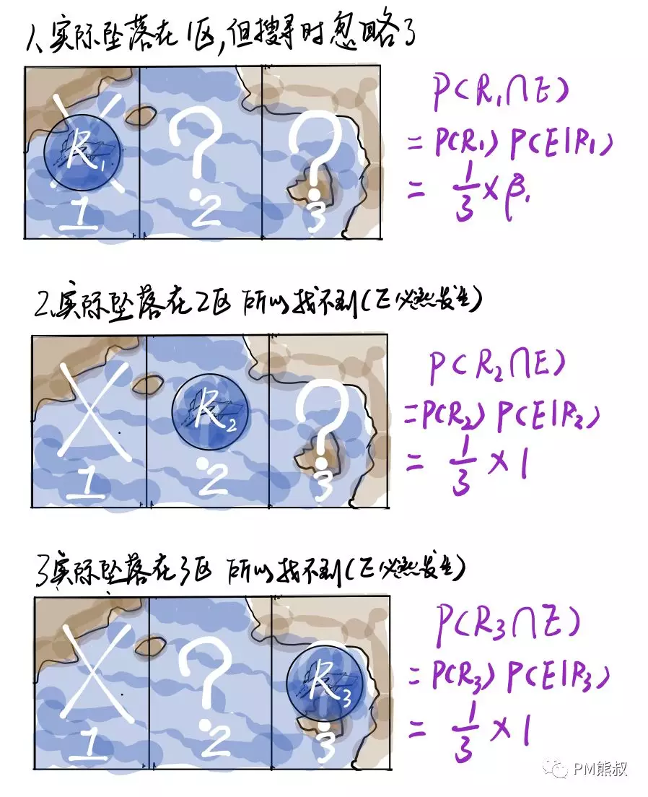


所以P(E)的全概率：


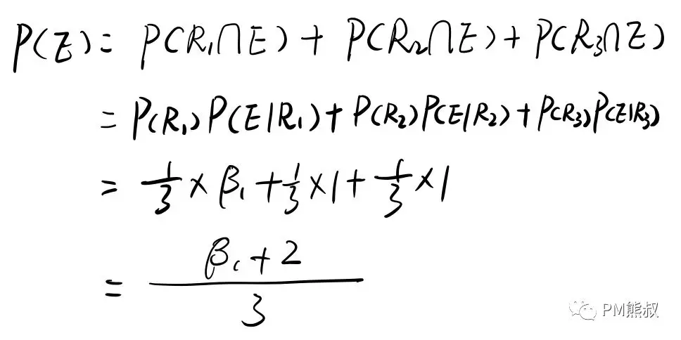

 


因为P(R𝑖 | E)= P(R𝑖∩E)/P(E)，所以：

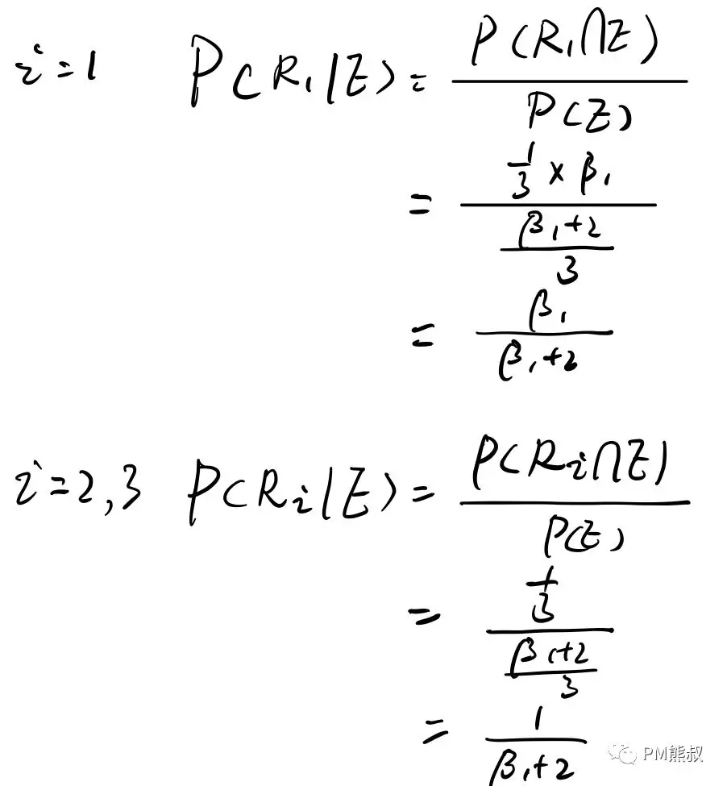

 


> 假设我们二区搜索了还是没有搜到，那在区域3搜索到的概率又是多少呢？这个问题留在下一次解答。

 

# **五、贝叶斯在人工智能上的应用**


经常在网上搜索东西的朋友知道，当你不小心输入一个不存在的单词时，搜索引擎会默认按照正确的词帮你搜索，比如当你在Google中输入“Julw”时，系统会猜测你的意图是搜索“July”。谷歌在墙外，我们暂时百度做为案例（ㄟ( ▔, ▔ )ㄏ），如下图所示：


 

这叫做拼写检查。根据谷歌员工写的一篇文章，拼写检查是基于贝叶斯方法。下面让我们看看如何使用贝叶斯实现"拼写检查"。原文：How to Write a Spelling Corrector


首先我们先要制作一个词典。我们将全网的大量文章收集起来，整理出里面出现过的单词，并标记每个词出现的次数（频数）。这有点像大学考四六级的时候死记硬背的《四六级词汇分频速记手册》。

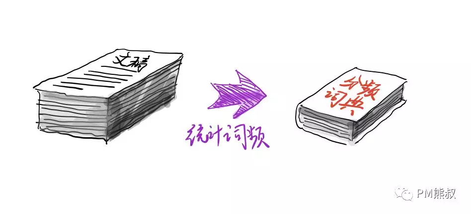用户输入一个单词时，我们先看看用户输入的这个词字是不是在词典里面。如果不存在，那就要找出每个候选词，并且比较他们的符合条件的概率，将概率最大的推荐给用户。如下图所示，用户输入“julw”，程序没有在字典中找到相应的词，但找出了3个候选的正确词。

 


 


- 
- 
- 

```
Judy：朱迪，迪士尼动画明星，词频是1000
July：七月，词频是900
Jula：爱情动作片女明星（百度结果），词频是200
```


从词频上看，Judy出现最多，Jula出现得最少。

那么是不是应该推荐“Judy”这个词给用户呢？显然也是有问题的，我们肉眼可以明显看出“July”与“Julw”的这个词会更加接近。但是如何严谨地判断呢？


我们切换到数学思维，这个问题**本质上就是在用户输入“julw”的条件下，比较每个备选词的出现的概率** ，找出概率最大那个推荐给用户。也就是求**P( 备选词 | Julw )**，这就要用到贝叶斯定理了。


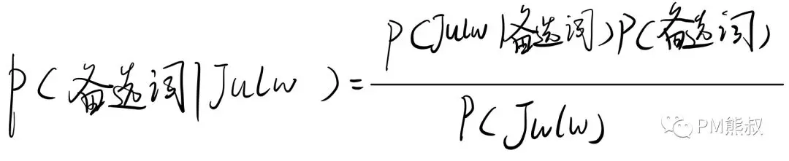

 

每个备选词在词典中概率，可以通过该词的词频除以所有词频来计算，我们用Q代表词频，如下面公式：

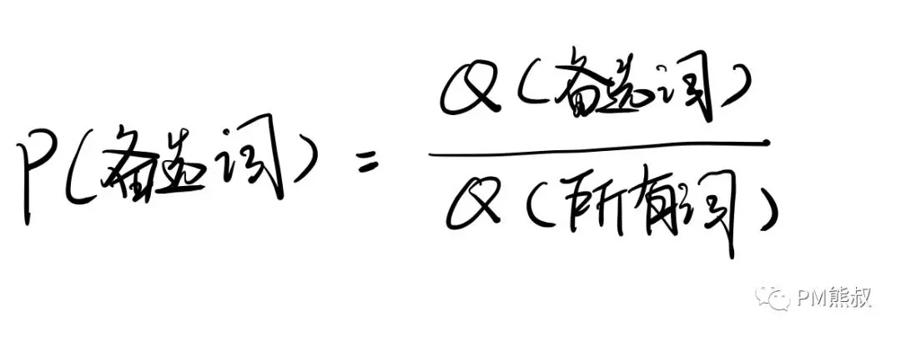


因为用户输入是统一的，词典也是统一的，把式子化简后惊喜地发现，我们只要知道P( 备选词 | Julw )和Q(备选词)就好了。如下图：


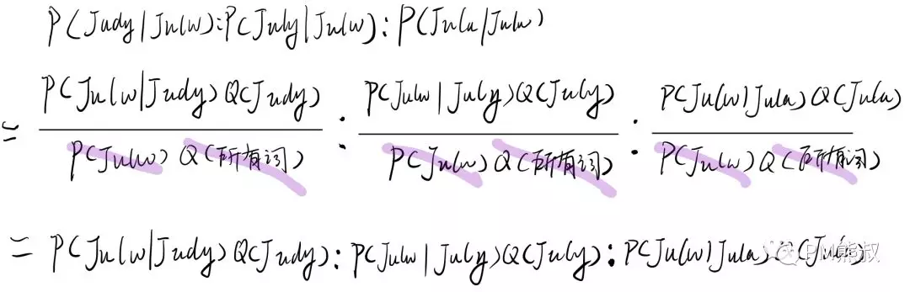

 比较 P( 备选词 | Julw )大小，就转化为比较 "**P( Julw | 备选词 )\*Q(备选词)**"大小问题。

因为**词频**是词典已知的，那现在核心问题就是怎么计算P( Julw | 备选词 )：

 

**1. 计算P( Julw | Judy )**

**Judy 变成要Julw要有两步**，分别把d和y变成l和w：我们可以设想一个抽奖机，拉动开关以后，除自己以外的25个字母随机轮换然后停下。把y变成w的概率为 1/25；同理把d变成l概率也是 1/25。

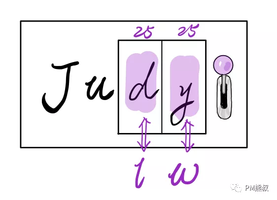


因此 P( Julw | Judy ) = 1/25* 1/25

 

**2.计算P( Julw | July ) 和P( Julw | Jula)**

**July和Jula变成Julw需要一步——**换掉最后一个字母变成w，这步操作的概率为1/25

 

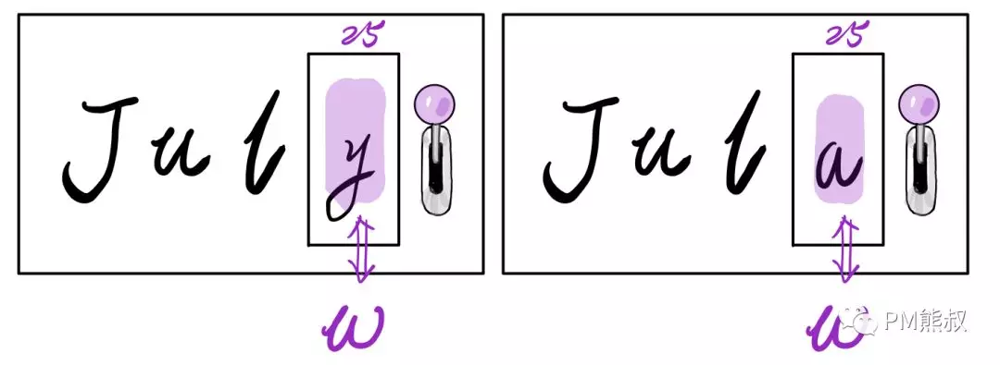

 

P( Julw | July ) = 1/25；P( Julw | Jula ) = 1/25；

> 将备选词转化成用户输入的词的操作步数越多，P( Julw | 备选词 ) 的概率值越低。这个操作步数也可以被称为编辑距离。原作者直接将问题简化为取编辑距离较少的单词，为了理解需要我换成了概率。


终于可以计算最终的结果了：

令，Q( 备选词 | Julw )=P( Julw | 备选词 )*Q(备选词)

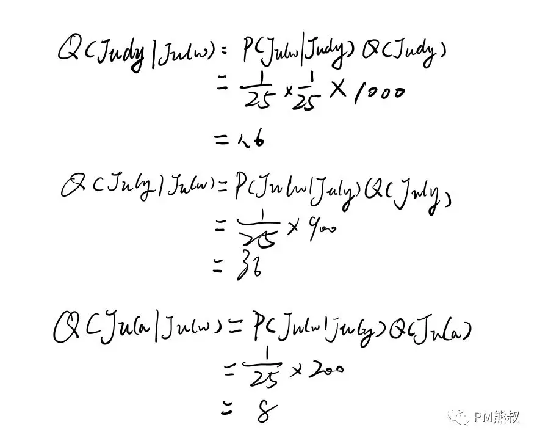

 

我们根据计算结果重新排个序：


 

因此，我们会推荐“July”给用户。但是如果一个用户是宅男，他想搜的很可能就是“Jula”，那这是按照**用户画像**推荐，这个在后续的文章中再聊。

 

# **六、关于贝叶斯定理的总结**


贝叶斯定理是一种思考问题的方式，我们要探寻一个问题发生的可性的时候，很可能无法直接计算。那么我们就要找到前提条件的主要因素，各个击破后再反推结果。


贝叶斯定理虽然主观，但在AI时代通过大数据弥补了不足。不过其最大的BUG还是在于人的认知边界，如果人不能发现问题、分解问题、获得合理的先验概率，那对于预测必然会产生巨大偏差。

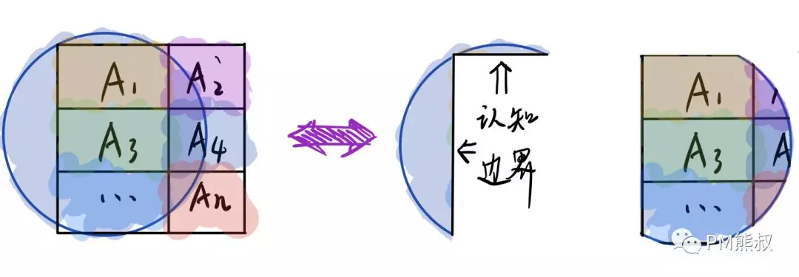


人工智能算法有趣的是用机器模拟人类思考问题的方式。

**很多时候我们的收获不在于了解AI是怎么思考的，而在于了解自己是怎么思考的。**


##### **了解自己是怎么思考**


> 参考文献：
>
> 《概率论基础教程（原书第九版）》美 Sheldon M. Ross等
>
> # 《从贝叶斯方法谈到贝叶斯网络》
>
> 《机器学习极简入门课》李烨
>
> 《How to Write a Spelling Corrector》

我把本文涉及资料已经放在星球上面。

欢迎大家继续订阅我。