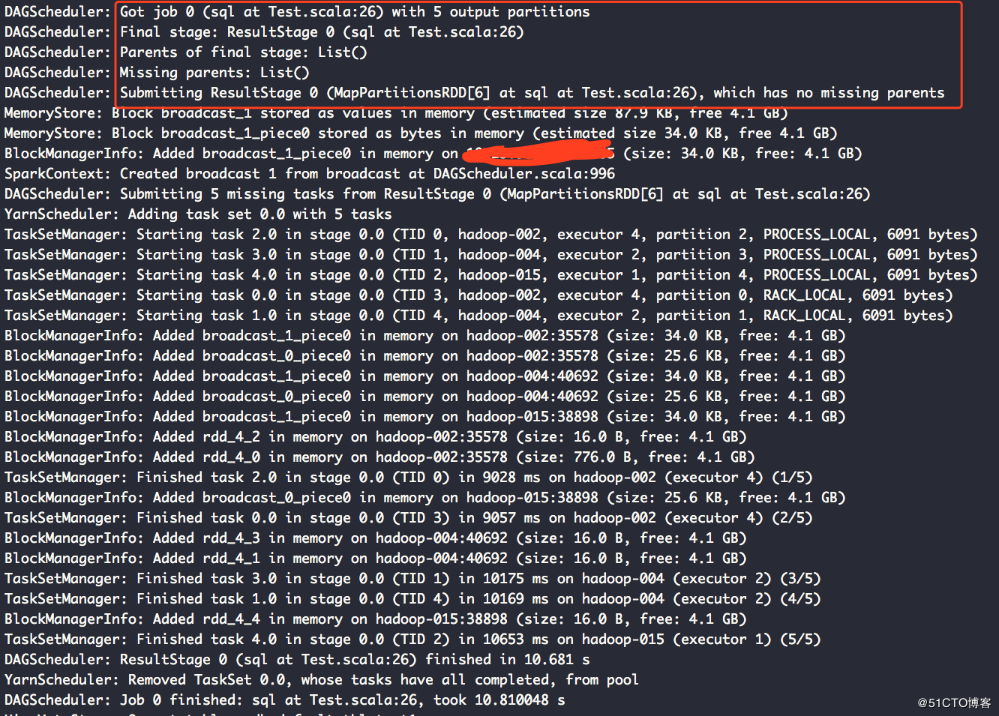
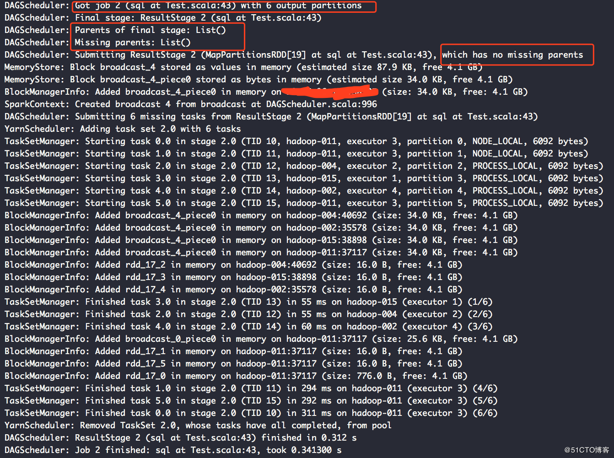

# sparkSQL中cache的若干问题

https://blog.51cto.com/9269309/2141043

## 摘要

sparkSQL在使用cache缓存的时候，有时候缓存可能不起作用，可能会发出缓存是假的吧的感慨。现在我们就把这个问题说道说道。
问题

## 场景描述

当我们通过spark进行统计和处理数据时，发现他是延迟计算的，如果一个应用中出现多个action,而这多个action处理同一个数据源数据时，数据源用时间来过滤数据时，由于有多个action操作，遇到每个action就是一个job，每一个action都会执行数据源获取数据的操作，由于两个action之间的操作存在时间差，这两个action获取的数据有可能不一致。
例如下例
test1表中的数据

1，2018-07-01 10：10：03
2，2018-07-01 11：12：04

代码如下操作

```SPARQL
val odsData = spark.sql("""
select
from default.test1 
where time < "2018-07-02"
""")
val targetData = odsData.map(fun _)
val targetData.createOrReplaceTempView("data1")
```

//第一个Action操作

//第一个Action操作

```SPARQL
val spark.sql("""
insert overwrite table default.test2
*
from data1
""")

val targetData1 = odsData.map(fun2 _)  //引用同一个数据源
targetData1.createOrReplaceTempView("data2")
//第二个action操作
val spark.sql("""
insert  table default.test2
*
from data2
""")
```

 如果在运行第二个Action操作前，test1表中又增加了一条记录3,2018-07-01 13：12：04 即执行第一个Action时记录还是两条1和2，而再执行完第一个Action后而又执行第二个Action之前， 增加了一个新的单子：3,2018-07-01 13：12：04 那么在test2表中的数据是怎么样的呢？ 第一种情况（因为第二个action是insert而不是insert overwrite）

1，2018-07-01 10：10：03
2，2018-07-01 11：12：04
1，2018-07-01 10：10：03
2，2018-07-01 11：12：04

## 第二种情况

1，2018-07-01 10：10：03
2，2018-07-01 11：12：04
1，2018-07-01 10：10：03
2，2018-07-01 11：12：04
3,2018-07-01 13：12：04

## 结果分析

结果是第二中情况。如果认为是第一种情况的对spark的执行计划还是不太熟悉。首先spark是lazy计算的，即不触发action操作，其实不提交作业的。而在这个application中存在两个action，而这两个aciton使用了同一个数据源的rdd，应该称为变量odsData，当遇到第一个action，其会把自己这个执行链上的rdd都执行一遍，包括执行odsData，而遇到第二个aciton的时候，其也会把自己的执行链上的数据又执行了一遍包括odsData，并从数据源中重新取数。有人会疑惑，第一个action在执行的时候，已经执行了odsData，这个RDD的结果不应该缓存起来吗？个人认为，spark还没有那么的智能，并且网上经常说的job，stage，rdd，task的划分应该是在同一个job内进行的。而同一个应用中夸job的stage拆分是不存在的。那么出现这个结果应该怎么办呢？
cache的出场

当出现这样的情况时，我的应用每天就会漏几十条数据，很是烦人，最后发现了上面的问题，当时想解决方案时，第一个就是想到了cache，我把第一次执行Action操作时，把odsData给缓存了，这样应该不会有什么问题了吧。从而可以保证两个action操作，同一个数据源的数据一致性。只能说too  young to sample了。这样解决不了上面出现的问题。同样以一个例子来看。
test表中的数据：

1   2017-01-01 01:00:00 2016-05-04  9999-12-31
2   2017-01-01 02:00:00 2016-01-01  9999-12-31
代码：

val curentData = spark.sql(
"""
|select
|*
|from default.test
""".stripMargin)

curentData.cache() //缓存我们的结果

curentData.createOrReplaceTempView("dwData")

//第一个Action
spark.sql(
"""
|INSERT OVERWRITE TABLE default.test1
|SELECT
| *|FROM dwData""".stripMargin)//改变数据源表test表的数据并且是第二个Actionspark.sql("""|INSERT OVERWRITE TABLE default.test|SELECT| 1,| "2017",| "2018",| "2018"|FROM default.test""".stripMargin)//第三个Action和第一个Action同数据源,并且cache第一次运行的结果。spark.sql("""|INSERT OVERWRITE TABLE default.test1|SELECT|* 
|FROM dwData
""".stripMargin)
那么test1表中的结果
第一种情况：
1   2017-01-01 01:00:00 2016-05-04  9999-12-31
2   2017-01-01 02:00:00 2016-01-01  9999-12-31
第二种情况

1   2017    2018    2018
1   2017    2018    2018
结果分析

结果是第二种情况，也就是说我们cache根本就没有起到效果，或者说第三个Action根本就没有使用我们cache的数据。这次我把日志都打出来了啊。
第一个Action的声明周期：


第三个Action的日志：


从这两个日志可以看出，我们设置cache其只能在同一个job中生效。而夸job的使用这样的数据缓存数据是不存在的。
如果想更加详细的了解cache的原理和作用，可以去网上搜，大把大把的资料，但是一定要记住，网上说的要限定一个条件，在同一个job内的rdd，夸job的cache是不存在的。
解决方案

我们最终希望解决的事，当两个action想要使用同一个数据源的rdd的时候，如何保证其数据的一致性。
方案：
把第一个Action算子用到的数据源给写入到一个临时表中
然后再第二个Action中，直接读取临时表的数据，而不是直接使用odsData
更好的方案还没有想好，可以根据业务的不同来搞。

第二个方案现在就是我们使用spark提供的checkpoint机制，checkpoint会把我们的数据
自动缓存到hdfs，它就会把这个rdd以前的父rdd的数据全部删除，以后不管哪个job的rdd
需要使用这个rdd的数据时，都会从这个checkpoin的目录中读取数据。
spark.sparkContext.setCheckpointDir("hdfs://hadoop-1:5000/hanfangfang")
curentData.cache().checkpoint
这样就可以使不同的job，同一个数据源数据的一致性。
同时我们也要记住，当程序运行完成，其不会删除checkpoint的数据的，需要们手动删除。

©著作权归作者所有：来自51CTO博客作者hffzkl的原创作品，如需转载，请注明出处，否则将追究法律责任