## sparkSQL实战详解

https://blog.51cto.com/9269309/1851673

https://www.cnblogs.com/hadoop-dev/p/6742677.html


## 摘要

​        如果要想真正的掌握sparkSQL编程，首先要对sparkSQL的整体框架以及sparkSQL到底能帮助我们解决什么问题有一个整体的认识，然后就是对各个层级关系有一个清晰的认识后，才能真正的掌握它，对于sparkSQL整体框架这一块，在前一个博客已经进行过了一些介绍，如果对这块还有疑问可以看我前一个博客：http://9269309.blog.51cto.com/9259309/1845525。本篇博客主要是对sparkSQL实战进行讲解和总结，而不是对sparkSQL源码的讲解，如果想看源码的请绕道。

​      再多说一点，对于初学者，本人坚持的观点是不要一上来就看源码，这样的效果不是很大，还浪费时间，对这个东西还没有大致掌握，还不知道它是干什么的，上来就看源码，门槛太高，而且看源码对个人的提升也不是很高。我们做软件开发的，我们开发的顺序也是，首先是需求，对需求有了详细的认识，需要解决什么问题，然后才是软件的设计，代码的编写。同样，学习框架也是，我们只有对这个框架的需求，它需要解决什么问题，它需要干什么工作，都非常了解了，然后再看源码，这样效果才能得到很大的提升。对于阅读源代码这一块，是本人的一点看法，说的对与错，欢迎吐槽[](http://img.baidu.com/hi/jx2/j_0057.gif)......！


## **1、sparkSQL层级**

​     当我们想用sparkSQL来解决我们的需求时，其实说简单也简单，就经历了三步：

读入数据  -> 对数据进行处理  ->  写入最后结果，

那么这三个步骤用的主要类其实就三个：

**读入数据和写入最后结果**用到两个类**HiveContext**和**SQLContext**，

对数据进行**处理**用到的是**DataFrame**类，此类是你把数据从外部读入到内存后，数据在内存中进行存储的基本数据结构，在对数据进行处理时还会用到一些中间类，用到时在进行讲解。如下图所示：

[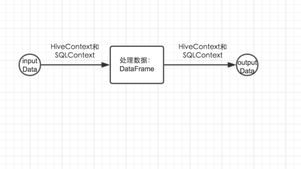](https://s5.51cto.com/wyfs02/M01/86/D2/wKioL1fMOmTAfg8zAAEV37NvmPo273.png-wh_500x0-wm_3-wmp_4-s_856408708.png)


## 2、**HiveContext和SQLContext**

   把HiveContext和SQLContext放在一起讲解是因为他们是差不多的，因为HiveContext继承自SQLContext，为什么会有两个这样的类，其实与hive和sql有关系的，虽然hive拥有HQL语言，但是它是一个类sql语言，和sql语言还是有差别的，**有些sql语法，HQL是不支持的**。所以他们还是有差别的。

选择不同的类，最后执行的查询引擎的驱动是不一样的。但是对于底层是怎么区别的这里不做详细的介绍，你就知道一点**，使用不同的读数据的类，底层会进行标记，自动识别是使用哪个类进行数据操作，然后采用不同的执行计划执行操作**，这点在上一篇sparkSQL整体框架中进行了介绍，这里不做介绍。当从hive库中读数据的时候，必须使用HiveContext来进行读取数据，不然在进行查询的时候会出一些奇怪的错。其他的数据源两者都可以选择，但是最好使用SQLContext来完成。因为其支持的sql语法更多。由于HiveContext是继承自SQLContext，这里只对SQLContext进行详细的介绍，但是以下这些方法是完全可以用在HiveContext中的。其实HiveContext类就扩展了SQLContext的两个我们可以使用的方法(在看源码时以protected和private开头的方法都是我们不能使用的，这个是scala的控制逻辑，相反，不是以这两个关键字标记的方法是我们可以直接使用的方法)：analyze(tableName:String)和refreshTable(tableName:String)。


| 方法             | 用途                                                         |
| ---------------- | ------------------------------------------------------------ |
| analyze方法      | 这个我们一般使用不到，它是来对我们写的sql查询语句进行分析用的，一般用不到。 |
| refreshTable方法 | 当我们在sparkSQL中处理的某个表的存储位置发生了变换，但是我们在内存的metaData中缓存(cache)了这张表，则需要调用这个方法来使这个缓存无效，需要重新加载。 |

### **2.1 读数据**

​      我们在解决我们的需求时，首先是读入数据，需要把数据读入到内存中去，读数据SQLContext提供了两个方法，我们提供两个数据表，为了便于演示，我采用的是用JSON格式进行存储的，写成这样的格式，但是可以保存为.txt格式的文件。

[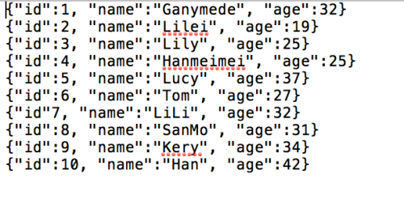](https://s5.51cto.com/wyfs02/M02/86/D3/wKioL1fMQtmxKqkVAADPd4NtRww164.png-wh_500x0-wm_3-wmp_4-s_3633625320.png)

1、第一种数据读入：这种是对数据源文件进行操作。

```scala
import org.apache.spark.sql.SQLContext
val sql = new SQLContext(sc) //声明一个SQLContext的对象，以便对数据进行操作
val peopleInfo = sql.read.json("文件路径")
//其中peopleInfo返回的结果是：org.apache.spark.sql.DataFrame =
// [age: bigint, id: bigint, name: string],这样就把数据读入到内存中了
```


​          写了这几行代码后面总共发生了什么，首先sparkSQL先找到文件，以解析json的形式进行解析，同时通过json的key形成schema，scheam的字段的顺序不是按照我们读入数据时期默认的顺序，如上，其字段的顺序是通过字符串的顺序进行重新组织的。默认情况下，会把整数解析成bigint类型的，把字符串解析成string类型的，通过这个方法读入数据时，返回值得结果是一个DataFrame数据类型。

​      DataFrame是什么？其实它是sparkSQL处理大数据的基本并且是核心的数据结构，是来存储sparkSQL把数据读入到内存中，数据在内存中进行存储的基本数据结构。它采用的存储是类似于数据库的表的形式进行存储的。我们想一想，一个数据表有几部分组成：1、数据，这个数据是一行一行进行存储的，一条记录就是一行，2、数据表的数据字典，包括表的名称，表的字段和字段的类型等元数据信息。那么DataFrame也是按照行进行存储的，这个类是Row，一行一行的进行数据存储。一般情况下处理粒度是行粒度的，不需要对其行内数据进行操作，如果想单独操作行内数据也是可以的，只是在处理的时候要小心，因为处理行内的数据容易出错，比如选错数据，数组越界等。数据的存储的形式有了，数据表的字段和字段的类型都存放在哪里呢，就是schema中。我们可以调用schema来看其存储的是什么。

```scala
peopleInfo.schema
//返回的结果是:org.apache.spark.sql.types.StructType = 
//StructType(StructField(age,LongType,true), StructField(id,LongType,true),
// StructField(name,StringType,true))
```


可以看出peopleInfo存储的是数据，schema中存储的是这些字段的信息。需要注意的是表的字段的类型与scala数据类型的对应关系：bigint->Long,int  -> Int,Float -> Float,double -> Double,string ->   String等。一个DataFrame是有两部分组成的：以行进行存储的数据和scheam，schema是StructType类型的。当我们有数据而没有schema时，我们可以通过这个形式进行构造从而形成一个DataFrame。


read函数还提供了其他读入数据的接口：

| 函数                                                         | 用途                                                         |
| ------------------------------------------------------------ | ------------------------------------------------------------ |
| json(path:String)                                            | 读取json文件用此方法                                         |
| table(tableName:String)                                      | 读取数据库中的表                                             |
| jdbc(url: String,table: String,predicates:Array[String],connectionProperties:Properties) | 通过jdbc读取数据库中的表                                     |
| orc(path:String)                                             | 读取以orc格式进行存储的文件                                  |
| parquet(path:String)                                         | 读取以parquet格式进行存储的文件                              |
| schema(schema:StructType)                                    | 这个是一个优化，当我们读入数据的时候指定了其schema，底层就不会再次解析schema从而进行了优化，一般不需要这样的优化，不进行此优化，时间效率还是可以接受 |


2、第二种读入数据：这个读入数据的方法，主要是处理从一个数据表中选择部分字段，而不是选择表中的所有字段。那么这种需求，采用这个数据读入方式比较有优势。这种方式是直接写sql的查询语句。把上述json格式的数据保存为数据库中表的格式。需要注意的是这种只能处理数据库表数据。

```scala
val peopleInfo = sql.sql("""
|select
| id,
| name,
| age
|from peopleInfo
""".stripMargin)//其中stripMargin方法是来解析我们写的sql语句的。
//返回的结果是和read读取返回的结果是一样的：
//org.apache.spark.sql.DataFrame =
// [age: bigint, id: bigint, name: string]
```


需要注意的是其返回的schmea中字段的顺序和我们查询的顺序还是不一致的。


### **2.2  写入数据**


写入数据就比较的简单，因为其拥有一定的模式，按照这个模式进行数据的写入。一般情况下，我们需要写入的数据是一个DataFrame类型的，如果其不是DataFrame类型的我们需要把其转换为

DataFrame类型，有些人可能会有疑问，数据读入到内存中，其类型是DataFrame类型，我们在处理数据时用到的是DataFrame类中的方法，但是DataFrame中的方法不一定返回值仍然是DataFrame类型的，同时有时我们需要构建自己的类型，所以我们需要为我们的数据构建成DataFrame的类型。把没有schema的数据，构建schema类型，我所知道的就有两种方法。


1、通过类构建schema，还以上面的peopleInfo为例子。

```scala
val sql = new SQLContext(sc) //创建一个SQLContext对象
import sql.implicits._ //这个sql是上面我们定义的sql，而不是某一个jar包，网上有很多
                       //是import sqlContext.implicits._,那是他们定义的是
                       //sqlContext = SQLContext(sc),这个是scala的一个特性
val people = sc.textFile("people.txt")//我们采用spark的类型读入数据，因为如果用
                                      //SQLContext进行读入，他们自动有了schema
case clase People(id:Int,name:String,age:Int)//定义一个类
val peopleInfo = people.map(lines => lines.split(","))
                        .map(p => People(p(0).toInt,p(1),p(2).toInt)).toDF
                        //这样的一个toDF就创建了一个DataFrame，如果不导入
                        //sql.implicits._,这个toDF方法是不可以用的。
```


上面的例子是利用了scala的反射技术，生成了一个DataFrame类型。可以看出我们是把RDD给转换为DataFrame的。


2、直接构造schema，以peopelInfo为例子。直接构造，我们需要把我们的数据类型进行转化成Row类型，不然会报错。

```scala
val sql = new SQLContext(sc) //创建一个SQLContext对象
val people = sc.textFile("people.txt").map(lines => lines.split(","))
val peopleRow = sc.map(p => Row(p(0),p(1),(2)))//把RDD转化成RDD(Row)类型
val schema = StructType(StructFile("id",IntegerType,true)::
                        StructFile("name",StringType,true)::
                        StructFile("age",IntegerType,true)::Nil)
val peopleInfo = sql.createDataFrame(peopleRow,schema)//peopleRow的每一行的数据
                                                      //类型一定要与schema的一致
                                                      //否则会报错，说类型无法匹配
                                                      //同时peopleRow每一行的长度
                                                      //也要和schema一致，否则
                                                      //也会报错
```


构造schema用到了两个类StructType和StructFile，其中StructFile类的三个参数分别是(字段名称，类型，数据是否可以用null填充)

采用直接构造有很大的制约性，字段少了还可以，如果有几十个甚至一百多个字段，这种方法就比较耗时，不仅要保证Row中数据的类型要和我们定义的schema类型一致，长度也要一样，不然都会报错，所以要想直接构造schema，一定要细心细心再细心，本人就被自己的不细心虐惨了，处理的字段将近一百，由于定义的schema和我的数据类型不一致，我就需要每一个字段每一个字段的去确认，字段一多在对的时候就容易疲劳，就这样的一个错误，由于本人比较笨，就花费了一个下午的时间，所以字段多了，在直接构造schema的时候，一定要细心、细心、细心，重要的事情说三遍，不然会死的很惨。


好了，现在我们已经把我们的数据转化成DataFrame类型的，下面就要往数据库中写我们的数据了

写数据操作：

```scala
val sql = new SQLContext(sc) 
val people = sc.textFile("people.txt").map(lines => lines.split(","))
val peopleRow = sc.map(p => Row(p(0),p(1),(2)))
val schema = StructType(StructFile("id",IntegerType,true)::
                        StructFile("name",StringType,true)::
                        StructFile("age",IntegerType,true)::Nil)
val peopleInfo = sql.createDataFrame(peopleRow,schema)
peopleInfo.registerTempTable("tempTable")//只有有了这个注册的表tempTable，我们
                                         //才能通过sql.sql(“”“ ”“”)进行查询
                                         //这个是在内存中注册一个临时表用户查询
sql.sql.sql("""
|insert overwrite table tagetTable
|select
| id,
| name,
| age
|from tempTable
""".stripMargin)//这样就把数据写入到了数据库目标表tagetTable中
```


有上面可以看到，sparkSQL的sql()其实就是用来执行我们写的sql语句的。


好了，上面介绍了读和写的操作，现在需要对最重要的地方来进行操作了啊。


### **2.3 通过DataFrame中的方法对数据进行操作**

​       

​        在介绍DataFrame之前，我们还是要先明确一下，sparkSQL是用来干什么的，它主要为我们提供了怎样的便捷，我们为什么要用它。它是为了让我们能用写代码的形式来处理sql，这样说可能有点不准确，如果就这么简单，只是对sql进行简单的替换，要是我，我也不学习它，因为我已经会sql了，会通过sql进行处理数据仓库的etl，我还学习sparkSQL干嘛，而且学习的成本又那么高。sparkSQL肯定有好处了，不然也不会有这篇博客啦。我们都知道通过写sql来进行数据逻辑的处理时有限的，写程序来进行数据逻辑的处理是非常灵活的，所以sparkSQL是用来处理那些不能够用sql来进行处理的数据逻辑或者用sql处理起来比较复杂的数据逻辑。一般的原则是能用sql来处理的，尽量用sql来处理，毕竟开发起来简单，sql处理不了的，再选择用sparkSQL通过写代码的方式来处理。好了废话不多说了，开始DataFrame之旅。

​       sparkSQL非常强大，它提供了我们sql中的正删改查所有的功能，每一个功能都对应了一个实现此功能的方法。


**对schema的操作**


```scala
val sql = new SQLContext(sc)
val people = sql.read.json("people.txt")//people是一个DataFrame类型的对象

//数据读进来了，那我们查看一下其schema吧

people.schema

//返回的类型
//org.apache.spark.sql.types.StructType = 
//StructType(StructField(age,LongType,true), 
//           StructField(id,LongType,true),
//           StructField(name,StringType,true))

//以数组的形式分会schema

people.dtypes

//返回的结果：
//Array[(String, String)] = 
//       Array((age,LongType), (id,LongType), (name,StringType))


//返回schema中的字段

people.columns

//返回的结果：
//Array[String] = Array(age, id, name)  

//以tree的形式打印输出schema

people.printSchema

//返回的结果:
//root
// |-- age: long (nullable = true)
// |-- id: long (nullable = true)
// |-- name: string (nullable = true)
```


对表的操作,对表的操作语句一般情况下是不常用的，因为虽然sparkSQL把sql查的每一个功能都封装到了一个方法中，但是处理起来还是不怎么灵活一般情况下我们采用的是用sql()方法直接来写sql，这样比较实用，还更灵活，而且代码的可读性也是很高的。那下面就把能用到的方法做一个简要的说明。


| 方法(sql使我们定义的sql = new SQLContext(sc)) df是一个DataFrame对象 | 实例说明                                                     |
| ------------------------------------------------------------ | ------------------------------------------------------------ |
| sql.read.table(tableName)                                    | 读取一张表的数据                                             |
| df.where(),          df.filter()                             | 过滤条件，相当于sql的where部分;用法：选择出年龄字段中年龄大于20的字段。返回值类型：DataFrame df.where("age >= 20"),df.filter("age >= 20") |
| df.limit()                                                   | 限制输出的行数，对应于sql的limit用法：限制输出一百行返回值类型：DataFrame df.limit(100) |
| df.join()                                                    | 链接操作，相当于sql的join对于join操作，下面会单独进行介绍    |
| df.groupBy()                                                 | 聚合操作，相当于sql的groupBy用法：对于某几行进行聚合返回值类型：DataFrame df.groupBy("id") |
| df.agg()                                                     | 求聚合用的相关函数，下面会详细介绍                           |
| df.intersect(other:DataFrame)                                | 求两个DataFrame的交集                                        |
| df.except(other:DataFrame)                                   | 求在df中而不在other中的行                                    |
| df.withColumn(colName:String,col:Column)                     | 增加一列                                                     |

| df.withColumnRenamed(exName,newName)                         | 对某一列的名字进行重新命名                                   |
| ------------------------------------------------------------ | ------------------------------------------------------------ |
| df.map(),df.flatMap,df.mapPartitions(),df.foreach()df.foreachPartition()df.collect()df.collectAsList()df.repartition()df.distinct()df.count() | 这些方法都是spark的RDD的基本操作，其中在DataFrame类中也封装了这些方法，需要注意的是这些方法的返回值是RDD类型的，不是DataFrame类型的，在这些方法的使用上，一定要记清楚返回值类型，不然就容易出现错误 |
| df.select()                                                  | 选取某几列元素，这个方法相当于sql的select的功能用法：返回选择的某几列数据返回值类型：DataFrame df.select("id","name") |

以上是两个都是一写基本的方法，下面就详细介绍一下join和agg,na,udf操作


### **2.4 sparkSQL的join操作**


​    spark的join操作就没有直接写sql的join操作来的灵活，在进行链接的时候，不能对两个表中的字段进行重新命名，这样就会出现同一张表中出现两个相同的字段。下面就一点一点的进行展开用到的两个表，一个是用户信息表，一个是用户的收入薪资表：

[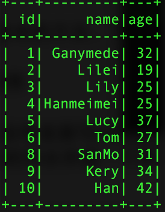](https://s4.51cto.com/wyfs02/M01/87/1F/wKioL1fVFKHBWx8yAADS8HGHT7Q431.png-wh_500x0-wm_3-wmp_4-s_3102577376.png)  [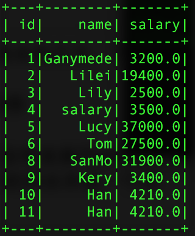](https://s4.51cto.com/wyfs02/M02/87/1F/wKioL1fVFMzjucKzAAEUkKPh1AA902.png-wh_500x0-wm_3-wmp_4-s_3856909949.png)


1、内连接，等值链接，会把链接的列合并成一个列


```scala
val sql = new SQLContext(sc)
val pInfo = sql.read.json("people.txt")
val pSalar = sql.read.json("salary.txt")
val info_salary = pInfo.join(pSalar,"id")//单个字段进行内连接
val info_salary1 = pInfo.join(pSalar,Seq("id","name"))//多字段链接
```


返回的结果如下图：

单个id进行链接 (一张表出现两个name字段)                                                两个字段进行链接

[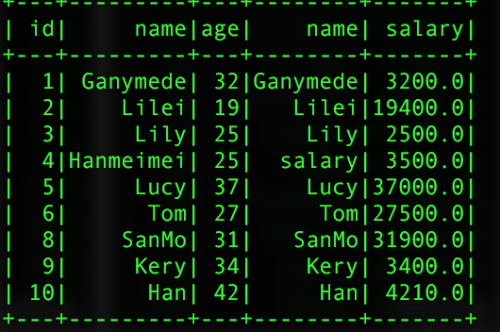](https://s4.51cto.com/wyfs02/M01/87/21/wKiom1fVFlTwjQbwAAH3nXZEh58669.png-wh_500x0-wm_3-wmp_4-s_4014259452.png)                                                    [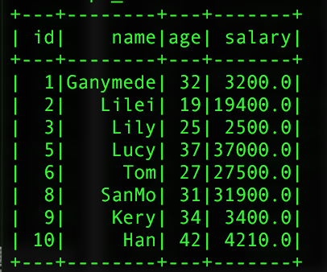](https://s1.51cto.com/wyfs02/M01/87/1F/wKioL1fVFlTxwDx-AAFsuYdckaE090.png-wh_500x0-wm_3-wmp_4-s_3783181375.png)


2、join还支持左联接和右链接，但是其左联接和右链接和我们sql的链接的意思是一样的，同样也是在链接的时候不能对字段进行重新命名，如果两个表中有相同的字段，则就会出现在同一个join的表中，同事左右链接，不会合并用于链接的字段。链接用的关键词：outer,inner,left_outer,right_outer

```scala
//单字段链接
val left = pInfo.join(pSalar,pInfo("id") === pSalar("id"),"left_outer")
//多字段链接
val left2 = pInfo.join(pSalar,pInfo("id") === pSalar("id") and 
                pInfo("name") === pSalar("name"),"left_outer")
```


返回的结果：

单字段链接                                                               多字段链接

[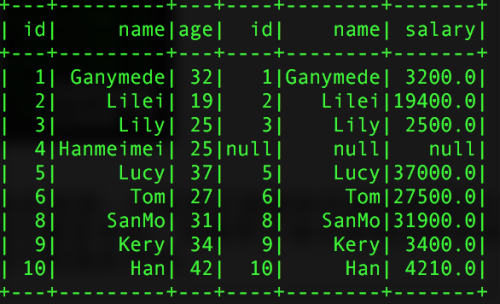](https://s1.51cto.com/wyfs02/M00/87/1F/wKioL1fVGQiT_JQgAAF-BueVQ8A567.png-wh_500x0-wm_3-wmp_4-s_597381429.png)                  [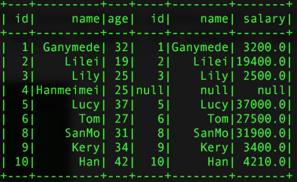](https://s1.51cto.com/wyfs02/M01/87/1F/wKioL1fVGXeSkNMpAAE5TN2DOHg791.png-wh_500x0-wm_3-wmp_4-s_659952004.png)


由上可以发现，sparkSQL的join操作还是没有sql的join灵活，容易出现重复的字段在同一张表中，一般我们进行链接操作时，我们都是先利用registerTempTable()函数把此DataFrame注册成一个内部表，然后通过sql.sql("")写sql的方法进行链接，这样可以更好的解决了重复字段的问题。


### **2.5 sparkSQL的agg操作**

​    

​     其中sparkSQL的agg是sparkSQL聚合操作的一种表达式，当我们调用agg时，其一般情况下都是和groupBy()的一起使用的,选择操作的数据表为：

[](https://s4.51cto.com/wyfs02/M02/87/1F/wKioL1fVFMzjucKzAAEUkKPh1AA902.png-wh_500x0-wm_3-wmp_4-s_3856909949.png)

```scala
val pSalar = new SQLContext(sc).read.json("salary.txt")
val group = pSalar.groupBy("name").agg("salary" -> "avg")
val group2 = pSalar.groupBy("id","name").agg("salary" -> "avg")
val group3 = pSalar.groupBy("name").agg(Map("id" -> "avg","salary"->"max"))
```


得到的结过如下：

   group的结果                                         group2                                           group3

[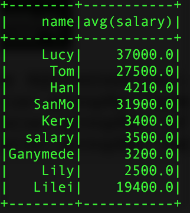](https://s3.51cto.com/wyfs02/M01/87/21/wKiom1fVHoODlce6AAD2HXgd44M826.png-wh_500x0-wm_3-wmp_4-s_3051623906.png)   [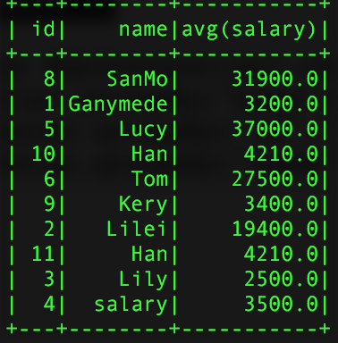](https://s1.51cto.com/wyfs02/M00/87/1F/wKioL1fVHoOi8ZByAAELMO8I5kw789.png-wh_500x0-wm_3-wmp_4-s_964499628.png)    [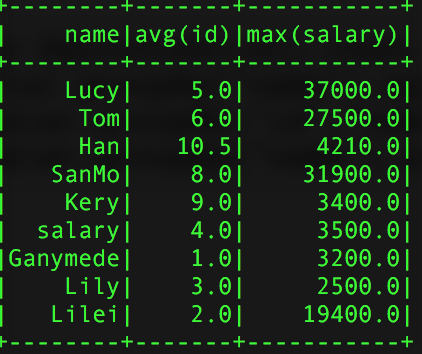](https://s3.51cto.com/wyfs02/M01/87/21/wKiom1fVHoSDVySrAAEKInS_Hh8231.png-wh_500x0-wm_3-wmp_4-s_401481198.png) 


使用agg时需要注意的是，同一个字段不能进行两次操作比如：agg(Map("salary"  -> "avg","salary" ->  "max"),他只会计算max的操作，原因很简单，agg接入的参数是Map类型的key-value对，当key相同时，会覆盖掉之前的value。同时还可以直接使用agg，这样是对所有的行而言的。聚合所用的计算参数有：avg，max，min，sum，count，而不是只有例子中用到的avg


### **2.6 sparkSQL的na操作**

   

​     sparkSQL的na方法，返回的是一个DataFrameFuctions对象，此类主要是对DataFrame中值为null的行的操作，只提供三个方法，drop()删除行，fill()填充行，replace()代替行的操作。很简单不做过多的介绍。


## **3、总结**

### 

​          我们使用sparkSQL的目的就是为了解决用写sql不能解决的或者解决起来比较困难的问题，在平时的开发过程中，我们不能为了高逼格什么样的sql问题都是用sparkSQL，这样不是最高效的。使用sparkSQL，主要是利用了写代码处理数据逻辑的灵活性，但是我们也不能完全的只使用sparkSQL提供的sql方法，这样同样是走向了另外一个极端，有上面的讨论可知，在使用join操作时，如果使用sparkSQL的join操作，有很多的弊端。为了能结合sql语句的优越性，我们可以先把要进行链接的DataFrame对象，注册成内部的一个中间表，然后在通过写sql语句，用SQLContext提供的sql()方法来执行我们写的sql，这样处理起来更加的合理而且高效。在工作的开发过程中，我们要结合写代码和写sql的各自的所长来处理我们的问题，这样会更加的高效。

​         写这篇博客，花费了我两周的时间，由于工作比较忙，只有在业余时间进行思考和总结。也算对自己学习的一个交代。关于sparkSQL的两个类HiveContext和SQLContext提供的udf方法，如果用好了udf方法，可以使我们代码的开发更加的简洁和高效，可读性也是很强的。由于在代码中注册udf方法，还有很多很细的知识点需要注意，我准备在另外写一篇博客进行详细的介绍。


​      累死我了，已经两天宅在家里了，该出去溜达溜达了！！

​    

​    


​    