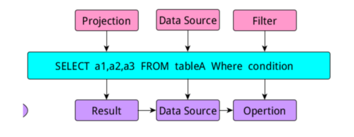
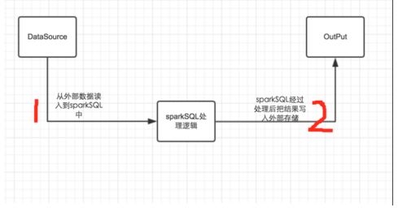
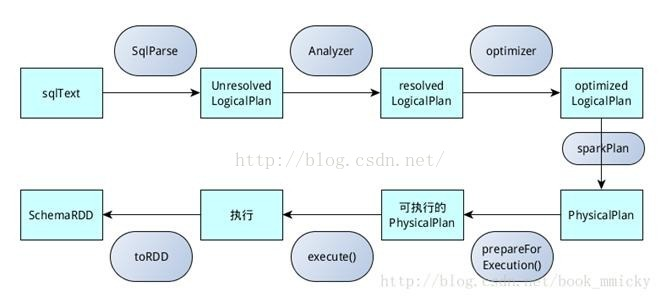
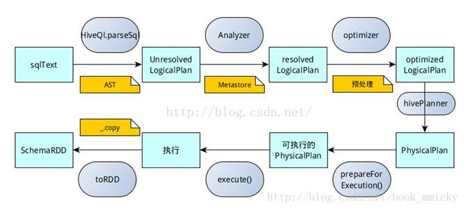

# sparkSQL的整体实现框架

 					 				

[hffzkl](https://blog.51cto.com/9269309)关注2人评论[104028人阅读](javascript:;)[2016-09-02 11:50:28](javascript:;)

 这篇博客的目的是让那些初次接触sparkSQL框架的童鞋们，希望他们对sparkSQL整体框架有一个大致的了解，降低他们进入spark世界的门槛，避免他们在刚刚接触sparkSQL时，不知所措，不知道该学习什么，该怎么看。这也是自己工作的一个总结，以便以后可以回头查看。后续会对sparkSQL进行一系列详细的介绍。慢慢来吧~~~

# 1、sql语句的模块解析

   当我们写一个查询语句时，一般包含三个部分，select部分，from数据源部分，where限制条件部分，这三部分的内容在sql中有专门的名称：

当我们写sql时，如上图所示，在进行逻辑解析时会把sql分成三个部分，project，DataSource，Filter模块，当生成执行部分时又把他们称为:Result模块、

DataSource模块和Opertion模块。

那么在关系数据库中，当我们写完一个查询语句进行执行时，发生的过程如下图所示：

### 整个执行流程是：query -> Parse -> Bind -> Optimize -> Execute

1、写完sql查询语句，sql的查询引擎首先把我们的查询语句进行解析，也就是Parse过程，**解析的过程是把我们写的查询语句进行分割**，把project，DataSource和Filter三个部分解析出来从而**形成一个逻辑解析tree**，在解析的过程中还会检查我们的sql语法是**否有错误**，比如缺少指标字段、数据库中不包含这张数据表等。当发现有错误时立即停止解析，并报错。当顺利完成解析时，会进入到Bind过程。

2、Bind过程，通过单词我们可看出，这个过程是一个绑定的过程。为什么需要**绑定过程？**这个问题需要我们**从软件实现的角度去思考**，如果让我们来实现这个sql查询引擎，我们应该怎么做？他们采用的策略是首先把sql查询**语句分割，分割不同的部分，再进行解析从而形成逻辑解析tree，然后需要知道我们需要取数据的数据表在哪里，需要哪些字段，执行什么逻辑，这些都保存在数据库的数据字典中**，因此bind过程，其实就是把Parse过程后形成的逻辑解析tree，与数据库的数据字典绑定的过程。绑定后会形成一个执行tree，从而让程序知道表在哪里，需要什么字段等等

3、完成了Bind过程后，数据库查询引擎会提供**几个查询执行计划**，并且给出了查询执行计划的一些**统计信息**，既然提供了几个执行计划，那么有**比较就有优劣**，数据库会根据这些执行计划的统计信息**选择一个最优的执行计划**，因此这个过程是**Optimize(优化)过程**。

4、选择了一个最优的执行计划，那么就剩下最后一步执行Execute,最后执行的过程和我们解析的过程是不一样的，当我们知道执行的顺序，对我们以后写sql以及优化都是有很大的帮助的.

执行查询后，他是先执行**where**部分，然后找到**数据源之数据表**，最后生成**select**的部分，我们的最终结果。执行的顺序是：operation->DataSource->Result

虽然以上部分对sparkSQL没有什么联系，但是知道这些，对我们理解sparkSQL还是很有帮助的。

 

# 2、sparkSQL框架的架构

要想对这个框架有一个清晰的认识，首先我们要弄清楚，我们为什么需要sparkSQL呢？个人建议一般情况下在写sql能够直接解决的问题就不要使用sparkSQL，如果想刻意使用sparkSQL，也不一定能够加快开发的进程。使用sparkSQL是为了**解决一般用sql不能解决的复杂逻辑**，使用编程语言的优势来解决问题。我们使用sparkSQL一般的流程如下图：

如上图所示，一般情况下分为两个部分：

a、把数据读入到sparkSQL中，sparkSQL进行数据处理或者算法实现，然后再把处理后的数据输出到相应的输出源中。

1、同样我们也是从如果让我们开发，我们应该怎么做，需要考虑什么问题来思考这个问题。

​     a、第一个问题是，**数据源有几个，我们可能从哪些数据源读取数据**？现在sparkSQL支持很多的数据源，比如：hive数据仓库、json文件，.txt，以及orc文件，同时现在还支持jdbc从关系数据库中取数据。功能很强大。

​       b、还一个需要思考的问题是数据类型怎么映射啊？我们知道当我们从一个数据库表中读入数据时，我们定义的表结构的字段的类型和编程语言比如scala中的数据类型映射关系是怎   样的一种映射关系？在sparkSQL中有一种来解决这个问题的方法，来实现数据**表中的字段类型到编程语言数据类型的映射关系**。这个以后详细介绍，先了解有这个问题就行。

​       c、数据有了，那么在sparkSQL中我们应该怎么组织这些数据，需要什么样的数据结构呢，同时我们对这些数据都可以进行什么样的操作？sparkSQL采用的是**DataFrame数据结构来组织读入到sparkSQL中的数据**，DataFrame数据结构其实和数据库的表结构差不多，数据是按照行来进行存储，同是还有一个**schema，就相当于数据库的表结构**，记录着每一行数据属于哪个字段。

​     d、当数据处理完以后，我们需要把数据**放入到什么地方**，并切以**什么样的格式进行对应**，这个a和b要解决的问题是相同的。

2、sparkSQL对于以上问题，的实现逻辑也很明确，从上图，已经很清楚，主要分为两个阶段，每个阶段都对应一个具体的类来实现。

​    a、  对于第一个阶段，sparkSQL中存在两个类来解决这些问题：HiveContext，SQLContext，同事**hiveContext继承了SQLContext的所有方法，同事又对其进行了扩展**。因为我们知道，   hive和mysql的查询还是有一定的差别的。HiveContext只是用来处理从hive数据仓库中读入数据的操作，SQLContext可以处理sparkSQL能够支持的剩下的所有的数据源。这两个类处理的**粒度是限制在对数据的读写上**，同事**对表级别的操作上**，比如，读入数据、缓存表、释放缓存表表、注册表、删除注册的表、返回表的结构等的操作。

  b、sparkSQL处理**读入的数据，采用的是DataFrame中提供的方法**。因为当我们把数据读入到sparkSQL中，这个数据就是DataFrame类型的。同时数据都是**按照Row进行存储**的。其中 DataFrame中提供了很多有用的方法。以后会细说。

 c、在spark1.6版本以后，又增加了一个类似于DataFrame的数据结构**DataSet**，增加此数据结构的目的DataFrame有软肋，他只能处理按照Row进行存储的数据，并且只能使用DataFrame中提供的方法，我们只能使用一部分RDD提供的操作。实现DataSet的目的就是**让我们能够像操作RDD一样来操作sparkSQL中的数据**。

d、其中还有一些其他的类，但是现在在sparkSQL中最主要的就是上面的三个类，其他类以后碰到了会慢慢想清楚。

# 3、sparkSQL的hiveContext和**SQLContext**的运行原理

​     hiveContext和SQLContext与我第一部分讲到的sql语句的**模块解析实现的原理其实是一样的**，采用了同样的逻辑过程，并且网上有好多讲这一块的，就直接粘贴复制啦！！

  sqlContext总的一个过程如下图所示：

1.SQL语句经过SqlParse解析成**Unresolved**LogicalPlan；

2.使用analyzer结合数据**数据字典（catalog）进行绑定**，生成**resolved**LogicalPlan；

3.使用optimizer对resolvedLogicalPlan进行**优化**，生成**optimized**LogicalPlan；

4.使用SparkPlan将LogicalPlan转换成**Physical**Plan；

5.使用prepareForExecution()将PhysicalPlan转换成可执行物理计划；

6.使用execute()执行可执行物理计划；

7.生成SchemaRDD。

在整个运行过程中涉及到多个SparkSQL的组件，如SqlParse、analyzer、optimizer、SparkPlan等等

hiveContext总的一个过程如下图所示：

1.SQL语句经过HiveQl.parseSql解析成**Unresolved** LogicalPlan，在这个解析过程中对hiveql语句使用**getAst()获取AST树，然后再进行解析**；

2.使用analyzer结合数据hive**源数据Metastore（新的catalog）**进行绑定，生成**resolved** LogicalPlan；

3.使用optimizer对resolved  LogicalPlan进行优化，生成**optimized**  LogicalPlan，优化前使用了**ExtractPythonUdfs(catalog.PreInsertionCasts(catalog.CreateTables(analyzed)))**进行预处理；

4.使用**hivePlanner**将**Logical**Plan转换成PhysicalPlan；

5.使用prepareForExecution()将PhysicalPlan转换成可执行物理计划；

6.使用execute()执行可执行物理计划；

7.执行后，使用map(_.copy)将结果导入SchemaRDD。

©著作权归作者所有：来自51CTO博客作者hffzkl的原创作品，如需转载，请注明出处，否则将追究法律责任