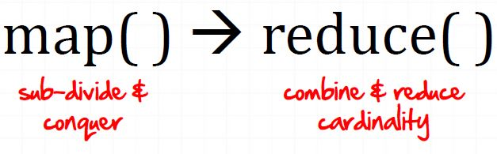
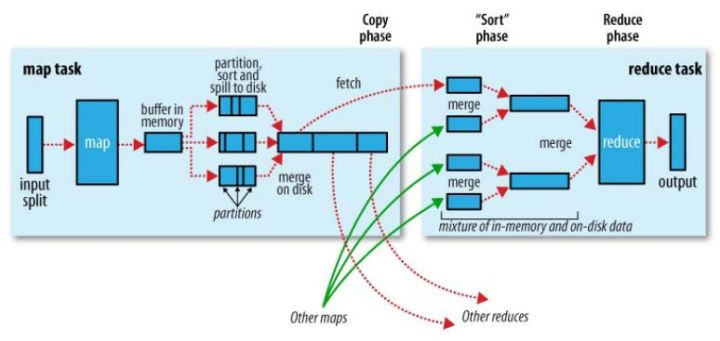
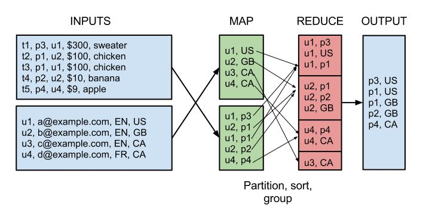
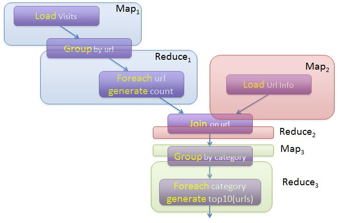
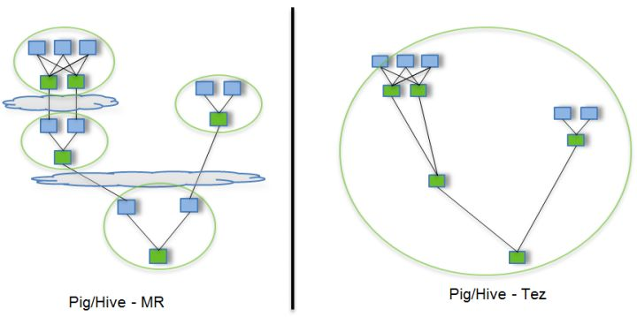
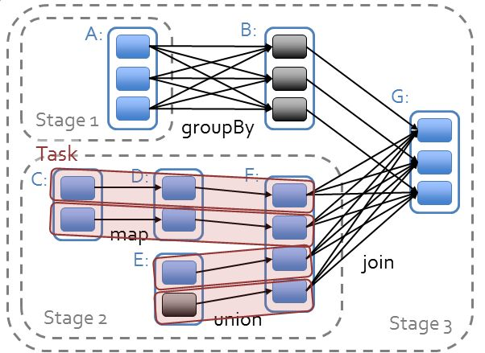
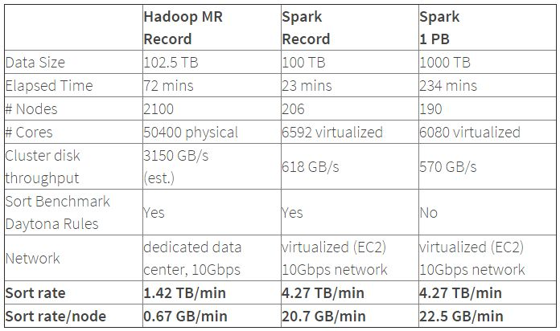
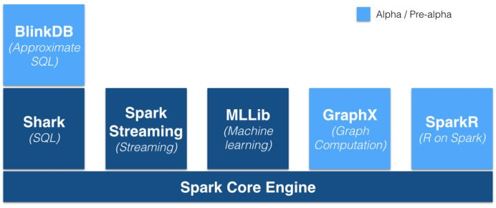
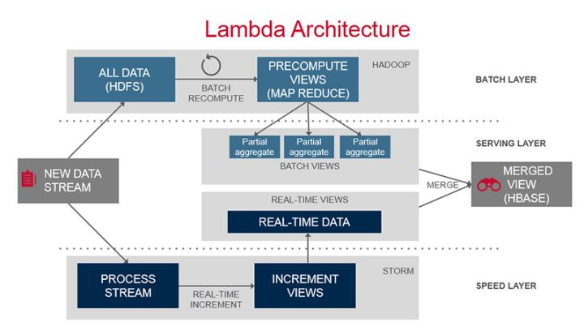

这篇介绍是我看到过最详尽的，讲到很多Spark基本原理和对比Hadoop的优势，推荐必读。


# 与 Hadoop 对比，如何看待 Spark 技术？

最近公司邀请来王家林老师来做培训，其浮夸的授课方式略接受不了。其强烈推崇Spark技术，宣称Spark是大数据的未来，同时宣布了Hadoop的死刑。
那么与Hadoop相比，Spark技术如何？现工业界大数据技术都在使用何种技术？

-----------补充------------
希望大家能将关注点放在Spark上。另Spark圈内应该会有人对此人有了解。此人在51CTO上有100期的课程，并号称7岁接触代码，现年28岁，2010年阅读完Android源码后，专注大数据。

王家林简介摘自百度百科
王家林：Spark亚太研究院院长和[首席](https://link.zhihu.com/?target=http%3A//baike.baidu.com/view/294385.htm)专家，中国目前唯一移动互联网和云计算大数据集大成者。Android架构师、高级工程师、咨询顾问、培训专家；通晓Android、HTML5、Hadoop，迷恋英语播音和健美；致力于Android、HTML5、Hadoop的软、硬、云整合的一站式解决方案。


---

---


[马步水](https://www.zhihu.com/people/ma-bu-shui)、[吴晗](https://www.zhihu.com/people/wuhan88)、[邓博元](https://www.zhihu.com/people/boyuandeng)、[立党](https://www.zhihu.com/people/lidang)、[wang z](https://www.zhihu.com/people/zheng-wang-24) 等 

**Hadoop**
首先看一下Hadoop解决了什么问题，Hadoop就是解决了大数据（大到一台计算机无法进行存储，一台计算机无法在要求的时间内进行处理）的可靠存储和处理。
HDFS，在由普通PC组成的集群上提供高可靠的文件存储，通过将块保存多个副本的办法解决服务器或硬盘坏掉的问题。MapReduce，通过简单的Mapper和Reducer的抽象提供一个编程模型，可以在一个由几十台上百台的PC组成的不可靠集群上并发地，分布式地处理大量的数据集，而把并发、分布式（如机器间通信）和故障恢复等计算细节隐藏起来。而Mapper和Reducer的抽象，又是各种各样的复杂数据处理都可以分解为的基本元素。这样，复杂的数据处理可以分解为由多个Job（包含一个Mapper和一个Reducer）组成的有向无环图（DAG）,然后每个Mapper和Reducer放到Hadoop集群上执行，就可以得出结果。

（图片来源：[http://www.slideshare.net/davidengfer/intro-to-the-hadoop-stack-javamug](https://link.zhihu.com/?target=http%3A//www.slideshare.net/davidengfer/intro-to-the-hadoop-stack-javamug)）

用MapReduce统计一个文本文件中单词出现的频率的示例WordCount请参见：[WordCount - Hadoop Wiki](https://link.zhihu.com/?target=http%3A//wiki.apache.org/hadoop/WordCount)，如果对MapReduce不恨熟悉，通过该示例对MapReduce进行一些了解对理解下文有帮助。

在MapReduce中，Shuffle是一个非常重要的过程，正是有了**看不见的Shuffle过程**，才可以使在MapReduce之上写数据处理的开发者完全感知不到分布式和并发的存在。
（图片来源： Hadoop Definitive Guide By Tom White）
广义的Shuffle是指图中在Map和Reuce之间的一系列过程。**Hadoop的局限和不足**
但是，MapRecue存在以下局限，使用起来比较困难。
抽象层次低，需要手工编写代码来完成，使用上难以上手。

只提供两个操作，Map和Reduce，表达力欠缺。

**一个Job只有Map和Reduce两个阶段（Phase）**，复杂的计算需要**大量的Job**完成，Job之间的依赖关系是由开发者自己管理的。处理逻辑隐藏在代码细节中，没有整体逻辑中间结果也放在HDFS文件系统中ReduceTask需要等待所有MapTask都完成后才可以开始时延高，**只适用Batch数据处理**，对于交互式数据处理，实时数据处理的支持不够对于迭代式数据处理性能比较差
比如说，用MapReduce实现两个表的Join都是一个很有技巧性的过程，如下图所示：
（图片来源：[Real World Hadoop](https://link.zhihu.com/?target=http%3A//blog.matthewrathbone.com/2013/02/09/real-world-hadoop-implementing-a-left-outer-join-in-hadoop-map-reduce.html)）因此，在Hadoop推出之后，出现了很多相关的技术对其中的局限进行改进，如Pig，Cascading，JAQL，OOzie，Tez，Spark等。**Apache Pig**
Apache  Pig也是Hadoop框架中的一部分，Pig提供类SQL语言（Pig Latin）通过MapReduce来处理大规模半结构化数据。而Pig  Latin是更高级的过程语言，通过将MapReduce中的设计模式抽象为操作，如Filter，GroupBy，Join，OrderBy，由这些操作组成**有向无环图（DAG）**。例如如下程序：

```SPARQL
	val spark = new SparkContext(master, appName, [sparkHome], [jars]) val file = spark.textFile("hdfs://...") val counts = file.flatMap(line => line.split(" "))                  		.map(word => (word, 1))                  
	.reduceByKey(_ + _) counts
.saveAsTextFile("hdfs://...") 
```

描述了数据处理的整个过程。而Pig Latin又是通过编译为MapReduce，在Hadoop集群上执行的。上述程序被编译成MapReduce时，会产生如下图所示的Map和Reduce：

（图片来源：[http://cs.nyu.edu/courses/Fall12/CSCI-GA.2434-001/sigmod08-pig-latin.ppt](https://link.zhihu.com/?target=http%3A//cs.nyu.edu/courses/Fall12/CSCI-GA.2434-001/sigmod08-pig-latin.ppt)）Apache Pig解决了MapReduce存在的**大量手写代码，语义隐藏，提供操作种类少**的问题。

类似的项目还有Cascading，JAQL等。**Apache Tez**
Apache Tez，Tez是HortonWorks的Stinger Initiative的的一部分。作为执行引擎，Tez也提供了**有向无环图（DAG）**，DAG由顶点（Vertex）和边（Edge）组成，Edge是对数据的移动的抽象，提供了One-To-One，BroadCast，和Scatter-Gather三种类型，只有Scatter-Gather才需要进行Shuffle。以如下SQL为例：


```sql
SELECT a.state, COUNT(*), AVERAGE(c.price) FROM a JOIN b ON (a.id = b.id) JOIN c ON (a.itemId = c.itemId) GROUP BY a.state
```




（图片来源：[http://www.slideshare.net/hortonworks/apache-tez-accelerating-hadoop-query-processing](https://link.zhihu.com/?target=http%3A//www.slideshare.net/hortonworks/apache-tez-accelerating-hadoop-query-processing)）
途中蓝色方块表示Map，绿色方块表示Reduce，云状表示写屏障（write barrier，一种内核机制，可以理解为持久的写），Tez的优化主要体现在：
去除了连续两个作业之间的写屏障去除了每个工作流中多余的Map阶段（Stage）通过提供DAG语义和操作，提供了整体的逻辑，通过减少不必要的操作，Tez提升了数据处理的执行性能。**Apache Spark**
Apache Spark是一个新兴的大数据处理的引擎，主要特点是提供了一个集群的分布式内存抽象，以支持需要工作集的应用。这个抽象就是RDD（Resilient  Distributed  Dataset），RDD就是一个不可变的带分区的记录集合，RDD也是Spark中的编程模型。Spark提供了RDD上的两类操作，转换和动作。转换是用来定义一个新的RDD，包括map,  flatMap, filter, union, sample, join, groupByKey, cogroup, ReduceByKey,  cros, sortByKey, mapValues等，动作是返回一个结果，包括collect, reduce, count, save,  lookupKey。Spark的API非常简单易用，Spark的WordCount的示例如下所示：

 

```sql
val spark = new SparkContext(master, appName, [sparkHome], [jars]) val file = spark.textFile("hdfs://...") 
val counts = file.flatMap(line => line.split(" "))                 
	.map(word => (word, 1))                 
	.reduceByKey(_ + _) counts
.saveAsTextFile("hdfs://...") 
```


其中的file是根据HDFS上的文件创建的RDD，后面的flatMap，map，reduceByKe都创建出一个新的RDD，一个简短的程序就能够执行很多个转换和动作。

在Spark中，所有RDD的转换都是是**惰性求值**的。RDD的转换操作会生成新的RDD，新的RDD的数据依赖于原来的RDD的数据，每个RDD又包含多个分区。那么一段程序实际上就构造了一个由相互依赖的多个RDD组成的**有向无环图（DAG）。**并通过在RDD上执行动作将这个有向无环图作为一个Job提交给Spark执行。例如，上面的WordCount程序就会生成如下的DAG

```scala
scala> counts.toDebugString
res0: String =
MapPartitionsRDD[7] at reduceByKey at <console>:14 (1 partitions)
  ShuffledRDD[6] at reduceByKey at <console>:14 (1 partitions)
    MapPartitionsRDD[5] at reduceByKey at <console>:14 (1 partitions)
      MappedRDD[4] at map at <console>:14 (1 partitions)
        FlatMappedRDD[3] at flatMap at <console>:14 (1 partitions)
          MappedRDD[1] at textFile at <console>:12 (1 partitions)
            HadoopRDD[0] at textFile at <console>:12 (1 partitions)
```


Spark对于有向无环图Job进行调度，确定**阶段（Stage）**，**分区（Partition）**，**流水线（Pipeline）**，**任务（Task）**和**缓存（Cache）**，进行优化，并在Spark集群上运行Job。RDD之间的依赖分为**宽依赖**（依赖多个分区）和**窄依赖**（只依赖一个分区），

在确定阶段时，需要**根据宽依赖划分阶段**。**根据分区划分任务**。

（图片来源：[https://databricks-training.s3.amazonaws.com/slides/advanced-spark-training.pdf](https://link.zhihu.com/?target=https%3A//databricks-training.s3.amazonaws.com/slides/advanced-spark-training.pdf)）

Spark支持故障恢复的方式也不同，提供两种方式，**Linage**，通过数据的血缘关系，再执行一遍前面的处理，**Checkpoint**，将数据集存储到持久存储中。Spark为**迭代式数据处理**提供更好的支持。每次迭代的数据可以保存在内存中，而不是写入文件。Spark的性能相比Hadoop有很大提升，2014年10月，Spark完成了一个Daytona Gray类别的Sort Benchmark测试，排序完全是在磁盘上进行的，与Hadoop之前的测试的对比结果如表格所示：
（表格来源： [Spark officially sets a new record in large-scale sorting](https://link.zhihu.com/?target=http%3A//databricks.com/blog/2014/11/05/spark-officially-sets-a-new-record-in-large-scale-sorting.html)）
从表格中可以看出排序100TB的数据（1万亿条数据），**Spark只用了Hadoop所用1/10的计算资源，耗时只有Hadoop的1/3**。
Spark的优势不仅体现在性能提升上的，Spark框架为批处理（Spark  Core），交互式（Spark SQL），流式（Spark  Streaming），机器学习（MLlib），图计算（GraphX）提供一个统一的数据处理平台，这相对于使用Hadoop有很大优势。

（图片来源：[https://gigaom.com/2014/06/28/4-reasons-why-spark-could-jolt-hadoop-into-hyperdrive/](https://link.zhihu.com/?target=https%3A//gigaom.com/2014/06/28/4-reasons-why-spark-could-jolt-hadoop-into-hyperdrive/)）按照Databricks的连城的说法是**One Stack To Rule Them All**特别是在有些情况下，你需要进行一些ETL工作，然后训练一个机器学习的模型，最后进行一些查询，如果是使用Spark，你可以在一段程序中将这三部分的逻辑完成形成一个大的**有向无环图（DAG）**，而且Spark会对大的有向无环图进行整体优化。例如下面的程序：


```SPARQL
val points = sqlContext.sql(   “SELECT latitude, longitude FROM historic_tweets”)    
val model = KMeans.train(points, 10)    
sc.twitterStream(...)   
	.map(t => (model.closestCenter(t.location), 1))   
	.reduceByWindow(“5s”, _ + _)
```

（示例来源：[http://www.slideshare.net/Hadoop_Summit/building-a-unified-data-pipeline-in-apache-spark](https://link.zhihu.com/?target=http%3A//www.slideshare.net/Hadoop_Summit/building-a-unified-data-pipeline-in-apache-spark)）
这段程序的第一行是用Spark SQL 查寻出了一些点，第二行是用MLlib中的K-means算法使用这些点训练了一个模型，第三行是用Spark Streaming处理流中的消息，使用了训练好的模型。

**Lambda Architecture**
Lambda Architecture是一个大数据处理平台的参考模型，如下图所示：
（图片来源： 


[Lambda Architecture](https://link.zhihu.com/?target=https%3A//www.mapr.com/developercentral/lambda-architecture)）


其中包含3层，Batch  Layer，Speed Layer和Serving Layer，由于Batch Layer和Speed  Layer的数据处理逻辑是一致的，如果用Hadoop作为Batch Layer，而用Storm作为Speed  Layer，你需要维护两份使用不同技术的代码。

而Spark可以作为Lambda Architecture一体化的解决方案,大致如下：

- Batch Layer，HDFS+Spark Core，将实时的增量数据追加到HDFS中，使用Spark Core批量处理全量数据，生成全量数据的视图。，
- Speed Layer，Spark Streaming来处理实时的增量数据，以较低的时延生成实时数据的视图。
- Serving Layer，HDFS+Spark SQL（也许还有BlinkDB），存储Batch Layer和Speed Layer输出的视图，提供低时延的即席查询功能，将批量数据的视图与实时数据的视图合并。


### **总结**

如果说，MapReduce是公认的分布式数据处理的低层次抽象，类似逻辑门电路中的与门，或门和非门，

那么Spark的**RDD就是分布式大数据处理的高层次抽象**，类似逻辑电路中的编码器或译码器等。

RDD就是一个分布式的数据集合（Collection），对这个集合的任何操作**都可以像函数式编程中操作内存中的集合一样直观、简便**，但集合操作的实现确是在后台分解成一系列 Task发送到几十台上百台服务器组成的集群上完成的。最近新推出的大数据处理框架Apache  Flink也使用数据集（Data Set）和其上的操作作为编程模型的。

由RDD组成的**有向无环图（DAG）**的执行是**调度程序将其生成物理计划并进行优化，然后在Spark集群上执行**的。Spark还提供了一个**类似于MapReduce的执行引擎，该引擎更多地使用内存，而不是磁盘，得到了更好的执行性能**。

那么Spark解决了Hadoop的哪些问题呢？

- 抽象层次低，需要手工编写代码来完成，使用上难以上手。
  - ​	=>**基于RDD的抽象**，实数据处理逻辑的**代码非常简短**。。
- 只提供两个操作，Map和Reduce，表达力欠缺。
  - ​	=>提供很多**转换和动作**，很多基本操作如**Join，GroupBy已经在RDD转换和动作中实现**。
- 一个Job只有Map和Reduce两个阶段（Phase），复杂的计算需要大量的Job完成，Job之间的依赖关系是由开发者自己管理的。
  - ​	=>**一个Job可以包含RDD的多个转换操作**，在调度时**可以生成多个阶段（Stage）**，而且如果多个map操作的RDD的分区不变，是可以放在同一个Task中进行。
- 处理逻辑隐藏在代码细节中，没有整体逻辑
  -  =>在Scala中，通过**匿名函数**和**高阶函数**，**RDD的转换支持流式API**，可以提供处理**逻辑的整体视图**。代码**不包含具体操作的实现细节，逻辑更清晰**。
- 中间结果也放在HDFS文件系统中
  - ​	=>**中间结果放在内存中**，内存放不下了会写入本地磁盘，而不是HDFS。
- ReduceTask需要等待所有MapTask都完成后才可以开始
  - ​	=> 分区相同的转换构成流水线放在一个Task中运行，分区不同的转换需要Shuffle，被**划分到不同的Stage中**，需要等待前面的Stage完成后才可以开始。
- 时延高，只适用Batch数据处理，对于交互式数据处理，实时数据处理的支持不够
  - ​	=>通过将流**拆成小的batch**提供Discretized Stream处理流数据。
- 对于迭代式数据处理性能比较差
  - ​	=>通过在内存中缓存数据，提高迭代式计算的性能。
- 
- 因此，Hadoop MapReduce会被新一代的大数据处理平台替代是技术发展的趋势，而在新一代的大数据处理平台中，Spark目前得到了最广泛的认可和支持，从参加Spark Summit 2014的厂商的各种基于Spark平台进行的开发就可以看出一二。


