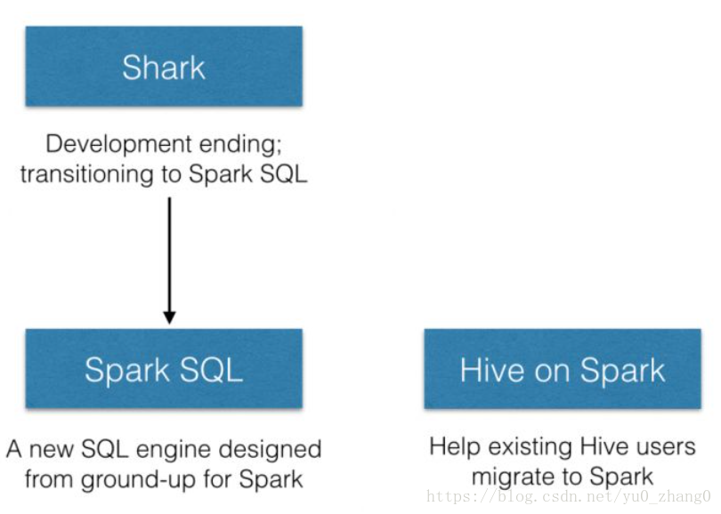
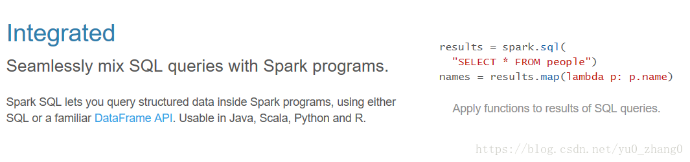
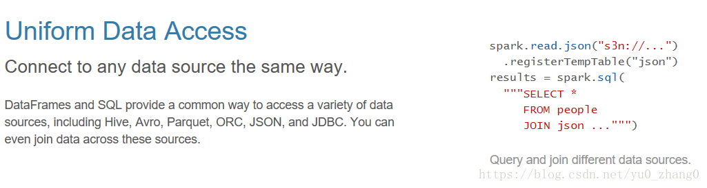
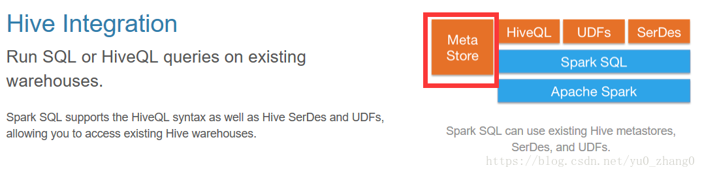
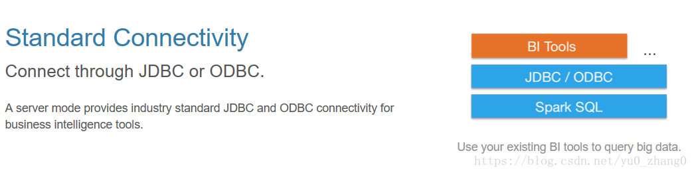
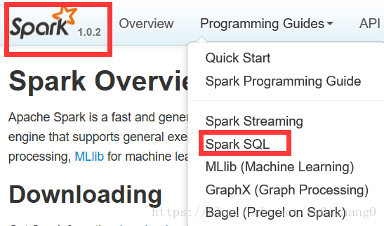
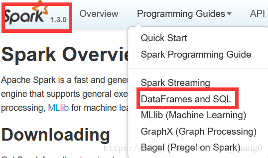
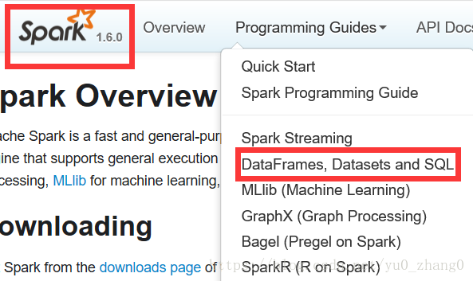
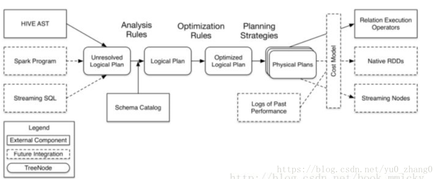

# park SQL作用及其架构

https://blog.csdn.net/yu0_zhang0/article/details/80188698

2018年05月03日 22:58:59[爆发的~小宇宙](https://me.csdn.net/yu0_zhang0)阅读数 3126

​                                 分类专栏：                                                                                                             [                                             Spark                                        ](https://blog.csdn.net/yu0_zhang0/article/category/7442602)                                                                                                                                                  [                                             spark sql                                        ](https://blog.csdn.net/yu0_zhang0/article/category/7638333)                                                                                                                                                  [                                             spark学习专栏                                        ](https://blog.csdn.net/yu0_zhang0/article/category/9274553)                                                                                                 

​                                     

​                 [                     ](http://creativecommons.org/licenses/by-sa/4.0/)             版权声明：本文为博主原创文章，遵循[ CC 4.0 BY-SA ](http://creativecommons.org/licenses/by-sa/4.0/)版权协议，转载请附上原文出处链接和本声明。                                      本文链接：https://blog.csdn.net/yu0_zhang0/article/details/80188698                              

### 1 概述

对于Spark SQL的学习：本文首先会介绍Spark SQL的产生背景，知道了产生背景我们开始学习Spark SQL的作用和特点，最后介绍其原理。下一篇文章会介绍如何使用Spark SQL。
 [官网地址](http://spark.apache.org/sql/)

### 2 Spark SQL产生背景

#### 2.1 SQL的重要性

很多传统的dba人员或者熟悉关系新数据库的人在遇到日益增长的数据量，关系型数据库已经存储不了那么多信息，那么如果想要使用大数据的手段来进行处理，那么一大批人肯定还是有SQL那最好，如果你要使用mapreduce或者spark，那么这些框架对传统的dba的同学来说，门槛比较高，要么你要学java，要么你要学python  或者Scala编写程序，这个成本还是很高的，如果能把原来关系型数据库的那一套拿到大数据中那岂不是更好。

#### 2.2 Spark SQL的前身

SparkSQL的前身是Shark，给熟悉RDBMS但又不理解MapReduce的技术人员提供快速上手的工具，但是说到Shark不得不说一说Hive了。Hive是基于hadoop之上的一个开源的工具，他提供的就是类似于SQL的一种HQL语言，它的好处就是可以直接把你的SQL语句转换成mapreduce作业，然后提交在集群上运行，好处就是我们不需要基于mapreduce的api进行编程，你只需要写SQL语句就能完成大数据的统计和分析。

这个最大的优势就是对于不太熟悉编程语言的人来说，也不用了解太多mapreduce底层的东西就能对存储在HDFS上的海量数据进行分析和查询，当然这也是有缺点的：hive是把sql翻译成mapreduce作业，所以底层还是基于mapreduce，那么mapreduce框架的缺点就是效率太低，那么这样子我们hive   的效率肯定不会高，对于批处理的作业hive进行实现的话，如果很大的话，耗时十几个小时都是很可能的。那么缺点这么明显，hive有没有改进呢？肯定也有，你不是慢嘛，那我把你底层的执行引擎换掉，后来就产生的TEZ还有spark这些底层的执行引擎，也就是说hive可以跑在TEZ、SPARK上面。

后来慢慢发展就推出了spark，spark是一个基于内存的分布式计算框架，他的执行效率比mapreduce高了太多。

#### 2.3  Spark SQL的诞生

但是，随着Spark的发展，对于野心勃勃的Spark团队来说，Shark对于Hive的太多依赖（如采用Hive的语法解析器、查询优化器等等），制约了Spark的One  Stack Rule Them  All的既定方针，制约了Spark各个组件的相互集成，所以提出了SparkSQL项目。SparkSQL抛弃原有Shark的代码，汲取了Shark的一些优点，如内存列存储（In-Memory  Columnar  Storage）、Hive兼容性等，重新开发了SparkSQL代码；由于摆脱了对Hive的依赖性，SparkSQL无论在数据兼容、性能优化、组件扩展方面都得到了极大的方便，真可谓“退一步，海阔天空”。

#### 2.4 Spark SQL和Hive On Spark的区别



其中SparkSQL作为Spark生态的一员继续发展，而不再受限于Hive，只是兼容Hive；而Hive on  Spark是一个Hive的发展计划，该计划将Spark作为Hive的底层引擎之一，也就是说，Hive将不再受限于一个引擎，可以采用Map-Reduce、Tez、Spark等引擎。

**两者区别：** Spark SQL刚开始也是使用了hive里面一些东西的，但是Spark  SQL里面的hive版本肯定要比hive社区理的版本要低一些的，那么hive里面有的东西，比如说原来跑在mapreduce之上已有的一些功能，如果你使用hive  on spark的话他是能支持的，但是有一些功能想要直接在Spark SQL上直接用，很可能是没有办法支持，因为Spark  SQL里面的一些功能并没有hive完善，毕竟hive已经这么多年，而Spark只是发展了这两三年而已。那么shark终止以后，在Spark界重心就已经在Spark  SQL上了，Spark  SQl干的事情和原来的shark是有很大的差别的，因为原来的shark依赖了很多hive的东西，那么在sparksql里面就必须要把这个依赖更好的减轻。

### 3 Spark SQL简介

Spark SQL是Spark处理数据的一个模块，跟基本的Spark RDD的API不同，Spark  SQL中提供的接口将会提供给Spark更多关于结构化数据和计算的信息。其本质是，Spark  SQL使用这些额外的信息去执行额外的优化，这儿有几种和Spark SQL进行交互的方法，包括SQL和Dataset  API，当使用相同的执行引擎时，API或其它语言对于计算的表达都是相互独立的，这种统一意味着开发人员可以轻松地在不同的API之间进行切换。

#### 3.1 Spark SQL的作用

Spark SQL的一大用处就是执行SQL查询语句，Spark  SQL也可以用来从Hive中读取数据，当我们使用其它编程语言来运行一个SQL语句，结果返回的是一个Dataset或者DataFrame.你可以使用命令行，JDBC或者ODBC的方式来与SQL进行交互。
 （后面会对Dataset，DataFrame进行详细的介绍）

#### 3.2 Spark SQL的特点

官网上第一句话：**Spark SQL is Apache Spark’s module for working with structured data. **
 这句话是什么意思呢？可以理解为：首先spark是apache的一个模块，它是用来处理结构化的数据。那么这里可能又会有个疑问到底什么是结构化数据呢？这里可以先做一个简单的理解，例如具有schema结构的数据，json,  parquet, avro, csv格式，一些文本之类的，后面进行详细的介绍。

**下面来看看官网列出的几大特性：**
 

1.无缝的使用SQL的查询在我们spark的应用程序里面，sparkSQL可以让你查询结构化的数据在spark应用程序上面，当然你可以使用SQL的API，也可以使用dataframe的API它支持四种语言，我们看右边，其中HiveContext可以理解为处理hive相关的上下文，可以把hive里的数据进行读取或者是其他的操作。


 \2.  他可以使用相同的方式连接到外部数据源。外部数据源，是SparkSQL里买非常重要的功能。dataframe和SQL提供了一个通用的方式来访问各式各样的数据源，包括Hive,  Avro, Parquet, ORC, JSON, and  JDBC，我们可以看右边的小图，读取json文件，里面的s3n是什么？就是amazon的s3数据存储系统，可以把这个文件读取进来然后注册成一张表就是图中的.registerTempTable(‘json’)，注册成一个临时表，然后后面的所有操作都可以针对这个临时表来进行操作，这对于SQL的人来说是一个非常大的福音。
 
 3.hive的兼容性（Hive  Integration），它能够在已有的数据上运行没有做任何修改的hive查询，也就是说你hive现在有的东西，你可以直接拿来在sparkSQL上面运行，他是兼容的。为什么呢？因为sparkSQL复用了hive的前端以及元数据（**图中用了红框进行标注**）
 
 4.它能够使用JDBC或者ODBC的方式来连接到你外部的其他的BI的工具上面，这也是很常用的。

#### 3.3小结

**1. Spark SQL is not about SQL 2. Spark SQL is about more than SQL**

从严格意义上来说sparkSQL不仅仅是SQL，更加准确的来说，他是超乎SQL的作用。
 对于这一点我们从官网也可以看出，下面我们看看每个版本的不同就知道了，有图有真相：
 
 
 
 上面几个图代表了不同的版本的一些变化，是不是很好理解了。
 spark是apache的一个模块，这个模块用来处理结构化的数据，从这个层面来看有见到SQL字样，他并没有强调SQL，其实sparkSQL它不仅仅有访问或者操作SQL的功能，还提供了其他的非常丰富的操作：外部数据源、优化。

**Spark SQL小结：**
 **1）** Spark SQL的应用并不局限于SQL；
 **2）** 访问hive、json、parquet等文件的数据；
 **3）** SQL只是Spark SQL的一个功能而已；
 **4）** Spark SQL提供了SQL的api、DataFrame和Dataset的API；

### 4 Spark SQL愿景

1.**写更少的代码**

写更少的代码我们可以从两个方面来理解：
 **1） DataFrame和DataSet引入**
 我们知道Spark SQL引入了DataFrame和DataSet所以我们可以更方便的使用df或者ds进行编程可以更加方便而且还可以通过sql的方式。
 **2）外部数据源的引入：**
 既然引入了外部数据源，那我们读取各种类型的数据就变得尤为方便例如：Json、parquet、RDBMS等。那么对于以前我们学习的Sqoop就不需要了吧 。还有就是对于Schmel的推到，下面可以举个简单的例子：

这里有一份数据如下：

```json
{"name":"zhangsan", "gender":"F", "height":160}
{"name":"lisi", "gender":"M", "height":175, "age":30}
{"name":"wangwu", "gender":"M", "height":180.3}	
123
```

如果我们使用rdd进行编程或者其他方式，应该要考虑到各种数据类型的问题  ，有些是同一列中的数据可能有些是int有些是double,或者有些列有数据有些列没有数据等一系列问题，再或者各种版本类型变化的问题。那么如果我们直接使用外部数据源读取他们自动给我们推导这个schemel结构：

```shell
val df = spark.read.format("json").load("file:///home/hadoop/data/person.json")

df.printSchema
root
 |-- age: long (nullable = true)
 |-- gender: string (nullable = true)
 |-- height: double (nullable = true)
 |-- name: string (nullable = true)	

+----+------+------+--------+
| age|gender|height|    name|
+----+------+------+--------+
|null|     F| 160.0|zhangsan|
|  30|     M| 175.0|    lisi|
|null|     M| 180.3|  wangwu|
+----+------+------+--------+
12345678910111213141516
```

2.**读更少的数据**
 注：这个更少的数据是指通过一些优化手段使得Spark SQL这个执行引擎能自动的给我们去除掉一些不必要的数据，然后再进行运行，比如你读一个很大的文件，和读一个很大文件的子集的数据，那么第二个运行起来肯定是更快的。
 3.**把优化的工作交由底层的优化器运行**
 注：把优化工作拿掉，我们并不需要做一些优化工作，也就是小白和高手写出来的应用程序最后的执行效率都是一样的。
 为了达成这三点，在sparkSQL1.3版本里面，他引入了一个非常重要的概念，就是dataframe，当然dataframe不是sparkSQL里面独有的，他是从R语言和python语言里面给引进过来的，延续了传统的单机数据开发的一个体验，并把它推广到分布式的大数据场景当中来使用，让我们觉得是在写单机应用程序，但是写出来的程序能够在分布式的场景进行使用的。

*（后面会对这三点进行一个详细的介绍）*

### 5 Spark SQL架构


 sparkSQL架构分成三个部分，第一部分是前端的，第二部分是后端的，对三个部分是中间的Catalyst，这个Catalyst是整个架构的核心。

#### 5.1前端

前端有不同种的访问方式。
 1）典型的我们可以使用hive，你hive过来就是一个SQL语句，SQL语句就是一个字符串，那么这个字符串如何才能够被Catalyst进行解析呢，或者说如何将一个SQL语句翻译成spark的作业呢，他要经过解析的，有一个抽象语法树，这是第一种访问方式。
 2）第二种访问方式，我们可以通过spark的应用程序，编程的方式来操作，编程的时候我们可以使用SQL，也可以使用dataframe或者是dataset api。
 3）第三种是Streaming SQL，也就是说流和SQL综合起来使用。

#### 5.2Catalyst

1）前端三个访问方式，当前端过来以后他首先会生成一个Unresolved Logical  Plan，也就是一个没有彻底解析完的一个执行计划，这个执行计划会和我们的元数据，也就是metastore里面的schema一个表信息进行整合然后生成一个Logical  Plan（逻辑执行计划）。
 2）那么这个逻辑执行计划是最原始的，中间还会做各种优化也很多规则作用上去，也就是图中的Optimization Rules，然后进行优化以后生成优化过后的逻辑执行计划，就是图中的Optimized Logical Plan。
 3）那么逻辑执行计划生成完了以后，才会生成物理执行计划，也就是我们spark的一个作业。

#### 5.3 Spark SQL执行计划

Spark SQL的启动和spark一样，如果想访问hive中的数据，只要把hive-site.xml放入放到conf目录下即可。

- 启动spark sql

```shell
 spark-sql --master local[2]
 。。。
 18/04/22 05:53:42 INFO SessionState: Created local directory: /tmp/hadoop/15a1adcd-cef3-408c-ab58-7837e374fd42
18/04/22 05:53:42 INFO SessionState: Created HDFS directory: /tmp/hive/hadoop/15a1adcd-cef3-408c-ab58-7837e374fd42/_tmp_space.db
18/04/22 05:53:42 INFO HiveClientImpl: Warehouse location for Hive client (version 1.2.1) is file:/home/hadoop/spark-warehouse
spark-sql> 
         > 
         > 

创建表：
create table test1(id int,name string);

查看：
show tables；
1234567891011121314
```

- 根据一个sql来简单了解执行计划

```
spark-sql> explain extended
         > select t1.id * (2+3), t2.name
         > from test1 t1 join test1 t2 
         > on t1.id = t2.id and t1.id>10;
这里先不用管这个sql语句，主要看看下面的执行计划的各个阶段（这条sql并没有什么用）。

18/04/22 06:04:42 INFO SparkSqlParser:Parsing command: explain extended
select t1.id * (2+3), t2.name
from test1 t1 join test1 t2 
on t1.id = t2.id and t1.id>10
18/04/22 06:04:42 INFO HiveMetaStore: 0: get_table : db=default tbl=test1
18/04/22 06:04:42 INFO audit: ugi=hadoop        ip=unknown-ip-addr      cmd=get_table : db=default tbl=test1
18/04/22 06:04:43 INFO CatalystSqlParser: Parsing command: int
18/04/22 06:04:43 INFO CatalystSqlParser: Parsing command: string
18/04/22 06:04:43 INFO HiveMetaStore: 0: get_table : db=default tbl=test1
18/04/22 06:04:43 INFO audit: ugi=hadoop        ip=unknown-ip-addr      cmd=get_table : db=default tbl=test1
18/04/22 06:04:43 INFO CatalystSqlParser: Parsing command: int
18/04/22 06:04:43 INFO CatalystSqlParser: Parsing command: string
18/04/22 06:04:43 INFO CodeGenerator: Code generated in 35.377463 ms

这里就是一个执行计划：
== Parsed Logical Plan ==
 1.对读入的SQL语句进行解析（Parse），分辨出SQL语句中哪些词是关键词（如SELECT、FROM、WHERE），哪些是表达式、哪些是Projection（字段）、哪些是Data Source（表）等，从而判断SQL语句是否规范；

'Project [unresolvedalias(('t1.id * (2 + 3)), None), 't2.name]
+- 'Join Inner, (('t1.id = 't2.id) && ('t1.id > 10))
   :- 'SubqueryAlias t1
   :  +- 'UnresolvedRelation `test1`
   +- 'SubqueryAlias t2
      +- 'UnresolvedRelation `test1`


== Analyzed Logical Plan ==
2.分析逻辑执行计划，解析字段类型、表和查询条件；
(id * (2 + 3)): int, name: string
Project [(id#32 * (2 + 3)) AS (id * (2 + 3))#36, name#35]
+- Join Inner, ((id#32 = id#34) && (id#32 > 10))
   :- SubqueryAlias t1
   :  +- SubqueryAlias test1
   :     +- CatalogRelation `default`.`test1`, org.apache.hadoop.hive.serde2.lazy.LazySimpleSerDe, [id#32, name#33]
   +- SubqueryAlias t2
      +- SubqueryAlias test1
         +- CatalogRelation `default`.`test1`, org.apache.hadoop.hive.serde2.lazy.LazySimpleSerDe, [id#34, name#35]

== Optimized Logical Plan ==
3.优化逻辑规划，一般的数据库会提供几个执行计划，这些计划一般都有运行统计数据，数据库会在这些计划中选择一个最优计划（Optimize）；
Project [(id#32 * 5) AS (id * (2 + 3))#36, name#35]
+- Join Inner, (id#32 = id#34)
   :- Project [id#32]
   :  +- Filter (isnotnull(id#32) && (id#32 > 10))
   :     +- CatalogRelation `default`.`test1`, org.apache.hadoop.hive.serde2.lazy.LazySimpleSerDe, [id#32, name#33]
   +- Filter (isnotnull(id#34) && (id#34 > 10))
      +- CatalogRelation `default`.`test1`, org.apache.hadoop.hive.serde2.lazy.LazySimpleSerDe, [id#34, name#35]

== Physical Plan ==
4.物理执行计划（Physical Plan），按Operation-->Data Source-->Result的次序来进行的，在执行过程有时候甚至不需要读取物理表就可以返回结果，比如重新运行刚运行过的SQL语句，可能直接从数据库的缓冲池中获取返回结果。
*Project [(id#32 * 5) AS (id * (2 + 3))#36, name#35]
+- *SortMergeJoin [id#32], [id#34], Inner
   :- *Sort [id#32 ASC NULLS FIRST], false, 0
   :  +- Exchange hashpartitioning(id#32, 200)
   :     +- *Filter (isnotnull(id#32) && (id#32 > 10))
   :        +- HiveTableScan [id#32], CatalogRelation `default`.`test1`, org.apache.hadoop.hive.serde2.lazy.LazySimpleSerDe, [id#32, name#33]
   +- *Sort [id#34 ASC NULLS FIRST], false, 0
      +- Exchange hashpartitioning(id#34, 200)
         +- *Filter (isnotnull(id#34) && (id#34 > 10))
            +- HiveTableScan [id#34, name#35], CatalogRelation `default`.`test1`, org.apache.hadoop.hive.serde2.lazy.LazySimpleSerDe, [id#34, name#35]
Time taken: 1.419 seconds, Fetched 1 row(s)
18/04/22 06:04:43 INFO CliDriver: Time taken: 1.419 seconds, Fetched 1 row(s)
1234567891011121314151617181920212223242526272829303132333435363738394041424344454647484950515253545556575859606162636465666768
```

- Tree和Rule
   SparkSQL对SQL语句的处理和关系型数据库对SQL语句的处理采用了类似的方法，首先会将SQL语句进行解析（Parse），然后形成一个Tree，在后续的如绑定、优化等处理过程都是对Tree的操作，而操作的方法是采用Rule，通过模式匹配，对不同类型的节点采用不同的操作。在整个sql语句的处理过程中，Tree和Rule相互配合，完成了解析、绑定（在SparkSQL中称为Analysis）、优化、物理计划等过程，最终生成可以执行的物理计划。

**Tree**

1. Tree的相关代码定义在sql/catalyst/src/main/scala/org/apache/spark/sql/catalyst/trees
2. Logical Plans、Expressions、Physical Operators都可以使用Tree表示
3. Tree的具体操作是通过TreeNode来实现的
    1）SparkSQL定义了catalyst.trees的日志，通过这个日志可以形象的表示出树的结构
    2）TreeNode可以使用scala的集合操作方法（如foreach, map, flatMap, collect等）进行操作
    3）有了TreeNode，通过Tree中各个TreeNode之间的关系，可以对Tree进行遍历操作，如使用transformDown、transformUp将Rule应用到给定的树段，然后用结果替代旧的树段；也可以使用transformChildrenDown、transformChildrenUp对一个给定的节点进行操作，通过迭代将Rule应用到该节点以及子节点。

**TreeNode可以细分成三种类型的Node：**

1. UnaryNode 一元节点，即只有一个子节点。如Limit、Filter操作
2. BinaryNode 二元节点，即有左右子节点的二叉节点。如Jion、Union操作
3. LeafNode 叶子节点，没有子节点的节点。主要用户命令类操作，如SetCommand

**Rule**

1. Rule的相关代码定义在sql/catalyst/src/main/scala/org/apache/spark/sql/catalyst/rules
2. Rule在SparkSQL的Analyzer、Optimizer、SparkPlan等各个组件中都有应用到
3. Rule是一个抽象类，具体的Rule实现是通过RuleExecutor完成
4. Rule通过定义batch和batchs，可以简便的、模块化地对Tree进行transform操作
5. Rule通过定义Once和FixedPoint，可以对Tree进行一次操作或多次操作（如对某些Tree进行多次迭代操作的时候，达到FixedPoint次数迭代或达到前后两次的树结构没变化才停止操作，具体参看RuleExecutor.apply）

参考博客：
 https://zhuanlan.zhihu.com/p/29385628
 https://www.cnblogs.com/shishanyuan/p/4723604.html?utm_source=tuicool

[ 		 				*Spark*的基本结构及*Spark**SQL*组件的基本用法		 		 			 				 				 					阅读数  					960 				 			 		](https://blog.csdn.net/cymy001/article/details/80114902)

 			[ 				（1）有关sbt的理解参见：https://www.scala-sbt.org/0.13/docs/zh-cn/Getting-Started.html（2）基于IntellijI](https://blog.csdn.net/cymy001/article/details/80114902)