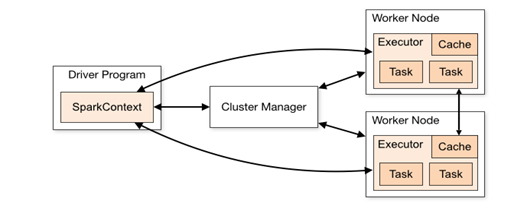
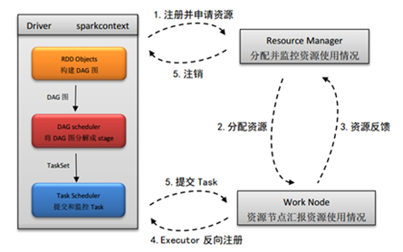

https://www.jianshu.com/p/cedbebfeea8c

# Spark运行原理

0.4082017.02.28 09:18:47字数 1332阅读 13246

前两篇我们讲了spark的基础知识，包括spark的体系结构、执行框架、spark的基本数据类型以及spark中stage的划分等等。本篇要介绍spark运行的原理。包括spark的内部执行机制，spark的基本数据类型RDD的执行流程。

# 1. Spark内部执行机制

## 1.1 内部执行流程

spark的内部执行机制在[《spark基础•下篇》](https://www.jianshu.com/p/fe54ec82d360)已有介绍，此处再简单介绍下。
 　　如下图1为分布式集群上spark应用程序的一般执行框架。主要由sparkcontext（spark上下文）、cluster  manager(资源管理器)和▪executor（单个节点的执行进程）。其中cluster  manager负责整个集群的统一资源管理。executor是应用执行的主要进程，内部含有多个task线程以及内存空间。

、

图1 spark分布式部署图

 　　详细流程图如下图2:

图2 详细流程图

- (1)   应用程序在使用spark-submit提交后，根据提交时的参数设置（deploy  mode）在相应位置初始化sparkcontext，即spark的运行环境，并创建DAG Scheduler和Task  Scheduer，Driver根据应用程序执行代码，将整个程序根据action算子划分成多个job，每个job内部构建DAG图，DAG  Scheduler将DAG图划分为多个stage，同时每个stage内部划分为多个task，DAG  Scheduler将taskset传给Task Scheduer，Task  Scheduer负责集群上task的调度。至于stage和task的关系以及是如何划分的我们后面再详细讲。
- (2)   Driver根据sparkcontext中的资源需求向resource manager申请资源，包括executor数及内存资源。
- (3)   资源管理器收到请求后在满足条件的work node节点上创建executor进程。
- (4)   Executor创建完成后会向driver反向注册，以便driver可以分配task给他执行。
- (5)   当程序执行完后，driver向resource manager注销所申请的资源。

## 1.2 job、stage、task的关系

Job、stage和task是spark任务执行流程中的三个基本单位。其中job是最大的单位，Job是spark应用的action算子催生的；stage是由job拆分，在单个job内是根据shuffle算子来拆分stage的，单个stage内部可根据操作数据的分区数划分成多个task。如下图3所示

图3 job、stage和task的关系图 

# 2. RDD 的执行流程

上一节我们介绍了spark应用程序的大概执行流程，由于spark应用程序中的数据块基本都是RDD，本节我们来看下应用程序中RDD的执行流程。

# 2.1 RDD 从创建到执行

RDD从创建到执行的流程如下图4所示

图4 RDD执行流程

- (1) 首先针对一段应用代码，driver会以action算子为边界生成响应的DAG图
- (2) DAG Scheduler从DAG图的末端开始，以图中的shuffle算子为边界来划分stage，stage划分完成后，将每个stage划分为多个task，DAG Scheduler将taskSet传给Task Scheduler来调用
- (3) Task Scheduler根据一定的调度算法，将接收到的task池中的task分给work node节点中的executor执行
   这里我们看到RDD的执行流程中，DAG Scheduler和Task Scheduler起到非常关键的作用个，因此下面我们来看下DAG Scheduer和Task Scheduler的工作流程。

## 2.2 DAG Scheduler工作流程

DAG Scheduler是一个高级的scheduler  层，他实现了基于stage的调度，他为每一个job划分stage，并将单个stage分成多个task，然后他会将stage作为taskSet提交给底层的Task  Scheduler，由Task Scheduler执行。
 DAG的工作原理如下图5：

图5 DAG Scheduler工作流程

　　针对左边的一段代码，DAG  Scheduler根据collect（action算子）将其划分到一个job中，在此job内部，划分stage，如上右图所示。DAG  Scheduler在DAG图中从末端开始查找shuffle算子，上图中将reduceByKey为stage的分界，shuffle算子只有一个，因此分成两个stage。前一个stage中，RDD在map完成以后执行shuffle  write将结果写到内存或磁盘上，后一个stage首先执行shuffle read读取数据在执行reduceByKey，即shuffle操作。

## 2.3 TASK Scheduler工作流程

Task Scheduler是sparkContext中除了DAG Scheduler的另一个非常重要的调度器，task  Scheduler负责将DAGS cheduer产生的task调度到executor中执行。如下图6所示，Task Scheduler  负责将TaskSetPool中的task调度到executor中执行，一般的调度模式是FIFO（先进先出），也可以按照FAIR（公平调度）的调度模式，具体根据配置而定。其中FIFO：顾名思义是先进先出队列的调度模式，而FAIR则是根据权重来判断，权重可以根据资源的占用率来分，如可设占用较少资源的task的权重较高。这样就可以在资源较少时，调用后来的权重较高的task先执行了。至于每个executor中同时执行的task数则是由分配给每个executor中cpu的核数决定的。

图6 TaskScheduler的工作流程