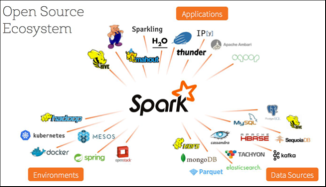
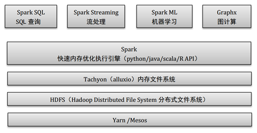
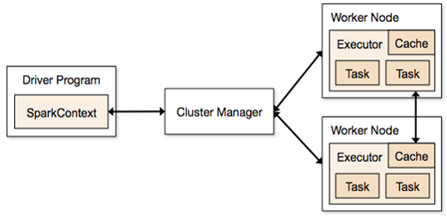

# Spark 基础（上篇）

https://www.jianshu.com/p/2358cc790049

2017.02.19 21:56:26字数 1282阅读 2159

Spark 是专为大规模数据处理而设计的快速通用的计算引擎，是apache的一个开源项目。是一种跟hadoop相似的通用分布式并行计算框架，但是两者之间还存在一些不同之处。spark是一种基于内存计算的分布式执行框架，在执行速度上大大优于hadoop.

# 1. spark的历史

- 2009年，spark诞生于加州大学伯克利分校AMPLab.
- 2010和2012年关于spark的两篇论文发表：
   M. Zaharia, M. Chowdhury, M. J. Franklin, S. Shenker, and I. Stoica,  “Spark: cluster computing with working sets,” in Proceedings of the 2nd  USENIX conference on Hot topics in cloud computing, 2010, pp. 10–10.
   M. Zaharia, M. Chowdhury, T. Das, A. Dave, J. Ma, M. McCauley, M. J.  Franklin, S. Shenker, and I. Stoica, “Resilient distributed datasets: A  fault-tolerant abstraction for in- memory cluster computing,” in  Proceedings of the 9th USENIX conference on Networked Systems Design and  Implementation, 2012, pp. 2–2.
- 2013年，在GitHub上成立了Spark开发社区并成为Apache孵化项目。
- 2014年2月，该项目成为Apache顶级项目。
- 2014年5月30日，Spark 1.0.0版正式上线。
- 至2016年底，spark的最新版本2.1.0已发布上线。
- 截止目前，Spark官方维护运营公司Databricks已经组织并举办了四年Spark Summit技术峰会。

# 2. spark的特点

- 处理速度快
   　　随着信息技术的发展，数据也以惊人的数据在增长，而数据处理的速度也成为人们越来越关注的话题。由于spark支持内存级计算功能，因此spark执行速度要远远高于hadoop
- 多语言、多API支持
   　　Spark支持多语言。Spark允许Java、Scala、Python及R，这允许更多的开发者在自己熟悉的语言环境下进行工作，普及了Spark的应用范围。
- **多业务场景支持**
   　　提供了对**etl、流处理、机器学习**和**图计算**等几种主流数据处理场景的支持
- 开源生态环境支持
   　　拥有广泛的开源生态环境的支持，底层数据源部分包括hdfs、**cassandra**、**hbase**以及alluxio等等，拥有yarn、mesos等分布式框架的支持，如下图所示：

图1. Spark开源生态系统

# 3. spark的体系结构

Spark主要包括Spark Core和在Spark Core基础之上建立的应用框架Spark SQL、Spark Streaming、MLlib和GraphX.
 　　Core库中主要包括上下文（Spark  Context）、抽象数据集（RDD、DataFrame和DataSet）、调度器（Scheduler）、洗牌（shuffle）和序列化器（Serializer）等。Spark系统中的计算、IO、调度和shuffle等系统基本功能都在其中。
 　　在Core库之上就根据业务需求分为用于交互式查询的SQL、实时流处理Streaming、机器学习Mllib和图计算GraphX四大框架，除此外还有一些其他实验性项目如Tachyon、BlinkDB和Tungsten等。Hdfs是Spark主要应用的持久化存储系统。Spark  体系结构如下图所示：

图2. Spark 体系结构

# 4. spark 执行框架

spark应用程序运行在分布式集群上，通过**集群管理器（cluster manger）**将**驱动程序（driver program）**节点跟**工作节点（work node）**相连，实现分布式并行工作。如下图所示：

图3. spark 执行流程

创建spark应用程序时，首先要创建sparkContext，**SparkContext** 允许驱动程序（spark  driver）通过资源管理器访问集群。同时sparkContext还存有**来自sparkConf的配置信息**。这些配置信息用于分配集群资源，比如worker节点运行的executors  的number, memory 大小和cores等等。驱动程序将这些配置信息通知给集群管理器（cluster  manager），集群管理器收到配置信息后，在集群上根据程序配置的executor number给应用程序寻找相应个数的工作节点（work  node）。并在每个工作节点创建一个executor（作为单个执行单元），每个executor根据程序的配置信息分配响应的内存空间（如shuffle内存和存储内存等等）。
 　　程序执行时，根据rdd（弹性分布式数据集—spark程序中数据的基本类型）中分区的数量将每个stag（程序的每个执行步骤，以shuffle为边界）分成相同数目的task，分到各个executor中去执行。每个executor中一次执行的task数量是由程序调用时给executor配置的核数决定的。
 　　本篇我们大致介绍下spark的发展历史、spark的特点以及spark的组成框架，让不熟悉spark的朋友对spark有一个简单的了解。如果您已经对spark有些了解，可继续看spark基础的下篇。在下篇中，将给大家介绍spark任务调度的详细流程、spark的基本数据结构：rdd、dataframe以及dataset、以及spark的基本执行单元stage的划分。