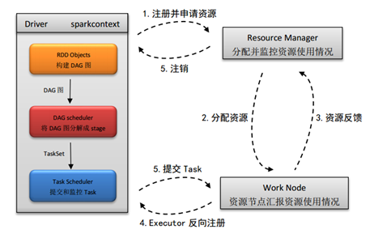
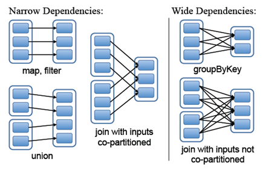
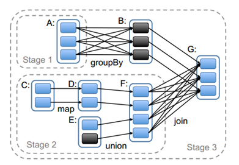

https://www.jianshu.com/p/fe54ec82d360

# Spark 基础（下篇）

0.152017.02.19 21:57:02字数 1293阅读 3069

上篇介绍了spark的突出特点以及基本框架，下面给大家介绍下spark的基本数据结构、spark任务调度的详细流程以及spark中stage的划分。

# ５. spark的基本数据类型

RDD、DataFrame和DataSet可以说是spark独有的三种基本的数据类型。Spark的核心概念是RDD  (resilientdistributed  dataset)，指的是一个只读的，可分区的分布式数据集，这个数据集的全部或部分可以缓存在内存中，在多次计算间重用。DataFrame是一个以RDD为基础的，但却是一种类似二维数据表的一种分布式数据集。与RDD不同的是，前者带有schema元信息，即DataFrame所表示的二维表数据集的每一列都带有名称和类型。这样，spark就可以使用sql操作dataframe，像操作数据库中的表一样。目前，spark   sql支持大多数的sql数据库的操作。Dataset可以认为是DataFrame的一个特例，主要区别是Dataset每一个record存储的是一个强类型值而不是一个Row。后面版本DataFrame会继承DataSet，DataFrame和DataSet可以相互转化，df.as[ElementType]这样可以把DataFrame转化为DataSet，ds.toDF()这样可以把DataSet转化为DataFrame。创建Dataframe的代码如下所示：

```cpp
val df = spark.read.json("examples/src/main/resources/people.json")

// Displays the content of the DataFrame to stdout
df.show()
// +----+-------+
// | age|   name|
// +----+-------+
// |null|Michael|
// |  30|   Andy|
// |  19| Justin|
// +----+-------+
```

创建Ｄataset的代码如下所示：

```cpp
// Note: Case classes in Scala 2.10 can support only up to 22 fields. To work around this limit,
// you can use custom classes that implement the Product interface
case class Person(name: String, age: Long)

// Encoders are created for case classes
val caseClassDS = Seq(Person("Andy", 32)).toDS()
caseClassDS.show()
// +----+---+
// |name|age|
// +----+---+
// |Andy| 32|
// +----+---+

// Encoders for most common types are automatically provided by importing spark.implicits._
val primitiveDS = Seq(1, 2, 3).toDS()
primitiveDS.map(_ + 1).collect() // Returns: Array(2, 3, 4)

// DataFrames can be converted to a Dataset by providing a class. Mapping will be done by name
val path = "examples/src/main/resources/people.json"
val peopleDS = spark.read.json(path).as[Person]
peopleDS.show()
// +----+-------+
// | age|   name|
// +----+-------+
// |null|Michael|
// |  30|   Andy|
// |  19| Justin|
// +----+-------+
```

# 6. spark scheduler（spark任务调度）

(1)  在使用spark-summit提交spark程序后，根据提交时指定（deploy-mode）的位置，创建driver进程，driver进程根据sparkconf中的配置，初始化sparkcontext。Sparkcontext的启动后，创建DAG  Scheduler（将DAG图分解成stage）和Task Scheduler（提交和监控task）两个调度模块。
 　　(2) driver进程根据配置参数向resource  manager（资源管理器）申请资源（主要是用来执行的executor），resource  manager接到到了Application的注册请求之后，会使用自己的资源调度算法，在spark集群的worker上，通知worker为application启动多个Executor。
 　　(3) executor创建后，会向resource manager进行资源及状态反馈，以便resource manager对executor进行状态监控，如监控到有失败的executor，则会立即重新创建。
 　　(4) Executor会向taskScheduler反向注册，以便获取taskScheduler分配的task。
 　　(5)  Driver完成SparkContext初始化，继续执行application程序，当执行到Action时，就会创建Job。并且由DAGScheduler将Job划分多个Stage,每个Stage  由TaskSet  组成，并将TaskSet提交给taskScheduler,taskScheduler把TaskSet中的task依次提交给Executor,  Executor在接收到task之后，会使用taskRunner（封装task的线程池）来封装task,然后，从Executor的线程池中取出一个线程来执行task。
 　　　就这样Spark的每个Stage被作为TaskSet提交给Executor执行，每个Task对应一个RDD的partition,执行我们的定义的算子和函数。直到所有操作执行完为止。如下图所示：




图4. Spark 任务调度流程

# 7. Spark作业调度中stage划分

Spark在接收到提交的作业后，DAGScheduler会根据RDD之间的依赖关系将作业划分成多个stage，DAGSchedule在将划分的stage提交给TASKSchedule，TASKSchedule将每个stage分成多个task，交给executor执行。task的个数等于stage末端的RDD的分区个数。因此对了解stage的划分尤为重要。
 　　在spark中，RDD之间的依赖关系有两种：一种是窄依赖，一种是宽依赖。窄依赖的描述是：父RDD的分区最多只会被子RDD的一个分区使用。宽依赖是：父RDD的一个分区会被子RDD的多个分区使用。如下图所示：




图5. RDD的两种依赖关系


　　上图中，以一竖线作为分界，左边是窄依赖，右边是宽依赖。
 　　Stage的划分不仅根据RDD的依赖关系，还有一个原则是将依赖链断开，每个stage内部可以并行运行，整个作业按照stage顺序依次执行，最终完成整个Job。

实际划分时，DAGScheduler就是根据DAG图，从图的末端逆向遍历整个依赖链，一般是以一次shuffle为边界来划分的。一般划分stage是从程序执行流程的最后往前划分，遇到宽依赖就断开，遇到窄依赖就将将其加入当前stage中。一个典型的RDD   Graph如下图所示：其中实线框是RDD，RDD内的实心矩形是各个分区，实线箭头表示父子分区间依赖关系，虚线框表示stage。针对下图流程首先根据最后一步join（宽依赖）操作来作为划分stage的边界，再往左走，A和B之间有个group  by也为宽依赖，也可作为stage划分的边界，所以我们将下图划分为三个stage。




图6. Spark中的Stage划分示例