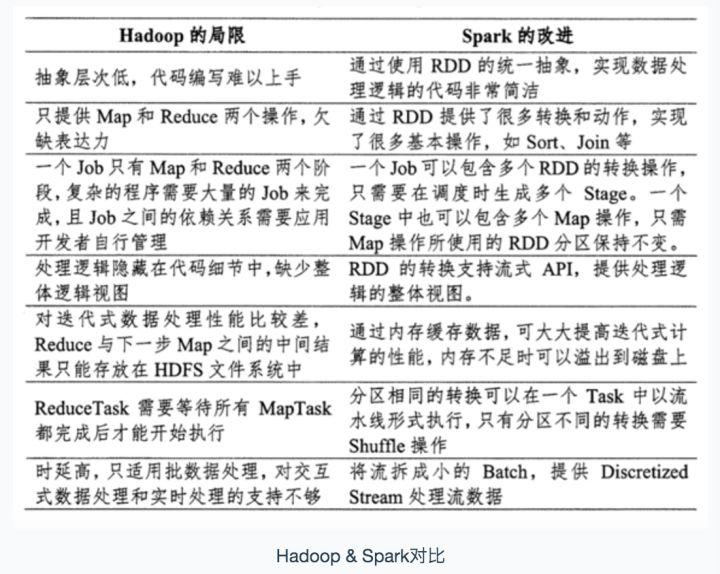
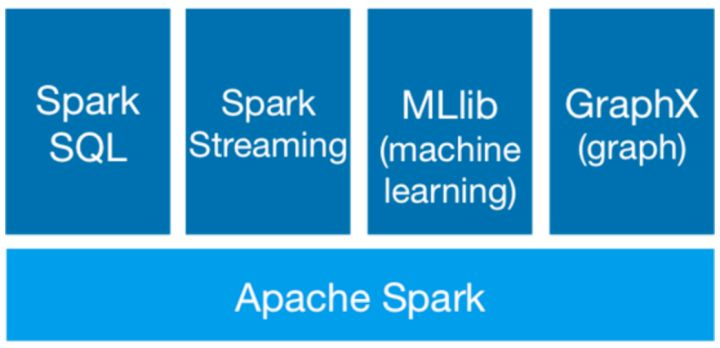
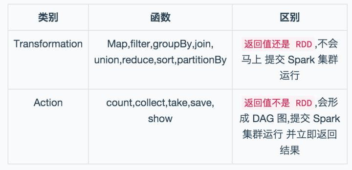
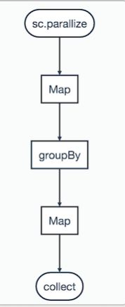
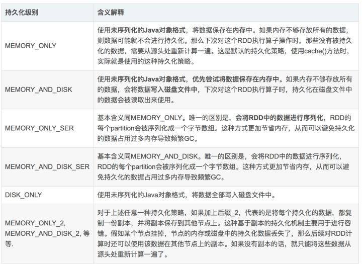
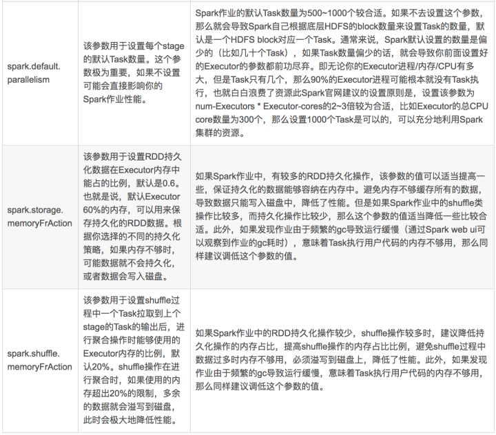
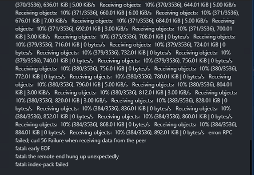

# Spark 学习: spark 原理简述

https://zhuanlan.zhihu.com/p/34436165


主要介绍下自己在学习 spark 当中的一些理解和学习过程中踩到的坑，对 spark 时间效率优化的点做个总结，各位大佬轻拍。


## # Spark 原理简述

> Spark 是使用 scala 实现的基于内存计算的大数据开源集群计算环境.提供了 java,scala, python,R 等语言的调用接口.

------


------

## 1 引言

## 1.1 Hadoop 和 Spark 的关系

　　  Google 在 2003 年和 2004 年先后发表了 Google 文件系统 GFS 和 MapReduce 编程模型两篇文章,.  基于这两篇开源文档,06 年 Nutch 项目子项目之一的 Hadoop 实现了两个强有力的开源产品:HDFS 和 MapReduce.  Hadoop 成为了典型的大数据批量处理架构,由 HDFS 负责静态数据的存储,并通过 MapReduce  将计算逻辑分配到各数据节点进行数据计算和价值发现.之后以 HDFS 和 MapReduce 为基础建立了很多项目,形成了 Hadoop 生态圈.

　　而 Spark 则是UC Berkeley AMP lab (加州大学伯克利分校AMP实验室)所开源的类Hadoop MapReduce的通用并行框架, 专门用于大数据量下的迭代式计算.是为了跟 **Hadoop 配合**而开发出来的,不是为了取代  Hadoop, Spark 运算比 Hadoop 的 MapReduce 框架快的原因是因为 Hadoop 在一次 MapReduce  运算之后,会将数据的运算结果从内存写入到磁盘中,第二次 Mapredue 运算时在从磁盘中读取数据,所以其瓶颈在2次运算间的多余 IO 消耗.  Spark 则是将数据一直缓存在内存中,直到计算得到最后的结果,再将结果写入到磁盘,所以多次运算的情况下, Spark 是比较快的.  其优化了迭代式工作负载[^demo_zongshu].
具体区别如下:




　　伯克利大学将 Spark 的整个生态系统成为 伯克利数据分析栈(BDAS),在核心框架 Spark 的基础上,主要提供四个范畴的计算框架:



\- Spark SQL: 提供了类 SQL 的查询,返回 Spark-DataFrame 的数据结构(类似 Hive)
\- Spark Streaming: 流式计算,主要用于处理线上实时时序数据(类似 storm)
\- MLlib: 提供机器学习的各种模型和调优
\- GraphX: 提供基于图的算法,如 PageRank

关于四个模块更详细的可以参见[^demo_mokuai]这篇博文. 后面介绍的内容主要是关于 MLlib 模块方面的.
　　
Spark 的主要特点还包括:
\- (1)提供 Cache 机制来支持需要反复迭代计算或者多次数据共享,减少数据读取的 IO 开销;
\- (2)提供了一套支持 DAG 图的分布式并行计算的编程框架,减少多次计算之间中间结果写到 Hdfs 的开销;
\- (3)使用多线程池模型减少 Task 启动开稍, shuffle 过程中避免不必要的 sort 操作并减少磁盘 IO 操作。(Hadoop 的 Map 和 reduce 之间的 shuffle 需要 sort)

------

## 2 Spark 系统架构

首先明确相关术语[^demo_shuyu]:
\- **应用程序(Application)**: 基于Spark的用户程序，包含了一个Driver Program 和集群中多个的Executor；
\- **驱动(Driver)**: 运行Application的main()函数并且创建SparkContext;
\- **执行单元(Executor)**: 是为某Application运行在Worker Node上的一个进程，该进程负责运行Task，并且负责将数据存在内存或者磁盘上，每个Application都有各自独立的Executors;
\- **集群管理程序(Cluster Manager)**:  在集群上获取资源的外部服务(例如：Local、Standalone、Mesos或Yarn等集群管理系统)；
\- **操作(Operation)**: 作用于RDD的各种操作分为Transformation和Action.

整个  Spark 集群中,分为 Master 节点与 worker 节点,,其中 Master 节点上常驻 Master 守护进程和 Driver  进程, Master 负责将串行任务变成可并行执行的任务集Tasks, 同时还负责出错问题处理等,而 Worker 节点上常驻 Worker  守护进程, Master 节点与 Worker 节点分工不同, Master 负载管理全部的 Worker 节点,而 Worker 节点负责**执行任务**.
　　Driver 的功能是创建 SparkContext, 负责执行用户写的 Application 的 main 函数进程,Application 就是用户写的程序.
Spark 支持不同的运行模式,包括Local, Standalone,Mesoses,Yarn 模式.不同的模式可能会将 Driver 调度到不同的节点上执行.**集群管理模式里, local 一般用于本地调试.**
　　每个 Worker 上存在一个或多个 Executor 进程,该对象拥有一个线程池,每个线程负责一个 Task 任务的执行.根据 Executor 上 CPU-core 的数量,其每个时间可以并行多个 跟 core 一样数量的 Task[^demo*pingtai].**Task 任务即为具体执行的 Spark 程序的任务.*** 


## 2.1 spark 运行原理

一开始看不懂的话可以看完第三和第四章再回来看.
**底层详细细节介绍:**
　　我们使用spark-submit提交一个Spark作业之后，这个作业就会启动一个对应的Driver进程。根据你使用的部署模式（deploy-mode）不同，Driver进程可能在本地启动，也可能在集群中某个工作节点上启动。而Driver进程要做的第一件事情，就是向集群管理器（可以是Spark   Standalone集群，也可以是其他的资源管理集群，美团•大众点评使用的是YARN作为资源管理集群）申请运行Spark作业需要使用的资源，这里的资源指的就是Executor进程。YARN集群管理器会根据我们为Spark作业设置的资源参数，在各个工作节点上，启动一定数量的Executor进程，每个Executor进程都占有一定数量的内存和CPU  core。
　　在申请到了作业执行所需的资源之后，Driver进程就会开始调度和执行我们编写的作业代码了。Driver进程会将我们编写的Spark作业代码分拆为多个stage，每个stage执行一部分代码片段，并为每个stage创建一批Task，然后将这些Task分配到各个Executor进程中执行。Task是最小的计算单元，负责执行一模一样的计算逻辑（也就是我们自己编写的某个代码片段），只是每个Task处理的数据不同而已。一个stage的所有Task都执行完毕之后，会在各个节点本地的磁盘文件中写入计算中间结果，然后Driver就会调度运行下一个stage。下一个stage的Task的输入数据就是上一个stage输出的中间结果。如此循环往复，直到将我们自己编写的代码逻辑全部执行完，并且计算完所有的数据，得到我们想要的结果为止。
　　Spark是根据shuffle类算子来进行stage的划分。如果我们的代码中执行了某个shuffle类算子（比如reduceByKey、join等），那么就会在该算子处，划分出一个stage界限来。可以大致理解为，shuffle算子执行之前的代码会被划分为一个stage，shuffle算子执行以及之后的代码会被划分为下一个stage。因此一个stage刚开始执行的时候，它的每个Task可能都会从上一个stage的Task所在的节点，去通过网络传输拉取需要自己处理的所有key，然后对拉取到的所有相同的key使用我们自己编写的算子函数执行聚合操作（比如reduceByKey()算子接收的函数）。这个过程就是shuffle。
　　当我们在代码中执行了cache/persist等持久化操作时，根据我们选择的持久化级别的不同，每个Task计算出来的数据也会保存到Executor进程的内存或者所在节点的磁盘文件中。
　　因此Executor的内存主要分为三块：第一块是让Task执行我们自己编写的代码时使用，默认是占Executor总内存的20%；第二块是让Task通过shuffle过程拉取了上一个stage的Task的输出后，进行聚合等操作时使用，默认也是占Executor总内存的20%；第三块是让RDD持久化时使用，默认占Executor总内存的60%。
　　Task的执行速度是跟每个Executor进程的CPU  core数量有直接关系的。一个CPU  core同一时间只能执行一个线程。而每个Executor进程上分配到的多个Task，都是以每个Task一条线程的方式，多线程并发运行的。如果CPU  core数量比较充足，而且分配到的Task数量比较合理，那么通常来说，可以比较快速和高效地执行完这些Task线程。
　　以上就是Spark作业的基本运行原理的说明.

> 　　在实际编程中,我们不需关心以上调度细节.只需使用 Spark 提供的指定语言的编程接口调用相应的 API 即可.
>   　　**在 Spark API 中**,  一个 应用(Application) 对应一个 SparkContext 的实例。一个 应用 可以用于单个 Job，或者分开的多个 Job 的  session，或者响应请求的长时间生存的服务器。与 MapReduce 不同的是，一个 应用 的进程（我们称之为  Executor)，会一直在集群上运行，即使当时没有 Job 在上面运行。
>   　　而调用一个Spark内部的 Action 会产生一个  Spark job 来完成它。 为了确定这些job实际的内容，Spark 检查 RDD 的DAG再计算出执行 plan 。这个 plan  以最远端的 RDD 为起点（最远端指的是对外没有依赖的 RDD 或者 数据已经缓存下来的 RDD），产生结果 RDD 的 Action 为结束  。并根据是否发生 shuffle 划分 DAG 的 stage.

```scala
// parameter
val appName = "RetailLocAdjust"
val master = "local"   // 选择模式
val conf = new SparkConf().setMaster(master).setAppName(appName)
// 启动一个 SparkContext Application
val sc = new SparkContext(conf)
val rdd = sc.textFile("path/...")
```

　　要启动 Spark 运行程序主要有两种方式:一种是使用 spark-submit 将脚本文件提交,一种是打开 Spark 跟某种特定语言的解释器,如:
\- spark-shell: 启动了 Spark 的 scala 解释器.
\- pyspark: 启动了 Spark 的 python 解释器.
\- sparkR: 启动了 Spark 的 R 解释器.
`(以上解释器位于spark 的 bin 目录下)`

------

## 3 RDD 初识

　　RDD(Resilent Distributed Datasets)俗称弹性分布式数据集,是 Spark 底层的分布式存储的数据结构,可以说是 Spark 的核心, **Spark API 的所有操作都是基于 RDD 的**.  数据不只存储在一台机器上,而是分布在多台机器上,实现数据计算的并行化.弹性表明数据丢失时,可以进行重建.在Spark  1.5版以后,新增了数据结构 Spark-DataFrame,仿造的 R 和 python 的类 SQL 结构-DataFrame, 底层为  RDD, 能够让数据从业人员更好的操作 RDD.
　　在Spark 的设计思想中,为了减少网络及磁盘 IO  开销,需要设计出一种新的容错方式,于是才诞生了新的数据结构 RDD. RDD 是一种只读的数据块,可以从外部数据转换而来,你可以对RDD  进行函数操作(Operation),包括 Transformation 和 Action. 在这里只读表示当你对一个 RDD  进行了操作,那么结果将会是一个新的 RDD, 这种情况放在代码里,假设变换前后都是使用同一个变量表示这一 RDD,RDD  里面的数据并不是真实的数据,而是一些元数据信息,记录了该 RDD 是通过哪些 Transformation 得到的,在计算机中使用  lineage 来表示这种血缘结构,lineage 形成一个有向无环图 DAG, 整个计算过程中,将不需要将中间结果落地到 HDFS  进行容错,加入某个节点出错,则只需要通过 lineage 关系重新计算即可.

**1).**RDD 主要具有如下特点:
\- 1.它是在集群节点上的不可变的、已分区的集合对象;
\- 2.通过并行转换的方式来创建(如 Map、 filter、join 等);
\- 3.失败自动重建;
\- 4.可以控制存储级别(内存、磁盘等)来进行重用;
\- 5.必须是可序列化的;
\- 6.是静态类型的(只读)。

**2).**RDD 的创建方式主要有2种:
\-  并行化(Parallelizing)一个已经存在与驱动程序(Driver Program)中的集合如set、list;
\-  读取外部存储系统上的一个数据集，比如HDFS、Hive、HBase,或者任何提供了Hadoop InputFormat的数据源.也可以从本地读取 txt、csv 等数据集

**3).**RDD 的操作函数(operation)主要分为2种类型 Transformation 和 Action.



Transformation  操作不是马上提交 Spark 集群执行的,Spark 在遇到 Transformation  操作时只会记录需要这样的操作,并不会去执行,需要等到有 Action 操作的时候才会真正启动计算过程进行计算.针对每个 Action,Spark  会生成一个 Job, 从数据的创建开始,经过 Transformation, 结尾是 Action 操作.这些操作对应形成一个**有向无环图(DAG)**,形成 DAG 的**先决条件**是最后的函数操作是一个Action.
如下例子:

```scala
val arr = Array("cat", "dog", "lion", "monkey", "mouse")
// create RDD by collection
val rdd = sc.parallize(arr)    
// Map: "cat" -> c, cat
val rdd1 = rdd.Map(x => (x.charAt(0), x))
// groupby same key and count
val rdd2 = rdd1.groupBy(x => x._1).
                Map(x => (x._1, x._2.toList.length))
val result = rdd2.collect()             
print(result)
// output:Array((d,1), (l,1), (m,2))
```

　　首先,当你在解释器里一行行输入的时候,实际上 Spark 并不会立即执行函数,而是当你输入了`val result = rdd2.collect()`的时候, Spark 才会开始计算,从      `sc.parallize(arr)` 到最后的 `collect`,形成一个 Job.



------

## 4.shuffle 和 stage

**shuffle 是划分 DAG 中 stage 的标识,同时影响 Spark 执行速度的关键步骤**.
　　RDD 的 Transformation 函数中,又分为窄依赖(narrow dependency)和宽依赖(wide dependency)的操作.窄依赖跟宽依赖的区别是**是否发生 shuffle(洗牌) 操作**.宽依赖会发生  shuffle 操作. 窄依赖是子 RDD的各个分片(partition)不依赖于其他分片,能够独立计算得到结果,宽依赖指子 RDD  的各个分片会依赖于父RDD 的多个分片,所以会造成父 RDD 的各个分片在集群中重新分片, 看如下两个示例:

```scala
// Map: "cat" -> c, cat
val rdd1 = rdd.Map(x => (x.charAt(0), x))
// groupby same key and count
val rdd2 = rdd1.groupBy(x => x._1).
                Map(x => (x._1, x._2.toList.length))
```

　　第一个 Map 操作将 RDD 里的各个元素进行映射, RDD 的各个数据元素之间不存在依赖,可以在集群的各个内存中独立计算,也就是**并行化**,第二个 groupby 之后的 Map 操作,为了计算相同 key 下的元素个数,需要把相同 key 的元素聚集到同一个 partition 下,所以造成了数据在**内存中的重新分布**,即 shuffle 操作.**shuffle 操作是 spark 中最耗时的操作,应尽量避免不必要的 shuffle**.
　　宽依赖主要有两个过程:  shuffle write 和 shuffle fetch. 类似 Hadoop 的 Map 和 Reduce 阶段.shuffle  write 将 ShuffleMapTask 任务产生的中间结果缓存到内存中, shuffle fetch 获得 ShuffleMapTask  缓存的中间结果进行 ShuffleReduceTask 计算,**这个过程容易造成OutOfMemory**.
　　shuffle 过程内存分配使用 ShuffleMemoryManager 类管理,会针对每个 Task 分配内存,Task 任务完成后通过 Executor 释放空间.这里可以把 Task 理解成不同 key 的数据对应一个 Task. **早期**的内存分配机制使用公平分配,即不同 Task 分配的内存是一样的,但是这样容易造成内存需求过多的 Task 的 OutOfMemory, 从而造成多余的 磁盘 IO 过程,影响整体的效率.(**例:**某一个 key 下的数据明显偏多,但因为大家内存都一样,这一个 key 的数据就容易 OutOfMemory).**1.5版以后**  Task 共用一个内存池,内存池的大小默认为 JVM 最大运行时内存容量的16%,分配机制如下:假如有 N 个  Task,ShuffleMemoryManager 保证每个 Task 溢出之前至少可以申请到1/2N 内存,且至多申请到1/N,N  为当前活动的 shuffle Task 数,因为N 是一直变化的,所以 manager 会一直追踪 Task 数的变化,重新计算队列中的1/N  和1/2N.但是这样仍然容易造成内存需要多的 Task 任务溢出,所以最近有很多**相关的研究是针对 shuffle 过程内存优化的**.


如下 DAG 流程图中,分别读取数据,经过处理后 join 2个 RDD 得到结果


在这个图中,根据是否发生 shuffle 操作能够将其分成如下的 stage 类型:


```
(join 需要针对同一个 key 合并,所以需要 shuffle)`
　　运行到每个 stage 的边界时，数据在父 stage 中按照 Task 写到磁盘上，而在子 stage 中通过网络按照 Task 去读取数据。这些操作会导致很重的网络以及磁盘的I/O，所以 **stage 的边界是非常占资源的，在编写 Spark 程序的时候需要尽量避免的**  。父 stage 中 partition 个数与子 stage 的 partition 个数可能不同，所以那些产生 stage 边界的  Transformation 常常需要接受一个 numPartition 的参数来觉得子 stage 中的数据将被切分为多少个  partition[^demoa]。
`PS:shuffle 操作的时候可以用 combiner 压缩数据,减少 IO 的消耗
```

------

## 5.性能优化

主要是我之前写脚本的时候踩过的一些坑和在网上看到的比较好的调优的方法.

## 5.1 缓存机制和 cache 的意义

　　Spark中对于一个RDD执行多次算子(函数操作)的默认原理是这样的：每次你对一个RDD执行一个算子操作时，都会重新从源头处计算一遍，计算出那个RDD来，然后再对这个RDD执行你的算子操作。这种方式的性能是很差的。
因此对于这种情况，我们的建议是：对多次使用的RDD进行持久化。
　　**首先要认识到的是**, .Spark 本身就是一个基于内存的迭代式计算,**所以如果程序从头到尾只有一个 Action 操作且子 RDD 只依赖于一个父RDD 的话,就不需要使用 cache 这个机制**, RDD 会在内存中一直从头计算到尾,最后才根据你的 Action 操作返回一个值或者保存到相应的磁盘中.需要 cache 的是当存在多个 Action 操作或者依赖于多个 RDD 的时候, 可以在那之前缓存RDD. 如下:

```scala
val rdd = sc.textFile("path/to/file").Map(...).filter(...)
val rdd1 = rdd.Map(x => x+1)
val rdd2 = rdd.Map(x => x+100)
val rdd3 = rdd1.join(rdd2)
rdd3.count()
```

　　在这里 有2个 RDD 依赖于 rdd, 会形成如下的 DAG 图:


　　所以可以在 rdd 生成之后使用 cache 函数对 rdd 进行缓存,这次就不用再从头开始计算了.缓存之后过程如下:


　　除了 cache 函数外,缓存还可以使用 persist, cache 是使用的默认缓存选项,一般默认为Memory*only(内存中缓存), persist 则可以在缓存的时候选择任意一种缓存类型.**事实上, cache 内部调用的是默认的 persist**.持久化的类型*如下:



**是否进行序列化和磁盘写入**,需要充分考虑所分配到的内存资源和可接受的计算时间长短,序列化会减少内存占用,但是反序列化会延长时间,磁盘写入会延长时间,但是会减少内存占用,也许能提高计算速度.此外要认识到:**cache 的 RDD 会一直占用内存,当后期不需要再依赖于他的反复计算的时候,可以使用 unpersist 释放掉.**

## 5.2 shuffle 的优化

　　我们前面说过,进行  shuffle 操作的是是很消耗系统资源的,需要写入到磁盘并通过网络传输,有时还需要对数据进行排序.常见的 Transformation  操作如:repartition，join，cogroup，以及任何 *By 或者 *ByKey 的 Transformation 都需要  shuffle 数据[^demoa],合理的选用操作将降低 shuffle 操作的成本,提高运算速度.具体如下:
\-  当进行联合的规约操作时，避免使用 groupByKey。举个例子，rdd.groupByKey().mapValues(_ .sum) 与  rdd.reduceByKey(_ + _) 执行的结果是一样的，但是前者需要把全部的数据通过网络传递一遍，而后者只需要根据每个 key 局部的  partition 累积结果，在 shuffle 的之后把局部的累积值相加后得到结果.
\- 当输入和输入的类型不一致时，避免使用  reduceByKey。举个例子，我们需要实现为每一个key查找所有不相同的 string。一个方法是利用 map 把每个元素的转换成一个  Set，再使用 reduceByKey 将这些 Set 合并起来[^demoa].
\- 生成新列的时候,避免使用单独生成一列再 join 回来的方式,而是直接在数据上生成.
\- 当需要对两个 RDD 使用 join 的时候,如果其中一个数据集特别小,小到能塞到每个 Executor 单独的内存中的时候,可以不使用 join, 使用 broadcast 操作将小 RDD 复制广播到每个 Executor 的内存里 join.`(broadcast 的用法可以查看官方 API 文档)`

关于 shuffle 更多的介绍可以查看[^demoa]这篇博文.

## 5.3 资源参数调优

这些参数主要在 spark-submit 提交的时候指定,或者写在配置文件中启动.可以通过 spark-submit --help 查看.
具体如下:




　　资源参数的调优，没有一个固定的值，需要根据自己的实际情况（包括Spark作业中的shuffle操作数量、RDD持久化操作数量以及Spark web ui中显示的作业gc情况），同时参考本篇文章中给出的原理以及调优建议，合理地设置上述参数。

## 5.4 小结


- 对需要重复计算的才使用 cache, 同时及时释放掉(unpersist)不再需要使用的 RDD.

- 避免使用 shuffle 运算.需要的时候尽量选取较优方案.

- 合理配置 Executor/Task/core 的参数,合理分配持久化/ shuffle的内存占比,
   

- - **driver-memory**: 1G
  - **executor-memory**: 4~8G(根据实际需求来)
  - **num-executors**: 50~100
  - **executor-cores**: 2~4 
  - **Tasks**: 500~1000


------

## 6.本地搭建 Spark 开发环境

## 6.1 Spark-Scala-IntelliJ

本地搭建 Spark-scala开发环境, 并使用 IntelliJ idea 作为 IDE 的方法,参见下一篇文章: 
`Spark-Scala-IntelliJ开发环境搭建和编译运行流程` 

## 6.2  Spark-Notebook 开发环境

本地搭建 Spark-Notebook(python or scala) 开发环境, 参见下一篇文章:
`Spark-Notebook开发环境搭建.pdf`

------

>   databatman | 凯菜

------

## 参考文献

1. 文献:大数据分析平台建设与应用综述 [↩](https://link.zhihu.com/?target=http%3A//blog.csdn.net/databatman/article/details/53023818%23fnref%3Ademo_zongshu)
2. [Spark学习手册（三）：Spark模块摘读](https://link.zhihu.com/?target=http%3A//www.tuicool.com/articles/nInAZvZ) [↩](https://link.zhihu.com/?target=http%3A//blog.csdn.net/databatman/article/details/53023818%23fnref%3Ademo_mokuai)
3. [Spark入门实战系列–3.Spark编程模型（上）–编程模型及SparkShell实战](https://link.zhihu.com/?target=http%3A//www.cnblogs.com/shishanyuan/p/4721102.html) [↩](https://link.zhihu.com/?target=http%3A//blog.csdn.net/databatman/article/details/53023818%23fnref%3Ademo_shuyu)
4. 文献: 基于 spark 平台推荐系统研究. [↩](https://link.zhihu.com/?target=http%3A//blog.csdn.net/databatman/article/details/53023818%23fnref%3Ademo_pingtai)
5. [Apache Spark源码走读之7 – Standalone部署方式分析](https://link.zhihu.com/?target=http%3A//www.cnblogs.com/hseagle/p/3673147.html) [↩](https://link.zhihu.com/?target=http%3A//blog.csdn.net/databatman/article/details/53023818%23fnref%3Ademo_clus)
6. [Spark性能优化指南——基础篇](https://link.zhihu.com/?target=http%3A//tech.meituan.com/spark-tuning-basic.html) [↩](https://link.zhihu.com/?target=http%3A//blog.csdn.net/databatman/article/details/53023818%23fnref%3Ademo_meituan)
7. [Apache Spark Jobs 性能调优（一）](https://link.zhihu.com/?target=https%3A//www.zybuluo.com/xiaop1987/note/76737) [↩](https://link.zhihu.com/?target=http%3A//blog.csdn.net/databatman/article/details/53023818%23fnref%3Ademoa)
8. [Spark性能优化指南——基础篇](https://link.zhihu.com/?target=http%3A//tech.meituan.com/spark-tuning-basic.html) [↩](https://link.zhihu.com/?target=http%3A//blog.csdn.net/databatman/article/details/53023818%23fnref%3Ademo_meituan)
9. [Apache Spark Jobs 性能调优（一）](https://link.zhihu.com/?target=https%3A//www.zybuluo.com/xiaop1987/note/76737) [↩](https://link.zhihu.com/?target=http%3A//blog.csdn.net/databatman/article/details/53023818%23fnref%3Ademoa)
10. [Apache Spark Jobs 性能调优（一）](https://link.zhihu.com/?target=https%3A//www.zybuluo.com/xiaop1987/note/76737) [↩](https://link.zhihu.com/?target=http%3A//blog.csdn.net/databatman/article/details/53023818%23fnref%3Ademoa)
11. [Apache Spark Jobs 性能调优（一）](https://link.zhihu.com/?target=https%3A//www.zybuluo.com/xiaop1987/note/76737) [↩](https://link.zhihu.com/?target=http%3A//blog.csdn.net/databatman/article/details/53023818%23fnref%3Ademoa)
12. [Spark性能优化指南——基础篇](https://link.zhihu.com/?target=http%3A//tech.meituan.com/spark-tuning-basic.html) [↩](https://link.zhihu.com/?target=http%3A//blog.csdn.net/databatman/article/details/53023818%23fnref%3Ademo_meituan)




